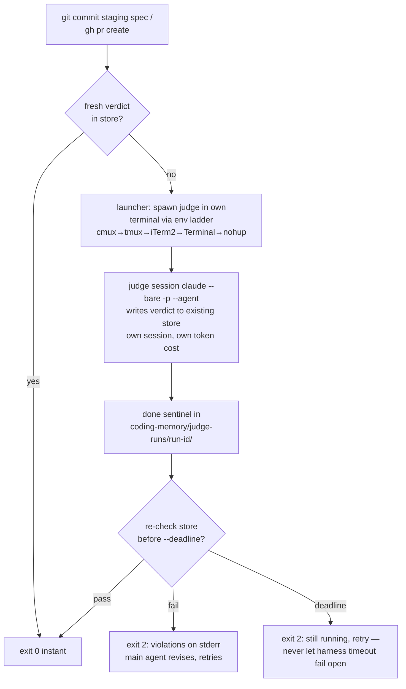

# Brainstorm: Deterministic judge enforcement + per-judge terminal sessions (2026-07-20)

**Status: DESIGN COMPLETE — §1–§4 ALL APPROVED (2026-07-20, resumed session; model gate re-run
at resume: stay on Fable 5). Spec NOT yet written, no code.**
Skill flow: `superpowers:brainstorming` (tasks 1–5 done; next: write spec → self-review →
compliance+observability judges → user review gate → writing-plans).

## The ask (user's words, condensed)

Deterministic, hook-enforced gates for BOTH judges — compliance and observability — so they
*always* run. The user's sample script (terminal-detection ladder + spawn + wait loop) is a
**template for the mechanism, not a trigger spec**: no judge on every implementation commit.
Same moments as today — compliance at spec-done, observability before a PR — but each judge runs
in its **own terminal window and its own Claude session** (own context, own token usage, visually
trackable), never as an in-session Agent-tool subagent from the main window. The main window must
detect their completion.

## Decisions locked with the user

1. **Hook model: verify-store-else-spawn+wait hybrid** (chosen over always-spawn and over
   spawn-then-block-immediately). Fresh verdict in store → instant exit 0. Miss → hook launches
   the judge in its own terminal, waits for a done sentinel, re-checks the store, exits 0/2.
2. **Triggers unchanged in spirit:** compliance fires on `git commit` staging
   `docs/superpowers/specs/*.md` (the script-decidable spec-done moment ADR-0003 said didn't
   exist — this resolves that deferral; ADR-0003 needs an update note). Observability
   (`stage: implementation`) stays on `gh pr create`. Ordinary code commits are untouched.
3. **Approach A chosen** (over hook-only and over verify-only-hooks): shared launcher used by
   both the skills (normal flow) and the hooks (deterministic backstop).

## Component breakdown as presented (awaiting user approval)

1. `bin/judge-launch.sh` (new): one launcher for both judges.
   `--judge compliance --spec <path> --round N [--waived id,id] [--wait [--deadline SECS]]` /
   `--judge observability --stage architecting|implementation`. Terminal ladder from the user's
   template: `CMUX_WORKSPACE_ID` → `TMUX` → `TERM_PROGRAM=iTerm.app` → `Apple_Terminal` →
   headless `nohup` fallback. Runs `claude --bare -p "<prompt>" --agent <judge-name>
   --output-format json` in the new pane/tab/window. Per-run dir
   `coding-memory/judge-runs/<run-id>/`: manifest (judge, stage, repo, branch, sha, pane ref),
   JSON result incl. `total_cost_usd`, `done` sentinel on exit. Judge session writes verdicts to
   the **existing stores** — freshness keys and calibration ledger unbroken.
2. `hooks/spec-guard.sh` (new): PreToolUse/Bash; intercepts `git commit` iff a staged file
   matches `docs/superpowers/specs/*.md`; verifies compliance verdict fresh for the staged spec
   blob sha; miss → launcher `--wait` → re-verify → exit 0, or exit 2 with cited violations on
   stderr (read from the store) so the main agent revises and retries — the revise loop survives,
   driven through the hook.
3. `hooks/judge-guard.sh` (extended): keeps verify logic + `JUDGE_EXEMPT`; gains the same
   miss-branch (launch implementation-stage judge, wait, re-verify).
4. Both `running-the-*` skills: "dispatch subagent (Agent tool)" → "run launcher as background
   Bash task"; at spec-done still both judges in parallel (two windows); main window gets the
   harness background-task notification on each exit, then reads stores.
5. `settings.json`: register spec-guard; judge hooks get explicit `timeout` 900s with launcher
   `--deadline` ~840s BELOW it, so the hook itself exits 2 ("judge still running in pane X —
   retry") before the harness timeout can fire — fail closed under our timer, because a
   **timed-out hook fails OPEN** (verified, see platform facts).
6. Zero-trust note: verdict **store** is the only authority; never parse PASS/FAIL from terminal
   output. The pane is a viewport.

## §2 launcher internals — APPROVED with tweaks (2026-07-20)

- **Runner-script indirection kills the AppleScript injection risk:** launcher materializes
  `prompt.txt` + `run.sh` into the per-run dir; every ladder rung executes only
  `bash <run-dir>/run.sh`. Run-dir path is launcher-generated, asserted `^[A-Za-z0-9/_.-]+$`
  before interpolation, fail closed. `run.sh`: `set -euo pipefail`, cd repo root,
  `trap 'echo $? > done' EXIT` (sentinel on every exit path incl. crash),
  `claude --bare -p "$(cat prompt.txt)" --agent <judge> --output-format json > result.json`.
- **Run-id:** `<UTC ts>-<judge>-<HEAD short sha>-<launcher PID>` (PID makes the parallel
  two-judge spec-done launch collision-free). `manifest.json` written BEFORE spawn (judge,
  stage/spec + staged blob sha, repo, branch, sha, round, waived ids, ladder rung, terminal
  ref, argv). `result.json` keeps `total_cost_usd`.
- **Gitignore `coding-memory/judge-runs/`** (approved): stores stay the sole durable record.
- **Prompt from validated args only** (path-inside-repo, stage enum, round numeric, waived-id
  charset), frozen to `prompt.txt`; `--allowedTools` pinned to the agent's declared tool list.
- **Ladder:** cmux pane → **tmux `split-window -d`** (TWEAK: side-by-side pane, not new
  window; pane id captured) → iTerm2 tab via osascript → Terminal `do script` → headless
  `nohup` (manifest `mode=headless`).
- **Wait mode:** poll sentinel every **10s** (TWEAK, was 2s); deadline 840s / hook timeout
  900s (confirmed as designed). Deadline → exit 3 "still running in <ref>".

## §3 hook decision flow — APPROVED (2026-07-20)

- **spec-guard.sh:** detection = judge-guard's shlex classification (rtk strip, env-assignment
  walk, anchored `git commit` match incl. `git -C` global-option handling; `-C` also redirects
  the staged checks). Fast path: no staged `docs/superpowers/specs/*.md` → silent exit 0.
  Freshness key: repo + spec_path + **staged blob sha** (`git rev-parse ":<path>"` — the index
  blob, what the commit records) + verdict==pass, against the existing compliance store. Miss →
  round = max stored round + 1 → launcher `--wait` → re-check → exit 0, or exit 2 citing
  violations from the store ("revise and retry"); each revision's new blob sha forces a new
  round. Deadline → exit 2 still-running. Fails CLOSED (no python → block); chained-command
  limitation accepted as in judge-guard/git-guard.
- **Recursion guard:** run.sh exports `JUDGE_SESSION=1`; both guards exit 0 when set (judge's
  own session inherits user-global hooks — without this, deadlock-shaped).
- **judge-guard.sh:** unchanged through the exempt/freshness checks; the "no fresh verdict →
  exit 2" terminal branch becomes launch `--stage implementation --wait` → re-check → 0/2.
- **Exemptions (user decision): separate `SPEC_EXEMPT=<reason>`** for the compliance gate,
  parsed like JUDGE_EXEMPT (leading env-assignment), logged; each gate's bypass stays as
  narrow as the gate. Rationale discussed in laymen terms: master-key vs per-door keys.

## Platform facts (claude-code-guide lookup, 2026-07-20)

- `claude --bare -p "<prompt>" --agent <name>` runs a named agent from `~/.claude/agents/`
  headlessly; flags `--model`, `--permission-mode`, `--allowedTools`; each `-p` run is its own
  session with own cost; `--output-format json` includes `total_cost_usd`.
- PreToolUse hook timeout: default **600s**, units seconds, per-hook override, no documented max.
  **Timeout fails OPEN** (tool call proceeds) — the design's own-deadline mitigation exists
  because of this.
- Exit 2 blocks + stderr to Claude (confirmed). JSON `permissionDecision` form offers
  allow/deny/ask + `updatedInput` + `additionalContext` if finer control is wanted.
- **Unverified, must test during implementation:** hooks inheriting terminal env vars
  (`TMUX`, `TERM_PROGRAM`, `CMUX_WORKSPACE_ID`) — undocumented; headless fallback covers a miss,
  but verify empirically before relying on the ladder. Also unverified: loading agent defs from
  file via `--agents`.

## §4 error handling & testing — APPROVED (2026-07-20)

- **Failure paths (closed gate, never a hang):** judge crash → trap still writes sentinel with
  exit code; hook message distinguishes "ran and failed the spec" (violations cited) from
  "crashed" (no verdict, points at `<run-dir>/stderr.log`). Pane killed (SIGKILL, no trap) →
  best-effort per-rung liveness probe (tmux pane exists / headless PID alive) exits early
  "terminated without completing"; 840s deadline is the universal backstop. Concurrency →
  **mkdir-atomic** launch lock per judge+repo+target-key holding the owning run-id; a second
  caller piggyback-waits on the FIRST run's sentinel instead of duplicating; stale-lock break
  re-verifies its justifier (dead owner PID) immediately before breaking (ADR-0005 rules).
  Spawn failure → rung falls through toward headless, failures recorded in manifest; preflight
  (claude on PATH, agent def exists) exits distinct code. Wait exit codes: 0 sentinel /
  3 deadline / other launch-failure — hooks map all non-zero to exit 2 with tailored reasons.
  Store re-read after sentinel skips unparseable (mid-append) lines.
- **Testing:** `spec-guard.test.sh` + `judge-launch.test.sh` alongside the judge-guard harness;
  every regression test validated by MUTATING the code to re-introduce the bug class and
  confirming the test fails; lock tests plant state exactly as the real writer produces it.
  Seams: `SPEC_VERDICTS_FILE`, `JUDGE_LAUNCH_MODE=headless` (force rung), fake `claude` via
  PATH injection writing canned verdicts (full end-to-end with tiny deadlines). Integration
  cases: block-with-violations, pass→allowed, `JUDGE_SESSION=1` short-circuit, `SPEC_EXEMPT`
  logged bypass, deadline expiry, crash-vs-fail distinction. Terminal rungs iTerm2/Terminal/
  cmux: manual live checklist in the branch log (tmux is scriptable); env-inheritance
  platform fact = explicit early spike task in the implementation plan.

## Resume script for next session

1. Design is DONE (§1–§4 approved above — they are the design of record).
2. Hard Model Gate: ASKED AND ANSWERED at the 2026-07-20 checkpoint — **spec phase runs on
   Opus 4.8** (user's call). If the session isn't already on it, prompt the user to `/model`
   Opus 4.8 before writing the spec; do not silently proceed on another tier.
3. New branch off `main` (NOT off `feature/statusline-token-bar`), naming via
   `preparing-pull-requests` — proposed: `feature/judge-terminal-enforcement`.
4. Write spec to `docs/superpowers/specs/<date>-judge-terminal-enforcement-design.md`
   (date of writing), self-review, commit — NOTE: once spec-guard exists this commit moment is
   exactly what it will guard; for now run judges via the current skill procedure
   (`running-the-compliance-judge`, parallel with observability architecting).
5. User review gate → `superpowers:writing-plans`.
6. Implementation notes-to-self: update ADR-0003 (spec-guard deferral resolved) + new ADR for
   this decision (class a — structural); `triaging-new-instructions` already walked → hook tier
   confirmed. NOTE: this brainstorm write-up + CODING_MEMORY updates live on
   `feature/statusline-token-bar` (memory-checkpoint pattern); the spec branch off `main` won't
   contain them — the spec must be self-contained (it is: §1–§4 carry the full design).
