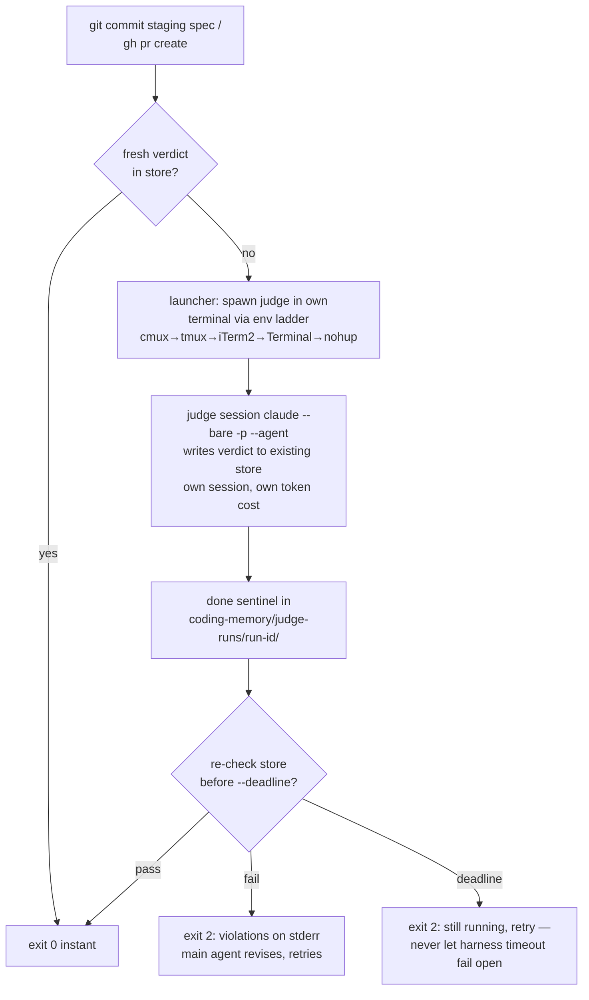

# Brainstorm: Deterministic judge enforcement + per-judge terminal sessions (2026-07-20)

**Status: MID-DESIGN — section 1 of 4 presented, NOT yet approved. No spec written, no code.**
Skill flow: `superpowers:brainstorming` (tasks 1–4 done, task 5 in progress).

## The ask (user's words, condensed)

Deterministic, hook-enforced gates for BOTH judges — compliance and observability — so they
*always* run. The user's sample script (terminal-detection ladder + spawn + wait loop) is a
**template for the mechanism, not a trigger spec**: no judge on every implementation commit.
Same moments as today — compliance at spec-done, observability before a PR — but each judge runs
in its **own terminal window and its own Claude session** (own context, own token usage, visually
trackable), never as an in-session Agent-tool subagent from the main window. The main window must
detect their completion.

## Decisions locked with the user

1. **Hook model: verify-store-else-spawn+wait hybrid** (chosen over always-spawn and over
   spawn-then-block-immediately). Fresh verdict in store → instant exit 0. Miss → hook launches
   the judge in its own terminal, waits for a done sentinel, re-checks the store, exits 0/2.
2. **Triggers unchanged in spirit:** compliance fires on `git commit` staging
   `docs/superpowers/specs/*.md` (the script-decidable spec-done moment ADR-0003 said didn't
   exist — this resolves that deferral; ADR-0003 needs an update note). Observability
   (`stage: implementation`) stays on `gh pr create`. Ordinary code commits are untouched.
3. **Approach A chosen** (over hook-only and over verify-only-hooks): shared launcher used by
   both the skills (normal flow) and the hooks (deterministic backstop).

## Component breakdown as presented (awaiting user approval)

1. `bin/judge-launch.sh` (new): one launcher for both judges.
   `--judge compliance --spec <path> --round N [--waived id,id] [--wait [--deadline SECS]]` /
   `--judge observability --stage architecting|implementation`. Terminal ladder from the user's
   template: `CMUX_WORKSPACE_ID` → `TMUX` → `TERM_PROGRAM=iTerm.app` → `Apple_Terminal` →
   headless `nohup` fallback. Runs `claude --bare -p "<prompt>" --agent <judge-name>
   --output-format json` in the new pane/tab/window. Per-run dir
   `coding-memory/judge-runs/<run-id>/`: manifest (judge, stage, repo, branch, sha, pane ref),
   JSON result incl. `total_cost_usd`, `done` sentinel on exit. Judge session writes verdicts to
   the **existing stores** — freshness keys and calibration ledger unbroken.
2. `hooks/spec-guard.sh` (new): PreToolUse/Bash; intercepts `git commit` iff a staged file
   matches `docs/superpowers/specs/*.md`; verifies compliance verdict fresh for the staged spec
   blob sha; miss → launcher `--wait` → re-verify → exit 0, or exit 2 with cited violations on
   stderr (read from the store) so the main agent revises and retries — the revise loop survives,
   driven through the hook.
3. `hooks/judge-guard.sh` (extended): keeps verify logic + `JUDGE_EXEMPT`; gains the same
   miss-branch (launch implementation-stage judge, wait, re-verify).
4. Both `running-the-*` skills: "dispatch subagent (Agent tool)" → "run launcher as background
   Bash task"; at spec-done still both judges in parallel (two windows); main window gets the
   harness background-task notification on each exit, then reads stores.
5. `settings.json`: register spec-guard; judge hooks get explicit `timeout` 900s with launcher
   `--deadline` ~840s BELOW it, so the hook itself exits 2 ("judge still running in pane X —
   retry") before the harness timeout can fire — fail closed under our timer, because a
   **timed-out hook fails OPEN** (verified, see platform facts).
6. Zero-trust note: verdict **store** is the only authority; never parse PASS/FAIL from terminal
   output. The pane is a viewport.

## Platform facts (claude-code-guide lookup, 2026-07-20)

- `claude --bare -p "<prompt>" --agent <name>` runs a named agent from `~/.claude/agents/`
  headlessly; flags `--model`, `--permission-mode`, `--allowedTools`; each `-p` run is its own
  session with own cost; `--output-format json` includes `total_cost_usd`.
- PreToolUse hook timeout: default **600s**, units seconds, per-hook override, no documented max.
  **Timeout fails OPEN** (tool call proceeds) — the design's own-deadline mitigation exists
  because of this.
- Exit 2 blocks + stderr to Claude (confirmed). JSON `permissionDecision` form offers
  allow/deny/ask + `updatedInput` + `additionalContext` if finer control is wanted.
- **Unverified, must test during implementation:** hooks inheriting terminal env vars
  (`TMUX`, `TERM_PROGRAM`, `CMUX_WORKSPACE_ID`) — undocumented; headless fallback covers a miss,
  but verify empirically before relying on the ladder. Also unverified: loading agent defs from
  file via `--agents`.

## Remaining design sections (unpresented)

- §2 launcher internals & terminal ladder detail (incl. prompt construction, run-id scheme,
  AppleScript quoting for iTerm2/Terminal — the template's `$JUDGE_CMD` interpolation into
  AppleScript is an injection-shaped risk to design around).
- §3 hook decision flow detail (staged-spec detection via `git diff --cached --name-only`,
  freshness re-check, exemption env vars — does compliance get its own `SPEC_EXEMPT`?).
- §4 error handling & testing (judge crash, pane closed mid-run, concurrent runs/lock — ADR-0005
  lock lessons apply: mkdir-atomic, verify-break-against-justifier; test harness alongside
  `judge-guard.test.sh`; falsification-backed per statusline lessons).

## Resume script for next session

1. Model-switch gate (per-task planning check) — ask before continuing design work.
2. Get section-1 approval (component breakdown above), revise if needed.
3. Present §2–§4 one at a time, approval each.
4. Write spec to `docs/superpowers/specs/2026-07-20-judge-terminal-enforcement-design.md`
   (re-date if resumed later), self-review, commit — NOTE: once spec-guard exists this commit
   moment is exactly what it will guard; for now the compliance judge runs via the current
   skill procedure (`running-the-compliance-judge`, parallel with observability architecting).
5. User review gate → `superpowers:writing-plans`.
6. Implementation notes-to-self: update ADR-0003 (spec-guard deferral resolved) + new ADR for
   this decision (class a — structural); `triaging-new-instructions` already walked → hook tier
   confirmed; branch naming via `preparing-pull-requests`; session was on
   `feature/statusline-token-bar` — new work needs its own branch off `main`.
