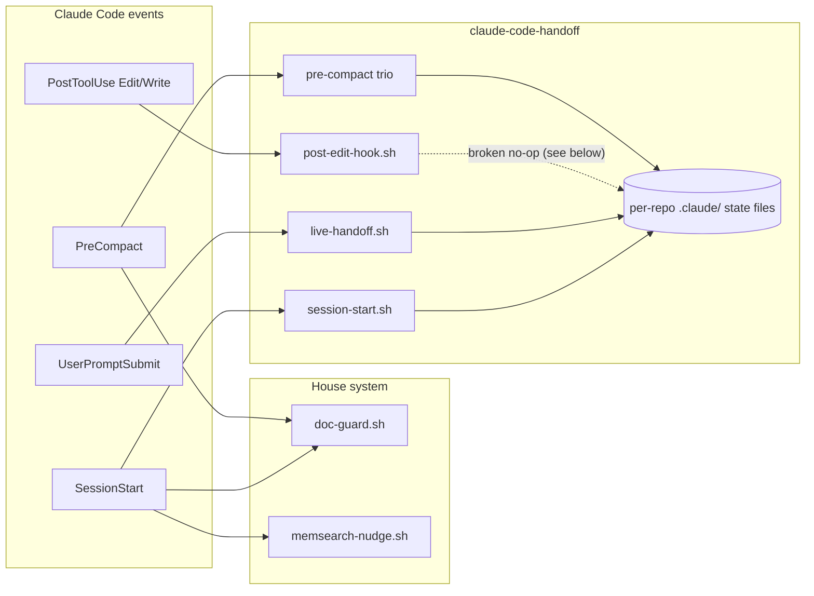

# feature/add-claude-code-handoff — vendored claude-code-handoff install

**Status (2026-07-20):** installed verbatim and committed; awaiting the user's per-feature
cherry-pick between this and the house memory system. Nothing disabled — both systems run.

## What and why

User asked to add https://github.com/Sonovore/claude-code-handoff to the workflow. Triage
(`triaging-new-instructions`) splits it hooks-vs-skill; the overlap analysis against
CODING_MEMORY / doc-guard / memsearch was presented with an adapt-into-existing recommendation,
and the user chose **full verbatim install first, then cherry-pick from a comparison chart**.
Model gate answered: Fable 5.

## Provenance & vetting (supply chain)

- Source: https://github.com/Sonovore/claude-code-handoff @
  **c6cb717f2af559cd2bbb972311a43294e1ffd665**, cloned 2026-07-20.
- All 1,178 lines read before install: plain bash + markdown templates; **no network calls,
  no execution of fetched content, no secrets**. Every vendored file carries a provenance
  header with the pinned SHA.

## Install layout

- `commands/handoff.md` — `/handoff` (4 modes: Context / Task / Bug / Clean). Confirmed live:
  the harness registered the skill immediately after the file landed.
- `hooks/handoff/` — the six scripts: `session-start.sh`, `live-handoff.sh`,
  `post-edit-hook.sh`, `pre-compact.sh`, `pre-compact-handoff.sh`, `proactive-handoff.sh`.
- `settings.json` — four added registrations, `$HOME`-style paths matching house convention:
  SessionStart loader, UserPromptSubmit live directive, PostToolUse (Edit|Write|NotebookEdit)
  tracker, PreCompact trio (re-inject + backup + rewrite directive).
- `.gitignore` — nested `/.claude/` ignored (this repo is itself a git toplevel, so the hooks
  write their session state here). **Other project repos still need their own ignore entries.**

## settings.json dual-version staging

The worktree keeps the deliberately-uncommitted Orca hooks plus the 2026-07-20
`claude-fable-5[1m]` model change; the commit must not include either. Committed blob =
`jq(HEAD settings.json + handoff additions)`, staged via `git hash-object -w` +
`git update-index --cacheinfo`; worktree = `jq(worktree + the same additions)`. Verified the
merge is a pure addition: stripping the added entries from the merged output reproduces the
input byte-for-byte.

## Smoke test (scratch repo, macOS)

All six scripts ran clean. **Confirmed upstream bug:** `live-handoff.sh` creates
`session-state.md` from a template *missing* the `<!-- Files touched this session -->` marker
that `proactive-handoff.sh track_file`'s `sed` targets — so the PostToolUse edit tracker
silently no-ops in real sessions (live-handoff always wins the file-creation race; it fires on
the first user message). The tracker only works after an explicit `proactive-handoff.sh init`.
Left as-is per the verbatim-install decision; flagged on the chart. Also verified:
`session-start.sh` / `pre-compact.sh` hard-fail outside a git repo (`set -e` + bare
`git rev-parse`), so non-git sessions will show hook error noise.

## Comparison chart

Artifact: https://claude.ai/code/artifact/e570411a-795d-4b79-bda2-d0017ad9794e
15 rows across Session start / During session / Checkpoint & handoff / Compaction / Durable
records; verdict chips (NOVEL / OVERLAP / CONFLICT / HOUSE-ONLY / BROKEN) plus click-to-pick
with a copyable summary. Standout novel pieces: the append-only bug-test-log ledger, verbatim
recent-prompts capture, the mode state machine, and the "write for the NEXT context window"
principle. Core tension: gitignored machine-local state files vs committed CODING_MEMORY —
two sources of truth if both stay on.

## Next

User's picks → disable losing hook registrations in `settings.json`, adapt winners (likely
into `managing-session-memory` or new skill homes per triage), per-repo gitignore guidance,
observability judge, PR. The judge is deliberately deferred to PR time — the gate anchors on
`gh pr create`, and judging the intermediate both-systems-on state would be judging a state
the cherry-pick is about to change.
