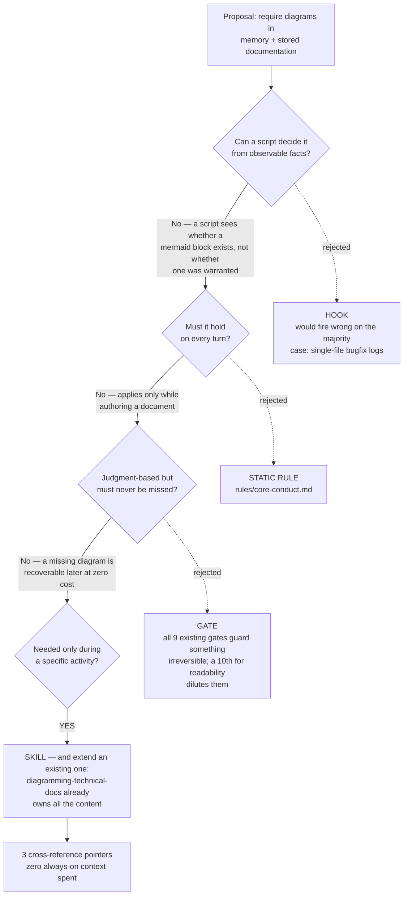

# Branch Implementation Log: docs/diagramming-pointers

**Status:** MERGED (PR #19, 2026-07-20, merge commit `a735fb4`; branch `docs/diagramming-pointers`
from `origin/main` @ b6362ff, 3 commits). Branch **not yet deleted** local or remote.
Judge outcome backfilled `clean`.

## Why

User asked whether a rule already existed requiring visual diagrams in memory and stored
documentation. It half-existed. At the base commit, `diagramming-technical-docs` (PR #12) was
referenced from exactly two places outside its own directory:

- `managing-session-memory:14` — a near-requirement, but scoped strictly to ADRs under `docs/decisions/`.
- `CLAUDE.md:21` — the always-on catalog line.

Nothing named it on the paths that write `CODING_MEMORY.md` or `coding-memory/`. So for branch logs
and decision entries the skill had no trigger, and neither judge rubric scores for diagrams either.
The defect was **reachability**, not missing guidance — the skill's content was already complete.

## The triage

Routed through `triaging-new-instructions`. What it ruled *out* is the substance:

## What landed

- `skills/managing-session-memory/SKILL.md:18` — new bullet. Diagram relocated `coding-memory/`
  detail when it has structure; index itself stays plain pointers so diagrams don't eat the
  ≤200-line budget. **This is the gap the user actually asked about.**
- `skills/writing-specs/SKILL.md:26` — a bullet titled "Diagrams and the required toolchain" that
  named no diagram toolchain.
- `skills/designing-agentic-architecture/SKILL.md:55` — in the DAG section, which prescribed a
  directed acyclic graph and never said to draw one.
- `CODING_MEMORY.md` — open item 4's diagramming half closed; Active Session block updated.

`CLAUDE.md`, `rules/core-conduct.md`, `rules/gates.md` untouched — zero always-on context spent.

## Judge verdict

R1 `84a60bf` **low/high**, no blocking findings. Verdict:
`coding-memory/observability-judge/2026-07-19-docs-diagramming-pointers.md` (JSONL line 18).
outcome: null (backfill on merge).

Judge caught two overstatements in the commit body, corrected in the PR description rather than by
amending (an amend moves HEAD and re-stales the gate — the exact trap PR #18 hit and had to
`JUDGE_EXEMPT` its way out of):

1. Commit claims each pointer "carries the conditional." True of `managing-session-memory:18` only.
   `writing-specs:26` appends to an already-unconditional "include visual aids" bullet, so it
   constrains *format*, not *whether*. `designing-agentic-architecture:55` is imperative, conditioned
   only by sitting inside the DAG section.
2. "Reachable only from the ADR bullet" omitted the always-on `CLAUDE.md:21` catalog line.

## Known weakness — worth watching

`managing-session-memory` is the weakest of the three pointers, and it's the one that motivated the
change. Memory is restored at session *start*; branch logs are written at session *end*, and a
`/compact` in between can drop the skill text before the authoring moment. Partly mitigated (the
skill also triggers at save time), not eliminated.

Compounding it: **this change is unfalsifiable by design.** Nothing can report that it failed —
`validate-diagrams.sh` lints diagrams that exist and structurally cannot flag a warranted-but-absent
one, which is the same reason the hook was correctly rejected.

**Evidence to watch:** the next two or three `coding-memory/` branch logs. If one lands with real
structure and no diagram, move the pointer out of the index-description bullet and into the
save-time procedure section. This log is itself the first data point — it carries a diagram.

## ADR

`docs/decisions/0004-diagramming-reachability-not-enforcement.md` — written at the user's direction
after the judge flagged that a triage explicitly rejecting both a hook and a gate is a class-(a)
structural decision. Carries a Mermaid **mindmap** of the four tiers and why each was rejected
(complementing the flowchart above, per the skill's "tradeoff analysis → mindmap" guidance).

The ADR records one thing this log doesn't: the **escalation path is a gate stub, never the hook.**
The hook's rejection is structural — a script cannot judge whether a diagram was warranted, and that
does not change with more evidence. The gate's rejection is a cost/benefit call that new evidence
could legitimately overturn.

`docs/decisions/` already held ADRs 0001-0003, so no directory adoption was needed. The other half of
open item 4 — retiring `coding-memory/decisions.md` as the older equivalent — stays open.
