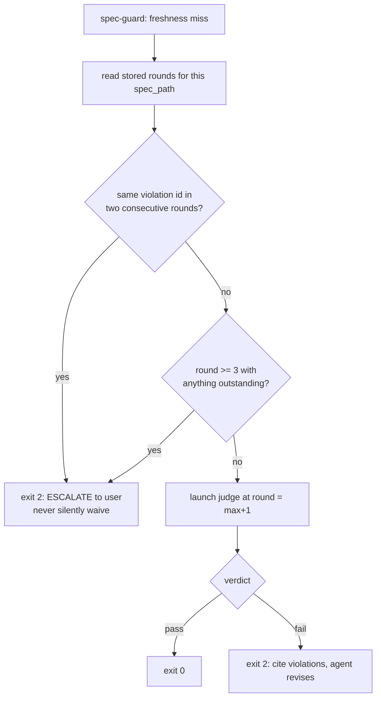
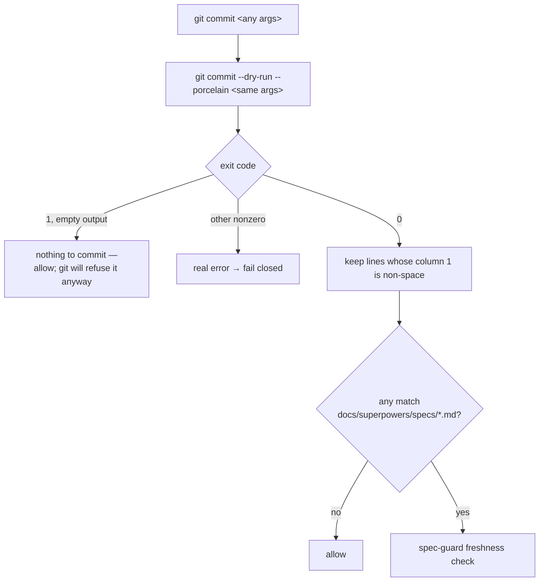

# Branch log: feature/judge-terminal-enforcement

Cut off `main` 2026-07-20. Implements the approved design in
`coding-memory/brainstorms/2026-07-20-judge-terminal-enforcement.md` (§1–§4, approved 2026-07-20).

## State

**Spec phase, round 3 JUDGED @ `60abc86`: compliance fail (1 violation, third consecutive round of
the same id) → escalation #2 fired → user directed both fixes, nothing waived. Round 4 revision NOT
yet written.**

- Spec: `docs/superpowers/specs/2026-07-20-judge-terminal-enforcement-design.md`
  (1027 lines, 3 Mermaid blocks, validator PASS).
- Base established by merging the brainstorm commits into `main` (user's call over cherry-pick),
  pushed as `48f02d4` + `69ecd12`. Branch inherits the design; the spec still stands alone.

| Round | Spec commit | Compliance | Observability |
|---|---|---|---|
| 1 | `8aed77a` (464 ln) | **fail** — 5 violations, high | risk=medium, 3 concerns |
| 2 | `ccd02fc` (855 ln) | **fail** — 3 violations, high (2 persisted, 1 new) | risk=medium, high |
| 3 | `60abc86` (1036 ln) | **fail** — 1 violation, high (2 closed, **1 persisted 3x**) | risk=medium, high |
| 4 | not yet written | — | — |

## Round 1 verdicts (2026-07-20)

| Judge | Result | Detail |
|---|---|---|
| compliance (blocking) | **fail**, 5 violations, confidence high | `coding-memory/compliance-judge/2026-07-20-judge-terminal-enforcement-design.md` |
| observability (advisory, architecting) | risk=medium, confidence=high, 0 fail / 3 concern | `coding-memory/observability-judge/2026-07-20-feature-judge-terminal-enforcement.md` |

**Both judges independently found the same hole** — the revise loop's escalation cap. That
convergence is the strongest signal in the round and is revision item 1.

Recorded positives (do not regress them): all five pinned versions verified accurate on this
machine; both agents' tool lists match §4.1; the failure matrix closes every path; the `--bare`
amendment was surfaced at the top, justified in §4.2, and gated behind blocking spike S1.

## Revision plan for round 2

Execute all seven, then re-dispatch BOTH judges at round 2, passing round 1's violation ids so the
judge reuses them for anything recurring (persistence detection depends on it). No waived ids.

1. **`gates/escalation-not-preserved`** — restore the cap inside the hook. The skill escalates when
   the same violation id appears in two consecutive rounds, or when round 3 ends with anything
   outstanding; the hook path inherits nothing, because the design's own premise is that skills are
   skippable. The store is the cross-invocation state: it already carries `round` and `violations`
   per `spec_blob_sha`, so the hook can reconstruct attempt history without new storage. Spec who
   owns the cap and what the agent is told on escalation.

2. **`writing-specs/api-contracts`** — define the launcher→judge prompt contract. The current arg
   set cannot carry what the agent definitions require: compliance needs a context summary (it
   judges YAGNI against the stated need) and prior-round violations; observability needs a
   decisions summary. §9.3 forbids sourcing prompts from outside the validated arg set, so this is
   an internal contradiction, not an implementer's gap. Add file-based args (e.g. `--context-file`,
   `--prior-violations-file`) whose *paths* are validated and whose contents are frozen into
   `prompt.txt` — keeping §9.2's no-interpolation rule intact.
3. **`core-conduct/small-focused-files`** — decompose `bin/judge-launch.sh` (7 jobs today) into a
   thin entrypoint plus libs (run-dir/manifest, lock lifecycle, spawn ladder, wait/liveness),
   each with a stated size budget under 400 lines. Largest existing hook in this repo is 211 lines.
4. **`core-conduct/default-deny-stores`** — give `judge-runs/` an actual permission posture:
   `umask 077`, dir `700`, files `600`. Gitignore governs commits, not read access; without this,
   §9.6's "no secrets in run dirs" is an assertion with no mechanism.
5. **`core-conduct/yagni` — resolved by user decision 2026-07-20, not by cutting to one rung.**
   Ladder = **cmux → tmux → Apple_Terminal → headless**; **iTerm2 dropped** (user does not use it).
   Rationale: the user actually runs cmux, tmux, and Terminal, so those rungs meet a real need
   rather than a speculative one. **The osascript surface does NOT go away** — Terminal's
   `do script` is still AppleScript — so the `run.sh` indirection (§6.1) stays load-bearing and
   must be justified on the Terminal rung, not on iTerm2.
6. **Promote the hook-timeout question to a blocking spike (S3), beside S1** (observability
   concern). All of §6.5 rests on the harness honouring a 900s hook timeout and a timed-out hook
   failing OPEN. No hook in `settings.json` sets an explicit timeout today, so 900s is unprecedented
   here. If the harness caps it lower, the gate fails open exactly when the judge is slow — and
   silently. Spike: register a 900s hook, sleep past the limit, observe block vs. allow.
7. **Correct the "verbatim" overclaim in §6.2** (observability concern). `judge-guard.sh` has **no**
   `git -C` handling at all — that is new code, not reuse. Decide explicitly whether
   `git -c foo=bar commit` and `git --git-dir=... commit` are in scope. Blast radius differs
   sharply: `judge-guard` matches rare `gh pr create`, `spec-guard` matches every `git commit`, so
   a classifier bug blocks all commits. Also confirm `coding-memory/judge-runs/` is in `.gitignore`
   before any run dir is written.

## Round 2 (2026-07-20, spec `ccd02fc`)

All seven revision items applied, plus an eighth found while revising. Result: **fail**, 3 violations.

- **Closed cleanly:** `core-conduct/small-focused-files`, `core-conduct/default-deny-stores`,
  `core-conduct/yagni`, and all four round-1 notes. Judge confirmed the 464→855 growth was substance,
  and called §6.5's S3 fork "exemplary".
- **Persisted (round 1 → 2):** `writing-specs/api-contracts`, `gates/escalation-not-preserved`.
- **New:** `writing-specs/pinned-versions` — cmux was rung 1 yet the one named tool missing from the
  pinned table, with its spawn written as the phrase "cmux pane".

**The eighth item (self-found, neither judge caught it): the two-hash livelock.** The gate keys
freshness on the *index* blob; `agents/compliance-judge.md` and its skill both compute `spec_blob_sha`
from the *worktree*. On divergence the hook misses forever and relaunches the judge every round, each
iteration a full session.

## Escalation (2026-07-20) — the rule fired on this spec

Two violations cited in two consecutive rounds = the `running-the-compliance-judge` tripwire. Stopped
and escalated rather than auto-revising a third time; escalating silently would have violated the rule
this spec exists to enforce. **User directed the proposed fix; nothing waived.**

Root cause shared by both: round 2 specified the launcher's argument contract but never its *caller*.
A hook running non-interactively inside `git commit` had no way to populate `--context-file`, and
nothing built `--prior-violations-file` — so the "same id twice" tripwire could never fire, because the
judge only reuses ids when handed the prior array. **The cap round 2 added was inert.**

## Round 3 revision (spec `60abc86`)

- **§6.2.1 (new):** every launcher argument derived deterministically from repo + store.
  `--prior-violations-file` extracted from the store; `--context-file`/`--decisions-file` become
  optional with specified fallbacks. On the hook path the spec's own §1/§2 *are* the stated need — an
  agent-authored summary is the injection vector §6.1.3 flags, since the agent writing the spec would
  also write the standard it is judged against. Skills keep passing explicit summaries.
- **§5.2 corrected:** the round-2 claim that one precondition covered `git commit -a` and pathspec was
  **wrong, and circularly so** — the precondition only runs once a spec is detected as staged, and
  those are the forms where nothing is staged. The observability judge disproved it by running git,
  not reading the spec (`git commit -aqm x` commits a modified spec past an empty `--cached` listing).
  Detection is now per-form; the precondition narrows to plain `commit`.
- **§6.2.2:** ack now releases whichever escalation branch fired — id-scoping deadlocked the round-3
  branch, which cites no ids.
- **§6.4:** "who may set it" rewritten — the hook cannot enforce provenance of an env assignment, so
  the release is advisory with visibility (stderr echo, manifest, store rows) as the real control.
  Pretending otherwise would be a claim the code cannot back.
- **cmux pinned** `0.64.20 (100)` with a real rung-1 command
  (`cmux new-workspace --command "bash <run-dir>/run.sh" --focus false`). cmux sets
  `TERM_PROGRAM=ghostty`, so rung 3's `Apple_Terminal` test cannot false-positive inside it.

**Recurring lesson, now four-for-four across this branch lineage: the write-up runs ahead of the code.**
Round 2's `-a` claim read as rigorous and was verified only by re-reading. It took *running git* to
break it. §10 now requires the three commit forms tested against real git, and adds two mutations
drawn from bugs that were live in a reviewed revision of this very spec.

## Round 3 verdicts (2026-07-20, spec `60abc86`, blob `b9c67ff`)

| Judge | Result | Detail |
|---|---|---|
| compliance (blocking) | **fail**, 1 violation, confidence high | `coding-memory/compliance-judge/2026-07-20-judge-terminal-enforcement-design.md` |
| observability (advisory, architecting) | risk=medium, confidence=high | `coding-memory/observability-judge/2026-07-20-feature-judge-terminal-enforcement-round3.md` |

**Closed:** `writing-specs/pinned-versions` (cmux pinned, real rung-1 command) and
`gates/escalation-not-preserved` (§6.2.1 designs the caller). The compliance judge deliberately did
**not** re-cite the latter — the mechanism is right, what remains is an interface defect, and
double-counting one root cause as two would have misreported the revision.

**Persisted a third time: `writing-specs/api-contracts`.** §6.2.1 tells the hook to write
`<run-dir>/prior-violations.json`, but §5.1 builds `run_id` from the *launcher's PID* and §6.1.1 has
the launcher create the dir, while §6.1.2 requires every `--*-file` to already exist. The hook must
therefore place a file in a directory only the launcher can create, under a name only the launcher can
generate. Unimplementable — and it is the exact argument the spec says the cap no-ops without.

**The three rounds are one mistake at three depths:** specifying an interface without fully specifying
who calls it and what that caller can know *at call time*. R1 = no caller at all. R2 = caller named,
data source unspecified. R3 = data source specified, destination not yet in existence.

## Escalation #2 (2026-07-20) — both tripwires, resolved by user decision

Same id in consecutive rounds **and** round 3 closed with a violation outstanding. Stopped rather than
auto-revising a fourth time. **User directed both fixes; nothing waived.**

1. **`--prior-violations-file` — the launcher extracts it itself.** Dropped from the hook path
   entirely: the launcher already gets `--spec` and `--round`, and "violations array of the most recent
   stored round for this repo + spec_path" is fully derivable from those plus the store. The launcher
   does the extraction *after* it creates the run dir. This kills the circularity by removing the
   argument rather than sequencing it, so the ordering bug cannot recur — there is no ordering. The
   flag survives as an optional override for skill/interactive callers.
2. **§5.2 detection — resolve the effective file set once, stop enumerating commit forms.**

## The `-i` hole and the detection rewrite (evidence, not reasoning)

The observability judge found `git commit -i -- <path>` commits the named path **plus everything
already staged** — a staged spec walks the gate while detection looks only at the pathspec. Same class
as round 2's `-a` bug, one form over. Reproduced independently before accepting it. It also caught that
`git commit -ma "x"` parses as `-m a`, not `-a`, so letter-cluster scanning misfires.

The structural point won over patching: a hand-written form table has now leaked twice in three rounds.
**Let git resolve the set.** Verified 5/5 against real git — `git commit --dry-run --porcelain <same
args>`, column 1 (index column) non-space ⟺ that file is recorded in the commit:

| Form | col-1 for staged spec | spec actually recorded |
|---|---|---|
| plain | `M ` | yes |
| `-a` | `M ` | yes |
| `-- other.txt` | ` M` | no |
| `-i -- other.txt` | `M ` | **yes** (the hole) |
| `--only -- other.txt` | ` M` | no |

Safety checks run before proposing it (it would execute inside every `git commit`): does **not** mutate
index or worktree even on the temp-index `-a` form; does **not** launch an editor or hang with no `-m`;
**9ms** on the real repo; `A`/`D` both surface in column 1. Two caveats for the spec text: exit 1 with
empty output means "nothing to commit" and must not read as detection failure, and `--amend` lists the
amended commit's whole file set (over-blocks toward fail-closed — semantically right, since the
amended commit really does record that spec blob).

**Corrected factual error:** §6.5 claims no hook in `settings.json` sets an explicit timeout. **10 of
17 do**, all at `timeout: 10`. Verified. The argument sharpens rather than collapses — the only
precedent is 10s against a design that wants 900s, a 90× jump, so spike S3 matters more, not less.

**Also flagged, not yet actioned:** the spec is 1036 lines against core-conduct's 800 ceiling, and
length is plausibly *why* round 2's circular argument survived two reviews. Four judge notes are
pending a pass during the round-4 edit (§6.1.2 cross-ref points at §6.2.2 for fallbacks that live in
§6.2.1; `design_doc` has no specified absent-form; §3's flowchart still draws the precondition §5.2
disproves; §10's table header still says "round-2 revisions").

## Notes

- Judges ran as in-session `Agent`-tool subagents (~86k subagent tokens across the two) — the exact
  cost this design exists to move out of the main window. Round 2 will cost similar.
- ADR obligations still outstanding (spec §12): new ADR for this decision (class (a) structural),
  update ADR-0003 whose "no script-decidable spec-done moment" deferral this resolves.
