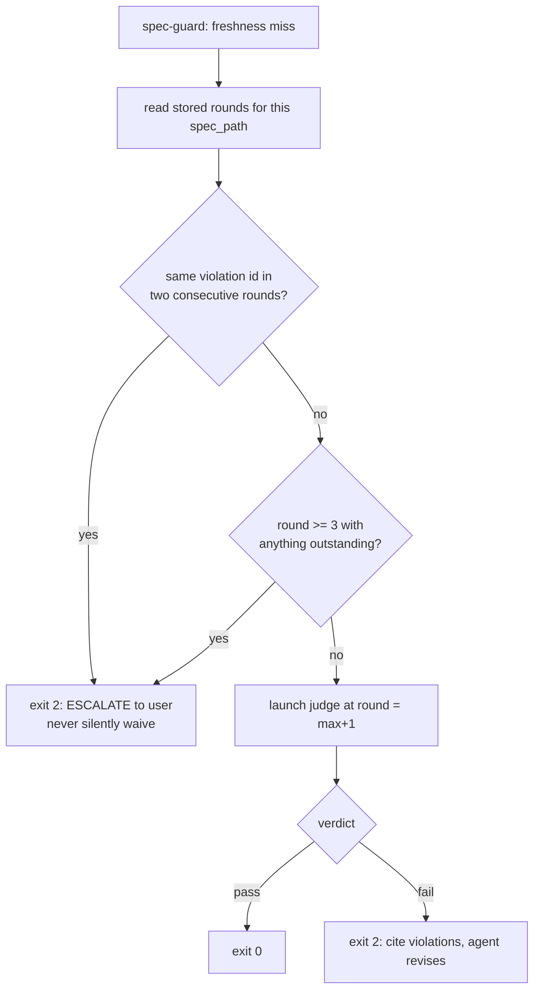
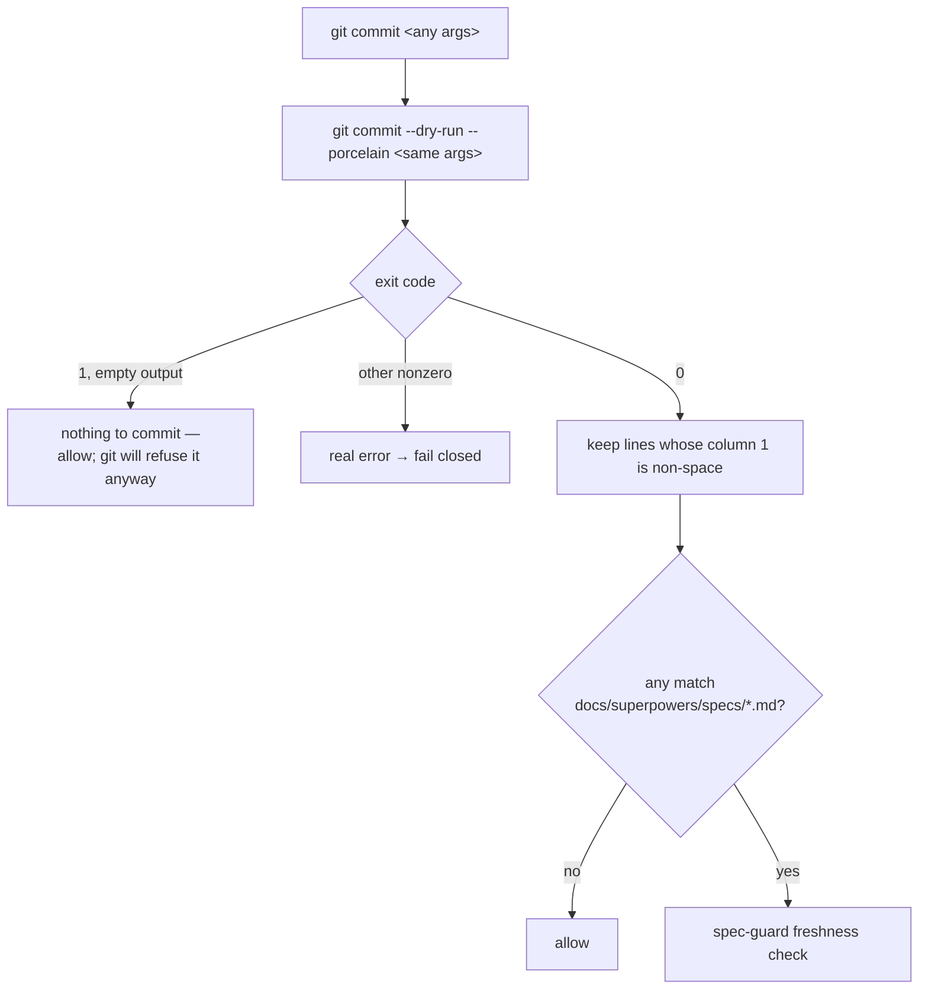

# Branch log: feature/judge-terminal-enforcement

Cut off `main` 2026-07-20. Implements the approved design in
`coding-memory/brainstorms/2026-07-20-judge-terminal-enforcement.md` (§1–§4, approved 2026-07-20).

## State

**Spec phase, round 4 PASSED @ `4f846ff` (compliance: 0 violations, high confidence; observability:
trajectory pass — first on this branch — risk=medium). Post-verdict advisory fixes landed as
`dbf48ae`, so that pass is stale by blob; ONE re-entry round owed, batched with user-review edits.
NEXT: the user reviews the spec.**

- Spec: `docs/superpowers/specs/2026-07-20-judge-terminal-enforcement-design.md`
  (1101 lines, 3 Mermaid blocks, validator PASS).
- Base established by merging the brainstorm commits into `main` (user's call over cherry-pick),
  pushed as `48f02d4` + `69ecd12`. Branch inherits the design; the spec still stands alone.

| Round | Spec commit | Compliance | Observability |
|---|---|---|---|
| 1 | `8aed77a` (464 ln) | **fail** — 5 violations, high | risk=medium, 3 concerns |
| 2 | `ccd02fc` (855 ln) | **fail** — 3 violations, high (2 persisted, 1 new) | risk=medium, high |
| 3 | `60abc86` (1036 ln) | **fail** — 1 violation, high (2 closed, **1 persisted 3x**) | risk=medium, high |
| 4 | `4f846ff` (1096 ln) | **PASS** — 0 violations, high | risk=medium, high, trajectory pass |

Post-verdict: `dbf48ae` (1101 ln) — advisory fixes, unjudged; covered by the owed re-entry round.

## Round 1 verdicts (2026-07-20)

| Judge | Result | Detail |
|---|---|---|
| compliance (blocking) | **fail**, 5 violations, confidence high | `coding-memory/compliance-judge/2026-07-20-judge-terminal-enforcement-design.md` |
| observability (advisory, architecting) | risk=medium, confidence=high, 0 fail / 3 concern | `coding-memory/observability-judge/2026-07-20-feature-judge-terminal-enforcement.md` |

**Both judges independently found the same hole** — the revise loop's escalation cap. That
convergence is the strongest signal in the round and is revision item 1.

Recorded positives (do not regress them): all five pinned versions verified accurate on this
machine; both agents' tool lists match §4.1; the failure matrix closes every path; the `--bare`
amendment was surfaced at the top, justified in §4.2, and gated behind blocking spike S1.

## Revision plan for round 2

Execute all seven, then re-dispatch BOTH judges at round 2, passing round 1's violation ids so the
judge reuses them for anything recurring (persistence detection depends on it). No waived ids.

1. **`gates/escalation-not-preserved`** — restore the cap inside the hook. The skill escalates when
   the same violation id appears in two consecutive rounds, or when round 3 ends with anything
   outstanding; the hook path inherits nothing, because the design's own premise is that skills are
   skippable. The store is the cross-invocation state: it already carries `round` and `violations`
   per `spec_blob_sha`, so the hook can reconstruct attempt history without new storage. Spec who
   owns the cap and what the agent is told on escalation.

2. **`writing-specs/api-contracts`** — define the launcher→judge prompt contract. The current arg
   set cannot carry what the agent definitions require: compliance needs a context summary (it
   judges YAGNI against the stated need) and prior-round violations; observability needs a
   decisions summary. §9.3 forbids sourcing prompts from outside the validated arg set, so this is
   an internal contradiction, not an implementer's gap. Add file-based args (e.g. `--context-file`,
   `--prior-violations-file`) whose *paths* are validated and whose contents are frozen into
   `prompt.txt` — keeping §9.2's no-interpolation rule intact.
3. **`core-conduct/small-focused-files`** — decompose `bin/judge-launch.sh` (7 jobs today) into a
   thin entrypoint plus libs (run-dir/manifest, lock lifecycle, spawn ladder, wait/liveness),
   each with a stated size budget under 400 lines. Largest existing hook in this repo is 211 lines.
4. **`core-conduct/default-deny-stores`** — give `judge-runs/` an actual permission posture:
   `umask 077`, dir `700`, files `600`. Gitignore governs commits, not read access; without this,
   §9.6's "no secrets in run dirs" is an assertion with no mechanism.
5. **`core-conduct/yagni` — resolved by user decision 2026-07-20, not by cutting to one rung.**
   Ladder = **cmux → tmux → Apple_Terminal → headless**; **iTerm2 dropped** (user does not use it).
   Rationale: the user actually runs cmux, tmux, and Terminal, so those rungs meet a real need
   rather than a speculative one. **The osascript surface does NOT go away** — Terminal's
   `do script` is still AppleScript — so the `run.sh` indirection (§6.1) stays load-bearing and
   must be justified on the Terminal rung, not on iTerm2.
6. **Promote the hook-timeout question to a blocking spike (S3), beside S1** (observability
   concern). All of §6.5 rests on the harness honouring a 900s hook timeout and a timed-out hook
   failing OPEN. No hook in `settings.json` sets an explicit timeout today, so 900s is unprecedented
   here. If the harness caps it lower, the gate fails open exactly when the judge is slow — and
   silently. Spike: register a 900s hook, sleep past the limit, observe block vs. allow.
7. **Correct the "verbatim" overclaim in §6.2** (observability concern). `judge-guard.sh` has **no**
   `git -C` handling at all — that is new code, not reuse. Decide explicitly whether
   `git -c foo=bar commit` and `git --git-dir=... commit` are in scope. Blast radius differs
   sharply: `judge-guard` matches rare `gh pr create`, `spec-guard` matches every `git commit`, so
   a classifier bug blocks all commits. Also confirm `coding-memory/judge-runs/` is in `.gitignore`
   before any run dir is written.

## Round 2 (2026-07-20, spec `ccd02fc`)

All seven revision items applied, plus an eighth found while revising. Result: **fail**, 3 violations.

- **Closed cleanly:** `core-conduct/small-focused-files`, `core-conduct/default-deny-stores`,
  `core-conduct/yagni`, and all four round-1 notes. Judge confirmed the 464→855 growth was substance,
  and called §6.5's S3 fork "exemplary".
- **Persisted (round 1 → 2):** `writing-specs/api-contracts`, `gates/escalation-not-preserved`.
- **New:** `writing-specs/pinned-versions` — cmux was rung 1 yet the one named tool missing from the
  pinned table, with its spawn written as the phrase "cmux pane".

**The eighth item (self-found, neither judge caught it): the two-hash livelock.** The gate keys
freshness on the *index* blob; `agents/compliance-judge.md` and its skill both compute `spec_blob_sha`
from the *worktree*. On divergence the hook misses forever and relaunches the judge every round, each
iteration a full session.

## Escalation (2026-07-20) — the rule fired on this spec

Two violations cited in two consecutive rounds = the `running-the-compliance-judge` tripwire. Stopped
and escalated rather than auto-revising a third time; escalating silently would have violated the rule
this spec exists to enforce. **User directed the proposed fix; nothing waived.**

Root cause shared by both: round 2 specified the launcher's argument contract but never its *caller*.
A hook running non-interactively inside `git commit` had no way to populate `--context-file`, and
nothing built `--prior-violations-file` — so the "same id twice" tripwire could never fire, because the
judge only reuses ids when handed the prior array. **The cap round 2 added was inert.**

## Round 3 revision (spec `60abc86`)

- **§6.2.1 (new):** every launcher argument derived deterministically from repo + store.
  `--prior-violations-file` extracted from the store; `--context-file`/`--decisions-file` become
  optional with specified fallbacks. On the hook path the spec's own §1/§2 *are* the stated need — an
  agent-authored summary is the injection vector §6.1.3 flags, since the agent writing the spec would
  also write the standard it is judged against. Skills keep passing explicit summaries.
- **§5.2 corrected:** the round-2 claim that one precondition covered `git commit -a` and pathspec was
  **wrong, and circularly so** — the precondition only runs once a spec is detected as staged, and
  those are the forms where nothing is staged. The observability judge disproved it by running git,
  not reading the spec (`git commit -aqm x` commits a modified spec past an empty `--cached` listing).
  Detection is now per-form; the precondition narrows to plain `commit`.
- **§6.2.2:** ack now releases whichever escalation branch fired — id-scoping deadlocked the round-3
  branch, which cites no ids.
- **§6.4:** "who may set it" rewritten — the hook cannot enforce provenance of an env assignment, so
  the release is advisory with visibility (stderr echo, manifest, store rows) as the real control.
  Pretending otherwise would be a claim the code cannot back.
- **cmux pinned** `0.64.20 (100)` with a real rung-1 command
  (`cmux new-workspace --command "bash <run-dir>/run.sh" --focus false`). cmux sets
  `TERM_PROGRAM=ghostty`, so rung 3's `Apple_Terminal` test cannot false-positive inside it.

**Recurring lesson, now four-for-four across this branch lineage: the write-up runs ahead of the code.**
Round 2's `-a` claim read as rigorous and was verified only by re-reading. It took *running git* to
break it. §10 now requires the three commit forms tested against real git, and adds two mutations
drawn from bugs that were live in a reviewed revision of this very spec.

## Round 3 verdicts (2026-07-20, spec `60abc86`, blob `b9c67ff`)

| Judge | Result | Detail |
|---|---|---|
| compliance (blocking) | **fail**, 1 violation, confidence high | `coding-memory/compliance-judge/2026-07-20-judge-terminal-enforcement-design.md` |
| observability (advisory, architecting) | risk=medium, confidence=high | `coding-memory/observability-judge/2026-07-20-feature-judge-terminal-enforcement-round3.md` |

**Closed:** `writing-specs/pinned-versions` (cmux pinned, real rung-1 command) and
`gates/escalation-not-preserved` (§6.2.1 designs the caller). The compliance judge deliberately did
**not** re-cite the latter — the mechanism is right, what remains is an interface defect, and
double-counting one root cause as two would have misreported the revision.

**Persisted a third time: `writing-specs/api-contracts`.** §6.2.1 tells the hook to write
`<run-dir>/prior-violations.json`, but §5.1 builds `run_id` from the *launcher's PID* and §6.1.1 has
the launcher create the dir, while §6.1.2 requires every `--*-file` to already exist. The hook must
therefore place a file in a directory only the launcher can create, under a name only the launcher can
generate. Unimplementable — and it is the exact argument the spec says the cap no-ops without.

**The three rounds are one mistake at three depths:** specifying an interface without fully specifying
who calls it and what that caller can know *at call time*. R1 = no caller at all. R2 = caller named,
data source unspecified. R3 = data source specified, destination not yet in existence.

## Escalation #2 (2026-07-20) — both tripwires, resolved by user decision

Same id in consecutive rounds **and** round 3 closed with a violation outstanding. Stopped rather than
auto-revising a fourth time. **User directed both fixes; nothing waived.**

1. **`--prior-violations-file` — the launcher extracts it itself.** Dropped from the hook path
   entirely: the launcher already gets `--spec` and `--round`, and "violations array of the most recent
   stored round for this repo + spec_path" is fully derivable from those plus the store. The launcher
   does the extraction *after* it creates the run dir. This kills the circularity by removing the
   argument rather than sequencing it, so the ordering bug cannot recur — there is no ordering. The
   flag survives as an optional override for skill/interactive callers.
2. **§5.2 detection — resolve the effective file set once, stop enumerating commit forms.**

## The `-i` hole and the detection rewrite (evidence, not reasoning)

The observability judge found `git commit -i -- <path>` commits the named path **plus everything
already staged** — a staged spec walks the gate while detection looks only at the pathspec. Same class
as round 2's `-a` bug, one form over. Reproduced independently before accepting it. It also caught that
`git commit -ma "x"` parses as `-m a`, not `-a`, so letter-cluster scanning misfires.

The structural point won over patching: a hand-written form table has now leaked twice in three rounds.
**Let git resolve the set.** Verified 5/5 against real git — `git commit --dry-run --porcelain <same
args>`, column 1 (index column) non-space ⟺ that file is recorded in the commit:

| Form | col-1 for staged spec | spec actually recorded |
|---|---|---|
| plain | `M ` | yes |
| `-a` | `M ` | yes |
| `-- other.txt` | ` M` | no |
| `-i -- other.txt` | `M ` | **yes** (the hole) |
| `--only -- other.txt` | ` M` | no |

Safety checks run before proposing it (it would execute inside every `git commit`): does **not** mutate
index or worktree even on the temp-index `-a` form; does **not** launch an editor or hang with no `-m`;
**9ms** on the real repo; `A`/`D` both surface in column 1. Two caveats for the spec text: exit 1 with
empty output means "nothing to commit" and must not read as detection failure, and `--amend` lists the
amended commit's whole file set (over-blocks toward fail-closed — semantically right, since the
amended commit really does record that spec blob).

**Corrected factual error:** §6.5 claims no hook in `settings.json` sets an explicit timeout. **10 of
17 do**, all at `timeout: 10`. Verified. The argument sharpens rather than collapses — the only
precedent is 10s against a design that wants 900s, a 90× jump, so spike S3 matters more, not less.

**Also flagged, not yet actioned:** the spec is 1036 lines against core-conduct's 800 ceiling, and
length is plausibly *why* round 2's circular argument survived two reviews. Four judge notes are
pending a pass during the round-4 edit (§6.1.2 cross-ref points at §6.2.2 for fallbacks that live in
§6.2.1; `design_doc` has no specified absent-form; §3's flowchart still draws the precondition §5.2
disproves; §10's table header still says "round-2 revisions").

## Round 4 revision (spec `4f846ff`, 2026-07-20, ran on Fable 5)

Both user-directed fixes applied, all four round-3 notes, §6.5 corrected (**10 of 17 hooks set
`timeout: 10`** — verified by parsing the live settings.json), and every §5.2 claim re-verified
against real git before writing (the branch rule: run, don't read). That re-verification caught
three refinements BEFORE they shipped: untracked `??` entries are not recorded (the real commit
omits them), spec deletions (`D`) trigger nothing, and `-z` rename entries carry the recorded path
with the source as an extra NUL field. Vocabulary swept ("stages a spec" → "records a spec").
Trim pass applied, but net 1036 → 1096 lines — the fixes added more than the trim removed — so §11
now names the 800-ceiling breach as an explicit user-review question instead of hiding it.

- **Fix 1:** `--prior-violations-file` dropped from every caller path; §6.1.2 has the launcher
  extract the prior round's `violations` array from the store *after* creating the run dir. The
  3-round circularity is deleted, not re-sequenced — no ordering exists for a caller to get wrong.
- **Fix 2:** §5.2 detection = `git commit --dry-run --porcelain -z <same args>`; the
  index==worktree precondition became universal; all per-form "effective blob" analysis deleted.

## Round 4 verdicts (2026-07-20, spec `4f846ff`, blob `30fd5a0`)

| Judge | Result | Detail |
|---|---|---|
| compliance (blocking) | **PASS**, 0 violations, confidence high | `coding-memory/compliance-judge/2026-07-20-judge-terminal-enforcement-design.md` |
| observability (advisory, architecting) | risk=medium, confidence=high, **trajectory pass — first on this branch** | `coding-memory/observability-judge/2026-07-20-feature-judge-terminal-enforcement-round4.md` |

**`writing-specs/api-contracts` closed after three rounds** — the judge walked every caller path
against the user's test (every argument producible by its caller at call time) and confirmed the
circularity is deleted. Nothing waived in any round. Observability's remaining concerns are the two
blocking spikes (S1, S3), the most-run-command blast radius, and the named-but-open S3 fail-open
shape plus the advisory ack — all already stated in the spec, none new.

## Post-verdict fix (`dbf48ae`) — why the round-4 pass is stale by blob

Observability found one real uncovered case. **Reproduced before accepting** — and the first
reproduction attempt *disagreed with the judge* because `cmd | tr ...; echo $?` measures tr's exit,
not git's; controlled redirects settled it (a fifth instance of the branch lesson, this time in the
verification harness itself): an only-untracked tree exits 1 with **non-empty** output (`??`
entries), matching no §5.2 table row, and row 3's "non-space `X` including `??`" wording
contradicted the M/A/R/C whitelist that actually governs. Fixed as the judge proposed — **entries
decide first; exit codes consulted only when no spec entry answers** — plus the compliance judge's
three non-blocking notes: dead "or run dir" validation branch dropped, `--round > 1` with no stored
history now fails preflight (exit 4), and §5.2 states the dry-run re-executes the parsed argv list,
never re-joined shell text.

**Owed next:** user review → one re-entry judge round (restarts at round 1 per
`running-the-compliance-judge`) covering `dbf48ae` + whatever the review changes, before
`superpowers:writing-plans`. User decision owed at review: §11's split-or-accept (1101 lines vs the
800 ceiling). Then spikes S1 and S3 block implementation.

## User review (2026-07-20) — the split, and the three-step cascade it set off

The review resolved §11's open question and then two consequences of that resolution that nobody
anticipated when it was asked. Recorded as a sequence because the ordering is the lesson: a
document-structure decision turned into a design change.

**Step 1 — split (user's call).** §11 had argued for keeping the spec whole on self-containment
grounds; the user chose the 800-line ceiling over that argument. §6 → companion file
`2026-07-20-judge-terminal-enforcement-contracts.md`, verbatim, numbering untouched so no
cross-reference needed rewriting. Verified byte-identical against `HEAD` (diff: one trailing
newline). The extraction script asserted its own line anchors and **failed closed on first run**,
catching an off-by-one before writing anything.

**Step 2 — the split broke the design, and the break was in the gate's own subject matter.** Both
halves match `docs/superpowers/specs/*.md`, so this design's normal commit became a two-spec commit
— undefined behaviour in §5.2/§6.2.1 — and per-file freshness keying meant *editing the companion
left the root's verdict reading fresh*. A stale pass that looks current, inside the gate whose whole
purpose is preventing that. Pre-existing (any two-spec commit hit it) but promoted from rare edge
case to this design's default path.

**Step 3 — spec units (user's call, option A of three).** New §5.3: explicit `spec_unit:`
declarations (`parts:` in the root, `part_of:` in each companion), bidirectional consistency,
depth-1 only, resolution from index blobs, order-independent `spec_unit_sha` over all members,
distinct-units-in-one-commit refused. One root, one round counter, one verdict.

**What units cost — two invariants that had survived four judge rounds, amended in the text rather
than quietly kept:**

| Was | Now | Why unavoidable |
|---|---|---|
| §4.1 "agent definitions unchanged" | compliance judge gains **one** declared input, `spec_unit_sha`, recorded and never computed | freshness must cover every member → the store must carry unit identity → the judge writes the row but hashes one path and cannot know a unit exists |
| §5 "schemas unchanged" | compliance store gains **one** additive nullable field | same chain; additive so absent = standalone and no stored row changes meaning |

Rejected: judge resolves units itself (resolution in two places), and a sidecar index outside the
store (breaks §9.1, *the store is the only authority*).

**Step 4 — units pushed the parent back over 800 (852), so §7 followed §6 to the companion.**
Final **681 / 696**. Companion retitled "Component Contracts & Scenarios".

**Two things worth carrying forward:**

- **The cost estimate for option A was wrong when it was given.** It was pitched as "+1 agent line,
  +1 schema field"; it actually touched the prompt contract, hook argument table, round accounting,
  skill freshness sentence, failure matrix, test cases, falsification targets, scenarios and the
  scope table — ~170 lines, and it forced a second file move. The recommendation held; the estimate
  did not. Give the blast radius, not the headline change.
- **§2's scope table still listed both amended items as explicitly out of scope** after the design
  changed. Caught by grepping every `unchanged`/`already exists` claim against the new design rather
  than by re-reading. Same failure mode this branch keeps producing — **the write-up runs ahead of
  the change** — now on its sixth instance, and again caught by a mechanical check rather than a
  careful read.

Also verified: all three Mermaid blocks pass `validate-diagrams.sh` (§3's flowchart and sequence
diagram were updated to show unit resolution rather than left describing the old single-file flow);
every `§N.M` reference resolves across the pair; the spec declares itself as the first spec unit,
dogfooding §5.3's own format.

## Re-entry rounds 1–2 (2026-07-20) — ESCALATION #3, and the first waiver on this branch

**Re-entry round 1 @ `8de76f9` — compliance FAIL (2 violations), observability risk=medium/high-conf.**
Both judges independently found the same hole, which is the strongest convergence seen on this branch:

- `writing-specs/unambiguous-requirements` — §5.3 said the declaration lived in "a fenced yaml block
  near the top" and never said how a *script* finds one. **The dogfooding decision collided with the
  illustrations:** the root carried three blocks with a top-level `spec_unit:` key — the real one plus
  §5.3's two examples, the second declaring `part_of` the file containing it. Fixed structurally —
  header region only, strictly before the first `## ` heading; the resolution table went from 3 rows to
  7 and is now total, with every malformed case exiting 2 instead of falling through to the fail-open
  standalone row.
- `writing-specs/agent-input-contract` — §4.1/§2 promised one added agent input while §6.1.3/§12
  required two.

Observability additionally found (each **reproduced against real git before accepting**): no §5.2 row
for `X = U` (conflicted spec → `UU`, exit 1, and `git rev-parse ":<path>"` **exit 128** on unmerged
paths, so the wrong routing would block every commit during a rebase); §8's unqualified "never a hang"
being false for ladder rung 3, which has no liveness probe; and a header sentence claiming "Final: 672
and 693 lines" when the files were 684/696 **in the very commit that wrote it**.

**Re-entry round 2 @ `d77c26d` — compliance FAIL (1 violation), observability risk=low/high-conf.**
`writing-specs/agent-input-contract` **persisted into a second consecutive round → escalation cap
fired (escalation #3).**

*Why the round-1 fix missed:* it corrected the locations round 1's citation enumerated, then added a
§4.1 sentence asserting consistency across exactly that list — **verifying against the list of fixed
locations rather than against the document.** The two survivors (§5.2's "Neither agent definition
changes", §11's "one declared input") were semantically equivalent claims that a grep for the *phrasing
used* could never match. The judge's mechanical tell: §6.2.2 enumerated eight inputs then called the ack
a potential "eighth entry" — the list was extended, the ordinal counting it was not.

**User decision: WAIVED.** The first waiver on this branch — rounds 1–4 and escalations #1/#2 were all
closed by user-directed fixes. Recorded in `coding-memory/compliance-judge/verdicts.jsonl` as a
`record_type: user_waiver` row, attributed to the user, with the substance, the reason the fix missed,
and an explicit list of what the waiver does **not** cover. The waived item is documentation
consistency, not a design defect: §4.1's table states the real contract unambiguously.

**Fixed rather than waived (observability round 2, all unwaived):**

- **Flag-splice position — a silent fail-open on the gate's core case.** §5.2 showed
  `git commit --dry-run --porcelain -z <same args>` while its prose read *additively* ("arguments
  unchanged **plus** those three flags"). Reproduced: appending instead of splicing makes git eat the
  flags as **pathspecs** → exit 1 → §5.2's exit-1 row **allows a real spec commit straight through the
  gate** (`-i` gives exit 128 → false block). Position is now a stated requirement with the evidence
  table, plus a §10 falsification target.
- **The whole-file-scan rationale was factually wrong in §5.3, §7 and §10.** They claimed the root would
  "resolve as a companion of itself" and fail bidirectional/depth-1. It has *three* blocks, so the
  multi-block ambiguity row fires first and classification is never reached. Same exit code, different
  mechanism — **a falsification test written to the stated mechanism would assert an unreachable branch
  and pass for the wrong reason.**
- §6.2.2's "eighth entry" off-by-one; §11's "657 and 472 lines" (matching no commit in history, in a
  document that had just declared measured numbers belong in `wc -l`); and the header-region scan is now
  specified **fence-aware**, with a fixture-backed test since neither real file distinguishes it from a
  naive scan.

**User directed no round 3.** The spec proceeds to `superpowers:writing-plans` with a round-2 fail on
record, one waived violation, and the above fixes **applied but unjudged**. S1/S3 still gate
implementation independently.

**The recurring lesson, now at eight instances and evolving:** it began as *the write-up runs ahead of
the code*; it is now *the verification is scoped to the list rather than the document*. Round 1's fix
and its self-audit shared a single list, so the audit could only confirm what had already been changed.
Observability's framing is the one to keep: the pattern **moved rather than broke** — and its worst
form is not a stale sentence but a stated mechanism that is wrong while the outcome looks right, since
that is the form which survives into the tests.

**Headroom note:** the root is at 787 of 800 lines. The next substantive addition needs a plan, not
another paragraph.

## Notes

- Judges ran as in-session `Agent`-tool subagents (~86k subagent tokens in round 1; ~133k in
  round 4) — the exact cost this design exists to move out of the main window.
- ADR obligations still outstanding (spec §12): new ADR for this decision (class (a) structural),
  update ADR-0003 whose "no script-decidable spec-done moment" deferral this resolves.
