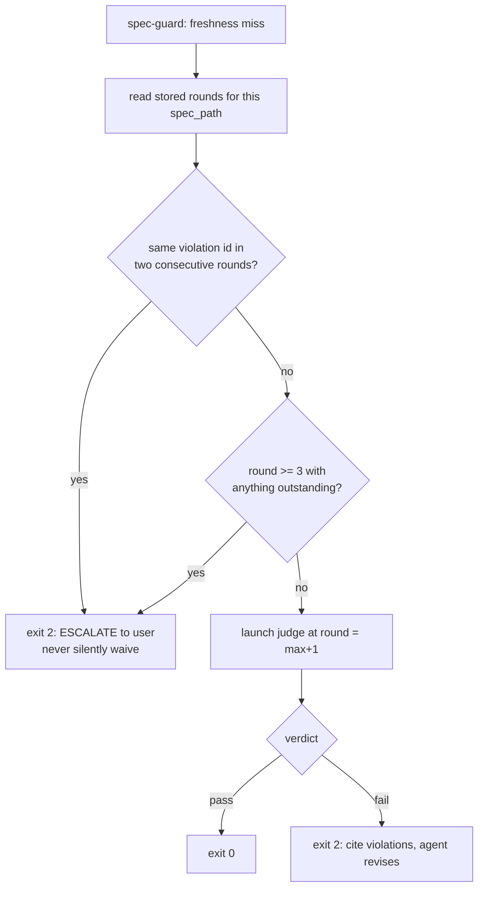

# Branch log: feature/judge-terminal-enforcement

Cut off `main` 2026-07-20. Implements the approved design in
`coding-memory/brainstorms/2026-07-20-judge-terminal-enforcement.md` (§1–§4, approved 2026-07-20).

## State

**Spec phase, round 1 complete — spec currently FAILS compliance. Revision not yet written.**

- Spec: `docs/superpowers/specs/2026-07-20-judge-terminal-enforcement-design.md` @ `8aed77a`
  (464 lines, 2 Mermaid blocks, validator PASS).
- Base established by merging the brainstorm commits into `main` (user's call over cherry-pick),
  pushed as `48f02d4` + `69ecd12`. Branch inherits the design; the spec still stands alone.

## Round 1 verdicts (2026-07-20)

| Judge | Result | Detail |
|---|---|---|
| compliance (blocking) | **fail**, 5 violations, confidence high | `coding-memory/compliance-judge/2026-07-20-judge-terminal-enforcement-design.md` |
| observability (advisory, architecting) | risk=medium, confidence=high, 0 fail / 3 concern | `coding-memory/observability-judge/2026-07-20-feature-judge-terminal-enforcement.md` |

**Both judges independently found the same hole** — the revise loop's escalation cap. That
convergence is the strongest signal in the round and is revision item 1.

Recorded positives (do not regress them): all five pinned versions verified accurate on this
machine; both agents' tool lists match §4.1; the failure matrix closes every path; the `--bare`
amendment was surfaced at the top, justified in §4.2, and gated behind blocking spike S1.

## Revision plan for round 2

Execute all seven, then re-dispatch BOTH judges at round 2, passing round 1's violation ids so the
judge reuses them for anything recurring (persistence detection depends on it). No waived ids.

1. **`gates/escalation-not-preserved`** — restore the cap inside the hook. The skill escalates when
   the same violation id appears in two consecutive rounds, or when round 3 ends with anything
   outstanding; the hook path inherits nothing, because the design's own premise is that skills are
   skippable. The store is the cross-invocation state: it already carries `round` and `violations`
   per `spec_blob_sha`, so the hook can reconstruct attempt history without new storage. Spec who
   owns the cap and what the agent is told on escalation.

2. **`writing-specs/api-contracts`** — define the launcher→judge prompt contract. The current arg
   set cannot carry what the agent definitions require: compliance needs a context summary (it
   judges YAGNI against the stated need) and prior-round violations; observability needs a
   decisions summary. §9.3 forbids sourcing prompts from outside the validated arg set, so this is
   an internal contradiction, not an implementer's gap. Add file-based args (e.g. `--context-file`,
   `--prior-violations-file`) whose *paths* are validated and whose contents are frozen into
   `prompt.txt` — keeping §9.2's no-interpolation rule intact.
3. **`core-conduct/small-focused-files`** — decompose `bin/judge-launch.sh` (7 jobs today) into a
   thin entrypoint plus libs (run-dir/manifest, lock lifecycle, spawn ladder, wait/liveness),
   each with a stated size budget under 400 lines. Largest existing hook in this repo is 211 lines.
4. **`core-conduct/default-deny-stores`** — give `judge-runs/` an actual permission posture:
   `umask 077`, dir `700`, files `600`. Gitignore governs commits, not read access; without this,
   §9.6's "no secrets in run dirs" is an assertion with no mechanism.
5. **`core-conduct/yagni` — resolved by user decision 2026-07-20, not by cutting to one rung.**
   Ladder = **cmux → tmux → Apple_Terminal → headless**; **iTerm2 dropped** (user does not use it).
   Rationale: the user actually runs cmux, tmux, and Terminal, so those rungs meet a real need
   rather than a speculative one. **The osascript surface does NOT go away** — Terminal's
   `do script` is still AppleScript — so the `run.sh` indirection (§6.1) stays load-bearing and
   must be justified on the Terminal rung, not on iTerm2.
6. **Promote the hook-timeout question to a blocking spike (S3), beside S1** (observability
   concern). All of §6.5 rests on the harness honouring a 900s hook timeout and a timed-out hook
   failing OPEN. No hook in `settings.json` sets an explicit timeout today, so 900s is unprecedented
   here. If the harness caps it lower, the gate fails open exactly when the judge is slow — and
   silently. Spike: register a 900s hook, sleep past the limit, observe block vs. allow.
7. **Correct the "verbatim" overclaim in §6.2** (observability concern). `judge-guard.sh` has **no**
   `git -C` handling at all — that is new code, not reuse. Decide explicitly whether
   `git -c foo=bar commit` and `git --git-dir=... commit` are in scope. Blast radius differs
   sharply: `judge-guard` matches rare `gh pr create`, `spec-guard` matches every `git commit`, so
   a classifier bug blocks all commits. Also confirm `coding-memory/judge-runs/` is in `.gitignore`
   before any run dir is written.

## Notes

- Judges ran as in-session `Agent`-tool subagents (~86k subagent tokens across the two) — the exact
  cost this design exists to move out of the main window. Round 2 will cost similar.
- ADR obligations still outstanding (spec §12): new ADR for this decision (class (a) structural),
  update ADR-0003 whose "no script-decidable spec-done moment" deferral this resolves.
