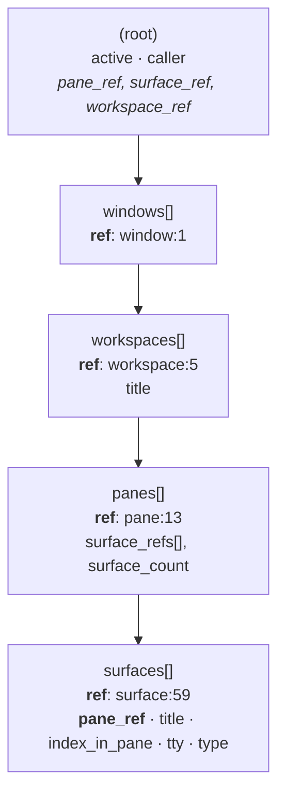

# feature/pane-layout-v2

Deterministic one-workspace cmux layout for pane-dispatched agents: main far-left,
progressive 2x2 implementer quadrant, far-right aux column, tab overflow — derived live
from `cmux --json tree` plus a title convention, with zero persistent layout state.

- Spec: `docs/superpowers/specs/2026-07-21-pane-layout-v2-design.md` @ blob **aeb0074**
  (frozen — its blob SHA keys both judge verdicts; do not edit).
- Plan: `docs/superpowers/plans/2026-07-21-pane-layout-v2.md` (8 tasks, probe-first, TDD).

## Progress

- **Task 1 (live probe) — DONE 2026-07-21.** All of P1–P7 resolved against live
  cmux 0.64.20 (100). Findings below. Three plan-level corrections and one
  user-approved spec deviation came out of it.
- **Task 2 (agent-exit marker) — DONE 2026-07-21.** `run-pane-agent.sh` writes
  `state/runs/<run-id>/agent-exit` (`DONE`/`FAILED`) only after a successful result
  write; `fail_early` writes none, and a `*/runs/*` guard on the `cd`+`pwd`-normalized
  prompt dir rejects untrusted paths. 10/0 green; both guards falsified RED before
  being trusted. One plan-snippet fix: `> file 2>/dev/null` does not suppress a
  redirect failure (shell reports it before the trailing redirect applies) — stderr
  redirect moved first.

## Live probe (cmux 0.64.20 (100), jq 1.7.1-apple, macOS Darwin 25.5.0)

Re-runnable via `panes/cmux-layout-probe.sh` after any cmux upgrade. Findings recorded
verbatim — these are evidence, not assumptions.

### P1 — workspace scoping · **spec assumption 1 is FALSE, but the feature is safe**

Bare `cmux --json tree` is **window**-scoped, not workspace-scoped:

```
bare tree     workspace refs: ["workspace:2","workspace:5","workspace:1","workspace:3","workspace:4"]
--workspace   workspace refs: ["workspace:5"]
```

The plan's **P1 both-fail gate did NOT trigger**, because scoping is available three ways —
any one is sufficient:

1. `cmux --json tree --workspace "$CMUX_WORKSPACE_ID"` — the **UUID is accepted directly**;
   cmux scopes server-side. *This is the mechanism to use.*
2. `.caller.workspace_ref` — the tree names the calling surface's own workspace, needing
   no env var at all. Natural fallback when `$CMUX_WORKSPACE_ID` is unset.
3. `--id-format both` exposes `workspace_id` (UUID) and `workspace_ref` side by side.

**Consequence for Task 4:** `layout_normalize_tree` does **not** need its client-side
workspace filter. Server-side `--workspace` scoping is simpler and strictly more correct.

### P2 — tree JSON shape · **the plan's jq matched NOTHING**

Real nesting, with each level keying its own ref as `ref`:



The plan assumed panes carry `pane_ref`+`surfaces` and surfaces carry `surface_ref`+`title`.
Neither is true. Proven live — the plan's jq returns **empty**, the corrected one works:

```
# plan's jq  -> (no output)
# corrected  -> pane:13	surface:57	handoff: press Enter
#               pane:31	surface:52	~/.claude
```

Corrected selector (surfaces are the only objects carrying `ref` + `pane_ref` + `title`):

```jq
[.. | objects | select(has("ref") and has("pane_ref") and has("title"))]
| .[] | [.pane_ref, .ref, .title] | @tsv
```

**Why this mattered:** unpatched, `layout_normalize_tree` would have silently returned
empty → every dispatch degrading to Tier-1 legacy → the whole feature dead code that never
activates, while every canned-fixture unit test stayed green (the plan's test builders
construct the *assumed* shape). Only the live-fixture test would have caught it. This is
the probe-first ordering paying for itself.

**Consequence for Task 4:** rewrite the jq (the plan's P2 gate explicitly authorises this)
**and** rewrite the `pane()`/`tree()` test builders to emit the real shape — otherwise
canned tests pass while live behaviour fails.

### P3 — `new-pane --direction right` · **exists; assumption 4 HOLDS**

```json
{ "pane_ref": "pane:45", "surface_ref": "surface:66", "type": "terminal",
  "window_ref": "window:1", "workspace_ref": "workspace:8" }
```

Geometry is **not** exposed in the tree; confirmed visually by the user in the scratch
workspace: the right pane **is a full-height column**. Spec assumption 4 holds.

### P4 — `respawn-pane --command` · **shell semantics AND destructive**

Sent `echo SHELL_OK > $OUT && printf '[%s]\n' 'A B' >> $OUT`; the file contained:

```
SHELL_OK
[A B]
```

→ **shell semantics**: `&&` chained, redirection ran, and `'A B'` survived as a single
argument. Any command text interpolated here **must be shell-quoted**. (This was the obs
judge's flagged prerequisite for the reuse path — now pinned.)

**Second, larger finding:** `respawn-pane` **replaces the surface's process**, and the
surface closes when that process exits — it destroyed `surface:67`, taking its
last-surface pane `pane:46` with it.

**Deviation (user-approved 2026-07-21):** implement reuse with **`cmux send`**, not
`respawn-pane`. `send` types into the surviving shell, is non-destructive, and is already
v1-proven in `panes/adapters/cmux.sh`. The spec's *intent* (reuse a finished surface) is
preserved; only the mechanism differs. The spec file stays unedited (frozen blob).
**Flag this deviation to the implementation-stage observability judge.**

### P5 — `new-surface` · **returns refs; targeting needs ref + workspace context**

```json
{ "pane_ref": "pane:44", "surface_ref": "surface:68", "type": "terminal",
  "window_ref": "window:1", "workspace_ref": "workspace:8" }
```

Targeting rule, established by contrast:

| target form | result |
|---|---|
| `--pane <UUID>` (no workspace context) | `Error: not_found: Pane not found` |
| `--pane pane:44 --workspace workspace:8` | success |
| `--surface surface:65` (no workspace context) | `Error: not_found: Surface not found` |
| `--surface surface:65 --workspace workspace:8` | success |

**Refs are resolved relative to a workspace context that defaults to
`$CMUX_WORKSPACE_ID`.** UUIDs work for `--workspace` itself but **not** for `--pane`.
Every mutating call in Tasks 6–7 must therefore carry an explicit `--workspace`.

### P6 — `rename-tab` · **round-trips, but SILENTLY MIS-TARGETS**

Round-trip works, and the managed grammar (`.` and `:`) is accepted:

```
$ cmux rename-tab --workspace workspace:8 --surface surface:67 -- "impl.1:1700000000-1-1 probe"
OK action=rename tab=tab:65 workspace=workspace:8
```

Note `surface:67` was already destroyed (by P4) and cmux renamed **tab:65** instead.
Confirmed deliberately against a definitely-invalid ref:

```
$ cmux rename-tab --workspace workspace:8 --surface surface:9999 -- "BOGUS-TARGET-TEST"
OK action=rename tab=tab:65 workspace=workspace:8      # exit 0
```

**HAZARD.** Resolution order is `--tab` → `--surface` → `$CMUX_TAB_ID`/`$CMUX_SURFACE_ID` →
**focused tab**, and an unresolvable ref falls through that chain *without erroring*.
A surface closing between tree-fetch and rename therefore stamps a managed title
(`impl.2:<run-id> …`) onto an innocent surface — corrupting the layout state machine, and
potentially branding the user's own main session pane. `tab-action rename` shares the
identical fallback chain, so there is no strict-targeting escape hatch.

**Consequence for Task 7:** the plan's "TOCTOU retry-once" is **insufficient** — this
failure is silent and already committed by the time it is observable. The adapter must
**verify-after-rename**: re-read the tree, confirm the title landed on the intended
`surface_ref`, and repair if not. Proven workable — the fixture build used exactly this
verify-after-rename loop and both renames confirmed on target.

### P7 — env vs tree ID formats · **reconcilable**

```
CMUX_WORKSPACE_ID=49F4D8B9-887A-44A0-985A-D8F779B73683     (UUID)
CMUX_SURFACE_ID=C8FFF2FA-E6DD-492C-BAC0-8E58F191A009       (UUID)
tree default output                                         (refs: workspace:5, surface:59)
--id-format both  -> workspace_id=49F4D8B9-… workspace_ref=workspace:5
```

Formats differ but map cleanly, and `--workspace` accepts the UUID directly, so no
reconciliation code is needed for scoping (see P1).

### Incidental

- `new-workspace` is a legacy alias for `cmux workspace create`; it does **not** honour
  `--json` and prints plain `OK workspace:8`. Parse with `awk`, not `jq`. Set
  `CMUX_QUIET=1` or the deprecation notice contaminates parsed stdout.
- `new-pane`, `new-split`, and `new-surface` **do** honour `--json`. `respawn-pane` and
  `rename-tab` return plain `OK …` text.
- v1's `cmux.sh` parses non-JSON `new-split` output as `OK surface:N workspace:M` (awk
  field 2) and targets purely via inherited env — that continues to work.

## Fixture

`panes/adapters/fixtures/tree-live.json` (3390 bytes) — the scratch workspace's scoped
tree, holding a managed impl surface, a managed aux surface, and an unmanaged one:

```
pane:44	surface:65	impl.1:1700000001-1-1 taskA
pane:44	surface:68	Terminal
pane:45	surface:66	aux:1700000002-4-5 judge
```

Reviewed before commit: synthetic titles only, no real paths, `tty` null, no URLs.

## Carry-forward into Tasks 2–8

1. **Task 4** — rewrite `layout_normalize_tree`'s jq to the P2 shape; drop the client-side
   workspace filter in favour of `tree --workspace`; rewrite the `pane()`/`tree()` test
   builders to the real shape.
2. **Task 6/7** — every mutating cmux call carries an explicit `--workspace` (P5).
3. **Task 7** — reuse via `cmux send`, shell-quoted (P4); **verify-after-rename** replaces
   plain retry-once (P6).
4. **Judge** — surface the `respawn-pane`→`send` deviation explicitly at the
   implementation-stage observability judge.
