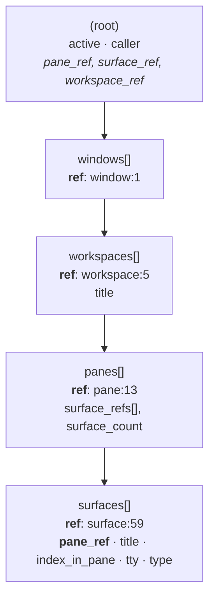

# feature/pane-layout-v2

Deterministic one-workspace cmux layout for pane-dispatched agents: main far-left,
progressive 2x2 implementer quadrant, far-right aux column, tab overflow — derived live
from `cmux --json tree` plus a title convention, with zero persistent layout state.

- Spec: `docs/superpowers/specs/2026-07-21-pane-layout-v2-design.md` @ blob **aeb0074**
  (frozen — its blob SHA keys both judge verdicts; do not edit).
- Plan: `docs/superpowers/plans/2026-07-21-pane-layout-v2.md` (8 tasks, probe-first, TDD).

## Progress

- **Task 1 (live probe) — DONE 2026-07-21.** All of P1–P7 resolved against live
  cmux 0.64.20 (100). Findings below. Three plan-level corrections and one
  user-approved spec deviation came out of it.
- **Task 2 (agent-exit marker) — DONE 2026-07-21.** `run-pane-agent.sh` writes
  `state/runs/<run-id>/agent-exit` (`DONE`/`FAILED`) only after a successful result
  write; `fail_early` writes none, and a `*/runs/*` guard on the `cd`+`pwd`-normalized
  prompt dir rejects untrusted paths. 10/0 green; both guards falsified RED before
  being trusted. One plan-snippet fix: `> file 2>/dev/null` does not suppress a
  redirect failure (shell reports it before the trailing redirect applies) — stderr
  redirect moved first.
- **Task 3 (`--role` + role env + title prefix drop + handoff rename) — DONE 2026-07-21.**
  `dispatch-pane-agent.sh` grows `--role implementer|aux` (default `aux`), allowlisted
  before any adapter call, exported as `PANE_AGENT_ROLE`; the dispatch title is now the
  bare agent type (the `pane: ` prefix is gone, freeing the managed grammar's 64-char
  budget); `handoff` exports `PANE_AGENT_ROLE=aux`. 39/0 green; other three pane suites
  still 24/10/9 green; shellcheck clean on all three touched scripts.
  - **RED first (Step 2, 34 passed / 5 failed):** `bare agent-type title passed
    (pane: observability-judge)`, `role defaults to aux (unset)`, `--role implementer
    accepted (dispatch-pane-agent: unknown option: --role)`, `implementer role exported`,
    `handoff role is aux`.
  - **Plan mispredicted its own RED set.** Step 2 expected `garbage --role -> usage
    exit 64` to fail; it passes **vacuously** pre-implementation, because `--role` is an
    unknown option that already exits 64 for a different reason. `--role implementer
    accepted` fails in its place. Exactly the trap the falsification rule exists for.
  - **Falsification (mandatory, run against the final committed code):** neutering
    `case "$role" in implementer|aux) …` drops the suite to 37/2 with
    `garbage --role -> usage exit 64` and `garbage --role never reaches adapter` both RED;
    restored → 39/0. The allowlist guard is genuinely load-bearing.
  - **Step 5 correction (handoff-wrapper rename).** The plan's
    `rename-tab --surface "$CMUX_SURFACE_ID"` with **no `--workspace`** is unsafe on this
    build: P5 says a bare `--surface` with no workspace context errors `not_found`, P7
    records `$CMUX_SURFACE_ID` as a **UUID** (only `--workspace` was proven to accept
    UUIDs), and P6 records that an unresolvable target falls through to the **focused
    tab** at exit 0 — so the plan's form would most likely rename whatever pane the user
    is looking at to "main session", silently, `|| true` swallowing it. Landed instead:
    `--workspace "$CMUX_WORKSPACE_ID"` (UUID form P7 proved) and **no `--surface`**,
    letting cmux resolve the target from this pane's own `$CMUX_TAB_ID`/`$CMUX_SURFACE_ID`
    — which is what that link of the resolution chain is for, since the wrapper runs
    *inside* the pane it renames. Guarded on both env vars being set. No automated test
    (no wrapper suite exists); **verify live at the end of Task 8.**
  - **Two test-only shellcheck fixes to plan snippets:** the stub `printf` format keeps
    `${PANE_AGENT_ROLE:-unset}` single-quoted on purpose (it must reach the generated stub
    unexpanded) → inline `disable=SC2016` with the why; and the brief's `[ $? -eq 0 ]`
    after a command substitution trips SC2181 → captured into `rc` first, matching the
    happy-path idiom already in the file.

- **Task 4 (`cmux-layout.sh` part 1 — normalize / classify / finished) — DONE 2026-07-21.**
  New `panes/adapters/cmux-layout.sh` (pure, sourced, never calls cmux) with
  `layout_normalize_tree`, `layout_managed`, `layout_run_finished`, plus
  `cmux-layout.test.sh`. 12/0 green; `shellcheck -x` clean on both.
  - **RED first (Step 2, 2 passed / 10 failed):** source line `No such file or
    directory`, then `layout_normalize_tree/layout_managed/layout_run_finished:
    command not found` for every case. Two of the twelve passed *vacuously*
    (empty == empty for the builder-equivalence check, exit 127 read as "running")
    — which is exactly why the content-pinned fixture assertion carries falsification 3
    rather than the equivalence assertion.
  - **Correction 1 — the normalize selector (plan's returns EMPTY).** The plan assumed
    panes carry `pane_ref`+`surfaces` and surfaces carry `surface_ref`+`title`. Per probe
    P2 and the fixture, **neither is true**: a pane keys its own ref as `ref`, and a
    surface keys its own as `ref` while carrying `pane_ref` + `title`. Landed selector:
    `[.. | objects | select(has("ref") and has("pane_ref") and has("title"))]` →
    `[.pane_ref, .ref, .title] | @tsv`.
  - **Correction 2 — the workspace filter (plan's was a silent total failure).**
    Workspace objects carry `ref`; their `workspace_ref` is `null`. The only objects with
    a non-null `workspace_ref` are the root `active`/`caller` objects, which have no
    surfaces beneath them — so the plan's `select(.workspace_ref? == $ws)` matched those
    two and yielded nothing. Net effect: **whenever `CMUX_WORKSPACE_ID` is set (the normal
    case) the whole layout feature would silently degrade to legacy**, and the plan's own
    test could not catch it. Filter now matches the workspace object's own `ref`
    (`select(has("panes") and .ref? == $ws)`), keeping the "not matchable → return
    everything" fallback exactly as the contract words it. Also **dropped the plan's
    `case … ws="workspace:$ws"` munging**: `$CMUX_WORKSPACE_ID` is a UUID (P7) while tree
    refs are `workspace:8`, so rewriting it as `workspace:<uuid>` matches nothing. In live
    use this client-side filter is *expected* not to match and to fall through — primary
    scoping is **server-side** via `cmux --json tree --workspace "$CMUX_WORKSPACE_ID"`
    (P1: the UUID is accepted directly). The filter is defence-in-depth for a ref-form
    value; the fallback is load-bearing. Both facts are recorded in the file's comment.
  - **Correction 3 — the test builders (wrong shape, would have masked 1 and 2).** The
    plan's `pane()`/`tree()` emitted the imagined shape, so the canned cases would stay
    green while live silently returned nothing. Rewritten to mirror
    `fixtures/tree-live.json` exactly (`windows[] → workspaces[] → panes[] → surfaces[]`,
    with `surface_count`/`surface_refs`/`index_in_pane`), and pinned by an assertion that a
    hand-built canned tree and the live fixture normalize **through the same code path to
    identical output**. The workspace-filter case now uses a **ref-form** value
    (`workspace:1`) since a UUID legitimately will not match, plus a new case asserting the
    UUID form falls back to the whole tree.
  - **Falsification (all four run against the final code, each reverted; file restored
    byte-identical):**
    1. `LAYOUT_MANAGED_RE` trailing space — near-miss `impl.1:1700000001-1-1x` added to
       the input *first* and confirmed green (correctly excluded); dropping the trailing
       space → `unmanaged/malformed excluded` RED (want 2, got 3). 11/1.
    2. `layout_run_finished` → `return 0` unconditionally → `no marker => running` RED. 11/1.
    3. Plan's original selector restored → **5 RED**, including the content-pinned
       `live fixture normalizes to its 3 known surfaces`. 7/5. The fixture test does pin
       the real shape.
    4. Plan's original `.workspace_ref? == $ws` restored → `workspace filter excludes
       foreign panes` RED (foreign `other-ws` line leaks back in). 11/1.
  - **Smaller fixes.** Dropped `layout_run_finished`'s dead `dir="$1"` initializer
    (immediately overwritten). Added `|| [ -n "$pane" ]` to `layout_managed`'s read loop so
    the final line survives stdin without a trailing newline (command substitution strips
    it — a live footgun for Task 5's `norm="$(layout_normalize_tree)"` usage), with the
    loop vars initialized to `""` for `set -u`. Two `shellcheck disable` directives in the
    house style: file-wide SC2015 in the test (ok/bad always return 0) and inline SC2016 at
    the jq call (`$ws`/`$p` are jq vars bound by `--arg`).
  - **Known, not a defect:** Task 2's marker path resolves through `cd`+`pwd` (realpath,
    `/private/var/…`) while `layout_run_finished` builds from `PANE_STATE_DIR`
    unnormalized. Same file on macOS.

- **Task 5 (`cmux-layout.sh` part 2 — decision algorithm + title composition) — DONE
  2026-07-21.** `layout_compose_title` (right-truncate at 64, prefix always survives;
  empty run-id ⇒ bare unmanaged label) and `layout_decide` (tree JSON on stdin → one
  `PLAN:` line + one `TITLE:` line) appended to `panes/adapters/cmux-layout.sh`; 14 new
  cases in `cmux-layout.test.sh`. **26/0 green** (12 from Task 4 + 14 new);
  `shellcheck -x` clean on both. Sibling `adapters.test.sh` still 24/0 — `cmux.sh` does
  not source the helper until Task 6.
  - **RED first (Step 2, 12 passed / 14 failed):** every new case RED with
    `layout_decide: command not found` / `layout_compose_title: command not found`;
    Task 4's twelve stayed green. **Zero vacuous passes this time** — checked explicitly,
    since Task 3 had one (`garbage --role`) and Task 4 had two. The `PLAN:`/`TITLE:`
    assertions all compare against non-empty expected text, so a missing function cannot
    satisfy them.
  - **Correction 8 — every `tree` call in the plan's Task 5 tests was malformed.** They
    passed `pane()` blobs straight into `tree()`'s workspaces slot, skipping the
    `workspace()` level Task 4 built. This does **not** fail loudly:
    `layout_normalize_tree` uses recursive descent (`..`), so a malformed tree still
    yields the right surfaces and every assertion still passes — silently re-introducing
    the exact builder-drift hazard Correction 3 was written to eliminate. All eight
    fixtures (`t_empty`, `t_s1`, `t_s124`, `t_full`, `t_dup`, `t_noaux`, `t_aux`,
    `t_mixed`) now go through `workspace workspace:1`.
  - **Correction 9 — the plan's reuse falsification could not discriminate.** With only
    ONE finished surface in `t_s124`, "oldest finished wins" passes whichever way the
    comparison points, so the mutation would not have gone red. The case now marks **two**
    surfaces finished (`1700000002-1-1` → surface:30, `1700000003-1-1` → surface:50) and
    asserts the older epoch's surface is picked.
  - **Explicit run-state resets.** Task 4's finished-check cases left `1700000001-1-1`
    marked finished and the new cases mark/unmark four more run-ids; a stale `agent-exit`
    silently turns a create into a reuse. Added a `running()` helper (mkdir + `rm -f`
    marker) and reset every run-id each case touches instead of assuming — including
    `1700000003-1-1`, which the plan never resets after Correction 9 marks it done and
    which `t_full`/`t_noaux` both need RUNNING.
  - **Falsification (all three run against the final code, each reverted; file restored
    and re-verified 26/0):**
    1. Reuse pick `-lt` → `-gt` → `finished slot reused before growth (oldest finished)`
       RED (picks surface:50, the newer epoch). 25/1.
    2. Split-table slot-3 / slot-4 targets swapped → `lowest missing slot (3) from slot1`
       RED. 25/1. *First attempt's `perl -0pi` regex silently did not match and the suite
       stayed green — a no-op mutation reads exactly like a passing falsification. Redone
       with an asserted anchor (`assert s.count(a)==1`) before the write.*
    3. Tab tie-break `-lt` → `-le` → `full busy quadrant -> tab fewest-surfaces, tie
       lowest slot` RED (got `tab pane:5`, i.e. a tie starts selecting the *highest* slot).
       25/1. Added beyond the plan's two, since nothing else pinned tie direction.
  - **Deviations from the plan snippet.** (a) The three classification loops read from
    here-strings (`done <<< "$managed"`) rather than the plan's `<<EOF` heredocs —
    identical semantics (a pipe would subshell away the arrays), no column-0 `EOF`
    markers breaking the function's indentation. Expansion results are never re-scanned,
    so neither form can inject from a hostile ref. (b) Three array *assignment* subscripts
    written bare (`slot_max[slot]=`) to clear SC2004; the read side keeps `${slot_max[$slot]}`,
    which shellcheck does not flag. Task 4's file was lint-clean and stays that way.
  - **Verified, not assumed (bash 3.2 is the interpreter here — `/bin/bash` 3.2.57):**
    `local a=("" …) b=("" -1 …)` multi-array on one line works; `awk 'END {exit found}'`
    with `found` uninitialized exits **0** (so a pane with no impl surface is kept as an
    aux candidate — the inverted sense the comment documents); `grep -c .` on empty input
    prints `0` and exits **1**, which is safe only because `cmux.sh` is `set -u` and not
    `set -e` — worth remembering before Task 6 adds flags.
  - **Documented deviation from the spec's wording, carried from the plan:** the spec says
    a slot is FINISHED ⇔ *every* impl surface on it has a marker, but reuse here is
    per-SURFACE (any finished impl surface, oldest run-id epoch first). The Gherkin
    "only slot 2's run-id has a marker" scenario pins the per-surface reading; the
    function's header comment records it.

- **Task 6 (`cmux.sh` v2 frame — tiered degradation, legacy floor, derive-then-print
  dryrun) — DONE 2026-07-21.** `panes/adapters/cmux.sh` rewritten (116 lines): env
  overrides, workspace-arg construction, role mapping, run-id extraction, `derive_plan`
  (all Tier-1 checks), `finish_surface`, `legacy_open`, and a dryrun that derives when a
  fake cmux is wired in. Plan EXECUTION still falls to the legacy floor (Task 7 adds it).
  New `panes/adapters/cmux-exec.test.sh` (179 lines): **24/0 green**. All five siblings
  unchanged and green — `adapters.test.sh` 24/0 (file untouched), `cmux-layout.test.sh`
  26/0, `dispatch-pane-agent.test.sh` 39/0, `run-pane-agent.test.sh` 10/0,
  `terminal-detect.test.sh` 9/0. `shellcheck -x` clean on both touched files.
  - **RED first (Step 2, 5 passed / 18 failed of 23 cases).** All **five passes were
    vacuous**, listed explicitly: `legacy split failure -> nonzero (Tier 2)` and `send
    failure -> nonzero (Tier 2)` (v1 died for an unrelated reason and never reached
    either call), `no empty --workspace when unset` (the fake log was empty, so nothing
    could match), `dryrun sans fake -> legacy plan` (v1's dryrun only ever prints the
    legacy plan — a compat assertion, vacuous by design), and `raw role value never
    reaches output or argv` (v1 ignores `PANE_AGENT_ROLE` entirely). Two of these were
    the plan's own nominated falsification targets, which is why Step 5 mattered.
  - **Correction 10 — the plan's `T_EMPTY` fixture was in the IMAGINED tree shape**
    (`workspace_ref`/`pane_ref`/`surface_ref`). Re-verified live before writing code:
    it normalizes to **0 bytes**, yet `layout_decide` still prints exactly `PLAN: split
    right env` / `TITLE: impl.1:<run> lbl` — so every dryrun assertion in the plan passes
    green on a silently-dead fixture. Third occurrence of the builder-drift hazard
    (cf. Corrections 3 and 8). Fixtures rebuilt with the `surfaces_of`/`pane`/`workspace`/
    `tree` builders copied from `cmux-layout.test.sh`. **Beyond the brief:** builders alone
    only move the hazard, so a second fixture `T_SLOT1` (slot 1 occupied and RUNNING) was
    added whose expected plan — `split down surface:65`, title `impl.2:` — is reachable
    *only* if the tree was really parsed. A wrong-shaped fixture now falls back to the
    slot-1 plan and goes RED instead of passing.
  - **Correction 11 — `derive_plan` scopes the tree fetch server-side.** Bare
    `--json tree` is window-scoped (P1: five workspaces), so an unscoped fetch would
    classify foreign panes and place implementers against them. Landed
    `--json tree --workspace "$CMUX_WORKSPACE_ID"` when set, bare when not, flags after
    the subcommand. Verified independently: `cmux tree --help` lists
    `--workspace <id|ref|index>` and documents the bare form as "current window only".
    Two new tests assert the scoped and bare argv against `$FAKE_LOG`.
  - **Correction 12 — `finish_surface`'s mutating calls carry an explicit `--workspace`.**
    Verified independently this session: `cmux send --help` and `cmux rename-tab --help`
    both list `--workspace <id|ref|index>` defaulting to `$CMUX_WORKSPACE_ID`, so it is a
    semantic no-op for the legacy floor and correct targeting for Task 7's tree-sourced
    refs. `new-split down` left verbatim (no ref to resolve), pinned by an anchored
    `grep -qxF "new-split down"`. bash 3.2 aborts on `"${arr[@]}"` for an empty array under
    `set -u` (verified 3.2.57), so `WS_ARGS` is guarded with `${WS_ARGS[@]+"${WS_ARGS[@]}"}`
    at each use site and is only populated when the variable is non-empty.
  - **Correction 13 — the dryrun comment contradicted its code.** Condition kept
    (`PANE_CMUX_BIN` is load-bearing: `adapters.test.sh` never sets it, asserts the legacy
    plan, and runs on this machine where the real cmux exists); comment rewritten to state
    why, including that deriving there would also reach the user's live workspace from a
    test.
  - **Correction 14 (found, not briefed) — the plan's Step 2 is UNSAFE on a machine with
    cmux installed.** v1 `cmux.sh` hardcodes the real app path and ignores `PANE_CMUX_BIN`,
    and this session runs *inside* a live cmux workspace (`CMUX_WORKSPACE_ID` set, app
    running). A literal RED run would have fired ~10 real `new-split down` calls at the
    user's own window and typed `bash <launcher>` into each. The RED run was instead done
    against a `cp -R` copy of `panes/adapters/` in `$TMP` with only the copy's `CMUX_BIN`
    neutered — same evidence, zero repo mutation, no real panes. Task 7's RED step must
    take the same precaution.
  - **Correction 15 (found, not briefed) — the plan's second falsification could not
    discriminate, and initially passed while the code was broken.** Mutating `legacy_open`
    to `|| true` left the suite at **24/0**: with an empty new-split response `ref` comes
    out empty and the *ref-shape* guard exits 1 by itself, so a bare `RC -ne 0` assertion
    cannot tell the two guards apart. Fixed by asserting the *reason* (`new-split failed`
    on stderr) and adding a case where new-split fails **while printing a plausible
    `OK surface:42`** — under the mutation that path returns `rc=0 out=surface:42`, i.e. a
    silent success. Suite grew 23 -> 24 cases.
  - **Falsification (five; each anchor asserted to match exactly once, each reverted and
    confirmed byte-identical by sha256, final state re-verified 24/0):**
    1. `derive_plan` jq-missing `return 1` -> `exit 1` -> `jq missing -> legacy` RED. 22/1.
    2. `legacy_open` new-split failure -> `|| true` -> `legacy split failure -> nonzero
       (Tier 2)` **and** `new-split exit status beats plausible stdout` both RED. 22/2.
       *First attempt against the pre-Correction-15 test stayed green at 24/0 — see above.*
    3. Tree fetch drops `${WS_ARGS[@]+…}` -> `tree fetch is workspace-scoped when
       CMUX_WORKSPACE_ID set` RED. 22/1.
    4. `finish_surface` send failure -> `|| true` -> `send failure -> nonzero (Tier 2)`
       RED. 23/1. Added beyond the plan's two; nothing else pinned that guard.
    5. `WS_ARGS` populated unconditionally -> `tree fetch is bare when CMUX_WORKSPACE_ID
       unset` and `no empty --workspace when unset` both RED. 22/2. *First attempt died on
       a perl quoting error and applied nothing while the suite read 24/0 — the exact
       no-op-mutation trap; the asserted anchor and an empty `diff` caught it, and it was
       redone with a python exact-string replace.*
  - **Deviations from the plan snippet.** (a) `WS_ARGS` array + the bash-3.2 `+` guard,
    which the snippet has no equivalent of (Corrections 11/12). (b) Test helpers
    `split_ok`/`running` factored out of repeated literals, and `reset_fake` truncates
    `$FAKE_LOG` rather than only deleting it, so assertions on a call-free run do not make
    `grep` complain about a missing file. (c) The fake logs with `printf '%s\n'` instead of
    `echo`, matching house style. (d) The suite also unsets `CMUX_SURFACE_ID` (the plan
    unsets only `CMUX_WORKSPACE_ID`) because it may itself be run from inside a real pane.
    (e) Four cases added beyond the plan for role handling — aux derives the aux plan and
    title, an unknown role is noted and falls back, and its raw value (`evil-role"; id #`)
    is asserted absent from stdout, stderr and the argv log, which is the standing
    "raw `PANE_AGENT_ROLE` never reaches a command line or title" constraint.
  - **Not verified — stated plainly.** No cmux call in this task was exercised against the
    real binary; every execution assertion runs against the fake. The `--workspace`
    placement on `send`/`rename-tab` is verified only from `--help` output and probe P5,
    not by a live mutating call. Live confirmation is still owed at Task 8, together with
    Task 3's handoff-wrapper rename.

## Live probe (cmux 0.64.20 (100), jq 1.7.1-apple, macOS Darwin 25.5.0)

Re-runnable via `panes/cmux-layout-probe.sh` after any cmux upgrade. Findings recorded
verbatim — these are evidence, not assumptions.

### P1 — workspace scoping · **spec assumption 1 is FALSE, but the feature is safe**

Bare `cmux --json tree` is **window**-scoped, not workspace-scoped:

```
bare tree     workspace refs: ["workspace:2","workspace:5","workspace:1","workspace:3","workspace:4"]
--workspace   workspace refs: ["workspace:5"]
```

The plan's **P1 both-fail gate did NOT trigger**, because scoping is available three ways —
any one is sufficient:

1. `cmux --json tree --workspace "$CMUX_WORKSPACE_ID"` — the **UUID is accepted directly**;
   cmux scopes server-side. *This is the mechanism to use.*
2. `.caller.workspace_ref` — the tree names the calling surface's own workspace, needing
   no env var at all. Natural fallback when `$CMUX_WORKSPACE_ID` is unset.
3. `--id-format both` exposes `workspace_id` (UUID) and `workspace_ref` side by side.

**Consequence for Task 4:** `layout_normalize_tree` does **not** need its client-side
workspace filter. Server-side `--workspace` scoping is simpler and strictly more correct.

### P2 — tree JSON shape · **the plan's jq matched NOTHING**

Real nesting, with each level keying its own ref as `ref`:



The plan assumed panes carry `pane_ref`+`surfaces` and surfaces carry `surface_ref`+`title`.
Neither is true. Proven live — the plan's jq returns **empty**, the corrected one works:

```
# plan's jq  -> (no output)
# corrected  -> pane:13	surface:57	handoff: press Enter
#               pane:31	surface:52	~/.claude
```

Corrected selector (surfaces are the only objects carrying `ref` + `pane_ref` + `title`):

```jq
[.. | objects | select(has("ref") and has("pane_ref") and has("title"))]
| .[] | [.pane_ref, .ref, .title] | @tsv
```

**Why this mattered:** unpatched, `layout_normalize_tree` would have silently returned
empty → every dispatch degrading to Tier-1 legacy → the whole feature dead code that never
activates, while every canned-fixture unit test stayed green (the plan's test builders
construct the *assumed* shape). Only the live-fixture test would have caught it. This is
the probe-first ordering paying for itself.

**Consequence for Task 4:** rewrite the jq (the plan's P2 gate explicitly authorises this)
**and** rewrite the `pane()`/`tree()` test builders to emit the real shape — otherwise
canned tests pass while live behaviour fails.

### P3 — `new-pane --direction right` · **exists; assumption 4 HOLDS**

```json
{ "pane_ref": "pane:45", "surface_ref": "surface:66", "type": "terminal",
  "window_ref": "window:1", "workspace_ref": "workspace:8" }
```

Geometry is **not** exposed in the tree; confirmed visually by the user in the scratch
workspace: the right pane **is a full-height column**. Spec assumption 4 holds.

### P4 — `respawn-pane --command` · **shell semantics AND destructive**

Sent `echo SHELL_OK > $OUT && printf '[%s]\n' 'A B' >> $OUT`; the file contained:

```
SHELL_OK
[A B]
```

→ **shell semantics**: `&&` chained, redirection ran, and `'A B'` survived as a single
argument. Any command text interpolated here **must be shell-quoted**. (This was the obs
judge's flagged prerequisite for the reuse path — now pinned.)

**Second, larger finding:** `respawn-pane` **replaces the surface's process**, and the
surface closes when that process exits — it destroyed `surface:67`, taking its
last-surface pane `pane:46` with it.

**Deviation (user-approved 2026-07-21):** implement reuse with **`cmux send`**, not
`respawn-pane`. `send` types into the surviving shell, is non-destructive, and is already
v1-proven in `panes/adapters/cmux.sh`. The spec's *intent* (reuse a finished surface) is
preserved; only the mechanism differs. The spec file stays unedited (frozen blob).
**Flag this deviation to the implementation-stage observability judge.**

### P5 — `new-surface` · **returns refs; targeting needs ref + workspace context**

```json
{ "pane_ref": "pane:44", "surface_ref": "surface:68", "type": "terminal",
  "window_ref": "window:1", "workspace_ref": "workspace:8" }
```

Targeting rule, established by contrast:

| target form | result |
|---|---|
| `--pane <UUID>` (no workspace context) | `Error: not_found: Pane not found` |
| `--pane pane:44 --workspace workspace:8` | success |
| `--surface surface:65` (no workspace context) | `Error: not_found: Surface not found` |
| `--surface surface:65 --workspace workspace:8` | success |

**Refs are resolved relative to a workspace context that defaults to
`$CMUX_WORKSPACE_ID`.** UUIDs work for `--workspace` itself but **not** for `--pane`.
Every mutating call in Tasks 6–7 must therefore carry an explicit `--workspace`.

### P6 — `rename-tab` · **round-trips, but SILENTLY MIS-TARGETS**

Round-trip works, and the managed grammar (`.` and `:`) is accepted:

```
$ cmux rename-tab --workspace workspace:8 --surface surface:67 -- "impl.1:1700000000-1-1 probe"
OK action=rename tab=tab:65 workspace=workspace:8
```

Note `surface:67` was already destroyed (by P4) and cmux renamed **tab:65** instead.
Confirmed deliberately against a definitely-invalid ref:

```
$ cmux rename-tab --workspace workspace:8 --surface surface:9999 -- "BOGUS-TARGET-TEST"
OK action=rename tab=tab:65 workspace=workspace:8      # exit 0
```

**HAZARD.** Resolution order is `--tab` → `--surface` → `$CMUX_TAB_ID`/`$CMUX_SURFACE_ID` →
**focused tab**, and an unresolvable ref falls through that chain *without erroring*.
A surface closing between tree-fetch and rename therefore stamps a managed title
(`impl.2:<run-id> …`) onto an innocent surface — corrupting the layout state machine, and
potentially branding the user's own main session pane. `tab-action rename` shares the
identical fallback chain, so there is no strict-targeting escape hatch.

**Consequence for Task 7:** the plan's "TOCTOU retry-once" is **insufficient** — this
failure is silent and already committed by the time it is observable. The adapter must
**verify-after-rename**: re-read the tree, confirm the title landed on the intended
`surface_ref`, and repair if not. Proven workable — the fixture build used exactly this
verify-after-rename loop and both renames confirmed on target.

### P7 — env vs tree ID formats · **reconcilable**

```
CMUX_WORKSPACE_ID=49F4D8B9-887A-44A0-985A-D8F779B73683     (UUID)
CMUX_SURFACE_ID=C8FFF2FA-E6DD-492C-BAC0-8E58F191A009       (UUID)
tree default output                                         (refs: workspace:5, surface:59)
--id-format both  -> workspace_id=49F4D8B9-… workspace_ref=workspace:5
```

Formats differ but map cleanly, and `--workspace` accepts the UUID directly, so no
reconciliation code is needed for scoping (see P1).

### Incidental

- `new-workspace` is a legacy alias for `cmux workspace create`; it does **not** honour
  `--json` and prints plain `OK workspace:8`. Parse with `awk`, not `jq`. Set
  `CMUX_QUIET=1` or the deprecation notice contaminates parsed stdout.
- `new-pane`, `new-split`, and `new-surface` **do** honour `--json`. `respawn-pane` and
  `rename-tab` return plain `OK …` text.
- v1's `cmux.sh` parses non-JSON `new-split` output as `OK surface:N workspace:M` (awk
  field 2) and targets purely via inherited env — that continues to work.

## Fixture

`panes/adapters/fixtures/tree-live.json` (3390 bytes) — the scratch workspace's scoped
tree, holding a managed impl surface, a managed aux surface, and an unmanaged one:

```
pane:44	surface:65	impl.1:1700000001-1-1 taskA
pane:44	surface:68	Terminal
pane:45	surface:66	aux:1700000002-4-5 judge
```

Reviewed before commit: synthetic titles only, no real paths, `tty` null, no URLs.

## Carry-forward into Tasks 2–8

1. ~~**Task 4** — rewrite `layout_normalize_tree`'s jq to the P2 shape; drop the client-side
   workspace filter in favour of `tree --workspace`; rewrite the `pane()`/`tree()` test
   builders to the real shape.~~ **Discharged in Task 4**, with one deliberate divergence:
   the client-side filter was **kept** (repaired to match on the workspace's own `ref`)
   as defence-in-depth for a ref-form value, rather than dropped. `tree --workspace` is
   still the primary scoping mechanism — Task 5/6 must pass it.
2. **Task 6/7** — every mutating cmux call carries an explicit `--workspace` (P5).
   **Task 6's half discharged**: `send` and `rename-tab` in `finish_surface` carry it when
   `CMUX_WORKSPACE_ID` is set, and the tree fetch is scoped server-side; `new-split down`
   stays bare by design (no ref to resolve). Task 7's new calls must follow suit.
3. **Task 7** — reuse via `cmux send`, shell-quoted (P4); **verify-after-rename** replaces
   plain retry-once (P6).
4. **Judge** — surface the `respawn-pane`→`send` deviation explicitly at the
   implementation-stage observability judge.
