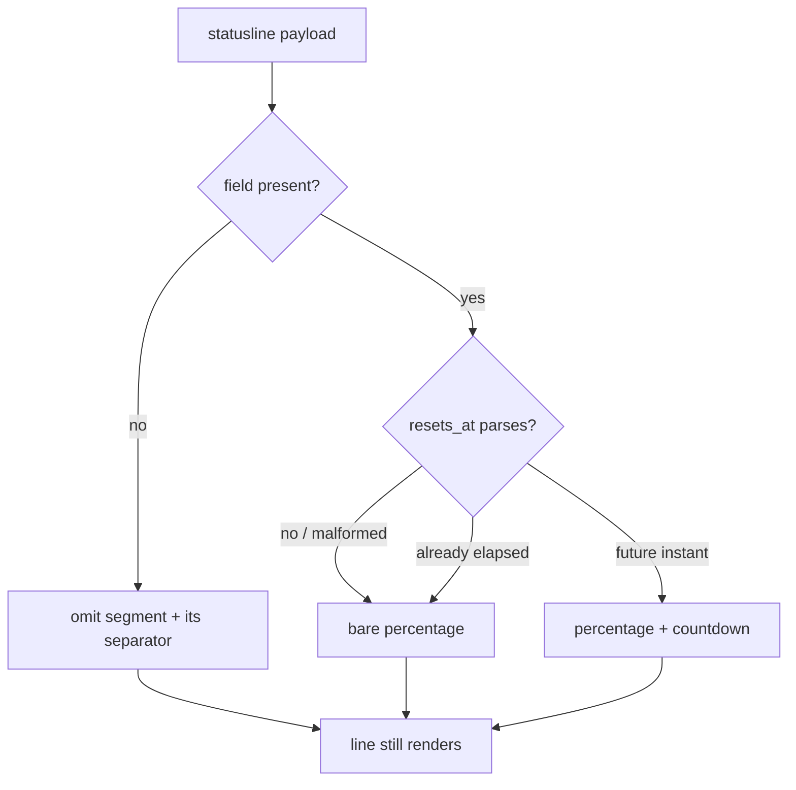

# statusline token bar + weekly quota (2026-07-19)

Follow-on to PR #18's status line. Adds an orange model name, a context-pressure progress bar, a
per-session cumulative token counter, and a weekly rate-limit segment — and **removes** a
cost-estimate feature that was requested, built, and then deliberately deleted.

Authorship note: this work was briefly recorded in `CODING_MEMORY.md` as unattributed
"parallel work in tree, do not commit blind." That was a misattribution by a concurrent session
that saw the file change mid-session. It is this session's work; the entry has been corrected.

## What shipped

| Segment | Colour | Source |
|---|---|---|
| Model name | orange (256/208) | `model.display_name` |
| Context bar + count | green/yellow/orange/red | `context_window.total_input_tokens` |
| Cumulative tokens | cyan | `current_usage.input_tokens + output_tokens`, persisted |
| Weekly quota | purple (256/141) | `rate_limits.seven_day.used_percentage` + `resets_at` |

Rendered: `➜ user@host dir git:(branch) ✗ │ Opus 4.8 (1M context) │ ██████░░░░ 61.0k │ Σ 10.2k │ ⏱ 41% used · resets 2d 3h`

## Key decisions

**Bar scales to a fixed 100k reference, not the model's context window.** 100k is the point at
which the session is worth clearing, so that — not the model's headroom — is the number that
matters. Scaling colour and fill to the same reference fixed a real inconsistency: against a 1M
window, a 143k session rendered as a nearly-empty bar coloured red, which read as a bug. Past
100k the bar pins full+red; the exact count still shows numerically.

**Cumulative counts input + output only.** Cache reads dominate raw token flow by two orders of
magnitude (this account's stats: ~2.7B cache-read vs ~13M output on one model), so including them
swamped the figure — it climbed ~162k/turn instead of ~10k/turn and stopped tracking conversation
volume. `$sig` still fingerprints all four fields, because that is for *detecting* a new API call,
not measuring one.

**Cost display was built, then removed entirely.** The user is on a subscription plan, not metered
billing. `stats-cache.json` reports `costUSD: 0` for every model, and the statusline payload has no
cost field — so any dollar figure would be locally computed from a hand-maintained price table and
would look authoritative while being invented. Removed: 16 price constants, the model→rate mapping,
`have_rates`/`is_numeric`/`format_usd`, and the cross-session `rate-window.json` state file.

**Weekly quota is a percentage, not a token count.** The user asked for "tokens left before the
weekly reset." Confirmed against the official statusline docs: `rate_limits` exposes
`used_percentage` and `resets_at` only — no allowance, no remaining count, for either window, and
nothing per-model. An absolute figure is therefore uncomputable from the payload; the percentage is
the honest form of the same question.

## Bug caught by schema verification

`resets_at` is **Unix epoch seconds**, not ISO-8601. The first implementation assumed ISO, so
`date -f '%Y-%m-%dT%H:%M:%S'` rejected it, GNU `date -d` does not exist on macOS, and `to_epoch`
returned empty. A failed parse is indistinguishable from an absent field at the call site, so the
countdown would have silently never rendered — a bare `⏱ 41% used` forever, with no signal that
anything broke. `to_epoch` now takes the all-digits path first (no `date` fork) and keeps ISO as a
fallback, so a format change in either direction still renders.

This is the second time in two statusline efforts that an unverified schema assumption produced a
silent failure. The general shape: **a guessed field name or type fails closed, and failing closed
looks exactly like the feature being off.**

## Degradation paths (now covered by the regression suite)

**History of this claim, kept because the drift is the lesson.** The first version of this file
said "all verified by execution," which reads as "the tests pass." They did not:
`statusline-command.test.sh` was never updated or run for this change and sat **red at 17/20**
(3 assertions still expecting the old `"N tokens"` format). The claim was corrected to
"hand-run payloads, not regression-protected" — accurate, but it left the evidence living only
in a session transcript.

**Now resolved.** The hand-built payloads are ported into the suite, which is **green at 36/36**.
Every case below is asserted there, and the assertions were validated by *falsification* rather
than by passing: mutating the script (ISO-only `resets_at` parsing, sigma counting cache reads,
bar reference widened to 1M, `model_name` strip removed) turns the relevant assertions red.
The injection group's ceiling is now a per-payload benign twin instead of one global baseline —
see §Injection ceiling below.

Verified cases: epoch integer, ISO string, fractional seconds, `null` resets_at, elapsed timestamp,
malformed timestamp, `seven_day` absent, `rate_limits` absent, `current_usage: null`.
Two documented conditions the design must survive, both confirmed handled: `rate_limits` appears
only for Pro/Max subscribers *after the first API response*, and `current_usage` is `null` before
the first call and immediately after `/compact` (Σ holds its prior total rather than resetting).

## Σ lost update: serialised with a mkdir lock (ADR 0005)

Judge finding (b), fixed. The read-modify-write is now serialised with a
`mkdir`-based lock, re-reading the total *inside* the lock. Full rationale and
the rejected alternatives: `docs/decisions/0005-statusline-counter-lock.md`.

Worse than the verdict framed it. The two-writer repro (+1000/+1400 → 1200)
reads as a marginal undercount; at 20 writers the stored total was **1213
against an expected 20410** — the seed plus exactly one writer. Every other
update was lost, because all 20 read the same starting value and the last write
won outright. The counter was not approximate, it was reporting one call.

The state file moved from JSON to two lines of plain text. That is the enabling
change, not a tidy-up: JSON cost two `jq` forks (~8ms) *inside* the critical
section, and a section that long cannot serialise waiting renders inside any
delay a prompt can absorb.

**Two bugs found in the lock itself, by hand-probing paths the suite did not
reach** — the same failure mode this branch keeps repeating:

1. The PID check was **dead code from the start**. The PID was written with
   `printf '%s'` (no trailing newline), so `read` hit EOF and returned
   non-zero, and a `|| holder=""` fallback then discarded the value it had just
   read. Every stale lock fell through to the slow age path. Caught only by
   constructing a dead-PID lock by hand.
2. The give-up ceiling was **455ms, not the ~200ms the constants implied**,
   because the age check forked `find` on every spin iteration.

Both are now covered by regression tests rather than living in a transcript.

**The first version of that regression test did not catch bug 1.** It planted the lock's PID file
with a trailing newline, so `read` returned 0, the clobber never fired, and re-introducing the bug
passed 44/44. The test was asserting a condition the buggy writer could not produce. It now plants
both forms, and the *unterminated* one is the case that matters. Writing the test was not the same
as the test working — only the mutation showed which of those had happened.

**Third bug, found by the observability judge rather than by me or the suite: breaking a stale lock
was itself a lost update.** `rm -rf` on the live lock path means several renders each judge the same
lock stale and each remove it — and a removal landing after another render legitimately acquired the
lock deletes a *live* lock. The mechanism built to prevent lost updates was causing them. Invisible
to every test here because all the stale-lock cases were single-render.

Fixing it took two changes, and the obvious one was measurably not enough:
break by atomic **rename** (never remove in place, and verify the captured directory is the one
judged) got it from failing 4-of-8 to failing **4-of-10** — barely moved. The stampede was the real
cause: twenty renders each acting on a judgement already out of date. Serialising breakers behind a
second `mkdir` lock, with the holder re-read *inside* it, took it to **0-of-20**.

Also added on the judge's read: an age backstop for a PID that merely *looks* alive (PIDs are reused;
without it a wedged counter never recovers), and an ownership check before release. ADR 0005's
"totals are exact under concurrency" was an overclaim and has been corrected.

**Round 3 — the same class again, twice more, and the general rule that finally covers it.** The
backstop I had just added judged a lock by **age** and then verified the capture by **PID**. A lock
released and re-taken in between passed the PID check, so it deleted a live lock: the bug wearing the
fix's clothes. And the breaker lock had none of the protections the state lock had just been given —
raw `rm -rf` on its live path, unconditional release — so two renders could hold it at once and
defeat the serialisation that *is* the fix.

The rule, now encoded rather than remembered: **verify a break against whatever justified it.**
`break_lock_verified` takes the justification as a mode (`age` / `pid:<expected>`); `mv` preserves
mtime, which is what makes verifying age on the captured directory sound. Both locks now share one
break and one release implementation — two implementations of the same protocol is exactly how the
breaker came to lack guards the state lock already had.

**Every safety mechanism from round 2 was untested.** Deleting the backstop outright, or stripping
the release ownership check, both left the suite fully green — a guard no test can distinguish from
its own absence. Some of them are unreachable by any black-box render (release only matters when a
lock is broken and re-taken inside another render's ~3ms critical section), so the suite now sources
the script in a subshell with stdin closed and calls the lock helpers directly. Both
previously-uncaught mutations now fail with a specific reason.

Cost: the suite is ~6.5s, dominated by two deliberate ~390ms give-up paths and two 20-way
concurrency cases. Slow for a statusline, and worth it — these are the only assertions that have
ever caught these bugs.

The give-up-time assertion is deliberately coarse and says so: the bug measured ~455ms against an
intended ~390ms ceiling, and no portable timing assertion separates those. That constraint lives in
the `LOCK_ATTEMPTS` comment, not in a test that would only pretend to enforce it.

**Sizing the budget is a measurement, not arithmetic.** 10 attempts (~190ms)
looked like the safer prompt-latency choice and failed the concurrency test
every run (387–495 of 510). 20 concurrent renders take ~314ms to drain, so any
budget under that structurally guarantees the last waiters give up. 20 attempts
(~390ms) sits above it. The dominant cost is the fork of `/bin/sleep` (~9ms),
not the interval — tune `LOCK_ATTEMPTS`, never `LOCK_SLEEP`.

## Injection ceiling: one global baseline → per-payload benign twins

The injection tests assert that a hostile field value adds no escape bytes to the output. They did
that by comparing every hostile render against `BASE_ESC`, the escape count of one shared baseline
payload. That only holds while the baseline renders the *same segments* as the injection payloads,
and adding the context bar broke it silently: the baseline grew a second segment the injection
payloads did not carry, opening **4 bytes of slack**. Measured, not inferred — and a mutation that
removes the `model_name` strip leaks an escape to 11, comfortably under the old ceiling of 14, so
the leak would have passed with every assertion green.

Each hostile payload now carries a **benign twin** — the same shape with harmless values — and is
compared against the twin's own escape count. Adding a segment moves both sides, so the comparison
cannot drift again. Every case now reads exactly `esc=N<=N`.

One trap found while fixing it, worth recording because the obvious twin is the wrong one: the
`$PWD`-fallback group's twin must live **outside** any git repo. A sibling directory inside the
throwaway repo looks natural and is wrong — the hostile directory's real name contains control
bytes, so its *stripped* path does not exist on disk, `git -C` fails, and no git segment renders.
A twin inside the repo does render one, which put that group's ceiling **8 escapes** above what the
hostile payload could legitimately emit — looser than the global baseline it replaced. Matching the
segment set is what makes a twin a twin; sharing a parent directory is not.

## Open cosmetics (not defects)

- Duration floors rather than rounds: 2d 3h 59m reads `2d 3h`.
- Bar fill rounds, so 95k–99,999 shows 10 blocks while still orange.
- `format_k` has no megabyte rollover: long sessions read `Σ 1135.4k`.

## State

`~/.claude/statusline-state/session-<id>.json`, gitignored. Keyed per session (parallel sessions
each keep their own counter), written atomically via temp+`mv`, corrupt/missing falls back to zero
rather than erroring — the status line must never fail in a way that blanks the prompt.

**Known defect (judge-confirmed, unfixed).** The atomic `mv` prevents a reader seeing a half-written
file; it does **not** prevent lost updates. Two overlapping renders can both read the same total and
both write back: reproduced as seed 200 + concurrent 1000/1400 → 1200, not 2600. The winning write
also stores the loser's `sig`, so the counter stays desynced rather than self-correcting. The
in-script comment conflates torn reads with lost updates and overstates the guarantee. Window is
narrow (~97ms render vs ~300ms throttle) but `git status` sits in that path and can exceed it in a
large repo. Needs a lockfile or an explicitly documented undercount — believing `mv` covers it is
the unsafe option.
