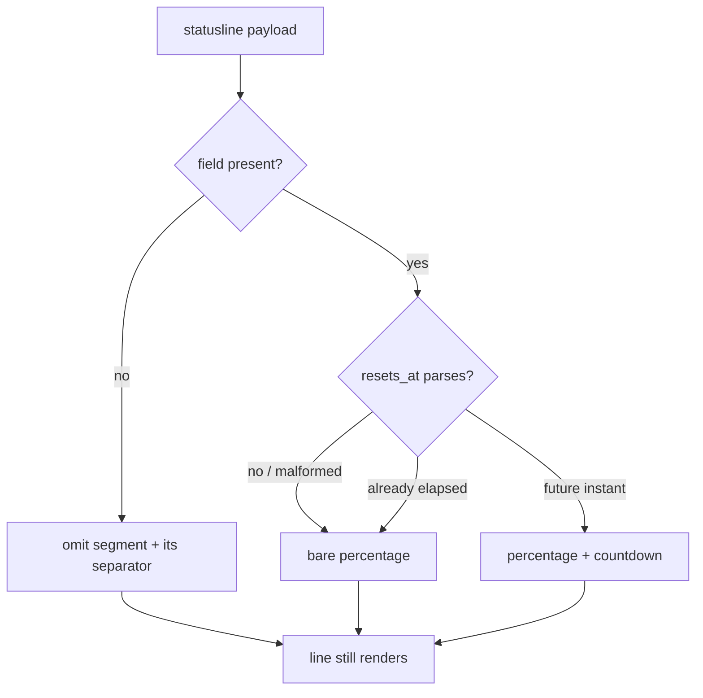

# statusline token bar + weekly quota (2026-07-19)

Follow-on to PR #18's status line. Adds an orange model name, a context-pressure progress bar, a
per-session cumulative token counter, and a weekly rate-limit segment — and **removes** a
cost-estimate feature that was requested, built, and then deliberately deleted.

Authorship note: this work was briefly recorded in `CODING_MEMORY.md` as unattributed
"parallel work in tree, do not commit blind." That was a misattribution by a concurrent session
that saw the file change mid-session. It is this session's work; the entry has been corrected.

## What shipped

| Segment | Colour | Source |
|---|---|---|
| Model name | orange (256/208) | `model.display_name` |
| Context bar + count | green/yellow/orange/red | `context_window.total_input_tokens` |
| Cumulative tokens | cyan | `current_usage.input_tokens + output_tokens`, persisted |
| Weekly quota | purple (256/141) | `rate_limits.seven_day.used_percentage` + `resets_at` |

Rendered: `➜ user@host dir git:(branch) ✗ │ Opus 4.8 (1M context) │ ██████░░░░ 61.0k │ Σ 10.2k │ ⏱ 41% used · resets 2d 3h`

## Key decisions

**Bar scales to a fixed 100k reference, not the model's context window.** 100k is the point at
which the session is worth clearing, so that — not the model's headroom — is the number that
matters. Scaling colour and fill to the same reference fixed a real inconsistency: against a 1M
window, a 143k session rendered as a nearly-empty bar coloured red, which read as a bug. Past
100k the bar pins full+red; the exact count still shows numerically.

**Cumulative counts input + output only.** Cache reads dominate raw token flow by two orders of
magnitude (this account's stats: ~2.7B cache-read vs ~13M output on one model), so including them
swamped the figure — it climbed ~162k/turn instead of ~10k/turn and stopped tracking conversation
volume. `$sig` still fingerprints all four fields, because that is for *detecting* a new API call,
not measuring one.

**Cost display was built, then removed entirely.** The user is on a subscription plan, not metered
billing. `stats-cache.json` reports `costUSD: 0` for every model, and the statusline payload has no
cost field — so any dollar figure would be locally computed from a hand-maintained price table and
would look authoritative while being invented. Removed: 16 price constants, the model→rate mapping,
`have_rates`/`is_numeric`/`format_usd`, and the cross-session `rate-window.json` state file.

**Weekly quota is a percentage, not a token count.** The user asked for "tokens left before the
weekly reset." Confirmed against the official statusline docs: `rate_limits` exposes
`used_percentage` and `resets_at` only — no allowance, no remaining count, for either window, and
nothing per-model. An absolute figure is therefore uncomputable from the payload; the percentage is
the honest form of the same question.

## Bug caught by schema verification

`resets_at` is **Unix epoch seconds**, not ISO-8601. The first implementation assumed ISO, so
`date -f '%Y-%m-%dT%H:%M:%S'` rejected it, GNU `date -d` does not exist on macOS, and `to_epoch`
returned empty. A failed parse is indistinguishable from an absent field at the call site, so the
countdown would have silently never rendered — a bare `⏱ 41% used` forever, with no signal that
anything broke. `to_epoch` now takes the all-digits path first (no `date` fork) and keeps ISO as a
fallback, so a format change in either direction still renders.

This is the second time in two statusline efforts that an unverified schema assumption produced a
silent failure. The general shape: **a guessed field name or type fails closed, and failing closed
looks exactly like the feature being off.**

## Degradation paths (verified by hand-run payloads — NOT by the regression suite)

**Correction.** An earlier version of this file said "all verified by execution," which reads as
"the tests pass." They do not: `statusline-command.test.sh` was never updated or run for this
change and is **red at 17/20** (3 assertions still expect the old `"N tokens"` format). What
follows was verified by hand-constructed payloads run live — real evidence, but not
regression-protected, and it lives only in a session transcript until ported into the suite.

Verified cases: epoch integer, ISO string, fractional seconds, `null` resets_at, elapsed timestamp,
malformed timestamp, `seven_day` absent, `rate_limits` absent, `current_usage: null`.
Two documented conditions the design must survive, both confirmed handled: `rate_limits` appears
only for Pro/Max subscribers *after the first API response*, and `current_usage` is `null` before
the first call and immediately after `/compact` (Σ holds its prior total rather than resetting).

## Open cosmetics (not defects)

- Duration floors rather than rounds: 2d 3h 59m reads `2d 3h`.
- Bar fill rounds, so 95k–99,999 shows 10 blocks while still orange.
- `format_k` has no megabyte rollover: long sessions read `Σ 1135.4k`.

## State

`~/.claude/statusline-state/session-<id>.json`, gitignored. Keyed per session (parallel sessions
each keep their own counter), written atomically via temp+`mv`, corrupt/missing falls back to zero
rather than erroring — the status line must never fail in a way that blanks the prompt.

**Known defect (judge-confirmed, unfixed).** The atomic `mv` prevents a reader seeing a half-written
file; it does **not** prevent lost updates. Two overlapping renders can both read the same total and
both write back: reproduced as seed 200 + concurrent 1000/1400 → 1200, not 2600. The winning write
also stores the loser's `sig`, so the counter stays desynced rather than self-correcting. The
in-script comment conflates torn reads with lost updates and overstates the guarantee. Window is
narrow (~97ms render vs ~300ms throttle) but `git status` sits in that path and can exceed it in a
large repo. Needs a lockfile or an explicitly documented undercount — believing `mv` covers it is
the unsafe option.
