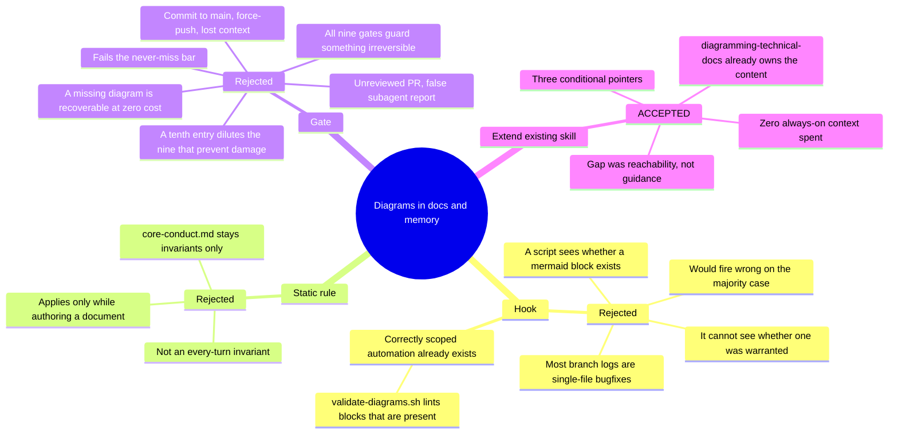

# ADR 0004 — Make the Diagramming Standard Reachable, Not Enforced

**Status:** Accepted (2026-07-19)

## Context

`diagramming-technical-docs` (ADR-less, PR #12) defined a complete Mermaid documentation standard.
But at commit `b6362ff` it was referenced from exactly two places outside its own directory:
`managing-session-memory:14`, scoped strictly to ADRs under `docs/decisions/`, and the always-on
`CLAUDE.md:21` catalog line. Nothing named it on the paths that write `CODING_MEMORY.md` or
`coding-memory/`, and neither judge rubric scores for diagrams.

So the standard existed and was good, but could not self-trigger while writing branch logs, decision
entries, specs, or agent-architecture designs. The defect was **reachability**, not missing content —
a distinction that determines which enforcement tier is even applicable.

The user's framing ("do I have a rule in place") invited a rule. `triaging-new-instructions` was run
to test that framing rather than satisfy it.

## Decision

Add one conditional cross-reference to each of three existing skills — `managing-session-memory`,
`writing-specs`, `designing-agentic-architecture` — and **create no new rule, gate, or hook.**

The alternatives were weighed in tier order, and each rejection carries a specific reason:

Each pointer states a condition — "when the thing has structure" — rather than a blanket mandate,
because an unconditional "always diagram" produces decorative diagrams and trains readers to skip
them. (Recorded honestly: only `managing-session-memory:18` carries that condition in its own
wording. `writing-specs:26` appends to an already-unconditional bullet and constrains format;
`designing-agentic-architecture:55` is imperative, conditioned by the DAG section it sits in.)

## Consequences

- **`CLAUDE.md`, `rules/core-conduct.md`, and `rules/gates.md` are untouched.** This change spends
  zero always-on context — the usual failure mode for "add a documentation rule," avoided.
- **Nothing is now mandatory that wasn't before.** Diagram absence never blocks a commit or a PR.
  A future author who judges a diagram unwarranted is complying, not evading.
- **The change is unfalsifiable by design, and this is an accepted cost rather than an oversight.**
  Nothing can report that it failed: `validate-diagrams.sh` lints diagrams that are present and
  structurally cannot flag a warranted-but-absent one — the same asymmetry that made the hook wrong.
  "It worked" is an assumption carried indefinitely, not a fact that will be reported.
- **Revisit-when trigger:** watch the next two or three `coding-memory/` branch logs. If one lands
  with real structure and no diagram, the `managing-session-memory` pointer is in the wrong place —
  move it from the index-description bullet into the save-time procedure section. That pointer is
  the weakest of the three: memory restores at session *start*, but branch logs are written at
  session *end*, and a `/compact` between can drop the skill text before the authoring moment.
- **Escalation path if that revisit fails:** the next tier up is a gate stub, not a hook. The hook's
  rejection is structural (a script cannot judge warrant) and does not become valid with more
  evidence; the gate's rejection is a cost/benefit call that new evidence could legitimately overturn.
- **Precedent for the tier test.** ADR-0003 deferred a `spec-guard` hook "until the gate is observed
  being skipped." This applies the same restraint one tier lower: prove the cheap mechanism fails
  before buying the expensive one.
- Supersedes nothing. Closes the diagramming half of open item 4 in `CODING_MEMORY.md`; that item's
  other half — retiring `coding-memory/decisions.md` in favour of this directory — stays open.
