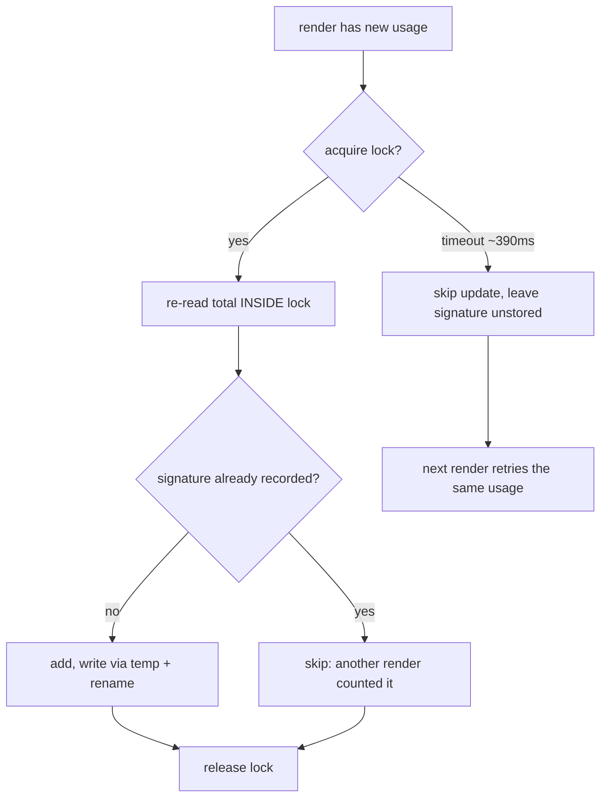

# ADR 0005 — Serialise the statusline token counter with a mkdir lock, and store its state as plain text

**Status:** Accepted (2026-07-19)

## Context
The statusline's Σ segment keeps a per-session running token total in
`~/.claude/statusline-state/`. Each render reads the total, adds the current
call, and writes it back. That read-modify-write was unguarded, so two renders
that overlap both read the same starting value and the later write erases the
earlier one — a lost update.

The observability judge flagged this (risk=high) with a two-writer repro:
seed 200, concurrent +1000/+1400, stored 1200 rather than 2600. Reproducing it
at 20 writers showed it is much worse than that framing suggests: against a
seeded 200 the file stored **1213**, the seed plus exactly one writer. Under
real concurrency the counter reported roughly a single call regardless of how
many calls occurred.

The existing atomic-`mv` write did not and could not help. It guards a torn
*read*; this is a lost *update*. The in-script comment conflated the two, which
is why the gap survived review.

## Decision
Serialise the read-modify-write with a `mkdir`-based lock, re-reading the total
*inside* the lock, and store the state as two lines of plain text instead of
JSON.

`mkdir` is the primitive because it is atomic on every POSIX filesystem and
needs no `flock`, which macOS does not ship. The holder's PID is recorded inside
the lock so an orphaned lock can be cleared rather than wedging the counter.

The plain-text format is not cosmetic — it is what makes the lock viable. JSON
required two `jq` forks (~8ms measured) inside the critical section, and a
section that long cannot serialise several waiting renders inside any delay a
prompt can absorb. Plain text is read with the `read` builtin, leaving one `mv`
as the only fork under the lock.

## Options weighed
- **Lockfile (chosen):** correct totals. Costs a bounded wait and a stale-lock
  recovery path. Selected by the user over the alternatives below.
- **Document the undercount honestly:** zero new failure modes, but leaves a
  number that is wrong by an order of magnitude under concurrency — which is
  not an "approximate" total, it is a misleading one.
- **Lock with fallback to an unlocked write on timeout:** keeps the common case
  correct without ever waiting long, but retains the corruption path it was
  meant to close, and still needs the undercount documented.

## Breaking a stale lock (added after review)

The first implementation cleared a stale lock with `rm -rf`. That is itself a
lost-update bug: several renders each judge the same lock stale, and a removal
landing after another render has legitimately acquired the lock deletes a *live*
lock. The observability judge found and reproduced this — the mechanism built to
prevent lost updates was causing them.

Two changes fix it, and the first alone was measured insufficient:

1. **Break by renaming, never by removing in place.** `rename()` is atomic, so
   one breaker wins and the losers see `ENOENT`. The winner only ever deletes the
   directory it captured, never the live path, and verifies the capture is the
   lock it judged before deleting — restoring it on a mismatch.
2. **Serialise the breakers.** Renaming alone still failed 4 runs in 10, because
   twenty renders each acted on a judgement already out of date by the time they
   acted. A second `mkdir` lock means only one render ever attempts a break, and
   it re-reads the holder *inside* that lock so its judgement is current.

Releasing is ownership-checked for the same reason: a render whose lock was
broken and re-taken must not remove the new holder's lock on its way out.

A third change followed a later review, and it is the general rule the first two
were special cases of: **verify a break against whatever justified it.** The
first version of the post-spin age backstop judged a lock by AGE and then
verified the capture by PID. A lock released and re-taken in between passed the
PID check, so a live lock was deleted — the same bug, wearing the fix's clothes.
`break_lock_verified` now takes the justification as a mode (`age` or
`pid:<expected>`), and `mv` preserving mtime is what makes verifying age on the
captured directory sound.

The breaker lock also had to be given the protections the state lock had just
received — its orphan clearing was a raw `rm -rf` on the live path and its
release was unconditional, letting two renders hold it at once and defeating the
serialisation. Both locks now share one break and one release implementation,
because two implementations of the same protocol is precisely how the breaker
came to lack guards the state lock already had.

**`mv` on directories is not "rename or fail".** The `mv` utility moves a source
directory *inside* an existing target directory and reports success, so a
restore written as `mv "$grave" "$lock"` cannot fail — its `|| rm -rf` was dead
code — and when the path had been retaken it buried the capture inside the live
lock, putting the capture's pid file where the true owner's belonged and making
the owner fail its own ownership check. An earlier revision of this ADR
described that path as "the captured directory is dropped", which was
mechanically wrong rather than merely optimistic.

Restoring therefore uses `mkdir`, which *is* atomic and *does* fail when the
path is taken — precisely the test wanted. If the path is free the lock is
recreated with its owner's pid; if not, a newer lock owns it and the capture is
discarded. Recreating resets the lock's mtime, which only delays a future
age-based break: the safe direction. Capturing likewise fails closed when a
grave path already exists, rather than nesting into a leftover.

**Residual window, accepted deliberately:** the capture-verify-restore shape has
a window between judging a lock and capturing it. Review could not construct a
reachable interleaving through `clear_stale_lock`, where serialisation plus
in-lock re-reading closes it, so this is a property of the shape rather than a
known live path. It costs one wrong cosmetic total and self-heals on the next
render. Closing it outright requires a compare-and-swap the filesystem does not
offer.

## Consequences
- Totals are exact under normal concurrency: 20 concurrent renders against a
  seeded 100 store the full 510, verified over repeated suite runs, and the
  stale-lock-breaking path is clean over 20 consecutive runs. **Not
  unconditionally exact** — the residual window above remains, as does the
  skip-on-timeout behaviour below. An earlier draft of this ADR claimed
  exactness outright; that was an overclaim and the judge was right to flag it.
- **Failing to acquire is not an error.** The update is skipped, and because the
  signature is not stored either, the next render retries the same usage — so a
  timeout is usually deferral, not loss. It is only a real loss when usage moves
  on before any retry wins the lock, which needs sustained contention.
- **Worst-case added latency is ~390ms**, paid only by a render that never
  acquires. This is sized above the ~314ms measured for 20 concurrent renders to
  drain: a budget below the drain time does not degrade gracefully, it
  structurally guarantees the last waiters give up. A 10-attempt (~190ms) budget
  was tried first and failed the concurrency test every run at 387–495 of 510.
  The dominant cost is the fork of `/bin/sleep` (~9ms), not the sleep interval —
  so tune `LOCK_ATTEMPTS`, never `LOCK_SLEEP`.
- Legacy `session-*.json` state files are inert leftovers; the new reader
  rejects them on charset validation, so affected counters restart from the
  current call once. Cosmetic and one-time.
- Stale locks are cleared by PID liveness (`kill -0`), falling back to age for a
  lock whose holder died before writing its PID. A *young* pid-less lock is
  deliberately left alone — that is the normal microseconds-long window of a
  healthy holder, and breaking it would reintroduce the lost update.
- A PID that *looks* alive is not trusted indefinitely: PIDs are reused after
  wraparound, and `kill -0` cannot tell a reused PID from the original holder,
  so without a backstop such a lock would wedge a session's counter permanently
  and silently. The age backstop runs only after the spin is exhausted, keeping
  its `find` fork off the contended path; the counter recovers on the next
  render. A breaker lock orphaned by a killed render is cleared the same way.
- **Revisit trigger:** if the statusline ever renders from more than a handful
  of concurrent processes per session, or if the ~390ms ceiling becomes visible
  in practice, the fork-dominated spin is the thing to replace — a real `flock`
  (via a helper) removes both the spin and its ceiling.
