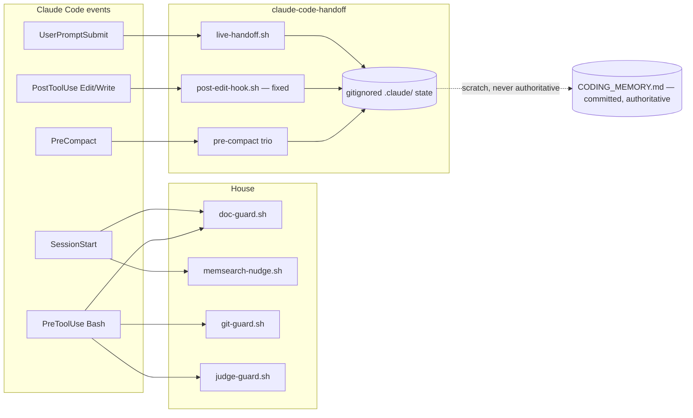

# ADR 0006 — Handoff cherry-pick: both memory systems stay, committed memory is the source of truth

**Status:** Accepted (2026-07-20)

## Context

`Sonovore/claude-code-handoff` @ `c6cb717` was vendored verbatim (user's call over
adapt-into-existing) and ran in parallel with the house memory stack
(`CODING_MEMORY.md` + doc-guard + memsearch), creating duplicate session-start
restores, two checkpoint paths, and two sources of truth for "what were we doing."
A 15-row comparison chart (artifact `e570411a`, regenerable from
`coding-memory/branches/add-claude-code-handoff.md`) put every overlapping feature
to a per-row user decision.

## Options weighed

1. **Handoff wholesale** — one imported system, but voluntary-only (no enforcement),
   gitignored state (no durability), and a per-prompt injection at odds with Context
   Discipline.
2. **House only** — revert the install; loses the genuinely novel pieces (bug ledger,
   prompt capture, mode machine, one-command checkpoint).
3. **Per-feature cherry-pick (chosen)** — the user picked a winner per row.

## Decision (the user's picks, 2026-07-20)

| Feature | Winner | Executed as |
|---|---|---|
| Session-start restore | House | handoff `session-start.sh` registration removed |
| Searchable long-term memory | House | no change (handoff has none) |
| Per-turn live state upkeep | Both | `live-handoff.sh` stays registered |
| File-edit tracking | Both | tracker kept **and its upstream bug patched locally** |
| Manual checkpoint command | Handoff | `/handoff` named the checkpoint UX in `managing-session-memory` |
| Multi-session task tracking | Both | both trackers live, no change |
| Bug investigation ledger | Handoff | `bug-test-log.md` ledger adopted as-is |
| Verbatim prompt capture | Handoff | `recent-prompts.md` capture stays |
| Work-mode state machine | Handoff | `.claude/mode` machinery stays |
| Session reset | Both | `/clear`+checkpoint-first and `/handoff` Clean both available |
| Handoff-writing philosophy | Both | "write for the NEXT window" absorbed into `managing-session-memory` |
| Pre-compaction save | Handoff | **doc-guard's PreCompact registration removed**; handoff trio owns the event |
| Durable decision records | House | ADRs + `coding-memory/` remain (this file) |
| Enforcement guarantees | House | doc-guard/git-guard/judge-guard untouched elsewhere |
| Storage & git posture | House | committed `CODING_MEMORY.md` is the single durable source of truth |

Post-pick event ownership:

## Why this resolution of the core tension

"Checkpoint: Handoff" and "Storage: House" coexist by splitting UX from durability:
`/handoff` is the command a human reaches for; the `CODING_MEMORY.md` save+push it
sits beside is the record that survives machine loss and review. The state files the
handoff hooks maintain are declared scratch — useful within a machine, never cited
as authority when they disagree with committed memory.

## Consequences

- **Local divergence from upstream:** `live-handoff.sh`'s INIT template now includes
  the `<!-- Files touched this session -->` marker, fixing the confirmed upstream bug
  where the PostToolUse tracker silently no-ops (live-handoff always won the
  file-creation race). Documented in the script's provenance header. Verified live:
  the tracker appended real entries the moment the marker existed.
- **doc-guard loses only PreCompact.** Its commit-blocking (PreToolUse) and
  session-start surfacing remain. The handoff trio saves conversation/session state
  at PreCompact but does **not** check `git status` — the pre-compact warning about
  uncommitted work is gone, not transferred; the remaining backstop is doc-guard's
  next-session-start surfacing. The trio also uses AskUserQuestion in task/bug modes
  and may stall an unattended autocompaction. Both accepted knowingly.
- **Per-prompt injection cost accepted** (pick: Both) despite the Context Discipline
  tension — revisit if it measurably crowds sessions.
- **Every project repo needs `.gitignore` entries** for the handoff state files
  (specific files, not all of `.claude/`); duty recorded in `managing-session-memory`.
