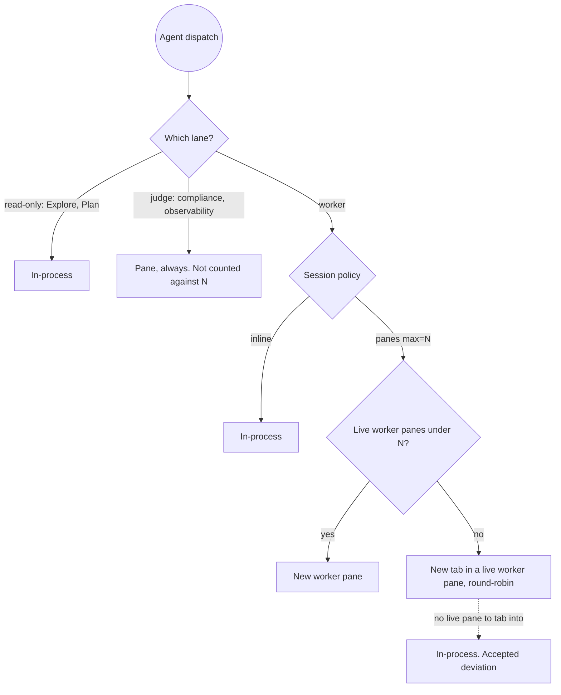

# ADR 0009 — Pane-split policy: three-lane dispatch governance

**Status:** Accepted (2026-07-24)

Agent dispatch is governed by three lanes, not one list: read-only helpers always in-process,
the two judges always paned and uncounted, and everything else a policy-governed **worker**.

## Context

ADR 0007 settled *that* substantial agents run in panes: pane orchestration absorbed
judge-terminal-enforcement, and `panes/redirect-agents.conf` became an **include-list** of
agent types the guard denies in-process. What 0007 explicitly left unimproved was the routing
guarantee — judges are pane-bound when dispatched, but plan implementers were routed by the
model's judgment, encoded as a comment in that same conf and as prose in
`skills/dispatching-pane-agents`.

The user's ask (2026-07-22) is per-session control over the worker fan-out: run it `inline`, or
in `panes` with a max concurrent count N. That control needs a machine-readable governed set,
and the include-list is not one — it names the judges, while "everything else substantial" lived
only in a skill's judgment call. Spec:
`docs/superpowers/specs/2026-07-22-pane-split-policy-design.md`.

## Options weighed

1. **Single include→exclude flip.** Invert `redirect-agents.conf` into one exclude-list: read-only
   helpers excluded, everything else — judges included — governed by the session policy. One file,
   one predicate, the smallest possible change. It fails on both of the user's review-gate choices
   below: with judges inside the governed set, `inline` silences the judges' panes and a judge pane
   consumes a worker slot.
2. **Three-lane split (chosen).** `redirect-agents.conf` is *narrowed* from "everything substantial"
   to the two judges — an always-paned lane checked **before** the policy — a new
   `panes/inprocess-agents.conf` carries the read-only helpers, and everything matching neither
   falls through to the policy as a worker.

Two user choices at the 2026-07-22 review gate decided it:

- **`inline` must not silence the judges.** The judges' always-on pane redirect is a Tier-1
  behavior the policy has no business overriding; `inline` governs the worker fan-out only.
- **Judge panes are not counted against N.** N is the user's budget for *their* fan-out. A judge
  pane opening mid-run must not silently push a worker into a tab, so judge panes sit on top of the
  N worker panes rather than inside them.

Three lanes won because those two properties are only expressible as a lane boundary evaluated
before the policy. Option 1 can approximate neither without special-casing the judges inside the
policy path — which is the three-lane model, written less clearly.

## Consequences

- **Plan implementers move from skill-routed judgment to policy-governed routing.** This reverses
  the deliberate stance carried since 0007. `rules/gates.md`'s "plan implementers are skill-routed"
  clause was corrected in place, not appended to — that file is imported into every session.
- **A new `open_tab` adapter verb**, `open_tab <surface-ref> <title> <launcher>`, extends the
  adapter contract for the first time since the original `open_pane`. The surface-ref is a new
  caller-supplied token crossing into adapter command lines, so it is pinned to a strict allowlist
  (`[A-Za-z0-9:%_.-]`, max 64) in `validate_open_tab_args`; title and launcher reuse the `open_pane`
  boundary unchanged. That allowlist is the security boundary for the whole overflow path — widen it
  only with the same adversarial evidence that established it.
- **New per-session state, `panes/state/pane-policy-<key>`**, holding one line (`inline` or
  `panes max=N`, N bounded 1..16). Written once by the model at the first eligible worker dispatch,
  read by both the guard and the dispatcher, swept by the dispatcher's existing `cleanup_stale`.
- **Overflow tabs are uncapped by design.** N caps *panes*. The (N+1)th worker may neither block
  (spec-forbidden) nor go inline, so tabs are the only remaining destination and nothing bounds
  them. If "too many tabs" ever surfaces in practice, the lever is the spec's named least-loaded
  selection fallback, not a cap.
- **A simultaneous fan-out can still degrade one worker to in-process** — a known, accepted
  deviation from the "never inline" guarantee, decided 2026-07-24. Documented for the reader in
  `skills/dispatching-pane-agents`; not restated here.
- **A failed `open_tab` reports on the target, not the adapter — but only up to a point.** It
  retires the unusable target and degrades that one spawn (exit 3, no cooldown), so a single
  stale pane cannot demote a healthy session to in-process. That reclassification carried a
  cost the first version missed: an adapter that opens panes but cannot tab retires a *healthy*
  pane on every overflow, the freed slot immediately opens a new one, and the real pane count
  grows past N without bound. `max=N` is therefore restored by a **streak** — 3 consecutive
  `open_tab` failures are treated as a tab-incapable adapter and write the cooldown after all.
  3, not 2, because over-triggering silently discards the user's explicit `panes max=N` for a
  whole session while under-triggering leaks at most 2 surplus panes, which are visible and
  self-limiting. Cleared only by a successful `open_tab`; an `open_pane` success is not
  evidence of tab capability, and one occurs between every pair of failures in that very loop.
