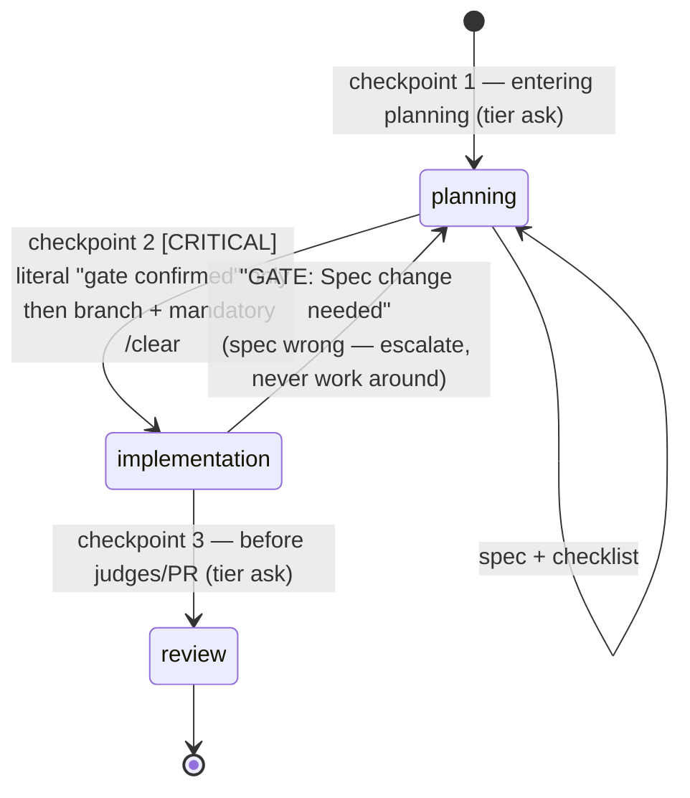

# ADR 0010 — Make a feature file's `phase` frontmatter the source of truth for permitted work

- **Status:** Accepted (2026-07-25, user)
- **Context, options & sources:** User-authored spec delivered in-session; scope resolved via
  four triage questions (see Decision). Prior state: `rules/gates.md` model-switch stub +
  `skills/managing-session-memory/SKILL.md`. Numbered 0010, not 0009, because
  `feat/pane-split-policy` (PR #28, open) already holds 0009 — a collision would surface as a
  merge conflict on an immutable file.

## Decision

Permission to do a given kind of work now derives from a **file**, not from the conversation:
every feature-scale change gets one canonical `docs/features/<name>.md` whose frontmatter carries
`phase` (`planning` | `implementation` | `review`), `model_tier`, and `branch`. `phase` governs
what is permitted; it is checked on every restore before any other action.

Alternatives weighed and rejected:

- **Full replacement** of `CODING_MEMORY.md` + `coding-memory/` + the specs/plans split. Rejected:
  12 files across `skills/`, `rules/`, and `hooks/` reference those artifacts, and the index solves
  a real cross-feature problem the per-feature file does not. Chosen instead: layer on top, with the
  new rule overriding the old wherever the two conflict.
- **Keeping all four existing model-switch checkpoints alongside the phase gate.** Rejected as
  double-booking: the phase boundaries *are* the tier boundaries. Collapsed to three, one per boundary
  — the per-task planning check was the redundant one.
- **Folding ADRs into 1–3 line task bullets** (a literal reading of the new discipline). Rejected:
  `doc-guard.sh` and both judge gates point at `docs/decisions/`, and a rationale that only lives in
  a feature file dies the first time that file is trimmed. Bullets carry ordinary gotchas; classes
  (a)/(b)/(c) still earn an ADR.
- **A `phase-guard.sh` PreToolUse hook** denying writes to source paths while `phase: planning`.
  Deferred, following the precedent already set for `spec-guard` — build the hook when the gate is
  observed being skipped, not before. Resolving "which feature file is active" is ambiguous during
  planning (`branch: none`), so the hook would have to fail open in exactly the phase it most needs
  to hold.

## Consequences

- **Behavioral pivot:** a request to implement while `phase: planning` is now *refused*, with a fixed
  reply, rather than negotiated. Likewise, "continue"/"yes"/"go ahead" no longer advance the gate —
  only the literal `gate confirmed`. Both are deliberate momentum brakes and will feel obstructive;
  that is the intended cost.
- **`coding-memory/branches/*.md` is retired for new work** — it is a "state of branch" document, which
  the one-canonical-file rule forbids. Existing branch logs are left in place and are not migrated.
- **Handoffs are now capped (~1,500 tokens) and restores are narrowed** to handoff + active feature
  file + `git status` / `git log main..HEAD`. Sessions that previously opened by reading the spec and
  the diff will have less context by design.
- **Frontmatter can now disagree with reality** (branch deleted, phase stale). That mismatch is
  specified as stop-and-report; if it turns out to fire often, that is the signal to build
  `phase-guard.sh` and reconsider the deferral above.
- **No hook or `doc-guard.sh` change was required:** `docs/features/` already satisfies the hook's
  `docs/*` doc set (`hooks/doc-guard.sh:149`).
- **Revisit when:** the first feature runs end-to-end under this workflow — specifically whether the
  frozen-spec rule sends work back to planning often enough to be worth a lighter amendment path.
