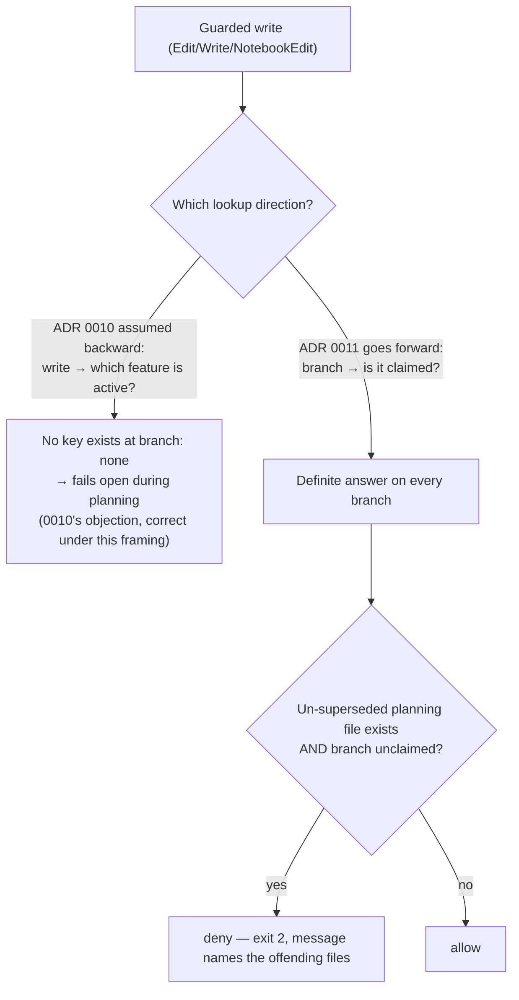

# ADR 0011 — Enforce the phase gate with a hook, using branch-scoped write permission

- **Status:** Accepted (2026-07-26, user, via the literal `gate confirmed`)
- **Amends:** ADR 0010, which weighed this exact hook and **deferred** it. Both of 0010's stated
  grounds are overturned here — one by reframing, one by a deliberate override. 0010 stays Accepted
  and unedited; this ADR is the amendment record.
- **Context, options & sources:** `docs/features/phase-guard-hook.md` — the design, the seven
  resolved open questions, and the frozen 17-task checklist. Numbered 0011 because
  `feat/pane-split-policy` (PR #28, open) still holds 0009; 0010 is this branch's.

## Decision

Build `hooks/phase-guard.sh` as a `PreToolUse` hook on `Edit|Write|NotebookEdit`. It never asks
which feature a write belongs to. It asks one different question — **does the current branch carry
implementation permission?** — which has a definite answer on every branch, including during
planning.

> Deny a guarded write when the repo has at least one feature file at `phase: planning` that no
> branch records at `implementation` or `review`, **and** the current branch is not recorded as
> `branch:` by any feature file at `phase: implementation`.

**Why 0010's objection dissolves rather than being solved.** 0010 rejected the hook because
"resolving which feature file is active is ambiguous during planning (`branch: none`), so the hook
would have to fail open in exactly the phase it most needs to hold." That is correct — under the
backward framing it assumed. The workflow *forbids branch creation during planning*, and the gate
transition is what creates and records the branch. So a planning session is **by construction**
sitting on a branch no feature file claims. The absence of a claim is not the ambiguity 0010 feared;
it is the signal. The objection was never refuted on its own terms — it was made inapplicable.

**Why the deferral was overridden deliberately.** 0010 also deferred on process grounds, following
the `spec-guard` precedent: build the hook "when the gate is observed being skipped, not before."
**No skipped phase gate has been observed to date.** The trigger condition was not met, and the
build proceeded anyway — at the gate decision (Q1), by the user, with the override named as the
question being answered rather than discovered afterward. Planning ran first specifically so the
build/defer call was made against a real design instead of an unknown. Recording this matters more
than the hook does: a deferral rule that gets quietly stepped over the first time it is inconvenient
is not a rule, and the `spec-guard` deferral it borrowed from is still live.

Alternatives weighed and rejected:

- **Per-feature attribution** (`branch:` reverse-lookup, a machine-local pointer, "exactly one
  non-`review` file", most-recently-modified). All four inherit the backward framing; each tries to
  name the active feature. Rejected as a class, not individually.
- **An env-var escape hatch (`PHASE_EXEMPT`)**, for consistency with `JUDGE_EXEMPT` / `MERGE_EXEMPT`.
  Rejected: those work because they ride a Bash command line the hook parses out of the payload, and
  an `Edit`/`Write` payload has no command-line surface to carry one. More decisively, **the escape
  hatch already exists structurally** — feature files live under `docs/**`, which this hook never
  guards, so a locked repo is always unlocked by editing the offending `phase:` frontmatter, which
  is exactly the fix the deny message names. A second bypass would add one capability only: skipping
  the gate the hook exists to hold.
- **A branch-name allowlist** (`hotfix/*` writes freely). Rejected as `PHASE_EXEMPT` through a
  different door — shipping a bypass implicitly is worse than shipping one honestly.
- **Failing closed on infrastructure failure**, as `judge-guard.sh` does. Rejected: a judge gate
  blocks one `gh pr create`, while this runs on every write, so its failure mode must be "stops
  guarding", never "blocks the user."

## Consequences

- **Two holes are disclosed non-goals, not oversights.** Both were found during design review and
  accepted on the record; neither is a defect awaiting a fix.
  - **The Bash-tool write surface is unguarded.** The matcher is `Edit|Write|NotebookEdit`, so
    `sed -i`, `cat >`, `tee`, and every other shell route to writing a file pass freely — and no
    hook on the `Bash` matcher inspects file writes either. Closing it means classifying arbitrary
    shell as write-or-not, and a guard catching 60% of shell writes invites more trust than one that
    honestly catches none. This is a **momentum guardrail, not a security boundary** — the same
    framing `merge-guard.sh` already carries. A round-2 claim that `git-guard.sh` and `doc-guard.sh`
    "still stand behind that write" was **withdrawn as false**: `git-guard.sh` guards `main`/`master`
    only, so on a worktree-isolation branch nothing stands behind the hole at all.
  - **Supersession is sticky.** The un-superseded check asks whether *any* branch records a file at
    `implementation` or `review`, and branches are never re-examined for regression. One abandoned
    experiment or undeleted merged branch permanently disarms that feature everywhere, including a
    later legitimate re-planning. The alternative is defining which branch's copy is authoritative —
    the attribution problem this design exists to avoid.
  - The honest summary: the hook is **hard to fool and easy to disarm**, and the asymmetry is
    deliberate.
- **Behavioral pivot:** source writes on `main` stay denied until a feature's PR merges and its
  `phase` advances, which also catches an unrelated hotfix branch cut from `main`. The
  un-superseded check narrows this to features whose gate has not opened anywhere; a stale abandoned
  `planning` file still locks the repo, and the deny message naming the offending file is the only
  fix by design.
- **Enforcement at branch granularity, not per-feature.** On a claimed implementation branch a
  session can still write source belonging to a different, still-planning feature. Far narrower than
  "fails open during the entire planning phase", and the honest boundary of what `PreToolUse` knows.
- **Committed ≠ armed.** The `settings.json` registration does not arm the hook for a session whose
  harness reads a checkout on another branch; it arms when this lands on `main` and that checkout
  pulls. Rollback is therefore two paths, one of them deliberately manual.
- **Two exits speak.** A missing interpreter and an all-files-unparseable `docs/features/` both mean
  "this repo opted in and the guard cannot evaluate it" — each prints one stderr line, at most once
  per session, and still exits 0. A working guard and a dead one are otherwise byte-identical.
- **`rules/gates.md` grew a clause, not a bullet** — the `Phase gate` stub was amended in place, so
  always-on context cost stayed flat at 18 bullets.
- **Revisit when:** a stale `planning` file or a sticky supersession is observed biting in practice,
  or if the Bash hole is used to route around the gate rather than merely being available.
