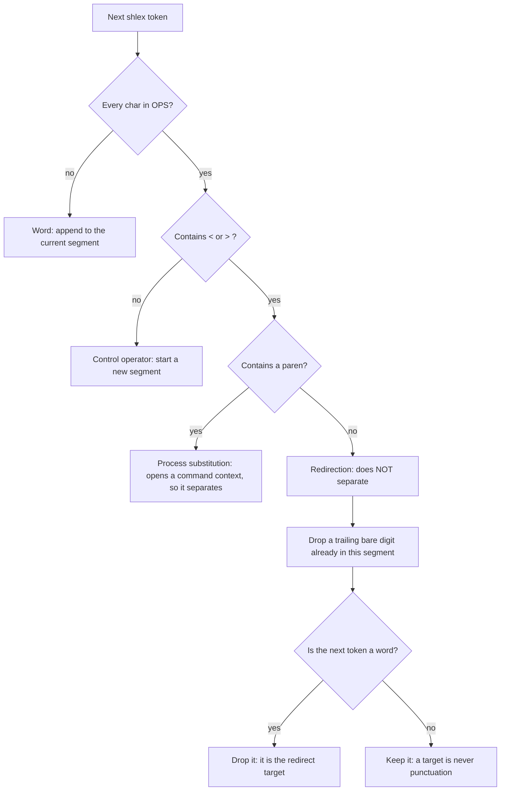

# 0015 — A redirection is part of a command, not a separator

- **Status:** accepted
- **Date:** 2026-08-04
- **Context:** `hooks/lib/shell_segments.py`, amending ADR 0013 (which amends 0012)

ADR 0013 moved the shared lexer into `hooks/lib/shell_segments.py` and recorded that its accepted
limits live with the code. This record exists because the lexer's **operator semantics changed** and
because that change introduces a **new accepted fail-open on a Tier-1 guard** — a decision, not an
inherited limit, and not something a source comment should carry alone.

## The rule

Before this change the `Contains < or >` branch did not exist — every all-`OPS` token separated.

## Context

`OPS` held `(){};<>|&` as one undifferentiated set, and the split loop started a new segment for any
token made entirely of those characters. That treats a **redirection** as a **control** operator. It
is not one: a redirection is part of the command it attaches to and may appear anywhere in it,
including before the command name.

One misclassification, three failures, all reproduced before the fix:

| | Shape | Effect |
|---|---|---|
| a | `git commit -m msg -- FILE 2>&1` | **fail-CLOSED** — the fd digit `2` survives as a phantom pathspec, and `2` is not documentation, so git-guard denied a legitimate docs commit |
| b | `git commit -m x -- foo.sh > out.txt` | `out.txt` reaches a segment's command position — noise, harmless only by luck |
| c | `> out.txt git commit -m x -- foo.sh` | 🔴 **fail-OPEN** — `argv[0]` is never `git`, so **no guard sees a commit at all** |

Mode (c) is a momentum-guardrail failure, not a security-boundary breach. These hooks are classed as
guardrails throughout, and this record does not upgrade them.

## Options weighed

1. **Drop `<` and `>` from `OPS`.** Rejected: `OPS` is also what tells shlex which characters to emit
   as standalone tokens, so removing them makes `cmd>out` lex as one word `cmd>out` and the guard
   stops recognising the command entirely — mode (c) in a worse form.
2. **Special-case the `2>&1` shape at the classifier.** Rejected: it fixes the one symptom that was
   biting and leaves modes (b) and (c) live. The user explicitly chose root cause over this.
3. **Partition the operator set (chosen).** Classify each all-`OPS` token as redirection or control,
   and consume a redirection with its target instead of splitting on it.
4. **Replace shlex with a real Bash parser** (e.g. `bashlex`). Rejected: a third-party dependency on
   the fail-closed path of a hook that runs on every Bash call, to buy correctness on shapes
   `bash -n` itself rejects. The supply-chain cost dominates.

## Decision

A punctuation token containing `<` or `>` **and no paren** is a redirection: it is consumed together
with its target and does **not** split. Every other all-`OPS` token still splits, so `|&` — bash's
pipe-with-stderr, containing neither `<` nor `>` — correctly stays a separator.

Two clauses in that sentence are load-bearing, and both were bought with a regression:

- **"and no paren."** `<(cmd)` and `>(cmd)` contain `<`/`>` but **open a command context**. Read as
  redirections they swallowed the substituted command: `cat <(gh pr create)` became
  `['cat','pr','create']`, hiding the create from `judge-guard`/`merge-guard`, and
  `echo hi > >(git commit -m x -- src/app.js)` flipped a `main` commit from block to allow. That is
  mode (c) again, reintroduced by the fix for mode (c). Both shapes are valid executable bash.
- **"whose target is a word."** Excluding parens is *not sufficient on its own*. In `> >(cmd)` the
  redirection's target is itself a substitution, so consuming the next token blindly still buried the
  command in `echo`'s argv. A punctuation token is never eaten as a target.

The first was found by the observability judge on `64ba2fa`; the second by trying the naive repair and
measuring it. Recorded because "contains `<` or `>`" reads as obviously total and is not.

## Consequences

- **Five further bypasses close**, beyond the three modes above — a 44-shape end-to-end sweep found
  no block→allow that this change does not account for. `> out git push --force` is among them: it is
  allowed on `main` today, so this was a force-push hole, not only a commit hole.

- **New accepted limit — a fail-OPEN on a Tier-1 guard.** shlex discards spacing, so `cmd 2>x` and
  `cmd 2 >x` are the same token stream and **no lexer working from shlex can tell them apart**. A
  trailing bare-digit token immediately before a redirection is therefore dropped.

  **The width is any trailing bare digit, not only a file named `2`.** `git log -n 5 > out` loses the
  `5`; `git commit -m x -- docs/foo.md 2 > out` loses the pathspec and goes **block → allow** on
  `main`. The pathspec case is the only guard-visible flip found: git-guard's docs-only exemption is
  decided from the pathspec, and doc-guard reads the staged index plus a raw-string `Doc-Exempt:`
  match, neither of which a lost token can reach.

  Accepted because the alternative reinstates a **false denial on the routine `2>&1` idiom** — the
  symptom that started this — and because a bare digit can never be `argv[0]`, so the *command* is
  still always recognised. It is pinned from both sides in `shell_segments.test.py`: one assertion
  that the digit **is** dropped, one that an ordinary filename is **not**. It cannot widen silently.

  This limit has now been written too narrowly three times. State it as *any trailing bare digit*.

- **Heredocs are unchanged and remain out of scope.** shlex cannot see heredoc bodies (ADR 0012, still
  open). The existing `\n` → `;` translation already isolates each body line into its own segment, so
  consuming `<<` and its delimiter leaves the real command's argv intact. This was the one plausible
  regression in the change and is pinned by scenario H.

- **The replay harness cannot see this defect class.** `git-guard.replay.sh` reports 378/378 identical
  across its 63-command matrix, but that matrix contains **zero redirect shapes**. It is evidence of
  *no regression* and is **not** evidence the fix works. `hooks/shell-segments-falsifier.sh` is what
  demonstrates the fix: it drives the real `git-guard.sh` on both lexers with per-row expectations and
  exits non-zero on regression, and it carries a baseline row (the same commit minus the redirect,
  allowed by both) so a denial can be attributed to the redirect alone.

- **The module now has a test suite.** It had none — the only file in `hooks/lib/` without one, while
  `classify-git-command.test.py` carried zero redirect cases. That absence is why this survived, and
  the round-1 regression proved the point twice over: the new suite as first written had no
  process-substitution case, so it could not see the defect the change itself introduced.

- **ADR 0013's fail-closed cliff is unchanged and still applies.** `git-guard.sh` fails closed if it
  cannot run the classifier, and it runs on every Bash call. This change adds logic to that path; it
  does not change its failure direction.
