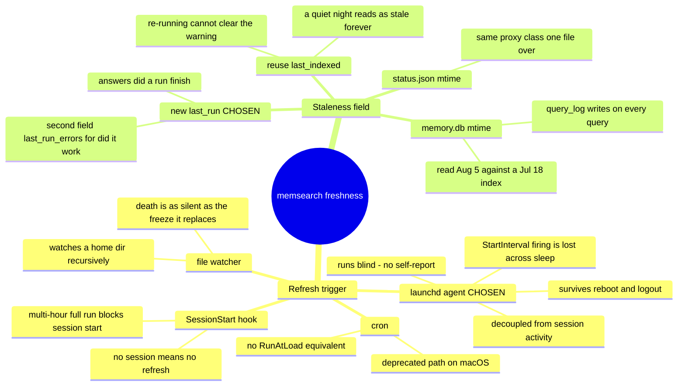

# 0018 — The index refreshes from a persistent `launchd` agent, and run recency is a field of its own

- **Status:** accepted
- **Date:** 2026-08-07
- **Context:** `docs/features/memsearch-freshness.md` design decisions 2 and 4; `memsearch/memsearch/index.py`,
  `memsearch/memsearch/status.py`, `hooks/memsearch-nudge.sh`. Standalone — does not amend a prior ADR.

Two decisions, one record, because neither survives alone: the scheduler runs blind, and the field is
what makes its silence visible.

## Context

The memory index froze for 19 days and nothing noticed. At diagnosis every row in `sources` carried
`indexed_at = 2026-07-18` while the `SessionStart` nudge went on announcing *"2332 chunks of past-session
memory indexed"* every session throughout. Two things were missing — something to refresh the index, and
something to notice when that stopped happening — and the second is what makes the first honest. A
scheduler with no monitor is the state we were already in; the freeze was, from the reader's side,
indistinguishable from a healthy index.

That framing is what couples these two decisions. The scheduler chosen below has one known weakness — it
runs unattended and does not report on itself — and the compensating control is a warning line at session
start. That warning needs a field it can read. Choosing the scheduler without choosing the field ships the
weakness with nothing behind it.

## Decision 1 — the refresh mechanism is a persistent `launchd` agent

> A `launchd` user agent (`local.memsearch-index`, `StartInterval 21600`, `RunAtLoad true`) runs
> `memsearch index` every 6h, installed from a committed template with a placeholder for `$HOME`,
> and removable by a first-class `--uninstall` path.

| Option | Why not |
|---|---|
| **Trigger from the `SessionStart` hook** | Couples index freshness to session activity — a week away from the machine is a week of no refresh, which is the failure being fixed, merely on a longer fuse. Worse, indexing is a multi-hour job on a cold cache, and this hook's whole contract (R4) is that it must never delay session start. |
| **`cron`** | Carries the same sleep gap as `launchd` (below) with none of the compensation: no `RunAtLoad` equivalent, so a machine that boots after a missed window waits for the next tick. It is also the legacy scheduling path on macOS; `launchd` is what the platform actually manages. |
| **A file watcher (`fswatch`, FSEvents)** | Would have to watch a home directory recursively to catch every indexed root, and the failure mode is the one that got us here: when the watcher dies, nothing fires and nothing says so. Trading a silent freeze for a differently-shaped silent freeze. |
| **Nothing — index by hand** | The status quo. It produced the 19-day freeze. |

`launchd` won on the one property the others lack in combination: it survives reboot and logout, it is
independent of whether a session is running, and the platform restarts it. The install path is a committed
template plus `memsearch/bin/install-schedule`, so the job is reproducible from the repo — but the rendered
plist lands in `~/Library/LaunchAgents`, **outside git**, which is why removal is specified as a
first-class script path rather than left to `git revert`.

**`PATH` in the plist is load-bearing, not boilerplate.** `launchctl getenv PATH` is empty on this machine
(verified 2026-08-07), so the job would inherit only `/usr/bin:/bin:/usr/sbin:/sbin`, while
`memsearch/bin/memsearch` is an `exec uv run` wrapper and `uv` lives in `/opt/homebrew/bin`. Without the
explicit key the job dies at exec every 6h while the installer reports success — the feature's own failure
mode, reproduced in its fix.

## Decision 2 — run recency (`last_run`) is a separate field from content recency (`last_indexed`)

> `status.json` gains `run_started`, `last_run`, and `last_run_errors`. Staleness is measured from
> `last_run` and never from `last_indexed`, which is retained unchanged for content recency.

Three candidate signals were tried before this one, and **two of them produced a confidently wrong answer
on first reading** — which is why this is an ADR rather than a schema note.

| Signal | What it actually measures | Why it fails as a staleness signal |
|---|---|---|
| `memory.db` file mtime | The last write of any kind | Read `Aug 5` against a Jul 18 index, because `query_log` is written on every *query*. A trigger keyed on it would silently never fire. |
| `status.json` file mtime | When the status file was last stamped | Same proxy class, one file over — it moves for reasons unrelated to the question. |
| `last_indexed` | How current the indexed *content* is | `SELECT max(indexed_at) FROM sources` (`db.py:156`); `indexed_at` is written only in `replace_source`, and `_index_one` returns early when a file's hash is unchanged (`index.py:125-127`). **A run that succeeds and finds nothing new never advances it.** |
| **`last_run`** (chosen) | When the indexer last finished | Advances on every completed run, including one that found nothing. |

The `last_indexed` failure is the subtle one and the reason for the split. Reading it for staleness
produces a warning that an ordinary quiet night raises and that **re-running the indexer cannot clear** —
the user is told to fix something that is not broken, by a command that does not change the number. That is
alert fatigue arriving on a Tuesday, and it burns the single channel this feature exists to open. The first
draft of the spec built its core mechanism on exactly this field.

Two questions, two fields. `last_indexed` is not wrong, it is an answer to a different question, and it
stays.

**`last_run_errors` is the third field and not optional.** `_index_one` catches every exception into
`report["errors"]` and continues, `run_index` stamps status unconditionally at the end, and `cli.py:66`
returns `0` regardless — so a run with Ollama down that indexed *nothing* completes, looks identical to a
clean run, and would **clear the very warning this design relies on**. Reporting the error count through
`status.json` rather than through the exit code is the fix; `launchd` is configured without `KeepAlive` and
would ignore a non-zero exit anyway, so changing the CLI's exit contract buys nothing. The obligation lands
on the reader instead: a non-zero `last_run_errors` must never render as a plain fresh line.

**`run_started` exists for a safety reason, not a cosmetic one.** `memsearch` has no lock or pidfile, so
telling a reader to run the indexer while a run is already going invites a second concurrent one. A
`run_started` later than `last_run` marks a run in flight, and the nudge withholds the remediation command
for that window.

## Consequences

- **A `StartInterval` firing is lost if the machine is asleep across it** — `launchd.plist(5)` states this
  outright ("that interval will be missed due to shortcomings in `kqueue(3)`"), and it also skips a firing
  that lands while a previous run is still going. `RunAtLoad true` covers boot and login but not
  sleep/wake. A laptop closed overnight can therefore cross the 8h threshold legitimately. This is
  **accepted, not mitigated**: the warning line is correct to fire — the index genuinely is stale — and the
  remediation is one command. Choosing `StartCalendarInterval` instead would coalesce missed calendar
  firings on wake, but it schedules against wall-clock times rather than elapsed time, which is a worse fit
  for "refresh every 6h".
- **The threshold sits above the interval on purpose** — refresh at 6h, warn at 8h. A threshold at or below
  the interval would fire most sessions and train the reader to ignore it, which is strictly worse than
  silence because it destroys the one channel that reports the failure.
- **The scheduler has no self-report, so the staleness line *is* its monitor.** There is no health check,
  no heartbeat, and no second observer. If the nudge's staleness path regresses, the scheduler's death
  becomes silent again — the exact 19-day failure. That makes `hooks/memsearch-nudge.sh`'s tests
  load-bearing infrastructure rather than hook hygiene.
- **The rendered plist lives outside the repo.** No commit, checkpoint, or revert removes it;
  `install-schedule --uninstall` is the only removal path, and it deliberately never touches
  `memory-index/` — removing a schedule must not destroy an index.
- **`memsearch status` changes what it shows.** `status.py:27` prints `last_indexed` as its answer to
  freshness, which is the identical misreading corrected here; it gains `last_run` and `last_run_errors`,
  and `last_indexed` is relabelled as content recency. Fixing one human-facing surface and leaving the
  other showing the misleading number would not be a fix.
- **`scheduled-index.log` grows unbounded** — four runs a day, appended, with nothing trimming it. Accepted
  for now because cross-run history is what makes a repeated failure legible, and a rotation policy needs a
  size figure no run has yet produced.
- **Timestamps are pinned to `isoformat(timespec="seconds")`**, matching `last_indexed`'s existing shape
  (`db.py:103`). A bare `isoformat()` emits microseconds and would break the format promise `status.json`
  already makes.

## What this does not decide

- **A run that walks zero files still reads as fresh.** `status.json` records no walked-source count, so a
  vanished corpus — a moved directory, a typo'd `curated_docs` entry — completes cleanly, stamps
  `last_run`, and renders fresh indefinitely. Same species as the original failure. Closing it needs a new
  field and a new state; recorded as a bounded gap by explicit user decision (2026-08-07), not overlooked.
- **Concurrency is unguarded past the abandonment threshold.** The nudge withholds the index command while
  a run looks alive, but past `RUN_ABANDON_HOURS` it reclassifies the run as stale and *does* offer the
  command. A genuinely long-lived run outliving that constant will be handed a "run the indexer" line. A
  lock or pidfile is the real fix and is not attempted here.
- **Retry and recovery.** A failed run is reported, not retried; the scheduler simply tries again in 6h.
- **Re-measuring retrieval on a cadence.** Retrieval quality is measured once, at landing. An index that is
  reliably fresh but retrieves noise stays silent afterwards.
