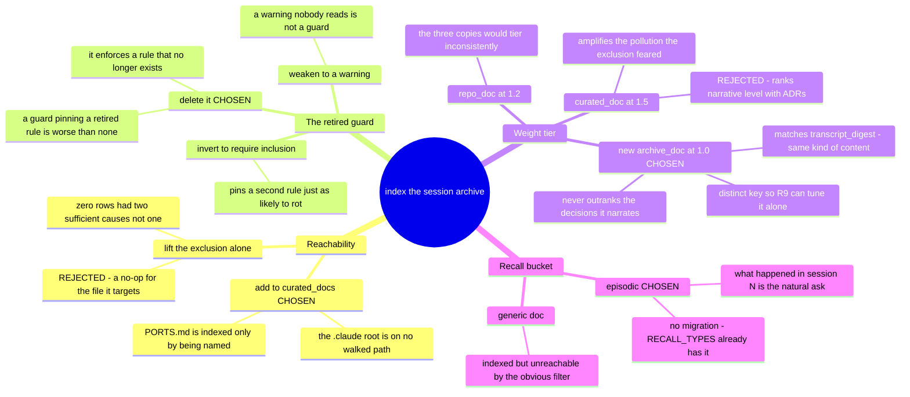

# 0020 — The session archive is indexed, at its own weight tier

- **Status:** accepted
- **Date:** 2026-08-07
- **Context:** `docs/features/memsearch-freshness.md` R10; `memsearch/config.json`,
  `memsearch/memsearch/config.py`, `memsearch/memsearch/index.py`, `memsearch/memsearch/chunk.py`.
  Reverses the "What Is NOT Indexed" rationale in
  `docs/superpowers/specs/2026-07-17-memory-rag-index-design.md:150-163`. Standalone — does not
  amend a prior ADR.

`CODING_MEMORY.md` was excluded from the index by config *and* by a hard `ConfigError` guard. That
exclusion is now the direct cause of a three-week hole in retrieval, so it is retired — but lifting
it is four decisions, not one, and three of them are places where the obvious move is wrong.

## Why the original reason stopped holding

The exclusion was not arbitrary. The design doc excluded the file because its durable content was
"already promoted" into indexed stores — decisions into `coding-memory/decisions.md` and
`docs/decisions/`, history into `coding-memory/session-log.md`.

**That promotion stopped.** Measured 2026-08-06 and re-verified 2026-08-07: `session-log.md`'s last
entry is dated **2026-07-16**, `decisions.md`'s **2026-07-19**, both frozen — while the archive
carried sessions 24 onward. Three weeks of history existed *only* in the one file the index was
configured never to read. Separately, `memory-system-split` retired the file as a read target and
made it an append-only archive, so "ephemeral working index" no longer described it either.

**The nuance that bounds this:** ADRs and `pr-tracking.md` *are* current and *are* indexed. What the
exclusion was losing is the **narrative log** — why a thing was tried, what re-measuring found —
not the decision record. This ADR closes a hole in episodic recall, not in decision recall.

## Reachability is the trap

An earlier draft of this change specified only the exclusion removal. **That would have changed
nothing for the file it targets.** `~/.claude/CODING_MEMORY.md` was not on any walked path to begin
with: `curated_docs` named `~/.claude/coding-memory`, `~/.claude/docs` and `~/.claude/PORTS.md` —
never the `~/.claude` root. Measured 2026-08-06, `~/.claude/CLAUDE.md` and `~/.claude/MEMORY.md`
were **0 rows each**, and `PORTS.md` was indexed solely because config named that one file.

So "0 chunks, no `sources` row" had **two** sufficient causes and the exclusion was only one of
them. The file had to *join the walked route*, not merely be un-banned. The test suite had been
rubber-stamping this: its fixture wrote `CODING_MEMORY.md` **inside** the curated directory, a path
the walker already visits, so the exclusion test passed while production stayed unreachable. The
replacement test builds its own config for a root-position file and asserts **both** halves — a
`sources` row appears when `curated_docs` names it, and none when it does not, even with the
exclusion lifted.

## Classification is by filename, not by bucket

`_iter_docs` hardcoded `source_type` per bucket. There are three copies of the archive — the
`~/.claude` one and one inside each configured repo root — so bucket-based typing would have given
them different tiers (1.5 and 1.2), and the two project copies would have outranked their own
repos' decision records. Classifying by filename keeps all three at `archive_doc`.

The recall bucket is a separate call. `chunk_doc` derived `recall_type` from a path substring, which
would have put every archive chunk in the generic `doc` bucket — leaving a reader who asks the
natural question with `--type episodic` (the filter the `SessionStart` nudge advertises) getting
nothing, silently, from the one file that holds the answer. `archive_doc` yields `episodic`, the
bucket transcript digests already use. `RECALL_TYPES` already contained `episodic` and the column
carries no `CHECK`, so **no migration was needed**.

## Consequences

The noise risk is real, is the surviving half of the original rationale, and is **measured rather
than argued**. The archive becomes the single largest source in the corpus. R9 scores feature-file
retrieval at `k=6`, so if narrative chunks crowd feature files out of the top hits, R9 fails and
says so. R9 therefore runs *after* this lands, and **a failure is a real result, not a reason to
quietly re-exclude.**

**The exit is not free.** There is no prune path: chunks are deleted only inside `replace_source`,
when a file is re-indexed. Nothing removes the chunks of a source that merely stops being walked.
Putting `CODING_MEMORY.md` back into `exclude_paths` after a failing R9 would stop *future*
indexing while leaving every chunk already written still in `memory.db`, still scored, still
returned — the noise it was meant to remove, fully intact — until a `memsearch index --full`, which
is a multi-hour rebuild. Anyone choosing to re-exclude must be told the rebuild is part of the price.

Deleting the guard also removes the only config-validation invariant memsearch had. That is
accepted: the rule it enforced no longer exists, and the replacement protection is the test suite,
which now pins reachability from both directions rather than pinning a ban.
