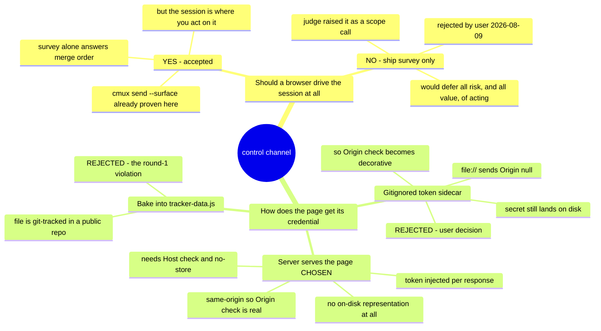

# 0022 — A browser UI may drive the Claude session, and the server that accepts those commands serves its own page

- **Status:** accepted
- **Date:** 2026-08-09
- **Context:** `docs/features/tracking-feature-state.md` §Design 3 and §Security;
  `coding-memory/compliance-judge/2026-08-09-tracking-feature-state.md` rounds 1–2;
  `panes/adapters/cmux.sh`. Standalone — does not amend a prior ADR.

Two decisions in one record, because the second exists only to make the first safe.

## The first decision: a control channel exists

The feature's stated need — knowing the merge order across cards and worktrees — is fully served by
the analyzer, the store and the skill. The control server is where all of the risk lives, and the
compliance judge said so as a non-blocking scope note in round 1: *ship the read-only survey first,
gate the control channel separately.*

That was put to the user on 2026-08-09, who chose to keep it in one feature. The reasoning worth
preserving: the survey tells you the merge order, but every action it implies happens in the session,
and a survey you have to act on by retyping into a terminal is a report rather than a control panel.

The cost accepted with it: an HTTP endpoint in front of a session holding full tool permissions.
The cmux socket has no authentication beyond its `0600` mode, so surface injection was *already*
available to any process running as this user — this feature does not create that exposure. What it
creates is the **HTTP hop**, and every bullet in §Security defends that hop specifically. None may be
weakened on the argument that injection was possible anyway.

## The second decision: the server serves its own page

This is the mechanism, and it is the part most likely to be quietly undone by someone who does not
know why it is there — which is the reason this ADR exists at all.

The original design baked a per-launch bearer token into `task-tracker/tracker-data.js`. The
compliance judge failed the spec on it (`core-conduct/secrets-not-client-side`), and the facts were
hand-verified: that file is git-tracked, matched by nothing in `.gitignore`, already holds committed
output, and the repository is public. Nothing leaked only because `server.py` did not exist yet.

The obvious repair — move the token to a gitignored sidecar with mode `0600` and scrub it on exit —
was **rejected**. It leaves the credential on disk, and it does not fix the second problem: a
`file://` page sends `Origin: null`, so the server would have to accept `null`, which a hostile local
HTML file also gets. The Origin check would survive in the spec while carrying no weight.

Serving the page from `http://127.0.0.1:<port>/` and injecting the token into that response instead:

- the token exists only in the server process's memory — there is no file to leak, to gitignore, to
  chmod, or to clean up when the process dies;
- the UI is same-origin with `/command`, so `Origin` compares against one exact string, and the
  server can emit **no** `Access-Control-Allow-*` header at all — there is no origin allow-list to
  get wrong because there is no allow-list;
- it is less code, not more.

Two obligations ride along, both discovered in round 2 and both easy to omit: `GET /` hands out the
credential and has no `Origin` to check (a top-level navigation sends none), so it needs a **`Host`
header check** against DNS rebinding; and the response needs **`Cache-Control: no-store`**, or the
browser writes the token into its own disk cache and "no on-disk representation" is false again.

## Consequence

Opening the vendored `Task Tracker.dc.html` directly over `file://` remains supported and is the
headless/SSH path (feature criterion 8) — with no server there is no token and no `/command`, and the
UI renders the survey read-only. That is the same feature minus one verb, on hosts where
`panes/terminal-detect.sh` prints `none` and no injection route exists by construction anyway.

**If you are reading this because you are about to simplify the server into a plain static file and
write the token somewhere:** that is the rejected alternative, and it reintroduces the exact
violation that failed round 1.
