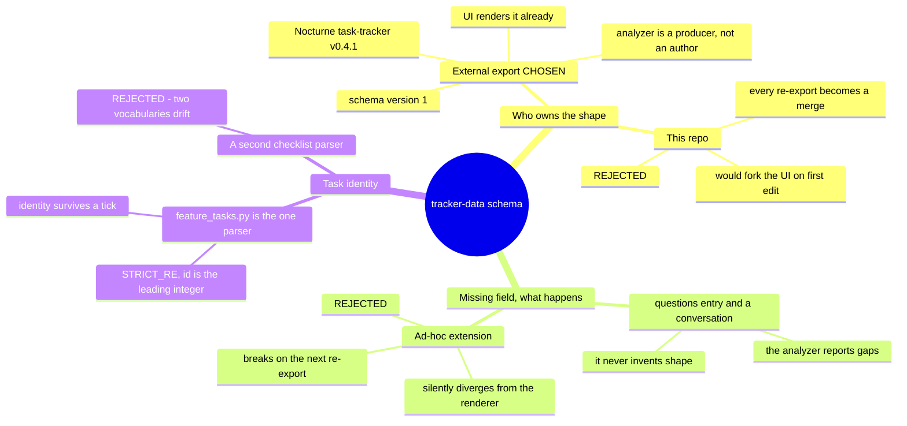

# 0023 — The `tracker-data` schema is owned outside this repo; the analyzer conforms to it

- **Status:** accepted
- **Date:** 2026-08-09
- **Context:** `docs/features/tracking-feature-state.spec.md` §"The output contract already exists" —
  the **spec half**; that section moved there when the card was split into a synced pair (ADR 0017),
  so a pointer at the `.md` no longer resolves;
  `task-tracker/` (the vendored Nocturne export, `task-tracker v0.4.1`, schema `version: 1`);
  `hooks/lib/feature_tasks.py`. Standalone — does not amend a prior ADR.

## Decision

`task-tracker/`'s data shape — `runs[]`, `features[]`, `waves[]`, `constraints[]`, `branches[]`,
`graph{}`, `kanban[]`, `questions[]` — comes from a Nocturne design-system export that already
existed and already renders it. This repo's analyzer is a **producer** conforming to that contract,
not its author.

The practical rule: **read the schema, do not redesign it.** If the analyzer needs a field the schema
does not have, that is a `questions[]` entry and a conversation with whoever owns the export — never
an ad-hoc extension. An extension that the renderer does not know about is invisible at best, and at
worst diverges silently until the next re-export overwrites it.

## Why this is worth an ADR

Because the pressure to break it is entirely one-directional and will feel reasonable at the time.
The analyzer is the component under active development; the UI is vendored and static. Every future
"just add one field" will look like a small change to the code being worked on, and the cost — a fork
of a design-system export, and a merge conflict on every re-export — lands later and on someone else.

Recording it also fixes the boundary in one place: the schema is external, the *task vocabulary* is
internal. Task identity follows `hooks/lib/feature_tasks.py` (`STRICT_RE`, id is the leading integer
before the em dash), and `identity()` deliberately consumes only the text after the checkbox so that
identity survives a tick. That module is the single checklist parser in this repo, and the analyzer
imports it rather than writing a second one — two parsers would drift, and the drift would show up as
wrong merge order, which is the one thing this feature exists to get right.

## Consequence

The schema is a fixed target, so schema-conformance bugs are the analyzer's fault by construction —
a useful property when debugging. Redesigning the UI or its schema is explicitly out of scope for
`tracking-feature-state`, and remains so after it ships.
