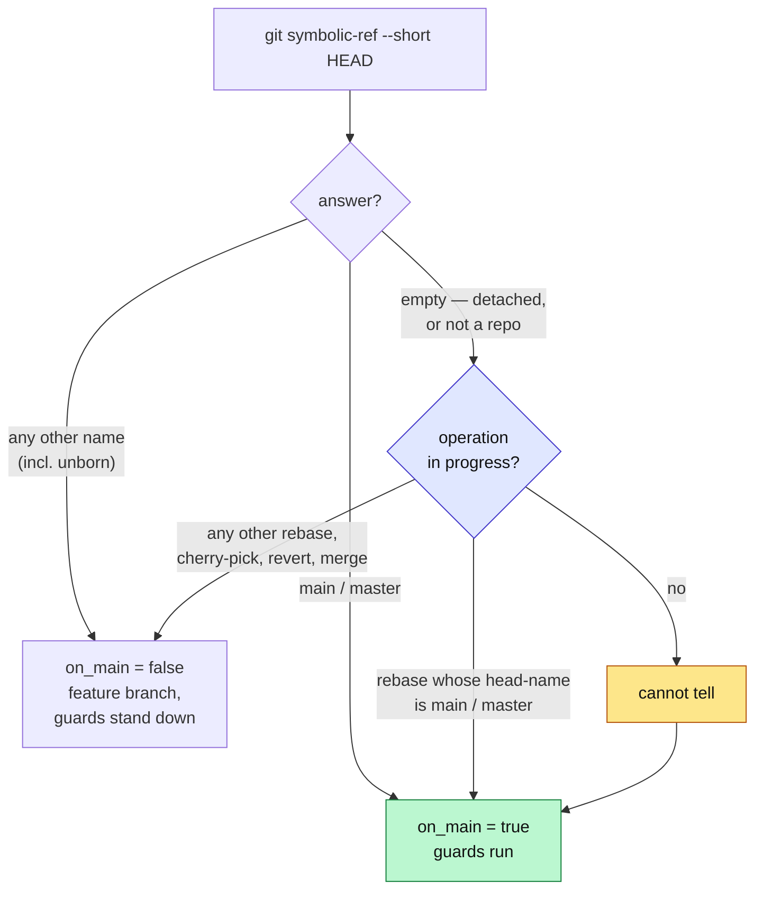

# 0026 — git-guard trusts `symbolic-ref`, not `--abbrev-ref`, to name a branch

- **Status:** Accepted
- **Date:** 2026-08-12
- **Context:** `hooks/git-guard.sh`, joins the guard-hook lineage of ADRs 0013 (shared shell-segment
  lexer), 0014 (empty index means ask the command) and 0015 (redirections are part of a command).
  ADR 0012 belongs to `judge-guard`, not here. Full derivation, the six-state measurement table, the
  19-row test matrix and the carve-out's mutation proofs: `docs/features/git-guard-detached-head.md`.

## Context

Both of git-guard's Tier 1 guards — the default-branch commit allowlist and the leased force-push
refusal — answer one question through a single helper: *which branch is checked out?*

```bash
current_branch() { git rev-parse --abbrev-ref HEAD 2>/dev/null || echo ""; }
on_main() { local b; b="$(current_branch)"; [ "$b" = "main" ] || [ "$b" = "master" ]; }
```

`--abbrev-ref` answers the literal string `HEAD` whenever it cannot name a branch. `on_main` compares
that against `main`/`master`, gets false, and every guard downstream stands down — the failure
direction is *open*. This is not hypothetical: this worktree's own reflog shows a checkout of
`origin/main` (a remote-tracking ref, which detaches HEAD) immediately followed by two commits that
reached `main`, both unjudged because the guard was never consulted. Both happened to be
documentation, so nothing was harmed by luck rather than by design — the file's own header already
states the intended posture (*"'cannot tell' must not mean 'allow'"*), and the helper contradicted it.

The conflation runs deeper than one incident: `--abbrev-ref` returns `HEAD` for a genuine detached
checkout *and* for an unborn branch, and fails outright outside a repository — three different states,
one indistinguishable answer.

## Decision

**Ask a question with one meaning: `git symbolic-ref --short HEAD`.** It resolves the branch `HEAD`
points at without requiring that branch to have commits, so it names the branch in every state where
one exists and fails only when there genuinely is none. Measured on git 2.50.1, all six states:

| HEAD state | `rev-parse --abbrev-ref HEAD` | `symbolic-ref --short HEAD` |
|---|---|---|
| fresh `git init`, unborn | `HEAD` (exits non-zero) | `main` |
| on `main` | `main` | `main` |
| on `feat/x` | `feat/x` | `feat/x` |
| genuinely detached | `HEAD` | *fails* |
| orphan branch, unborn | `HEAD` (exits non-zero) | `brandnew` |
| not a git repository | *fails* | *fails* |

`symbolic-ref` never returns the literal string `HEAD`, so the special case disappears and exactly one
cannot-tell arm remains — an empty answer, meaning a detached checkout or no repository at all. That
arm fails closed:

```bash
current_branch() { git symbolic-ref --short HEAD 2>/dev/null || echo ""; }

on_main() {
  local b; b="$(current_branch)"
  case "$b" in
    main|master) return 0 ;;
    "")          sequencer_in_progress && return 1; return 0 ;;
    *)           return 1 ;;
  esac
}
```



### The sequencer carve-out

Failing closed on every branchless checkout strands an operator mid-rebase, mid-cherry-pick, or
mid-merge — git is waiting on a command (`--continue`, or a bare `commit`) that a blanket refusal
would leave unfollowable, since `git switch -c <name>` itself fails while a sequencer runs
(`fatal: cannot switch branch while rebasing`). So `on_main`'s empty arm consults
`sequencer_in_progress()`, which reads the on-disk markers git itself writes
(`rebase-merge`/`rebase-apply`, `CHERRY_PICK_HEAD`, `REVERT_HEAD`, `MERGE_HEAD`) and stands the guard
down — **except** when the in-progress rebase's recorded `head-name` is `refs/heads/main` or
`refs/heads/master`, because that rebase will move the default branch onto the replayed commits when
it finishes, and a hand-written commit made during it really does reach `main`.

This is the design's only deliberate fail-open, and each of its three bounds carries a test row proved
by mutation rather than by reading the code (matrix rows 15, 16, 17 in the feature file):

1. A rebase whose `head-name` is `main`/`master` stays guarded — drop the clause and the committed
   file is measurably present on `main` after `--continue`.
2. A checkout plainly named `main`/`master` stays guarded regardless of a sequencer marker, because
   the carve-out is consulted only from the empty arm — hoist the call above the `case` and this
   collapses.
3. The `--apply` rebase backend is recognised as a sequencer, not only `--merge` — drop it from the
   marker loop and the guard becomes *stricter*, not looser, which is why the row proving this expects
   an **allow**, not a refusal; a row expecting refusal cannot see a change that makes refusal more
   likely.

## Options weighed

1. **Patch `on_main`'s comparison to also treat literal `HEAD` as branchless-and-refuse.** Rejected:
   this leaves the conflation itself in place — an unborn branch would still be misread as detached,
   which is the opposite of the intended posture (an unborn `main` should be *guarded*, not treated as
   branchless).
2. **Resolve where a detached commit actually lands** (does this detached HEAD's history reach `main`?)
   instead of asking for a name. Rejected on measurement: an equality test against `main`'s tip fails
   in the very worktree where the incident occurred, because `main` had since moved ahead; a
   containment test would work but needs `main`, `master`, `origin/main` and `origin/master` to each
   resolve — four new lookups, each a new way to not-know, and every not-know in this design fails
   open. `symbolic-ref` needs no lookups at all.
3. **Fail closed on every branchless state, no carve-out** (chosen for the base case, rejected as
   total). Strictly safer but strands an operator mid-sequencer with advice git itself refuses to let
   them follow — measured, not assumed: `git switch -c` answers `fatal: cannot switch branch while
   rebasing` / `while merging`.
4. **`symbolic-ref` plus the bounded carve-out (chosen).** Fails closed on the one state that is
   genuinely ambiguous, stands down only where git has already committed to finishing an operation it
   started, and keeps the one case that matters — a rebase that will move `main` — guarded throughout.

## Consequences

### Accepted costs — behavior changes, listed rather than glossed

- A commit made from a directory that is not a repository, reaching a real repository elsewhere via
  `cd /real/repo && git commit -- src/app.sh`, now refuses. No escape — git-guard has no bypass
  variable and `git switch -c` needs a repository.
- `--force-with-lease` from a detached HEAD or a non-repository directory now refuses.
- The first source commit into a freshly initialised repo whose branch is `main` is now caught by the
  documentation allowlist — previously read as `HEAD` and allowed. `git init -b feat/x` is unaffected.
- A hand-written `git commit` during a rebase started from `main`/`master` now refuses, with no bypass.
  `git rebase --continue` itself is unaffected — it raises no `COMMIT` fact at all (see the residual
  hole below) — so the ordinary path through a rebase never meets this; only an operator resolving a
  conflict by hand does.

### The residual hole — stated as a class, not as a rebase quirk

`hooks/lib/classify-git-command.py` raises the `COMMIT` fact — the one fact Guard 1's allowlist check
is gated on (`git-guard.sh:292`, `has_fact COMMIT && on_main`) — for exactly one subcommand string,
matched literally:

```python
if subcommand == "commit":
    facts.add("COMMIT")
```

No other branch in `classify()` inspects `merge`, `cherry-pick`, `revert`, `am`, or `rebase` — each of
which can create a commit on the checked-out branch. Verified directly against the source rather than
inferred from the docstring: `classify-git-command.py` is 198 lines, and `subcommand ==` appears
exactly twice — `"commit"` and `"push"`. This is confirmed independent of this ADR's fix: it is a
property of the classifier, unaffected by the `symbolic-ref` change, and it is true on `main` today.
So, measured against the current classifier, every one of the five reaches `main` without Guard 1
seeing a fact at all:

| Subcommand | Creates a commit? | `COMMIT` fact raised? |
|---|---|---|
| `git merge` (fast-forward or a real merge commit) | yes | no |
| `git cherry-pick` | yes | no |
| `git revert` | yes | no |
| `git am` | yes | no |
| `git rebase` (replaying commits onto a new base) | yes | no |

Deferring this is correct, not merely convenient: `git-guard.sh` runs as a `PreToolUse` hook, before
the command executes, and cannot know what a replay, a merge, or an `am` mailbox will actually
contain — there is nothing yet to check paths against. Recorded here so a future reader does not
assume the five are covered because `commit` is guarded; they are a distinct, open gap in the same
allowlist.

**This ADR's own carve-out widens that gap slightly, and knowingly.** `sequencer_in_progress` stands
the guard down for a *hand-written* `git commit` while a cherry-pick, revert, or merge conflict is
being resolved on a detached HEAD — the same class of command the paragraph above already can't see
when it arrives via replay, now also unguarded when typed by hand mid-conflict. Accepted for the same
reason as the base carve-out: the alternative strands the operator with unfollowable advice, and
finishing any of those three moves no branch, so nothing committed there reaches `main` regardless.

### Not a collision risk

A branch may not be named `HEAD` — verified (`git branch HEAD` answers `fatal: 'HEAD' is not a valid
branch name`). `symbolic-ref` never returns that string either, so the question is moot, but the
guarantee is recorded so a future reader does not have to re-derive it.

### Unaffected

`hooks/lib/shell_segments.py` and its accepted lexing limits (ADRs 0013, 0015) are untouched — this
change is entirely inside `git-guard.sh`'s own branch-naming logic and does not touch how a command
line is split into segments or facts. `git-guard.sh` remains a **momentum guardrail, not a security
boundary**, unchanged by this decision.
