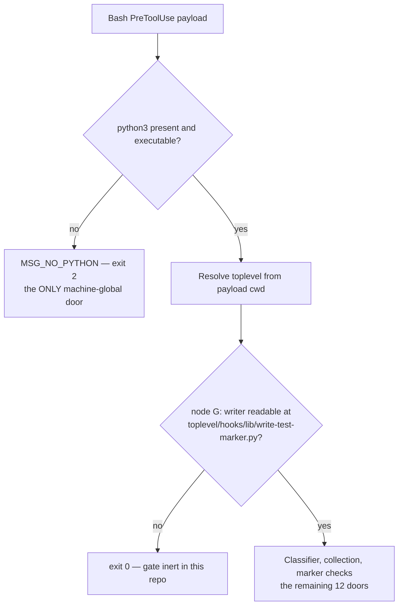

# 0027 — The marker is a receipt, not a grade; the gate is global but inert

- **Status:** Accepted (2026-08-14)
- **Context:** `docs/features/verification-marker-gate.md` (revision 19, `phase: implementation`,
  checklist task 1). This ADR is the durable record of the design decisions the spec rests on; the
  spec is frozen at revision 19 and carries the buildable detail.
- **Decision owner:** user. The design was ratified 2026-08-01; the revision-8 scope cut that folded
  `INCLUDE`/`FOREIGN` was a user decision of 2026-08-13. Architecture trade-offs are human-owned per
  `rules/core-conduct.md` § Existing and New Work; the assistant posed the options and did not choose.
- **Relates to:** ADR 0026 (no JSON crosses into bash), which fixes the wire contract this design uses.

## Context

`rules/core-conduct.md` already says to reproduce before fixing and to verify before claiming. That
is the weak form of the control. This repo established over four judge rounds on PR #34 that **a
warning placed where the mistake keeps being made is a disproven control** — the apostrophe trap
fired three times *inside the block carrying the warning against it*.

The strong form is computational: a passing test run leaves a machine-readable record of exactly
which file contents it certified, and a `PreToolUse` hook refuses a `git commit` whose contents do
not match. It cannot be rationalised past, and it reads content rather than intent.

## Decision

### 1. The marker is a receipt, not a grade

A marker records `git hash-object` of the subject **and** the test file at the moment a suite
reported zero failures. It says *this code was run past its suite*. It does **not** say *this code
is tested*.

This is the ceiling on the entire feature, and it is not fixable within it. A test gutted to
`exit 0`, or one whose only assertion was commented out, earns a perfectly valid marker and sails
through. Certifying test *strength* is mutation testing's job — which is why checklist task 9 exists
as a one-off floor rather than as a gate.

The framing is load-bearing rather than descriptive: it is what dissolved the mutual-certification
design below, and it is what makes a suite that certifies itself acceptable rather than a conflict
of interest.

**Proof of PASS is the suite's own tally** — the same number a human reads off the run — so the gate
depends on no harness semantics at all and behaves identically under a pane agent, a subagent, or a
direct run. A future test file that forgets its one-line call fails **closed and loudly**: its
subject can never be committed until the line is added. That is the ADR 0012 stance already adopted
here — a loud halt is recoverable in seconds, a silently dead gate is invisible by definition.

### 2. Three rejected designs, recorded so they are not re-proposed

| option | rejected because |
|---|---|
| **PostToolUse observer hook** | Zero workflow change and no test file touched, but it rests on **unmeasured harness semantics**: if a failing `bash` exit does not in fact route to `PostToolUseFailure`, the gate would certify **failing** tests. That is the silent-fail-open class this repo has hit four separate times, and this design would introduce it deliberately, at the design stage. The pivotal fact — that a Bash `tool_response` carries no exit-code field — comes from a vendored plugin's own comment and **could not be confirmed upstream** (`code.claude.com/docs/en/hooks-reference` 404s), which is itself the argument against betting the control on it. |
| **Wrapper runner (`bin/run-tests`)** | Sound — it observes the exit status itself — but it changes the habit: a direct `bash hooks/foo.test.sh` would silently produce no marker. It also inverts the principle at `hooks/README.md:34,140` — *test the code path that will actually run* — by making the marker-producing path differ from the path a developer actually invokes. ⚠️ The source note for this rejection (`CODING_MEMORY.md:503`) cited those two lines as documenting a test **invocation**; **re-checked 2026-08-14 and they do not.** `hooks/README.md` documents no suite invocation anywhere in its 284 lines. The lines carry the path-fidelity principle quoted above, which supports the same rejection by a different route; the citation is corrected here rather than inherited. |
| **Mutual test certification** (A certifies B, B certifies A, nothing self-certifies) | The instinct — the thing checked should not author its own certificate — is sound, but the mechanism cannot deliver it: **a hash can only say a test *changed*, never that it got *weaker*.** Dissolved by the receipt framing above. The real abuse it aimed at is already closed by hashing **both** files, so a test version that was never run cannot ship. Replacement parked: mutation-test the hook suites — the genuine "who tests the tests" control, already proven here when a planted mutant survived a happy 101/0 suite. |

A fourth proposal, a **repo-wide session lock**, was withdrawn on assistant feedback the same day and
is parked as its own feature: it deadlocks the repo when a session dies, and stale-lock detection
would rest on liveness signals this repo has already measured as unreliable. Worktree-per-session is
the structural fix.

### 3. Global registration, inert until a repo opts in — and the node ordering that makes it true

The gate is registered globally in `settings.json` with matcher `Bash`, exactly like its four sibling
guards, so it fires on a `git commit` in **any** repo this account works in. Global registration
alone would be a lockout: another repo using the same `X.sh`↔`X.test.sh` convention would have every
commit blocked with no writer present to satisfy the demand.

> The gate is active in a repo **iff `<toplevel>/hooks/lib/write-test-marker.py` exists and is
> readable.** No writer, no gate — a repo cannot be held to a receipt it has no way to issue.

The opt-in signal is deliberately a **file** rather than a config key: it is greppable, it cannot
drift out of sync with the thing that makes compliance possible, and it arrives and departs with the
feature itself.

**The scope promise is only literally true because of where the check sits in the flowchart.**
`exit 2` is not one door but **thirteen**, one per `MSG_*` constant. Exactly one of them —
`MSG_NO_PYTHON` — can reach a repo that has not opted in, because it fires before the payload can be
read at all, so there is no cwd to resolve a toplevel from and no toplevel to check the writer
against. Every other door is downstream of node `G`:

That single exception is **not a new hazard**, and the precedent is checkable rather than asserted:
`git-guard.sh:53-57`, `judge-guard.sh:44-48` and `merge-guard.sh:39-43` are all `PreToolUse`/`Bash`
registered today and all print a message and `exit 2` when `python3` is absent, so a broken
interpreter already blocks every commit on this machine before this feature exists. (`doc-guard.sh:54`
is the family's one fail-open.)

The ordering matters most for `MSG_CLASSIFIER_MISSING`, `MSG_CLASSIFIER_FAILED` and
`MSG_CLASSIFIER_BAD_OUTPUT`, because `classify-commit-command.py` is a file *this feature
introduces*: no sibling guard's precedent covers it, and a missing or corrupt copy of it firing
before the opt-in check would be a machine-global lockout that does not exist today. ADR 0026 made
this consequence sharper by folding the classifier and the marker reads behind a single Python call —
the ordering is now internal to that call rather than enforced by call sequence in bash.

### 4. `UNSUPPORTED` absorbs four triggers; the fold cut the prose, never the refusal

Revision 8 folded the two forms that previously had rows of their own — `INCLUDE` and `FOREIGN` —
into `UNSUPPORTED`. **What was cut is the separate form value, the separate door, and the tailored
remedy string. The blocking behaviour is unchanged for every trigger**, and the single message names
which one fired so the remedy stays actionable.

| trigger | why it blocks rather than guesses |
|---|---|
| **Foreign repo** — `cd`, `git -C`, `--git-dir`, `--work-tree` | A `PreToolUse` hook sees `cd /other/repo && git commit -m x` as one string and cannot follow the `cd`. Resolving `--show-toplevel` from the payload `cwd` would read a different repo's index and a different repo's markers, and both allowing and blocking on that basis would be wrong. ⚠️ **This trigger must keep blocking — reading another repo's markers is the worst failure this gate has.** Following the `cd` is deliberately rejected: it re-introduces the "follow the shell" reasoning this design refuses, and fails on any non-literal target. |
| **`-i`/`--include`, `--pathspec-from-file`** | **Measured (M3):** with `a.sh` staged at `v2`, `git commit -m x -i -- b.md` commits **both** files, while a `PATHSPEC` collector returns `b.md` alone — the gate would miss `a.sh` entirely. Support means a union of two collectors with a different content source on each side. |
| **`-p`/`--patch`, `--interactive`** | Both select content *interactively, after* the hook has already returned, so there is no moment at which the hook could inspect what the commit will contain. Refused on that ground, not a lexing one; no grammar work changes it. |
| **Any option outside the whitelist** | See below. |

**Recognition is a closed whitelist, and the default for a recognised commit is refuse.** Measured on
git 2.50.1: `--amen`, `--ame` and `--am` are all accepted and all genuinely amend, while `--allow-em`
is rejected as ambiguous. So the rule is *unique* prefix, and **uniqueness is a property of git's
option table, not of the spelling** — an abbreviation unique today becomes ambiguous the moment git
adds an option sharing its prefix. A parser pinned to exact spellings silently changes meaning across
git releases without a line of it being edited. The classifier therefore recognises a closed
whitelist of fully-spelled forms and refuses the rest.

The cost is real and belongs on the record: `git commit --am -m msg` is a valid command and gets
blocked. That is the intended trade — a false block is visible and recoverable, a false allow is not.

### 5. The accepted-open shapes, and why enumerating them is the point

The fail-closed inversion applies **only once a commit has been recognised**. Two shapes stay
genuinely open and stay on an enumerated list: **alias indirection and variable indirection.** Where
no commit is recognised at all, nothing blocks.

**The gate cannot block what it cannot see, and pretending otherwise is the failure mode this note
exists to prevent.** Keeping the list explicit is what makes closing one of them later a conscious
decision rather than an accident — and what stops a reader inferring coverage the design never
claimed. This is a momentum guardrail, not a security boundary, exactly like `judge-guard.sh`; every
write path that is not a Bash `git commit` (`sed -i`, the Edit/Write tools, an editor outside the
session) is out of scope by construction.

### 6. The `cmux.sh` coverage hole is accepted, named, and frozen by a test

🔴 **`panes/adapters/cmux.sh` is gated by nothing.** It is the largest adapter in the repo and it
*does* have a test — but that test is named `cmux-exec.test.sh`, so the strict 1:1 sibling rule
cannot see the relationship. `panes/` is therefore **partially** covered, and this file is the hole.

Renaming the suite would close it and is deliberately **not** in this feature. The strict 1:1 rule
with **no declared coverage map** was ratified 2026-08-01 precisely to avoid a second source of truth
that can rot; accepting a named hole is the cost of that, and it is cheaper than the map. The spec
freezes the claim with a test asserting that `cmux-exec.test.sh` derives a subject that is **not**
tracked — so the follow-up rename will turn that test red, which is correct.

Two orphan suites (`panes/adapters.test.sh`, `panes/adapters/cmux-exec.test.sh`) write no marker and
are never gated. `memsearch/tests/test_*.py` uses a non-sibling layout and is out of v1 —
**explicitly not forgotten**; the user asked for a follow-up plan.

## Consequences

- **A green marker will be misread eventually.** "This code was run past its suite" is a weaker claim
  than most readers will take it for, so the receipt framing has to survive into `hooks/README.md`
  and the gate stub (checklist task 12), not just live here.
- **Inertness is only partly observable in v1.** A hook that allows is silent, so nothing in a normal
  commit distinguishes "allowed, verified" from "allowed, inert" — `judge-guard.sh:204` records
  exactly this failure in exactly this family. v1 ships two partial answers: task 14's one-off arming
  proof, and the decision log, whose evidence is asymmetric — *a non-empty log proves the gate was
  armed and firing **as of its last entry**; an empty one proves nothing.* **The as-of qualifier is
  part of the claim, not a footnote to it.** A gate that goes inert *later*, in a repo where nothing
  has tripped it, stays invisible until someone re-runs task 14 by hand. `--status` is follow-up 1
  and is now the log's missing reader as well as the arming query.
- **The feature is gated by its own gate.** All three pairs this feature adds are `hooks/` files with
  sibling tests, so the gate demands markers for them too, and the wiring criterion is **every pair,
  14 at task 8** — never the literal 11 measured off the pre-feature repo. Freezing 11 in a test
  would make that assertion false from task 4 onward by this feature's own construction.
- **It is not armed during its own development.** The harness loads the primary checkout's copy — the
  same reason a `judge-guard` fix could not be gated by `judge-guard` until the primary checkout
  pulled it. Expect arming only after merge, and treat task 14 as the first real test of it.
- **This gate is deliberately narrow.** It would **not** have caught the narration defect that
  prompted its reordering, and the user accepted that explicitly. A narration control is a separate,
  later design. Do not widen this feature to cover it.
