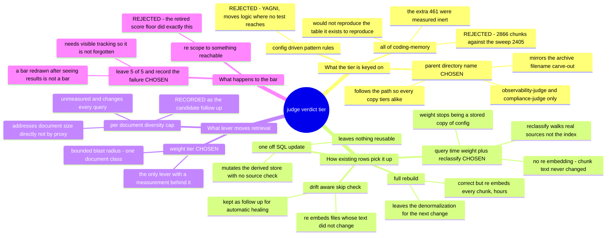

# 0030 — Judge verdicts get their own weight tier, and weight is resolved at query time

- **Status:** accepted
- **Date:** 2026-08-20
- **Context:** `docs/features/memsearch-freshness.md`, requirement **R9** and its remedy section
  *"The remedy the enumeration does not rule out — and the only change that improves the bar"*;
  `memsearch/config.json`, `memsearch/memsearch/index.py`,
  `memsearch/memsearch/search.py`, `memsearch/memsearch/chunk.py`, `memsearch/memsearch/db.py`.
  Extends ADR 0020, which created `archive_doc` and anticipated exactly this tier — *"distinct key so
  R9 can tune it alone"*. Does not amend it.

R9 scores feature-file retrieval at `k=6` against two rank clauses and passes only if all five
queries satisfy both. It has never passed: 2 of 5, recorded under *"(b) R9's bar — FAILS: only 2 of 5
queries pass, 3 fail"*. The one remedy ever measured to *improve* the bar rather than trade one
target's pass for another's is dropping judge verdicts from `curated_doc`'s 1.5 to 1.2, which reaches
3 of 5 with no verdict-level regression (the weight-sweep table in the remedy section).

> **Why this ADR cites `memsearch-freshness.md` by section heading and never by line number.** Two
> drafts of this file carried line citations into that document and both were stale on arrival. The
> first inherited numbers that this session's own frontmatter and task-12 edits had already moved by
> 12 and 22 lines. The second corrected them — and was invalidated by a further 11 lines added to
> that same file in the *same commit* that added this ADR, so the numbers were wrong again before
> anyone could read them. The file is 2400+ lines and actively edited, so a number written here rots
> faster than it can be checked. That document's own anti-staleness rule, learned the same way, is to
> *"key the result by section, never by line number"*; this ADR follows it. Code-file citations keep
> line numbers — those files are stable and each was verified.

That remedy cannot be applied today, and the reason is two independent blockers rather than one.
There is no judge-verdicts-only weight — `curated_docs` is a single bucket holding verdicts, feature
docs, ADRs and `PORTS.md` alike, so setting it to 1.2 wholesale would demote every spec in the corpus
and move nothing. And **even after creating such a key, nothing would change**, because weight is
frozen into each chunk row at index time and the indexer skips any file whose content has not moved.



## The tier is keyed on the judge directories, not on `coding-memory/`

`_doc_source_type` gains one rule beside the existing archive carve-out:

```python
ARCHIVE_FILENAME = "CODING_MEMORY.md"
JUDGE_DIRS = frozenset({"observability-judge", "compliance-judge"})
```

A file whose parent directory is one of those two becomes `judge_doc`.

**The tier's existence is the decision; its number is not.** `config.json` gains `judge_doc` seeded at
**1.2**, the value the round-8 sweep measured, and the implementation re-runs that sweep and adopts
the value the rule below selects. 1.2 is a starting point carried forward from a measurement taken at
an index state that no longer exists — the remedy section is explicit that it is "a lead to
re-confirm rather than a tuning to apply blind" — so this ADR commits to the key, the classification
and the method, and leaves the final number to the measurement. If the re-run selects a different
value, that is the sweep working, not this ADR being wrong.

### The adoption rule, stated so it can fail

Sweep `judge_doc` across **1.0 – 1.5 in steps of 0.1**, re-running R9's five queries at each step
against the same index state, and record **per-target hit counts and top-hit identity for every
row** — not a pass/fail verdict per row. Then:

1. **Baseline first.** Measure R9 at `judge_doc` = 1.5 (equal to `curated_doc`, i.e. today's
   effective behaviour) and record it. Every comparison below is against that row, measured in the
   same run — never against the round-8 table, which was taken at an index state that no longer
   exists.
2. **Eligible** = any row whose R9 pass count is **strictly greater** than baseline's, **and** where
   no individual target loses hits relative to baseline, **and** no target that held its top hit at
   baseline loses it.
3. **Adopt** the eligible row closest to 1.5 — the smallest departure from current behaviour that
   buys the improvement. Ties cannot occur, since the rows are ordered by weight.
4. **If no row is eligible, adopt nothing.** `judge_doc` ships at 1.5 — behaviourally identical to
   today — the classification, query-time weight and reclassify pass still land, and R9's number is
   recorded unchanged. This outcome is a legitimate result, not a reason to relax clause 2.

Clause 2's per-target requirement is the point of the rule, not decoration: the remedy section's own
sweep table carried a verdict-level "anything regress?" column and it would have printed "no" through
a PASS(4) → PASS(3) erosion. A pass-count-only rule reproduces exactly that blindness.

The scope is load-bearing and was corrected three times before landing. `coding-memory/`
as a whole holds **2866** chunks against the sweep's **2405**; the extra **461** are brainstorms,
branch notes and `pr-tracking.md`, which the remedy section ran as its own variant and found inert.
Keyed on the wider directory, the knob would not reproduce the measurement that justifies it. *Those
three counts are quoted from the remedy section, not re-measured here — the implementation re-derives
them.* What is measured here: on 2026-08-20 the two directories hold **163** and **22** files, 185
together.

Matching on the parent directory name rather than a full-path substring inherits ADR 0020's *reason*,
not merely its shape — classification follows the path, so all copies of a verdict tier identically
regardless of which config bucket enumerated them. The accepted exposure is a directory named
`observability-judge` or `compliance-judge` somewhere in a repo root that is not judge output; the
precedent matches on a bare filename and carries the same exposure.

## Weight was a stored copy of a config value

`weight` is read from config at index time (`index.py:169`), written into every chunk row
(`db.py:75`, `db.py:134`), and multiplied in after fusion at query time (`search.py:80`). It is a
derived value — source type plus config — duplicated across the whole corpus, and that duplication is
the entire reason a config edit cannot move a ranking.

It also makes the corpus resistant to the *measurement* R9 depends on. ADR 0020 recorded the same
shape one level over: chunks are deleted only inside `replace_source`, so a source that merely stops
being walked keeps every row it ever wrote (`0020:105-110`). A weight that stops being current
behaves the same way.

So weight moves to query time: `search.py` resolves `cfg.weights[source_type]`, `"weight"` leaves
`_CHUNK_COLS` (`search.py:24`), the write path stops emitting it, and the column is dropped — the
project environment runs SQLite 3.53.3, so `ALTER TABLE ... DROP COLUMN` is available. Leaving a
stale column in place would be the schema-level form of the two-documents problem: a reader cannot
tell which value is authoritative.

Config load gains a check that every known source type has a weight, so a missing key fails at load
with a named message instead of surfacing as a `KeyError` mid-query.

### Dropping the column is a one-way migration, and is treated as one

**Trigger and ordering.** The drop runs from the database-open path, not from `index`, so it applies
to whichever command first touches the DB after the upgrade — a query must not meet a schema the
running code no longer matches. It reads `PRAGMA table_info(chunks)`, drops `weight` only if present,
and is a no-op afterwards; running it twice is safe, and a fresh database never has the column
because the `CREATE TABLE` no longer names it.

**It is one-way.** Old code against a migrated database fails on `SELECT ... weight`. There is no
down-migration and none is offered: restoring the column would mean repopulating it, and the value it
held is exactly the stale copy this change exists to remove. The rollback is `index --full`, which
ADR 0020 already records as a multi-hour rebuild (`0020:105-110`). **Anyone reverting past this
commit must be told the rebuild is the price** — the same warning that ADR attached to re-excluding
the archive, for the same reason.

**Failure is closed.** If the `ALTER TABLE` fails — locked database, or a SQLite older than 3.35 —
the open path aborts with a named error naming `index --full` as the recovery. It does not fall back
to reading the stored column: a run that silently kept using frozen weights would reintroduce the
defect while reporting success, which is this feature's original failure mode one field over.

The payoff is larger than this change. Weight tuning becomes a config edit, permanently, and the
weight sweep becomes a repeatable experiment instead of database surgery — which is what the remedy
section could not do when it had to warn that its own pinned state was no longer reconstructable.

## The reclassify pass is driven from source

`index --reclassify` walks `_iter_docs(cfg)` — the real source enumeration — computes each file's
source type, compares it against what is stored, and updates only where they disagree. No chunking,
no embedding: chunk text is untouched, so re-embedding would buy nothing.

It reports **per-transition counts** — `curated_doc → judge_doc: N files, M chunks` — not a total.
The remedy section's own warning — *"the 'anything regress?' column is verdict-level only"* — is that
such a summary hid a real regression; a bare "185 files updated" would let a wrong-direction move pass
unnoticed.

An explicit flag, not automatic. Automatic drift detection is the more self-healing answer and is
arguably what this feature's thesis implies, but it is a write path on every scheduled run and is not
needed to close this. Recorded as follow-up, not silently dropped.

**Its failure behaviour, stated rather than left to the implementer:**

- **The whole pass is one transaction.** A mid-walk failure rolls back entirely. A partially re-typed
  corpus is the worst outcome available here — it would score some verdicts at the new weight and
  some at the old, and no measurement taken against it would mean anything.
- **An unreadable source file** is recorded and the walk continues, matching `_index_one`'s existing
  contract that one bad source never kills a long run (`index.py:217-219`). The pass exits non-zero
  if any file was skipped, so a partial walk cannot be mistaken for a clean one.
- **A source row whose file has vanished** is left untouched and reported under its own count. It is
  deliberately *not* deleted: pruning is `replace_source`'s job, and ADR 0020 records that nothing
  removes the chunks of a source that stops being walked. Silently widening this pass into a pruner
  would make it a destructive operation behind a name that does not say so.
- **A computed source type with no configured weight** aborts before any write. Config-load
  validation should already have caught it; this is the second lock on a failure that would otherwise
  surface as unscored chunks at query time.

## R9 stays failing, and stays written down

R9's text is untouched. It remains 5 of 5, it remains failing, and the measured number is recorded
with the reason.

The alternative — redrawing the bar to something the corpus can satisfy — is the exact pattern this
feature already retired once. `test_measurement_queries.py:16-20` records why the `>=0.30` score floor
was withdrawn: *"a floor redrawn after seeing where the scores landed cannot fail the only run that
ever grades it."* A pass count redrawn after seeing the pass count is the same move.

The cost is a permanently red requirement, which needs visible tracking so it does not decay into
one nobody reads.

## Consequences

**This tunes a proxy, and the number will not generalize.** The complaint is a size effect — the
remedy section's one structural observation needing no counterfactual is a 639-line verdict
outranking the 375-line spec it grades at equal weight — the remedy section's *"what the planning
pass inherits"* paragraph. A longer document wins by
producing more chunks, not by being more relevant. Weight is an indirect lever on that, so whatever
value the sweep adopts is fitted to this document class and says nothing about the next oversized
one. The per-document
diversity cap addresses the mechanism directly and is recorded as the candidate follow-up; it was not
built here because it is unmeasured and changes every query's results, where this changes the ranking
of one bounded class.

**The regression that started this remains unexplained.** The remedy section's closing position is
that no document is implicated, the cause is unassigned, and the pinned state needed to reconstruct
it no longer exists — *"and this control does not explain the regression it was run to explain"*, and
the remedy section's closing "blocking open item". This is tuning against a symptom whose cause was
never found. Accepted as a known limitation rather than investigated, because the state the
investigation needs is gone.

**The measurement instrument reads a moving target.** `test_measurement_queries.py` runs against the
live index — `load_config()`, the real `db_path` — so R9's result shifts as the corpus grows,
independent of any weight. The adopted weight is therefore chosen from a sweep re-run at
implementation time, not inherited from the round-8 table, and the per-target hit counts are recorded
for **every** row of that sweep, closing the gap the remedy section flagged in its own table where
only the 1.2 row's margins were captured.

**This branch's own verdicts land in the new tier.** The remedy section noted that merging it
perturbs the corpus it measures, because its verdict files are themselves weighted judge chunks
(*"merging this branch perturbs the very corpus it measures"*). Under this ADR those files move into
`judge_doc`, so — for any adopted weight below `curated_doc`'s 1.5 — the perturbation is smaller than
it was when that warning was written. Smaller, not absent, and not a substitute for re-measuring;
and if the sweep adopts 1.5 or above, this consequence does not hold and the perturbation is
unchanged or larger.

**Adding the key does not move the reported score ceiling.** `score_ceiling()` uses
`max(CFG.weights.values())` (`test_measurement_queries.py:120-123`), so any adopted value at or below
the existing 1.5 leaves the printed ceiling unchanged — which covers the whole 1.0–1.5 range the
sweep explored. Worth knowing, because a tier set above 1.5 would move it, and the baseline figure
printed alongside R9's results would shift for a reason unrelated to retrieval quality.
