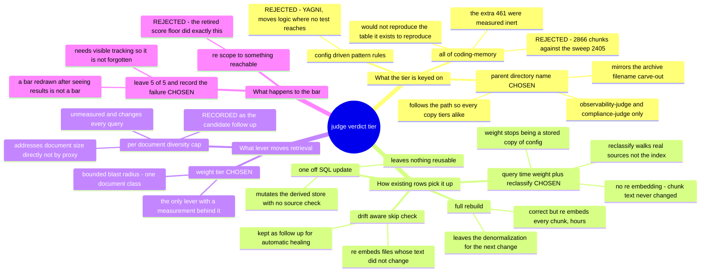

# 0030 — Judge verdicts get their own weight tier, and weight is resolved at query time

- **Status:** accepted
- **Date:** 2026-08-20
- **Context:** `docs/features/memsearch-freshness.md` R9 (`:327-343`) and its remedy section,
  *"The remedy the enumeration does not rule out"* (`:2339-2412`); `memsearch/config.json`,
  `memsearch/memsearch/index.py`,
  `memsearch/memsearch/search.py`, `memsearch/memsearch/chunk.py`, `memsearch/memsearch/db.py`.
  Extends ADR 0020, which created `archive_doc` and anticipated exactly this tier — *"distinct key so
  R9 can tune it alone"*. Does not amend it.

R9 scores feature-file retrieval at `k=6` against two rank clauses and passes only if all five
queries satisfy both. It has never passed: 2 of 5 at round 8 (`:1731-1757`). The one remedy ever
measured to *improve* the bar rather than trade one target's pass for another's is dropping judge
verdicts from `curated_doc`'s 1.5 to 1.2, which reaches 3 of 5 with no verdict-level regression
(`:2350-2358`).

> **On the line numbers below.** Every `memsearch-freshness.md` citation here is **as of 2026-08-20**
> and was re-derived, not copied — the first draft of this ADR inherited numbers that its own
> same-session edits to that file had already shifted by 12 and 22 lines. That file is long and
> actively edited; prefer the quoted section headings over the numbers when they disagree.

That remedy cannot be applied today, and the reason is two independent blockers rather than one.
There is no judge-verdicts-only weight — `curated_docs` is a single bucket holding verdicts, feature
docs, ADRs and `PORTS.md` alike, so setting it to 1.2 wholesale would demote every spec in the corpus
and move nothing. And **even after creating such a key, nothing would change**, because weight is
frozen into each chunk row at index time and the indexer skips any file whose content has not moved.



## The tier is keyed on the judge directories, not on `coding-memory/`

`_doc_source_type` gains one rule beside the existing archive carve-out:

```python
ARCHIVE_FILENAME = "CODING_MEMORY.md"
JUDGE_DIRS = frozenset({"observability-judge", "compliance-judge"})
```

A file whose parent directory is one of those two becomes `judge_doc`.

**The tier's existence is the decision; its number is not.** `config.json` gains `judge_doc` seeded at
**1.2**, the value the round-8 sweep measured, and the implementation re-runs that sweep and adopts
whatever today's corpus supports. 1.2 is a starting point carried forward from a measurement taken at
an index state that no longer exists — the remedy section is explicit that it is "a lead to
re-confirm rather than a tuning to apply blind" — so this ADR commits to the key, the classification
and the method, and leaves the final number to the measurement. If the re-run supports a different
value, that is the sweep working, not this ADR being wrong.

The scope is load-bearing and was corrected three times before landing (`:2382-2385`). `coding-memory/`
as a whole holds **2866** chunks against the sweep's **2405**; the extra **461** are brainstorms,
branch notes and `pr-tracking.md`, which the remedy section ran as its own variant and found inert.
Keyed on the wider directory, the knob would not reproduce the measurement that justifies it. *Those
three counts are quoted from the remedy section, not re-measured here — the implementation re-derives
them.* What is measured here: on 2026-08-20 the two directories hold **163** and **22** files, 185
together.

Matching on the parent directory name rather than a full-path substring inherits ADR 0020's *reason*,
not merely its shape — classification follows the path, so all copies of a verdict tier identically
regardless of which config bucket enumerated them. The accepted exposure is a directory named
`observability-judge` or `compliance-judge` somewhere in a repo root that is not judge output; the
precedent matches on a bare filename and carries the same exposure.

## Weight was a stored copy of a config value

`weight` is read from config at index time (`index.py:169`), written into every chunk row
(`db.py:75`, `db.py:134`), and multiplied in after fusion at query time (`search.py:80`). It is a
derived value — source type plus config — duplicated across the whole corpus, and that duplication is
the entire reason a config edit cannot move a ranking.

It also makes the corpus resistant to the *measurement* R9 depends on. ADR 0020 recorded the same
shape one level over: chunks are deleted only inside `replace_source`, so a source that merely stops
being walked keeps every row it ever wrote (`0020:105-110`). A weight that stops being current
behaves the same way.

So weight moves to query time: `search.py` resolves `cfg.weights[source_type]`, `"weight"` leaves
`_CHUNK_COLS` (`search.py:24`), the write path stops emitting it, and the column is dropped — the
project environment runs SQLite 3.53.3, so `ALTER TABLE ... DROP COLUMN` is available. Leaving a
stale column in place would be the schema-level form of the two-documents problem: a reader cannot
tell which value is authoritative.

Config load gains a check that every known source type has a weight, so a missing key fails at load
with a named message instead of surfacing as a `KeyError` mid-query.

The payoff is larger than this change. Weight tuning becomes a config edit, permanently, and the
weight sweep becomes a repeatable experiment instead of database surgery — which is what the remedy
section could not do when it had to warn that its own pinned state was no longer reconstructable.

## The reclassify pass is driven from source

`index --reclassify` walks `_iter_docs(cfg)` — the real source enumeration — computes each file's
source type, compares it against what is stored, and updates only where they disagree. No chunking,
no embedding: chunk text is untouched, so re-embedding would buy nothing.

It reports **per-transition counts** — `curated_doc → judge_doc: N files, M chunks` — not a total.
The remedy section's own warning is that a verdict-level summary hid a real regression
(`:2387-2391`); a bare "185 files updated" would let a wrong-direction move pass unnoticed.

An explicit flag, not automatic. Automatic drift detection is the more self-healing answer and is
arguably what this feature's thesis implies, but it is a write path on every scheduled run and is not
needed to close this. Recorded as follow-up, not silently dropped.

## R9 stays failing, and stays written down

R9's text is untouched. It remains 5 of 5, it remains failing, and the measured number is recorded
with the reason.

The alternative — redrawing the bar to something the corpus can satisfy — is the exact pattern this
feature already retired once. `test_measurement_queries.py:16-20` records why the `>=0.30` score floor
was withdrawn: *"a floor redrawn after seeing where the scores landed cannot fail the only run that
ever grades it."* A pass count redrawn after seeing the pass count is the same move.

The cost is a permanently red requirement, which needs visible tracking so it does not decay into
one nobody reads.

## Consequences

**This tunes a proxy, and the number will not generalize.** The complaint is a size effect — the
remedy section's one structural observation needing no counterfactual is a 639-line verdict
outranking the 375-line spec it grades at equal weight (`:2393-2395`). A longer document wins by
producing more chunks, not by being more relevant. Weight is an indirect lever on that, so 1.2 is
fitted to this document class and says nothing about the next oversized one. The per-document
diversity cap addresses the mechanism directly and is recorded as the candidate follow-up; it was not
built here because it is unmeasured and changes every query's results, where this changes the ranking
of one bounded class.

**The regression that started this remains unexplained.** The remedy section's closing position is
that no document is implicated, the cause is unassigned, and the pinned state needed to reconstruct
it no longer exists (`:2320-2323`, `:2409-2412`). This is tuning against a symptom whose cause was
never found. Accepted as a known limitation rather than investigated, because the state the
investigation needs is gone.

**The measurement instrument reads a moving target.** `test_measurement_queries.py` runs against the
live index — `load_config()`, the real `db_path` — so R9's result shifts as the corpus grows,
independent of any weight. The adopted weight is therefore chosen from a sweep re-run at
implementation time, not inherited from the round-8 table, and the per-target hit counts are recorded
for **every** row of that sweep, closing the gap the remedy section flagged in its own table where
only the 1.2 row's margins were captured.

**This branch's own verdicts land in the new tier.** The remedy section noted that merging it
perturbs the corpus it measures, because its verdict files are themselves weighted judge chunks
(`:2400-2407`). Under this ADR those files become `judge_doc` at 1.2 rather than `curated_doc` at
1.5, so the perturbation is smaller than it was when that warning was written — smaller, not absent,
and still not a substitute for re-measuring.

**Adding the key does not move the reported score ceiling.** `score_ceiling()` uses
`max(CFG.weights.values())` (`test_measurement_queries.py:120-123`), so any adopted value at or below
the existing 1.5 leaves the printed ceiling unchanged — which covers the whole 1.0–1.5 range the
sweep explored. Worth knowing, because a tier set above 1.5 would move it, and the baseline figure
printed alongside R9's results would shift for a reason unrelated to retrieval quality.
