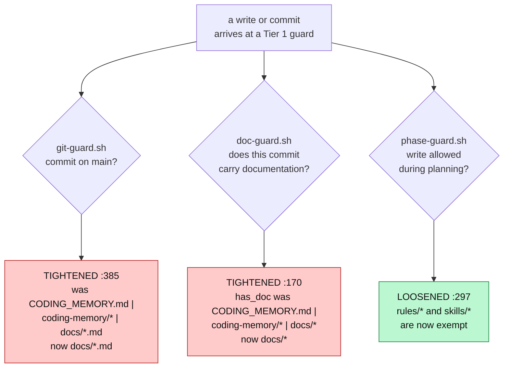

# 0031 — One tracked record tree, and the three guards realigned to it

- **Status:** Accepted (2026-08-20)
- **Context:** `CODING_MEMORY.md`, `coding-memory/`, `.gitignore`, `hooks/git-guard.sh`,
  `hooks/doc-guard.sh`, `hooks/phase-guard.sh`, `hooks/context-handoff-watch.sh`. Full evidence
  table, task list, and per-hook coupling map: `docs/features/rule-surface-trim.md`. Applies the
  one-canonical-file discipline of `rules/gates.md` to the memory tree itself, and touches the
  Tier 1 guard lineage of ADRs 0010 (phase frontmatter as permission source), 0011 (branch-scoped
  write permission), 0012–0015 and 0029 (the shared `git`/`gh` command readers).
- **Note:** ADR number 0030 is taken by the unmerged, already-pushed branch
  `worktree-fix+memsearch-r9-retrieval-quality`
  (`0030-judge-verdict-tier-and-query-time-weight.md`, committed 2026-08-20). It is free on
  `origin/main` but not free *anywhere*, and a duplicate merges cleanly because the filenames
  differ — `origin/main` already carries two files numbered `0026` from exactly that failure. This
  decision takes **0031** rather than collide, the same courtesy ADR 0025 extended to PR #48 and
  ADR 0019 extended to `memsearch-freshness`. `0028` is an unused gap on every ref and is left
  alone rather than backfilled out of order.

## Context

The written record lived in two parallel trees.

- **`docs/`** — feature cards, decisions, superpowers plans. This is the tree that gets *read*.
- **`CODING_MEMORY.md` + `coding-memory/`** — appended at every freshness checkpoint, reached by
  targeted lookup only. This is the tree that gets *written*.

`rules/gates.md`'s one-canonical-file discipline already forbade that shape in so many words —
*"two documents describing the same work means a reader cannot tell which one is wrong"* — and the
second tree was sitting next to the rule prohibiting it.

The evidence that it had already failed as a record, measured 2026-08-20 at the planning commit
`7fcfd95`:

| Signal | Measurement |
|---|---|
| `coding-memory/session-log.md` | last commit **2026-07-18**, abandoned in place |
| `coding-memory/decisions.md` | last commit **2026-07-19** |
| `coding-memory/brainstorms/` | last commit **2026-07-22** |
| `coding-memory/branches/` (**19** files) | last commit **2026-07-27** |
| `CODING_MEMORY.md` | **7,247** lines, while its own line 3 reads *"This is an index only, kept at or under 200 lines"* — **36×** its stated cap |
| tracked paths under `CODING_MEMORY.md` + `coding-memory/` | **215** |

All four of those artifacts were abandoned *while the rules still demanded them*, and nothing
surfaced it. `decisions.md` is the sharpest signal: at `origin/main` @ `c523090` its lines 7–8
direct the reader to `rules/pr-requests.md` and `rules/session-state-management.md`. **Neither file
exists** — `rules/` on that same ref holds `core-conduct.md` and `gates.md` and nothing else. It had pointed at deleted
rules for a month, undetected, because nothing read it.

The figures above are as-of `7fcfd95` deliberately. By `origin/main` @ `c523090` the same counts had
already drifted to **230** tracked paths and **8,757** lines — the tree was still growing while this
card was being written, which is itself part of the argument.

## Decision

**Untrack both, keep them on disk and in git history.** `git rm --cached` plus `.gitignore`; nothing
is deleted, nothing is rewritten. The files stay greppable and memsearch-able locally. The commit
that did it (`e2b2531`) removed **213** paths from the index and left exactly **two** tracked.

This **assumes a single machine**, and that assumption is made deliberately rather than overlooked:
the original reason for committing the tree — reading local state from a browser or another machine
— was replaced by remote control. A fresh clone will not carry the history forward.

`CODING_MEMORY.md` is untracked and **frozen, not trimmed**: other documents cite it by line number,
so renumbering would silently break those citations. No new appends.

### The carve-out, and the wrong reason it was nearly given

Two files stay tracked: `coding-memory/observability-judge/verdicts.jsonl` and
`coding-memory/compliance-judge/verdicts.jsonl`.

They are kept **for the accumulated judge record**, which would otherwise fragment per worktree and
leave the repo with no structured verdict history once the prose verdicts stop being tracked.

They are **not** kept because a missing ledger blocks PRs. An earlier draft of this reasoning said
they were, and that draft was wrong. Measured in a fresh detached worktree on 2026-08-20:
`hooks/judge-guard.sh` exits **2** either way. The only thing that changes is the message —
`judge-guard.sh:252` prints *"no verdict store at …"*, `judge-guard.sh:288` prints *"no fresh
observability-judge verdict for …"* — and both fall through to `exit 2`. A worktree with no ledger
is blocked; a worktree with a ledger but no matching row is equally blocked. The premise was
corrected after measurement, and the correction is recorded here rather than quietly replaced,
because an ADR that hides a corrected premise teaches the reader to trust the next unverified one.

Re-pointing `VERDICTS_REL` at a machine-local path outside the repo was considered and rejected:
repo-local verdicts were a deliberate fix (ADR 0012), and reversing one is a separate decision.

## The guard surface — two tightened, one loosened

The two tightenings are not new policy so much as the removal of a lie: once those paths can never
be staged, patterns naming them are unreachable, and an allowlist that silently narrows itself is
worse than one that says what it does. Both hooks' user-facing messages were rewritten in the same
change — `doc-guard.sh` and `context-handoff-watch.sh` were each instructing every future session to
save a file this decision retires.

**The loosening is the real policy change.** `phase-guard.sh` exempted `docs/*`, `.claude/*`,
`settings.json`, and the memory tree, but **not `rules/` or `skills/`**. The guard exists to stop
*implementation code* landing during planning, and a rule file is not implementation code. This was
not hypothetical: two unrelated **parked** planning cards had made every rule and skill file
unwritable on `main` — blocking maintenance of the rule surface itself, including this card's own
work. Adding `rules/*` and `skills/*` fixes that class permanently.

## Alternatives considered

| Option | Verdict | Why |
|---|---|---|
| **Untrack, keep on disk and in history (chosen)** | **Accepted** | Removes the duplication without destroying anything. Reversible: the files are one `git add -f` away. |
| Delete the tree outright | Rejected | The history has value, and deletion is irreversible. Nothing about the duplication problem requires destroying the record. |
| Keep committing it | Rejected | This *is* the duplication being removed. Doing nothing preserves a second tree that four separate artifacts had already proven nobody maintains. |
| Untrack everything, including the two ledgers | Rejected | Fragments the accumulated judge record per worktree and leaves no structured verdict history at all. See the carve-out above — note this is *not* rejected on the PR-blocking grounds an earlier draft claimed. |
| Migrate the whole tree into `docs/` | Rejected | Most of it is historical narrative already reproduced in feature cards, ADRs, or the code itself. Migrating it would move the duplication rather than remove it. |

### The predecessor decision this supersedes in spirit

`coding-memory/decisions.md:22` — now readable only through git history, e.g.
`git show origin/main:coding-memory/decisions.md` — already recorded, and rejected, the neighbouring idea of shrinking
the always-on surface by loading rules conditionally: **`@import` resolves before the prompt exists,
so a rule cannot gate itself, and a hook could only safely defer the non-safety rules — which are
exactly the ones you cannot predict needing.** That reasoning was itself trapped in the tree being
retired. It now lives in `rules/core-conduct.md:37`, in the always-on surface it describes.

## Consequences

- **Knowledge was migrated out first, because it existed nowhere else.** Three moves, all landed
  before the untracking commit: the `gh pr create --draft` → `gh pr ready` flow into
  `skills/preparing-pull-requests/SKILL.md:26-27` — adopted after three stranding incidents,
  *because the advisory mitigation was 0-for-3 by the record's own evidence*; two standing decisions
  into `rules/core-conduct.md` (`:11` never render a metric the payload cannot source, `:37` the
  conditional-loading rejection above); and the rejected pane-layout approaches **B** (persistent
  slot map) and **C** (layout policy plus new adapter primitives) into ADR 0008.
- **Three Tier 1 guards changed, each with its own red test, and all suites are green.** Measured
  on this branch: `hooks/git-guard.test.sh` **152 passed, 0 failed**; `hooks/doc-guard.test.sh`
  **20 passed, 0 failed**; `hooks/phase-guard.test.sh` **147 passed, 0 failed**.
- **The replay harness proves the tightening is never a weakening.** `hooks/git-guard.replay.sh`
  against base `origin/main` @ `c523090`: 63 commands × 6 states = **378 pairs — 370 identical,
  8 stricter (0 unexpected), 0 relaxed, 0 distinct commands where the base blocks and this branch
  allows.** The 8 stricter results are **two** distinct commands
  (`git commit -m msg -- CODING_MEMORY.md` and `git commit -m msg -- coding-memory/x.jsonl`) across
  four fixture states.
- **The card predicted three diverging replay cases; only two diverge, and the prediction was
  corrected rather than encoded.** The third — `git commit -m msg -- coding-memory/../src/tracked.sh`
  — is blocked on **both** sides and never appears in the divergence list. Its *reason* changed (it
  used to be the `..`-escape arm rescuing a string that satisfied `coding-memory/*`; it is now
  simply a prefix that is not allowlisted at all) but its decision did not. Had the expected-stricter
  list been written from the prediction instead of the measurement, the harness would have reported
  a phantom case forever.
- **`judge-guard.sh:39` is deliberately unchanged.** It still reads the ledger from the judged
  repo's working tree, per ADR 0012.
- **A fresh clone will not carry the history.** Accepted, not overlooked — the direct cost of the
  single-machine assumption above.
- **Untracking is not redaction.** Everything already pushed remains in GitHub history. This
  decision does not attempt to rewrite it, and no one should read it as a removal.
- **Judge prose output is now write-only and local.** `e2b2531` untracked **164** observability and
  **20** compliance markdown verdicts; `judge-guard.sh` never read any of them. (The feature card's
  planning-time figures — 163 and 25 — were measured at `7fcfd95`; the observability count had grown
  by one and the compliance count was 20 there too.) The structured record that survives is **179**
  observability rows and **123** compliance rows.
- **The observability ledger's calibration coverage is thinner than the untracking commit claims.**
  Measured directly from `coding-memory/observability-judge/verdicts.jsonl`: all 179 rows carry an
  `outcome` key, but only **69** hold a non-null value (**38** `clean`, **31** `rework`; **110**
  `null`). The `.gitignore` comment committed in `e2b2531` states **169**, and that figure is wrong
  — recorded here rather than silently corrected, because it is a live citation in a committed file
  and is exactly the failure `rules/core-conduct.md:11` was added to prevent, occurring in the same
  change that added it.
