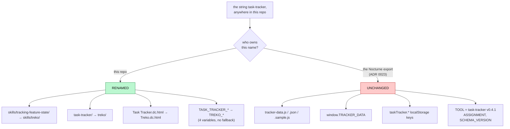

# 0033 — Treko renames the four layers this repo owns; the data contract keeps its names

- **Status:** Accepted (2026-08-22)
- **Context:** `treko/` (was `task-tracker/`), `skills/treko/` (was `skills/tracking-feature-state/`),
  `treko/server.py`, `treko/Treko.dc.html` (was `Task Tracker.dc.html`), `PORTS.md`, `README.md`,
  `CLAUDE.md`, `.gitignore`. Full rename map, acceptance criteria and measurements:
  `docs/features/treko-rename.md`. Applies **ADR 0023** (the `tracker-data` schema is owned by the
  Nocturne export, not by this repo) to a rename that would otherwise cross that boundary, and sits
  alongside ADR 0022 (the control server serves its own page) and ADR 0024 (the control server must
  be accountable), neither of which is reopened here.
- **Note:** ADR number **0033** was confirmed free at the moment of writing against `origin/main`,
  every local and remote ref, and every checked-out worktree — not against a local `ls`, which would
  have said `0032`. `0032` is taken by the unmerged branch `chore/settings-split`
  (`0032-track-settings-json-whole.md`), `0030` exists on `origin/main` but not in this worktree, and
  `0028` remains an unused gap on every ref and is left alone rather than backfilled out of order.
  A duplicate number merges cleanly because the filenames differ — `origin/main` already carries two
  files numbered `0026` from exactly that failure — so nothing would ever surface the collision.

## Context

One tool had four names. It was `tracking-feature-state` as a skill, `task-tracker` as a directory,
`TASK_TRACKER_PORT` as an environment variable, and "Task Tracker" on its own page. Four names for
one thing is four chances to look up the wrong one, and the four remaining cards in this series all
touch these files — renaming later means renaming a moving target.

The rename is not uniform, and the interesting part of this decision is **where it stops.** A
case-insensitive find-and-replace over `task.tracker` would also hit `taskTracker.*` localStorage
keys and every `tracker-data` filename, and those belong to someone else.

## Decision

**Rename the four layers this repo owns. Leave the data contract exactly as it is.**

Every move is a `git mv`, so history follows the file. Verified rather than assumed:
`git log --follow treko/server.py` reaches `b2e9bab feat(tracker): add the control server` and
`8e16f74`, both predating this card.

| Layer | From | To |
|---|---|---|
| Skill directory + frontmatter | `skills/tracking-feature-state/`, `name: tracking-feature-state` | `skills/treko/`, `name: treko` |
| Code directory | `task-tracker/` | `treko/` |
| Served page | `Task Tracker.dc.html` | `Treko.dc.html` |
| Port | `TASK_TRACKER_PORT` | `TREKO_PORT` |
| Idle timeout | `TASK_TRACKER_IDLE_SECS` | `TREKO_IDLE_SECS` |
| Poll interval | `TASK_TRACKER_POLL_SECS` | `TREKO_POLL_SECS` |
| Analyzer timeout | `TASK_TRACKER_ANALYZE_SECS` | `TREKO_ANALYZE_SECS` |

**The old environment variables are dead, not deprecated.** No fallback reads them. This is the one
place a rename can be half-done invisibly — leaving `os.environ.get` reading both names passes every
test while the rename is incomplete in the layer nobody re-reads — so the negative is asserted
directly: `treko/test_rename.py:62` requires `read_port({"TASK_TRACKER_PORT": "9001"})` to return
`DEFAULT_PORT`, not `9001`.

## The exemption, and why it is not laziness

ADR 0023 records that the `tracker-data` shape is owned by the Nocturne export and that this repo's
analyzer is a *producer* conforming to it: "read the schema, do not redesign it." The question this
card had to answer is whether that ownership had lapsed — a dead upstream would make the exemption
a courtesy to nobody.

It has not lapsed. A bare occurrence count would not settle it, because the number changes with the
file set counted over, so the scope is part of each claim (measured 2026-08-21 against the design
prototype):

| identifier | occurrences | scope |
|---|---|---|
| `tracker-data.js` | 11 | `$PROTO/*.html` + `$PROTO/*.js`, top level only |
| `tracker-data.js` | 8 | `Ledger.dc.html` + `Task Tracker.dc.html` only |
| `tracker-data.js` | 13 | `grep -ro` over the whole `$PROTO` tree |
| `window.TRACKER_DATA` | 7 | top level only |
| `taskTracker.*` keys | 24 over 7 distinct keys | top level only |

Three scopes, one conclusion: the external owner still uses these names everywhere, with no
deprecation in sight. Stronger still, three of the seven `taskTracker.*` keys (`sidebar`, `agentH`,
`resolved`) already exist in this repo's committed page, while `deletedRuns`, `localRuns` and
`queued` are **new** in the prototype and arrive with `Ledger.dc.html`. The owner is *extending* the
namespace, not retiring it.

Renaming our side would therefore not complete the rename. It would fork us from the design source
and turn every future export into a manual merge — the exact cost ADR 0023 exists to prevent.

`store.py`'s `TOOL = "task-tracker v0.4.1"` stays for a narrower reason: it is a **producer
identifier written into the store**, part of the contract's payload rather than its shape. The
prototype's board reads it (`Treko.dc.html:634`, `toolLabel:data.tool||'task-tracker'`) and
`test_store.py:145` pins it. Changing it is a conversation with the export's owner, not a rename.

### The exemption was verified end-to-end, not asserted

The prototype's two **unmodified** pages were loaded byte-identical (SHA-256 verified) against a
store regenerated by this repo's post-rename `analyze.py` + `store.py`, and checked four ways rather
than by eyeball. Ground truth read out of that store: `runs` **1**, `features` **22**, `branches`
**17**, `waves` **1**. All four checks passed; the board and the Ledger each rendered 22 features,
17 branches, and one run. Full per-check record, including what each check *cannot* see:
`docs/features/treko-rename.md` §Verification, "Criterion 13".

One finding there is not a contract break but must not be rounded away: **the board renders
`Tasks 0`**. It walks `f.stories[].tasks`; our analyzer emits `f.tasks` directly with no story
level. The data is present — the Ledger, which reads the flat shape, reports
`Open 194 / 241 tasks merged` — and a control run against the prototype's *own* store renders
`Tasks 10`. The two prototype pages disagree with each other about the schema. That is a schema
conversation card 3 owns, and it is precisely the ad-hoc extension ADR 0023 forbids doing
unilaterally.

## What deliberately still says "task-tracker", and must not be "fixed"

Measured on this branch at the moment of writing, `git grep -ilE 'task[-_ ]tracker'` outside
`docs/decisions/`, `coding-memory/` and the two out-of-scope cards returns **11 files**. Every one is
intentional:

| Path | Hits | Why it stays |
|---|---|---|
| `treko/tracker-data.js` | 20 | Generated store; the exempt contract |
| `treko/tracker-data.json`, `.sample.js` | 1 each | The exempt `"tool"` field |
| `treko/store.py` | 2 | `TOOL` constant + a docstring naming the external schema |
| `treko/analyze.py` | 1 | Docstring naming the external export version |
| `treko/Treko.dc.html` | 1 | `toolLabel` fallback; must match `TOOL` |
| `treko/test_rename.py` | 7 | The oracle asserting the old env names are **dead** |
| `treko/test_store.py` | 1 | Pins the exempt `"tool"` value |
| `treko/github.md` | 2 | Historical attribution record |
| `treko/Task Tracker Directions.dc.html` | 5 | Historical design canvas, filename included |
| `docs/features/treko-rename.md` | 42 | The card describing the rename |

ADRs **0022–0025** are byte-identical to `main` on this branch, verified with `git diff --quiet`.
An ADR records what was decided when it was decided; rewriting a name inside a merged decision
falsifies the record. The same applies to the two in-flight cards
(`docs/features/tracking-feature-state.md`, `readme-roadmap-upkeep.md`) — they belong to other
branches, and editing them here would guarantee a conflict and violate the phase gate.

**Consequence for the card's own acceptance criterion 1.** That criterion demands *zero* matches
outside three excluded paths. As written it cannot hold alongside this decision, because the exempt
contract literally contains the string. The criterion is unsatisfiable, not unmet; the table above is
what a reader should check instead.

## Alternatives considered

| Option | Verdict | Why |
|---|---|---|
| **Rename what we own, exempt the contract (chosen)** | **Accepted** | Removes all four of our names for one tool while leaving the producer conformant. The boundary is ADR 0023's, already decided. |
| Rename everything including `tracker-data`/`TRACKER_DATA`/`taskTracker.*` | Rejected | Forks this repo from the design source; every future export becomes a manual merge. Measured evidence above shows the owner is actively extending, not retiring, that namespace. |
| Keep `TASK_TRACKER_*` working as a fallback | Rejected | The invisible half-rename. Everything passes while the old name is still live in the layer nobody re-reads. `test_rename.py` asserts the negative instead. |
| Rename `TOOL` to `treko v0.5.0` now | Rejected | It is written *into* the store and read back by the prototype's board and by `test_store.py`. A payload change needs the export owner, not a rename commit. |
| Defer the rename until cards 2–5 land | Rejected | All four remaining cards touch these files. Renaming later means renaming a moving target. |
| Rewrite the name inside ADRs 0022–0025 | Rejected | Falsifies the record. This ADR exists so the history stays truthful and the change is still findable. |

## Consequences

- **The repo now carries correct-but-old names in its decision history and in two in-flight cards.**
  Intended, and recorded here so a later reader does not "fix" it.
- **The exemption is a standing boundary, not a one-off.** Cards 2–5 inherit it. Any future need to
  change a `tracker-data` name is a `questions[]` entry and a conversation with the export's owner,
  per ADR 0023 — not a commit.
- **Card 3 inherits a measured schema gap, not a suspicion.** `f.stories[].tasks` versus `f.tasks`,
  with both stores compared side by side. Its first task is the schema conversation, not the markup.
- **The prototype's nested rows, per-run delete and re-analyze affordances were deliberately not
  ported**, for the same reason: no backend data. Shipping them would render a UI element that looks
  like a measurement and reports nothing — what `rules/core-conduct.md:11` forbids.
- **The launcher's behavioural constraints are not in this ADR.** Auto-launch must leave the server a
  direct child of the session, must not redirect stderr, and must not open a browser at a port
  another session holds. Those are behaviour, recorded in `docs/features/treko-rename.md`
  §"Design: auto-launch" and pinned by criteria 15–16; ADRs 0022 and 0024 remain their governing
  decisions and are unchanged.
- **The prototype is a live design source outside this repo's version control.** The measurements
  above are as-of the dates stated. A later reader should re-derive rather than trust them.
