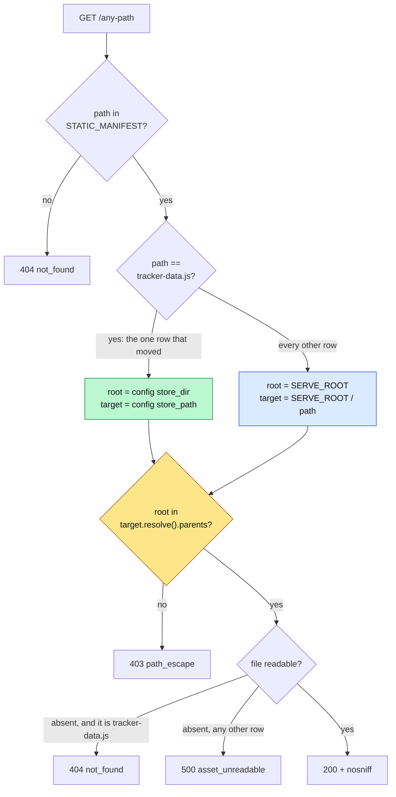

# 0034 — The analysis store leaves every repo for one home-directory location, and the serving guard is re-pointed rather than removed

- **Status:** Accepted (2026-08-22)
- **Context:** `treko/store_location.py` (new), `treko/server.py`, `.gitignore`,
  `skills/treko/SKILL.md`. Full design, scenarios, acceptance criteria and measurements:
  `docs/features/treko-store-location.md`. Applies **ADR 0023** (the `tracker-data` schema is owned
  by the Nocturne export) by moving the *file* without touching its *name* or its envelope, and
  narrows the surface ADR 0022 opened (the control server serves its own page) by extending
  containment to a second root instead of relaxing it. ADR 0024 (the control server must be
  accountable) is not reopened — it gains one banner field. ADR 0033's naming boundary is inherited
  unchanged.
- **Note:** ADR number **0034** was confirmed free at the moment of writing against `origin/main`
  (`e6a9bb6`, which tops out at `0033`), against every local and remote ref, and against the working
  tree of all four checked-out worktrees — not against a local `ls`, and not against local `main`,
  which is a stale ancestor of `origin/main`. `0028` remains an unused gap and is left alone rather
  than backfilled out of order; `0026` is still duplicated on `origin/main`
  (`…symbolic-ref…` and `…the-gate-does-no-json-parsing…`), which is why a filename-only check is
  not a uniqueness check — two files with different names merge cleanly and nothing ever surfaces
  the collision.

## Context

Treko writes exactly one artifact: `tracker-data.js`, the file its page loads. Until this change it
wrote that file into its own source directory, `treko/`, inside a git repository that **tracked** it.
So the act of surveying a repo dirtied that repo. Observed 2026-08-22: one press of `reanalyze`
produced a **6,170-line diff** on a tracked file in a checkout whose only open PR was a docs-only
closeout, and it had to be reverted by hand before the branch could be pushed. The commit that ends
that arrangement, `0aaf78c`, deletes **5,785 lines** from the index in a single `git rm --cached`.

Two properties make this worse than untidiness. **The tool surveys other repos** — `--repo` points
the analyzer anywhere, but the result was always written back into `treko/`, so a survey of repo B
dirtied repo A; the store already holds runs from `.claude`, `memsearch` and others side by side.
And **a tracked generated artifact invites a bad merge** — it is large, it is rewritten on every
run, and it conflicts on any branch that regenerates it.

The move is not a path constant. `treko/` is the serving root of a control server that can type into
a full-permission Claude session, and every static row is containment-checked against exactly that
root. Moving the store means changing a security check, which is why this is an ADR and not a
one-line edit.

## Decision

**The store lives in one directory outside every repository, named by one environment variable, and
the containment check is re-pointed at that directory for exactly one manifest row.**

| Layer | Before | After |
|---|---|---|
| Store location | `treko/tracker-data.js`, inside the repo | `$TREKO_STORE_DIR/tracker-data.js` |
| Default | — | `${XDG_STATE_HOME:-~/.local/state}/treko` (`store_location.py:57-63`) |
| Configuration | none | one environment variable, no flag, no config file |
| Directory mode | repo default | `0o700` **on creation only** (`store_location.py:32`, `:93`, `:96`) |
| Serving root | `SERVE_ROOT` for all 17 rows | `SERVE_ROOT`, plus `config["store_dir"]` for one row (`server.py:511-516`) |
| Containment check | `SERVE_ROOT in resolved.parents` | `root in resolved.parents`, `root` chosen per row (`server.py:522`) |
| Git | tracked | untracked and ignored (`.gitignore:109`) |
| Filename, envelope, `tool` field | `tracker-data.js`, ADR 0023's shape | **unchanged** |

`XDG_STATE_HOME` is the right variable of the XDG set: a survey is regenerable state — annoying to
lose, rebuildable — which is neither cache nor configuration. Honoring the variable means the
machine's convention wins without Treko needing to know what it is.

**Canonicalization is not cosmetic; it is the correctness of the whole change.** The guard compares
against `target.resolve()`, which is always symlink-free. If `store_dir` were stored as given, a
directory reached through a symlink would never appear in `resolved.parents` and **every** request
for the store would `403`. This is not hypothetical on the target platform: `Path("/tmp").resolve()`
is `/private/tmp` on macOS, so `TREKO_STORE_DIR=/tmp/treko` would break the tool outright. Both
sides of the comparison are canonical (`store_location.py:63`) or the feature does not work.

## The trust boundary that actually moved, and the one that did not

What moved: the server now reads and writes a directory **outside the repository it was launched
from**, creating it if absent. What did not move: **who gets to name that directory.** It comes from
the server's own process environment (`store_location.read_store_dir`, called once at
`server.py:729`) and from nowhere else. The browser cannot name it, `POST /command` still carries
exactly three verbs — `clear`, `handoff`, `reanalyze` — and none of them takes a filesystem path.

That distinction is the whole reason this change is small enough to accept:

- **No URL became reachable.** `STATIC_MANIFEST` (`server.py:82-100`) is checked *first* and is
  unchanged — a closed list of 17 rows. A path that is not a row is not servable, however it is
  spelled, and the store's URL was already a row.
- **The guard was re-pointed, not removed.** A symlink planted inside the store directory that
  resolves outside it is still `403 path_escape` (`server.py:522`), and the store's existing
  `404`-when-absent behaviour (`server.py:530-532`) is what keeps a first launch off `500`.
- **The path is constructed in exactly one place.** `build_config` derives `store_path` from
  `store_dir` (`server.py:702`) and every consumer takes it as an argument — `run_reanalyze`
  (`server.py:371`), the `reanalyze` handler (`server.py:627`), the first-run analysis
  (`server.py:773-774`), and the migration (`server.py:736-737`). A second derivation would let the
  page and the writer drift onto different files and silently show stale data.
- **`analyze.py` learned nothing.** It remains a pure stdout producer with no `store` import at all;
  the store's location is knowledge held only by `server.py` and `store_location.py`.

**`0o700`, and only on creation.** The old store was one file in one repo. The new one is a single
shared location aggregating surveys of *every* repo the user analyses — branch names, card titles,
filesystem paths, and which work is in flight. That is a broader collection than what it replaces,
so it is created owner-only, per the default-deny rule in `rules/core-conduct.md:29`. `mkdir`'s mode
is subject to the umask, so it is followed by an explicit `os.chmod` rather than trusted. An
**existing** directory's mode is never touched: silently tightening a directory the user made and
may share is not this change's call.

**Validation runs before anything is served,** on the `StartupAbort` path `main()` already uses for
`read_port`, `bind_surface` and friends — a bad value exits `2` with its reason on stderr
(`server.py:738-740`). Writability is probed with a real `tempfile.NamedTemporaryFile` in the target
directory (`store_location.py:84`), not `os.access`, so the errno comes off the same syscall the
real write would make.

## The migration, and why it goes through the store module

The legacy file is adopted **once**, at startup, only when the destination is absent
(`store_location.py:131-146`). It is read and written through `store.read_store` / `store.write_store`
rather than copied as bytes, which makes the copy validated (it must parse as an envelope) and atomic
(`write_store` places its temp file in the *target's* directory, so `os.replace` never crosses a
filesystem — `store.py:167`, `:172-181`). A `StoreError` aborts the launch rather than starting
empty, because the four runs in that file — `guard-memsearch`, `pane-orchestration-v2`,
`statusline-wrap`, `statusline-followups`, under an envelope stamped `2026-08-20T03:07:28Z` —
cannot be regenerated: `analyze.py` reports the present, not the past.

The copy **announces which of its three outcomes happened** — `copied N runs from <path>`,
`store already present, legacy file ignored`, `no legacy store to adopt` (`store_location.py:39-41`)
— and the banner gained a `store=` field naming the resolved directory (`server.py:786-787`). Both
were raised by the observability judge in round 1 and both close the same failure: a `TREKO_STORE_DIR`
with a typo in it is a *valid* path. It starts cleanly, writes real data somewhere nobody is looking,
and produces stderr identical to a correct launch. A migration that silently did not run would
otherwise be indistinguishable from one that did.

Order is pinned and was measured rather than assumed: the copy's line prints during startup
validation, the banner prints immediately before `serve_forever`. Neither is "the first line."

## The accepted `file://` degradation — corrected against the card

`docs/features/treko-store-location.md` §Risks states that opening `Treko.dc.html` directly will
show "its `TRACKER_DATA_SOURCE = 'sample'` state with the amber source dot." **Measured on this
branch, that is not what happens, and the real behaviour is worse.**

`TRACKER_DATA_SOURCE` is written at `tracker-data-fallback.js:18` and **read nowhere**: `git grep`
over the whole repo finds that one assignment in code and no reader, in `Treko.dc.html` or anywhere
else. The source indicator is driven by a different variable —
`srcDot: window.TRACKER_DATA ? 'var(--ok)' : 'var(--warn)'`, `srcTitle: … 'tracker-data.js loaded'`
(`Treko.dc.html:633`) — and the fallback shim sets `window.TRACKER_DATA` by loading
`tracker-data.sample.js`. So when the real store is absent the page renders **vendored sample data
under a green dot reading "tracker-data.js loaded"**. There is no amber state to reach.

The only signal that distinguishes the two is the timestamp in `srcLabel` (`Treko.dc.html:634`),
which shows the sample's `generatedAt` of `2026-08-09 02:41` — thirteen days old at the time of
writing, and so no more obviously wrong than a survey run last week. A reader who does not check
that date, and who has nothing else to check, reads vendored sample data as their own survey —
precisely the failure `rules/core-conduct.md:11` names: a display that reads as a measurement while
being a substitute.

This is **not caused by this change** — the shim and the unread variable both predate it — but this
change is what makes it reachable, because `treko/tracker-data.js` no longer exists beside the page
in a fresh clone. It is recorded here, uncorrected, for three reasons: the page is out of this
change's scope (it ships no UI change); the fix is a real design question about how the page reports
its own data provenance, which belongs with the deferred Configuration drawer; and a wrong claim left
only in a frozen card's Risks section would be inherited as fact by whoever builds that drawer.

Over `http://` with `--open` — the documented launch — the case does not arise: `server.py:773-774`
runs the analyzer when the store has no runs, so a real store exists before the browser opens. It
remains reachable over `file://`, and over `http://` when the server is started without `--open`
against an empty store.

## Alternatives considered

| Option | Verdict | Why |
|---|---|---|
| **One configurable directory outside the repo, default `${XDG_STATE_HOME:-~/.local/state}/treko` (chosen)** | **Accepted** | Surveying a repo stops writing to it, in every repo, without anyone remembering a flag. The guard is re-pointed, so no URL becomes reachable that was not reachable before. |
| Keep the store in `treko/` and only `.gitignore` it | Rejected | The file still lands inside whichever repo happens to hold the tool, and `git status` stays clean while a survey of repo B writes into repo A. It hides the symptom and keeps the cause. |
| Opt-in flag, default unchanged | Rejected | A default that must be remembered every session does not solve a problem that appears silently. The 6,170-line diff was produced by someone who was not thinking about the store. |
| A `--store-dir` CLI flag, or a config file | Rejected | A second precedence rule is a second thing to get subtly wrong. `server.py` already reads four `TREKO_*` variables (`:43`, `:47-49`); this is the fifth, and it
matches their shape — including the injectable `environ` argument (`:152`, `:170`) the new resolver
copies. |
| `~/.treko/runs`, as the prototype's placeholder suggests | Rejected | The user confirmed 2026-08-22 that the prototype string is placeholder text, not a decision. The discoverability argument it carried is answered by the banner, which names the resolved directory on every launch. |
| Per-repo store directories | Rejected (deferred) | One store holding several repos' runs is the current behaviour and arguably the feature. Keying by repo is a separate design, not a side effect of moving a file. |
| Remove the containment check for the store row | Rejected | The check is the only thing standing between a manifest row and an arbitrary file. Two roots is a re-point; no root is a hole. |
| Copy the legacy file with `shutil.copyfile` | Rejected | Bytes copied are bytes unvalidated. Going through `store.read_store`/`write_store` makes the migration parse-checked and atomic, and lets a corrupt legacy file abort the launch instead of quietly producing a broken store. |
| Start empty and let the user re-run | Rejected | The four snapshots under the `2026-08-20T03:07:28Z` envelope cannot be regenerated. Silently beginning with no data is how they would disappear unnoticed. |

## Consequences

- **The tool now owns state outside every repository.** `~/.local/state/treko/` (or the configured
  directory) is created on first launch, `0o700`, and is not cleaned up by anything. Uninstalling
  Treko leaves it behind; that is the normal contract for an XDG state directory and is not tracked
  as debt.
- **One directory aggregates surveys of every repo the user analyses.** That was already true of the
  store's *contents*; what is new is that the collection now sits in the home directory rather than
  in one repo's working tree. `0o700` is the control, and it is applied only where this change
  creates the directory.
- **`treko/tracker-data.js` is untracked and ignored; `tracker-data.sample.js` and
  `tracker-data-fallback.js` stay tracked** — they are vendored assets the page loads, not artifacts
  the tool writes. `tracker-data.json` is also still tracked and was deliberately left alone: it is
  not named by this change's scope.
- **The migration is exercised on exactly one machine.** After this change a fresh clone has no
  legacy file at all, so `adopt_legacy_store` correctly does nothing there. Its behaviour is pinned
  by tests that synthesise a legacy file rather than by the real one.
- **A path field in the deferred Configuration drawer is a further trust-boundary extension, not a
  UI task.** Accepting a directory from the browser means the server creates and writes at an address
  the page supplied. That needs its own design and its own judge round. Until it exists, the field is
  display-only or absent — never an input that silently does nothing.
- **The page still says the store lives beside it.** `Treko.dc.html:32` reads "Expected
  `tracker-data.js` next to this file", and `Treko.dc.html:610`/`:633`/`:634` name the file without
  naming its directory. Stale after this change, deliberately not edited here, and inherited by
  whoever ships the drawer.
- **`server.py` is at 799 lines against this repo's 800-line hard maximum.** That is why D1, D2 and
  D4 live in `store_location.py` (146 lines) rather than in the server. Any further work in
  `server.py` moves logic out; it does not add lines, and it never deletes the comments — they carry
  the reasoning behind its security decisions.
