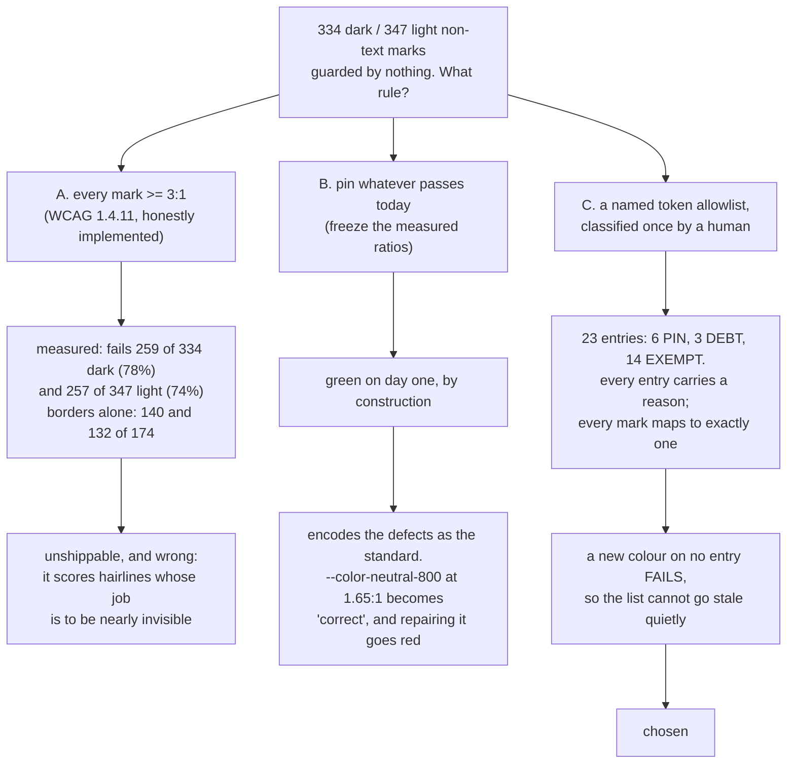

# 0037 — Non-text contrast is guarded on a named token allowlist, not on every mark and not on whatever passes today

- **Status:** Accepted (2026-08-26)
- **Context:** `treko/test_nontext_contrast.py` — one new test module, plus a one-line Chrome
  re-pin in `treko/cdp_harness.py`. No palette file changes. Full design, scenarios, acceptance
  criteria, the 23-entry table and every measurement: `docs/features/treko-non-text-contrast.md`.
  Inherits **ADR 0036** (the token layer is the feature; `treko/nocturne.css` stays byte-untouched)
  — this record is what that token layer is finally guarded by.
- **Note:** ADR number **0037** was confirmed free before writing:
  `git log --all --name-only --pretty=format: -- 'docs/decisions/0037*'` returns nothing across
  every ref in this checkout, and `git rev-parse origin/main` equals
  `git ls-remote origin refs/heads/main` (`82a9315`), so the remote-tracking side of that sweep is
  current rather than stale. Recorded as the command rather than as a ref tally, because a count
  ages the moment anyone fetches.
- **Measured at:** branch `feat/treko-non-text-contrast`, on Chrome `152.0.7977.65`, against the
  fixed tree fixture. Every figure below was produced by the shipped module's own walk in this
  session, not read out of the card.

## Context

Treko's board can be read in two themes. Before this change, exactly one check looked at whether
anything on it was visible — `test_theme.py::test_criterion5_light_mode_contrast_meets_wcag` — and
that check scores **text**, in **light** only.

Measured on the page: 851 elements have rendered area per theme, 368 of them paint text and are
scored by that check, and **334 non-text marks in dark and 347 in light are scored by nothing at
all**. A mark here is a background fill, one of four border sides, an outset shadow, or an SVG
shape's fill or stroke — the dot that says a branch is dirty, the border around a merge-wave badge,
the line between two graph nodes, the five dots that say which phase a card is in. None of them
paints in an element's own `color`, so criterion 5 cannot see any of them.

That is not a theoretical gap. Card A's own re-tint task moved the light **text** check from 127
violations to 0 — it caught a real regression, loudly, because something was watching. Nothing was
watching the other half of the page, and dark, the default theme, had no coverage of any kind.

## The three options

**Option A — implement the success criterion.** WCAG 1.4.11 asks whether a user can perceive a
control's boundary. Implemented literally against every mark, it fails **259 of 334 marks in dark
(78%)** and **257 of 347 in light (74%)**; restricted to borders and scored against the surface
outside them, **140 of 174 in dark** and **132 of 174 in light**. A rule that red-flags four fifths
of a page is not a guard anyone keeps green, and it is not even *right*: most of what it flags are
1px hairlines and dividers whose entire design purpose is to be barely visible. `--hair` sits at
1.17:1 and that is the intent, not a defect.

**Option B — pin what passes today.** Green immediately, catches any regression, requires no human
judgement. It also **writes the current defects into the specification.** Three tokens fail today —
`--color-accent-700` at 2.88 dark / 1.27 light, `--color-neutral-700` at 2.53 dark,
`--color-neutral-800` at 1.65 dark / 1.25 light. Pinning them makes those numbers the standard, and
makes the eventual repair a test failure. A guard that goes red when someone fixes something is a
guard that teaches people to ignore it.

**Option C — a named token allowlist, classified once by a human.** Chosen.

## Decision

**The population is 23 named palette tokens, each classified into one of three classes, and every
mark on the board must map to exactly one of them.**

- **PIN (6 tokens, 55 marks per theme)** — pass today; held at a **3.0 floor**. A floor, not a
  freeze: `--ok` may slide from 10.30 to 3.01 and stay green. That is the deliberate limit of what
  a green PIN assertion claims.
- **DEBT (3 tokens, 78 marks per theme)** — fail today; asserted at their **recorded ratio to 4 dp,
  ±0.0005**, so the assertion fails in *both* directions. Red if they get worse; red if they get
  better, because then someone repaired them and this record has become a lie. The repair is a
  palette pass with its own card, its own value judgements and its own before/after measurement —
  §D5 of the feature file says why it cannot ride along here.
- **EXEMPT (14 tokens, 201 dark / 214 light marks)** — no ratio asserted, but each carries a
  **specific reason string** naming where it paints and why it is exempt, and each is asserted to
  match its exact mark count. The word "decorative" is forbidden by name and by assertion: it
  explains nothing, and it is how an exemption list stops being auditable.

**What makes this more than a curated opinion is the coverage assertion.** Every `(colour, kind)`
key among the scored marks must map to exactly one entry, and every entry must match at least one
mark. A new mark in an unclassified colour fails. A token that stops painting fails. An edited token
value fails, because its declared colour string is new and its key is unmapped. **The list cannot
go stale quietly** — which is the whole difference between an allowlist and a comment.

## Consequences

**What this buys.** The specific failure card A already suffered — a palette edit washing out marks
with the suite green — cannot happen again to any of these 23 tokens, in either theme. Dark, the
default theme, has contrast coverage for the first time.

**What it costs, stated plainly because a green tick is what people read.** A green run means *these
tokens have not regressed*. It does **not** mean the board is accessible, and every test docstring
in the module says so. Marks only visible after an interaction — the settings drawer and its scrim,
the agent panel, every hover and focus state — are outside the population entirely, inherited from
the blind spot criterion 5 already had. Focus rings get their own card, and the reason is not that
they fail: they pass, but only 7 of the page's 29 click targets can take keyboard focus at all, so a
green focus-ring tick would be most reassuring exactly where the coverage is worst.

**Attribution is by `(colour, kind)`, and that has a stated limit.** `getComputedStyle` does not
give back the custom-property name a resolved mark came from, so marks are indexed by their declared
colour string paired with the kind of mark. One colour on this page is claimed by two tokens — dark
`rgb(63, 66, 77)` is both `--color-neutral-800`'s 22 fills and `--shadow-sm`'s 13 outset shadows —
and the kind splits them exactly. **The guarantee is over the pair; the token name beside it is this
card's attribution.** A future token sharing both a value and a kind with an existing entry would be
filed silently under it, and nothing would surface that. Disclosed, not solved.

**Exact counts, not floors.** Every entry asserts its precise mark count. `>= 200` against a real
334 stays green after 134 marks disappear, and the total alone cannot catch a misfiling: put all 35
of dark `rgb(63, 66, 77)` under one entry and the total does not move while two entries are wrong.
That was an actual defect in an early revision of this card, and falsifier case 6 now constructs it.

**All thirteen falsifier cases were run and all thirteen go red**, each with the assertion that
caught it recorded in the feature file's §Verification. Two of them did not fire on the first
attempt, and both near-misses are recorded there rather than tidied away: one mutated a mark that is
not rendered at mount, so it proved the check was quiet rather than working; the other broke two
things at once and the assertion reported only the first, which is a test that cannot be falsified
by the case written for it.

**One second file changes under `treko/`.** Chrome auto-updated `152.0.7977.54` → `.65` mid-
implementation and the pin assert fires before launch, so 35 browser tests failed at construction.
The feature file's §Pinned versions requires a re-pin to be followed by a full re-measurement, and
it was: the scored population and all six DEBT ratios reproduced exactly on the new build. Card A's
re-pin comment justified moving the pin on the grounds that nothing stored a Chrome-derived
constant — **this card is what makes that false**, and the comment now says so in place.
