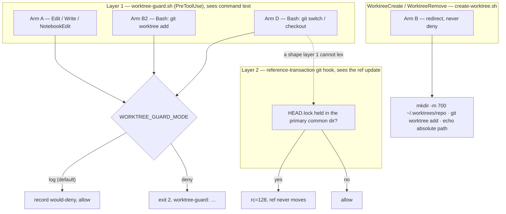

# 0038 — The standing worktree rule gets a computational home, in two layers that fail in opposite directions

- **Status:** Accepted (2026-08-26), shipping in `log` mode — see "Arming is a separate decision" below.
- **Context:** `hooks/worktree-guard.sh` (new, 644 lines) with
  `hooks/lib/worktree_guard_bash_arms.sh` (545) and `hooks/lib/worktree_guard_liveness.sh` (80);
  `hooks/create-worktree.sh` (new, 356); `hooks/reference-transaction` (new, 683) and
  `hooks/reference-transaction.mode` (36); `hooks/install-layer2.sh` (new, 280); extensions to
  `hooks/lib/classify-git-command.py` (+346) and `hooks/lib/shell_segments.py` (+66);
  `settings.json`; and `hooks/doc-guard.sh`, where one reader was ported in. Full design, the
  measurement record across nine compliance rounds, acceptance scenarios and boundaries:
  `docs/features/worktree-location-guard.md`. Extends the guard family ADR 0013 established (a
  shared shell-segment lexer) and ADR 0015 amended (a redirection is part of its command) by adding
  a fourth consumer — `segments()`'s contract is unchanged, and the lexer gains one additive second
  view, `has_grouping()`, over the same token list. Diverges deliberately from
  **ADR 0010**/**ADR 0011**'s opt-in shape — see "No repo opt-in". `settings.json` being tracked
  whole (**ADR 0032**) is what makes the arming switch reviewable, and is load-bearing here rather
  than incidental.
- **Note:** ADR number **0038** was confirmed free at the moment of writing against `origin/main`
  (which tops out at `0037`) and against **every local and remote ref** in this repo — a per-ref
  `git ls-tree` loop, not a local `ls` and not local `main`, which is a stale ancestor. `0028`
  remains an unused gap and is left alone rather than backfilled out of order; `0026` is still
  duplicated on `origin/main` (`…symbolic-ref…` and `…the-gate-does-no-json-parsing…`), which is
  why a filename check is not a uniqueness check.

## Context

Two rules have held by convention only, and both fail the same way: silently, in the exact session
that forgot them.

**Rule 1 — work happens in a worktree, never the primary checkout.** Several Claude sessions run
against one repo at once. A primary checkout has a single HEAD, so a session that parks it on a new
branch changes the branch out from under every other session sharing it. This is not hypothetical:
one session moved `~/.claude` onto a new branch while another had uncommitted `panes/*.sh` edits in
that same checkout, and that session's next commit would have landed on a branch it never chose.
The command that did it was a stray `git merge --ff-only` — an accident, not an attack, and that
sets the whole threat model.

**Rule 2 — a worktree lives at `~/.worktrees/<repo-name>/<worktree-name>`.** They have been nesting
*inside* the working tree at `.claude/worktrees/`, which puts checkouts inside the repo they are
checkouts of.

Until now both rules lived in a memory file (`feedback_always_work_in_a_worktree`, 2026-08-23) and
in prose. Memory is advisory and does not survive into every session's attention. This ADR gives
the rules a place that executes.

The card itself is the argument for the feature: it is a hand-merge of two versions developed in
parallel from the same planning commit, whose facts contradicted each other in three places. The
problem demonstrated itself while being specified.

## Decision

Four enforcement arms across two `settings.json` hook registrations, plus one git-layer hook
installed outside `settings.json` entirely.

**1. Layer 1 fails open; layer 2 fails closed; both ship.** Rounds 3–7 all cited the same defect —
a text classifier fails open on any shape it cannot lex, so every missed shape was a live HEAD move.
Round 8 proposed replacing it with the git-layer hook. Measurement killed the replacement: vetoing a
HEAD write does **not** roll back the checkout, so a refusal leaves the destination branch's content
staged in the shared tree. One mechanism is clean but leaky, the other comprehensive but messy, so
both run, in order. Layer 1 refuses before git runs at all and leaves the tree untouched; layer 2
catches what layer 1 could not read. A dirty tree after a layer-2 refusal is the signal that layer 1
needs widening, and it arrives with `rc=128` and a message rather than silently.

**2. Layer 2's rule keys on the lock, not on the value.** At stage `prepared`, in the primary
context only, for a transaction line whose ref is `HEAD`: deny if `<common-dir>/HEAD.lock` exists.
No token, no nonce, no expiry, no ledger, no command inspection. Keying on the lock is what catches
the three detach forms that write a **raw OID** to `HEAD`; a rule phrased as "deny
`HEAD → ref:refs/heads/…`" would have been blind to all of them. `git worktree add` holds
`worktrees/<name>/HEAD.lock` rather than the primary's, so it passes by construction. Only
`prepared` can veto — exiting non-zero at `aborted` or `committed` is ignored by git and the ref
moves anyway.

`--path-format=absolute` is load-bearing in the scope test, not tidiness. The earlier wording
compared `--absolute-git-dir` against a bare `--git-common-dir`; those are **never** equal anywhere,
because the second is relative to the cwd. The hook would have failed its scope test on every
invocation, bailed, and allowed every HEAD move — while the liveness check reported it armed. The
corrected form was measured discriminating in **both** directions, primary and linked.

**3. Layer 1 checks layer 2 — because a guard whose absence is indistinguishable from its success
is the failure mode this design keeps meeting.** Layer 2 arms via global `core.hooksPath`, not
`settings.json`, so nothing in the tracked record proves it is live. `worktree-guard.sh` therefore
resolves the effective repo's `core.hooksPath` and confirms an executable `reference-transaction`
sits there, and says so when it does not.

⚠️ **In the configuration being merged that sentence is inoperative, and this is the sharpest thing
to know about the branch.** The liveness report rides on a refusal that is actually printed
(`worktree-guard.sh`: `if [ "$decision" = deny ]; then check_liveness …`), and `log` mode never
produces one — its decision is `would-deny` and it exits 0 silently. Layer 2 is also not yet armed
(`core.hooksPath` unset). So as shipped, **the guard is behaviorally indistinguishable from not
being installed**, and its only trace is a gitignored log. That is the exact failure mode this card
names repeatedly, entered here deliberately rather than by accident: the log window is the whole
point of `log` mode, and paying for a `git config` read on every allowed call is what the
refusal-only design exists to avoid. It resolves itself the moment mode flips to `deny` (task 10) —
but until then, nothing in the running system will tell you layer 2 is missing.

Three measured failure modes make the check non-optional once armed, all
silent, all rc=0 with HEAD moved: hook file missing, hook present but not executable, `hooksPath`
directory missing. The sharper risk is reciprocal — `husky` and `lefthook` set `core.hooksPath`
**locally**, and local beats global, so the first repo to run `husky install` silently removes the
guard from the one repo where work is happening. The check is not self-hosting: if
`worktree-guard.sh` is itself unregistered nothing checks either layer, and that regress terminates
at `settings.json`, which is tracked and reviewable.

**4. No repo opt-in.** `phase-guard.sh`'s `[ -d "$root/docs/features" ] || exit 0` exits silently unless the repo has a `docs/features/`
directory, so a repo that never heard of the phase workflow is never blocked by it. This guard has
no such signal, by explicit user decision, with the cost stated before the choice: **every fresh
`git clone` on this machine will deny guarded writes from its primary checkout until a worktree
exists for it.** That is intended behavior. Two things bound it — the guard ships in `log` mode, and
`settings.json` is on the exemption list, so the hook's own registration always stays editable.

**5. The exemption list is written out, never incorporated by reference.** `docs/*`, `.claude/*`,
`settings.json`, `projects/*/memory/*`, `rules/*`, `skills/*`, `CODING_MEMORY.md`,
`coding-memory/*`. The round-1 draft claimed to reuse `phase-guard`'s list "verbatim" while printing
a shorter one beside it, and the two entries it dropped are the ones that matter: `coding-memory/`
holds both judges' `verdicts.jsonl`, so under the short list a judge with its cwd in a primary
checkout would be denied permission to write its own verdict — this feature's own gate would jam.

**6. Arming is a separate decision from building.** The switch is `env.WORKTREE_GUARD_MODE` in
`settings.json`, holding `log` or `deny`. **Absent** means `log`. **Any other value runs the guard
in `deny` mode**, and every refusal the mode governs then names the bad value
(`worktree-guard.sh`, the `case "$WORKTREE_GUARD_MODE" in` block and both exits of `refuse()`; the
three `hard_deny()` call sites — two distinct messages — fire before the mode is read and cannot
name it). A present-but-wrong
value means someone tried to arm the guard and
mistyped, and reading a failed configuration attempt as "off" is the silent disarm this design
refuses everywhere else; absence and a typo are deliberately not the same case.

⚠️ **This is the one place the implementation was wrong, and the correction is worth recording
rather than smoothing over.** The first version refused *every* guarded call on a bad value — a
third reading distinct from both "arms in `deny`" and "treats as `log`". Measured: a mistyped
`WORKTREE_GUARD_MODE=DENY` refused a `Write` to `settings.json`, the file whose exemption exists so
that "the hook registration and its `WORKTREE_GUARD_MODE` switch stay editable", while the refusal's
own text claimed this guard never blocks it. `git status` was refused too, so there was no route
back through `Bash` either. That recreated the footgun `phase-guard.sh` names in its own exemption
comment — "a guard that can block edits to its own off switch is a footgun" — in the one
state where the switch most needs editing. Boundary 9 had always read "**`deny`**, and the message
names the bad value", so the code — not the spec — was the thing out of line. Fixed by selecting
`deny` and deferring the message to the refusal path: everything the guard would have judged is
still refused under the strictest real mode, while an exempt path and a write already inside a
worktree pass. Pinned by tests G2a/G2b/G2c, which were committed red first.

**The recoverability claim is scoped to that case and no further.** ⚠️ *Superseded 2026-08-31 by card task 17 — see the dated note two paragraphs below; this paragraph records the state at the time of the decision.* **Two** sibling refusals —
`$HOME` unset and git below the version floor — still `refuse()` from an arm's entry point *before*
the exemption list is consulted, while their text makes the same "settings.json stays editable"
claim. Measured false (`hooks/worktree-guard.probe.sh`, E1 and E2: a `Write` to `settings.json`
returns rc=2 with that sentence in the refusal), and left open deliberately: unlike the mode typo,
those are states where the guard may be genuinely unable to resolve the repo root the exemption
list is relative to, so each needs its own decision rather than a copied answer.

Two neighbours that look like the same fault are not, and the distinction is what the probe
settled. The **missing-lib-dir** refusal governs only the Bash arms — a `Write` never sources them —
so `settings.json` stays writable there (probe E3, rc=0) and its message is **true**. `hard_deny
"$MSG_NO_PYTHON"` *does* refuse a `Write` to `settings.json` (probe E4, rc=2), but it makes no
recoverability claim, so it is a fourth and separate gap: the switch is unreachable and nothing
says so. Tracked in the card's task-13 note.

> ⚠️ **Superseded 2026-08-31 by card task 17 — the two paragraphs above record the state at the
> time of this decision, not the current code.** They are left as written because the decision
> they justify was taken on those facts; this note is the correction, not a rewrite.
>
> The `$HOME`-unset and version-floor refusals **no longer** refuse a `Write` to `settings.json`:
> Arm A's Step A6 exemption check was moved to run as soon as the repo root resolves, so both now
> return **rc=0**, and the "settings.json stays editable" sentence they print became true rather
> than being removed. A failed submodule probe joined them. Measured before and after on one
> fixture (the post-task-17 probe run against the pre-task-17 hook), across the whole 28-row
> table: **3 rc changes, all `2 → 0`, all on the exempt path, none on any non-exempt path.**
>
> Where the repository root is genuinely unknowable — no enterable ancestor, an unrecognized
> `--show-toplevel` diagnostic, an empty one — the refusal stands but the message was **reworded**
> to say the exemption list was never reached. The exemption is deliberately *not* honoured by
> filename in those states; matching `settings.json` with no repo root would exempt every
> repository's copy, including ones this guard should watch.
>
> `hard_deny "$MSG_NO_PYTHON"` is no longer silent — the "fourth and separate gap" named above is
> closed as a *silence*, but it remains the one state with **no route out**: it fires before the
> guard dispatches on tool name, so a Bash edit is refused identically. Its message now says so
> and names the fix (restore `python3` on `PATH`). `MSG_NO_PAYLOAD` and `MSG_NO_GIT` were also
> given the sentence and *are* escapable through the Bash tool, which is asserted by controls
> `R8b`/`R9c` rather than assumed. The missing-lib-dir reading above is unchanged and still true.
>
> The guard's behaviour was **not** relaxed anywhere the guard would otherwise have judged: in the
> no-python state a Bash payload is still refused, deliberately — a guard that cannot read its
> payload must not fail open. Detail and the measurement record: the card's task-17 section. The switch is
**not** at `hooks/state/worktree-guard.mode`, which cannot work: `.gitignore` carries a
`/hooks/state/` entry, so arming a hard deny across every repo on this machine would have left no record
in git at all. In `settings.json` it is a one-line reviewable diff sitting next to the registration
it arms. That `settings.json` `env` entries actually reach a `PreToolUse` hook's Bash subprocess was
measured, not assumed.

**7. The log records refusals and bypasses, never allows.** One tab-separated line per refusal:
timestamp, session id, arm, mode, decision, repo root, path-or-command, optional exempt reason.
`decision` is `deny`, `would-deny`, or `bypass` — and deliberately has no `log-append-failed` value,
because a failed append leaves no state a later process could source one from, and a value the guard
cannot emit is a field the payload cannot source. One line per *evaluation* was measured against
real transcripts at roughly **10–20 MB per three days**, uncapped, which makes "review the log
before flipping" not a real instruction. `session_id` is on the line because the harm this feature
prevents is two sessions in one checkout, unreadable from a log that does not say who acted.
21.4% of real commands (1,601 of 7,474) contain a newline and 0.0% contain a tab, so tabs separate
and `\n` is escaped.

**8. Removal does real work; a dirty worktree is refused, never `--force`d.** Claude reports
*"Exited and removed worktree at …"* on the hook path whether or not anything was removed — measured.
Cleanup is entirely the hook's job. A stale directory is recoverable; silently destroyed work is not.

**9. The shared lexer keeps its fail-open default; this one caller overrides it, and says so at the
override.** `shell_segments.segments()` returns `[]` both for a genuinely empty command and for one
`shlex` cannot parse, and its docstring calls that a deliberate fail-open — correct for callers that
are not the last line of defence. `classify-git-command.py` is, so it emits `SEG_UNPARSED` when the
source is non-empty and the segment list is not. Measured: `git worktree add "unclosed` produced no
output and exit 0, so a caller checking only the exit code never learned anything had happened.
The lexer also gains `has_grouping()`, a second view over the *same* token list rather than a second
parser — two parsers would be free to disagree about what is quoted, and the disagreement would land
inside a guard. It exists because `segments()` throws control operators away, so `)` and `}` are
indistinguishable in its output while bash discards a `cd` at `)` and keeps it past `}`. Measured,
`( cd /tmp/other && git log ) && git switch main` lexes to indices 0..4, so an index-ordered rule
carries the subshell's `cd` to a segment bash would never apply it to. `SEG_GROUPED` therefore
**over-denies** the `( … )` case — refusing a command that was in fact safe, which is the correct
direction for a guard that cannot resolve the ambiguity.

## The limits, stated here so they are not rediscovered as defects

**Layer 2 backstops HEAD moves and nothing else, and that difference is the whole residual risk.**
Six commands in Arm D's own scope overwrite the shared working tree while producing **no `HEAD`
transaction at all** — `git stash pop`, `git stash apply`, `git reset --hard HEAD`, `git revert`,
`git merge --ff-only`, `git cherry-pick` — all measured rc=0 past layer 2 with the shared tree
changed. For those six, layer 1 is the sole defence and it still fails open. **Any statement that
"the pivot fixed the fail-open" is false as a general claim.** Note that the logged incident in
Context — `git merge --ff-only` — is in this set.

**The Bash write surface is not covered and the deny message must not claim it is.** A `PreToolUse`
hook on `Bash` receives command *text*, never effects; whether `npm install`, `make`, or a heredoc
dirties the tree is not decidable from a string. A heuristic arm matching
`mv`/`cp`/`rm`/`touch`/`tee`/redirection was designed and dropped, because its exemptions are
*paths* while its input is *command text*: `echo x > docs/foo.md` would be denied while
`Write(docs/foo.md)` — the same edit to the same exempt file — is allowed. Same edit, two answers.

**Two lexer residuals, both confirmed allowed by the live lexer rather than inferred.** A git call
inside a script file (`./deploy.sh`) and one built inside an interpreter string. Closing either *in
layer 1* means reading arbitrary files or parsing arbitrary languages, which is not lexing. Layer 2
catches these when and only when they move `HEAD`.

**One residual has no backstop at either layer**, created deliberately by clause 3c's relaxation: a
`git worktree add` to a non-conforming location, typed through `Bash`, nested more than three
quoting levels deep. Its siblings are narrower than they look — the same shape carrying
`git switch` is refused by layer 2, the same shape three levels or shallower is refused by layer 1,
and the harness worktree-creation surface is not reachable from `Bash` text at all. Pinned as a
measured allow.

**`git bisect start` in a primary checkout now fails.** It moves `HEAD`, so layer 2 denies it where
the original Arm D allowed it as an accepted under-block. A real usability cost, accepted; the
remedy is to bisect in a worktree, which is what this ADR asks for anyway.

**Not a security boundary.** Four one-flag bypasses defeat layer 2, all measured. And
`WORKTREE_EXEMPT` is **one escape hatch clearing both layers, not one per layer** — layer 2 honours
it too (`reference-transaction`, `allow 'bypass-worktree-exempt'`). Anyone
reading the two arms as needing two different bypasses would overestimate what this stops. It does
**not** clear layer 1's precondition refusals, though: with `$HOME` unset, git below the version
floor, or the lib dir missing, a command carrying `WORKTREE_EXEMPT` is still refused (measured —
`hooks/worktree-guard.probe.sh`, the `Bash + WORKTREE_EXEMPT` row of E1, E2 and E3).
Layering raises the floor on accidents. A session that wants to defeat this can.

## Alternatives considered

- **Replace layer 1 with layer 2 (round 8's pivot).** Rejected on measurement: a vetoed HEAD write
  leaves the destination branch's content staged in the shared tree, so every refusal dirties the
  checkout it was protecting.
- **Keep layer 1 alone and keep widening it.** Rejected after five rounds each found a live shape it
  could not see. A text classifier's gaps are unbounded; the ref transaction is a fact.
- **A heuristic Bash write arm.** Designed, then dropped — see the limits above.
- **`hooks/state/` for the mode switch.** Rejected: gitignored, so arming would leave no record.
- **Per-repo installation of layer 2.** Rejected: it means shimming every hook name in every repo,
  including repos cloned later.
- **Opt-in via a marker directory, as `phase-guard` does.** Rejected by explicit user decision; the
  blast radius was stated first and accepted.
- **Migrating the four existing worktrees.** Declined. The guard applies to new `git worktree add`
  only, so two conventions live at once until the old ones are retired by hand.

## Consequences

- **500 tests across four new suites, re-run at `37222ad`: 189/0/1 (`worktree-guard`), 182/0/1
  (`reference-transaction`), 40/0/0 (`install-layer2`), 89/0/0 (`create-worktree`)** — 500 passed,
  0 failed, 2 skipped. The two skips are counted rather than merely printed, by the suites' own
  convention: a case the suite cannot construct is a case it has not tested.
- **Nothing is denied yet.** `WORKTREE_GUARD_MODE` is `log`, so the registration currently only
  records would-denies. Flipping to `deny` is its own commit and requires three criteria: seven days
  of ordinary use; **every arm having recorded at least one `would-deny`**; and every `would-deny`
  line in the window read individually and judged a correct refusal.
- **Those criteria measure precision, never coverage, and must never be reported as coverage.** The
  log records only commands the guard turned away — a command it failed to recognise leaves no line
  at all, so a guard that has gone blind to an entire shape produces a log that reads *flawless*.
  Rounds 4, 5 and 6 each found such a shape, and none would have appeared in a refusal-only log.
  Coverage is what the test suites assert, against shapes chosen deliberately rather than shapes
  that happened to be typed during the window. In `log` mode a failed append also loses a line
  silently, so the log is best-effort and its completeness is not guaranteed.
- **Layer 2 is built but not armed.** It arms through `install-layer2.sh` setting global
  `core.hooksPath`, a separate deliberate step; `settings.json` registration covers layer 1 and the
  lifecycle hook only.
- **Global `core.hooksPath` replaces `.git/hooks` rather than adding to it.** The reported blast
  radius on this machine was 12 `.git/hooks` directories under `$HOME`, **0** holding a
  non-sample executable hook and **0** setting `core.hooksPath` locally. The 12 is a floor, not a
  measurement — a depth-6 scan found 11 and an unbounded scan timed out. Nothing turns on 11 vs 12;
  the decision rests on the two zeroes, and those are the numbers to re-run.
- **A refusal on a dirty worktree removal is still accompanied by a session message claiming
  success.** Claude's *"Exited and removed worktree at …"* is emitted on the hook path regardless.
  This feature makes the removal real; it cannot make the message honest.
- **Whether two `PreToolUse` denies on one tool call both reach the session remains unestablished**
  for the exit-2 path these hooks use. Messages are prefixed `worktree-guard:` so a session can tell
  which hook fired, but nothing here asserts double-deny behavior.
