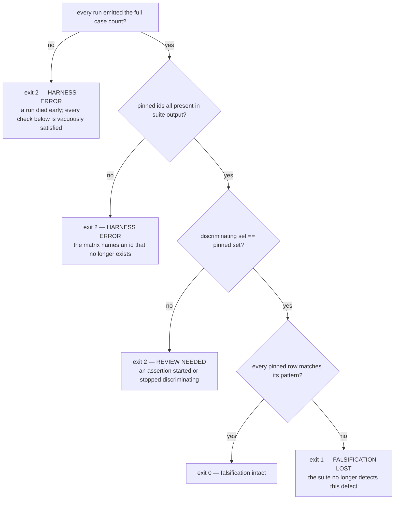

# falsify harness — defect signatures, stable case ids, and a vacuity ratchet

Planned session 29 (2026-08-08) on `main` @ `5fa766f`. Closes task 9 of
`docs/features/statusline-wrap-worktree.md`, which shipped as PR #43 while this harness was
broken — so the statusline script currently has 68 tests and no proof any of them can fail.

**Revision 4** (2026-08-09), after an independent re-measurement of the whole suite. It replaces
per-version `must_fail`/`must_pass` lists with a single **flip matrix** (§2) — the pass/fail state
of every discriminating assertion across every version. `must_pass` is gone: the matrix pins passes
as well as failures, so it anchors itself. Two user decisions, 2026-08-09: adopt the matrix, and
**report rather than fix** the vacuous assertions (§6b) — 13 of the 15 load-bearing assertions are
vacuous, and strengthening them means editing the suite this harness exists to measure, so it
becomes its own follow-up.

**Revision 3** after compliance rounds 1-2 (`fail`/`fail`) and two observability architecting reads
(both `risk=medium`). Scope grew by explicit user decision, 2026-08-08: the vacuity ratchet was
added after the advisory judge measured that a third of the suite passes against a script that
produces no output. Revision 3 added per-iteration ids (§1), `must_pass` anchors, a second stub and
the overlap rule, and stated real coverage (§9). Sections below marked *superseded* record what it
measured; revision 4 keeps the measurements and replaces the design built on them.

**Location note.** `writing-specs` defers to `docs/superpowers/specs/`, but this repo's
`one-canonical-file` discipline (`rules/gates.md`) puts feature-scale work in a single
`docs/features/<name>.md`. The compliance judge examined and accepted this deviation in round 1.

## Background — why this exists

`statusline-command.falsify.py` is a test-of-tests. It runs the **current** suite against five
historical versions of `statusline-command.sh`, each carrying a known defect, and checks that the
suite still catches them. A green suite proves nothing on its own, because an assertion that
cannot fail passes for free.

That is not hypothetical here. Three of the four defects the observability judge found during
PR #43 were assertions that could not fail. The suite was green for all three. **This harness is
the only mechanism that catches that class directly, and it was broken throughout.**

### Defect 1 — pass counts go stale by design

`EXPECTED` maps each historical commit to an exact **pass count** (`falsify.py:44-57`). A count is
a fact about **how many tests exist**, not about the defect. The numbers were written at 20 cases;
the suite held 50 before PR #43 and 68 after. Measured against the 50-case suite:

| commit | want | actual | verdict |
|---|---|---|---|
| `f0902ed` | 9 | **8** | MISMATCH |
| `925c310` | 10 | **9** | MISMATCH |
| `29d6131` | 15 | 15 | ok |
| `4d63b09` | 20 | 20 | ok |
| `e882659` | 19 | 19 | ok |

Three versions were unaffected by 30 new tests, so every added case already failed on them.

**The `f0902ed`/`925c310` discrepancy is resolved, not open.** Revision 1 called it "a real unread
signal" that "growth alone cannot cause". That was wrong, and the round-1 architecting judge
disproved it: against the era-appropriate 20-case suites the recorded counts reproduce `EXPECTED`
**exactly** (9/10/15/20/19), so the counts were correct when written and the harness was broken *by*
growth rather than born broken. The flip is three token-bar baseline assertions tightened when the
context bar landed, benign; "lost exactly one pass" was a **net** figure masking 3 losses against 2
gains. No label is wrong and no test is broken. It is recorded here so tasks 3 and 5 do not
re-investigate a settled question.

### Defect 2 — a third of the suite is satisfied by silence

Measured by the architecting judge and re-confirmed 2026-08-09: against a stub script that
produces no output, **24 of 68 assertions pass** (23 without its `exit 0` — see §6) — including
*every* injection assertion, all four `$PWD fallback stripped` cases, and `a control character in a
path never reaches the output`. They are "count of bad byte
≤ limit" checks, and silence satisfies them.

These are the safety-critical tests. Neither the old harness nor revision 1 of this spec measured
this, which is why §6 exists.

## Measured against the real suite (2026-08-08)

Revisions 1-3 were reasoned from a mental model of the suite rather than the suite, and the
round-3 advisory caught three artifacts that do not exist in it. Everything below is measured
first-hand, reproducibly: copy `statusline-command.test.sh` and a candidate script into a temp
directory, run the suite, and match results by **ordinal** — every run emits exactly 68 results in
a stable order, which is what makes cross-run comparison valid before ids exist. Ordinal matching
has two traps that invalidate the naive version of it; see *How to reproduce any number above*,
below, before re-running any of this.

### Baselines

| run | passes /68 |
|---|---|
| working tree | 68 |
| silent stub, `#!/bin/bash` + `exit 0` | **24** |
| silent stub, `#!/bin/bash` only | **23** |
| one-line stub, `printf 'x'` + `exit 0` | **31** |
| one-line stub, `printf 'x'` only | **30** |
| `f0902ed` | **19** |
| `925c310` | **20** |
| `29d6131` | 28 |
| `4d63b09` | 33 |
| `e882659` | 32 |

**Vacuous against either stub: 31 of 68**, not the 24 revision 2 quoted. The 23-vs-24 and 30-vs-31
pairs are the same effect — a redundant `exit 0` changes the result — which is why §6 must pin stub
**bytes**, not prose.

**`f0902ed` (19) and `925c310` (20) pass fewer assertions than a script that does nothing (24).**
They are already failing wholesale, which is precisely what revision 3's `must_pass` was added to
detect — and could not, which is part of why revision 4 dropped it.

### `must_pass` is a liveness check, not a defect anchor *(superseded by §2)*

The pool of assertions that pass on a version *and* fail against both stubs is **3 for `f0902ed`
and `925c310`, 5 for the others, and the same 3 across all five**:

- `git repo -> git segment names the branch`
- `uncommitted changes -> dirty marker`
- `an over-wide segment survives intact on its own line`

Those say "this is still a working script", not "this version failed for its own defect". Revision
3 required §3 to claim only that; revision 4 removed `must_pass` altogether, because the flip matrix
pins each version's passing entries directly and needs no separate liveness list.

### Non-vacuity is not sufficient — signatures must be DIFFERENTIAL

The strongest-looking candidates ("fails here and is not vacuous") are **identical across all five
versions** — `baseline renders model and context-bar segments`, `sub-1000 tokens render raw`, and
so on. They fail everywhere because every historical script predates the token bar. A signature
drawn from them is satisfied by every version and proves nothing about any defect.

The only shape that proves an assertion detects *that* defect is **differential**: it flips across
the transition where the defect appears or disappears.

| transition | fix-direction | of which non-vacuous | regression-direction |
|---|---|---|---|
| `f0902ed` → `925c310` (route-1 fix) | **1** | **0** | 0 |
| `925c310` → `29d6131` (route-2 fix) | 9 | **2** | 1 |
| `29d6131` → `4d63b09` ($PWD ordering) | 5 | **0** | 0 |
| `4d63b09` → `e882659` (regression) | **0** | **0** | **1** |

The two non-vacuous ones are `surrounding text survives stripping` and `path with a stripped
newline is joined, not truncated`.

#### Correction — direction is not uniform along the chain

Re-measured independently 2026-08-09; the first three rows reproduce exactly. The fourth row read
`1` because it was computed in the opposite direction from the other three. `e882659` is a
**regression**: nothing was fixed there, so "fails on the version, passes on the version that fixed
it" yields the **empty set** for it.

This mattered because revision 3's §4 made an empty signature a hard error: a harness defining
signatures fix-direction-only would have hard-errored on `e882659` for being a regression. **The
relation is transition-typed** — a fix's evidence is `fails on A, passes on B`, a regression's is
`passes on A, fails on B`. Revision 4 resolves this by not encoding a direction at all: §2's matrix
records each id's state per version, and `P P . P .` is the history regardless of which way any
individual transition ran.

#### The chain has only 15 discriminating assertions, and one carries three defects

Measured over all 68 × 5. **53 of 68 assertions never change state across any version** — they pass
everywhere or fail everywhere, and carry zero information about any of these defects. The
discriminating set is 15, of which 13 are vacuous. Pattern is `P` = passes, `.` = fails, in chain
order:

| id | f09 925 291 4d6 e88 | vacuous | assertion |
|---|---|---|---|
| 37 | `.  P  P  P  P` | yes | `literal \x1b in display_name stays inert` |
| 38-42, 66, 67 | `.  .  P  P  P` | yes | the route-2 strip family (7 ids) |
| 43-46 | `.  .  .  P  P` | yes | `$PWD fallback stripped for stdin …` (4 ids) |
| **47** | **`P  P  .  P  .`** | yes | `all-control cwd falls through to a stripped $PWD` |
| 48, 49 | `.  .  P  P  P` | **no** | `surrounding text survives stripping`, `path with a stripped newline is joined` |

**Id 47 is the only assertion in the suite that flips more than once.** It alone tracks the
$PWD-fallback defect through its whole history — clean at `f0902ed`/`925c310` (no stripping, so the
cwd never empties), broken at `29d6131` (strip-then-fallback), fixed at `4d63b09`, broken again at
`e882659` (second fallback below the strip). It is also vacuous: a script that prints nothing
passes it.

### The finding that reframes this feature

**For three of the four transitions, every discriminating assertion is vacuous.** The suite's
ability to prove those three defects detectable rests entirely on assertions that a no-output
script also satisfies. Vacuity is not a side problem to ratchet alongside the signatures — it sits
directly on top of the falsification evidence.

This invalidates revision 3's framing of §6 as secondary, and its worked examples throughout.
**Revision 4 must be designed from this table.** Open for that revision: whether signatures become
differential by definition, and whether "fix the vacuous assertions" can still be a non-goal when
three of four signatures would consist entirely of them.

### How to reproduce any number above

Copy the suite and a candidate script into a temp directory, run `bash statusline-command.test.sh`,
and parse `ok   — ` / `FAIL — ` lines in emission order. **Two traps**, both hit while measuring:

1. **A failing case prints a diagnostic, not its name** — ordinal 0 prints `baseline renders model
   and context-bar segments` when it passes and `baseline segments missing: …` when it fails.
2. **A passing description embeds measured values** — `literal \x1b in display_name stays inert
   (esc=10<=10 …)` on the working tree, `(esc=0<=0 …)` against a stub.

So descriptions cannot be compared across runs without stripping the trailing parenthetical, and
alignment cannot be checked on failing ordinals at all. The valid proof of alignment — which all
ten runs pass — is: every run emits exactly 68 results, **and** every *passing* ordinal's
normalized description equals the working tree's at that ordinal. This is a third independent
reason §1's stable ids are needed, alongside "descriptions get edited".

## Design


### 1. Stable case ids — the identity contract

Revision 1 identified cases by the description string the suite prints. **That is
unimplementable**, and both judges caught it independently: the suite prints a *different* string
on pass than on fail.

```
ok   — all-control cwd falls through to a stripped $PWD (bel=0)
FAIL — all-control cwd leaked via the $PWD fallthrough (bel=3)
```

Measured on `29d6131`: **27 of 40** failing cases have a fail-name not derivable from any pass-name
— and that unmatchable set contains the actual defect signatures for `29d6131` and `e882659`.
Revision 1's single worked example came from `assert_no_injection`, the one family where the
description happens to be stable.

**Contract.** Every assertion carries a stable id, emitted on both outcomes:

```
ok   [pwd-fallthrough-stripped] — all-control cwd falls through to a stripped $PWD (bel=0)
FAIL [pwd-fallthrough-stripped] — all-control cwd leaked via the $PWD fallthrough (bel=3)
```

- Ids are kebab-case, unique within the suite, and **never reused** for a different assertion.
- The id is the identity; the trailing prose stays free-form and may change without consequence.
- `ok()` and `bad()` take the id as their first argument, so a call site cannot emit one without it.
- The harness parses `^(ok|FAIL)\s+\[([a-z0-9-]+)\]` and ignores everything after.

**Loop-generated assertions.** Eleven of the assertions are emitted from inside `for` loops
(`statusline-command.test.sh:524-535, 606-617, 710-717`), so one call site yields three or four
results. Passing a single id would give them all the same id, breaking uniqueness and — worse —
leaving the ratchet unable to say *which* of the four `$PWD fallback` safety cases was fixed. The
loop values (`{}`, `garbage`, `{"cwd":null}`, `0`, the empty string, `abc`, `-1`) cannot be ids:
they do not match `[a-z0-9-]+`.

**Rule:** a loop iterates over explicit `id-suffix:value` pairs, and the id is
`<family>-<suffix>`. Suffixes are authored, never derived from the value and never positional, so
reordering or adding a case cannot silently rename an existing one.

```bash
for case in "empty-object:{}" "garbage:garbage" "null-cwd:{\"cwd\":null}" "empty-workspace:{\"workspace\":{}}"; do
  id="pwd-fallback-${case%%:*}"; payload="${case#*:}"
```

**Duplicate ids are a harness error (exit 2).** If the same id is emitted twice in one run, the
harness cannot attribute a result and must not guess. This is the check that catches the most
likely authoring mistake — see §Risk.

This is the API contract the compliance judge required. With §6's ratchet lists, these are the only
changes this feature makes to `statusline-command.test.sh`.

### 2. The flip matrix replaces counts *and* per-version lists

**Decided 2026-08-09.** Revisions 1-3 pinned per-version `must_fail`/`must_pass` lists. Revision 4
replaces both with a single artifact: the pass/fail state of every **discriminating** assertion
across every version.

An assertion is *discriminating* if its state is not constant across the five versions. Measured,
the suite partitions exactly:

| class | count | vacuous |
|---|---|---|
| discriminating (state changes somewhere on the chain) | **15** | 13 |
| constant-pass on all five | 18 | 15 |
| constant-fail on all five | 35 | 3 |
| | **68** | |

Only the 15 carry information about any of these defects. The other 53 are pinned by nothing and
need to be pinned by nothing — 35 of them fail on every historical version because the feature did
not exist yet (the era noise revision 3's §3 used to chase), and 18 pass on every version because
no defect here
touches them.

```python
# id -> state on each version, chain order. "P" passes, "." fails.
#   Adding a test to the suite does NOT belong here unless it discriminates.
FLIP_MATRIX = {
    #                       f09  925  291  4d6  e88
    "esc-literal-inert":  "  .    P    P    P    P ",
    "esc-real-stripped":  "  .    .    P    P    P ",
    "pwd-fallthrough":    "  P    P    .    P    . ",   # the only id that flips twice
    ...
}
```

**Why this shape.** Three properties fall out of it that the list shape had to bolt on:

1. **Differential by construction.** A row *is* a defect's history. Nothing has to declare that a
   signature "fails here and passes on the successor" — the row says it.
2. **Direction-free.** The regression at `e882659` needed a special case under the list shape
   (§Correction, above). Here `pwd-fallthrough`'s `P P . P .` simply records clean/clean/broken/
   fixed/broken. There is no direction to get backwards.
3. **Self-anchoring, so `must_pass` is unnecessary.** The matrix pins passes as well as failures,
   so a version that collapses wholesale mismatches its own `P` entries. The old §3 existed only
   because the list shape pinned failures alone.

**Stated honestly:** for `f0902ed` the self-anchor is thin. Its column is `1/15 P` — one passing
discriminating assertion, `pwd-fallthrough`, and that one is vacuous. Per-version P counts are
`1, 2, 10, 15, 14`. §4's full-count assertion is what actually catches a wholesale collapse on the
two oldest versions; the matrix alone would not.

### 3. The matrix is closed — an unpinned flip is an error

The list shape stopped the treadmill by allowing extra failures. The matrix stops it by scope: a
new test only enters the matrix if it discriminates. But "extra failures allowed" also meant the
harness stopped noticing anything it had not been told about, which is how it went stale unread.

The matrix is therefore **closed under discrimination**. The harness computes the full 68 × 5
result set on every run — it already executes all of it — and asserts both directions:

- every pinned row matches its recorded pattern exactly (`exit 1` — detection changed); **and**
- the set of ids that discriminate is *exactly* the pinned set (`exit 2` — review needed).

An assertion that starts or stops discriminating is a real change in what the suite can prove, and
it is now impossible to introduce silently. Adding a discriminating test costs one reviewed line;
adding a non-discriminating test costs nothing. That is the treadmill gone at the root — the old
harness demanded an edit for *every* added test, including the 53 that prove nothing.

### 4. Two hard errors that a subset check cannot catch

**A column with no `P`.** A version passing none of the 15 is failing wholesale, and every `.` in
its column is satisfied for the wrong reason. No column is empty today (`1, 2, 10, 15, 14`), so
this is a guard, not a live defect.

**A run that did not finish.** Every check here is satisfied by a run that died early: the ids that
did emit match, and the ones that would have contradicted the matrix never ran. The harness
therefore asserts every run — working tree, all five versions, **and** both stubs — emitted the
full case count, and exits `2` otherwise. Revision 3 applied this to stub runs only; the reasoning
it gave ("a subset check is satisfied by the empty set") applies identically to a version run, and
it is free.

Note that `4d63b09` is no longer a special case. Under the list shape its `must_fail` was empty and
§4 of revision 3 made that a hard error requiring task 4 to resolve. Under the matrix it is simply
the column that is `15/15 P` — the version that fixed everything the suite can discriminate and
regressed nothing. That is a fact worth pinning, not an error.

### 5. Three states, three exit codes



| exit | meaning |
|---|---|
| `0` | falsification intact — matrix matches, ratchet holding |
| `1` | the suite lost detection power, or the working-tree floor failed, or the ratchet grew |
| `2` | harness error — short run, missing id, empty column, unpinned flip, or a blob that is not the script |

An `ERROR` must never exit `0`. The current file returns a binary `0`/`1` (`falsify.py:120-121`),
so a third outcome added without its own code would read as green to whatever runs it.

### 6. The vacuity ratchet

The harness additionally runs the suite against a **stub**: a script that is executable, exits
`0`, and writes nothing to stdout. It records **by id** which assertions still pass.

```python
# Assertions satisfied by a script that produces no output. This list may only
# ever SHRINK. Each entry is a test that cannot fail for the reason it claims.
KNOWN_VACUOUS = ["esc-literal-inert", "pwd-fallthrough-stripped", ...]
```

- **Assertion:** the set passing against a stub must be a **subset** of that stub's list.
- Shrinking is always allowed and needs no edit — fixing a test just works.
- Growing fails the harness (exit `1`), so a newly-written vacuous assertion is caught first run.
- Adding an id requires a deliberate edit, which is visible in review.

**Two stubs, not one.** Silence is the weakest possible broken script. Measured: a stub printing a
single harmless line passes **31** of 68 — seven more than the silent stub, and those seven are
"output exists" / "output is one line" assertions, the flimsiest shape in the suite. A silence-only
ratchet would bless them forever. Both stubs are run, each with its own list:

**Prose does not pin bytes.** Revision 3 defined the stubs in a sentence and quoted 24 and 30. Both
sentences admit two scripts that differ by one assertion: a redundant `exit 0` moves the silent stub
between **23** and **24**, and the one-line stub between **30** and **31**. Same species as the
23-vs-24 wobble revision 3 went and reconciled, one layer down. The harness therefore constructs
each stub from these literal bytes, and the spec carries them:

```bash
# STUB_SILENT -> 24 of 68 pass
#!/bin/bash
exit 0
```

```bash
# STUB_ONE_LINE -> 31 of 68 pass
#!/bin/bash
cat >/dev/null 2>&1
printf 'statusline\n'
exit 0
```

**Union of the two: 31 of 68 vacuous**, re-measured 2026-08-09 and stable across repeats. Revision 2
quoted 24 for the union, which was the silent stub alone.

Seeding these two lists from measurement is correct, and is the one place in this feature where it
is — §Risk's "never re-baseline" governs the **matrix**, which encodes a belief about a defect. A
vacuity list encodes no belief; it is a starting position for a ratchet whose only permitted
direction is down.

### 6b. The harness reports what its evidence rests on

**Decided 2026-08-09: report, do not fix.** 13 of the 15 discriminating assertions are vacuous, and
per transition the evidence is:

| transition | kind | signature | resting on vacuous evidence |
|---|---|---|---|
| `f0902ed` → `925c310` | fix | 1 | **1/1** |
| `925c310` → `29d6131` | fix | 9 | 7/9 |
| `29d6131` → `4d63b09` | fix | 5 | **5/5** |
| `4d63b09` → `e882659` | regression | 1 | **1/1** |

Three of the four transitions rest **entirely** on assertions a script printing nothing also
satisfies. The harness prints this fraction next to its verdict rather than suppressing it:

```
falsification intact  (15 of 68 assertions load-bearing)
  f0902ed -> 925c310  fix         1 id   1/1 rests on vacuous evidence
  925c310 -> 29d6131  fix         9 ids  7/9 rests on vacuous evidence
  29d6131 -> 4d63b09  fix         5 ids  5/5 rests on vacuous evidence
  4d63b09 -> e882659  regression  1 id   1/1 rests on vacuous evidence
```

This is deliberately uncomfortable to read, and that is its function — the ratchet stops the
fraction worsening, the printout stops it being forgotten. **Strengthening the 13 vacuous
assertions is explicitly not in this feature** (§Non-goals): it means editing the suite that this
harness exists to measure, and the suite is the unbiased baseline. It becomes its own follow-up,
which now has measured evidence behind it instead of a hunch.

**A subset check is satisfied by the empty set.** If a stub run breaks and yields fewer results,
"subset" reads that as progress — the same shape as the empty-column guard in §4. The harness
therefore also asserts each stub run produced the **full case count**, and exits `2` if not.
Stated honestly: this is hardening, not a proven bug — silence, NUL bytes and 200KB of junk all
held the count at 68, so it could not be triggered.

**Overlap between the matrix and a vacuity list is reported, and ratcheted.** An id can legitimately
be in both: `esc-literal-inert` fails on `f0902ed` (which leaks escapes, exceeding the limit) *and*
passes against a silent stub (zero escapes is under the limit). Those are not contradictory — the
assertion does detect that defect. But it detects it by a measure silence also satisfies, so the
evidence is weaker than it appears. Every overlapping id must appear in a declared
`MATRIX_RESTS_ON_VACUOUS` list, which may only shrink, exactly like the stub lists. §6b prints the
per-transition fraction so the size of the overlap is visible, not just its membership.

*(The round-2 advisory called this a contradiction — "both lights green, saying opposite things".
It is not, for the reason above, and treating it as one would forbid a legitimate state. It is a
real weakness, and is handled as one.)*

This is a ratchet, not a count: it cannot go stale as the suite grows, which is the failure this
whole feature exists to end. It starts at the measured 24 and 31 (one list per stub, union 31 of
68) and is expected to fall. **Driving it to
zero is explicitly not this feature's job** — those are 23 separate assertion rewrites, and mixing
them in would mean neither half got reviewed properly. This feature makes them visible and stops
new ones.

### 7. The working-tree floor is preserved

`falsify.py:99-107` asserts the working tree passes **all** cases before any historical version is
scored. That is a count check, but not a version-relative one — it means "the suite is green right
now", without which every downstream comparison is meaningless. It stays, unchanged, and failing it
exits `1`.

### 8. Signatures are reasoned before they are run

For each commit, in this order: read what it got wrong → write down which ids *should* catch it →
run → compare. Agreement is evidence; disagreement is a finding either way, and is recorded.

Deriving signatures from observed output would fit the assertion to reality — the failure mode that
produced three of four defects in PR #43. A test describing what happened can never disagree with
what happens.

### 9. It runs at PR time, and states its own coverage

Documented in the harness docstring and referenced from the script header, alongside the
observability judge.

**The harness states its own coverage.** Exactly **15 of 68** assertions gain falsification
coverage — the discriminating set, which is also precisely the union of the four transition
signatures. The other 53 are pinned by nothing and prove nothing about these defects.
"falsification intact" must therefore print the coverage alongside it, so the line cannot be read
as a claim about the whole suite. Over-claiming here would be the same class of defect as the
vacuous assertions themselves. §6b's per-transition vacuity fractions print on the same lines, for
the same reason one level deeper: 15 ids are load-bearing, and 13 of them are vacuous.

**Residual risk, stated not hidden:** this is a human remembering, the
mechanism that already failed. A commit hook on the two files that can invalidate it would cost
~50s about 21 times per quarter and could not rot. Deferred by user decision (2026-08-08); revisit
if it rots again.

## Scenarios

```gherkin
Feature: falsification survives a growing suite

  Scenario: adding a non-discriminating test does not break the harness
    Given every pinned row matches its recorded pattern
    When a test is added whose state is the same on all five versions
    And that test is not vacuous against either stub
    Then the harness exits 0
    And FLIP_MATRIX is not edited

  Scenario: adding a discriminating test demands review
    Given every pinned row matches its recorded pattern
    When a test is added whose state differs across the five versions
    Then the harness exits 2
    And names the unpinned id as a change in what the suite can prove

  Scenario: a test that stops detecting its defect fails the harness
    Given FLIP_MATRIX records "esc-real-stripped" as failing on f0902ed
    When that assertion is weakened so it passes against f0902ed
    Then the harness exits 1
    And names both the id and the version

  Scenario: an id that flips twice is pinned across its whole history
    Given FLIP_MATRIX records "pwd-fallthrough" as "P P . P ."
    When the regression at e882659 is no longer detected
    Then the harness exits 1
    And the regression needs no direction to be declared anywhere

  Scenario: the matrix naming a removed id is a harness error
    Given FLIP_MATRIX names "esc-real-stripped"
    When that assertion is deleted or its id changed
    Then the harness exits 2
    And does not report falsification intact

  Scenario: failing more than the matrix pins is not an error
    Given FLIP_MATRIX pins 15 ids
    When six non-discriminating cases also fail on f0902ed
    Then the harness exits 0

  Scenario: a column with no passing entry is rejected
    Given a version passes none of the pinned ids
    Then the harness exits 2

  Scenario: a run that ends early is rejected
    Given a version's run emits fewer than the full case count
    When every pinned id that did emit matches its pattern
    Then the harness exits 2
    And does not report falsification intact

Feature: vacuity ratchet

  Scenario: a newly vacuous assertion is caught
    Given KNOWN_VACUOUS holds the currently-vacuous ids for each stub
    When a new assertion is added that passes against either stub
    Then the harness exits 1
    And names the new id

  Scenario: fixing a vacuous assertion needs no harness edit
    Given "esc-literal-inert" is in KNOWN_VACUOUS
    When it is rewritten so it fails against the stub
    Then the harness exits 0
    And KNOWN_VACUOUS is not edited

Feature: extraction safety

  Scenario: a blob that is not the script is refused
    Given a historical blob is extracted for a commit
    When the content does not begin with "#!"
    Then the harness exits 2
```

The last scenario preserves existing behaviour and its reason: the `rtk` proxy rewrites
`git show <sha>:<path>` issued from the Bash tool to return the commit object rather than the file
blob, which once made the harness score identical non-script text five times while appearing to
work. Extraction stays in Python; the `#!` check stays.

## Toolchain — pinned

| tool | version | note |
|---|---|---|
| `python3` | 3.9.6 | macOS system Python; stdlib only |
| `bash` | 3.2.57 | runs the suite under test |
| `git` | 2.50.1 | blob extraction, invoked from Python, never via the Bash tool |

No new dependencies. `re`, `subprocess`, `sys`, `tempfile`, `pathlib` — all already imported.

## Non-goals

- **Fixing the 31 vacuous assertions** — including the 13 that are load-bearing. Measured,
  ratcheted and *reported* here (§6b); rewritten in the follow-up task 10 opens. Confirmed as a
  non-goal by user decision 2026-08-09, on the grounds that strengthening them means editing the
  suite this harness exists to measure.
- No generalising the harness to other suites. One consumer, YAGNI.
- No change to the five historical commits.
- No commit hook (§8).
- No change to what any non-vacuous assertion asserts; ids are additive.

## Risk

**Reasoning first may show a label is wrong.** The file already disagrees with itself: `f0902ed` is
labelled as passing 9 and passes 8. If §7 shows a label misdescribes its commit, that is surfaced
as a finding and corrected **with evidence** — never re-baselined to whatever the run produced.
Re-baselining turns a falsification harness into a rubber stamp, which is the thing this document
exists to prevent.

**Adding ids touches 91 call sites, not 68.** Measured: 45 `ok` and 46 `bad` calls, roughly 45 of
them `if`/`else` pairs where the *same* id is typed twice — the classic setup for a copy-pasted
duplicate or a swapped pair. The stated safety net ("a bad id won't resolve → exit 2") catches
neither, and covers only the 15 ids pinned in the matrix. Two checks close it: **duplicate ids are
exit 2** (§1), and **task 2 requires the two vacuity lists to be byte-identical before and after
the id edits** — adding ids is purely additive, so any movement is a bug, and this catches a
swapped `ok`/`bad` pair that "68/68 still green" cannot.

## Tasks

- [ ] 1. Measure and record both stub baselines **before** any edit, by id — this is the reference
      task 2 checks against. Construct each stub from §6's literal bytes, not from its description.
- [ ] 2. Add stable ids to all 91 call sites; `ok()`/`bad()` take the id first so a site cannot omit
      one. Loop sites use authored `id-suffix:value` pairs (§1). Then verify: ids unique, suite still
      68/68, and **both vacuity lists byte-identical to task 1's baseline** — ids are additive, so
      any movement is a bug.
- [ ] 3. Reason out the flip matrix from the five commits **alone** — for each of the 15
      discriminating ids, predict its state on each version — and record the predictions **before**
      running anything. Then run, compare, and record every disagreement.
- [ ] 4. Resolve any disagreement from task 3 with evidence from the commit diffs. Never
      re-baseline: the matrix encodes a belief about a defect, and fitting it to observed output is
      the failure this whole feature exists to end.
      (The `f0902ed`/`925c310` count discrepancy is **already resolved** — see §Background. Do not
      re-investigate it.)
- [ ] 5. Replace `EXPECTED` with `FLIP_MATRIX`; implement the closure check (discriminating set ==
      pinned set), pattern matching per row, duplicate-id detection, the empty-column guard, the
      full-case-count assertion **on every run**, and the four exit paths. Preserve the working-tree
      floor.
- [ ] 6. Implement the vacuity ratchet against **both** stubs; seed each list from task 1's
      measurement; compute and print §6b's per-transition vacuity fractions.
- [ ] 7. Prove the harness can fail, one falsifier per path: weaken a pinned assertion so a row
      stops matching (expect 1); make a non-discriminating assertion discriminate (expect 2); rename
      an id (expect 2); duplicate an id (expect 2); empty a column (expect 2); add a vacuous
      assertion (expect 1); truncate any run (expect 2). A path with no demonstrated falsifier is
      not implemented.
- [ ] 8. Confirm the treadmill is gone: add a throwaway **non-discriminating** passing test, confirm
      exit 0 with no harness edit. Then add a **discriminating** one and confirm exit 2 — the
      closure check must demand review for exactly one of the two.
- [ ] 9. Print coverage (15 of 68 load-bearing) alongside the verdict; document the PR-time run in
      the docstring and the script header.
- [ ] 10. Open the vacuous-assertion follow-up (§6b) as its own feature file, carrying §6b's
      measured table — 13 of 15 load-bearing assertions vacuous, three of four transitions resting
      entirely on them.
- [ ] 11. Compliance + observability judges, then PR.
