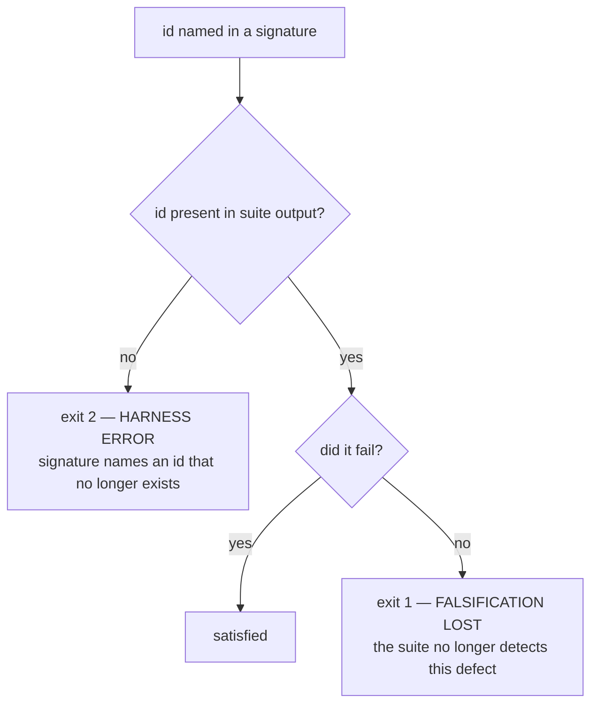

# falsify harness — defect signatures, stable case ids, and a vacuity ratchet

Planned session 29 (2026-08-08) on `main` @ `5fa766f`. Closes task 9 of
`docs/features/statusline-wrap-worktree.md`, which shipped as PR #43 while this harness was
broken — so the statusline script currently has 68 tests and no proof any of them can fail.

**Revision 2** after compliance round 1 (`fail`, 4 violations) and the observability architecting
read (`risk=medium`, `success_masking: fail`). Scope grew by explicit user decision, 2026-08-08:
the vacuity ratchet (§5) was added after the advisory judge measured that a third of the suite
passes against a script that produces no output.

**Location note.** `writing-specs` defers to `docs/superpowers/specs/`, but this repo's
`one-canonical-file` discipline (`rules/gates.md`) puts feature-scale work in a single
`docs/features/<name>.md`. The compliance judge examined and accepted this deviation in round 1.

## Background — why this exists

`statusline-command.falsify.py` is a test-of-tests. It runs the **current** suite against five
historical versions of `statusline-command.sh`, each carrying a known defect, and checks that the
suite still catches them. A green suite proves nothing on its own, because an assertion that
cannot fail passes for free.

That is not hypothetical here. Three of the four defects the observability judge found during
PR #43 were assertions that could not fail. The suite was green for all three. **This harness is
the only mechanism that catches that class directly, and it was broken throughout.**

### Defect 1 — pass counts go stale by design

`EXPECTED` maps each historical commit to an exact **pass count** (`falsify.py:44-57`). A count is
a fact about **how many tests exist**, not about the defect. The numbers were written at 20 cases;
the suite held 50 before PR #43 and 68 after. Measured against the 50-case suite:

| commit | want | actual | verdict |
|---|---|---|---|
| `f0902ed` | 9 | **8** | MISMATCH |
| `925c310` | 10 | **9** | MISMATCH |
| `29d6131` | 15 | 15 | ok |
| `4d63b09` | 20 | 20 | ok |
| `e882659` | 19 | 19 | ok |

Three versions were unaffected by 30 new tests, so every added case already failed on them. But
`f0902ed` and `925c310` each **lost exactly one pass**, which growth alone cannot cause. That is a
real unread signal, and §"Risk" binds how it is resolved.

### Defect 2 — a third of the suite is satisfied by silence

Measured by the architecting judge: against a stub script that produces no output, **23 of 68
assertions pass** — including *every* injection assertion, all four `$PWD fallback stripped`
cases, and `a control character in a path never reaches the output`. They are "count of bad byte
≤ limit" checks, and silence satisfies them.

These are the safety-critical tests. Neither the old harness nor revision 1 of this spec measured
this, which is why §5 exists.

## Design

### 1. Stable case ids — the identity contract

Revision 1 identified cases by the description string the suite prints. **That is
unimplementable**, and both judges caught it independently: the suite prints a *different* string
on pass than on fail.

```
ok   — all-control cwd falls through to a stripped $PWD (bel=0)
FAIL — all-control cwd leaked via the $PWD fallthrough (bel=3)
```

Measured on `29d6131`: **27 of 40** failing cases have a fail-name not derivable from any pass-name
— and that unmatchable set contains the actual defect signatures for `29d6131` and `e882659`.
Revision 1's single worked example came from `assert_no_injection`, the one family where the
description happens to be stable.

**Contract.** Every assertion carries a stable id, emitted on both outcomes:

```
ok   [pwd-fallthrough-stripped] — all-control cwd falls through to a stripped $PWD (bel=0)
FAIL [pwd-fallthrough-stripped] — all-control cwd leaked via the $PWD fallthrough (bel=3)
```

- Ids are kebab-case, unique within the suite, and **never reused** for a different assertion.
- The id is the identity; the trailing prose stays free-form and may change without consequence.
- `ok()` and `bad()` take the id as their first argument, so a call site cannot emit one without it.
- The harness parses `^(ok|FAIL)\s+\[([a-z0-9-]+)\]` and ignores everything after.

This is the API contract the compliance judge required. It is the only change this feature makes
to `statusline-command.test.sh` beyond §5's ratchet list.

### 2. Signatures replace counts

```python
EXPECTED = {
    "f0902ed": {
        "label": "original: printf '%b', no stripping",
        "must_fail": ["esc-literal-inert", "esc-real-stripped"],
    },
}
```

Every named id **must fail** on that version. Other cases may fail freely — that is what adding
tests does, and allowing it is what stops the treadmill.

Stated cost: the harness no longer notices a version failing *more* than expected. That is the
right trade, because "fails more on an old buggy version" is the normal consequence of writing
better tests, and treating it as an error is exactly what broke this harness.

### 3. An empty signature is a hard error

`4d63b09` fails nothing today (`falsify.py:54` scores it 20/20), so its `must_fail` would be empty
— and an empty list is satisfied by **any** input: the right blob, the wrong blob, a truncated
file, a stub. One of five versions would become decoration while the harness printed success.

**A version whose `must_fail` is empty is a hard error, not a pass.** Resolving `4d63b09`
specifically is task 4, which forces one of two explicit outcomes, both recorded in the file:

- an assertion is added that does catch its defect, and becomes its signature; or
- it is removed from `EXPECTED` with a written rationale that its flaw is genuinely undetectable
  by any assertion at this layer.

Silently keeping it with an empty signature is neither.

### 4. Three states, three exit codes



| exit | meaning |
|---|---|
| `0` | falsification intact — every signature satisfied, ratchet holding |
| `1` | the suite lost detection power, or the working-tree floor failed, or the ratchet grew |
| `2` | harness error — missing id, empty signature, or a blob that is not the script |

An `ERROR` must never exit `0`. The current file returns a binary `0`/`1` (`falsify.py:120-121`),
so a third outcome added without its own code would read as green to whatever runs it.

### 5. The vacuity ratchet

The harness additionally runs the suite against a **stub**: a script that is executable, exits
`0`, and writes nothing to stdout. It records **by id** which assertions still pass.

```python
# Assertions satisfied by a script that produces no output. This list may only
# ever SHRINK. Each entry is a test that cannot fail for the reason it claims.
KNOWN_VACUOUS = ["esc-literal-inert", "pwd-fallthrough-stripped", ...]
```

- **Assertion:** the set passing against the stub must be a **subset** of `KNOWN_VACUOUS`.
- Shrinking is always allowed and needs no edit — fixing a test just works.
- Growing fails the harness, so a newly-written vacuous assertion is caught the first time it runs.
- Adding an id to `KNOWN_VACUOUS` requires a deliberate edit, which is visible in review.

This is a ratchet, not a count: it cannot go stale as the suite grows, which is the failure this
whole feature exists to end. It starts at the measured 23 and is expected to fall. **Driving it to
zero is explicitly not this feature's job** — those are 23 separate assertion rewrites, and mixing
them in would mean neither half got reviewed properly. This feature makes them visible and stops
new ones.

### 6. The working-tree floor is preserved

`falsify.py:99-107` asserts the working tree passes **all** cases before any historical version is
scored. That is a count check, but not a version-relative one — it means "the suite is green right
now", without which every downstream comparison is meaningless. It stays, unchanged, and failing it
exits `1`.

### 7. Signatures are reasoned before they are run

For each commit, in this order: read what it got wrong → write down which ids *should* catch it →
run → compare. Agreement is evidence; disagreement is a finding either way, and is recorded.

Deriving signatures from observed output would fit the assertion to reality — the failure mode that
produced three of four defects in PR #43. A test describing what happened can never disagree with
what happens.

### 8. It runs at PR time

Documented in the harness docstring and referenced from the script header, alongside the
observability judge. **Residual risk, stated not hidden:** this is a human remembering, the
mechanism that already failed. A commit hook on the two files that can invalidate it would cost
~50s about 21 times per quarter and could not rot. Deferred by user decision (2026-08-08); revisit
if it rots again.

## Scenarios

```gherkin
Feature: falsification survives a growing suite

  Scenario: adding an unrelated test does not break the harness
    Given every version's signature is satisfied
    When a test is added whose id no signature names
    And that test is not vacuous against the stub
    Then the harness exits 0

  Scenario: a test that stops detecting its defect fails the harness
    Given "esc-real-stripped" is in f0902ed's signature
    When that assertion is weakened so it passes against f0902ed
    Then the harness exits 1
    And names both the id and the version

  Scenario: a signature naming a removed id is a harness error
    Given a signature names "esc-real-stripped"
    When that assertion is deleted or its id changed
    Then the harness exits 2
    And does not report falsification intact

  Scenario: failing more than the signature is not an error
    Given f0902ed's signature names two ids
    When six other cases also fail on f0902ed
    Then the harness exits 0

  Scenario: an empty signature is rejected
    Given a version's must_fail list is empty
    Then the harness exits 2

Feature: vacuity ratchet

  Scenario: a newly vacuous assertion is caught
    Given KNOWN_VACUOUS holds the currently-vacuous ids
    When a new assertion is added that passes against the stub
    Then the harness exits 1
    And names the new id

  Scenario: fixing a vacuous assertion needs no harness edit
    Given "esc-literal-inert" is in KNOWN_VACUOUS
    When it is rewritten so it fails against the stub
    Then the harness exits 0
    And KNOWN_VACUOUS is not edited

Feature: extraction safety

  Scenario: a blob that is not the script is refused
    Given a historical blob is extracted for a commit
    When the content does not begin with "#!"
    Then the harness exits 2
```

The last scenario preserves existing behaviour and its reason: the `rtk` proxy rewrites
`git show <sha>:<path>` issued from the Bash tool to return the commit object rather than the file
blob, which once made the harness score identical non-script text five times while appearing to
work. Extraction stays in Python; the `#!` check stays.

## Toolchain — pinned

| tool | version | note |
|---|---|---|
| `python3` | 3.9.6 | macOS system Python; stdlib only |
| `bash` | 3.2.57 | runs the suite under test |
| `git` | 2.50.1 | blob extraction, invoked from Python, never via the Bash tool |

No new dependencies. `re`, `subprocess`, `sys`, `tempfile`, `pathlib` — all already imported.

## Non-goals

- **Fixing the 23 vacuous assertions.** Measured and ratcheted here, rewritten elsewhere.
- No generalising the harness to other suites. One consumer, YAGNI.
- No change to the five historical commits.
- No commit hook (§8).
- No change to what any non-vacuous assertion asserts; ids are additive.

## Risk

**Reasoning first may show a label is wrong.** The file already disagrees with itself: `f0902ed` is
labelled as passing 9 and passes 8. If §7 shows a label misdescribes its commit, that is surfaced
as a finding and corrected **with evidence** — never re-baselined to whatever the run produced.
Re-baselining turns a falsification harness into a rubber stamp, which is the thing this document
exists to prevent.

**Adding ids touches every assertion site.** ~68 mechanical edits to `statusline-command.test.sh`.
The risk is a typo silently renaming a case; §4's exit-2 path is what catches it, because every
signature id must resolve.

## Tasks

- [ ] 1. Add stable ids to every assertion in `statusline-command.test.sh`; `ok()`/`bad()` take the
      id as their first argument so a call site cannot omit one.
- [ ] 2. Verify ids are unique and that the suite still reports 68/68.
- [ ] 3. Reason out all five signatures from the commits alone; record predictions **before**
      running. Then run, compare, and record every disagreement as a finding.
- [ ] 4. Resolve `4d63b09`'s empty signature — add a detecting assertion, or remove the version
      with written rationale. No third option.
- [ ] 5. Resolve any label disagreement from task 3 with evidence. Never re-baseline.
- [ ] 6. Rewrite `EXPECTED` to the signature shape; implement the three-state check and the three
      exit codes; preserve the working-tree floor.
- [ ] 7. Implement the vacuity ratchet against a no-output stub; seed `KNOWN_VACUOUS` from measurement.
- [ ] 8. Prove the harness can fail, one falsifier per path: weaken a named assertion (expect 1),
      rename an id (expect 2), empty a signature (expect 2), add a vacuous assertion (expect 1).
- [ ] 9. Confirm the treadmill is gone: add a throwaway non-vacuous passing test, confirm exit 0
      with no harness edit.
- [ ] 10. Document the PR-time run in the docstring and the script header.
- [ ] 11. Compliance + observability judges, then PR.
