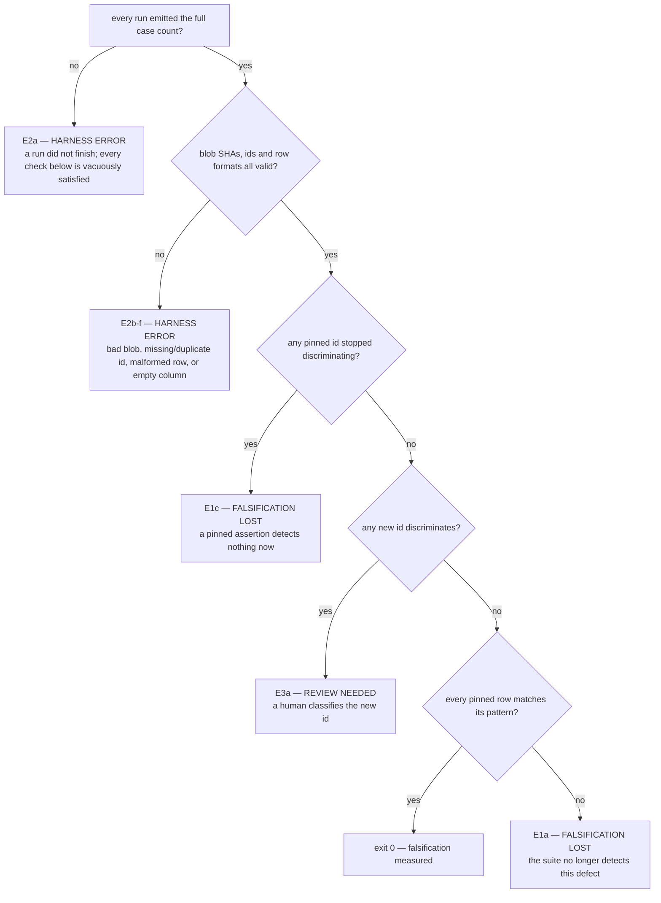

# falsify harness — defect signatures, stable case ids, and a vacuity ratchet

Planned session 29 (2026-08-08) on `main` @ `5fa766f`. Closes task 9 of
`docs/features/statusline-wrap-worktree.md`, which shipped as PR #43 while this harness was
broken — so the statusline script currently has 68 tests and no proof any of them can fail.

**Revision 4** (2026-08-09), after an independent re-measurement of the whole suite. It replaces
per-version `must_fail`/`must_pass` lists with a single **flip matrix** (§2) — the pass/fail state
of every discriminating assertion across every version. `must_pass` is gone: the matrix pins passes
as well as failures, so it anchors itself. Two user decisions, 2026-08-09: adopt the matrix, and
**report rather than fix** the vacuous assertions (§6b) — 13 of the 15 load-bearing assertions are
vacuous, and strengthening them means editing the suite this harness exists to measure, so it
becomes its own follow-up.

**Revision 3** after compliance rounds 1-2 (`fail`/`fail`) and two observability architecting reads
(both `risk=medium`). Scope grew by explicit user decision, 2026-08-08: the vacuity ratchet was
added after the advisory judge measured that a third of the suite passes against a script that
produces no output. Revision 3 added per-iteration ids (§1), `must_pass` anchors, a second stub and
the overlap rule, and stated real coverage (§9). Sections below marked *superseded* record what it
measured; revision 4 keeps the measurements and replaces the design built on them.

**Location note.** `writing-specs` defers to `docs/superpowers/specs/`, but this repo's
`one-canonical-file` discipline (`rules/gates.md`) puts feature-scale work in a single
`docs/features/<name>.md`. The compliance judge examined and accepted this deviation in round 1.

## Background — why this exists

`statusline-command.falsify.py` is a test-of-tests. It runs the **current** suite against five
historical versions of `statusline-command.sh`, each carrying a known defect, and checks that the
suite still catches them. A green suite proves nothing on its own, because an assertion that
cannot fail passes for free.

That is not hypothetical here. Three of the four defects the observability judge found during
PR #43 were assertions that could not fail. The suite was green for all three. **This harness is
the only mechanism that catches that class directly, and it was broken throughout.**

### Defect 1 — pass counts go stale by design

The stale counts live in **two** places, and both must go in the same change. `EXPECTED` maps each
historical commit to an exact **pass count** (`falsify.py:44-57`) — and the module docstring
(`falsify.py:8-18`) repeats all five in their original `n/20` form under the heading "Expected, and
asserted below", closing with *"These are the single source of truth alongside EXPECTED below; if
the two ever disagree, EXPECTED is what runs."* Those five lines are already wrong (the suite holds
68 cases, not 20) and they declare themselves authoritative. A build that rewrites only `EXPECTED`
leaves a file whose purpose is to delete stale counts still asserting five of them in its own
docstring. Task 5 deletes the block; §9's docstring edit is additive and does not cover it.

A count is
a fact about **how many tests exist**, not about the defect. The numbers were written at 20 cases;
the suite held 50 before PR #43 and 68 after. Measured against the 50-case suite:

| commit | want | actual | verdict |
|---|---|---|---|
| `f0902ed` | 9 | **8** | MISMATCH |
| `925c310` | 10 | **9** | MISMATCH |
| `29d6131` | 15 | 15 | ok |
| `4d63b09` | 20 | 20 | ok |
| `e882659` | 19 | 19 | ok |

Three versions were unaffected by 30 new tests, so every added case already failed on them.

**The `f0902ed`/`925c310` discrepancy is resolved, not open.** Revision 1 called it "a real unread
signal" that "growth alone cannot cause". That was wrong, and the round-1 architecting judge
disproved it: against the era-appropriate 20-case suites the recorded counts reproduce `EXPECTED`
**exactly** (9/10/15/20/19), so the counts were correct when written and the harness was broken *by*
growth rather than born broken. The flip is three token-bar baseline assertions tightened when the
context bar landed, benign; "lost exactly one pass" was a **net** figure masking 3 losses against 2
gains. No label is wrong and no test is broken. It is recorded here so tasks 3 and 5 do not
re-investigate a settled question.

### Defect 2 — a third of the suite is satisfied by silence

Measured by the architecting judge and re-confirmed 2026-08-09: against a stub script that
produces no output, **24 of 68 assertions pass** (23 without its `exit 0` — see §6) — including
*every* injection assertion, all four `$PWD fallback stripped` cases, and `a control character in a
path never reaches the output`. They are "count of bad byte
≤ limit" checks, and silence satisfies them.

These are the safety-critical tests. Neither the old harness nor revision 1 of this spec measured
this, which is why §6 exists.

## Measured against the real suite (2026-08-08)

Revisions 1-3 were reasoned from a mental model of the suite rather than the suite, and the
round-3 advisory caught three artifacts that do not exist in it. Everything below is measured
first-hand, reproducibly: copy `statusline-command.test.sh` and a candidate script into a temp
directory, run the suite, and match results by **ordinal** — every run emits exactly 68 results in
a stable order, which is what makes cross-run comparison valid before ids exist. Ordinal matching
has two traps that invalidate the naive version of it; see *How to reproduce any number above*,
below, before re-running any of this.

### Baselines

| run | passes /68 |
|---|---|
| working tree | 68 |
| silent stub, `#!/bin/bash` + `exit 0` | **24** |
| silent stub, `#!/bin/bash` only | **23** |
| one-line stub, `printf 'x'` + `exit 0` | **31** |
| one-line stub, `printf 'x'` only | **30** |
| `f0902ed` | **19** |
| `925c310` | **20** |
| `29d6131` | 28 |
| `4d63b09` | 33 |
| `e882659` | 32 |

**Vacuous against either stub: 31 of 68**, not the 24 revision 2 quoted. The 23-vs-24 and 30-vs-31
pairs are the same effect — a redundant `exit 0` changes the result — which is why §6 must pin stub
**bytes**, not prose.

**`f0902ed` (19) and `925c310` (20) pass fewer assertions than a script that does nothing (24).**
They are already failing wholesale, which is precisely what revision 3's `must_pass` was added to
detect — and could not, which is part of why revision 4 dropped it.

### `must_pass` is a liveness check, not a defect anchor *(superseded by §2)*

The pool of assertions that pass on a version *and* fail against both stubs is **3 for `f0902ed`
and `925c310`, 5 for the others, and the same 3 across all five**:

- `git repo -> git segment names the branch`
- `uncommitted changes -> dirty marker`
- `an over-wide segment survives intact on its own line`

Those say "this is still a working script", not "this version failed for its own defect". Revision
3 required §3 to claim only that; revision 4 removed `must_pass` altogether, because the flip matrix
pins each version's passing entries directly and needs no separate liveness list.

### Non-vacuity is not sufficient — signatures must be DIFFERENTIAL

The strongest-looking candidates ("fails here and is not vacuous") are **identical across all five
versions** — `baseline renders model and context-bar segments`, `sub-1000 tokens render raw`, and
so on. They fail everywhere because every historical script predates the token bar. A signature
drawn from them is satisfied by every version and proves nothing about any defect.

The only shape that proves an assertion detects *that* defect is **differential**: it flips across
the transition where the defect appears or disappears.

| transition | fix-direction | of which non-vacuous | regression-direction |
|---|---|---|---|
| `f0902ed` → `925c310` (route-1 fix) | **1** | **0** | 0 |
| `925c310` → `29d6131` (route-2 fix) | 9 | **2** | 1 |
| `29d6131` → `4d63b09` ($PWD ordering) | 5 | **0** | 0 |
| `4d63b09` → `e882659` (regression) | **0** | **0** | **1** |

The two non-vacuous ones are `surrounding text survives stripping` and `path with a stripped
newline is joined, not truncated`.

#### Correction — direction is not uniform along the chain

Re-measured independently 2026-08-09; the first three rows reproduce exactly. The fourth row read
`1` because it was computed in the opposite direction from the other three. `e882659` is a
**regression**: nothing was fixed there, so "fails on the version, passes on the version that fixed
it" yields the **empty set** for it.

This mattered because revision 3's §4 made an empty signature a hard error: a harness defining
signatures fix-direction-only would have hard-errored on `e882659` for being a regression. **The
relation is transition-typed** — a fix's evidence is `fails on A, passes on B`, a regression's is
`passes on A, fails on B`. Revision 4 resolves this by not encoding a direction at all: §2's matrix
records each id's state per version, and `P P . P .` is the history regardless of which way any
individual transition ran.

#### The chain has only 15 discriminating assertions, and one carries three defects

Measured over all 68 × 5. **53 of 68 assertions never change state across any version** — they pass
everywhere or fail everywhere, and carry zero information about any of these defects. The
discriminating set is 15, of which 13 are vacuous. Pattern is `P` = passes, `.` = fails, in chain
order:

| id | f09 925 291 4d6 e88 | vacuous | assertion |
|---|---|---|---|
| 37 | `.  P  P  P  P` | yes | `literal \x1b in display_name stays inert` |
| 38-42, 66, 67 | `.  .  P  P  P` | yes | the route-2 strip family (7 ids) |
| 43-46 | `.  .  .  P  P` | yes | `$PWD fallback stripped for stdin …` (4 ids) |
| **47** | **`P  P  .  P  .`** | yes | `all-control cwd falls through to a stripped $PWD` |
| 48, 49 | `.  .  P  P  P` | **no** | `surrounding text survives stripping`, `path with a stripped newline is joined` |

**Id 47 is the only assertion in the suite that flips more than once.** It alone tracks the
$PWD-fallback defect through its whole history — clean at `f0902ed`/`925c310` (no stripping, so the
cwd never empties), broken at `29d6131` (strip-then-fallback), fixed at `4d63b09`, broken again at
`e882659` (second fallback below the strip). It is also vacuous: a script that prints nothing
passes it.

### The finding that reframes this feature *(answered by §2 and §Non-goals — no longer open)*

**For three of the four transitions, every discriminating assertion is vacuous.** The suite's
ability to prove those three defects detectable rests entirely on assertions that a no-output
script also satisfies. Vacuity is not a side problem to ratchet alongside the signatures — it sits
directly on top of the falsification evidence.

This invalidated revision 3's framing of §6 as secondary, and its worked examples throughout.

**Both questions this section left open are now answered, and nothing here is live scope.**
Signatures did become differential by definition — §2's matrix is differential by construction.
And "fix the vacuous assertions" remains a non-goal by dated user decision (§Non-goals), with §6b's
printout and task 10 as the mechanisms that keep it visible rather than forgotten. The measurements
above stand; the open questions do not.

### How to reproduce any number above

Copy the suite and a candidate script into a temp directory, run `bash statusline-command.test.sh`,
and parse `ok   — ` / `FAIL — ` lines in emission order. **Two traps**, both hit while measuring:

1. **A failing case prints a diagnostic, not its name** — ordinal 0 prints `baseline renders model
   and context-bar segments` when it passes and `baseline segments missing: …` when it fails.
2. **A passing description embeds measured values** — `literal \x1b in display_name stays inert
   (esc=10<=10 …)` on the working tree, `(esc=0<=0 …)` against a stub.

So descriptions cannot be compared across runs without stripping the trailing parenthetical, and
alignment cannot be checked on failing ordinals at all. The valid proof of alignment — which all
ten runs pass — is: every run emits exactly 68 results, **and** every *passing* ordinal's
normalized description equals the working tree's at that ordinal. This is a third independent
reason §1's stable ids are needed, alongside "descriptions get edited".

## Design


### 1. Stable case ids — the identity contract

Revision 1 identified cases by the description string the suite prints. **That is
unimplementable**, and both judges caught it independently: the suite prints a *different* string
on pass than on fail.

```
ok   — all-control cwd falls through to a stripped $PWD (bel=0)
FAIL — all-control cwd leaked via the $PWD fallthrough (bel=3)
```

Measured on `29d6131`: **27 of 40** failing cases have a fail-name not derivable from any pass-name
— and that unmatchable set contains the actual defect signatures for `29d6131` and `e882659`.
Revision 1's single worked example came from `assert_no_injection`, the one family where the
description happens to be stable.

**Contract.** Every assertion carries a stable id, emitted on both outcomes:

```
ok   [pwd-fallthrough-stripped] — all-control cwd falls through to a stripped $PWD (bel=0)
FAIL [pwd-fallthrough-stripped] — all-control cwd leaked via the $PWD fallthrough (bel=3)
```

- Ids are kebab-case, unique within the suite, and **never reused** for a different assertion.
- The id is the identity; the trailing prose stays free-form and may change without consequence.
- `ok()` and `bad()` take the id as their first argument, so a call site cannot emit one without it.
- The harness parses `^(ok|FAIL)\s+\[([a-z0-9-]+)\]` and ignores everything after.

**Loop-generated assertions.** Eleven of the assertions are emitted from inside `for` loops
(`statusline-command.test.sh:524-535, 606-617, 710-717`), so one call site yields three or four
results. Passing a single id would give them all the same id, breaking uniqueness and — worse —
leaving the ratchet unable to say *which* of the four `$PWD fallback` safety cases was fixed. The
loop values (`{}`, `garbage`, `{"cwd":null}`, `0`, the empty string, `abc`, `-1`) cannot be ids:
they do not match `[a-z0-9-]+`.

**Rule:** a loop iterates over explicit `id-suffix:value` pairs, and the id is
`<family>-<suffix>`. Suffixes are authored, never derived from the value and never positional, so
reordering or adding a case cannot silently rename an existing one.

```bash
for case in "empty-object:{}" "garbage:garbage" "null-cwd:{\"cwd\":null}" "empty-workspace:{\"workspace\":{}}"; do
  id="pwd-fallback-${case%%:*}"; payload="${case#*:}"
```

**Duplicate ids are a harness error (`E2c`).** If the same id is emitted twice in one run, the
harness cannot attribute a result and must not guess. This is the check that catches the most
likely authoring mistake — see §Risk.

This is the API contract the compliance judge required. With §6's ratchet lists, these are the only
changes this feature makes to `statusline-command.test.sh`.

### 2. The flip matrix replaces counts *and* per-version lists

**Decided 2026-08-09.** Revisions 1-3 pinned per-version `must_fail`/`must_pass` lists. Revision 4
replaces both with a single artifact: the pass/fail state of every **discriminating** assertion
across every version.

An assertion is *discriminating* if its state is not constant across the five versions. Measured,
the suite partitions exactly:

| class | count | vacuous |
|---|---|---|
| discriminating (state changes somewhere on the chain) | **15** | 13 |
| constant-pass on all five | 18 | 15 |
| constant-fail on all five | 35 | 3 |
| | **68** | |

Only the 15 carry information about any of these defects. The other 53 are pinned by nothing and
need to be pinned by nothing — 35 of them fail on every historical version because the feature did
not exist yet (the era noise revision 3's §3 used to chase), and 18 pass on every version because
no defect here
touches them.

```python
# Chain order, oldest first. This tuple defines column order everywhere.
VERSIONS = ("f0902ed", "925c310", "29d6131", "4d63b09", "e882659")

# Each historical script is pinned by BLOB sha, not by commit. Extraction that
# returns anything else -- including the commit object, the documented rtk-proxy
# failure -- is E2f, not a silently different comparison.
BLOB_SHA = {
    "f0902ed": "ce85493054775cb7917fc71b95d14792d80d4213",   # 2845 bytes
    "925c310": "d28a0895dddb4fdae81853c21766f4fda213d1e8",   # 3310
    "29d6131": "e30dcd0a9d872fe9fdbc978584174de785739df4",   # 4520
    "4d63b09": "b5a071634f48e21abf206df89dfe6f0002b8a65d",   # 4811
    "e882659": "4b6be5a94eb016ed925b603093ee56e877f89664",   # 5407
}

# id -> state on each version, in VERSIONS order.
#   Adding a test to the suite does NOT belong here unless it discriminates.
FLIP_MATRIX = {
    #                      f09 925 291 4d6 e88
    "esc-literal-inert":  ".  P   P   P   P",
    "esc-real-stripped":  ".  .   P   P   P",
    "pwd-fallthrough":    "P  P   .   P   .",   # the only id that flips twice
    ...
}
```

**Row format — a contract, not an example.** A row value is parsed by discarding all whitespace and
reading the remainder as one state per version:

| property | rule | violation |
|---|---|---|
| alphabet | exactly `P` (passes) and `.` (fails); nothing else, no case folding | `E2d` |
| width | exactly `len(VERSIONS)` states after whitespace is stripped | `E2d` |
| key | present in the suite's output, unique there **and** unique as a `FLIP_MATRIX` key | `E2b`, `E2c` |
| whitespace | free, and carries no meaning — it is column alignment only | — |

The width check is the load-bearing one: a row typed with four states instead of five shifts every
subsequent version's expectation by one, and without this rule it surfaces as `E1a`
`FALSIFICATION LOST` — a wrong answer with a confident label — rather than the `E2d` §5's
precedence demands.

**A duplicated `FLIP_MATRIX` key is `E2c`, not a silent overwrite.** A Python dict literal keeps
the last of two identical keys without complaint, so the file would say one thing and the harness
compare another — Defect 1 one level up. The matrix must therefore be parsed from a sequence of
pairs, not built as a literal dict, so the duplicate is visible.

**The full case count is derived, never a literal.** It is `len(working_tree_results)` from the
floor run (§7). Writing `68` into the harness would re-introduce Defect 1 one level up: a number
that is a fact about suite size, going stale on the next added test.

**But the floor run cannot validate itself.** Round 5 cited this as
`writing-specs/derived-count-self-reference`: the working-tree run is one of the runs `E2a` checks
against the count, so it is compared to its own length and that comparison can never fail. Nor does
the suite's own tally help — its denominator is `pass + fail` (`statusline-command.test.sh:844`),
also self-derived, so a run truncated at 30 all-passing cases prints `30/30 passed` and looks
perfect. Left there, a truncated floor run would set the count to 30, satisfy the all-pass floor,
let all five version runs clear `E2a`, and exit `0`.

The count is therefore only adopted from a floor run that satisfies **three signals independent of
its own length**, all `E2a` otherwise:

| signal | what a truncated run does |
|---|---|
| the suite printed its terminating tally line | absent — the suite died before reaching it |
| the tally's `pass + fail` equals the parsed result count | catches a suite that prints a tally it did not earn |
| the suite process exited `0` | a killed suite carries a signal status |

Measured: `kill -SEGV $$` inside the script under test kills the **suite** (bash expands `$$` to the
original shell in a subshell), which is why round 4's crash produced 30 of 68 — and no tally line.

**Why this shape.** Three properties fall out of it that the list shape had to bolt on:

1. **Differential by construction.** A row *is* a defect's history. Nothing has to declare that a
   signature "fails here and passes on the successor" — the row says it.
2. **Direction-free.** The regression at `e882659` needed a special case under the list shape
   (§Correction, above). Here `pwd-fallthrough`'s `P P . P .` simply records clean/clean/broken/
   fixed/broken. There is no direction to get backwards.
3. **Self-anchoring, so `must_pass` is unnecessary.** The matrix pins passes as well as failures,
   so a version that collapses wholesale mismatches its own `P` entries. The old §3 existed only
   because the list shape pinned failures alone.

**Stated honestly:** for `f0902ed` the self-anchor is thin. Its column is `1/15 P` — one passing
discriminating assertion, `pwd-fallthrough`, and that one is vacuous. Per-version P counts are
`1, 2, 10, 15, 14`.

**What catches a wholesale collapse there is the matrix itself** — no separate guard. Measured
against the silent stub:

```
emitted 68, passes 24            -> E2a does not fire; the count is unchanged by total failure
13 of 15 pinned ids PASS         -> E2e does not fire; the column is never empty
12 of 15 rows mismatch f0902ed   -> E1a fires
```

This sentence has now been wrong twice — revision 4 credited the full-count assertion, and the
round-4 correction credited the empty-column guard. Both were reasoned rather than measured, and
round 5 caught the second. It is stated here as three measurements and no attribution, because the
attribution is what kept failing. `E2e` remains in §5 as a guard against a case not present today,
not as the mechanism for this one.

### 3. The matrix is closed — an unpinned flip is an error

The list shape stopped the treadmill by allowing extra failures. The matrix stops it by scope: a
new test only enters the matrix if it discriminates. But "extra failures allowed" also meant the
harness stopped noticing anything it had not been told about, which is how it went stale unread.

The matrix is therefore **closed under discrimination**. The harness computes the full 68 × 5
result set on every run — it already executes all of it — and asserts both directions:

- every pinned row matches its recorded pattern exactly (`E1a`); **and**
- the discriminating set is *exactly* the pinned set — and the two directions differ in severity:
  a new id that discriminates is `E3a`, a pinned id that stopped discriminating is `E1c` (§5).

An assertion that starts or stops discriminating is a real change in what the suite can prove, and
it now cannot enter the pinned set without a reviewed edit. **That is narrower than "impossible to
introduce silently"**, which revision 4 claimed and round 4's exploit disproves: the closure check
governs *which ids* discriminate, not *how much margin* each one has, so an assertion can be
hollowed out while its row still matches (§Non-goals). Adding a discriminating test costs one
reviewed line;
adding a non-discriminating test costs nothing. That is the treadmill gone at the root — the old
harness demanded an edit for *every* added test, including the 53 that prove nothing.

### 4. Two hard errors that a subset check cannot catch

**A column with no `P`.** A version passing none of the 15 is failing wholesale, and every `.` in
its column is satisfied for the wrong reason. No column is empty today (`1, 2, 10, 15, 14`), so
this is a guard, not a live defect.

**A run that did not finish.** Every check here is satisfied by a run that died early: the ids that
did emit match, and the ones that would have contradicted the matrix never ran. The harness
therefore asserts every run — working tree, all five versions, **and** both stubs — emitted
**exactly** the full case count (`E2a`).

**"Exactly", not "at least".** Revision 4 said *fewer than*, which does not fire on a run that
emits **more** — round 5 produced 102 lines from a forged script whose output impersonates result
lines. Equality catches both truncation and forgery; an inequality catches one. Revision 3 applied this to stub runs only; the reasoning
it gave ("a subset check is satisfied by the empty set") applies identically to a version run, and
it is free.

Note that `4d63b09` is no longer a special case. Under the list shape its `must_fail` was empty and
§4 of revision 3 made that a hard error requiring task 4 to resolve. Under the matrix it is simply
the column that is `15/15 P` — the version that fixed everything the suite can discriminate and
regressed nothing. That is a fact worth pinning, not an error.

### 5. Four outcomes, four exit codes

This table is the **single enumeration** of every exit path. The flowchart below, task 5's
implementation list and task 7's falsifier list are all derived from it; if any of them disagrees
with this table, this table is what is built. (Round 4 cited the spec for enumerating its own exits
four incompatible ways — `writing-specs/exit-path-enumeration`.)

| id | exit | name | condition |
|---|---|---|---|
| `E1a` | `1` | FALSIFICATION LOST | a pinned row no longer matches its recorded pattern |
| `E1b` | `1` | FALSIFICATION LOST | the working-tree floor failed (§7) |
| `E1c` | `1` | FALSIFICATION LOST | a vacuity list grew, **or** a pinned id stopped discriminating |
| `E2a` | `2` | HARNESS ERROR | a run emitted other than the full case count |
| `E2b` | `2` | HARNESS ERROR | the matrix names an id the suite does not emit |
| `E2c` | `2` | HARNESS ERROR | an id is emitted twice in one run (§1), or a key is duplicated in `FLIP_MATRIX` |
| `E2d` | `2` | HARNESS ERROR | a malformed matrix row — bad alphabet or wrong width (§2) |
| `E2e` | `2` | HARNESS ERROR | a column with no `P` |
| `E2f` | `2` | HARNESS ERROR | an extracted blob whose SHA is not its pinned SHA (§2), or any uncaught exception |
| `E3a` | `3` | REVIEW NEEDED | a **new** id discriminates that the matrix does not pin |
| — | `0` | falsification measured | none of the above |

**These ids are the reference.** Every other mention of an exit path in this spec — §1, §2, §3,
§6, the Scenarios block and the task list — cites an id from this column and **never restates the
number**. Round 4 cited `writing-specs/exit-path-enumeration` because the spec enumerated its exits
four incompatible ways; round 5 cited it *again* because the table was fixed and three sites
quoting it were not. Syncing seven copies failed twice. There is now one copy and a set of labels
pointing at it.

**`E1c` and `E3a` split the closure check by direction**, and the direction decides the severity:

- `discriminating - pinned` — something new discriminates. Benign, expected on roughly one added
  test in five, a human classifies it: **`E3a`, exit 3**.
- `pinned - discriminating` — something pinned **stopped** discriminating. That is detection loss,
  the thing this harness exists to catch: **`E1c`, exit 1**.

Revision 4 filed both under one exit-3 condition. Round 5 measured the consequence: hollow out ord
66 and its row goes `. . P P P` → `P P P P P`, an assertion that now detects *nothing*, reported
under the calmest label in the table. The asymmetry is not cosmetic.

**Eleven conditions: three exit-1, six exit-2, one exit-3, one exit-0.** `REVIEW NEEDED` keeps its
own code because it is not an error — the harness ran correctly and found a legitimate change a
human must classify; collapsing it into `2` would make "someone added a discriminating test" and
"the extraction is broken" indistinguishable to CI. What it must **not** absorb is `E1c`.



An `ERROR` must never exit `0`. The current file returns a binary `0`/`1` (`falsify.py:120-121`),
so a third outcome added without its own code would read as green to whatever runs it.

**`raise SystemExit("<message>")` exits `1`, not `2`.** Both existing error paths use it —
`falsify.py:82` (suite produced no tally) and `falsify.py:68-72` (blob is not a script) — so every
harness error today is indistinguishable from a falsification loss. Exit `2` must be raised as
`SystemExit(2)` with the message printed to `stderr` separately; a bare string argument is the
message, and Python then uses status `1`. Every exit-2 path in this section inherits that
requirement.

**An uncaught exception must not exit `1` either.** `main()` is wrapped so any unhandled exception
becomes `E2f` — a crashed harness is a harness error, and Python's default for an uncaught
exception is status `1`, which reads as FALSIFICATION LOST.

**Precedence, when a run trips more than one condition:** `2` beats `1` beats `3` beats `0`. A
run that did not finish (`E2a`) is reported even if a row also mismatches, because the comparison
was not actually performed. **`1` beats `3`** — detection loss outranks a benign new id; revision 4
had `3` beating `1`, which is what filed the hollowed-out ord 66 under REVIEW NEEDED.

### 6. The vacuity ratchet

The harness additionally runs the suite against a **stub**: a script that is executable, exits
`0`, and writes nothing to stdout. It records **by id** which assertions still pass.

```python
# Assertions satisfied by a script that produces no output. Each list may only
# ever SHRINK. Every entry is a test that cannot fail for the reason it claims.
#   One list per stub -- both are named, neither is "the" vacuity list.
VACUOUS_AGAINST_SILENT   = ["esc-literal-inert", "pwd-fallthrough-stripped", ...]   # seeded at 24
VACUOUS_AGAINST_ONE_LINE = [...]                                                    # seeded at 31
```

- **Assertion:** the set passing against a stub must be a **subset** of that stub's list.
- Shrinking is always allowed and needs no edit — fixing a test just works.
- Growing fails the harness (`E1c`), so a newly-written vacuous assertion is caught first run.
- **Every listed id must still be emitted by the suite** (`listed ⊆ emitted`, else `E2b`). Without
  it, an id can be retired from the suite, silently leave the ratchet, and be reused later by a new
  vacuous assertion that the list already blesses.
- Adding an id requires a deliberate edit, which is visible in review.

**Two stubs, not one.** Silence is the weakest possible broken script. Measured: a stub printing a
single harmless line passes **31** of 68 — seven more than the silent stub, and those seven are
"output exists" / "output is one line" assertions, the flimsiest shape in the suite. A silence-only
ratchet would bless them forever. Both stubs are run, each with its own list:

**Prose does not pin bytes.** Revision 3 defined the stubs in a sentence and quoted 24 and 30. Both
sentences admit two scripts that differ by one assertion: a redundant `exit 0` moves the silent stub
between **23** and **24**, and the one-line stub between **30** and **31**. Same species as the
23-vs-24 wobble revision 3 went and reconciled, one layer down. The harness therefore constructs
each stub from these literal bytes, and the spec carries them:

```bash
# STUB_SILENT -> 24 of 68 pass
#!/bin/bash
exit 0
```

```bash
# STUB_ONE_LINE -> 31 of 68 pass
#!/bin/bash
cat >/dev/null 2>&1
printf 'statusline\n'
exit 0
```

**Union of the two: 31 of 68 vacuous**, re-measured 2026-08-09 and stable across repeats. Revision 2
quoted 24 for the union, which was the silent stub alone.

Seeding these two lists from measurement is correct, and is the one place in this feature where it
is — §Risk's "never re-baseline" governs the **matrix**, which encodes a belief about a defect. A
vacuity list encodes no belief; it is a starting position for a ratchet whose only permitted
direction is down.

### 6b. The harness reports what its evidence rests on

**Decided 2026-08-09: report, do not fix.** 13 of the 15 discriminating assertions are vacuous, and
per transition the evidence is:

A transition's signature is **every id that flips across it, in either direction** — the same
correction §"Correction — direction is not uniform" makes for the differential table. Row 2 is the
one place both directions are non-empty:

| transition | kind | signature | resting on vacuous evidence |
|---|---|---|---|
| `f0902ed` → `925c310` | fix | 1 | **1/1** |
| `925c310` → `29d6131` | fix 9 + regression 1 | **10** | 8/10 |
| `29d6131` → `4d63b09` | fix | 5 | **5/5** |
| `4d63b09` → `e882659` | regression | 1 | **1/1** |

The tenth id on row 2 is `pwd-fallthrough` (ord 47), which *regresses* at `29d6131` while nine
others are fixed there — the same id that regresses again at `e882659`. Revision 4 first listed
that row as `9`/`7-of-9`, counting the fix direction only; round 4 caught it, and it is the same
error this spec corrected two sections earlier.

Three of the four transitions rest **entirely** on assertions a script printing nothing also
satisfies. The harness prints this fraction next to its verdict rather than suppressing it:

```
falsification measured  (15 of 68 assertions load-bearing; 13 of the 15 vacuous)
  f0902ed -> 925c310  fix          1 id    1/1 rests on vacuous evidence
  925c310 -> 29d6131  fix+regress 10 ids   8/10 rests on vacuous evidence
  29d6131 -> 4d63b09  fix          5 ids   5/5 rests on vacuous evidence
  4d63b09 -> e882659  regression   1 id    1/1 rests on vacuous evidence
```

**The banner says "measured", not "intact".** Exit `0` means every pinned row matched — it does not
mean the suite is sound, and §Non-goals' hollow-out shows exactly how both can be true at once. A
word that asserts more than the harness checked is the same over-claiming defect as a vacuous
assertion, one layer up.

This is deliberately uncomfortable to read, and that is its function — the ratchet stops the
fraction worsening, the printout stops it being forgotten. **Strengthening the 13 vacuous
assertions is explicitly not in this feature** (§Non-goals): it means editing the suite that this
harness exists to measure, and the suite is the unbiased baseline. It becomes its own follow-up,
which now has measured evidence behind it instead of a hunch.

**A subset check is satisfied by the empty set.** If a stub run breaks and yields fewer results,
"subset" reads that as progress — the same shape as the empty-column guard in §4. The harness
therefore also asserts each stub run produced the **full case count**, and exits `2` if not.
Revision 4 called this "hardening, not a proven bug", on the grounds that silence, NUL bytes and
200KB of junk all held the count at 68. **That was wrong, and round 4 demonstrated it:** a script
that crashes mid-run (`kill -SEGV $$`) emits 30 of 68, and the check fires. The distinction that
matters is *silent* versus *short* — a script producing no output still emits every result, which
is why the empty-column guard and not this check is what catches wholesale failure (§2).

**Overlap between the matrix and a vacuity list is reported, and ratcheted.** An id can legitimately
be in both: `esc-literal-inert` fails on `f0902ed` (which leaks escapes, exceeding the limit) *and*
passes against a silent stub (zero escapes is under the limit). Those are not contradictory — the
assertion does detect that defect. But it detects it by a measure silence also satisfies, so the
evidence is weaker than it appears.

**It is computed, not declared.** The overlap is exactly `FLIP_MATRIX.keys() & (VACUOUS_AGAINST_
SILENT | VACUOUS_AGAINST_ONE_LINE)` — 13 ids today — and §6b already computes that intersection to
print the per-transition fraction. Revision 4 also declared it as a third hand-maintained
shrink-only list; round 4 cited that as `core-conduct/dry`, and it was right: a third surface
holding state the other two determine is a third surface that can drift, and no task built it. The
two stub lists remain the only declared vacuity state, and the ratchet on them governs the overlap
transitively.

*(The round-2 advisory called this a contradiction — "both lights green, saying opposite things".
It is not, for the reason above, and treating it as one would forbid a legitimate state. It is a
real weakness, and is handled as one.)*

This is a ratchet, not a count: it cannot go stale as the suite grows, which is the failure this
whole feature exists to end. It starts at the measured 24 and 31 (one list per stub, union 31 of
68) and is expected to fall. **Driving it to
zero is explicitly not this feature's job** — those are 31 separate assertion rewrites, and mixing
them in would mean neither half got reviewed properly. This feature makes them visible and stops
new ones.

### 7. The working-tree floor is preserved

`falsify.py:99-107` asserts the working tree passes **all** cases before any historical version is
scored. That is a count check, but not a version-relative one — it means "the suite is green right
now", without which every downstream comparison is meaningless. It stays, unchanged, and failing it
exits `1`.

### 8. Signatures are reasoned before they are run

For each commit, in this order: read what it got wrong → write down which ids *should* catch it →
run → compare. Agreement is evidence; disagreement is a finding either way, and is recorded.

Deriving signatures from observed output would fit the assertion to reality — the failure mode that
produced three of four defects in PR #43. A test describing what happened can never disagree with
what happens.

### 9. It runs at PR time, and states its own coverage

Documented in the harness docstring and referenced from the script header, alongside the
observability judge.

**The harness states its own coverage.** Exactly **15 of 68** assertions gain falsification
coverage — the discriminating set, which is also precisely the union of the four transition
signatures. The other 53 are pinned by nothing and prove nothing about these defects.
"falsification measured" must therefore print the coverage alongside it, so the line cannot be read
as a claim about the whole suite. Over-claiming here would be the same class of defect as the
vacuous assertions themselves. §6b's per-transition vacuity fractions print on the same lines, for
the same reason one level deeper: 15 ids are load-bearing, and 13 of them are vacuous.

**Residual risk, stated not hidden:** this is a human remembering, the
mechanism that already failed. A commit hook on the two files that can invalidate it would cost
~50s about 21 times per quarter and could not rot. Deferred by user decision (2026-08-08); revisit
if it rots again.

## Scenarios

Every scenario carries the §5 condition id it exercises, and **§5's table is the authority** — a
scenario asserting a code that disagrees with its id is a bug in this block, not in the table.
Task 5 asserts the coverage mechanically: **every one of §5's eleven rows is named by at least one
scenario, and every scenario names a row that exists.** A row with no scenario is an untested exit
path; a scenario naming no row is the drift that got cited twice.

```gherkin
Feature: falsification survives a growing suite

  Scenario: adding a non-discriminating test does not break the harness   # exit 0
    Given every pinned row matches its recorded pattern
    When a test is added whose state is the same on all five versions
    And that test is not vacuous against either stub
    Then the harness exits 0
    And FLIP_MATRIX is not edited

  Scenario: a new id that discriminates is review, not error and not loss   # E3a
    Given every pinned row matches its recorded pattern
    When a test is added whose state differs across the five versions
    Then the harness exits 3
    And the exit code distinguishes it from a broken extraction

  Scenario: a pinned id that stops discriminating is a loss, not review   # E1c
    Given FLIP_MATRIX records "control-char-absent" as ". . P P P"
    When that assertion is hollowed out so it passes on all five versions
    Then the harness exits 1
    And it is not reported as REVIEW NEEDED

  Scenario: a test that stops detecting its defect fails the harness   # E1a
    Given FLIP_MATRIX records "esc-real-stripped" as failing on f0902ed
    When that assertion is weakened so it passes against f0902ed
    Then the harness exits 1
    And names both the id and the version

  Scenario: an id that flips twice is pinned across its whole history   # E1a
    Given FLIP_MATRIX records "pwd-fallthrough" as "P P . P ."
    When the regression at e882659 is no longer detected
    Then the harness exits 1
    And the regression needs no direction to be declared anywhere

  Scenario: the working-tree floor must pass before anything is compared   # E1b
    Given the working tree does not pass every case
    Then the harness exits 1
    And no historical version is run

  Scenario: failing more than the matrix pins is not an error   # exit 0
    Given FLIP_MATRIX pins 15 ids
    When six non-discriminating cases also fail on f0902ed
    Then the harness exits 0

  Scenario: the matrix naming a removed id is a harness error   # E2b
    Given FLIP_MATRIX names "esc-real-stripped"
    When that assertion is deleted or its id changed
    Then the harness exits 2
    And does not report falsification measured

  Scenario: a duplicated matrix key is caught, not silently overwritten   # E2c
    Given FLIP_MATRIX lists "esc-real-stripped" twice with different patterns
    Then the harness exits 2
    And the matrix is parsed from pairs, not built as a dict literal

  Scenario: a malformed matrix row is a harness error, not a lost test   # E2d
    Given a FLIP_MATRIX row is typed with four states instead of five
    Then the harness exits 2
    And does not exit 1

  Scenario: a column with no passing entry is rejected   # E2e
    Given a version passes none of the pinned ids
    Then the harness exits 2

  Scenario: an extracted blob that is not its pinned SHA is refused   # E2f
    Given extraction returns the commit object instead of the file blob
    When the content still begins with "#!"
    Then the harness exits 2

  Scenario: a run that does not emit exactly the case count is rejected   # E2a
    Given a run emits 30 results, or a forged script emits 102
    When every pinned id that did emit matches its pattern
    Then the harness exits 2
    And does not report falsification measured

  Scenario: the floor run cannot certify its own length   # E2a
    Given the working-tree run is truncated at 30 all-passing results
    When its tally line is absent
    Then the harness exits 2
    And the case count is not adopted from that run

Feature: vacuity ratchet

  Scenario: a newly vacuous assertion is caught   # E1c
    Given each stub has its own list of currently-vacuous ids
    When a new assertion is added that passes against either stub
    Then the harness exits 1
    And names the new id

  Scenario: a retired id cannot linger in a vacuity list   # E2b
    Given a vacuity list names an id the suite no longer emits
    Then the harness exits 2

  Scenario: fixing a vacuous assertion needs no harness edit   # exit 0
    Given "esc-literal-inert" is in VACUOUS_AGAINST_SILENT
    When it is rewritten so it fails against both stubs
    Then the harness exits 0
    And neither vacuity list is edited
```

**`E2f`'s blob scenario preserves existing behaviour and its reason.** The `rtk` proxy rewrites
`git show <sha>:<path>` issued from the Bash tool to return the commit object rather than the file
blob, which once made the harness score identical non-script text five times while appearing to
work. This is not folklore: writing the pinned SHAs into §2 reproduced it live — `git rev-parse
<sha>:statusline-command.sh` from the Bash tool returned each **commit** SHA, and the five real
blob SHAs had to be computed from Python. Extraction stays in Python; the `#!` check stays; the
pinned-SHA check is what turns a silent substitution into `E2f`.

## Toolchain — pinned

| tool | version | note |
|---|---|---|
| `python3` | 3.9.6 | macOS system Python; stdlib only |
| `bash` | 3.2.57 | runs the suite under test |
| `git` | 2.50.1 | blob extraction, invoked from Python, never via the Bash tool |

No new dependencies. `re`, `subprocess`, `sys`, `tempfile`, `pathlib` — all already imported.

## Non-goals

- **Fixing the 31 vacuous assertions** — including the 13 that are load-bearing. Measured,
  ratcheted and *reported* here (§6b); rewritten in the follow-up task 10 opens. Confirmed as a
  non-goal by user decision 2026-08-09, on the grounds that strengthening them means editing the
  suite this harness exists to measure.
- **Detecting a hollowed-out assertion — the known limit of this design.** A pinned assertion can
  be given slack without tripping anything here. Round 4 built the exploit and it works: give ords
  43-46 (`$PWD fallback stripped`, the family §Defect 2 calls safety-critical) **8 bytes** of
  escape-injection slack and every check stays green — floor 68/68, closure true, all rows
  matching, no empty column, vacuity lists unchanged — and the harness exits `0`. It works because
  the defective versions leak `esc=15` against `limit=6`, a 9-byte margin to hide in, and because
  the ratchet is **saturated on 13 of the 15 pinned ids**, so only ords 48 and 49 can ever trip it.
  This is the PR #43 defect class quoted in §Risk, and it is the reason §6b's banner says
  *measured* rather than *intact*. Closing it needs per-row margin assertions, which is editing the
  suite — the same boundary as the non-goal above. Confirmed as a non-goal by user decision
  2026-08-09; carried, with the working exploit, by task 10.
- No generalising the harness to other suites. One consumer, YAGNI.
- No change to the five historical commits.
- No commit hook (§8).
- No change to what any non-vacuous assertion asserts; ids are additive.

## Risk

**Reasoning first may show a label is wrong.** The file already disagrees with itself: `f0902ed` is
labelled as passing 9 and passes 8. If §7 shows a label misdescribes its commit, that is surfaced
as a finding and corrected **with evidence** — never re-baselined to whatever the run produced.
Re-baselining turns a falsification harness into a rubber stamp, which is the thing this document
exists to prevent.

**Adding ids touches 91 call sites, not 68.** Measured: 45 `ok` and 46 `bad` calls, roughly 45 of
them `if`/`else` pairs where the *same* id is typed twice — the classic setup for a copy-pasted
duplicate or a swapped pair. The stated safety net ("a bad id won't resolve → `E2b`") catches
neither, and covers only the 15 ids pinned in the matrix. Two checks close it: **duplicate ids are
`E2c`** (§1), and **task 2 requires the two vacuity lists to be byte-identical before and after
the id edits** — adding ids is purely additive, so any movement is a bug, and this catches a
swapped `ok`/`bad` pair that "68/68 still green" cannot.

## Tasks

- [ ] 1. Measure and record both stub baselines **before** any edit, **by ordinal** — ids do not
      exist until task 2, so "by id" was unimplementable as revision 4 wrote it. Ordinals are valid
      here for the reason §"How to reproduce" gives, and task 2 converts this baseline to ids as its
      first step, before touching any call site. Construct each stub from §6's literal bytes, not
      from its description.
- [ ] 2. Add stable ids to all 91 call sites; `ok()`/`bad()` take the id first so a site cannot omit
      one. Loop sites use authored `id-suffix:value` pairs (§1). Then verify: ids unique, suite still
      68/68, and **both vacuity lists byte-identical to task 1's baseline** — ids are additive, so
      any movement is a bug.
- [ ] 3. Reason out the flip matrix from the five commits **alone** — for each of the 15
      discriminating ids, predict its state on each version — and record the predictions **before**
      running anything. Then run, compare, and record every disagreement.
- [ ] 4. Resolve any disagreement from task 3 with evidence from the commit diffs. Never
      re-baseline: the matrix encodes a belief about a defect, and fitting it to observed output is
      the failure this whole feature exists to end.
      (The `f0902ed`/`925c310` count discrepancy is **already resolved** — see §Background. Do not
      re-investigate it.)
- [ ] 5. Replace `EXPECTED` with `FLIP_MATRIX`; implement the closure check (discriminating set ==
      pinned set), pattern matching per row, duplicate-id detection, the empty-column guard, the
      exact-case-count assertion **on every run**, the floor run's three independent integrity
      signals, the row-format contract, the pinned blob-SHA check, and **all eleven conditions in
      §5's table** (every exit-2 path raised as `SystemExit(2)`, not a bare string, and `main()`
      wrapped so an uncaught exception becomes `E2f`). Also assert the Scenarios block's coverage:
      every §5 row named by a scenario, every scenario naming a real row. Preserve the working-tree floor. **In the same commit, delete the
      five stale counts from the module docstring (`falsify.py:8-18`) including the "single source
      of truth" sentence** — leaving them is the defect this feature exists to remove, restated in
      the file that removes it.
- [ ] 6. Implement the vacuity ratchet against **both** stubs; seed each list from task 1's
      measurement; compute and print §6b's per-transition vacuity fractions.
- [ ] 7. Prove the harness can fail, **one falsifier per row of §5's table**, driven from the
      table itself rather than from a list restated here — restating it is what recurred twice.
      Iterate §5's rows, build the falsifier each row's Scenario describes, and assert the observed
      `$?` equals that row's code. `E1c` needs both of its falsifiers (a grown vacuity list *and* a
      hollowed-out pinned id). A row with no demonstrated falsifier is not implemented.
- [ ] 8. Confirm the treadmill is gone: add a throwaway **non-discriminating** passing test, confirm
      exit 0 with no harness edit. Then add a **discriminating** one and confirm `E3a` — the
      closure check must demand review for exactly one of the two.
- [ ] 9. Print coverage (15 of 68 load-bearing) alongside the verdict; document the PR-time run in
      the docstring and the script header.
- [ ] 10. Open the vacuous-assertion follow-up as its own feature file, carrying **both** measured
      artifacts: §6b's table (13 of 15 load-bearing assertions vacuous, three of four transitions
      resting entirely on them) **and** §Non-goals' hollow-out exploit (8 bytes of slack on ords
      43-46 leaves every check green). The second is the stronger motivation and must not be
      dropped — it is the only evidence that per-row margins, not just vacuity, are load-bearing.
- [ ] 11. Compliance + observability judges, then PR.
