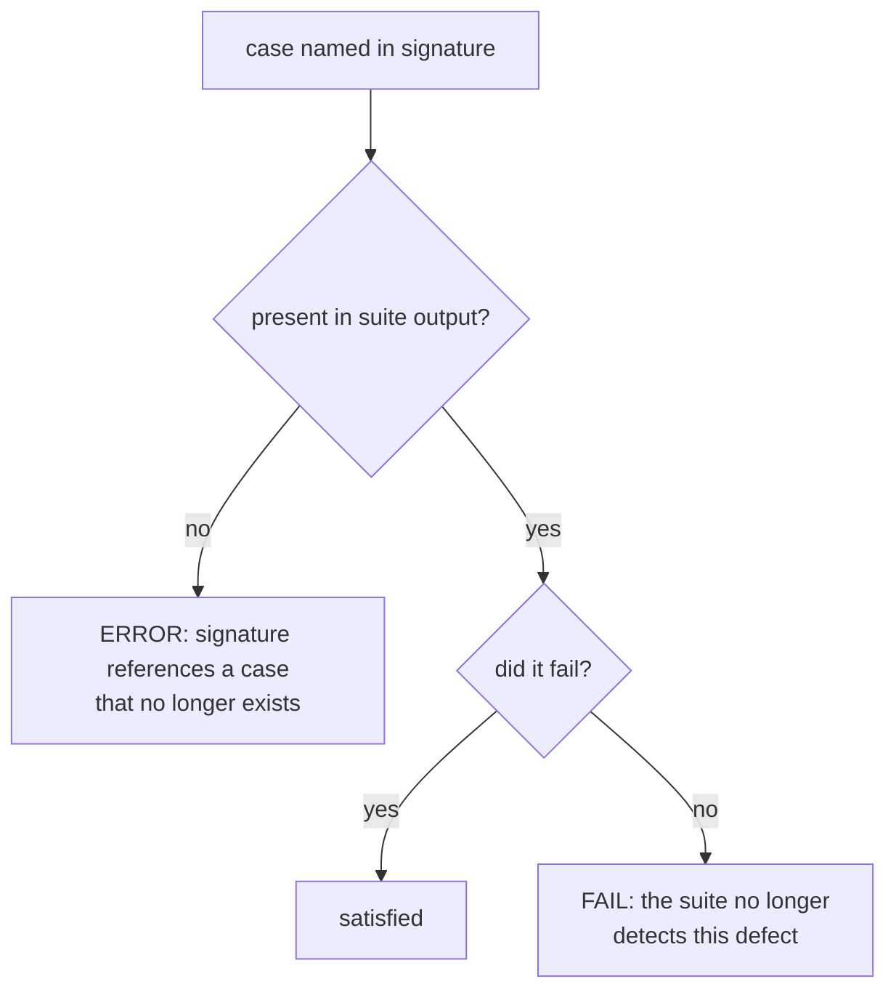

# falsify harness — defect signatures instead of pass counts

Planned session 29 (2026-08-08) on `main` @ `5fa766f`. Closes task 9 of
`docs/features/statusline-wrap-worktree.md`, which shipped as PR #43 while this harness was
broken — so the statusline script currently has 68 tests and no proof any of them can fail.

**Location note.** `writing-specs` defers to `docs/superpowers/specs/`, but this repo's
`one-canonical-file` discipline (`rules/gates.md`) puts feature-scale work in a single
`docs/features/<name>.md`, and every existing feature file lives there. Following the skill here
would create the second spec location it warns against, so the repo convention wins.

## Background — why this exists

`statusline-command.falsify.py` is a test-of-tests. It runs the **current** suite against five
historical versions of `statusline-command.sh`, each carrying a known defect, and checks that the
suite still catches them. Its value is specific: a green suite proves nothing on its own, because
an assertion that cannot fail passes for free.

That is not hypothetical in this codebase. Three of the four defects the observability judge found
during PR #43 were assertions that could not fail — a width test whose fixture was `/tmp` (not a
repo, so the shape that overflowed was never rendered), a row bound with two rows of slack, and a
canary whose power depends on the machine's hostname length. The suite was green for all three.
**This harness is the only mechanism that would have caught that class directly, and it was broken
the whole time.**

### The defect

`EXPECTED` maps each historical commit to an exact **pass count**:

```python
EXPECTED = {
    "f0902ed": (9,  "original: printf '%b', no stripping"),
    "925c310": (10, "route-1 fix only: printf '%s', no stripping"),
    "29d6131": (15, "route-2 fix, but $PWD fallback unstripped"),
    "4d63b09": (20, "$PWD ordering fixed; empty-cwd handling cosmetic only"),
    "e882659": (19, "regressed: second unstripped fallback below the strip"),
}
```

A count is a fact about **how many tests exist**, not about the defect. The numbers were written
when the suite held 20 cases; it held 50 before PR #43 and 68 after. The harness therefore breaks
every time the suite it protects improves — and a harness that cries wolf on every improvement
stops being read, which is the failure ADR 0016 was written about.

### Measured evidence, and the part that is not just arithmetic

Run against the 50-case suite as it stood before PR #43:

| commit | want | actual | verdict |
|---|---|---|---|
| `f0902ed` | 9 | **8** | MISMATCH |
| `925c310` | 10 | **9** | MISMATCH |
| `29d6131` | 15 | 15 | ok |
| `4d63b09` | 20 | 20 | ok |
| `e882659` | 19 | 19 | ok |

Three versions were unaffected by 30 new tests, which means every added case already failed on
them. But `f0902ed` and `925c310` each **lost exactly one pass**. Growth alone cannot do that:
some case that used to pass on those two versions now fails. **That is a real, unread signal about
either a test or a label, and it predates this work.** Section "Risk" below governs what happens
when the new method meets it.

## Design

### 1. Signatures replace counts

Each version declares the assertions that **must fail** on it — its defect signature.

```python
EXPECTED = {
    "f0902ed": {
        "label": "original: printf '%b', no stripping",
        "must_fail": [
            "literal \\x1b in display_name stays inert",
            "real ESC in display_name is stripped",
        ],
    },
}
```

Cases are identified by the description string the suite already prints as
`ok   — <desc>` / `FAIL — <desc>`. No new output format is required from the suite.

### 2. Extra failures are allowed; missing ones are errors

A case outside a signature may fail freely — that is what adding tests does. The harness only
asserts that every named case **does** fail. This is what stops the treadmill.

The cost, stated plainly: the harness no longer notices a version failing *more* than expected. That
is the right trade, because "fails more on an old buggy version" is the normal consequence of
writing better tests, and treating it as an error is precisely what broke the harness.

### 3. A signature naming a case that no longer exists is a hard error

If a test is renamed or deleted, its name silently disappears from the suite output and the
signature would be trivially satisfiable. Left unhandled, this recreates today's situation in a
quieter form. The harness must therefore distinguish three states, never two:



### 4. Signatures are reasoned before they are run

For each of the five commits, in this order:

1. Read what the commit actually got wrong.
2. Write down which assertions *should* catch it — **before running anything**.
3. Run the suite against that version.
4. Compare prediction to result.

Agreement is evidence. Disagreement is a finding either way: either a test does not catch what we
assumed, or the label misdescribes the defect. Both are recorded, never smoothed over.

The order is the whole point. Deriving signatures from observed output would fit the assertion to
reality, which is the exact failure mode that produced three of four defects in PR #43 — a test
describing what happened can never disagree with what happens.

### 5. It runs at PR time

Documented in the harness docstring and referenced from the statusline script's header, alongside
the observability judge. **Residual risk, stated rather than hidden:** this is still a human
remembering, which is the mechanism that already failed. A commit hook on the two files that can
invalidate it would cost ~50s about 21 times per quarter and could not rot. Deliberately deferred
(user decision, 2026-08-08); revisit if it rots again.

## Scenarios

```gherkin
Feature: falsification harness survives a growing suite

  Scenario: adding an unrelated test does not break the harness
    Given every version's signature is satisfied
    When a new test case is added that no signature names
    Then the harness still reports falsification intact

  Scenario: a test that stops detecting its defect fails the harness
    Given "real ESC in display_name is stripped" is in f0902ed's signature
    When that assertion is weakened so it passes against f0902ed
    Then the harness reports that the suite no longer detects the defect
    And it names the case and the version

  Scenario: a renamed case is an error, not a silent pass
    Given a signature names "real ESC in display_name is stripped"
    When that case is reworded in the suite
    Then the harness errors that the signature references a missing case
    And it does not report falsification intact

  Scenario: a version failing more than its signature is not an error
    Given f0902ed's signature names two cases
    When six other cases also fail on f0902ed
    Then the harness reports falsification intact

  Scenario: a blob that is not the script is refused
    Given a historical blob is extracted for a commit
    When the content does not begin with "#!"
    Then the harness aborts rather than scoring the wrong text
```

The last scenario preserves behaviour the current file already has and explains: the `rtk` proxy
rewrites `git show <sha>:<path>` from the Bash tool to return the commit object rather than the
file blob, which once made the harness score identical non-script text five times while appearing
to work. Extraction stays in Python, and the `#!` check stays.

## Toolchain — pinned

| tool | version | note |
|---|---|---|
| `python3` | 3.9.6 | macOS system Python; no third-party imports |
| `bash` | 3.2.57 | runs the suite under test |
| `git` | 2.50.1 | blob extraction, invoked from Python, never via the Bash tool |

No new dependencies. `re`, `subprocess`, `sys`, `tempfile`, `pathlib` only — all stdlib, all
already imported by the current file.

## Non-goals

- No generalising this into a harness for other suites. One consumer, YAGNI.
- No change to the five historical commits, or to what any of the 68 tests assert.
- No new output format from `statusline-command.test.sh`; the existing `ok —` / `FAIL —` lines are
  the contract.
- No commit hook (see §5).

## Risk

**Reasoning first may show a label is wrong.** The file already disagrees with itself: `f0902ed` is
labelled as passing 9 and passes 8. If step 4 shows a label misdescribes its commit, that is
surfaced as a finding and the label is corrected with evidence — **not** re-baselined to whatever
the run produced. Re-baselining is the move that turns a falsification harness into a rubber stamp,
which is the thing this whole document exists to prevent.

## Tasks

- [ ] 1. Reason out all five signatures from the commits alone; record predictions **before**
      running anything.
- [ ] 2. Run each version, compare to prediction, and record every disagreement as a finding.
- [ ] 3. Resolve disagreements — correct a label with evidence, or record that a test does not
      catch what was assumed. Never re-baseline.
- [ ] 4. Rewrite `EXPECTED` to the signature shape and implement the three-state check (§3).
- [ ] 5. Prove the harness can fail: weaken one named assertion and confirm it is caught; rename
      one and confirm the missing-case error fires.
- [ ] 6. Confirm the treadmill is gone: add a throwaway passing test and confirm the harness stays
      intact without edits.
- [ ] 7. Document the PR-time run in the docstring and the script header.
- [ ] 8. Compliance judge + observability judge, then PR.
