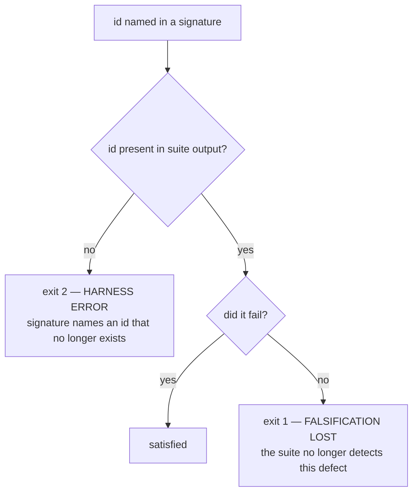

# falsify harness — defect signatures, stable case ids, and a vacuity ratchet

Planned session 29 (2026-08-08) on `main` @ `5fa766f`. Closes task 9 of
`docs/features/statusline-wrap-worktree.md`, which shipped as PR #43 while this harness was
broken — so the statusline script currently has 68 tests and no proof any of them can fail.

**Revision 3** after compliance rounds 1-2 (`fail`/`fail`) and two observability architecting reads
(both `risk=medium`). Scope grew by explicit user decision, 2026-08-08: the vacuity ratchet (§5)
was added after the advisory judge measured that a third of the suite passes against a script that
produces no output. Revision 3 adds per-iteration ids (§1), `must_pass` anchors (§3), a second stub
and the overlap rule (§5), and states real coverage (§9).

**Location note.** `writing-specs` defers to `docs/superpowers/specs/`, but this repo's
`one-canonical-file` discipline (`rules/gates.md`) puts feature-scale work in a single
`docs/features/<name>.md`. The compliance judge examined and accepted this deviation in round 1.

## Background — why this exists

`statusline-command.falsify.py` is a test-of-tests. It runs the **current** suite against five
historical versions of `statusline-command.sh`, each carrying a known defect, and checks that the
suite still catches them. A green suite proves nothing on its own, because an assertion that
cannot fail passes for free.

That is not hypothetical here. Three of the four defects the observability judge found during
PR #43 were assertions that could not fail. The suite was green for all three. **This harness is
the only mechanism that catches that class directly, and it was broken throughout.**

### Defect 1 — pass counts go stale by design

`EXPECTED` maps each historical commit to an exact **pass count** (`falsify.py:44-57`). A count is
a fact about **how many tests exist**, not about the defect. The numbers were written at 20 cases;
the suite held 50 before PR #43 and 68 after. Measured against the 50-case suite:

| commit | want | actual | verdict |
|---|---|---|---|
| `f0902ed` | 9 | **8** | MISMATCH |
| `925c310` | 10 | **9** | MISMATCH |
| `29d6131` | 15 | 15 | ok |
| `4d63b09` | 20 | 20 | ok |
| `e882659` | 19 | 19 | ok |

Three versions were unaffected by 30 new tests, so every added case already failed on them.

**The `f0902ed`/`925c310` discrepancy is resolved, not open.** Revision 1 called it "a real unread
signal" that "growth alone cannot cause". That was wrong, and the round-1 architecting judge
disproved it: against the era-appropriate 20-case suites the recorded counts reproduce `EXPECTED`
**exactly** (9/10/15/20/19), so the counts were correct when written and the harness was broken *by*
growth rather than born broken. The flip is three token-bar baseline assertions tightened when the
context bar landed, benign; "lost exactly one pass" was a **net** figure masking 3 losses against 2
gains. No label is wrong and no test is broken. It is recorded here so tasks 3 and 5 do not
re-investigate a settled question.

### Defect 2 — a third of the suite is satisfied by silence

Measured by the architecting judge: against a stub script that produces no output, **23 of 68
assertions pass** — including *every* injection assertion, all four `$PWD fallback stripped`
cases, and `a control character in a path never reaches the output`. They are "count of bad byte
≤ limit" checks, and silence satisfies them.

These are the safety-critical tests. Neither the old harness nor revision 1 of this spec measured
this, which is why §5 exists.

## Measured against the real suite (2026-08-08)

Revisions 1-3 were reasoned from a mental model of the suite rather than the suite, and the
round-3 advisory caught three artifacts that do not exist in it. Everything below is measured
first-hand, reproducibly: copy `statusline-command.test.sh` and a candidate script into a temp
directory, run the suite, and match results by **ordinal** — every run emits exactly 68 results in
a stable order, which is what makes cross-run comparison valid before ids exist.

### Baselines

| run | passes /68 |
|---|---|
| working tree | 68 |
| silent stub, `#!/bin/bash` + `exit 0` | **24** |
| silent stub, `#!/bin/bash` only | **23** |
| one-line stub, `printf 'x'` + `exit 0` | **31** |
| one-line stub, `printf 'x'` only | **30** |
| `f0902ed` | **19** |
| `925c310` | **20** |
| `29d6131` | 28 |
| `4d63b09` | 33 |
| `e882659` | 32 |

**Vacuous against either stub: 31 of 68**, not the 24 revision 2 quoted. The 23-vs-24 and 30-vs-31
pairs are the same effect — a redundant `exit 0` changes the result — which is why §6 must pin stub
**bytes**, not prose.

**`f0902ed` (19) and `925c310` (20) pass fewer assertions than a script that does nothing (24).**
They are already failing wholesale, which is precisely what §3's `must_pass` was added to detect.

### `must_pass` is a liveness check, not a defect anchor

The pool of assertions that pass on a version *and* fail against both stubs is **3 for `f0902ed`
and `925c310`, 5 for the others, and the same 3 across all five**:

- `git repo -> git segment names the branch`
- `uncommitted changes -> dirty marker`
- `an over-wide segment survives intact on its own line`

Those say "this is still a working script", not "this version failed for its own defect". §3 must
claim only that.

### Non-vacuity is not sufficient — signatures must be DIFFERENTIAL

The strongest-looking candidates ("fails here and is not vacuous") are **identical across all five
versions** — `baseline renders model and context-bar segments`, `sub-1000 tokens render raw`, and
so on. They fail everywhere because every historical script predates the token bar. A signature
drawn from them is satisfied by every version and proves nothing about any defect.

The only shape that proves an assertion detects *that* defect is **differential**: it fails on the
version and **passes on the version that fixed it**.

| transition | discriminating | of which non-vacuous |
|---|---|---|
| `f0902ed` → `925c310` (route-1 fix) | **1** | **0** |
| `925c310` → `29d6131` (route-2 fix) | 9 | **2** |
| `29d6131` → `4d63b09` ($PWD ordering) | 5 | **0** |
| `4d63b09` → `e882659` (regression) | **1** | **0** |

The two non-vacuous ones are `surrounding text survives stripping` and `path with a stripped
newline is joined, not truncated`.

### The finding that reframes this feature

**For three of the four transitions, every discriminating assertion is vacuous.** The suite's
ability to prove those three defects detectable rests entirely on assertions that a no-output
script also satisfies. Vacuity is not a side problem to ratchet alongside the signatures — it sits
directly on top of the falsification evidence.

This invalidates revision 3's framing of §6 as secondary, and its worked examples throughout.
**Revision 4 must be designed from this table.** Open for that revision: whether signatures become
differential by definition, and whether "fix the vacuous assertions" can still be a non-goal when
three of four signatures would consist entirely of them.

## Design


### 1. Stable case ids — the identity contract

Revision 1 identified cases by the description string the suite prints. **That is
unimplementable**, and both judges caught it independently: the suite prints a *different* string
on pass than on fail.

```
ok   — all-control cwd falls through to a stripped $PWD (bel=0)
FAIL — all-control cwd leaked via the $PWD fallthrough (bel=3)
```

Measured on `29d6131`: **27 of 40** failing cases have a fail-name not derivable from any pass-name
— and that unmatchable set contains the actual defect signatures for `29d6131` and `e882659`.
Revision 1's single worked example came from `assert_no_injection`, the one family where the
description happens to be stable.

**Contract.** Every assertion carries a stable id, emitted on both outcomes:

```
ok   [pwd-fallthrough-stripped] — all-control cwd falls through to a stripped $PWD (bel=0)
FAIL [pwd-fallthrough-stripped] — all-control cwd leaked via the $PWD fallthrough (bel=3)
```

- Ids are kebab-case, unique within the suite, and **never reused** for a different assertion.
- The id is the identity; the trailing prose stays free-form and may change without consequence.
- `ok()` and `bad()` take the id as their first argument, so a call site cannot emit one without it.
- The harness parses `^(ok|FAIL)\s+\[([a-z0-9-]+)\]` and ignores everything after.

**Loop-generated assertions.** Eleven of the assertions are emitted from inside `for` loops
(`statusline-command.test.sh:524-535, 606-617, 710-717`), so one call site yields three or four
results. Passing a single id would give them all the same id, breaking uniqueness and — worse —
leaving the ratchet unable to say *which* of the four `$PWD fallback` safety cases was fixed. The
loop values (`{}`, `garbage`, `{"cwd":null}`, `0`, the empty string, `abc`, `-1`) cannot be ids:
they do not match `[a-z0-9-]+`.

**Rule:** a loop iterates over explicit `id-suffix:value` pairs, and the id is
`<family>-<suffix>`. Suffixes are authored, never derived from the value and never positional, so
reordering or adding a case cannot silently rename an existing one.

```bash
for case in "empty-object:{}" "garbage:garbage" "null-cwd:{\"cwd\":null}" "empty-workspace:{\"workspace\":{}}"; do
  id="pwd-fallback-${case%%:*}"; payload="${case#*:}"
```

**Duplicate ids are a harness error (exit 2).** If the same id is emitted twice in one run, the
harness cannot attribute a result and must not guess. This is the check that catches the most
likely authoring mistake — see §Risk.

This is the API contract the compliance judge required. With §5's ratchet list, these are the only
changes this feature makes to `statusline-command.test.sh`.

### 2. Signatures replace counts

```python
EXPECTED = {
    "f0902ed": {
        "label": "original: printf '%b', no stripping",
        "must_fail": ["esc-literal-inert", "esc-real-stripped"],
    },
}
```

Every named id **must fail** on that version. Other cases may fail freely — that is what adding
tests does, and allowing it is what stops the treadmill.

Stated cost: the harness no longer notices a version failing *more* than expected. That is the
right trade, because "fails more on an old buggy version" is the normal consequence of writing
better tests, and treating it as an error is exactly what broke this harness.

### 3. `must_pass` anchors — proving a version failed for its *own* defect

Measured by the round-1 architecting judge: **~31 of the ~40-50 failures per version are era
noise.** The historical scripts predate the token bar, the sigma counter, the lock recovery, the
quota segment, worktrees and wrapping, so most of what fails on them fails because the feature did
not exist yet — not because of the defect under test.

"Extra failures allowed" (§2) therefore removes something the old count check provided implicitly:
evidence that a version is *not* simply failing wholesale. A signature can be satisfied by a
version that fails everything, including for reasons unrelated to its defect.

Each version therefore also declares a small **named** `must_pass` list — assertions that must
still pass on it:

```python
"f0902ed": {
    "label": "original: printf '%b', no stripping",
    "must_fail": ["esc-literal-inert", "esc-real-stripped"],
    "must_pass": ["baseline-user-host", "dir-basename"],
},
```

A named list costs zero treadmill: like `must_fail`, it does not grow when the suite grows. A
`must_pass` id that fails exits `1` — the version is failing wholesale and its signature proves
nothing.

### 4. An empty signature is a hard error

`4d63b09` fails nothing today (`falsify.py:54` scores it 20/20), so its `must_fail` would be empty
— and an empty list is satisfied by **any** input: the right blob, the wrong blob, a truncated
file, a stub. One of five versions would become decoration while the harness printed success.

**A version whose `must_fail` is empty is a hard error, not a pass.** Resolving `4d63b09`
specifically is task 4, which forces one of two explicit outcomes, both recorded in the file:

- an assertion is added that does catch its defect, and becomes its signature; or
- it is removed from `EXPECTED` with a written rationale that its flaw is genuinely undetectable
  by any assertion at this layer.

Silently keeping it with an empty signature is neither.

### 5. Three states, three exit codes



| exit | meaning |
|---|---|
| `0` | falsification intact — every signature satisfied, ratchet holding |
| `1` | the suite lost detection power, or the working-tree floor failed, or the ratchet grew |
| `2` | harness error — missing id, empty signature, or a blob that is not the script |

An `ERROR` must never exit `0`. The current file returns a binary `0`/`1` (`falsify.py:120-121`),
so a third outcome added without its own code would read as green to whatever runs it.

### 6. The vacuity ratchet

The harness additionally runs the suite against a **stub**: a script that is executable, exits
`0`, and writes nothing to stdout. It records **by id** which assertions still pass.

```python
# Assertions satisfied by a script that produces no output. This list may only
# ever SHRINK. Each entry is a test that cannot fail for the reason it claims.
KNOWN_VACUOUS = ["esc-literal-inert", "pwd-fallthrough-stripped", ...]
```

- **Assertion:** the set passing against a stub must be a **subset** of that stub's list.
- Shrinking is always allowed and needs no edit — fixing a test just works.
- Growing fails the harness (exit `1`), so a newly-written vacuous assertion is caught first run.
- Adding an id requires a deliberate edit, which is visible in review.

**Two stubs, not one.** Silence is the weakest possible broken script. Measured: a stub printing a
single harmless line passes **30** of 68 — seven more than the silent stub, and those seven are
"output exists" / "output is one line" assertions, the flimsiest shape in the suite. A silence-only
ratchet would bless them forever. Both stubs are run, each with its own list:

| stub | definition | measured |
|---|---|---|
| `STUB_SILENT` | executable, exits `0`, writes nothing | **24** of 68 pass |
| `STUB_ONE_LINE` | executable, exits `0`, writes one plain ASCII line | **30** of 68 pass |

**The seeded number is 24, not 23.** The advisory judge's 23 came from a slightly different stub
(`exit 1`); the stub *this spec defines* yields 24. Recorded here so task 7 seeds from the defined
stub and the discrepancy is not rediscovered as a defect. Note this is the one place seeding from
measurement is correct — §Risk's "never re-baseline" governs **signatures and labels**, which
encode a belief about a defect. A vacuity list encodes no belief; it is a starting position for a
ratchet whose only permitted direction is down.

**A subset check is satisfied by the empty set.** If a stub run breaks and yields fewer results,
"subset" reads that as progress — the same shape as the empty-signature bug §4 fixes. The harness
therefore also asserts each stub run produced the **full case count**, and exits `2` if not.
Stated honestly: this is hardening, not a proven bug — silence, NUL bytes and 200KB of junk all
held the count at 68, so it could not be triggered.

**Overlap between a signature and a vacuity list is reported, and ratcheted.** An id can legitimately
be in both: `esc-literal-inert` fails on `f0902ed` (which leaks escapes, exceeding the limit) *and*
passes against a silent stub (zero escapes is under the limit). Those are not contradictory — the
assertion does detect that defect. But it detects it by a measure silence also satisfies, so the
signature rests on weaker evidence than it appears to. Every overlapping id must appear in a
declared `SIGNATURE_RESTS_ON_VACUOUS` list, which may only shrink, exactly like the stub lists.

*(The round-2 advisory called this a contradiction — "both lights green, saying opposite things".
It is not, for the reason above, and treating it as one would forbid a legitimate state. It is a
real weakness, and is handled as one.)*

This is a ratchet, not a count: it cannot go stale as the suite grows, which is the failure this
whole feature exists to end. It starts at the measured 23 and is expected to fall. **Driving it to
zero is explicitly not this feature's job** — those are 23 separate assertion rewrites, and mixing
them in would mean neither half got reviewed properly. This feature makes them visible and stops
new ones.

### 7. The working-tree floor is preserved

`falsify.py:99-107` asserts the working tree passes **all** cases before any historical version is
scored. That is a count check, but not a version-relative one — it means "the suite is green right
now", without which every downstream comparison is meaningless. It stays, unchanged, and failing it
exits `1`.

### 8. Signatures are reasoned before they are run

For each commit, in this order: read what it got wrong → write down which ids *should* catch it →
run → compare. Agreement is evidence; disagreement is a finding either way, and is recorded.

Deriving signatures from observed output would fit the assertion to reality — the failure mode that
produced three of four defects in PR #43. A test describing what happened can never disagree with
what happens.

### 9. It runs at PR time, and states its own coverage

Documented in the harness docstring and referenced from the script header, alongside the
observability judge.

**The harness states its own coverage.** Roughly **11 of 68** assertions gain falsification
coverage — the ones named in signatures — and one of five versions may contribute none once
`4d63b09` is resolved. "falsification intact" must therefore print the coverage alongside it, so
the line cannot be read as a claim about the whole suite. Over-claiming here would be the same
class of defect as the vacuous assertions themselves.

**Residual risk, stated not hidden:** this is a human remembering, the
mechanism that already failed. A commit hook on the two files that can invalidate it would cost
~50s about 21 times per quarter and could not rot. Deferred by user decision (2026-08-08); revisit
if it rots again.

## Scenarios

```gherkin
Feature: falsification survives a growing suite

  Scenario: adding an unrelated test does not break the harness
    Given every version's signature is satisfied
    When a test is added whose id no signature names
    And that test is not vacuous against the stub
    Then the harness exits 0

  Scenario: a test that stops detecting its defect fails the harness
    Given "esc-real-stripped" is in f0902ed's signature
    When that assertion is weakened so it passes against f0902ed
    Then the harness exits 1
    And names both the id and the version

  Scenario: a signature naming a removed id is a harness error
    Given a signature names "esc-real-stripped"
    When that assertion is deleted or its id changed
    Then the harness exits 2
    And does not report falsification intact

  Scenario: failing more than the signature is not an error
    Given f0902ed's signature names two ids
    When six other cases also fail on f0902ed
    Then the harness exits 0

  Scenario: an empty signature is rejected
    Given a version's must_fail list is empty
    Then the harness exits 2

Feature: vacuity ratchet

  Scenario: a newly vacuous assertion is caught
    Given KNOWN_VACUOUS holds the currently-vacuous ids
    When a new assertion is added that passes against the stub
    Then the harness exits 1
    And names the new id

  Scenario: fixing a vacuous assertion needs no harness edit
    Given "esc-literal-inert" is in KNOWN_VACUOUS
    When it is rewritten so it fails against the stub
    Then the harness exits 0
    And KNOWN_VACUOUS is not edited

Feature: extraction safety

  Scenario: a blob that is not the script is refused
    Given a historical blob is extracted for a commit
    When the content does not begin with "#!"
    Then the harness exits 2
```

The last scenario preserves existing behaviour and its reason: the `rtk` proxy rewrites
`git show <sha>:<path>` issued from the Bash tool to return the commit object rather than the file
blob, which once made the harness score identical non-script text five times while appearing to
work. Extraction stays in Python; the `#!` check stays.

## Toolchain — pinned

| tool | version | note |
|---|---|---|
| `python3` | 3.9.6 | macOS system Python; stdlib only |
| `bash` | 3.2.57 | runs the suite under test |
| `git` | 2.50.1 | blob extraction, invoked from Python, never via the Bash tool |

No new dependencies. `re`, `subprocess`, `sys`, `tempfile`, `pathlib` — all already imported.

## Non-goals

- **Fixing the 23 vacuous assertions.** Measured and ratcheted here, rewritten elsewhere.
- No generalising the harness to other suites. One consumer, YAGNI.
- No change to the five historical commits.
- No commit hook (§8).
- No change to what any non-vacuous assertion asserts; ids are additive.

## Risk

**Reasoning first may show a label is wrong.** The file already disagrees with itself: `f0902ed` is
labelled as passing 9 and passes 8. If §7 shows a label misdescribes its commit, that is surfaced
as a finding and corrected **with evidence** — never re-baselined to whatever the run produced.
Re-baselining turns a falsification harness into a rubber stamp, which is the thing this document
exists to prevent.

**Adding ids touches 91 call sites, not 68.** Measured: 45 `ok` and 46 `bad` calls, roughly 45 of
them `if`/`else` pairs where the *same* id is typed twice — the classic setup for a copy-pasted
duplicate or a swapped pair. The stated safety net ("a bad id won't resolve → exit 2") catches
neither, and covers only the ~11 ids named in signatures. Two checks close it: **duplicate ids are
exit 2** (§1), and **task 2 requires the two vacuity lists to be byte-identical before and after
the id edits** — adding ids is purely additive, so any movement is a bug, and this catches a
swapped `ok`/`bad` pair that "68/68 still green" cannot.

## Tasks

- [ ] 1. Measure and record both stub baselines **before** any edit, by id — this is the reference
      task 2 checks against.
- [ ] 2. Add stable ids to all 91 call sites; `ok()`/`bad()` take the id first so a site cannot omit
      one. Loop sites use authored `id-suffix:value` pairs (§1). Then verify: ids unique, suite still
      68/68, and **both vacuity lists byte-identical to task 1's baseline** — ids are additive, so
      any movement is a bug.
- [ ] 3. Reason out all five `must_fail` signatures **and** `must_pass` anchors from the commits
      alone; record predictions **before** running. Then run, compare, record every disagreement.
- [ ] 4. Resolve `4d63b09`'s empty signature — add a detecting assertion, or remove the version with
      written rationale. No third option.
- [ ] 5. Resolve any label disagreement from task 3 with evidence. Never re-baseline.
      (The `f0902ed`/`925c310` count discrepancy is **already resolved** — see §Background. Do not
      re-investigate it.)
- [ ] 6. Rewrite `EXPECTED` to the signature shape; implement the three-state check, the three exit
      codes, duplicate-id detection, and the `must_pass` anchors; preserve the working-tree floor.
- [ ] 7. Implement the vacuity ratchet against **both** stubs; seed each list from task 1's
      measurement; assert each stub run produced the full case count; implement the
      `SIGNATURE_RESTS_ON_VACUOUS` overlap list.
- [ ] 8. Prove the harness can fail, one falsifier per path: weaken a named assertion (expect 1),
      break a `must_pass` (expect 1), rename an id (expect 2), duplicate an id (expect 2), empty a
      signature (expect 2), add a vacuous assertion (expect 1), truncate a stub run (expect 2).
- [ ] 9. Confirm the treadmill is gone: add a throwaway non-vacuous passing test, confirm exit 0
      with no harness edit.
- [ ] 10. Print coverage (~11 of 68) alongside the verdict; document the PR-time run in the
      docstring and the script header.
- [ ] 11. Compliance + observability judges, then PR.
