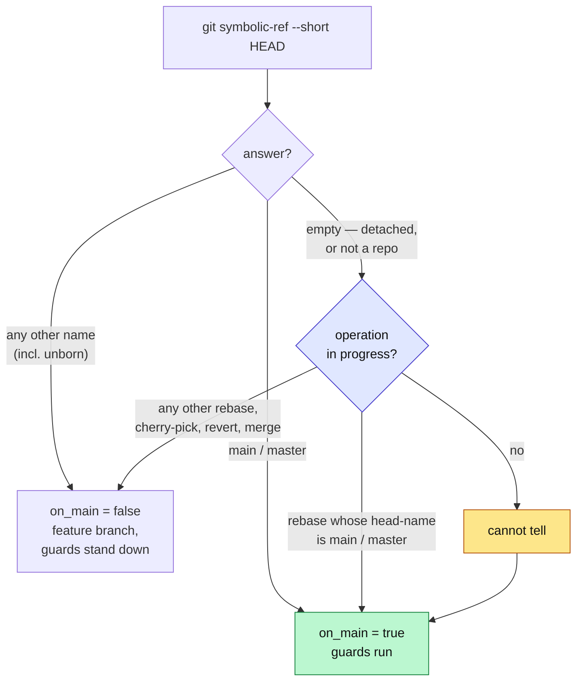

# git-guard: a checkout it cannot name is treated as safe

## Background — why this exists

`hooks/git-guard.sh` holds two Tier 1 guards: commits to `main`/`master` are restricted to a
documentation allowlist, and `--force-with-lease` is refused while the default branch is checked out.
Both ask one question — *which branch am I on?* — through a single helper:

```bash
# hooks/git-guard.sh, current
current_branch() { git rev-parse --abbrev-ref HEAD 2>/dev/null || echo ""; }
on_main() { local b; b="$(current_branch)"; [ "$b" = "main" ] || [ "$b" = "master" ]; }
```

`git rev-parse --abbrev-ref HEAD` answers with the literal string `HEAD` when it cannot name a branch.
`on_main` compares that to `main` and `master`, gets false for both, and **every guard downstream is
skipped.** The failure direction is *open*: work reaches the default branch unjudged.

This is not hypothetical, and it is confirmed from git rather than from a prior session's report. The
reflog of this worktree shows a checkout of `origin/main` — a remote-tracking ref, which detaches HEAD
— followed immediately by the two commits that reached `main`:

```
0819db7 HEAD@{0}: commit: docs(memory): date the "no round 7" claim…
84ed83c HEAD@{1}: commit: docs(memory): close out PRs #48 and #50…
fe55b2d HEAD@{2}: checkout: moving from 8f0e884… to origin/main
```

Both were made with the allowlist skipped. Both happened to be documentation, so nothing was harmed —
but the guard is not what permitted them; it was never consulted.

Two properties make it worth a spec rather than a one-line patch:

1. **It reaches two call sites, not one.** `on_main` gates the leased force-push refusal *and* the
   default-branch commit allowlist. A fix aimed only at commits leaves the push half open.
2. **`--abbrev-ref` conflates three different states into one answer.** Measured across every HEAD
   state (see the table below), it returns `HEAD` for a genuine detached checkout *and* for an unborn
   branch, and fails outright outside a repository. Only one of those three is actually branchless.

The file's own header already states the intended posture: *"Fails CLOSED (exit 2) when it cannot
inspect the command at all … 'cannot tell' must not mean 'allow'."* The helper contradicts it.

## Decision

**Ask a question that has one meaning: `git symbolic-ref --short HEAD`.** It resolves the branch
`HEAD` points at without requiring that branch to have commits, so it names the branch in every state
where one exists, and fails only when there genuinely is none.

Measured on git 2.50.1, all six states:

| HEAD state | `rev-parse --abbrev-ref HEAD` | `symbolic-ref --short HEAD` |
|---|---|---|
| fresh `git init`, unborn | `HEAD` (exits non-zero) | `main` |
| on `main` | `main` | `main` |
| on `feat/x` | `feat/x` | `feat/x` |
| genuinely detached | `HEAD` | *fails* |
| orphan branch, unborn | `HEAD` (exits non-zero) | `brandnew` |
| not a git repository | *fails* | *fails* |

`symbolic-ref` never returns the literal string `HEAD`, so the `HEAD` special case disappears and
exactly one cannot-tell arm remains:

```bash
current_branch() { git symbolic-ref --short HEAD 2>/dev/null || echo ""; }

on_main() {
  local b; b="$(current_branch)"
  case "$b" in
    main|master) return 0 ;;
    # Empty means HEAD names no branch: a detached checkout, or not a repository
    # at all. Cannot-tell, and this guard fails CLOSED (see the file header) --
    # except while git has an operation in progress, which it is waiting on the
    # operator to finish. See the carve-out below.
    "")          sequencer_in_progress && return 1; return 0 ;;
    *)           return 1 ;;
  esac
}
```



**Why not resolve where the detached commit actually sits.** The tempting alternative — decide whether
a detached `HEAD` *is* main — fails on measurement. An equality test returns false in the very worktree
where the incident occurred, because `main` has since moved ahead; only a containment test would work,
and containment needs `main`, `master`, `origin/main` and `origin/master` each to be resolvable. Every
one of those lookups is a new way to not-know, and every not-know in that design fails open again.
Failing closed needs no lookups at all.

### The in-progress-operation carve-out

Failing closed on a branchless checkout strands an operator in the middle of an operation git is
waiting on them to finish. Measured on git 2.50.1:

| State | `symbolic-ref` | marker git writes | documented next step |
|---|---|---|---|
| `rebase -i` stopped at `edit` | *empty* | `rebase-merge` | `git commit --amend` |
| rebase stopped on a conflict | *empty* | `rebase-merge` | `git rebase --continue` |
| rebase via the apply backend | *empty* | `rebase-apply` | `git rebase --continue` |
| cherry-pick conflict while detached | *empty* | `CHERRY_PICK_HEAD` | `git commit` |
| revert conflict while detached | *empty* | `REVERT_HEAD` | `git commit` |
| merge conflict while detached | *empty* | `MERGE_HEAD` | `git commit` |

Every one of those is branchless, so the bare rule refuses them — and in four of the six the command
git itself tells the operator to run is one the classifier raises `COMMIT` for. With no bypass
variable the refusal has no escape, and the remedy line `git switch -c <name>` cannot be followed:
git answers `fatal: cannot switch branch while rebasing`. Measured, the rebase *survives* that
attempt and `--continue` still works, so the harm is a **stranded operator given unfollowable
advice**, not a destroyed operation — a milder failure than an earlier draft of this spec claimed,
and stated at its true size.

So the guard stands down while git records an operation in progress:

```bash
# Git is replaying or completing work that already exists and is waiting on a
# command to finish it. Refusing here strands the operator mid-operation with
# advice they cannot follow -- `git switch -c` refuses while a sequencer runs.
#
# EXCEPT a rebase whose head-name is the default branch. That rebase MOVES that
# branch onto the replayed commits when it finishes, so a commit made during it
# really is reaching main, and the guard must stay on. Measured: without this
# clause a source file committed during a rebase started from main IS on main
# after --continue. Both backends write head-name (merge and apply alike).
sequencer_in_progress() {
  local marker dir
  for marker in rebase-merge rebase-apply; do
    dir="$(git rev-parse --git-path "$marker" 2>/dev/null)"
    [ -e "$dir" ] || continue
    case "$(cat "$dir/head-name" 2>/dev/null)" in
      refs/heads/main|refs/heads/master) return 1 ;;
    esac
    return 0
  done
  # Cherry-pick, revert and merge move no branch: finishing one leaves the
  # commit on the detached HEAD it was already on.
  #
  # `git am` stopped on a conflict from a DETACHED HEAD does reach this arm --
  # it writes rebase-apply with no head-name, so the case above falls through to
  # `return 0` and the guard stands down. That is safe for the cherry-pick
  # reason, not the reason an earlier draft gave: an `am` replaying onto a
  # detached HEAD updates no branch, so nothing it commits reaches main. An `am`
  # on a NAMED branch never gets here, because symbolic-ref answers.
  for marker in CHERRY_PICK_HEAD REVERT_HEAD MERGE_HEAD; do
    [ -e "$(git rev-parse --git-path "$marker" 2>/dev/null)" ] && return 0
  done
  return 1
}
```

Measured against a loose variant (no `head-name` clause) and this one:

| Fixture | `head-name` | loose | tightened |
|---|---|---|---|
| `rebase -i` from `main`, source staged | `refs/heads/main` | 0 | **2** |
| `rebase -i` from `feat/x`, `commit --amend` | `refs/heads/feat/x` | 0 | 0 |
| cherry-pick conflict while detached | *(none)* | 0 | 0 |
| plain detached, no operation | *(none)* | 2 | 2 |
| `rebase --apply` from `main` | `refs/heads/main` | — | *branchless, head-name present* |

`on_main` consults it only on the cannot-tell arm — a *named* `main`/`master` checkout stays guarded
whether or not a sequencer is running, because there the guard knows exactly where it stands:

```bash
    "") sequencer_in_progress && return 1; return 0 ;;
```

**This is a deliberate fail-open — the only one in the design, and its bound is now tested rather
than asserted.** It is keyed on state git writes to disk, not inferred, and it covers a class rather
than the single rebase instance that surfaced it: carving out `rebase-merge`/`rebase-apply` alone
would leave cherry-pick, revert and merge trapped identically.

Three bounds keep it from handing back what the fix just won, and **each has a test row** (matrix rows
15, 16 and 17) precisely because prose is not a rail:

1. **A rebase that will move `main`/`master` stays guarded** — the `head-name` clause above. Without
   it the carve-out re-opens the exact hole this spec exists to close; that was measured end to end,
   with the committed file present on `main` after `--continue`.
2. **A checkout plainly named `main`/`master` stays guarded regardless**, because
   `sequencer_in_progress` is consulted only from the `""` arm. If a later edit ever hoists the call
   above the `case`, row 16 fails.
3. **The `--apply` backend is recognised as a sequencer at all** — row 19. Dropping `rebase-apply`
   from the marker loop makes the carve-out stop firing for that backend, so the guard becomes
   *stricter*, not looser: rows 15, 16 and 17 all still exit 2 and report green. Only a row that
   expects **0** can see it, which is why row 19 rebases `--apply` from a *feature* branch.

Note what this does *not* claim: it is not a regression fix. The unmodified hook also allows a commit
during a rebase from `main` (`orig=0`). Bound 1 closes a pre-existing hole that the carve-out would
otherwise have preserved.

**Why `phase-guard`'s precedent still does not transfer.** phase-guard fails open on *any* detached
HEAD so it can never stall a rebase; this guard fails open only while an operation is actually in
progress. The looser rule is unnecessary here because `lib/classify-git-command.py` raises `COMMIT`
solely when the subcommand is literally `commit` (`classify-git-command.py:152`), so
`git add -- x && git rebase --continue` produces no facts at all and never reaches Guard 1 regardless.
The carve-out exists for the commands that *are* classified — `git commit` and `git commit --amend`
issued by hand mid-operation.

### What changes — measured, not estimated

Enumerated as a matrix rather than by example: the three guarded commands × the states in which
`symbolic-ref` returns empty.

**What was actually run, and what was not.** Six of these cells were executed against both the
unmodified hook and a patched copy, in purpose-built repositories. ⚠️ **Those measurement scripts are
not in this repository.** They ran in an ephemeral sandbox during planning and will be collected, so
this table currently cannot be re-run or audited by anyone but its author — a state the checklist
closes by landing them beside the test suite in the first implementation step. Until then, treat the
numbers as reported, not reproducible. The remaining cells are stated on other grounds and are
marked, because an unmarked inference reads as a measurement:

- *op-in-progress × empty index* and *op-in-progress × `--force-with-lease`* — **not executed here**;
  both follow from `on_main` returning false, and both were independently run by the round-3
  compliance judge, which reported 0 → 0 as claimed.
- *not-a-repository × staged source* — **unconstructable.** There is no index outside a repository, so
  that cell can only ever be reached through the pathspec form, which is what cost 1 below measures.

| Branchless state | `git commit` (staged source) | `git commit` (empty index) | `--force-with-lease` |
|---|---|---|---|
| plain detached HEAD | 0 → **2** *intended* | 0 → **2** *intended* | 0 → **2** *collateral* |
| detached, operation in progress, `head-name` **not** main/master | 0 → 0 (carve-out) | 0 → 0 (carve-out) | 0 → 0 (carve-out) |
| detached, rebase whose `head-name` **is** main/master | 0 → **2** *intended* | 0 → **2** *intended* | 0 → **2** *collateral* |
| not a git repository | 0 → **2** *collateral* | 0 → **2** *collateral* | 0 → **2** *collateral* |

Cells marked *intended* are the defect being fixed — a source commit reaching `main` from a detached
checkout is exactly what should be refused. Cells marked *collateral* block something legitimate, and
each is an accepted cost below. The rebase-from-`main` row is *intended* in its first two columns
because that rebase will move `main` onto the commit; it is the leak bound 1 closes, and its operator
cost is cost 5. One further changed cell sits outside this matrix because its branch is *named*: an
unborn `main` (cost 4).

1. **A commit into another repository from a directory that is not one.**
   `cd /real/repo && git commit -m msg -- src/app.sh`, an ordinary source commit on a healthy feature
   branch, exits 0 today and 2 after. The hook reads the ambient cwd, that cwd is branchless, and the
   guard fails closed. There is no escape: `git switch -c` needs a repository, and git-guard has **no
   bypass environment variable**. Accepted as the unavoidable price of any cwd-based fail-closed rule
   — narrow here because the tool's cwd is the repository.
2. **`git push --force-with-lease origin HEAD:feature/x` from a detached HEAD.** Refused. The escape
   is `git switch -c <branch>`, which should precede that push anyway.
3. **`git push --force-with-lease` from a directory that is not a repository.** Refused, and like
   cost 1 it has no escape. The push would target whatever remote the cwd cannot name, so refusing is
   defensible on its own terms, but it is a behavior change and is listed rather than glossed.
4. **The first source commit in a freshly initialised repository whose branch is `main`.** Today the
   unborn branch reads as `HEAD` and the commit is allowed; under `symbolic-ref` it reads as `main`
   and the documentation allowlist applies. This is the "never commit application code directly to
   `main`" rule being enforced where it previously was not — correct, but new. `git init -b feat/x`
   is unaffected.
5. **A hand-written `git commit` during a rebase started from `main`/`master`** — the row added to the
   matrix above, and the direct consequence of bound 1. Refused, with no bypass, and the remedy line
   git would reject if it advised a branch switch (hence the message-contract rule). This is the cost
   of closing the leak; it is listed rather than treated as free, because an operator resolving a
   conflict mid-`main`-rebase by hand will meet it. `git rebase --continue` is unaffected — it raises
   no `COMMIT` fact — so the ordinary path through a rebase never encounters this.

**Not a cost, because of the carve-out — both measured 0 → 0:** `git commit --amend` at a `rebase -i`
`edit` stop *on a non-default branch*, and `git commit` completing a cherry-pick conflict while
detached. Revert and merge share the cherry-pick shape (a sequencer marker beside a branchless HEAD)
and are covered by the same condition; they are **asserted by construction, not separately measured**,
and that distinction is recorded rather than smoothed over. Without `sequencer_in_progress` every one
of them is refused, and the refusal's remedy line could not be acted on.

**Not a collision risk:** a branch may not be named `HEAD` — verified, `git branch HEAD` returns
`fatal: 'HEAD' is not a valid branch name`. With `symbolic-ref` the question is moot, since it never
returns that string, but the guarantee is recorded so a future reader need not re-derive it.

## Toolchain — pinned to what is installed

| Tool | Version | Constraint it imposes |
|---|---|---|
| bash | 3.2.57(1) (`arm64-apple-darwin25`) | **No bash-4 syntax.** `git-guard.sh` uses none today; `case` is 3.2-safe. Associative arrays, `${x,,}`, `mapfile` are unavailable. |
| git | 2.50.1 (Apple Git-155) | Every measured table in this spec — the HEAD-state table, the carve-out marker table, and the changed-cell matrix — was produced on this version. `symbolic-ref --short` and `rev-parse --git-path` both predate it by many years. |
| python3 | 3.9.6 | Runs `lib/classify-git-command.py`. Unchanged by this work. |
| jq | 1.7.1-apple (`/usr/bin/jq`) | Test harness only, builds hook payloads. |

## The message contract

Three refusal paths assert a checkout state that is no longer the only trigger, and each carries a
remedy line — so four strings change in total. A merged sentence would leave an operator unable to
tell a true refusal from a false one, so each refusal states **what the guard actually observed**,
rendered by one helper. The extra `rev-parse` runs only on the refusal path, never on the common allow
path.

```bash
# Describes the observed checkout for a refusal message. Distinguishing "detached"
# from "not a repository" is what lets the reader tell a true block from a false one.
checkout_desc() {
  local hn
  case "$1" in
    "")
      git rev-parse --git-dir >/dev/null 2>&1 ||
        { printf 'a directory that is not a git repository'; return; }
      # Bound 1 refuses here while a plain detached HEAD also refuses -- without
      # this case both render identically and the operator cannot see which rule
      # caught them.
      hn=$(rebase_head_name)
      case "$hn" in
        refs/heads/*) printf "a detached HEAD mid-rebase that will update '%s'" "${hn#refs/heads/}" ;;
        *)            printf 'a detached HEAD (no branch checked out)' ;;
      esac ;;
    *) printf "branch '%s'" "$1" ;;
  esac
}

# The head-name of an in-progress rebase, or nothing.
#
# NOT a substitute for sequencer_in_progress's own loop: empty here is ambiguous
# (no rebase at all, vs. a `git am` whose rebase-apply carries no head-name), and
# those two need opposite answers. The two must agree on the ONE thing they share
# -- which marker directories exist and what head-name each holds -- so the fence
# and the message can never describe different states. If one gains a marker, so
# does the other.
rebase_head_name() {
  local marker dir
  for marker in rebase-merge rebase-apply; do
    dir="$(git rev-parse --git-path "$marker" 2>/dev/null)"
    [ -e "$dir" ] && { cat "$dir/head-name" 2>/dev/null; return; }
  done
}
```

| Path | Replacement text (exact) |
|---|---|
| Guard 2 refusal | `git-guard: refusing --force-with-lease -- the checkout is %s.` |
| Guard 1 refusal | `git-guard: refusing this commit -- the checkout is %s, where commits are restricted to documentation (CODING_MEMORY.md, coding-memory/*, docs/*.md).` |
| Guard 1, empty index (`git-guard.sh:164`) | `git-guard: the checkout is %s, and nothing is staged -- so this commit is judged by the paths it names, and it names none that can be checked.` |

**Every refusal ends with a remedy line, and the remedy is state-dependent.** A single unconditional
string was wrong in three of the four states — this is the second round this section has been cited,
so the remedy is specified per state rather than left to the implementer:

| Observed state | Remedy line for a **commit** refusal (exact) | Remedy line for a **push** refusal (exact) |
|---|---|---|
| branch `main`/`master`, no sequencer | `Create a feature branch instead (git switch -c <name>), or stage only documentation.` | `Push from a feature branch instead (git switch -c <name>).` |
| **plain detached HEAD, nothing in progress** | `Create a feature branch first: git switch -c <name>. Commits made here belong to no branch.` | `Create a feature branch first: git switch -c <name>, then push it.` |
| branch `main`/`master`, sequencer marker present | `Finish the operation first (git rebase --continue, or git merge --continue); do not switch branches -- git will refuse.` | `Finish the operation first; do not switch branches -- git will refuse.` |
| detached mid-rebase that will update `main`/`master` | `Let the rebase make this commit: git rebase --continue. Committing by hand here puts unreviewed work on <branch>.` | `Finish the rebase first: git rebase --continue.` |
| not a git repository | `git-guard cannot judge this command from here. Run it from inside the target repository.` | *(same)* |

Constraints on that table, each from a measured failure:

- **The plain-detached row is the spec's headline case** (matrix rows 1 and 2) and was missing from an
  earlier revision — the single most common refusal this change introduces would have had no remedy
  text at all, leaving the implementer to invent it. `git switch -c` genuinely works in that state.
- **Do not offer `git rebase --quit` as the escape.** An earlier revision did. Measured: `--quit`
  leaves HEAD **still detached**, so the very next commit is refused again — the advice loops.
- **Guard 2 gets its own column, not a shared string.** It previously had no remedy line at all, and
  this change gives it three new branchless refusals. Commit-shaped wording ("stage only
  documentation", "judge this commit") is false on a push, which is why the table is two columns.
- **Never `--abort`.** It discards resolved conflicts. `--continue` is the safe exit.
- **Never advise a branch switch while a sequencer marker exists** — git refuses
  (`fatal: cannot switch branch while rebasing` / `while merging`, both measured), so the advice
  cannot be followed.
- **Outside a repository, say nothing about the documentation allowlist.** That sentence is
  meaningless there, and `git switch -c` cannot run at all.

The `%s` is always `checkout_desc "$(current_branch)"`. The two trailing hint lines under the
empty-index path are unchanged.

**The remedy line is not always followable, and the spec says so rather than claiming otherwise.**
`sequencer_in_progress` suppresses refusals only on the *branchless* arm. Two refusals can still fire
while an operation is running, and in both `git switch -c` is rejected by git:

- a checkout named `main`/`master` with `MERGE_HEAD` present — measured: hook exits 2, and
  `git switch -c` answers `fatal: cannot switch branch while merging`;
- a rebase whose `head-name` is `main`/`master`, by design (bound 1 above).

Neither destroys anything, but the advice cannot be acted on. Two consequences, kept distinct because
an earlier draft of this spec conflated them:

- **`checkout_desc` names the checkout**, and must distinguish bound 1 from a plain detached HEAD.
  Without that they render identically while having opposite outcomes, leaving the one operator who
  is genuinely blocked unable to see why. Third case required:
  `a detached HEAD mid-rebase that will update '<branch>'`.
- **The remedy line names the operation**, separately, and must say *finish or abort the operation*
  rather than advising a branch switch, whenever a sequencer marker is present.

Row 16's assertion — *stderr names branch `main`, not an operation in progress* — constrains the
**checkout description only**, because in that state the checkout genuinely is a named branch; it does
not forbid the remedy line from mentioning the merge. The two lines have different jobs.

## Scenarios

Exit 2 = blocked, exit 0 = allowed. The harness's `payload()` and
`run_case <desc> <want-exit> <command>` helpers already exist; the suite is **77 passing, 0 failing**
before this work.

Coverage is defined by the matrix, not by example. Every cell below is a case; the Gherkin that
follows spells out only those whose setup or assertion is not obvious from the row.

| # | Checkout state | Command | Before | After |
|---|---|---|---|---|
| 1 | plain detached | `git commit` (source staged) | 0 | **2** |
| 2 | plain detached | `git push --force-with-lease origin HEAD:main` | 0 | **2** |
| 3 | not a repository | `cd /elsewhere/repo && git commit -m msg -- src/app.sh` | 0 | **2** |
| 4 | not a repository | `git push --force-with-lease` | 0 | **2** |
| 5 | unborn `main` | `git commit` (source staged) | 0 | **2** |
| 6 | plain detached | `git commit` (docs only staged) | 0 | 0 |
| 7 | unborn `feat/x` | `git commit` (source staged) | 0 | 0 |
| 8 | detached, `rebase -i` at `edit` | `git commit --amend --no-edit` (source staged) | 0 | 0 |
| 9 | detached, cherry-pick conflict | `git commit` (source staged) | 0 | 0 |
| 10 | detached mid-rebase | `git add -- src/app.sh && git rebase --continue` | 0 | 0 |
| 11 | `feat/x` | `git commit` (source staged) | 0 | 0 |
| 12 | `feat/x` | `git push --force-with-lease` | 0 | 0 |
| 13 | `feat/x` | `git push --force` | 2 | 2 |
| 14 | `main` | `git commit` (docs only staged) | 0 | 0 |
| 15 | detached, `rebase -i` from **`main`** (`head-name` = `refs/heads/main`) | `git commit` (source staged) | 0 | **2** |
| 16 | **named** `main` + `MERGE_HEAD` present | `git commit` (source staged) | 2 | 2 |
| 17 | detached, `rebase --apply` from **`master`** (`rebase-apply/head-name` = `refs/heads/master`) | `git commit` (source staged) | 0 | **2** |
| 18 | **named `master`** checked out | `git commit` (source staged) | 2 | 2 |
| 19 | detached, `rebase --apply` from **`feat/x`** | `git commit` (source staged) | 0 | 0 |

Rows 15, 16 and 17 are the carve-out's three bounds, and they exist because the carve-out is the only
deliberate fail-open in the design. Each was chosen against a **specific mutation** rather than to
describe the code, and each was confirmed to fail under it:

- **Row 15** fails if the `head-name` clause is dropped — measured, the committed file is then present
  on `main` after `--continue`.
- **Row 16** fails if `sequencer_in_progress` is ever hoisted above the `case`, which would open the
  guard on a plainly named `main`.
- **Row 17** uses the `--apply` backend with `master`, and fails under one mutation rows 15 and 16 are
  blind to: dropping `refs/heads/master` from the **fence**. Measured: `orig=0`, fenced `=2`,
  fence-without-`master` `=0`. It does **not** catch a dropped `rebase-apply` — that mutation makes the
  guard stricter, so row 17 still exits 2 and passes. An earlier revision of this spec claimed it did;
  that claim was measured false and is corrected here rather than softened.
- **Row 18** is the primary check's `master` arm — `main|master) return 0 ;;` reduced to `main)`.
  Measured: a named-`master` source commit goes 2 → **0** and `--force-with-lease` on `master` goes
  2 → **0**, while the existing suite still reports 77 passing and rows 15–17 still exit 2. Row 17
  exercises `master` only inside a detached rebase's `head-name`, so without row 18 the string
  `master` is never once fed to `case "$b"`. `grep -c master hooks/git-guard.test.sh` returns **0**
  today — nothing in the existing 77 cases touches it either.
- **Row 19** is the only row that can see a dropped `rebase-apply`, because it is the only one
  expecting **0** from that backend. Mutations that make a guard stricter are invisible to every row
  that expects a refusal — a general trap, recorded here because it cost this spec a false claim.

**Provenance, stated per row rather than as a blanket claim:** rows 1–9, 11–13 and 15–17 were
executed against both the unmodified hook and a patched copy during planning, and their Before/After
pairs are recorded results. Row 10 rests on the classifier raising no facts for `rebase --continue`
(`classify-git-command.py:152`, verified independently by both judges); row 14 rests on the existing
suite, which already covers it. Neither was re-run here.

⚠️ **The scripts producing those numbers are not committed** — they live in a planning sandbox that
will be collected. The first implementation step lands them in the repository; until it does, no
reader can audit this table, and it should be read as a report rather than as evidence.

Rows 1–5, 15 and 17 are the new behavior and **must fail before the fix**; 6–14, 16, 18 and 19 must be
green before and after.

**Rows 18 and 19 were added at round 6 and their Before/After pairs are not yet re-measured by me.**
Row 18's mutation behaviour (named `master` going 2 → 0 when the primary `case` arm loses `master`)
was measured by the round-6 observability judge; row 19 is reasoned from the carve-out's structure —
dropping `rebase-apply` makes the guard stricter, so only a row expecting 0 can see it. Both are
marked here rather than folded into the measured set, and both are confirmed by running the suite in
checklist step 4.
No single row proves the design is right — rows 1–5 would also pass under a cruder implementation that
merely failed closed on everything branchless. It is rows 7, 8 and 9 held green *together with* 1–5
that pin it: 7 fails under an `--abbrev-ref` implementation, and 8 and 9 fail under any implementation
without the carve-out. The set discriminates; no member of it does so alone.

### New behavior — must fail before the fix

```gherkin
Scenario: Source file committed from a detached HEAD
  Given the repository has a detached HEAD
  And "src/app.sh" is staged
  When the hook evaluates "git commit -m msg"
  Then it exits 2
  And stderr contains "a detached HEAD"

Scenario: Leased force-push from a detached HEAD
  Given the repository has a detached HEAD
  When the hook evaluates "git push --force-with-lease origin HEAD:main"
  Then it exits 2
  And stderr contains "a detached HEAD"

Scenario: Commit reaching another repository from a non-repository directory
  Given the working directory is not a git repository
  When the hook evaluates "cd /elsewhere/repo && git commit -m msg -- src/app.sh"
  Then it exits 2
  And stderr contains "not a git repository"

Scenario: An unborn default branch is named, not mistaken for detached
  Given "git init -b main" has run and no commit exists yet
  And "src/app.sh" is staged
  When the hook evaluates "git commit -m msg"
  Then it exits 2
  And stderr contains "branch 'main'"

Scenario: Leased force-push from a non-repository directory
  Given the working directory is not a git repository
  When the hook evaluates "git push --force-with-lease"
  Then it exits 2
  And stderr contains "not a git repository"
  And stderr does not mention the documentation allowlist
  And stderr does not advise "git switch -c"

Scenario: A rebase that will move main stays guarded
  Given "git rebase -i" started from "main" has stopped, leaving HEAD detached
  And the rebase's "head-name" reads "refs/heads/main"
  And "src/app.sh" is staged
  When the hook evaluates "git commit -m msg"
  Then it exits 2
  And stderr contains "mid-rebase that will update 'main'"
  And stderr advises "git rebase --continue"
  And stderr does not advise "git rebase --abort"

Scenario: A rebase --apply that will move master stays guarded
  Given "git rebase --apply" started from "master" has stopped, leaving HEAD detached
  And "rebase-apply/head-name" reads "refs/heads/master"
  And "src/app.sh" is staged
  When the hook evaluates "git commit -m msg"
  Then it exits 2
  And stderr contains "mid-rebase that will update 'master'"
```

These rows are deliberately asymmetric: row 15 exercises the **merge** backend with `main`, row 17 the
**apply** backend with `master`, row 18 the primary `case` arm with `master`, and row 19 the `--apply`
backend expecting **0**. Each covers a mutation the others cannot see, and nothing else in the suite —
existing or new — touches `master` at all.

### Regressions — green before and after

```gherkin
Scenario: Amending at a rebase edit stop is not refused
  Given "git rebase -i" has stopped at an "edit" step, leaving HEAD detached
  And "src/app.sh" is staged
  When the hook evaluates "git commit --amend --no-edit"
  Then it exits 0

Scenario: Completing a cherry-pick conflict while detached is not refused
  Given a cherry-pick has stopped on a conflict with HEAD detached
  And "src/app.sh" is staged
  When the hook evaluates "git commit -m msg"
  Then it exits 0

Scenario: A named master checkout is still guarded
  Given branch "master" is checked out
  And "src/app.sh" is staged
  When the hook evaluates "git commit -m msg"
  Then it exits 2
  And stderr contains "branch 'master'"

Scenario: An apply-backend rebase from a feature branch is carved out
  Given "git rebase --apply" started from "feat/x" has stopped, leaving HEAD detached
  And "src/app.sh" is staged
  When the hook evaluates "git commit -m msg"
  Then it exits 0

Scenario: A named main checkout stays guarded mid-merge
  Given branch "main" is checked out
  And a merge has stopped on a conflict, leaving MERGE_HEAD present
  And "src/app.sh" is staged
  When the hook evaluates "git commit -m msg"
  Then it exits 2
  And stderr names branch "main", not an operation in progress
```

Rows 6, 7 and 10–14 carry no Gherkin: their setup is a single checkout state and their assertion is
the exit code already in the table, so spelling them out would restate the matrix without adding an
assertion. They are still cases and still run.

## Out of scope — do not widen

- **Push refspecs.** Judging `HEAD:main` rather than the checkout is more correct and is deliberately
  deferred; it is invention, not repair, and belongs in its own spec.
- **Anchoring with `git -C "$root"`.** Does not apply here. `phase-guard` anchors to *the file being
  edited*, which may sit in another worktree; git-guard judges *a command about to run in the cwd*, so
  the cwd is the correct repo by construction. That finding belongs to `judge-guard`.
- **A bypass environment variable.** Considered and refused: a bypass gets typed reflexively until the
  guard means nothing. Revisit only if a false block is observed in practice.
- **Telemetry for refusals.** No counter, no log. A hook that runs on every Bash call buys new I/O and
  a new failure mode for a log nobody reads; a self-explaining refusal is the instrumentation.

## Documentation obligations

- **ADR `docs/decisions/0026-*`** — the fail-open → fail-closed posture change and the
  `--abbrev-ref` → `symbolic-ref` swap. It joins the guard-hook lineage of ADRs 0013 (shared
  shell-segment lexer), 0014 (empty index means ask the command) and 0015 (redirections are part of a
  command); 0012 belongs to `judge-guard`, not here. Highest existing is 0025. The ADR must also
  record the residual hole **as a class, not as a rebase quirk**: the classifier raises `COMMIT` only
  for the literal subcommand `commit`, so measured on `main` with this fix applied, `merge`,
  `cherry-pick`, `revert`, `am` and `rebase` all exit 0 — every one of them creates commits the
  allowlist never sees. Deferring that is correct (a `PreToolUse` hook runs before the command and
  cannot know what a replay will contain), but enumerate the five by name so a future reader does not
  assume they are covered. Note the carve-out deliberately widens this hole slightly and knowingly: it
  also stands the guard down for a hand-written `git commit` while those operations are in progress.
- **`rules/gates.md` is falsified by this change and must be edited on the same branch.** The
  force-push stub currently reads "`--force-with-lease` is allowed on feature branches, blocked on
  `main`/`master`" — after this it is also blocked on a detached HEAD and outside a repository. The
  default-branch stub wants the same treatment. Locate them by that quoted text, not by line number.
  Note `rules/` sits in **neither** git-guard's commit allowlist **nor** phase-guard's exempt paths,
  so this edit requires the branch and the `implementation`-phase record.

## Checklist

- [ ] Cut the branch from **fetched** `origin/main`. Do not trust a stored count of how far behind
      this worktree is — derive it at the moment of use: `git fetch && git rev-list --count HEAD..origin/main`.
      Record the branch in this file's `branch:` and set `phase: implementation`.
- [x] **Land the planning measurement scripts in the repository first**, beside the test suite under
      `hooks/` (they cannot be added during `phase: planning` — `phase-guard` exempts `docs/*` but not
      `hooks/*`). Each must assert the state it builds — head-name value, marker presence, and marker
      *absence* for the no-operation fixture — rather than printing for a human to eyeball; the
      planning versions did not, and every provenance claim in this spec rests on them. Until this
      step lands, the tables above are reports, not reproducible evidence.
      - Landed as `hooks/measure-matrix.sh`, `hooks/measure-headname.sh`, `hooks/verify-carveout-hole.sh`.
        Each now asserts the state it builds (branchless, head-name value, marker presence/absence) and
        exits non-zero on any failed assertion; all three ran clean (`bash hooks/<script>.sh`, exit 0)
        and reproduce every number in the tables above.
      - The scratchpad original of `measure-matrix.sh` patched the hook with the *loose* carve-out
        (pre-bound-1, no head-name clause), so its own `rebase_edit` fixture reported the rebase-from-
        `main` cell as `0 → 0`. Rewritten to patch with the final tight design; that cell now correctly
        reports `0 → 2`, matching the changed-cell matrix above.
      - Writing real assertions caught a second, unrelated bug in the rewrite itself, not the hook:
        `[ -e "$(cd "$d" && git rev-parse --git-path M)" ]` resolves the path relative to the *caller's*
        cwd, not `$d`, because the `cd` only lives inside the command-substitution subshell. It read as
        correct for every absence check (the wrong-cwd lookup just happens to also find nothing) and
        silently wrong for presence checks. Fixed by wrapping the whole test in one subshell:
        `( cd "$d" && [ -e "$(git rev-parse --git-path M)" ] )`.
- [x] Add state helpers to `hooks/git-guard.test.sh` beside `on_branch()`: `detached()`, a
      non-repository cwd, an unborn branch (`git init -b <name>`, no commit), a `rebase -i` stopped at
      an `edit` step **started from a feature branch**, the same **started from `main`** (row 15), a
      cherry-pick stopped on a conflict, a named-`main` merge conflict (row 16), a
      **`git rebase --apply` stopped with `head-name` = `refs/heads/master`** (row 17), a repo whose
      checked-out branch is literally **`master`** (row 18 — `git branch master`; nothing in the
      existing 77 cases nor any other new row ever feeds the string `master` to the primary `case`),
      and a **`git rebase --apply` from `feat/x`** (row 19, the only row expecting 0 from that
      backend).
      Each helper must assert the state it claims to have built — a fixture that silently fails to
      reach its state makes every row it feeds meaningless while still reporting success. Tests only.
      - Landed as `assert_symref`/`assert_marker`/`assert_headname` (hard-abort assertions, matching
        `on_branch`'s existing "HARNESS —" fail-loud style) plus `mk_dir_repo` and eight state
        builders: `detached`, `nonrepo_dir`, `unborn_repo`, `rebase_edit_stopped`, `cherry_pick_conflict`,
        `named_main_merge_conflict`, `rebase_apply_stopped`, `master_repo`. `rebase_edit_stopped` and
        `rebase_apply_stopped` are parameterized on the starting branch, covering both the
        feature-branch/row-8 and `main`-or-`master`/row-15/17/19 cases the checklist lists separately.
      - Directory-returning helpers build under `$TMP` (the suite's existing EXIT trap cleans them up)
        and print the repo path on stdout for the next checklist step to capture.
      - Verified standalone, outside the repo (these aren't wired into `run_case` until the next
        step): extracted the new function block, sourced it against a throwaway `$TMP`/`$REPO`, and
        called all ten helper invocations — none hit a `HARNESS —` abort, matching the state each
        claims (row numbers as listed above). Separately confirmed the assertions are not vacuously
        true: fed `assert_symref` a deliberately wrong expected branch name against a real repo and
        confirmed it aborts with the mismatch reported, rather than passing silently.
      - `bash hooks/git-guard.test.sh` still reports **77 passed, 0 failed** — the new helpers are
        unwired so far and change no existing behavior.
- [x] **First add a `run_case_in <dir> <desc> <want-exit> <cmd>` variant.** The existing `run_case`
      hardcodes `( cd "$REPO" && … )` (`hooks/git-guard.test.sh:55`), so rows 3, 4, 5, 7, 18 and 19
      **cannot be expressed with it** — a non-repository cwd, an unborn-branch repo, a named-`master`
      repo and an apply-backend rebase all need their own directory. Written against plain `run_case`,
      row 3 would silently execute inside `$REPO` on `main` with source staged, exit 2, and **pass for
      entirely the wrong reason**. Tests only.
      - Landed by factoring `run_case`'s body into `_run_case_common <dir> <desc> <want-exit> <cmd>`;
        `run_case` now calls it with `"$REPO"` and `run_case_in` calls it with a caller-supplied `$1`.
        Behavior of `run_case` is unchanged — `bash hooks/git-guard.test.sh` still reports **77
        passed, 0 failed**, and no row yet calls `run_case_in` (that's checklist step 4).
      - Verified standalone against a real non-repository directory (mechanism, not row-wiring): with
        the hook unmodified, `run_case_in "$NONREPO" ... 2 'git commit -m msg -- src/app.sh'` reports
        **FAIL — want 2, got 0**, exactly matching row 3's documented "Before" cell in the changed-cell
        matrix above (the fix lands in checklist step 6). Confirmed the helper isn't vacuous by also
        asserting `want 0` against the same fixture, which reported **ok** — proving both the
        pass and FAIL paths reflect the hook's real exit code rather than a fixed result.
- [x] Add all **19** matrix rows as `run_case`/`run_case_in` lines. **Run them and confirm rows 1–5,
      15 and 17 fail while 6–14, 16, 18 and 19 pass**, capturing the output; a row in the "must fail"
      block that passes immediately is testing nothing, and that is exactly how two rows were misfiled
      at round 2.
      - Landed as a new section at the end of `hooks/git-guard.test.sh`, after the orphan-classifier
        cases. Reused `detached`/`on_branch`/`stage` against the shared `$REPO` for rows 1, 2, 6, 11–14
        (`run_case`); used `run_case_in` against the dedicated dirs from `nonrepo_dir`, `unborn_repo`,
        `rebase_edit_stopped`, `cherry_pick_conflict`, `named_main_merge_conflict`,
        `rebase_apply_stopped` and `master_repo` for the rest — each want-exit is the table's **After**
        column, not today's behavior.
      - `bash hooks/git-guard.test.sh` reports **89 passed, 7 failed**. The 7 failures are exactly
        rows 1, 2, 3, 4, 5, 15, 17 (all `want 2, got 0`); all other new rows (6–14, 16, 18, 19, 12 of
        them) are green, matching 77 pre-existing + 12 new = 89. Confirms the red/green split the
        checklist requires — the fix (checklist step 6) is what turns rows 1–5/15/17 green.
      - One empirical check made before writing fixtures, since it decides whether `current_branch()`
        currently reads an unborn `main` as `""` or as `main`: `git rev-parse --abbrev-ref HEAD` on an
        unborn branch prints the literal string `HEAD` to stdout (not `main`) and exits 128; on a
        non-repository directory it prints nothing and exits 128. Both leave `current_branch()`
        returning something other than `main`/`master`, which is why rows 3–5's "Before" is 0 — matches
        the table without needing to trust it blind.
- [x] Add `checkout_desc()` (three cases) and `rebase_head_name()`, and replace the stderr paths and
      the state-dependent remedy lines with the exact text in the message contract. **Messages before
      logic, deliberately:** this step is behavior-neutral, whereas doing it after the logic step
      leaves a window where the guard blocks detached commits while still printing "blocked while
      main/master is checked out" — false, and precisely the confusion the contract exists to remove.
      No test edits in this step.
      - Landed `checkout_desc()` and `rebase_head_name()` verbatim from the spec. Safe to add ahead of
        the `symbolic-ref` rewrite: `on_main()` still only returns true for a literally-named
        `main`/`master` checkout, so `checkout_desc` is only ever invoked with `$1` = `"main"` or
        `"master"` today — its detached/non-repo arms are unreachable until step 6 changes
        `current_branch()`, and are exercised for the first time by step 7's assertions.
      - The remedy-line table needs one fact `checkout_desc` doesn't carry: whether an operation
        marker is present while sitting on a *named* `main`/`master` (the row 16 shape). Added
        `operation_in_progress()` — a plain existence check over all five markers — kept deliberately
        separate from `sequencer_in_progress()` (step 6's function): that one's `head-name` special
        case answers a *gating* question that doesn't apply once the branch is already named. Both
        consult the same on-disk markers so they can never disagree about what git is doing.
      - All three refusal sites (`PUSH_LEASE`, Guard 1's disallowed-path, Guard 1's empty-index path)
        now render `checkout_desc "$(current_branch)"` into the observed-state sentence, and the two
        commit/push refusal sites append `remedy_line commit|push "$checkout_branch"`. `current_branch()`
        is captured once per guard body and reused, rather than shelling out twice.
      - Verified behavior-neutral: `bash hooks/git-guard.test.sh` still reports **89 passed, 7 failed**,
        the identical 7 rows (1, 2, 3, 4, 5, 15, 17) — no exit code changed. Manually ran the hook
        against a real named-`main` repo with a source file staged and confirmed the rendered text
        matches the contract exactly: `git-guard: refusing this commit -- the checkout is branch
        'main', where commits are restricted to documentation (CODING_MEMORY.md, coding-memory/*,
        docs/*.md).` followed by `Create a feature branch instead (git switch -c <name>), or stage
        only documentation.`
- [x] Rewrite `current_branch()` to use `symbolic-ref`, add `sequencer_in_progress()` **including the
      `head-name` clause with both `main` and `master`**, and rewrite `on_main()` to the `case` form.
      Run the suite: rows 1–5, 15 and 17 go green, 6–14 and 16 stay green, all 77 existing cases stay
      green.
      - Landed both functions verbatim from the spec's "Decision" section. `bash hooks/git-guard.test.sh`
        now reports **96 passed, 0 failed** — rows 1–5, 15 and 17 flipped to green, everything else
        (6–14, 16, 18, 19, all 77 original cases) stayed green. This is the fix: the guard's actual
        admit/deny behavior changed for the first time on this branch.
      - Re-verified all three carve-out bounds live, by mutation, rather than trusting the suite's
        green result at face value:
        - Removed the `head-name` clause from `sequencer_in_progress()` → rows **15 and 17** both go
          red (`want 2, got 0`), confirming bound 1 (a rebase that will move `main`/`master` stays
          guarded) is load-bearing, not decorative.
        - Hoisted `sequencer_in_progress` above `on_main()`'s `case` → row **16** goes red (`want 2,
          got 0`), confirming bound 2 (a named `main`/`master` checkout stays guarded regardless of a
          sequencer marker) actually depends on the call staying inside the `""` arm.
        - Dropped `rebase-apply` from the marker loop → **only row 19** goes red (`want 0, got 2`);
          rows 15/16/17/18 stay green because the guard became *stricter*, matching the spec's
          corrected claim (an earlier draft wrongly said row 17 would also catch this) rather than
          re-trusting the prose.
        - Restored the file after each mutation and confirmed `diff` against the pre-mutation copy
          was empty before re-running the suite (96/0 each time).
- [x] Add the stderr assertions to the test suite, including the third `checkout_desc` rendering on
      rows 15 and 17, the remedy line per state, and one assertion on the empty-index message. **Then
      prove each assertion can fail:** revert one `printf` in the hook, confirm the matching assertion
      goes red, and restore it. These assertions are written *after* the code they check, so unlike
      every other row in this checklist they are never seen failing — without this step a typo in the
      assertion string is indistinguishable from a passing test. No hook edits beyond that revert.
      - Added `assert_stderr()` (reruns the hook against the same fixture/command a `run_case`/
        `run_case_in` call just used, checks stderr instead of the exit code) and 12 calls: the
        mid-rebase `checkout_desc` rendering + its state-4 remedy on rows 15 and 17 (main and master),
        the remedy line for each of the other four observed states (rows 1, 2, 3, 4, 16, plus the
        named-branch/no-sequencer state on the existing main-commit and main-push rows), and the
        empty-index message. `bash hooks/git-guard.test.sh`: **108 passed, 0 failed**.
      - The assertions caught a real, pre-existing fixture bug on the first run, not a typo in their
        own text: row 1 passed on exit code (2) but for the wrong reason. The "tracked, COMMITTED pair"
        setup (`git-guard.test.sh`, before the empty-index section) committed whatever was in the index
        at the time without resetting first, so a leftover staged `src/app.sh` from an earlier
        `stage src/app.sh` call on `feature` rode along and became permanently tracked. Every later
        `stage src/app.sh` writes identical content (keyed off the script's PID), so `git add` became a
        no-op — the guard was hitting the empty-index path, not the disallowed-file path row 1 claims to
        test. Fixed with one `git -C "$REPO" reset -q` before the tracked-pair commit (root cause: the
        commit was never scoped to the two paths it named). This has been silently true since the row
        was added (`e356ebf`); only a stderr assertion could see it, which is exactly what this step
        exists to add.
      - **Mutation-proved all 9 target printfs**, one at a time: corrupt one word in the hook's literal
        text, run the suite, confirm *exactly* the expected assertion(s) go red and nothing else, restore
        via `git checkout -- hooks/git-guard.sh`, confirm back to 108/0 before the next line. All 9
        rounds (lines 163, 209, 216, 221, 222, 228, 233, 234, 305) isolated correctly — no cross-talk
        between assertions, no unrelated exit-code row moved. `git diff hooks/git-guard.sh` is empty
        after the last restore: no hook edits survived beyond the reverted mutations.
- [ ] Write ADR 0026, including the rebase-replay residual hole.
- [ ] Update the two `rules/gates.md` stubs.
- [ ] Observability judge, then PR. The verdict must stay uncommitted until the PR is open
      (`judge-guard` compares `head_sha` to HEAD).

## Gate record

**The compliance gate was exited without a passing verdict, by explicit user decision (2026-08-10).**
Recorded here rather than left implicit, because the audit trail must not imply a pass that does not
exist.

- Six rounds ran (compliance rows 85–90, observability 144–149, all in this repo's `coding-memory/`).
  The last verdict is **fail**, round 6, against blob `240f345d`; this document has since been revised
  again and that revision is **unjudged**.
- Every round's findings were fixed rather than waived — no violation was ever dismissed. Rounds 5 and
  6 each found a defect that would have cost real test coverage (rows 18 and 19, and the `run_case`
  false green).
- **Rationale for stopping:** the design has been unchanged since round 3, and every finding since has
  been a claim about how the *tests* behave. Those claims are settled directly, and far more cheaply,
  by writing and running the suite — which the checklist does first. Rows 18 and 19 in particular are
  marked unmeasured here precisely because step 4 measures them for real.
- **What this costs:** three ids were open at the stop — `core-conduct/verification-before-write-down`
  (cited in all six rounds, a different overstated claim each time),
  `writing-specs/api-contracts` (3rd), `writing-specs/unambiguous-requirements` (2nd). A reader should
  treat this spec's *narrative* claims with more suspicion than its measured tables.

The observability judge still gates the PR, and that gate is not waived.

## Verification

Not started — implementation begins at checklist step 1.
