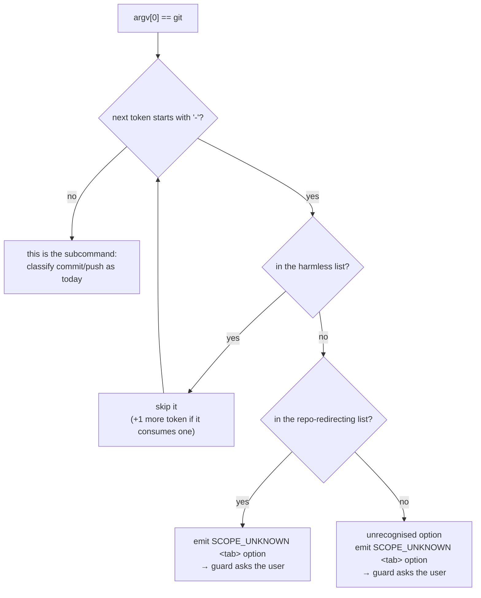

> **Gate status (2026-08-17): user said `gate confirmed`; the branch exists; the phase is deliberately
> still `planning`.** The same turn the user opened the gate, they asked for the compliance judge to be
> re-run on revision 4 first — and `implementation` forbids the spec edits a failing verdict would
> require. So the sequence is: sweep → judge → **on pass**, flip to `phase: implementation` /
> `model_tier: low` and start task 0a. Do **not** read `phase: planning` here as "the gate never
> opened"; it opened, and this is the one step held back behind it.

> **Revision 4 — the root cause, not another patch.** Round 3 failed with three more violations, all
> introduced by revision 3, and its sweep named the pattern: three revisions running had each stated a
> requirement with **no buildable path to it**, relocating the promise each time instead of building
> the capability. The reason is structural — **the harnesses cannot capture the channel this feature's
> new decision travels on.** Per user decision, revision 4 adds **groundwork tasks 0a–0c ahead of every
> behaviour task** so the message-level promises have somewhere real to live. It also fixes round 3's
> three findings: `--attr-source` moved out of the subcommand-is-seen table into its own consuming-option
> scenarios (measured: `git --attr-source commit -m x -a` errors `unknown option: -m` and commits
> nothing), task 7 re-pointed at the hook-level harnesses instead of the fact-only unit suite, and task
> 8's suite list corrected.
>
> **Revision 4.1 — the pre-dispatch sweep, run before any judge saw revision 4.** Every defect it
> found is fixed below and marked in place; the two classes were **wrong measurements** (table
> immediately below) and **requirements with no scenario that could fail on them** (`--bare`'s
> contradictory bucket, the four pathspec options, `--list-cmds`, `--paginate`, the at-most-once rule,
> the denying-fact-across-segments rule, the `PUSH*` half of fact suppression, both of `doc-guard`'s
> promises, and the 400-line limit) — plus one task, 7, whose acceptance measure could not tell the fix
> from the bug. The largest correction is to revision 4's own premise, and it is recorded here rather
> than quietly overwritten:
>
> | revision 4 claimed | measured 2026-08-17 |
> |---|---|
> | "no harness in this repo can assert what a guard *says*" | **false for `git-guard.sh`** — `assert_stderr()` (`git-guard.test.sh:252-259`) already asserts stderr text. What no harness captures is **stdout**, which is exactly where the new `ask` JSON goes: `:254` runs `bash "$HOOK" 2>&1 1>/dev/null`, keeping stderr and discarding stdout |
> | `git-guard.test.sh:347` discards both channels | `:347` is fixture code; the exit-code-only runner is `_run_case_common` at **`:226`** |
> | `doc-guard.test.sh:70` | the runner line is **`:68`** (`run_case` spans `:66-76`); doc-guard has **no** message-asserting helper at all |
> | "12 other hooks have one" | **18** hook scripts in `hooks/`, **8** `*.test.sh` suites; `merge-guard` is not among them |
> | task 1: `classify-git-command.test.py` is 236 lines | **224** lines |
>
> The groundwork is therefore *narrower and better-founded* than revision 4 stated, not unnecessary:
> git-guard needs a stdout assertion only, doc-guard needs both channels, and merge-guard needs a suite
> from nothing.
>
> **Standing rule for any future revision of this card:** before dispatching a judge, sweep every MUST
> and every contract row for (a) a task that builds it and (b) a scenario that can fail on it. Three
> rounds were lost to skipping that sweep; the fourth sweep, run before dispatch for the first time,
> caught every defect listed in the revision-4.1 block above — including one in the sweep rule's own
> justification.
>
> **Revision 3** closed the one violation revision 2 introduced —
> `writing-specs/prints-and-exits-no-enforcing-scenario`, found independently by **both** judges.
> Revision 2 stated the print-and-exit message rule as a MUST but no task built it, and the bucket-1
> Scenario Outline listed `--exec-path` while asserting the exact generic message the new rule forbids
> for it. Fixed three ways: `--exec-path` pulled into its own Outline with the differentiated message,
> a decision-invariance scenario added so the set can never leak into the *decision*, and task 3b added
> to build it. Also: `doc-guard.sh:27` corrected to `:127` (the quoted phrase lives at :127 — verified),
> and task 7's defect-table re-run is now required to become automated rather than remembered.
>
> ⚠️ **This was the second consecutive round where a prose MUST shipped with no task or scenario behind
> it.** Round 1: the merge-guard ask row. Round 2: the print-and-exit message. Different corners, one
> failure mode — a requirement is not in this spec until a task builds it and a scenario can fail on it.
>
> **Revision 2** applied the round-1 judge findings. Compliance judge returned **FAIL** on two
> violations — `writing-specs/ambiguous-merge-guard-ask` (a contract row no task could build) and
> `core-conduct/unverified-untracked-files-claim` (a "Measured" sentence whose measurement did not
> test the flag it named) — both fixed and marked in place. It also re-derived every row of the defect
> table, every pinned version, every citation and both binary strings independently, and all matched.
> Its three non-blocking findings and all four observability advisories are applied too. Nothing was
> waived.

# A global option in front of the subcommand hides the command from every guard

Four PreToolUse guards decide what a Bash command really does by reading its first two words.
Both `git` and `gh` accept their own options *before* the subcommand. When one is present the
second word is the option, the guards recognise nothing, and every check they perform is skipped.

## Spec

### Root cause

Two independent fixed-position reads, same defect:

- `hooks/lib/classify-git-command.py:148-169` — `subcommand, rest = argv[1], argv[2:]` (`:150`),
  then every fact is gated on `subcommand == "commit"` (`:152`) / `== "push"` (`:169`). A global
  option occupies `argv[1]`, no fact is emitted, and the callers' `has_fact` tests are all false.
- `hooks/merge-guard.sh:82` — `toks[i:i+3] == ["gh","pr","merge"]`, requiring the three words
  adjacent from the start.

`hooks/lib/classify-pr-command.py:38-45` already does it correctly and says why in its comment:
*"global flags are legal before the subcommand (`gh -R owner/repo pr create`)"*. It scans for an
adjacent `pr create` pair at any offset. **The fix pattern already exists in this repo; the git
reader and the merge guard never received it.**

### Measured defect — git 2.50.1, Claude Code 2.1.233, probed end-to-end

Each row ran the real hook with a `{"hook_event_name":"PreToolUse","tool_name":"Bash",...}` payload
and captured its exit code. rc=2 is a block, rc=0 is an allow.

| # | guard | protects against | plain form | with a global option | after the fix (expected) |
|---|---|---|---|---|---|
| a | `git-guard.sh` | committing to `main` | rc=2 BLOCKED | 🔴 rc=0 **ALLOWED** — `-C .`, `--work-tree=.`, `--git-dir=.git`, `-c k=v` | **rc=0 + `ask` JSON on stdout** |
| b | `git-guard.sh` | bare `--force` push | rc=2 BLOCKED | 🔴 rc=0 **ALLOWED** — `git -C . push --force` | **rc=0 + `ask` JSON on stdout** |
| c | `doc-guard.sh` | undocumented source commit | rc=2 BLOCKED | 🔴 rc=0 **ALLOWED** — `git -C . commit -m x` | **rc=0, unchanged — silent by design** |
| d | `merge-guard.sh` | `gh pr merge` | rc=2 BLOCKED | 🔴 rc=0 **ALLOWED** — `gh -R o/r pr merge 5` | rc=2 BLOCKED |
| e | `merge-guard.sh` | `gh pr merge` | — | 🔴 rc=0 **ALLOWED** — `echo hi && gh pr merge 5` (pre-existing chained gap, `rules/gates.md`) | rc=2 BLOCKED |
| f | `classify-pr-command.py` | `gh pr create` | `PR` | `PR` — unaffected; **this is the control** | `PR` — unchanged |

> 🔴 **The exit code cannot score this fix, and the last column is why.** Three of the six rows end at
> `rc=0` *after* the fix — (a) and (b) because an `ask` is delivered as exit 0 with JSON on stdout, and
> (c) because `doc-guard` deliberately stays silent so one command does not raise two prompts. A re-run
> that captures only `$?`, which is what every harness does today, shows those rows identical to the
> bug. **The acceptance measure is therefore the pair `(exit code, stdout decision)`, never the exit
> code alone** — and that pair is exactly what task 0a exists to make capturable. Revision 4 asked task
> 7 to "paste the new exit codes beside the old" against a table that had no expected-after column at
> all; the sweep added the column and re-pointed the task.

Row (a) was probed in a throwaway `git init -b main` repo so `current_branch()`'s
`git rev-parse --abbrev-ref HEAD` reports `main`, **not** by borrowing the sibling worktree that
holds `main`. Guard logic confirmed at `git-guard.sh:280` (`has_fact PUSH_FORCE`) and `:292`
(`if has_fact COMMIT && on_main; then`); with no facts both conditions are false.

> ⚠️ **These two line numbers have gone stale once already — re-run `grep -n` before trusting them.**
> Revision 2 verified them as `:142` and `:152`, correctly, on the `feature/verification-marker-gate`
> worktree. This branch was cut (`4c9a431`) *after* PR #52 merged the detached-HEAD fix into `main`,
> which inserted `checkout_desc()` and roughly 140 lines above them, so the spec arrived here carrying
> citations that now land inside an unrelated comment block. Nobody re-derived them during the move —
> a copied citation is laundered, not verified. Round 4 (`core-conduct/stale-line-citation`) caught it.
> The `classify-git-command.py` citations in this spec were re-derived at the same time and all held
> exactly (`:150`, `:152`, `:169`).

> ⚠️ **Probe-method requirement.** The payload must carry `"hook_event_name":"PreToolUse"`.
> Without it `doc-guard.sh:91-100` dispatches to `*) exit 0` and every result reads as a false
> "allowed" — this produced one wrong measurement before the baseline was checked. **Every row must
> establish that the plain form BLOCKS before its bypass is claimed** (`confirm the check can fail`).

These are **momentum guardrails, not security boundaries** — the house framing, unchanged here.
Row (e) is a pre-existing limitation being closed as a side effect, not a new discovery.

### Measured git 2.50.1 global-option grammar

Enumerated from git's own usage line (`git --help`), not from memory:

```
git [-v | --version] [-h | --help] [-C <path>] [-c <name>=<value>]
    [--exec-path[=<path>]] [--html-path] [--man-path] [--info-path]
    [-p | --paginate | -P | --no-pager] [--no-replace-objects] [--no-lazy-fetch]
    [--no-optional-locks] [--no-advice] [--bare] [--git-dir=<path>]
    [--work-tree=<path>] [--namespace=<name>] [--config-env=<name>=<envvar>]
    <command> [<args>]
```

**Value-consuming — the space form works, so the next token is the value, not the subcommand.**
Verified by running `git <opt> <val> rev-parse --is-inside-work-tree`; all four returned `true` for
both the space and the `=` spelling:

| option | space form | `=` form |
|---|---|---|
| `--git-dir` | consumes | attached |
| `--work-tree` | consumes | attached |
| `--namespace` | consumes | attached |
| `-C`, `-c`, `--config-env` | consumes | `-c`/`--config-env` carry `name=value` as one token |

**Attach-only — must never consume the next token.** `--exec-path` is the one global option of this
shape, and it is the same trap that produced this feature's parent waiver. Measured:

| command | result |
|---|---|
| `git --exec-path commit -m x -a` | **no commit** — git prints the exec path and stops |
| `git --exec-path=/some/path commit -m x -a` | **the commit happens** |

So a classifier that wrongly assumed `--exec-path` consumes its next token would swallow the word
`commit`. It is safe either way *only because* the bare form never runs the subcommand — that is a
measured fact, not a reason to skip the distinction.

**No value:** `-v --version -h --help --html-path --man-path --info-path` (each prints and exits,
never running the subcommand), `-p --paginate -P --no-pager --no-replace-objects --no-lazy-fetch
--no-optional-locks --no-advice`, `--bare`.

> ⚠️ **"Takes no value" and "is harmless" are different questions, and `--bare` answers them
> differently.** It consumes no token, so it belongs in this list; it also redirects the repository, so
> it is **bucket 2**, not bucket 1. Measured — in a fresh non-bare `git init -b main` repo,
> `git --bare rev-parse --is-inside-work-tree` returns `fatal: not a git repository:
> '/private/tmp/gob-probe'`: the option makes git read the *current directory itself* as the git dir,
> so the repo the guard inspected is not the repo the command acts on. Revision 4 let the bucket-1
> sentence below say "the no-value list above", which silently swept `--bare` into bucket 1 and
> contradicted the bucket-2 list two paragraphs later. Caught by the revision-4.1 sweep.

**The synopsis is not the whole list — six more come from `man git`.** Found by diffing the manual
page's option list against the synopsis above; the count is measured, not estimated:

| option | value? | bucket | why |
|---|---|---|---|
| `--literal-pathspecs` | no | **2 — ask** | changes how a pathspec is interpreted, and `git-guard`'s documentation-only exemption is decided *from* the pathspec |
| `--glob-pathspecs` | no | **2 — ask** | same |
| `--noglob-pathspecs` | no | **2 — ask** | same |
| `--icase-pathspecs` | no | **2 — ask** | same |
| `--attr-source` | **consumes** | 1 — skip | selects where attributes are read from; cannot change the target repo. Must still be listed, or it eats the subcommand |
| `--list-cmds` | attached (`=<group>`) | 1 — skip | prints a command list and exits |

> The pathspec-modifying four are in bucket 2 rather than bucket 1 on purpose. They do not redirect
> the repository, but `git-guard.sh` decides its documentation-only exemption by string-matching the
> pathspecs the classifier reports, and these options change what those strings *mean* to git. That
> is a mismatch we cannot model, so it goes to the user. Cheap, for the same asymmetry argument.
>
> **This list will still go stale**, and that is survivable by construction: bucket 3 asks on any
> unrecognised option, so a global option added by a future git lands in "ask", never in "allow".
> The compliance judge confirmed this absorbs the gap with no silent allow — the only cost is an
> occasional extra prompt.

### The rule — three buckets, decided by what the option can do to the target repo



**Bucket 1 — skip, then read the subcommand normally.** The no-value list above **minus `--bare`**,
plus `--exec-path`, `--attr-source` (consuming) and `--list-cmds` (attached). None of them changes
which repository is acted on. Bucket 1 is the only bucket whose mistakes are silent, so **every member
is enumerated by a test, never by this prose** — the two Examples tables in the Scenarios section carry
all of them (`--list-cmds` in both spellings sits in the print-and-exit table) except `--attr-source`,
which consumes a value and so cannot use either table's shared template; it has two standalone
scenarios instead. If an option is named here but appears in no scenario at all, that is the defect,
not a shorthand.

**Bucket 2 — refuse and ask: `-C`, `--git-dir`, `--work-tree`, `--namespace`, `--bare`, `-c`,
`--config-env`, `--literal-pathspecs`, `--glob-pathspecs`, `--noglob-pathspecs`, `--icase-pathspecs`.**
The first seven can point git at a different repository; the four pathspec options change what a
pathspec *means*, which is the string `git-guard` reads to decide its documentation-only exemption
(the option table above already assigned them here — revision 4 then left them out of this sentence
and out of every Examples table, so nothing could fail if an implementer read the sentence instead of
the table). The guards decide from the
*current* folder's branch and the *current* index, so continuing would inspect the wrong repo — a
check that reports confidently on the wrong subject is worse than today's visible hole.

> **Why `-c` and `--config-env` sit here — the one judgement call.** `git -c user.name=x commit` is
> plainly harmless, and refusing it is mildly annoying. But `-c` sets arbitrary configuration,
> including `core.worktree`, so it *can* redirect the target. Enumerating "dangerous config keys"
> would be a second incomplete list, which is the trap this whole feature exists to escape.
> **Being conservative is affordable precisely because refusing means asking, not walling off:**
> over-refusing costs one keystroke, under-refusing is a silent hole. That asymmetry is the whole
> argument, and it only holds while the refusal is an `ask` — if it ever degrades to a hard `deny`,
> revisit this bucket.

**Bucket 3 — refuse and ask: any unrecognised token starting with `-` before the subcommand.** Git
honours unambiguous abbreviations (`--work-tre` == `--work-tree`), so a list of exact spellings can
never be complete. This mirrors the existing `COMMIT_SAFE_FLAGS` reasoning at
`classify-git-command.py:90-105` — unrecognised means "cannot tell", and cannot-tell must not mean
allow.

### Contract — the new fact

`classify-git-command.py` gains exactly one fact, following the established tab convention that
keeps a value out of a second parser (`COMMIT_PATH<tab><path>`):

```
SCOPE_UNKNOWN<tab><the option that triggered it>
```

Emitted **at most once per line**, from the first triggering option, and it is a **denying** fact
under the module's existing granting/denying rule (`classify-git-command.py:31-40`): true of any one
segment is enough. When `SCOPE_UNKNOWN` is present, no `COMMIT*`/`PUSH*` fact is emitted for that
segment — the reader is stating that it could not determine what the segment does.

Carrying the option name lets the guard name it in the prompt, so the user is told *which* four
characters caused the question.

### Contract — how a refusal reaches the user

Confirmed capability, from the installed binary's own validation error (Claude Code **2.1.233**):

```
Valid types are: allow, deny, ask, defer
```

> ⚠️ **`https://code.claude.com/docs/en/hooks` is wrong on this point** — a fetch of it reported that
> only `allow` and `deny` exist. The binary is authoritative. Do not "correct" this back.

Hooks still run when permission prompts are bypassed — verbatim from the same binary:
*"canUseTool will not be invoked: permissionMode 'bypassPermissions' auto-approves every tool call
(except explicit deny rules) before the callback is consulted. To gate every tool call, use a
PreToolUse hook instead."*

On `SCOPE_UNKNOWN` a guard writes this to **stdout** and exits **0**:

```json
{"hookSpecificOutput":{"hookEventName":"PreToolUse","permissionDecision":"ask",
 "permissionDecisionReason":"<plain-English reason naming the option>"}}
```

**Only `git-guard.sh` ever asks. This is deliberate and the other two are different mechanisms:**

| guard | on a cannot-tell case | why |
|---|---|---|
| `git-guard.sh` | **ask** | `SCOPE_UNKNOWN` exists only here; it cannot tell which repo or branch is targeted |
| `doc-guard.sh` | stay silent (exit 0, as today) | it already fails open by design (`doc-guard.sh:127`, "a missing note is not worth blocking work over"), and `git-guard` is already prompting on the same command — two prompts for one command is noise |
| `merge-guard.sh` | **never asks — keeps `exit 2`** | see below |

> **`merge-guard.sh` has no cannot-tell state, and must not be described as if it did.**
> `SCOPE_UNKNOWN` is a fact of the *git* reader. The merge guard's fix is entirely different: it
> adopts the `gh` reader's adjacent-pair scan (tasks 5–6), which either finds `pr merge` in a segment
> or does not. There is no third outcome to ask about, so no trigger and no emission exist for it.
> Its refusal stays the current hard `exit 2` with the existing `MERGE_EXEMPT=<reason>` escape hatch.
> **Revision 2 correction:** revision 1's contract table promised an `ask` here that no task built and
> no trigger defined — an implementer could not have satisfied it. Caught by the compliance judge as
> `writing-specs/ambiguous-merge-guard-ask`.

`doc-guard.sh` still benefits: on **bucket 1** it now *sees* the commit it was previously blind to,
so `git --no-pager commit …` gets the documentation check it always should have had.

**Existing hard blocks are unchanged.** Committing to `main`, a bare force push, and `gh pr merge`
keep their current `exit 2` refusal. Only the new cannot-tell case becomes an `ask`. This is the
narrow reading of the instruction "refuse it but always prompt for that option" — widening it would
downgrade three working protections into dismissible prompts.

### Scenarios

```gherkin
Feature: a global option must not hide the subcommand

  Scenario Outline: a harmless global option is skipped and the command is still seen
    Given a repository whose current branch is "main"
    When the hook inspects "git <option> commit -m x -- app.js"
    Then git-guard refuses with exit 2 for committing to main
    And no SCOPE_UNKNOWN fact is emitted

    Examples:
      | option               |
      | --no-pager           |
      | -p                   |
      | --paginate           |
      | --no-optional-locks  |
      | --no-advice          |
      | --no-replace-objects |
      | --no-lazy-fetch      |
      | -P                   |

  # Every option in the table above is bucket 1, takes NO value, and does NOT suppress the
  # subcommand. Three neighbouring sets must stay out of it, and each has its own scenario:
  #   * the four pathspec-modifying options are bucket 2 (ask) — git-guard's docs-only
  #     exemption is decided from pathspec strings, which they change the meaning of;
  #   * the print-and-exit options refuse with a DIFFERENT message;
  #   * --attr-source and --list-cmds do not fit "no value".
  # Revision 4 first wrote --glob-pathspecs here, which contradicted this spec's own bucket
  # table — the fourth instance of this defect class, caught by the pre-dispatch sweep rather
  # than by a judge. Check an option's bucket before adding it to any Examples table.

  # --attr-source must NOT be in the table above: it CONSUMES the next token, so in
  # `git --attr-source commit …` the word `commit` is its value, not the subcommand.
  # Measured (git 2.50.1): `git --attr-source commit -m x -a` → git errors
  # `unknown option: -m` and commits NOTHING. Revision 3 put it in that table and
  # asserted an outcome that cannot occur.
  Scenario: a value-consuming harmless option takes the next token, not the subcommand
    When the hook inspects "git --attr-source .gitattributes commit -m x -- app.js"
    Then ".gitattributes" is consumed as the option's value
    And the subcommand resolves to "commit"
    And a COMMIT fact is emitted
    And ".gitattributes" is never treated as a subcommand or a pathspec

  Scenario: a consuming option with the subcommand as its value commits nothing
    When the hook inspects "git --attr-source commit -m x -- app.js"
    Then no COMMIT fact is emitted, because git itself would run no commit

  # --exec-path is deliberately NOT in the table above. It is in PRINTS_AND_EXITS, so the
  # refusal is the same but the MESSAGE must differ. Sharing that Outline's `Then` would
  # assert the very generic message the rule forbids for it.
  Scenario Outline: a print-and-exit option is still refused, but told the truth about why
    Given a repository whose current branch is "main"
    When the hook inspects "git <option> commit -m x -- app.js"
    Then git-guard refuses with exit 2
    And the message says the command carries an option that prints and exits
    And the message does NOT claim the commit was blocked for targeting main
    And no SCOPE_UNKNOWN fact is emitted

    Examples:
      | option           |
      | --exec-path      |
      | --version        |
      | -v               |
      | --help           |
      | -h               |
      | --html-path      |
      | --man-path       |
      | --info-path      |
      | --list-cmds      |
      | --list-cmds=main |

  # This one is a MUTATION ROUND, not a runtime switch — the distinction is the whole point.
  # Round 3 cited the earlier wording (writing-specs/message-assertions-no-test-harness) because
  # "when PRINTS_AND_EXITS is emptied" implied an override the guard does not have and must not
  # grow: an env var that empties the set would be a production seam whose only purpose is to
  # make a test pass. The house already solves this by hand-mutating the source and restoring it:
  # docs/features/git-guard-detached-head.md:743-785, whose :755 is the explicit restore step
  # ("Restored the file after each mutation and confirmed `diff` against the pre-mutation copy").
  # Revision 4 left this half of that violation unfixed; the 4.1 sweep caught it before a second
  # citation.
  #
  # Round 5 cited a SECOND precedent here, memsearch-freshness.md:1282, which is now dropped —
  # and the reason is worth more than the citation was. On this branch :1282 really is that file's
  # "Mutation check: 8 mutations, 7 caught" bullet, so the judge's stated evidence was wrong; but
  # it read $HOME/.claude's copy of the same path, where another session's in-flight branch puts
  # different text on that line (1915 lines there vs 2390 here). Two things follow. The bullet at
  # :1282 shows mutation but never narrates a RESTORE, so it only half-supported the claim anyway.
  # And a citation into another branch's live document resolves differently depending on which
  # checkout the reader has open, which no amount of re-deriving can fix. Rule: cite precedent
  # from THIS worktree, and prefer a document already merged to main.
  Scenario: the print-and-exit set changes the message only, never the decision
    Given a repository whose current branch is "main"
    When PRINTS_AND_EXITS is emptied in the source and the suite is re-run
    Then every message assertion in the print-and-exit Outline fails
    And not one decision assertion in either Outline changes
    And the source is restored and diffed clean against its pre-mutation copy

  Scenario Outline: a repo-redirecting global option is refused and put to the user
    Given a repository whose current branch is "main"
    When the hook inspects "git <option> commit -m x -- app.js"
    Then the classifier emits "SCOPE_UNKNOWN\t<option>" and no COMMIT fact
    And git-guard writes permissionDecision "ask" to stdout and exits 0
    And the reason text names <option>

    Examples:
      | option             |
      | -C                 |
      | --git-dir          |
      | --work-tree        |
      | --namespace        |
      | --bare             |
      | -c                 |
      | --config-env       |
      | --literal-pathspecs |
      | --glob-pathspecs   |
      | --noglob-pathspecs |
      | --icase-pathspecs  |

  # The four pathspec options are bucket 2 and only this table can prove it. The option
  # table assigned them there in revision 3; revision 4 left them out of the bucket-2 prose
  # list AND out of every Examples table, so an implementer who put them in bucket 1 would
  # have passed the whole suite. Note `-C` and `--git-dir` need a value, so the rows above
  # that consume one are exercised again by the dedicated value-consuming scenario below;
  # here the bare spelling is enough because SCOPE_UNKNOWN fires before any value is read.

  Scenario: an abbreviated option nobody enumerated is still refused
    When the hook inspects "git --work-tre=/tmp commit -m x -- app.js"
    Then the classifier emits SCOPE_UNKNOWN naming "--work-tre"
    And git-guard asks rather than allowing

  Scenario: the attach-only option must not swallow the subcommand
    When the hook inspects "git --exec-path commit -m x -- app.js"
    Then the subcommand resolves to "commit", not to a consumed value
    And a COMMIT fact is emitted

  Scenario: a value-consuming option must not leave its value as the subcommand
    When the hook inspects "git --git-dir /tmp/x commit -m y -- app.js"
    Then "/tmp/x" is consumed as the option's value
    And SCOPE_UNKNOWN is emitted for "--git-dir"
    And "/tmp/x" is never treated as a subcommand or a pathspec

  Scenario: force-push protection survives a global option
    When the hook inspects "git -C . push --force"
    Then git-guard writes permissionDecision "ask" to stdout and exits 0
    And the reason names "-C"
    And no PUSH or PUSH_FORCE fact is emitted

  # The contract says SCOPE_UNKNOWN suppresses "COMMIT*/PUSH*" facts, but revision 4 only
  # ever asserted the COMMIT half. The PUSH assertion above is the other half. Both added
  # by the revision-4.1 sweep.

  # The contract also says the fact is emitted AT MOST ONCE PER LINE, from the FIRST
  # triggering option — stated in the contract and in the accepted limits, asserted nowhere.
  # No scenario used a command with two triggering options, so an implementation emitting
  # one fact per option would have passed the entire suite.
  Scenario: two repo-redirecting options produce exactly one fact, naming the first
    When the hook inspects "git -c a=b -C /x commit -m x -- app.js"
    Then exactly one SCOPE_UNKNOWN fact is emitted for the line
    And it names "-c", not "-C"

  # SCOPE_UNKNOWN is a DENYING fact (classify-git-command.py:31-40): true of any one segment
  # is enough for the whole line. Every other scenario on this card is single-segment, so
  # nothing could fail if an implementer required the trigger to be in the first segment.
  Scenario: a redirecting option in a later segment still denies the whole line
    Given a repository whose current branch is "main"
    When the hook inspects "echo hi && git -C /x commit -m x -- app.js"
    Then SCOPE_UNKNOWN is emitted for "-C"
    And git-guard writes permissionDecision "ask" to stdout and exits 0

  Scenario: a granting fact in one segment cannot cancel another segment's SCOPE_UNKNOWN
    Given a repository whose current branch is "main"
    When the hook inspects "git commit -m a -- docs/a.md && git -C /x commit -m b -- app.js"
    Then SCOPE_UNKNOWN is emitted for "-C"
    And git-guard writes permissionDecision "ask" to stdout and exits 0
    And the documentation-only exemption earned by the first segment does not allow the line

  Scenario Outline: SCOPE_UNKNOWN asks on ANY branch, not only on main
    Given a repository whose current branch is "<branch>"
    When the hook inspects "git -C . commit -m x -- app.js"
    Then git-guard writes permissionDecision "ask" to stdout and exits 0

    Examples:
      | branch          |
      | main            |
      | feature/example |

  Scenario Outline: the merge guard sees through globals and through chaining
    When the hook inspects "<command>"
    Then merge-guard refuses with exit 2
    And it does NOT write a permissionDecision to stdout

    Examples:
      | command                    |
      | gh pr merge 5              |
      | gh -R o/r pr merge 5       |
      | echo hi && gh pr merge 5   |

  Scenario: the merge guard's existing escape hatch still works after the rewrite
    When the hook inspects "MERGE_EXEMPT=intentional gh -R o/r pr merge 5"
    Then merge-guard allows it and names the exemption reason on stderr

  Scenario: an existing hard block is not downgraded to a prompt
    Given a repository whose current branch is "main"
    When the hook inspects "git commit -m x -- app.js"
    Then git-guard exits 2
    And it does not write a permissionDecision to stdout

  # doc-guard has two promises on this card and revision 4 gave neither a scenario: it must
  # newly SEE bucket-1 commands, and it must stay silent on SCOPE_UNKNOWN rather than adding
  # a second prompt to git-guard's. Both are behaviour changes in a hook whose failure mode
  # is over-blocking real commits. Added by the revision-4.1 sweep.
  Scenario: doc-guard newly sees a commit hidden behind a harmless global option
    Given a substantial source change is staged with no documentation
    When the hook inspects "git --no-pager commit -m x"
    Then doc-guard refuses with exit 2 for the missing documentation

  Scenario: doc-guard stays silent on a cannot-tell command
    Given a substantial source change is staged with no documentation
    When the hook inspects "git -C . commit -m x"
    Then doc-guard exits 0
    And it does not write a permissionDecision to stdout
    And git-guard is the only guard that prompts for this command
```

Fixtures must be built so a **wrong** implementation disagrees: write the harmless, redirecting and
unrecognised cases from the Examples tables above, never hand-copied, and include at least one case
per bucket whose outcome flips if the bucket assignment is wrong.

### Where the code lives

- **`hooks/lib/shell_segments.py` is not touched.** It splits one line into separate commands;
  understanding one command's options is a different job. The earlier note claiming this work must
  live there was written before anyone checked — a git option grammar already exists in
  `classify-git-command.py:79-110`, and that is where this belongs.
- **`hooks/lib/classify-git-command.py`** gains the three global-option tables and a
  `resolve_subcommand(argv)` helper returning `(subcommand, rest, blocking_option)`. Currently 198
  lines; the addition must keep it under the 400-line house limit.
- **`hooks/lib/classify-pr-command.py`** is generalised so the adjacent-pair scan takes the pair as
  a parameter, then **`merge-guard.sh` drops its inline Python and calls the shared reader.** This
  is the DRY win: one `gh` reader with two callers, and because the shared reader already uses
  `segments()`, row (e)'s chained-command gap closes with it.

### Traceability, and how we would know this went wrong

Both raised by the observability judge on revision 1 and answered here rather than deferred.

**Durable trace — decided: no log file.** The house convention for a guard recording *why* it acted
is stderr, not a file: `merge-guard.sh:93`, `judge-guard.sh:230` and `feature-sync-guard.sh:136` all
`printf … >&2`. These hooks run on **every Bash tool call**, so a file would need rotation and would
be the highest-volume artifact in the repo, for an event that should be rare. The record is therefore
the `permissionDecisionReason` — which names the triggering option and is what the user actually
reads — plus the same line on stderr.

> ⚠️ **Unverified:** whether stderr from a hook that exits **0** (the JSON path) is surfaced anywhere,
> as opposed to stderr from an `exit 2`, which demonstrably is. Task 3 must check this and say so. If
> it is swallowed, the prompt reason is the *only* record and this section says so plainly rather than
> implying a trace that does not exist.

**Blast radius and rollback.** Three hooks change: `git-guard.sh` gains a new decision path,
`doc-guard.sh` starts seeing commands it was blind to, and `merge-guard.sh` is rewritten onto the
shared reader. The risk is not symmetric:

| change | if it is wrong | how it shows up |
|---|---|---|
| `git-guard.sh` ask path | over-asking | prompts on ordinary commands — loud, immediate, self-reporting |
| `doc-guard.sh` newly sighted | over-blocking | commits refused that used to pass; the message already explains itself |
| `merge-guard.sh` rewrite | **under-blocking** | silent — a merge that should have been refused just works |

The merge guard is the one that fails quietly, so task 6 must prove the *old* behaviour still holds
(`gh pr merge 5` blocked, `MERGE_EXEMPT` honoured) before its new cases are accepted — not only that
the new cases pass. Rollback is per-hook: each change is independent, and reverting one file restores
that guard's previous behaviour without touching the others. Task 7's re-run of the defect table is
the acceptance gate; the same table re-run later is the regression signal.

### Accepted limits — stated, not discovered

- **Bucket 1 can produce a false denial on a command that would never have run.** Several of the
  no-value options *print and exit* rather than running the subcommand: `git --version commit -m x`
  does nothing at all, but after skipping `--version` the reader sees `commit` and `git-guard` will
  refuse it on `main`. Accepted: the fail direction is toward blocking, these shapes are vanishingly
  rare, and modelling "which options suppress the subcommand" is a fourth list that would rot.

  **But the refusal must not lie about why.** Today's message would say the commit was blocked for
  targeting `main`, which is not what happened — the command commits nothing. The affected options are
  therefore named in a `PRINTS_AND_EXITS` set used **only** to select the message, never to change
  the decision: the refusal still fires, and its text says the command carries a git option that
  prints and exits, so nothing would have been committed. Decision unchanged, diagnosis honest.

  The set is exactly `-v --version -h --help --html-path --man-path --info-path`, bare `--exec-path`,
  and **`--list-cmds` in both spellings** — the last added by the revision-4.1 sweep, which found it
  described as "prints a command list and exits" in the option table yet absent from this set and from
  every Examples table, so no test could have failed on it. Measured (git 2.50.1): `git --list-cmds=main
  rev-parse --is-inside-work-tree` prints the command list and never runs `rev-parse`; the bare
  `git --list-cmds rev-parse …` errors `unknown option: --list-cmds` and also never runs it. The two
  forms fail differently but neither reaches the subcommand, which is the only property this set
  encodes — so the set's invariant is stated as **"git never reaches the subcommand"**, not literally
  "prints".
  (Raised by the observability judge; a refusal nobody can explain is a refusal people learn to
  route around.)
- **`--exec-path=<path>` stays in bucket 1 though it can substitute git's helper binaries.** That is
  a different threat from the one these hooks address — the guard's question is *which repository and
  branch*, not *which binaries*. Consistent with the house framing of these hooks as momentum
  guardrails, not security boundaries. If that framing ever changes, this line is the one to revisit.
- **`SCOPE_UNKNOWN` reports only the first triggering option.** `git -c a=b -C /x commit` names
  `-c`. Enough to explain the prompt; enumerating all of them adds noise, not information.

### Out of scope

- **The parent waiver's wording is *resolved* here but *edited* elsewhere.** This spec plus ADR 0029
  is the authoritative answer to `writing-specs/command-grammar`. The actual edit to
  `docs/features/verification-marker-gate.md:781-796` happens **on that branch when it resumes** —
  its frontmatter freezes its spec (`revision_status: complete`), so changing it from here would
  breach its own phase gate. That card's waiver text already anticipates this: *"The decision is
  made once, in the shared lexer, and this section then cites it rather than restating it."*
- **`--untracked-files` on `git commit`: already safe in practice — but not for the reason revision 1
  gave.** Corrected in revision 2 after the compliance judge re-ran it
  (`core-conduct/unverified-untracked-files-claim`). The two flags behave *differently*:

  | command | facts | effect |
  |---|---|---|
  | `git commit -m x -u -- app.js` | `COMMIT COMMIT_BARE_ARGS` | blocked — `-u` (`--untracked-files`) is in neither table |
  | `git commit -m x -S -- app.js` | `COMMIT COMMIT_PATH app.js COMMIT_PATHSPEC` | **allowed and scoped — `-S` is not blocked** |

  `-S` **is** in `COMMIT_SAFE_FLAGS` (`classify-git-command.py:104`) — it is `--gpg-sign`'s short
  form, and has nothing to do with `--untracked-files`, whose short form is `-u`. Revision 1 claimed
  both were absent from both tables and labelled that "Measured, not assumed"; the measurement it
  rested on (`git commit -m msg -S foo.sh` → `COMMIT_BARE_ARGS`) was a *true number with an invented
  explanation* — the block came from `foo.sh` being a stray token with no `--`, not from `-S`. The
  scoping conclusion survives, because `-u` really does block; the stated mechanism did not.
  No behaviour change required either way.
- The four dormant unregistered hooks (`rules/gates.md`) stay dormant.
- `--allow-dangerously-skip-permissions` vs `--dangerously-skip-permissions` — two distinct real
  flags per `claude --help`; the practical difference is unchased and is not this feature's problem.

### Pinned versions

git **2.50.1** (Apple Git-155), Python **3.9.6**, bash **3.2.57**, shellcheck **0.11.0**,
awk **20200816** (BSD), Claude Code **2.1.233**. Every measurement in this spec was taken on these.

> ⚠️ A dated measurement in a spec is a liability with a fuse. **Re-derive, never re-read** — the
> option tables and the `Valid types are:` string are both version-bound.

## Tasks

### Groundwork — must land before any behaviour task

> **Why these exist, and why they are first.** Three consecutive revisions of this card shipped a
> requirement with no way to check it: **the `ask` decision this feature introduces travels on stdout,
> and no harness in this repo captures stdout.** Measured 2026-08-17 — per-harness, because they are
> not in the same state and revision 4 wrongly said they were:
>
> | harness | exit code | stderr | stdout |
> |---|---|---|---|
> | `hooks/git-guard.test.sh` | `_run_case_common` `:226` | ✅ `assert_stderr` `:252-259` | ❌ `:254` runs `2>&1 1>/dev/null` — stdout thrown away |
> | `hooks/doc-guard.test.sh` | `run_case` `:66-76`, `:68` | ❌ none | ❌ `:68` runs `>/dev/null 2>&1` |
> | `hooks/merge-guard.test.sh` | **file does not exist** | — | — |
>
> So the groundwork is three different jobs, not one: git-guard needs a **stdout** helper beside the
> stderr one it already has, doc-guard needs **both** channels, and merge-guard needs a suite from
> nothing — `hooks/` holds **18** hook scripts and **8** `*.test.sh` suites, and the one guard this
> spec names as its only *silent* failure mode is not among them. (Revision 4 claimed no harness could
> assert any message and cited `git-guard.test.sh:347`, `doc-guard.test.sh:70`, and "12 other hooks";
> all four figures were wrong. Corrected by the revision-4.1 sweep. The conclusion — build the
> groundwork first — survives; the reasoning behind it did not.)
>
> Patching the wording a fourth time would relocate the problem again. **User decision: build the
> missing groundwork first.**

- [ ] 0a. Give both hook harnesses a **stdout** assertion, and doc-guard a stderr one.
      `git-guard.test.sh` already asserts stderr (`assert_stderr`, `:252`) — model the new
      `assert_stdout_json` on it, and do **not** rewrite `assert_stderr`, whose `1>/dev/null` is
      deliberate. `doc-guard.test.sh` has neither and needs both. **Put the shared bodies in one place**
      (a `hooks/lib/guard_test_helpers.sh` sourced by all three suites) rather than pasting them into
      three files — task 0b needs the identical helpers, and three copies is the DRY violation this
      repo keeps paying for. Every existing case must keep passing unchanged — prove that before
      adding a single new case.
- [ ] 0b. Create `hooks/merge-guard.test.sh`, which has never existed, using 0a's shared helpers. Pin
      **today's** behaviour first: `gh pr merge 5` → exit 2, `MERGE_EXEMPT=<reason> gh pr merge 5` →
      allowed with the reason on stderr, an ordinary `git merge` → untouched. This is the baseline the
      rewrite in task 6 must not break, and without it that rewrite has no safety net at all.
- [ ] 0c. Confirm where these suites actually run (a runner script, a git hook, or by hand) and
      record the answer here. If nothing runs them automatically, say so plainly rather than
      implying coverage that no one executes.

### Behaviour

- [ ] 1. Red: extend `hooks/lib/classify-git-command.test.py` (exists; **224** lines at `a5de681` —
      re-run `wc -l`, do not trust this number, revision 4's said 236) with the Examples-driven cases
      above; confirm it fails for the stated reason and record the split.
      **Scope note:** this suite tests the fact output only — it never runs a hook and never checks an
      exit code (its own docstring). Hook-level cases belong in the 0a/0b harnesses, not here.
- [ ] 2. Green: `resolve_subcommand()` + the three tables in `classify-git-command.py`; emit
      `SCOPE_UNKNOWN<tab><option>` **at most once per line, naming the first triggering option**, and
      suppress every `COMMIT*`/`PUSH*` fact for a segment that triggers it — both halves have
      scenarios above, and both were previously contract-only. Check `wc -l` on the file afterwards:
      198 lines at `a5de681`, house limit 400.
- [ ] 3. Red then green: `git-guard.sh` emits the `ask` JSON on `SCOPE_UNKNOWN`, on **every branch**
      (the check must NOT be nested inside the `if has_fact COMMIT && on_main; then` block —
      `git-guard.sh:292` at `b9c5c9c`, but **`grep -n` it rather than trusting the number**, this
      file has already moved ~140 lines once mid-spec), and keeps every existing
      `exit 2` path byte-identical in behaviour. Also settle the open question above: **is stderr from
      an exit-0 hook surfaced at all?** Record the answer in this card either way.
- [ ] 3b. **The `PRINTS_AND_EXITS` message rule gets built, not just written.** Add the set to
      `git-guard.sh` — exactly `-v --version -h --help --html-path --man-path --info-path`, bare
      `--exec-path`, and `--list-cmds` in both spellings — wire it to the refusal *message* only, and
      land the two scenarios above with it. The set's invariant is "git never reaches the subcommand",
      which is why bare `--list-cmds` belongs in it even though it errors rather than printing.
      **The decision-invariance scenario is the load-bearing one, and it is a hand-run mutation
      round — do NOT add an env var or any other runtime seam to empty the set.** Empty it in the
      source, re-run, record that every message assertion failed and no decision assertion moved,
      then restore and `diff` against the pre-mutation copy. That is what stops a later edit from
      wiring the set into the decision, and it is the house pattern
      (`docs/features/git-guard-detached-head.md:743-785`). Round 3 cited the previous wording for
      implying an override the guard does not have; revision 4 fixed the other half of that finding
      and left this half, which is why it is spelled out here.
      Revisions 1 and 2 each shipped a prose MUST with no task behind it; both judges caught this one
      independently. Do not repeat it a third time.
- [ ] 4. `doc-guard.sh`: bucket-1 commands become visible; `SCOPE_UNKNOWN` stays exit 0.
- [ ] 5. Generalise `classify-pr-command.py` to a parameterised pair; prove `pr create` behaviour is
      unchanged before switching any caller.
- [ ] 6. `merge-guard.sh` calls the shared reader. **Prove the OLD behaviour first** — `gh pr merge 5`
      still exit 2, `MERGE_EXEMPT=<reason>` still honoured — then that rows (d) and (e) stop being
      allowed. This is the one guard whose failure mode is silent under-blocking.
- [ ] 7. Re-run the full defect table from this spec and paste the result beside the old — **as the
      pair `(exit code, stdout decision)`, not the exit code alone.** Rows (a), (b) and (c) all end at
      `rc=0` after the fix, so an exit-code-only re-run cannot distinguish the fix from the bug; the
      table's "after the fix (expected)" column is the thing being matched. This is why 0a comes first.
      **Then make it stop being a manual ritual:** encode the rows as cases in the **hook-level**
      harnesses from 0a/0b — rows (a)(b) in `git-guard.test.sh`, row (c) in `doc-guard.test.sh`, rows
      (d)(e) in the new `merge-guard.test.sh`, and row (f) as a control in
      `classify-pr-command.test.py`. **Not** in the task-1 suite: that file tests fact output only and
      cannot host 5 of the 6 rows. A table only a human re-runs is not a regression signal.
- [ ] 8. Dependent suites green: `git-guard`, `doc-guard`, **`merge-guard` (new, from 0b)**,
      `phase-guard`, `shell_segments`, `classify-git-command`, `classify-pr-command`, `judge-guard`,
      plus the replay harness.
- [ ] 9. ❗🔴 **BLOCKING manual acceptance test — user-run, cannot be automated, and the feature is
      NOT done without it.** Confirm an `ask` decision really raises an interactive prompt **under the
      permission mode this repo's sessions actually launch with** — note that the user's shell alias
      carries `--allow-dangerously-skip-permissions`, so testing under a default-permissions session
      would prove the wrong thing. Two sub-checks, both required:
      - 9a. the prompt appears, and its text names the triggering option;
      - 9b. declining the prompt actually stops the command.

      Hooks *running* under bypassed permissions is proven (binary quote above); `ask` *prompting* is
      not, and **no automated test can ever close this** — it is the one claim in this feature that
      needs a human eye. If the prompt is swallowed or auto-approved: fall back to `deny` whose
      message always names the exact command to proceed (existing `MERGE_EXEMPT=<reason>` pattern),
      **and revisit bucket 2** — its conservatism is only affordable while refusing means prompting.
      Ticking this task requires pasting what was observed, not asserting that it passed.
- [ ] 10. **ADR 0029** — the three-bucket rule and why cannot-tell asks instead of allowing.
      Number checked against `origin/main` (highest there is 0026); 0027 belongs to the paused
      marker-gate branch and 0028 is reserved for its renumber.
- [ ] 11. Observability judge, then PR.

## Verification

<Appended during review: pass/fail per area and open issues only.>
