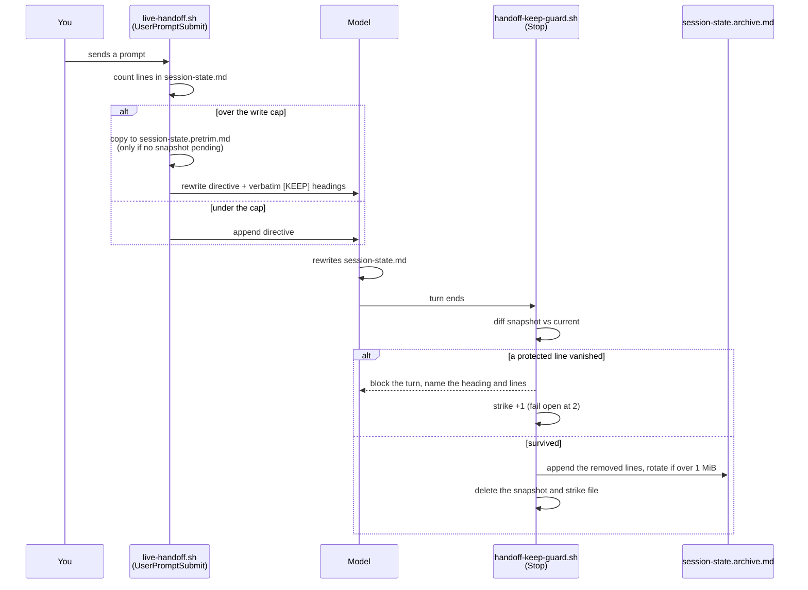

# Handoff trim safety — stop the session notepad losing facts

## Problem

`.claude/session-state.md` is the machine-local notepad the next session reads after a
`/clear`. It has a hard line ceiling, and the only mechanism for staying under that ceiling
is asking the model to delete text. Nothing decides what is safe to delete, nothing records
what was deleted, and nothing keeps a copy. A trim is silent and one-way.

Reported by the user 2026-09-08 as drift in `vibe-scape` after a pre-clear handoff.

### Measured evidence (2026-09-08)

Two independent limits, set by different hooks that do not know about each other:

| Limit | Location | Value | Behaviour past it |
|---|---|---|---|
| Write | `hooks/handoff/live-handoff.sh:47` | 80 lines (no task/bug marker file) | Directive flips from append to `Rewrite… Be ruthless`, target 60 (`:90`, `:96`) |
| Read | `hooks/handoff/slim-session-start.sh:18` | 8192 bytes | Prints header, **omits the entire body** (`:84-88`) |

Write ceilings vary by marker file (`live-handoff.sh:39-49`): none → 80/60,
`current-task.md` → 100/80, `current-bug.md` → 120/100.

Byte-per-line rate across all 12 `session-state.md` files on this machine: **57–78 b/line**
(median ~61). Therefore 150 lines is 8,550–11,700 bytes — over the 8192 read cap at every
rate in the measured range. Raising the write cap alone would move repos from partial loss
to total loss.

Population survey, 12 files across 6 repos. Two already in failure:

- `~/Other Docs/mtg-wizard/.claude/session-state.md` — **235 lines / 13,455 bytes, mtime
  2026-09-08 10:42 (active)**. 3x over the write cap, so every turn has been issuing the
  ruthless-trim directive and it is demonstrably not being obeyed; 64% over the read cap,
  so its handoff body is already being dropped whole at session start.
- `~/Other Docs/AI/AI_Projx/vibe-scape/.claude/session-state.md` — 75 lines / 5,165 bytes.
  Five lines from a forced 25% cut.

### Contributing causes

1. **No overflow destination.** Past the ceiling, deletion is the only way back under it.
2. **Deletion is by judgment, not rule.** Criteria are `obvious from code, already
   committed, no longer relevant, or low-importance` — all judgment calls, no protected list.
   Measured facts that look derivable (e.g. vibe-scape's `WL draft $0.18 / bills 230 credits,
   not the 150 list`) are exactly the class that reads as cuttable and is not.
3. **No backup on that path.** `proactive-handoff.sh save` writes the only `.bak`, and
   `settings.json` registers it on **PreCompact only** — never before a trim. vibe-scape has
   no `.bak` at all. The file is gitignored (`vibe-scape/.gitignore:7`), so git never
   versioned it either.
4. **The directive re-fires every turn** while over the limit, so one overrun can drive
   several successive cutting passes over an already-cut file.
5. **Trim timing is adversarial.** The file grows because the session is long; a long session
   is a full context window. The "which facts matter" judgement is made when it is weakest.

### Adjacent defects found in the same sweep

- **`pre-compact.sh` re-injects the wrong files.** It sends `context.md`, `current-task.md`,
  `current-bug.md` and **not** `session-state.md` — the only one kept current. In vibe-scape
  `context.md` is from 2026-07-25 while the notepad is from 2026-09-08.
- **`slim-session-start.sh:85-86` comment contradicts its code.** It states the cap
  `must not degrade backwards by withholding the handoff exactly when work overran it`,
  which is precisely what dropping the body does.
- **vibe-scape has no `docs/features/`** (only `decisions`, `design`, `plans`, `specs`), so
  the durable half of the memory system is absent there and everything rides on the volatile
  notepad. User declined to add it in this feature — recorded as a known gap, not a task.

### memsearch survey (measured 2026-09-08)

The RAG the archive will feed is `memsearch`. Scheduled by **launchd, not cron** —
`~/Library/LaunchAgents/local.memsearch-index.plist`, `StartInterval` 21600 (6h).
Index today: 156 MB, 21,656 chunks (`~/.claude/memory-index/memory.db`).

- A suitable source tier **already exists**: `archive_doc` (`memsearch/memsearch/index.py:66`),
  weighted 1.0 — below `curated_doc` 1.5 and `repo_doc` 1.2 — and routed to
  `recall_type == "episodic"` (`memsearch/memsearch/chunk.py:114`). Correct home for
  session narrative: retrievable, never outranking a decision record.
- It is keyed to the wrong file. `ARCHIVE_FILENAME = "CODING_MEMORY.md"`
  (`memsearch/memsearch/index.py:46`) — a tree `rules/gates.md` records as retired.
  `config.json` `curated_docs` still names `~/.claude/coding-memory` and
  `~/.claude/CODING_MEMORY.md` for the same reason.
- **Notepads are not indexed at all.** `session-state` / `session_state` appears nowhere
  in the memsearch source.
- `config.json` `repo_roots` covers **only** `vibe-scape` and `Snatch-Bracket`.
  `mtg-wizard` — the repo already losing its whole handoff body — is not indexed.
- **Re-index cost is per-file, not per-append.** On a content-hash change the indexer
  drops and re-embeds the entire file (`memsearch/memsearch/index.py:220-226`,
  `replace_source`). An append-only archive that grows without bound is therefore
  re-embedded in full every 6 hours, forever. A rotated file never changes again and is
  hash-skipped for free. This is the reason for D11 and it reverses an earlier
  in-session recommendation to let the archive grow unbounded.
- `/memory-index/` is gitignored (`.gitignore:75`) and has no backup, so the index must
  never become the only copy of cut text. Hence "nothing is ever deleted" in D11.

### Repo visibility (measured 2026-09-08)

`suyatdev/.claude` is a **public** GitHub repo (`gh repo view --json isPrivate` -> false).
Any decision to track the archive in git publishes raw session narrative. A Time Machine
destination is configured (WD Passport, local disk); whether backups are current could not
be confirmed — `tmutil latestbackup` requires Full Disk Access, which this shell lacks.

## Decisions taken (user, 2026-09-08)

| # | Decision | Chosen |
|---|---|---|
| D1 | Snapshot before every trim | Yes |
| D2 | Cut text goes to an archive, never deleted | Yes |
| D3 | Sections markable as never-cut | Yes |
| D4 | Give vibe-scape a `docs/features/` record | **No** — declined; known gap |
| D5 | Write limit | Raise to ~150 lines |
| D6 | Read limit + oversize behaviour | Raise to match (~12,000 bytes) **and** make the reader print what fits and name what was cut, never blank |
| D7 | `pre-compact.sh` file list | Fix — inject the live notepad |
| D8 | Who performs the save | **Hook copies mechanically, AND directive asks for tidy filing.** The mechanical copy is the floor and needs no model cooperation |
| D9 | Marker enforcement | **Verify after the fact** — compare post-write against the pre-trim copy and require restoration of any protected block that vanished |
| D10 | Archive location | Sibling file `.claude/session-state.archive.md`, one per repo |
| D11 | Archive growth | Rotate the live archive at ~1 MB to `session-state.archive.N.md`; **nothing is ever deleted**; memsearch indexes the live file and every rotation |
| D12 | Archive in git | **No** — archive and rotations gitignored, like the notepad. `suyatdev/.claude` is public; session narrative must not be published |
| D13 | Marker syntax | `[KEEP]` suffix on a markdown heading. Protected region = that heading through to the next heading of any level |
| D14 | Rollout | **Everything on, everywhere, immediately** — including the protected-block check enforcing from day one. User chose this over a warn-only first week, having been shown that risk |
| D15 | Check timing | `Stop` hook — runs once per turn after all edits settle, and holds the turn open until a vanished protected block is restored. Rejected: `PostToolUse` per-edit (false alarms on intermediate states of a multi-edit rewrite) and next-turn `UserPromptSubmit` (never runs if the session is cleared first, which is the case that matters) |

Triage (`triaging-new-instructions`, 2026-09-08): every item classifies as **hook** (tier 1,
script-decidable from observable facts). No new `core-conduct.md` rule, no new `gates.md`
stub. One documentation edit to `managing-session-memory` to teach the marker convention.

Model-switch checkpoint 1 (entering planning): **Opus 5 / xhigh**, confirmed by user.

## Open design questions — all resolved 2026-09-08

| Q | Question | Resolved by |
|---|---|---|
| Q1 | Archive location and name | D10 |
| Q2 | Archive growth | D11 |
| Q3 | Gitignore or track | D12 |
| Q4 | Marker syntax | D13 |
| Q5 | Blast radius across 6 repos | D14 |
| Q6 | Where the post-write check hooks in | D15 |

## Spec

### Scope

In scope: the trim cycle for `.claude/session-state.md` in every repo on this machine —
snapshot, archive, rotation, protected sections, both size caps, the PreCompact file list,
and indexing the archive into memsearch.

Out of scope: giving vibe-scape a `docs/features/` tree (D4, declined — known gap);
migrating existing oversize notepads by hand; changing what the model chooses to write.

### Pinned toolchain

| Tool | Version | Constraint it imposes |
|---|---|---|
| bash | **3.2.57(1)** (`/bin/bash`, macOS system) | No associative arrays, no `${var^^}`, no `mapfile`, no `+=` on arrays. Every hook must run under it. |
| jq | **1.7.1-apple** | Already the parser used by `post-edit-hook.sh:23`. |
| python | **3.12** (`memsearch/.python-version`) | memsearch changes only. |
| ollama embed model | `qwen3-embedding:0.6b`, dim 1024 (`memsearch/config.json`) | Unchanged; archive chunks embed with the same model. |

No new runtime dependencies. No network access in any hook.

### Files

**New**

| Path | Role |
|---|---|
| `hooks/handoff/lib/handoff-archive.sh` | Sourced library. Snapshot, `[KEEP]` region extraction, archive append, rotation. No side effects on source. |
| `hooks/handoff/handoff-keep-guard.sh` | `Stop` hook. Verifies protected regions survived; performs the mechanical archive append. |
| `hooks/handoff/lib/handoff-archive.test.sh` | Library unit tests. |
| `hooks/handoff/handoff-keep-guard.test.sh` | Hook behaviour tests, including the strike cap. |

**Changed**

| Path | Change |
|---|---|
| `hooks/handoff/live-handoff.sh` | Raise caps (`:40-49`); take the pre-trim snapshot before emitting the rewrite directive; rewrite the directive (`:86-99`) so cutting means filing, not deleting; re-inject protected headings verbatim. |
| `hooks/handoff/slim-session-start.sh` | Raise `MAX_BYTES` (`:18`); replace body-drop (`:84-88`) with truncate-and-say. |
| `hooks/handoff/pre-compact.sh` | Inject `.claude/session-state.md` first (D7). |
| `.gitignore` | Confirm archive coverage in this repo and every other repo that has a notepad. |
| `memsearch/config.json` | New `archive_globs` key. |
| `memsearch/memsearch/index.py` | Consume `archive_globs`; widen `_doc_source_type` beyond the retired `CODING_MEMORY.md`. |
| `skills/managing-session-memory/SKILL.md` | Document the `[KEEP]` convention. |

### On-disk contract

All paths relative to `<repo>/.claude/`.

| File | Written by | Read by | Lifetime |
|---|---|---|---|
| `session-state.md` | model | `slim-session-start.sh` | live |
| `session-state.pretrim.md` | `live-handoff.sh` | `handoff-keep-guard.sh` | one trim cycle |
| `session-state.archive.md` | `handoff-keep-guard.sh` (auto) and model (curated) | humans, memsearch | until rotation |
| `session-state.archive.<N>.md` | rotation | humans, memsearch | forever, never modified again |
| `session-state.keepguard-strikes` | `handoff-keep-guard.sh` | itself | one trim cycle |

### Constants

```yaml
write_caps:                 # live-handoff.sh, keyed by marker file present
  none:        {max: 150, target: 120}
  current_task: {max: 170, target: 140}
  current_bug:  {max: 190, target: 160}
read_cap:
  slim_handoff_max_bytes: 16384     # env override SLIM_HANDOFF_MAX_BYTES
archive:
  rotate_at_bytes: 1048576          # 1 MiB
keep_guard:
  max_strikes: 2                    # blocks before failing open with a loud warning
```

**Invariant R1 — the read cap must exceed the largest write cap.**
Measured rate across all 12 notepads on this machine is 57–78 bytes per line. The largest
write cap is 190 lines, so worst case is `190 x 78 = 14,820` bytes, under `16,384`. This
refines D6 (which said "~12,000") with the arithmetic: 12,000 would have left bug-mode
notepads truncating at session start, reintroducing the loss the card exists to remove.
A test asserts `read_cap >= max(write_caps) * 78`.

### The `[KEEP]` marker (D13)

**Grammar.** A markdown heading whose text ends in the literal `[KEEP]`:

```
^#{1,6}[[:space:]].*\[KEEP\][[:space:]]*$
```

**Region.** That heading line through the line before the next heading of any level
(`^#{1,6}[[:space:]]`), or end of file.

**Survival rule.** Every non-blank line of a protected region in the snapshot, with trailing
whitespace stripped, must appear as some line of the post-write file. Membership, not
position — so reordering, re-nesting and moving a block between sections all pass; only
deletion fails. The heading line itself is part of the region, so stripping the tag fails.

### The trim cycle



### Archive entry format

The hook appends one block per verified trim. Both writers append; duplication between them
is deliberate and costs only disk, since the archive is never read at session start and never
trimmed (D8: the mechanical copy is the floor, the curated note is the bonus).

```markdown
## Auto-captured 2026-09-08T16:38:44Z (session 631d9bd8, 42 lines)
<verbatim removed lines, in original order>
```

A note the model files itself uses `## Filed by session <iso>` instead, so the two are
distinguishable on sight and by grep.

### Behaviour scenarios

Notation: `SS` = `session-state.md`, `PT` = `session-state.pretrim.md`,
`AR` = `session-state.archive.md`.

**Good path**

```gherkin
Scenario: A normal trim archives what it cut
  Given SS is 165 lines with no marker file present
  And no PT exists
  When live-handoff.sh runs
  Then PT is created as a byte-identical copy of SS
  And the directive says to file into the archive, not delete
  When the model rewrites SS down to 118 lines
  And the turn ends
  Then handoff-keep-guard.sh appends the 47 removed lines to AR under an Auto-captured heading
  And PT is deleted

Scenario: A protected section survives a rewrite that moves it
  Given PT contains a region under "## Standing rules [KEEP]" with 4 non-blank lines
  And SS after the rewrite contains all 4 of those lines under a different parent heading
  When the turn ends
  Then the guard allows the turn to end
  And the trim is archived normally

Scenario: Under the cap, nothing happens
  Given SS is 90 lines and no PT exists
  When live-handoff.sh runs
  Then no PT is created
  And the append-mode directive is emitted
  And the guard exits 0 without touching the archive
```

**Bad path**

```gherkin
Scenario: A protected line is deleted
  Given PT contains "- Always work in a worktree." inside a [KEEP] region
  And that line is absent from SS after the rewrite
  When the turn ends
  Then the guard blocks the turn
  And the reason names the heading, the missing line, and the path to PT
  And PT is NOT deleted
  And nothing is appended to AR
  And the strike count becomes 1

Scenario: The model strips the [KEEP] tag itself
  Given PT contains the heading "## Standing rules [KEEP]"
  And SS after the rewrite contains "## Standing rules" without the tag
  When the turn ends
  Then the guard blocks, because the heading line is itself a protected line

Scenario: The guard cannot be satisfied and must not wedge the session
  Given the guard has already blocked twice on the same PT
  When the turn ends a third time with a protected line still missing
  Then the guard allows the turn to end
  And it emits a loud warning naming the unrecovered lines and the PT path
  And it appends the full PT content to AR before deleting PT
```

**Edge cases**

```gherkin
Scenario: The directive re-fires while still over the cap
  Given PT already exists from a previous turn
  And SS is still over the write cap
  When live-handoff.sh runs again
  Then PT is left untouched, so the baseline stays the true pre-trim state

Scenario: The archive crosses the rotation threshold
  Given AR is 1,040,000 bytes and the pending append is 20,000 bytes
  When the guard appends
  Then AR is renamed to session-state.archive.1.md
  And a fresh AR is created containing only the new block
  And no bytes are deleted

Scenario: Rotation numbering with gaps
  Given session-state.archive.1.md and session-state.archive.4.md exist
  When rotation runs
  Then the new name is session-state.archive.5.md, one above the highest existing number

Scenario: A pane agent must not touch handoff state
  Given CLAUDE_PANE_AGENT is set
  When any of the three hooks runs
  Then it exits 0 immediately, matching live-handoff.sh:22 and post-edit-hook.sh:15

Scenario: Not inside a repo
  Given git rev-parse --show-toplevel fails
  Then the hooks fall back to the working directory, matching live-handoff.sh:24

Scenario: The reader truncates instead of blanking
  Given SS is 20,000 bytes, above the 16,384 read cap
  When slim-session-start.sh runs
  Then it prints whole lines in order until the budget is spent
  And then a line naming how many lines and bytes were withheld and the path to read
  And it never prints a partial line
  And if any withheld line was inside a [KEEP] region it says so explicitly

Scenario: The reader is unchanged below the cap
  Given SS is 9,000 bytes
  Then the whole body is emitted, sanitized exactly as today

Scenario: PreCompact injects the live notepad
  Given .claude/session-state.md and a 2026-07-25 .claude/context.md both exist
  When pre-compact.sh runs
  Then session-state.md is emitted first, before context.md

Scenario: Archive files are never read at session start
  Given AR and three rotations exist
  When slim-session-start.sh runs
  Then it reads only session-state.md, and no archive bytes enter the context

Scenario: A heading inside a fenced code block does not end a region
  Given a [KEEP] region whose body contains a fenced markdown example with a "## " line in it
  When the region parser runs
  Then the fence is tracked and the inner line is treated as body, not as the next heading
  And the region ends only at a heading outside any fence

Scenario: The notepad is deleted while a snapshot is pending
  Given PT exists and SS has been removed
  When the turn ends
  Then the guard treats every protected line as missing and blocks
  And the reason points at PT as the recovery source

Scenario: memsearch types the archive correctly
  Given AR exists and matches an entry in archive_globs
  When memsearch index runs
  Then its chunks carry source_type archive_doc and recall_type episodic
  And weight 1.0, below curated_doc 1.5 and repo_doc 1.2
  And a rotated file already indexed is hash-skipped on the next run
```

### memsearch changes

New config key, replacing the filename-based archive rule that still points at the retired
`CODING_MEMORY.md` (`memsearch/memsearch/index.py:46`):

```yaml
archive_globs:
  - "~/.claude/.claude/session-state.archive*.md"
  - "~/Other Docs/mtg-wizard/.claude/session-state.archive*.md"
  - "~/Other Docs/AI/AI_Projx/.claude/session-state.archive*.md"
  - "~/Other Docs/AI/AI_Projx/Snatch-Bracket/.claude/session-state.archive*.md"
  - "~/Other Docs/AI/AI_Projx/vibe-scape/.claude/session-state.archive*.md"
  - "~/.worktrees/*/*/.claude/session-state.archive*.md"
```

Globs, not repo roots, so the change does not sweep two entire unindexed repos into the index
as a side effect. Files matched this way are typed `archive_doc` regardless of which bucket
found them, preserving the reasoning already written at `index.py:50-58`.

The live `session-state.md` is deliberately **not** indexed: it changes every turn, and
`replace_source` (`index.py:220-226`) re-embeds a whole file on any content change.

### Non-functional requirements

- **Silent on failure.** Every hook follows the house pattern (`slim-session-start.sh:10-12`):
  a failure never delays or breaks a session start, and never emits a stack trace.
  The one exception is the `Stop` guard, whose whole purpose is to speak up.
- **No secrets.** Archive files are gitignored (D12). The `.gitignore` task must confirm
  coverage per repo, not assume it — this repo ignores `/.claude/` wholesale, which already
  covers it, but the other five each need checking.
- **Idempotent.** Running any hook twice on unchanged state produces no second archive entry.
- **Bounded work.** The guard reads at most the snapshot and the current notepad, both capped
  in the low tens of kilobytes.

### Known gaps, stated rather than hidden

1. The `Stop` guard cannot see a notepad edit made by a subagent or a pane session, because
   both exit early on `CLAUDE_PANE_AGENT`.
2. Enforcement is a momentum guardrail, not a security boundary. A model that wants to delete
   a protected line can delete the snapshot first.
3. The strike cap means a genuinely unrecoverable trim eventually proceeds. The full snapshot
   is archived in that case, so the text survives even though the notepad does not.
4. Existing oversize notepads are not migrated. `mtg-wizard` at 235 lines stays over the new
   150-line cap and will trim on its next turn — correctly, and with a snapshot, which is the
   whole point.
5. **Two sessions in one repo share the notepad and therefore share the snapshot.** If both
   are over the cap at once, the second `live-handoff.sh` sees a pending snapshot and leaves
   it alone, so the second session verifies against the first session baseline. No data is
   lost — the archive still receives everything removed — but a block can name a line the
   other session legitimately moved. Accepted for v1; the alternative is per-session snapshot
   files and a reaper, which is more machinery than the failure justifies.
6. **The exact `Stop` hook JSON contract is unverified.** The published hooks documentation
   has been measured wrong before on decision values (memory:
   `reference_hook_permission_decision_values`). Task 7 must confirm the accepted shape
   against the installed binary rather than against the docs page, and pin the finding in a
   comment.

## Tasks

Ordered so that every step is independently useful and nothing depends on a later step.
Tasks 1-3 are the safety floor; 4-6 remove the loss; 7-8 are enforcement; 9-11 are reach.

- [ ] 1. `hooks/handoff/lib/handoff-archive.sh` — snapshot, `[KEEP]` region extraction,
      archive append, rotation. Pure library, no hook wiring. Tests first.
- [ ] 2. `live-handoff.sh` takes the pre-trim snapshot before emitting the rewrite directive,
      and only when no snapshot is already pending.
- [ ] 3. `.gitignore` coverage confirmed in all six repos that hold a notepad — measured per
      repo with `git check-ignore`, never assumed.
- [ ] 4. Raise the write caps to 150/120, 170/140, 190/160 (`live-handoff.sh:40-49`).
- [ ] 5. Raise `SLIM_HANDOFF_MAX_BYTES` to 16384 and replace the body-drop
      (`slim-session-start.sh:84-88`) with truncate-and-say. Assert invariant R1.
- [ ] 6. Rewrite the trim directive: cutting means filing into the archive, and the protected
      headings are re-injected verbatim so the model sees them in the same breath.
- [ ] 7. `hooks/handoff/handoff-keep-guard.sh` as a `Stop` hook, with the strike cap.
- [ ] 8. Register the guard in `settings.json` under `Stop`.
- [ ] 9. `pre-compact.sh` injects `session-state.md` first (D7).
- [ ] 10. memsearch: `archive_globs` in `config.json`, consumed by `index.py`, replacing the
      retired `CODING_MEMORY.md` filename rule. Verify a rotated file is hash-skipped.
- [ ] 11. Document the `[KEEP]` convention in `skills/managing-session-memory/SKILL.md`.
- [ ] 12. Tag the sections that need protecting in this repo notepad, as the first real use.

Not split into a `.spec.md`: the card reads in one pass at this length, and splitting would
buy a sync obligation for no gain (`rules/gates.md`, one-canonical-file discipline — a MAY).

## Verification

<Appended during review.>
