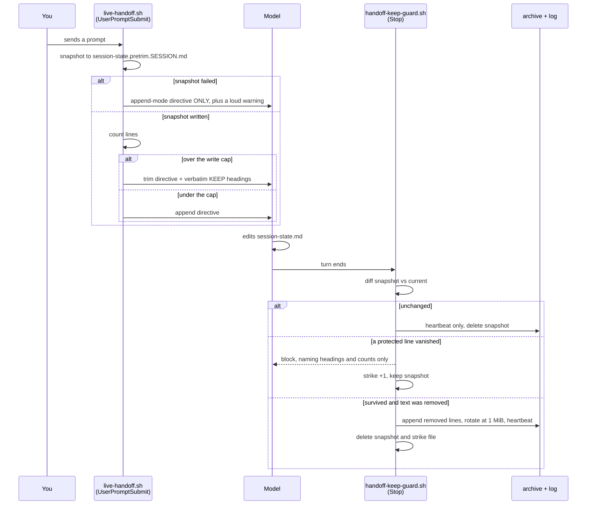

# Handoff trim safety — spec and evidence

Companion to `handoff-trim-safety.md`. Read on demand only, never at session start.
The card holds frontmatter, the task list and verification; this file holds the measured
evidence, the user decisions and the full spec.

## Problem

`.claude/session-state.md` is the machine-local notepad the next session reads after a
`/clear`. It has a hard line ceiling, and the only mechanism for staying under that ceiling
is asking the model to delete text. Nothing decides what is safe to delete, nothing records
what was deleted, and nothing keeps a copy. A trim is silent and one-way.

Reported by the user 2026-09-08 as drift in `vibe-scape` after a pre-clear handoff.

### Measured evidence (2026-09-08)

Two independent limits, set by different hooks that do not know about each other:

| Limit | Location | Value | Behaviour past it |
|---|---|---|---|
| Write | `hooks/handoff/live-handoff.sh:47` | 80 lines (no task/bug marker file) | Directive flips from append to `Rewrite… Be ruthless`, target 60 (`:90`, `:96`) |
| Read | `hooks/handoff/slim-session-start.sh:18` | 8192 bytes | Prints header, **omits the entire body** (`:84-88`) |

Write ceilings vary by marker file (`live-handoff.sh:39-49`): none → 80/60,
`current-task.md` → 100/80, `current-bug.md` → 120/100.

Byte-per-line rate across all 12 `session-state.md` files, re-measured 2026-09-08 after the
compliance judge falsified an earlier figure of 57–78: **14.43–78.26 b/line** on a total-line
basis, and **25.2–87.2** counting only non-blank lines, which is what survives a ruthless trim.

The earlier version derived from the wrong range that 150 lines is 8,550–11,700 bytes and so
exceeds the 8192 read cap *at every rate in the measured range*. **That derived claim was
false at the low end**: at 14.43 b/line, 150 lines is 2,165 bytes, comfortably under. The
surviving true statement is narrower, and is the one the design actually rests on — at the
*upper* end of the measured range a raised write cap does cross the old read cap, so raising
the write cap alone would have moved those repos from partial loss to total loss.

Population survey, 12 files across 6 repos. Two already in failure:

- `~/Other Docs/mtg-wizard/.claude/session-state.md` — **235 lines / 13,455 bytes, mtime
  2026-09-08 10:42 (active)**. 3x over the write cap, so every turn has been issuing the
  ruthless-trim directive and it is demonstrably not being obeyed; 64% over the read cap,
  so its handoff body is already being dropped whole at session start.
- `~/Other Docs/AI/AI_Projx/vibe-scape/.claude/session-state.md` — 75 lines / 5,165 bytes.
  Five lines from a forced 25% cut.

### Contributing causes

1. **No overflow destination.** Past the ceiling, deletion is the only way back under it.
2. **Deletion is by judgment, not rule.** Criteria are `obvious from code, already
   committed, no longer relevant, or low-importance` — all judgment calls, no protected list.
   Measured facts that look derivable (e.g. vibe-scape's `WL draft $0.18 / bills 230 credits,
   not the 150 list`) are exactly the class that reads as cuttable and is not.
3. **No backup on that path.** `proactive-handoff.sh save` writes the only `.bak`, and
   `settings.json` registers it on **PreCompact only** — never before a trim. vibe-scape has
   no `.bak` at all. The file is gitignored (`vibe-scape/.gitignore:7`), so git never
   versioned it either.
4. **The directive re-fires every turn** while over the limit, so one overrun can drive
   several successive cutting passes over an already-cut file.
5. **Trim timing is adversarial.** The file grows because the session is long; a long session
   is a full context window. The "which facts matter" judgement is made when it is weakest.

### Adjacent defects found in the same sweep

- **`pre-compact.sh` re-injects the wrong files.** It sends `context.md`, `current-task.md`,
  `current-bug.md` and **not** `session-state.md` — the only one kept current. In vibe-scape
  `context.md` is from 2026-07-25 while the notepad is from 2026-09-08.
- **`slim-session-start.sh:85-86` comment contradicts its code.** It states the cap
  `must not degrade backwards by withholding the handoff exactly when work overran it`,
  which is precisely what dropping the body does.
- **vibe-scape has no `docs/features/`** (only `decisions`, `design`, `plans`, `specs`), so
  the durable half of the memory system is absent there and everything rides on the volatile
  notepad. User declined to add it in this feature — recorded as a known gap, not a task.

### memsearch survey (measured 2026-09-08)

The RAG the archive will feed is `memsearch`. Scheduled by **launchd, not cron** —
`~/Library/LaunchAgents/local.memsearch-index.plist`, `StartInterval` 21600 (6h).
Index today: 156 MB, 21,656 chunks (`~/.claude/memory-index/memory.db`).

- A suitable source tier **already exists**: `archive_doc` (`memsearch/memsearch/index.py:66`),
  weighted 1.0 — below `curated_doc` 1.5 and `repo_doc` 1.2 — and routed to
  `recall_type == "episodic"` (`memsearch/memsearch/chunk.py:114`). Correct home for
  session narrative: retrievable, never outranking a decision record.
- It is keyed to the wrong file. `ARCHIVE_FILENAME = "CODING_MEMORY.md"`
  (`memsearch/memsearch/index.py:46`) — a tree `rules/gates.md` records as retired.
  `config.json` `curated_docs` still names `~/.claude/coding-memory` and
  `~/.claude/CODING_MEMORY.md` for the same reason.
- **Notepads are not indexed at all.** `session-state` / `session_state` appears nowhere
  in the memsearch source.
- `config.json` `repo_roots` covers **only** `vibe-scape` and `Snatch-Bracket`.
  `mtg-wizard` — the repo already losing its whole handoff body — is not indexed.
- **Re-index cost is per-file, not per-append.** On a content-hash change the indexer
  drops and re-embeds the entire file (`memsearch/memsearch/index.py:220-226`,
  `replace_source`). An append-only archive that grows without bound is therefore
  re-embedded in full every 6 hours, forever. A rotated file never changes again and is
  hash-skipped for free. This is the reason for D11 and it reverses an earlier
  in-session recommendation to let the archive grow unbounded.
- `/memory-index/` is gitignored (`.gitignore:75`) and has no backup, so the index must
  never become the only copy of cut text. Hence "nothing is ever deleted" in D11.

### Repo visibility (measured 2026-09-08)

`suyatdev/.claude` is a **public** GitHub repo (`gh repo view --json isPrivate` -> false).
Any decision to track the archive in git publishes raw session narrative. A Time Machine
destination is configured (WD Passport, local disk); whether backups are current could not
be confirmed — `tmutil latestbackup` requires Full Disk Access, which this shell lacks.

## Decisions taken (user, 2026-09-08)

| # | Decision | Chosen |
|---|---|---|
| D1 | Snapshot before every trim | Yes |
| D2 | Cut text goes to an archive, never deleted | Yes |
| D3 | Sections markable as never-cut | Yes |
| D4 | Give vibe-scape a `docs/features/` record | **No** — declined; known gap |
| D5 | Write limit | Raise to ~150 lines |
| D6 | Read limit + oversize behaviour | Raise to match (~12,000 bytes) **and** make the reader print what fits and name what was cut, never blank |
| D7 | `pre-compact.sh` file list | Fix — inject the live notepad |
| D8 | Who performs the save | **Hook copies mechanically, AND directive asks for tidy filing.** The mechanical copy is the floor and needs no model cooperation |
| D9 | Marker enforcement | **Verify after the fact** — compare post-write against the pre-trim copy and require restoration of any protected block that vanished |
| D10 | Archive location | Sibling file `.claude/session-state.archive.md`, one per repo |
| D11 | Archive growth | Rotate the live archive at ~1 MB to `session-state.archive.N.md`; **nothing is ever deleted**; memsearch indexes the live file and every rotation |
| D12 | Archive in git | **No** — archive and rotations gitignored, like the notepad. `suyatdev/.claude` is public; session narrative must not be published |
| D13 | Marker syntax | `[KEEP]` suffix on a markdown heading. Protected region = that heading through to the next heading of any level |
| D14 | Rollout | **Everything on, everywhere, immediately** — including the protected-block check enforcing from day one. User chose this over a warn-only first week, having been shown that risk |
| D15 | Check timing | `Stop` hook — runs once per turn after all edits settle, and holds the turn open until a vanished protected block is restored. Rejected: `PostToolUse` per-edit (false alarms on intermediate states of a multi-edit rewrite) and next-turn `UserPromptSubmit` (never runs if the session is cleared first, which is the case that matters) |

| D16 | A cut block that looks like it holds a secret | **Separate quarantine file** — `session-state.quarantine.md`. Never indexed, never in the main archive, and deletable by hand, so the never-delete rule holds for ordinary notes while the one risky category has an exit. Rejected: redaction, because a false positive destroys text permanently and unrecoverably, which is the failure this whole card exists to stop; and archive-as-normal, because it puts a secret in a store the design calls permanent and feeds it to the search index. Asked of the user 2026-09-08 after the compliance judge found the trade-off had been settled inside the spec rather than routed out, which `rules/core-conduct.md` forbids |

Triage (`triaging-new-instructions`, 2026-09-08): every item classifies as **hook** (tier 1,
script-decidable from observable facts). No new `core-conduct.md` rule, no new `gates.md`
stub. One documentation edit to `managing-session-memory` to teach the marker convention.

Model-switch checkpoint 1 (entering planning): **Opus 5 / xhigh**, confirmed by user.

## Open design questions — all resolved 2026-09-08

| Q | Question | Resolved by |
|---|---|---|
| Q1 | Archive location and name | D10 |
| Q2 | Archive growth | D11 |
| Q3 | Gitignore or track | D12 |
| Q4 | Marker syntax | D13 |
| Q5 | Blast radius across 6 repos | D14 |
| Q6 | Where the post-write check hooks in | D15 |

## Spec

Revised 2026-09-08 after compliance round 1 (FAIL, 9 violations) and the observability
architecting read (risk=medium). Every change below is traceable to a numbered finding; the
`## Judge findings` table at the end maps them.

### Scope

In scope: the trim cycle for `.claude/session-state.md` in every repo on this machine —
snapshot, archive, rotation, protected sections, both size caps, **both** compaction hooks,
and indexing the archive into memsearch.

Out of scope: giving vibe-scape a `docs/features/` tree (D4, declined — known gap);
migrating existing oversize notepads by hand; changing what the model chooses to write.

**Explicitly not covered, stated because it is easy to assume otherwise:** the root-level
`~/.claude/session-state.md` (95,456 bytes, hand-kept) is a different file, read by no hook,
and this card does not protect it. It was untracked *and* un-gitignored in a public repo when
the compliance judge found it. The ignore rule is **applied in the working tree and effective
now, but has no commit** — `main` accepts only docs — so a clean checkout still loses it. Not
"fixed": pending, and scheduled as its own task.

### Pinned toolchain

| Tool | Version | Constraint it imposes |
|---|---|---|
| bash | **3.2.57(1)** (`/bin/bash`, macOS system) | No associative arrays, no `${var^^}`, no `mapfile`, no array `+=`. Every hook must run under it. |
| jq | **1.7.1-apple** | Already the parser used by `post-edit-hook.sh:23`. |
| python | **3.12** (`memsearch/.python-version`) | memsearch changes only. |
| ollama embed model | `qwen3-embedding:0.6b`, dim 1024 (`memsearch/config.json`) | Unchanged. |

No new runtime dependencies. No network access in any hook.

### Files

**New**

| Path | Role |
|---|---|
| `hooks/handoff/lib/handoff-archive.sh` | Sourced library: snapshot, `[KEEP]` region extraction with fence tracking, archive append, rotation, secret flagging. |
| `hooks/handoff/handoff-keep-guard.sh` | `Stop` hook. Verifies protected regions survived; performs the mechanical archive append; writes the liveness heartbeat. |
| `hooks/handoff/lib/handoff-archive.test.sh` | Library unit tests. |
| `hooks/handoff/handoff-keep-guard.test.sh` | Hook behaviour tests, including strike cap and reset. |

**Changed**

| Path | Change |
|---|---|
| `hooks/handoff/live-handoff.sh` | Raise caps (`:40-49`); snapshot on **every** turn, not only over the cap; suppress the trim directive if the snapshot cannot be written; rewrite the directive (`:86-99`); re-inject protected headings verbatim. |
| `hooks/handoff/pre-compact-handoff.sh` | **Added after the observability read.** Its own directive (`:78`, `:85`) says `REWRITE it completely` with targets `60-80 / 80-100 / 100-120` — an independent trim path with no snapshot and no `[KEEP]` enforcement. Raise its targets to match, and route it through the same snapshot. This is the pre-clear handoff path the original bug report came from. |
| `hooks/handoff/slim-session-start.sh` | Raise `MAX_BYTES` (`:18`); replace body-drop (`:84-88`) with truncate-and-say; report guard liveness; reap stale snapshots. |
| `hooks/handoff/pre-compact.sh` | Inject `.claude/session-state.md` first (D7). |
| `.gitignore` | Confirm archive coverage per repo with `git check-ignore`, never assumed. |
| `memsearch/config.json` | New `archive_roots` + `archive_pattern` keys. |
| `memsearch/memsearch/index.py` | Consume `archive_roots`/`archive_pattern` via `Path.rglob`; widen `_doc_source_type` beyond the retired `CODING_MEMORY.md`; warn on a zero-match root. |
| `skills/managing-session-memory/SKILL.md` | Document the `[KEEP]` convention. |

### On-disk contract

All paths relative to `<repo>/.claude/`.

| File | Written by | Read by | Lifetime |
|---|---|---|---|
| `session-state.md` | model | `slim-session-start.sh` | live |
| `session-state.pretrim.<session-id>.md` | `live-handoff.sh`, `pre-compact-handoff.sh` | `handoff-keep-guard.sh` | one turn; reaped at session start if older than 24h — **reaping runs before the reader early-exits**, see below |
| `session-state.archive.md` | `handoff-keep-guard.sh` (auto) and model (curated) | humans, memsearch | until rotation |
| `session-state.archive.<N>.md` | rotation | humans, memsearch | forever, never modified again |
| `session-state.keepguard-strikes.<session-id>` | `handoff-keep-guard.sh` | itself | cleared on success **and** on fail-open |
| `session-state.keepguard.log` | `handoff-keep-guard.sh` | `slim-session-start.sh`, humans | append-only, rotates with the archive |

**The snapshot is per-session** (finding C2). A shared snapshot let the first session delete
it on success, after which a second session in the same repo found none, archived nothing, and
skipped the protected-block check entirely. That is why the old "no data is lost" claim in
known gap 5 was false.

### Constants

```yaml
write_caps:                  # live-handoff.sh and pre-compact-handoff.sh, same table
  none:         {max: 150, target: 120}
  current_task: {max: 170, target: 140}
  current_bug:  {max: 190, target: 160}
read_cap:
  slim_handoff_max_bytes: 24576    # 24 KiB; env override SLIM_HANDOFF_MAX_BYTES
archive:
  rotate_at_bytes: 1048576         # 1 MiB
keep_guard:
  max_strikes: 2                   # blocks before failing open with a loud warning
  log_rotate_at_bytes: 262144      # 256 KiB; the log heartbeats every turn, the archive does not
snapshot:
  reap_after_hours: 24
```

**R1 — headroom, not a guarantee (finding C1).** The earlier version asserted
`read_cap >= max(write_caps) * 78` and called it an invariant. Two things were wrong. First,
78 bytes per line was the maximum of a 12-file sample, not a bound: measured against
**non-blank** lines — which is what survives a ruthless trim — the same population reaches
**87.2** (`.claude/.claude/card-d-non-text-contrast/session-state.md`, 2026-09-08). At that
density `190 x 87.2 = 16,568`, which the proposed 16,384 cap would have truncated. Second, and
more fundamental: **the write cap is a directive, not a ceiling.** `mtg-wizard` reached 235
lines against an 80-line cap — 2.9x over — so no read cap can be proven sufficient.

So the load-bearing safety property is not the cap. It is that **the reader never blanks**:
past the cap it prints what fits and names what it withheld. The cap is a headroom target
only. 24,576 gives 1.48x over the worst measured density at the largest write cap.

**⚠️ This number overrides a user decision and is therefore NOT settled — D17.** D6 records
the user choosing "~12,000 bytes" for the read cap. The design ships **24,576**, slightly more
than double, on arithmetic the user never saw. The arithmetic is sound and set out below, but
core-conduct reserves a trade-off like this for the human, and earlier revisions accepted the
cost in the spec's own voice instead of asking. Raised as D17; the gate must not open while it
is unanswered.

**The cost of that headroom, named rather than left implicit.** The read cap is what a session
start injects into context. Raising it from 8,192 to 24,576 is a **3x** increase in the worst
case — round 1 flagged this at 2x, and the round-2 revision made it 3x without saying so. It
is not a per-session certainty: the cap bounds what *may* be read, and a healthy notepad at
150 lines and 78 b/line is 11,700 bytes, well under. The 3x applies only to a notepad that has
overrun, which is the case where dropping the body is the worse outcome. Accepted deliberately,
and recorded here so a later reader does not have to rediscover the arithmetic.

The test for this is a **runtime measurement over the real notepad population**, not a
comparison of three constants — a constants test passes by construction and can never fail
(finding O4).

### The `[KEEP]` marker (D13) — full grammar

The earlier version gave one regex for the heading and nothing for anything else, which left
the implementer to guess (finding C4).

**Heading form.** ATX only:

```
^#{1,6}[[:space:]].*\[KEEP\][[:space:]]*$
```

**Setext headings** (a title underlined with `===` or `---`) **are not supported.** They
cannot carry a trailing tag on the text line without it reading as body text. A setext heading
is treated as ordinary body, so it neither opens nor closes a region. Documented, not silently
unhandled.

**Fence tracking.** The parser tracks fenced code state before testing any line as a heading:

- An opening fence is three or more backticks or three or more tildes, indented at most three
  spaces.
- The closing fence must use the **same character** and be **at least as long**. A tilde fence
  does not close a backtick fence. This is what makes nested fences work.
- YAML front matter (`---` on line 1 through the next `---`) is skipped before parsing begins.
- An indented code block (four spaces or a tab, following a blank line) is body, not a heading.

**Two consequences the earlier version missed.** A heading inside a fence does not *end* a
region — the earlier spec covered that — and a `[KEEP]` heading inside a fence must not
*open* one either. The revised scenarios cover both directions.

**Region.** The heading line through the line before the next ATX heading of any level
outside any fence, or end of file.

**Survival rule.** Every non-blank line of a protected region in the snapshot, trailing
whitespace stripped, must appear as some line of the post-write file. Membership, not
position — reordering, re-nesting and moving a block between sections all pass; only deletion
fails. The heading line is part of the region, so stripping the tag fails.

**Set membership, not multiset.** A protected line that appears twice in the snapshot needs to
survive once. Requiring both copies would block on de-duplication, which is a tidy-up the trim
directive actively asks for. Stated because the previous revision left it readable either way.

**Which tool runs the matching, under bash 3.2.57.** The previous revision gave regexes
without saying what executes them, which under a shell with no associative arrays is a real
gap rather than a detail.

| Job | Tool | Why |
|---|---|---|
| Heading and fence detection | `grep -E` on a line at a time | `[[ =~ ]]` exists in bash 3.2 but its regex is locale-dependent and the house rule at `git-guard.sh:22` already keeps patterns out of `[[ ]]`. |
| Line membership | `grep -F -x -q -f <protected-lines-file> <current-file>` inverted per line | Fixed-string, whole-line matching. No line of a notepad can be read as a pattern, which is the injection risk a regex match would carry. |
| Region extraction | `awk` with an explicit fence-state variable | Needs one pass with state; `grep` cannot carry it. |

`grep -F -x` is load-bearing: notepad lines routinely contain regex metacharacters, and a
non-fixed match would both false-pass and be attacker-influenceable by the file under test.

### The trim cycle



**Snapshot on every turn, not only over the cap (finding C3).** The earlier design snapshotted
only when the trim directive fired, so on the great majority of turns nothing was protected at
all, and a voluntary rewrite below the cap could delete a `[KEEP]` line with no copy and no
check. That was a silent narrowing of D1. A snapshot is a copy of a file capped in the low
tens of kilobytes; taking it every turn costs less than the loss it prevents.

**The reaper has the same failure branch as the guard.** It performs the same archive write
— "append, then delete" — inside a hook the spec requires to fail silently. Followed
literally, an append that fails is ignored and the last surviving copy is then deleted, which
is this card's own headline disaster reproduced by its own fix. So the reaper deletes a
snapshot **only** after confirming the append succeeded; on failure it leaves the snapshot in
place, and that one case is exempt from the silent-failure rule and is reported at session
start.

**Where the reaper runs (finding C6).** The reaper turns an orphaned snapshot into archived
text. Assigning it to `slim-session-start.sh` without stating an order put it behind six
unrelated early exits (`slim-session-start.sh:59-79`), including `exit 0` when
`session-state.md` is missing or unreadable — which is the exact state the "notepad is deleted
while a snapshot is pending" scenario describes, and the one where the snapshot is the only
copy left. So the reaper runs **first**, before any of those exits, and it does not depend on
the notepad existing. Same for the liveness report.

**Snapshot failure fails closed (finding O-C).** If the snapshot cannot be written, the hook
must not emit the trim directive. Asking for a trim while unable to back it up is exactly the
promise the card exists to stop making. Trimming pauses and says why.

### Archive entry format

One block per verified removal. Both writers append; the duplication is deliberate and costs
only disk, since the archive is never read at session start and never trimmed (D8).

```markdown
## Auto-captured 2026-09-08T16:38:44Z (session 631d9bd8, 42 lines, secrets: none)
<verbatim removed lines, in original order>
```

A note the model files itself uses `## Filed by session <iso>` instead, so the two are
distinguishable on sight and by grep.

**Archive-append failure (finding O-a).** The design specified what happens when the *snapshot*
cannot be written and said nothing about the archive append failing, which is the same disk
and the same permissions. A failed append means text was removed from the notepad and captured
nowhere. It is escalated in the guard Stop output, the block is retained in the snapshot by
**not** deleting the snapshot, and the liveness line records `decision=archive_failed`. The
turn is not blocked — blocking cannot make the disk writable — but the failure is never
silent, and the snapshot survives as the copy of last resort.

**Secret handling (finding C9, revised after round 2).** The archive makes notepad text
permanent and search-indexed, on a path that never passes through `scan-secrets.sh` — that
hook is `PreToolUse` on `Edit|Write`, and a hook appending through bash bypasses it entirely.
So the library runs the same detection over each block before appending.

Round 2 found the first attempt at this made things worse in one direction. "memsearch skips
any file containing a flagged block" means **one** false positive silently removes the entire
archive — and everything appended to it afterwards — from search, while the indexer records it
under the same `skipped` counter as an ordinary nothing-changed skip (`index.py:213-215`), so
the zero-match reporting added for exactly this class never fires. And for an archive already
indexed before it gained a flag, "nothing is embedded" is simply false: chunks are only
removed inside `replace_source` (`db.py:210-224`), which a skipped file never reaches.

So the quarantine is per **block**, not per file. A flagged block is written to
`session-state.quarantine.md` instead of the archive; that file is never indexed, and the
archive carries a stub recording that a block was quarantined and why. The indexer counts a
quarantine skip on its own counter, separate from `skipped`, so it is visible in the run
report. And an archive that has ever contained a flagged block is force-reindexed once through
`replace_source` so previously embedded chunks are actually deleted rather than merely
un-refreshed.

**The retention trade-off is D16**, answered by the user 2026-09-08: quarantine file, not redaction and not archive-as-normal.

### Block-message sanitization (finding C8, reopened in round 2)

Restricting the block reason to headings and counts is not sufficient on its own. A heading is
still model-authored text out of the notepad, and the guard feeds it into the `Stop`
instruction channel — the same class of bytes that `slim-session-start.sh:4-12,26-43` wraps in
a tamper-evident DATA envelope precisely because a body line must not be able to forge a
marker.

**Scope: every notepad-derived string the guard emits, not only a block reason.** The
strike-cap fail-open warning names the same headings into the same channel and was left
outside the requirement. The rule is on the *bytes*, not on the message type.

So the guard reuses that machinery rather than inventing a weaker version: `gen_tag` and
`sanitize_line` move from `slim-session-start.sh` into `hooks/handoff/lib/handoff-archive.sh`,
both hooks source them, and every notepad-derived string in a block reason is sanitized and
enclosed in a tagged envelope. Counts and paths, which the guard itself generates, sit outside
it.

Moving a working function is a real risk to a hook that currently passes its tests, so the
task ordering puts the extraction and its tests before either consumer changes.

### Guard liveness (finding O2)

The `Stop` guard is the only hook here that speaks, and it is also the only writer of the
mechanical archive. If it is unregistered, missing, or crashes, it exits 0 and the turn ends
normally — indistinguishable from "nothing needed protecting". That is the same shape as the
recorded `worktree-guard.sh` log-mode lesson in `rules/gates.md`, but worse, because one
silent death costs both the protection and the backup.

So the guard emits a **positive** signal, not merely the absence of an objection. Every run
appends one line to `session-state.keepguard.log`:

```
2026-09-08T16:38:44Z session=631d9bd8 decision=allow protected_regions=2 removed_lines=0
```

**Staleness is measured by mtime, not by counting turns.** An earlier revision said
`liveness_stale_turns: 20`. That number is not computable by anything that could act on it:
the log carries no turn counter, and the reader runs at *session start* — turn zero — so it
can never see turns at all. It compares `session-state.md` mtime against
`session-state.keepguard.log` mtime instead. A notepad newer than the log means the notepad
changed with no guard run after it, which is exactly the condition worth reporting and is
sourceable from two `stat` calls.

Absence of the log entirely is reported as "guard has never run here" — the state a broken
registration produces.

**Every guard state has a distinct log token. This list is the single source; nothing
elsewhere in this document re-states it.**

| State | Token | Turn blocked? |
|---|---|---|
| Snapshot present, nothing protected went missing | `allow` | no |
| A protected line vanished | `block` | yes |
| No snapshot to compare against | `unprotected` | no |
| Strike cap reached, proceeding anyway | `failopen` | no |
| Archive or quarantine append failed | `archive_failed` | no |
| The liveness log itself could not be written | reported in Stop output; no line is possible | no |

Round 3 named `unprotected` as "a fourth value" while writing only three, which left `block`
and the fail-open unnamed — and logging `allow` on either recreates the exact masking failure
`unprotected` exists to prevent.

**`decision=unprotected` is not `allow`.** The flowchart previously
had three arms and none of them was "there is no snapshot to compare against". The natural
implementation of that omission logs `decision=allow`, so the health log reads a clean line
every turn while nothing is being protected. The guard must distinguish: no snapshot present
is `unprotected`, and the session-start report treats a run of `unprotected` lines as a
failure to investigate, not as health.

**The log rotates on its own size**, not with the archive. It heartbeats every turn; the
archive only grows on turns that removed text, so tying the two together would have let the
log grow unbounded between rotations.

**The log write can fail, and that failure is the one that matters most.** A read-only
directory or a full disk kills the heartbeat and the archive append together, and a missing
heartbeat line is byte-identical to the guard never having been installed. So a failed log
write is escalated the same way a failed snapshot is: the guard says so in its Stop output,
where it cannot be missed, rather than exiting 0.

### Behaviour scenarios

`SS` = `session-state.md`, `PT` = the per-session snapshot, `AR` = `session-state.archive.md`.

**Good path**

```gherkin
Scenario: A normal trim archives what it cut
  Given SS is 165 lines with no marker file present
  When live-handoff.sh runs and the model rewrites SS down to 118 lines and the turn ends
  Then PT was created as a byte-identical copy of SS before the rewrite
  And the guard appends the 47 removed lines to AR under an Auto-captured heading
  And PT is deleted
  And one allow line is appended to the liveness log

Scenario: A protected section survives a rewrite that moves it
  Given PT contains a region under "## Standing rules [KEEP]" with 4 non-blank lines
  When the model rewrites SS so all 4 lines sit under a different parent heading
  And the turn ends
  Then the guard allows the turn to end and the removal is archived normally

Scenario: Under the cap, the notepad is still protected
  Given SS is 90 lines, well under the 150-line cap
  When live-handoff.sh runs
  Then PT is still created
  And the append-mode directive is emitted
  When the model deletes a [KEEP] line anyway and the turn ends
  Then the guard blocks, because protection does not depend on the cap
```

**Bad path**

```gherkin
Scenario: A protected line is deleted
  Given PT contains "- Always work in a worktree." inside a [KEEP] region
  When the model rewrites SS without that line and the turn ends
  Then the guard blocks the turn
  And the reason names the heading and the count of missing lines and the path to PT
  And the reason contains no notepad body lines
  And every notepad-derived heading is wrapped in the same tamper-evident DATA envelope
      slim-session-start.sh uses, with a per-run tag and the marker sanitizer applied
  And PT is NOT deleted and nothing is appended to AR
  And the strike count becomes 1

Scenario: The model strips the [KEEP] tag itself
  Given PT contains the heading "## Standing rules [KEEP]"
  When the model rewrites SS with that heading as "## Standing rules" and the turn ends
  Then the guard blocks, because the heading line is itself a protected line

Scenario: The guard must not wedge the session
  Given the guard has already blocked twice on the same PT
  When the turn ends a third time with a protected line still missing
  Then the guard allows the turn to end
  And it emits a loud warning naming the unrecovered headings and the PT path
  And it appends the full PT content to AR before deleting PT
  And it deletes the strike file, so the next cycle starts at zero

Scenario: The snapshot cannot be written
  Given the .claude directory is read-only
  When live-handoff.sh runs with SS at 165 lines
  Then no trim directive is emitted, whatever the line count
  And the append-mode directive is emitted with a warning naming the failure
```

**Edge cases**

```gherkin
Scenario: A heading inside a fenced code block does not end a region
  Given a [KEEP] region whose body contains a fenced example with a "## " line in it
  When the region parser runs
  Then the inner line is body, and the region ends only at a heading outside any fence

Scenario: A [KEEP] heading inside a fenced code block does not open a region
  Given a fenced example containing the line "## Standing rules [KEEP]"
  When the region parser runs
  Then no region opens, and that text is not protected

Scenario: A tilde fence does not close a backtick fence
  Given a region body opening a fence with three backticks and later three tildes
  When the region parser runs
  Then the fence is still open, and the tilde line is body

Scenario: The notepad is deleted while a snapshot is pending
  Given PT exists and SS has been removed
  When the turn ends
  Then the guard treats every protected line as missing and blocks
  And the reason points at PT as the recovery source

Scenario: Two sessions in one repo do not blind each other
  Given sessions A and B are both live in the same repo
  When A finishes a turn and deletes its own snapshot
  Then B still has its own snapshot, and the next turn of B is checked and archived normally

Scenario: A stale snapshot is reaped
  Given a snapshot file whose mtime is 30 hours old and whose session is gone
  When slim-session-start.sh runs
  Then the snapshot is appended to AR before deletion, never discarded

Scenario: The archive crosses the rotation threshold
  Given AR is 1,040,000 bytes and the pending append is 20,000 bytes
  When the guard appends
  Then AR is renamed to session-state.archive.1.md and a fresh AR holds the new block
  And no bytes are deleted

Scenario: Rotation numbering with gaps
  Given session-state.archive.1.md and session-state.archive.4.md exist
  When rotation runs
  Then the new name is session-state.archive.5.md, one above the highest existing number

Scenario: A block that looks like a secret is quarantined, not archived
  Given a removed block matching the scan-secrets detection
  When the guard files it
  Then the block is written verbatim to session-state.quarantine.md, not to AR
  And AR carries a stub recording that a block was quarantined and why
  And the quarantine file is never indexed
  And the rest of AR indexes normally, so one flagged block never removes the archive
  And the indexer counts this on its own counter, not the generic skipped counter

Scenario: An archive that previously held a flagged block is purged from the index
  Given AR was indexed before a flagged block was found in it
  When the indexer next runs
  Then AR is force-reindexed through replace_source
  And the previously embedded chunks are deleted, not merely left unrefreshed

Scenario: A pane agent must not touch handoff state
  Given CLAUDE_PANE_AGENT is set
  When any of the four hooks runs
  Then it exits 0 immediately, matching live-handoff.sh:22 and post-edit-hook.sh:15

Scenario: Outside a repo, each hook keeps its existing behaviour
  Given git rev-parse --show-toplevel fails
  When live-handoff.sh runs
  Then it falls back to the working directory, unchanged from live-handoff.sh:24
  When slim-session-start.sh runs
  Then it exits 0 and emits nothing, unchanged from slim-session-start.sh:58
  When handoff-keep-guard.sh runs
  Then it exits 0 without blocking

Scenario: The reader truncates instead of blanking
  Given SS is 30,000 bytes, above the 24,576 read cap
  When slim-session-start.sh runs
  Then it prints whole lines in order until the budget is spent
  And then a line naming how many lines and bytes were withheld and the path to read
  And it never prints a partial line
  And if any withheld line was inside a [KEEP] region it says so explicitly

Scenario: The reader is unchanged below the cap
  Given SS is 9,000 bytes
  When slim-session-start.sh runs
  Then the whole body is emitted, sanitized exactly as today

Scenario: The guard has not run
  Given no session-state.keepguard.log exists in a repo whose notepad has changed
  When slim-session-start.sh runs
  Then the header says the guard has never run here

Scenario: PreCompact injects the live notepad
  Given .claude/session-state.md and a 2026-07-25 .claude/context.md both exist
  When pre-compact.sh runs
  Then session-state.md is emitted first, before context.md

Scenario: The pre-compact rewrite is protected too
  Given SS is 165 lines and compaction is about to run
  When pre-compact-handoff.sh emits its rewrite directive
  Then a snapshot was taken first
  And the directive names the raised targets, not 60-80
  And the [KEEP] headings are re-injected verbatim

Scenario: Archive files are never read at session start
  Given AR and three rotations exist
  When slim-session-start.sh runs
  Then it reads only session-state.md, and no archive bytes enter the context

Scenario: memsearch types the archive correctly
  Given AR exists under one of the archive_roots and matches archive_pattern
  When memsearch index runs
  Then its chunks carry source_type archive_doc and recall_type episodic, weight 1.0
  And a rotated file already indexed is hash-skipped on the next run

Scenario: The archive append fails
  Given the archive file cannot be written
  When the guard files a removal
  Then the liveness line records decision=archive_failed
  And the guard says so in its Stop output
  And the snapshot is NOT deleted, so the removed text still has a copy

Scenario: The liveness log cannot be written
  Given the log file cannot be written
  When the guard runs
  Then it reports the failure in its Stop output rather than exiting 0
  And the absence of a log line is never left to read as a guard that was never installed

Scenario: The guard runs with no snapshot present
  Given no snapshot exists for this session
  When the turn ends
  Then the liveness line records decision=unprotected, never allow

Scenario: The reaper cannot append
  Given an orphaned snapshot and an unwritable archive
  When slim-session-start.sh reaps
  Then the snapshot is left in place, not deleted
  And the failure is reported

Scenario: The fail-open warning is enveloped too
  Given the strike cap is reached and the warning names a notepad heading
  When the guard emits it
  Then that heading is sanitized and wrapped in the tagged DATA envelope,
      exactly as a block reason would be

Scenario: A root that matches nothing is reported
  Given an archive_roots entry under which no file matches archive_pattern
  When memsearch index runs
  Then the run report names that glob as zero-match
  And the run does not silently read as nothing changed
```

### memsearch changes

The earlier version listed six hardcoded paths. Measured against the live population of **12**
notepads, those six covered only part of it — `~/.claude/.claude/card-d-non-text-contrast/`
and `~/.claude/.claude/worktrees/*/` were both missed — and a glob that matches nothing is
indistinguishable from "nothing changed" in the index report (finding O5).

```yaml
archive_roots:                       # expanduser(root), then Path(root).rglob(pattern)
  - "~/.claude"
  - "~/Other Docs"
  - "~/.worktrees"
archive_pattern: "session-state.archive*.md"
zero_match_roots_are_reported: true
```

**Not `glob.glob`.** The previous revision specified
`glob.glob("~/.claude/**/session-state.archive*.md", recursive=True)`. Measured under the
pinned interpreter (`memsearch/.venv`, Python 3.12.13) that matches **zero files**, for two
independent reasons: `glob` never expands `~`, and `**` does not descend into dot-prefixed
directories — which is where every notepad lives. The replacement for six hardcoded paths
would have reached nothing at all.

Measured on the live tree, same interpreter, pattern `session-state.md` under `~/.claude`:
`glob.glob(..., recursive=True)` finds **1**, `Path.rglob` finds **7**, and
`glob.glob(..., recursive=True, include_hidden=True)` also finds 7. `Path.rglob` is specified
because it needs no version-gated keyword — the system `python3` here is 3.9.6, where
`include_hidden` does not exist at all.

A test asserts the configured roots match at least the live archive population, so a
regression to a dot-blind matcher fails rather than silently indexing nothing.

Recursive globs anchored at the three roots that actually hold repos, so a new worktree or a
new project is covered without a config edit. Globs rather than `repo_roots` entries, so the
change does not sweep two entire unindexed repos into the index as a side effect.

Files matched this way are typed `archive_doc` regardless of which bucket found them,
preserving the reasoning at `index.py:50-58`. A file containing a `secrets: flagged` block is
skipped entirely.

The live `session-state.md` is deliberately **not** indexed: it changes every turn, and
`replace_source` (`index.py:220-226`) re-embeds a whole file on any content change.

**`archive_doc` is pre-poisoned as a health signal.** The existing `archive_doc` chunks are
the retired `CODING_MEMORY.md`, so "the archive_doc count went up" proves nothing until a
`--reclassify` run separates them. The memsearch task covers that. The current count must be measured at
implementation time, not carried from this sentence.

### Non-functional requirements

- **Silent on failure, with two deliberate exceptions.** Hooks follow the house pattern
  (`slim-session-start.sh:10-12`): a failure never delays or breaks a session start. The
  exceptions are the `Stop` guard, whose purpose is to speak, and the snapshot-write failure
  in `live-handoff.sh`, which must be loud because it silently disarms the whole feature.
- **No secrets.** Archive files are gitignored (D12), confirmed per repo with
  `git check-ignore`, and scanned before append.
- **Idempotent.** Running any hook twice on unchanged state produces no second archive entry.
- **Bounded work.** The guard reads at most the snapshot and the current notepad.

### Known gaps, stated rather than hidden

1. The guard cannot see a notepad edit made by a subagent or a pane session — both exit early
   on `CLAUDE_PANE_AGENT`.
2. Enforcement is a momentum guardrail, not a security boundary. A model that wants to delete
   a protected line can delete the snapshot first.
3. The strike cap means a genuinely unrecoverable trim eventually proceeds. The full snapshot
   is archived in that case, so the text survives even though the notepad does not.
4. Existing oversize notepads are not migrated. This is not theoretical: `mtg-wizard` was
   measured at 235 lines / 13,455 bytes at 10:42 on 2026-09-08 and at **64 lines / 3,383
   bytes at 13:56 the same day** — roughly 171 lines cut, with no snapshot and no record,
   while this card sat waiting to be judged.
5. A `[KEEP]` region is protected only against deletion, not against being rewritten into
   something misleading. Membership matching cannot detect a line that was edited rather than
   removed; the archive is the only recourse there.
6. The exact `Stop` hook JSON contract is unverified. The published hooks documentation has
   been measured wrong before on decision values (memory:
   `reference_hook_permission_decision_values`). The `Stop`-hook task must confirm the accepted shape
   against the installed binary, not the docs page, and pin the finding in a comment.
7. Secret detection reuses `scan-secrets.sh` logic and inherits every gap that hook already
   has. Flagging is best-effort; the guarantee is that a flagged block is not indexed, not
   that every secret is caught.

### Judge findings: claim, and what verification actually said

The previous revision presented this as a table of settled fixes. It was written before any
judge had confirmed a single row, which is precisely the "verification precedes the write-down"
rule it was breaking. The `Verified` column mixes two things and says which: round 2's own disposition, plus, where
a row was reopened, what the next round then did. It is not a clean external verdict, and
labelling it as one would repeat the fault it was written to correct.

| Finding | Where addressed | Verified in round 2 |
|---|---|---|
| C1 unsourced metric (78 bytes per line) | R1 rewritten; cap 24,576; runtime test | arithmetic confirmed; a **different** wrong number found in the evidence section, fixed in round 3 |
| C2 unverified "no data is lost" | Per-session snapshot; gap 5 replaced | genuinely fixed |
| C3 no snapshot below the cap | Snapshot every turn | genuinely fixed |
| C4 incomplete `[KEEP]` grammar | Full grammar section; 3 new scenarios | **partly** — tooling and set-vs-multiset added in round 3 |
| C5 strike counter never reset | Reset on success and on fail-open | genuinely fixed |
| C6 scenario contradicts `slim-session-start.sh:58` | Per-hook scenario, all three arms | genuinely fixed |
| C7 two scenarios with no `When` | Both rewritten | genuinely fixed |
| C8 raw notepad text in the block message | Headings and counts only, no body lines | **partly** — envelope added in round 3 |
| C9 archive bypasses `scan-secrets.sh` | Scan before append; flagged blocks not indexed | **partly** — per-file skip was worse than the gap; per-block quarantine in round 3 |
| O1 `pre-compact-handoff.sh` unmentioned | Added to changed files; own scenario | accepted |
| O2 guard silence reads as success | Liveness log + session-start report | **FAIL** — the log itself could fail silently; fixed in round 3 |
| O3 empty Verification section | Written, below | accepted |
| O4 R1 test cannot fail | Replaced with seeded-token test plus mutation | confirmed fixed |
| O5 hardcoded globs, zero-match invisible | Recursive globs; zero-match reported | **FAIL** — the replacement globs matched zero files; fixed in round 3 |
| O6 `archive_doc` pre-poisoned | Stated; `--reclassify` in the memsearch task | accepted |
| O7 root running log exposed | Ignore rule applied on disk, **not yet committed** | accepted; the uncommitted state is itself a live risk |

## Tasks

Ordered so every step is independently useful and nothing depends on a later step. Tasks 1-4
are the safety floor; 5-8 remove the loss; 9-11 are enforcement; 12-15 are reach.

- [ ] 0. Extract `gen_tag`, `sanitize_line` **and the three module-level values they read**
      (`MARKER_PATTERN`, `TAG_BYTES`, `URANDOM_SRC`) from `slim-session-start.sh` into
      `hooks/handoff/lib/handoff-archive.sh`, with tests, and leave both call sites behaving
      identically — before anything new consumes them. Moving a working function out of a hook
      that currently passes its tests is the riskiest edit in this list, so it goes first and
      alone.
- [ ] 1. `hooks/handoff/lib/handoff-archive.sh` — snapshot, `[KEEP]` region extraction with
      full fence tracking (`awk` with an explicit fence-state variable), archive append,
      rotation, secret flagging, quarantine. Line membership uses `grep -F -x -q`, never a
      regex. Pure library, no hook wiring. Tests first, fence cases first among those.
- [ ] 2. `live-handoff.sh` snapshots on **every** turn to a per-session filename, and
      **suppresses the trim directive** if the snapshot cannot be written.
- [ ] 3. `.gitignore` coverage confirmed in all six repos holding a notepad — measured with
      `git check-ignore`, never assumed. Covers `session-state.archive*`, `.pretrim.*`,
      `.keepguard-strikes.*`, `.keepguard.log` and **`session-state.quarantine.md`** — the one
      file designed to hold secrets, and the one left off this list until round 3.
      `mtg-wizard/.gitignore` and `vibe-scape/.gitignore` list `.claude/` files one by one, so
      none of these is covered there today. This task runs **before** anything that creates
      the files, not seventeen tasks after it.
- [ ] 4. Stale-snapshot reaper in `slim-session-start.sh`: append to the archive, then delete.
- [ ] 5. Raise the write caps to 150/120, 170/140, 190/160 in **both** `live-handoff.sh:40-49`
      and `pre-compact-handoff.sh:85`.
- [ ] 6. Raise `SLIM_HANDOFF_MAX_BYTES` to 24576 and replace the body-drop
      (`slim-session-start.sh:84-88`) with truncate-and-say.
- [ ] 7. Rewrite the trim directive in both hooks: cutting means filing into the archive, and
      the protected headings are re-injected verbatim.
- [ ] 8. Route `pre-compact-handoff.sh` through the same snapshot. This is the pre-clear path
      the original bug report came from.
- [ ] 9. `hooks/handoff/handoff-keep-guard.sh` as a `Stop` hook: protected-block check, strike
      cap with reset on both exits, mechanical archive append, liveness heartbeat. Block
      messages carry headings and counts only — never notepad body lines.
- [ ] 10. Confirm the `Stop` hook JSON contract against the installed binary, not the docs
      page, and pin the finding in a comment.
- [ ] 11. Register the guard in `settings.json` under `Stop`.
- [ ] 12. Guard-liveness reporting in `slim-session-start.sh`.
- [ ] 13. `pre-compact.sh` injects `session-state.md` first (D7).
- [ ] 14. memsearch: `archive_roots`/`archive_pattern` via `Path.rglob`, zero-match reporting, `_doc_source_type`
      widened off the retired `CODING_MEMORY.md`, and a `--reclassify` run so `archive_doc`
      becomes a usable health signal.
- [ ] 15. Document the `[KEEP]` convention in `skills/managing-session-memory/SKILL.md`, and
      tag the sections that need protecting in this repo notepad as the first real use.
- [ ] 16. ADR under `docs/decisions/` for the two structural decisions this design takes:
      D11 (an append-only store that rotates and is never deleted) and D12 (that store being
      permanent, gitignored and machine-local). `rules/gates.md` requires an ADR for structural
      decisions and the previous revisions did not schedule one.
- [ ] 17. Commit the `.gitignore` fix for the exposed root running log. Applied on disk and
      effective since 2026-09-08, but held out of the docs-only commits to `main`, so it has
      no commit of its own yet and would be lost by a clean checkout.
- [ ] 18. Reap the quarantine path: `session-state.quarantine.md` needs its own gitignore
      coverage, its own exclusion from indexing, and a stated purge procedure — the retention
      trade-off is D16 and must be answered before this is built.

Split into `handoff-trim-safety.spec.md` at 719 lines, exercising the MAY in
`rules/gates.md` (one-canonical-file discipline). The card keeps frontmatter, tasks and
verification — what a restore needs; the companion keeps evidence, decisions and the spec —
what an implementer needs. There is no third progress document, and there will not be one.

The task list above is duplicated from `handoff-trim-safety.md` because
`hooks/feature-sync-guard.sh` requires both halves of a split pair to list the same
tasks (decision 6 of `docs/features/memory-system-split.md`). Ticking a box needs no
matching edit; adding or removing a task does.

### A note on cross-references

Task numbers are deliberately **not** cited anywhere in this document. Three of them went
stale inside a single revision when the list was renumbered, and the sync guard compares task
*text*, so it is blind to a wrong number in prose. References name the task by what it does.
Recorded because the same failure is already in the memory file
`feedback_store_the_derivation_not_the_number` and it recurred here anyway.
