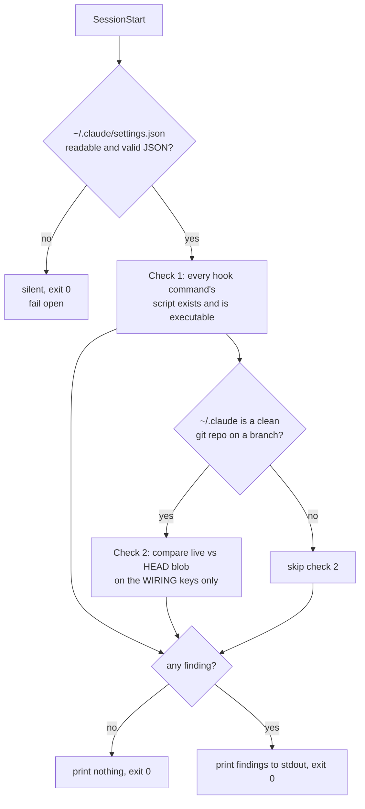

Gate opened 2026-08-22 on the literal user phrase `gate confirmed`. Branch cut from
`docs/post-merge-63` @ `8cdd1e4`, not from `main`, because that branch carries this card and has
not merged yet — rebase or merge it in once it lands.

# Hook-wiring health check: say so when a guard is registered but cannot run

Planned 2026-08-22 on `chore/settings-split` @ `dd1a819`. Follows PR #63 and ADR 0032, which
tracked `settings.json` again but left two silent failures open. Triaged via
`triaging-new-instructions`: **hook**, at question 1 — a script decides this entirely from
observable facts, so it needs no `rules/gates.md` stub. It constrains nothing about agent
behaviour; it only reports.

## Problem

Two failures in the guard wiring are invisible today. Both were measured on `claude 2.1.238`,
2026-08-21, not inferred.

**1. A registered hook whose script is missing fails silently and open.** Probe: three
`SessionStart`/`PreToolUse` hooks in one settings file — a control that writes a marker, one
pointing at a non-existent script, and one exiting 2 with a message on stderr.

| hook | what the session showed |
|---|---|
| control | marker written — the runner fired |
| script missing | **nothing.** No stdout, no stderr, no `--debug` output, session exit 0 |
| `exit 2` with stderr | blocked the call, message surfaced verbatim to the model |

So a guard that *denies* is loud, and a guard that *cannot run* is indistinguishable from a guard
that ran and approved. Every hook in `hooks/` is one renamed file away from that state.

**2. The live file can drift from the tracked one unnoticed.** The observability judge on PR #63
found four values in `settings.json` that had drifted from the last tracked version during the
months it was untracked — including `permissions.defaultMode`, a security posture change. Nobody
noticed because nobody diffed against `9cc792f^`. Tracking the file makes drift *visible in
principle*; nothing makes it *announced*.

## Fix

One script, `hooks/verify-hook-wiring.sh`, registered on `SessionStart` alongside the three hooks
already there (`doc-guard.sh`, `memsearch-nudge.sh`, `handoff/slim-session-start.sh`). Its stdout
is surfaced to the session as additional context, which is the existing delivery mechanism —
`memsearch-nudge.sh` already uses it.



### Check 1 — every registered hook can actually run

For each `hooks.<event>[].hooks[].command`: extract the script path it invokes, expand `$HOME`,
and require that it exists and is executable. Report each one that fails, with the event name.

The command strings are shell, not bare paths — the orca entries are a multi-clause
`if [ -f … ] && [ -r … ]; then /bin/sh …; fi`. **Extraction must be conservative:** report only
paths it can identify with confidence and stay silent about the rest. A false alarm here trains
the reader to ignore the check, which is worse than the gap.

### Check 2 — the live file has not drifted from the tracked one

Compare `~/.claude/settings.json` against `git -C ~/.claude show HEAD:settings.json`, semantically
(parsed JSON, key order irrelevant), over the **wiring keys only**:

| Compared | Ignored |
|---|---|
| `hooks`, `permissions`, `statusLine`, `enabledPlugins` | `model`, `effortLevel` |

Ignoring `model`/`effortLevel` is load-bearing, not laziness: ADR 0032 accepted that `/model`
rewrites them, so comparing them would make the check fire after every model switch. A check that
cries wolf is a check that gets ignored — and this one exists precisely because nobody reads a
signal they have learned to skip.

Everything not listed in either column (`theme`, `tui`, notification preferences) is ignored: they
are preferences, and a drift there is not a safety event.

**Amended 2026-08-22 during PR #66 review, at the user's request — granularity of a drift finding.**
As first built, only `hooks` was named per item; every other wiring key reported as
`live "permissions" differs from HEAD:settings.json`. That is the one output this feature cannot
afford. The drift that motivates the whole card is `permissions.defaultMode` moving unannounced, and
a reader told only that *permissions* changed still has to diff the file by hand — the work the check
was supposed to have already done. The motivating scenario was the one the output served worst.

Every non-`hooks` wiring key is now descended **one level** and named by sub-key, with both values:

```
verify-hook-wiring: settings.json drift — permissions.defaultMode: live "bypassPermissions", HEAD "default"
```

Bounds, so this does not grow into a JSON differ: one level only (deeper nesting costs line length
and buys little); and if either side is not an object — a key that changed type, or is absent
entirely — there is no sub-key to name and the key-level line stays. `hooks` keeps its existing
per-script phrasing, which is already more useful than a sub-key path would be.

*(This paragraph originally read "values truncated at 60 characters". That bound was replaced in
task 10b — a truncated credential is still a credential — and then replaced again in 10c by
default-deny rendering. Corrected here rather than left to contradict the tasks below.)*

**Redaction, added in the same review round after the judge flagged it.** Printing values is new
here, and it is the leak surface this change introduced. ~~the one leak surface~~ — **corrected by
task 10e: it is not the only one.** Check 1 has printed hook script paths in full since the first
commit, deliberately and unfiltered, and calling value-printing "the one" surface made a whole class
invisible for four rounds. A value whose sub-key name *or* whose
own text matches `key|token|secret|password|credential|auth|bearer` prints as `<redacted>`, with the
sub-key still named — knowing a secret-shaped setting moved is the finding; printing it is not.
`settings.json` is not supposed to hold credentials, and `env` is excluded from the compared keys
for that reason, but this check exists *because* conventions drift unobserved, so it does not stake
anything on one. The pattern is deliberately broad and fails safe: a false redaction costs one line
of detail, a false negative writes a credential into every session transcript.

### Non-goals, stated so the card cannot over-promise

- **It cannot detect its own absence.** If `settings.json` vanishes, the `SessionStart` hook
  hosting this check vanishes with it. Mitigation is ADR 0032, not this card: the file is tracked,
  so its disappearance is a `git status` event.
- **It cannot tell a working guard from a broken one that returns 0.** Only that guard's own test
  suite can.
- **It does not block anything.** Always exits 0. It is a smoke alarm, not a lock.

## Contract

- **Exit code:** always `0`. Every internal failure — unreadable file, malformed JSON, no `python3`,
  `~/.claude` not a git repo, detached HEAD, mid-rebase — is a silent no-op. Fail open, never noisy,
  never blocking.
- **Output:** nothing at all when healthy. Findings go to **stdout**, one line each, prefixed
  `verify-hook-wiring:`.
- **Environment:** runs in every session in every repo, so it must reference `$HOME/.claude`
  explicitly and never assume `cwd`.
- **Budget:** ≤150 ms wall clock on a warm cache; it is on the session-start path. Measure it,
  do not assume it.
- **Toolchain, pinned** — measured on this machine 2026-08-22, not recalled:
  `bash` **3.2.57(1)** (macOS system bash — no `mapfile`, no associative arrays, no `${x^^}`),
  `python3` **3.9.6** for JSON parsing, `git` **2.50.1** (Apple Git-155).
  Note 3.9, *not* 3.10+: no `match` statement, no `X | Y` unions at runtime. This is the system
  interpreter the other hooks already run under — `memsearch` gets 3.13 via `uv`, which is a
  different interpreter and is not available here. Add no dependency beyond these three.

## Scenarios

```gherkin
Scenario: healthy wiring stays silent
  Given every registered hook command resolves to an executable file
    And the live settings.json matches HEAD on the wiring keys
  When a session starts
  Then the check prints nothing
    And exits 0

Scenario: a registered hook's script has been renamed away
  Given settings.json registers "$HOME/.claude/hooks/doc-guard.sh" on PreToolUse
    And that file does not exist
  When a session starts
  Then the output names doc-guard.sh, the event PreToolUse, and that it cannot run
    And exits 0

Scenario: a hook script exists but is not executable
  Given a registered command points at an existing file with mode 644
  When a session starts
  Then the output names the file and says it is not executable

Scenario: switching models does not trigger the drift check
  Given the live settings.json differs from HEAD only in "model" and "effortLevel"
  When a session starts
  Then the check prints nothing

Scenario: a guard was removed from the live file
  Given HEAD registers judge-guard.sh but the live settings.json does not
  When a session starts
  Then the output names judge-guard.sh as present in HEAD and absent locally

Scenario: the check cannot do its job and says nothing
  Given ~/.claude/settings.json is not valid JSON
  When a session starts
  Then the check prints nothing
    And exits 0

Scenario: ~/.claude is mid-rebase
  Given a rebase is in progress in ~/.claude
  When a session starts
  Then check 1 still runs
    And check 2 is skipped without comment

Scenario: a drifted setting is named, not just its parent key
  Given the live settings.json sets permissions.defaultMode to "bypassPermissions"
    And HEAD:settings.json sets it to "default"
  When a session starts
  Then the output names permissions.defaultMode and both values
    And does not merely say that "permissions" differs

Scenario: a wiring key that stops being an object still reports
  Given a wiring key is an object in HEAD and a string in the live file
  When a session starts
  Then the output names that key at key level
    And exits 0

Scenario: an unparseable command string is not reported as broken
  Given a hook command whose script path cannot be extracted with confidence
  When a session starts
  Then that command is skipped silently
    And no finding is emitted for it
```

## Tasks

- [x] 0. Branch `chore/hook-wiring-health-check` + worktree. **Only after `gate confirmed`.**
      Worktree `.claude/worktrees/hook-wiring-health-check`, branch cut from `docs/post-merge-63`
      @ `8cdd1e4`. Recording the branch here is what unblocks `phase-guard` for task 1 — source
      writes were denied on `docs/post-merge-63` precisely because no card claimed it.
- [x] 1. **Red first.** Write `hooks/verify-hook-wiring.test.sh` covering every scenario above,
      against a stub that does nothing. Confirm the suite fails for the stated reasons before any
      implementation exists — and that the "healthy" cases pass against a no-op, so they are known
      not to be the ones proving the feature.
      - 20 cases. Against the no-op stub: **10/20**, and the 10 failures were all "lines=0 want=N".
      - The 10 that passed against a no-op are the silent-by-design ones and prove nothing on their
        own: healthy, model/effortLevel, theme/tui, reformat, malformed JSON, absent settings.json,
        detached HEAD, no `HEAD:settings.json`, unparseable command, plus the mid-rebase *fixture*
        self-check. They only start carrying weight once something exists that could print.
      - Fixture bug caught and fixed before the green run: the reformat case wrote
        `open(p,"w").write(json.dumps(json.load(open(p))))`, which truncates the file before the
        load runs — it was passing against an empty settings.json, not a reformatted one.
- [x] 2. Check 1: parse, extract, verify executable. Conservative extraction — a command whose path
      cannot be identified is skipped, never reported.
      - Skip rule: any shell metacharacter (`;&|<>()`, backtick, newline), any unresolved `$VAR`
        after `$HOME`/`~` expansion, any bare `PATH` name, any leading `VAR=value`. Interpreter
        prefixes are a closed set (`bash`, `sh`, `zsh`, `python3` and their `/bin/` forms).
- [x] 3. Check 2: semantic comparison on the wiring keys, `model`/`effortLevel` excluded.
      - One precondition covers both skip states: `git symbolic-ref -q HEAD` failing *is* the
        detached-HEAD and the mid-rebase case, so there is one silent path rather than two.
- [x] 4. Prove it can fail: break a real registered hook in a *copy* of `settings.json`, confirm the
      check names it, restore. A green check that has never gone red proves nothing.
      - `hooks/verify-hook-wiring.probe.sh`, run 2026-08-22 against a scratch `$HOME` holding the
        **real** `settings.json` and a copy of the real `hooks/` tree. Baseline silent (all 16
        distinct registered scripts resolve); `judge-guard.sh` renamed away → one "no such file" line;
        restored, `phase-guard.sh` chmod 644 → one "not executable" line; restored → silent again.
        Drift: `phase-guard.sh` dropped from the live file → named against HEAD; `defaultMode`
        flipped → a second, `permissions` line; `git checkout -- settings.json` → silent again.
        The real `~/.claude` was untouched (`git status --porcelain` empty afterwards).
      - **Found while probing:** `HEAD:settings.json` does **not exist** in this machine's shared
        checkout — `fatal: path 'settings.json' exists on disk, but not in 'HEAD'`. So check 2
        silently skips here today, and stays inert until PR #63 is pulled into that checkout. Check
        1 is unaffected and runs clean. This is outstanding user action, not a defect in the hook.
- [x] 5. Measure the runtime against the ≤150 ms budget. Record the number run, not assumed.
      - `hooks/verify-hook-wiring.measure.sh`, 20 runs per configuration, warm cache, 2026-08-22:
        **46 ms/run** with check 2 short-circuiting, **45 ms/run** with it running in full. Budget
        ≤150 ms. Bare `python3 -c pass` is 20 ms/run on this machine, so the interpreter start is
        roughly half the total and the check itself is the cheaper half.
      - First measurement read **3 ms** and was wrong: the script passed `~/.claude` as `HOME`, so
        the hook looked for `~/.claude/.claude/settings.json`, found none, and returned before
        python started. 3 ms being *below* the bare interpreter cost is what exposed it. The script
        now prints a settings.json-readable line per configuration before timing anything.
- [x] 6. Register on `SessionStart` in `settings.json` — now a reviewable diff, thanks to PR #63.
      - First in the group: a guard that cannot run invalidates what the other SessionStart hooks
        report, and the handoff block below it is ~4.5 KB, which would bury a one-line warning.
- [x] 7. Full suite green, counts recorded from the run. Note this adds a 20th `*.test.sh`.
      - **25/25 suites pass** (20 `*.test.sh` + 5 `*.test.py`), 2026-08-22. `verify-hook-wiring`
        is 20/20 internally and is indeed the 20th `*.test.sh` — counted from `git ls-files`.
- [x] 8. `hooks/README.md` entry, including the *why an instruction cannot do this job* paragraph
      the other entries carry.
      - Two existing claims in the same file were corrected because this entry contradicts them:
        (a) "a `command` pointing at a script that is not there fails with **exit 127** on every
        matching tool call" — the opposite of the measurement this feature is built on; (b) the
        opening "the exceptions are `git-guard.sh`, `doc-guard.sh`, and `judge-guard.sh`", which
        listed 3 registered hooks when `settings.json` registers 11 from `hooks/` plus the
        `handoff/` scripts. Both replacement lists are derived from `settings.json`, not recalled.
      - Left alone as out of scope: "Every script is self-contained (no shared library)" is also
        stale now that `hooks/lib/` exists, but nothing in this card touches it.
- [x] 9. Observability judge, then PR.
      - Verdict 2026-08-22, `risk=medium confidence=high`, row 205 of
        `coding-memory/observability-judge/verdicts.jsonl` (204 → 205, confirmed in this worktree's
        store, not the main checkout's). Prose:
        `coding-memory/observability-judge/2026-08-22-chore-hook-wiring-health-check.md`.
      - It raised five items. **Two were real and are fixed below; three did not survive
        re-measurement** — recorded here because "the judge said so" is not evidence either.
        | Judge finding | Held up? |
        |---|---|
        | "25/25 suites" is really 17, one failing | **No.** 17 is the count under `hooks/` only, which is the scope *the dispatch prompt gave it*. Repo-wide `git ls-files '*.test.sh' '*.test.py'` is 20 + 5 = 25, and all 25 pass — re-run in full |
        | `handoff/slim-session-start.sh` missing from the README's SessionStart list | **Yes** — fixed |
        | "27 hooks / 16 scripts" is really 28 / 17 | **No.** 28/17 is the *tracked* `settings.json`; the card says *live*, and live is exactly 27/16 + 10 orca + 1 `statusLine` |
        | `probe.sh` header says "Throwaway: delete after reading" but it is committed | **Yes** — header rewritten to state why it is permanent |
        | Check 2 may no longer be inert | **Yes** — re-measured, see Verification |
      - **Root cause of the one failing suite it saw:** `slim-session-start.test.sh` reports 13/29
        inside a judge pane and 29/29 outside it. `slim-session-start.sh` deliberately no-ops when
        `CLAUDE_PANE_AGENT` is set, and the suite never unsets it, so 16 of its cases cannot pass
        in that environment. Reproduced both ways before concluding. **Not fixed here — different
        file, different feature.** It will keep misleading every paned judge until it is; noted as
        follow-up work, not folded into this card.
      - **Second verdict, at `df918d8`: `risk=low confidence=high`, row 206**, prose at
        `2026-08-22-chore-hook-wiring-health-check-df918d8.md`. Re-judged because the response
        commit moved HEAD and `judge-guard` requires `head_sha == HEAD`. This round the judge
        re-ran all 25 suites itself, reproduced the `CLAUDE_PANE_AGENT` trap in its own environment,
        and re-parsed both settings files — confirming each of the three refutations independently
        rather than accepting them.
      - It found one thing both the first judge and this session had missed, and it is the feature's
        own failure mode one level out: **`hooks/README.md` and `verify-hook-wiring.measure.sh`
        still carried the "check 2 is inert on this machine" claim** that the card had just been
        careful to correct. Fixed — the README now refuses to name any machine's current state, and
        `measure.sh` derives its configuration label instead of hardcoding it.
      - **Third verdict, at `5b6fa8d`: `risk=low confidence=high`, row 207**, prose at
        `2026-08-22-chore-hook-wiring-health-check-5b6fa8d.md`. Three passes because each response
        commit moved HEAD and the gate is strict — not because the change kept failing. It swept
        the branch for a third instance of the stale-snapshot pattern and found none.
      - **Accepted, not fixed — one open observation from round 3.** `measure.sh` now hand-copies
        the hook's two preconditions rather than calling into it, so the pair can drift apart if
        the hook's logic changes. Left as is: the alternative couples a dev-support script to hook
        internals, and the blast radius is a mislabelled line in a script nothing depends on.
        Recorded here so a future reader finds a decision rather than an oversight.
      - **PR #66** opened at `5b6fa8d` while verdict 207 was still uncommitted — committing it
        first would have moved HEAD and invalidated it, which `judge-guard` enforces strictly.
        This branch subsumes `docs/post-merge-63`, whose single commit `8cdd1e4` is included here,
        so that branch needs no PR of its own.
- [x] 10. **Review change, requested by the user on PR #66:** name the drifted sub-key instead of
      only its parent key. Spec amendment recorded under *Check 2* above rather than folded in
      silently — the card should show that this arrived in review, not that it was always planned.
      - **Red first, and the red run was watched.** Five cases added to
        `verify-hook-wiring.test.sh` against the unchanged hook: **20/25**, every failure reading
        `missing:<permissions.defaultMode>` or `lines=1 want=2` against the old
        `live "permissions" differs` output. Then the implementation: **25/25**.
      - The sixth case — *a key that stops being an object still reports at key level* — **passed
        before the change as well**, and is recorded as proving nothing on its own. It is the
        regression guard for the fallback path, not evidence of the feature.
      - Implementation is `subkey_drift()` plus a four-line branch in `check_live_matches_head`.
        `hooks` is untouched: its per-script phrasing already beats a sub-key path.
      - **Re-measured, because the change adds work to the compare path:** 46 ms real config /
        40 ms scratch (20 runs each, warm), bare interpreter 19 ms, budget ≤150 ms. Full repo suite
        **25/25**. Silent against the real live config, as before.
      - **The motivating scenario, end to end.** `verify-hook-wiring.probe.sh` C3 previously printed
        `live "permissions" differs from HEAD:settings.json`; it now prints
        `permissions.defaultMode: live "bypassPermissions", HEAD "default"`. That is the difference
        between a finding you can act on and one that only tells you to go looking.
- [x] 10a. **Redaction, from verdict 208.** The judge scored the change `risk=low confidence=high`
      but flagged the one surface it added: values now reach session-start stdout, and the safety of
      that rested on the "no secrets in `settings.json`" convention, which nothing in the diff
      verified. Measured first — the live file's three wiring keys hold a mode, a command path and
      five plugin ids, 26/78/238 chars, zero matches for any sensitive word — so the risk was
      theoretical *today*, which is the exact word this card has already been burned by twice.
      - Three cases added red-first, then implemented: `SENSITIVE` matched against the sub-key name
        **and** the rendered value, printing `<redacted>` while still naming the sub-key. **28/28.**
      - **Proven able to fail**, by restoring `dc898d4`'s hook under a trap and re-running: both
        redaction cases go red there, and the failure detail reads
        `unwanted:<sk-live-must-not-appear>` — the pre-change hook really was printing the secret,
        so this is a demonstrated leak closed, not a hypothetical one.
      - **A test was wrong and the code was right.** The first version set the secret only in the
        live file, which exercises the *added*-sub-key branch — and that branch renders no value at
        all, so there was nothing to redact. Rewritten to commit the key to HEAD first. The
        never-renders-a-value property of the added/removed branches is now pinned by its own case
        rather than left as an accident.
      - Full repo suite **25/25**; runtime **43/45 ms** (budget ≤150 ms); silent against the real
        live config. The regex costs nothing measurable.
- [x] 10b. **Close the gap verdict 209 demonstrated.** That verdict passed the change
      (`risk=low confidence=high`) but fed the *shipped* code a JWT-shaped value under an ordinary
      sub-key name and watched it print in full. The word filter only catches a **labelled** secret,
      and real credentials are opaque strings under innocuous names. A correct finding, and the
      right one to act on rather than note.
      - **The bug was truncation, not the pattern.** `render()` truncated an over-long value to 57
        characters and printed the prefix — which leaks a JWT exactly as thoroughly as printing all
        of it. Over-long values are now **withheld** (`<changed>`), never truncated.
      - Added a shape test alongside the word test: a 20+ character unbroken run of `[A-Za-z0-9_-]`
        mixing letters and digits. Config values a human needs to read break on `/`, `.`, spaces,
        quotes and brackets long before 20 characters; tokens do not.
      - Two cases red-first against the shipped hook — the first failure printed
        `unwanted:<eyJhbGciOiJIUzI1>`, the leak itself — then green. **30/30**, repo **25/25**,
        runtime **43/45 ms**.
      - **Regression that mattered most:** the motivating case must not be hardened into
        uselessness. `probe.sh` C3 still prints
        `permissions.defaultMode: live "bypassPermissions", HEAD "default"` in full.
      - **Residual gap as understood at the time** — corrected by task 10c below, which found the
        real gap was materially larger than this described. Left in place because an inaccurate
        disclosure that was quietly deleted teaches nothing.
- [x] 10c. **Invert the renderer to default-deny.** Verdict 210 passed the change
      (`risk=medium confidence=high`, nothing failed) and then measured the disclosure above to be
      wrong: **standard base64 uses `+` and `/`, which split a `[A-Za-z0-9_-]` run test into
      innocent-looking pieces.** It generated 2,000 AWS-key-length values and saw roughly one in six
      print in full, confirmed against the shipped hook with a real git-tracked fixture. The card
      called the gap "narrow, not zero"; it was neither.
      - **The pattern was not the bug — the direction was.** Two rounds had enumerated what a
        credential *looks like* and leaked twice. Enumerating credentials is unbounded; enumerating
        what a *readable setting* looks like is not. `render()` now prints only `null`, booleans,
        numbers, and strings matching `^[A-Za-z][A-Za-z0-9 ._-]{0,59}$` with no 20+ character
        letters-and-digits run. Lists and objects are never rendered. Nothing is ever truncated.
      - **Measured, not argued:** `hooks/verify-hook-wiring.leakcheck.py` — seven credential
        families, 2000 samples each, fixed seed, `render()` extracted from the live hook rather than
        reimplemented. **0 / 14000.**
      - **The leak checker is itself falsified**, because a checker that has never reported a leak
        proves nothing. Pointed at `2fad70f`'s renderer it reports **995**: 123/2000 standard base64
        (matching verdict 210 independently) and **871/2000 short base64** — a 43% leak rate in a
        family nobody had measured, including the judge.
      - Three cases added red-first (`29/32`), then green: **32/32**. Repo **25/25**. Runtime
        **43/46 ms**, budget ≤150 ms. `probe.sh` C3 still prints
        `permissions.defaultMode: live "bypassPermissions", HEAD "default"` in full — hardening must
        not blunt the motivating case, and it did not.
      - **Deliberate loss:** `statusLine.command` no longer prints its value. A command string
        carries quotes, `$HOME` and a path, so it fails the safe shape — and of everything under the
        wiring keys it is the likeliest place for a credential to sit in an argument. The sub-key is
        still named, which is the actionable part.
      - **Residual gap as understood at the time** — corrected by task 10d, which found it
        understated the real one. Left visible rather than deleted.
- [x] 10d. **Make the two regexes share one definition of "separator".** Verdict 211 returned
      `risk=high`, `success_masking: fail` — the first non-passing dimension on this branch — and it
      was right. `SAFE_VALUE` permitted `" "` and `"."` as separators while `looks_opaque()`'s run
      test treated them as **breaks**, so a secret written in groups
      (`k033XTNGcymwgnK R5BLmFg8QysGFbu N3z5sbkm2u` — how licence keys and 2FA seeds are pasted)
      satisfied both filters. Proven end to end through the real shipped hook, not the isolated
      function.
      - **Third leak of one species, so the fix is the species, not the instance.** The bug was
        never the character set; it was two regexes owning separate definitions of the same
        concept. There is now one `SEPARATORS` constant: `SAFE_VALUE` permits it, `looks_opaque()`
        strips exactly it before measuring. Grouping a secret can no longer hide it.
      - **Reproduced before fixing, at the measurement layer.** `leakcheck.py` gained six chunked
        families first and went red: **1649/2000 space-chunked, 1679 dot-chunked, 1698 mixed** —
        ~85%, far worse than the base64 case, and invisible to the previous 7-family run. That is
        the "0 / 14000" of task 10c exposed for what it was: a measurement of the families I had
        thought of. The checker now covers 13 families across both surfaces, 52,000 samples.
      - **A second signal, because a digit is not guaranteed.** After the separator fix, 62 leaks
        remained — runs that happened to contain no digits (~1% of 25-character keys). A run is now
        token-like if it mixes letters with digits **or** mixes both letter cases. A single-case,
        digit-free identifier such as `claudepluginsofficial` stays printable, which is what keeps
        real plugin ids legible.
      - **Sub-key names are shape-checked too** — verdict 211 also caught that a credential used as
        a *map key* was echoed unconditionally. `SAFE_NAME` adds `@` so
        `frontend-design@claude-plugins-official` survives; a case pins that.
      - **The suite caught a design error in the fix itself.** `render_name()` first applied the
        keyword filter and printed `permissions.<redacted>`, hiding the label `apiKey`. That
        protects nothing — the *value* was already redacted — and costs the reader the one word
        that made the finding worth reading. Names are now shape-checked only. Two pre-existing
        cases went red and were right; the code was wrong.
      - **Measured:** leak rate **0 / 52000**, and the checker is falsified — **6755** against
        `6868451`. Three new suite cases go red against `6868451` too. **36/36** own suite,
        **25/25** repo, **44/44 ms** (budget ≤150 ms), silent against the real config, `probe.sh`
        C3 still printing `permissions.defaultMode` in full.
      - **Now disclosed, having gone unnamed for three commits:** `permissions.allow` and
        `permissions.deny` are lists, so they always print `<changed>`. They sit beside the
        motivating case and a reader may well want their contents. The withholding is deliberate;
        the silence about it was not.
      - **Residual gap, re-derived by running `render()` on the exact value:** a single-case,
        digit-free run of 20+ letters — `abcdefghijklmnopqrst` — prints. Real credentials
        essentially always carry a digit or mixed case. Not zero. `hooks/scan-secrets.sh` is the
        real tool for this and is one of the four dormant hooks.
- [x] 10e. **Correct the claim, not the code.** Verdict 212 (`risk=high`) confirmed every number in
      10d independently — 0/52000, 6755 against `6868451`, 36/36, 25/25 — and then found a fourth
      leak by looking where nobody had: **check 1 prints hook script paths in full, unbounded and
      unfiltered, and always has.** It predates every filter built in 10a–10d. The card and the
      test suite both called value-printing "the one leak surface this change introduced", which was
      false and is what kept a whole class invisible for four rounds.
      - **Deliberately not patched, and this is the judgement call worth recording.** Naming the
        path *is* check 1's function; `no such file: …/judge-guard.sh` is actionable and "some hook
        cannot run" is not. Routing paths through the renderer would defend against a hook script
        living in a directory named after a credential — while destroying the check for everyone
        else. The defect here is the false claim, not the behaviour.
      - **Pinned instead**: a test asserts the full path is printed and that no filter marker
        appears, so the property is a decision anyone must argue with rather than an oversight
        anyone can quietly "fix". **37/37.**
      - Both false claims corrected in place, struck rather than deleted, in the card and in the
        suite's own comment.
      - **Open for the user, not decided here:** whether check 1 should filter paths at all. It is
        a scope question about what the check is *for*, and four rounds of my own judgement on this
        surface have now been overturned three times — so it belongs to the person who owns the
        feature, with the trade-off stated above.

## Risks

- **False alarms destroy the check.** The orca entries alone are four path references inside one
  shell conditional. If extraction over-reports, the reader learns to ignore the output and the
  check is worse than nothing — it becomes advertised protection that is not protecting, the exact
  pattern `rules/gates.md` names. Conservative extraction and task 4 exist for this.
- **It runs on every session start, everywhere.** A bug here is felt in every repo, not just this
  one. Hence: always exit 0, silent on every internal failure.
- **Check 2 depends on `~/.claude` being a normal git checkout.** Worktrees, detached HEAD, and
  rebases are all normal here — skip rather than guess.
- **This card must not grow into a settings linter.** It answers one question: can the registered
  guards actually run, and does the live wiring still match what was reviewed. Validating hook
  *semantics* is a different feature and needs its own card.

## Blocked on

PR #63 merging first — this card registers a new hook in `settings.json`, which is only a
reviewable change once that PR lands.

## Side effect of this card existing at `phase: planning`

Measured 2026-08-22 against `hooks/phase-guard.sh` in an isolated throwaway repo, with a positive
control, because an all-allow probe cannot tell a permissive guard from a broken one:

| state of `docs/features/` in the scanned checkout | write to `hooks/x.sh` |
|---|---|
| no cards | allow (exit 0) |
| **one `planning` card, branch unclaimed** | **deny (exit 2)** — "phase-guard: write blocked" |
| plus an `implementation` card claiming that branch | allow (exit 0) |

So while this card sits at `planning`, source writes are blocked on any branch that no
`implementation` card claims. Two things bound the blast radius:

- **The guard scans the working checkout's `docs/features/`, not the index or `main`.** A worktree
  is unaffected until this card is actually present on disk there. While it is uncommitted in one
  worktree, no other worktree can see it — verified: the same payload allows in the `rst-adr`
  worktree today.
- `docs/*`, `.claude/*`, `settings.json`, `rules/*` and `skills/*` are exempt, so documentation and
  instruction-surface work is never blocked.

**Corrected 2026-08-22 — this card does not introduce that block; it already exists.**
`origin/main` already carries two un-superseded `planning` cards, `falsify-harness-signatures.md`
and `pane-dispatch-model-flag.md` (the latter is `branch: none`). Confirmed live: an attempted
write to `.bf/backfill.sh` on branch `docs/post-merge-63` was denied, and the guard named all
three planning cards — the two inherited ones and this one. So source writes on an unclaimed
branch are *already* blocked today, and this card makes it a third name in the same message rather
than a new condition.

The operational advice that survives is smaller: **a branch that will touch source needs a card
recording it**, which the gate transition does anyway. The standing hazard is the two inherited
planning cards, not this one — if they are stale, advancing or deleting them is the actual fix,
and it is out of scope here.

## Verification

Run 2026-08-22 on `chore/hook-wiring-health-check`. Every figure below is from a run whose output
was re-read, not from an expectation.

| Area | Result |
|---|---|
| `hooks/verify-hook-wiring.test.sh` | **37/37 pass** (20 at first ship, 17 added across tasks 10–10e). Against the no-op stub it was 10/20 — the red run happened first, and every later batch was watched going red against the exact prior version of the hook |
| Value-leak rate (`verify-hook-wiring.leakcheck.py`) | **0 / 52000** — thirteen credential families including chunked ones, 2000 samples each, both surfaces (value and sub-key name), fixed seed, `render()` extracted from the live hook rather than reimplemented. The checker is proven able to fail: **6755** against `6868451`'s renderer |
| Full repo suite | **25/25 suites pass** (20 `*.test.sh`, 5 `*.test.py`) |
| Can it go red? | Yes — `verify-hook-wiring.probe.sh`, four break/restore cycles against the real config in a scratch `$HOME` |
| False alarms on real data | None. The live `settings.json` — 27 command hooks: 16 distinct scripts, 10 orca conditionals, plus 1 `statusLine` — produces **0 findings**, and the probe's scratch `$HOME` has no `.orca/` at all, so all 10 conditionals pointed at a file that was not there |
| Runtime | **46 ms / 45 ms per run** (20 runs each, warm), budget ≤150 ms |
| Exit code | 0 in every one of the 20 cases, including every failure path |
| stderr | Empty in every one of the 20 cases — asserted, not assumed |

Re-verified 2026-08-22 during task 9, because the judge challenged three of the numbers above and a
challenged number is worth re-running rather than defending:

| Re-check | Result |
|---|---|
| Full repo suite, re-run per-suite | **25/25 pass**, every suite named and its tail line read. `git ls-files '*.test.sh' '*.test.py'` = 20 + 5. The judge's "17 suites" was the count under `hooks/` alone — the scope its dispatch prompt gave it |
| `slim-session-start.test.sh`, the suite the judge saw fail | **29/29 outside a pane, 13/29 with `CLAUDE_PANE_AGENT=1`.** Both run. The hook no-ops under that variable by design and the suite never unsets it, so a paned judge always sees it red. Environmental, not a regression |
| Live-file hook counts | **27 command hooks, 16 distinct non-orca scripts, 10 orca conditionals, `statusLine` present** — re-counted from `~/.claude/settings.json` by parsing it. The table above is right; the judge's 28/17 is the *tracked* file on this branch, which has one more hook because this branch adds it |
| Check 2, live | **Runs, and is silent.** See the resolved open issue below — this is the first time check 2 has been observed working against the real file rather than a fixture |
| `verify-hook-wiring.probe.sh`, re-run end to end | All four break/restore cycles still red-then-green. Section D was **strengthened**: it compared post-run `git status` against "empty", but the real `settings.json` is routinely already dirty from `/model` churn, so it reported a change that was not the probe's. It now snapshots status before and after and compares the two. The UNCHANGED branch was observed; the CHANGED branch is reasoned, not run |
| Runtime, re-measured after check 2 went live | **43 ms real config / 44 ms scratch checkout** (20 runs each, warm), bare `python3 -c pass` 18 ms. Budget ≤150 ms. The earlier 46/45 ms was a true measurement of a machine where check 2 short-circuited; the difference between the two configurations is inside run-to-run noise. **Superseded by task 10's re-measure** (46/40 ms) once sub-key naming landed — kept here because it was true when taken, and the range across all three runs, 40–46 ms, is the honest figure |
| `measure.sh`'s configuration label | Was **hardcoded** as "check 2 short-circuits (this machine today)" and had silently gone wrong. Now derived at run time from the same two preconditions the hook applies. Both branches confirmed reachable — real `HOME` → "runs in full", a non-repo `HOME` → "short-circuits" — because an unreachable else is not a check |

Open issues:

- ~~**Check 2 is inert on this machine right now.**~~ **Resolved — re-measured 2026-08-22 during
  task 9, after the judge flagged it as possibly stale.** The shared `~/.claude` checkout is now on
  `main` with `settings.json` tracked, `git show HEAD:settings.json` succeeds, and **check 2 runs**.
  It is silent because live and HEAD are identical on all four wiring keys. The single tracked
  difference is `model` (live `sonnet`, HEAD `opus[1m]`) — the exact key check 2 excludes by design,
  so this is the ADR 0032 exclusion demonstrated on the real file rather than only in a fixture.
  The card's earlier "inert" note described a checkout state that no longer exists; it is struck
  rather than deleted because the measurement above it was true when taken.
- **The hook is registered in the tracked `settings.json` on this branch, not yet in the live one.**
  Expected and correct — this branch has not merged. The live file is now in sync with the shared
  checkout's `main`, so once this PR merges and is pulled, check 2 will name `verify-hook-wiring.sh`
  as present in HEAD and absent from the live file until `SETUP.md` § 3 is re-run. That firing is
  the hook working, not a defect.
- **Not verified: that a missing hook script is silent.** This feature is built on that measurement
  (claude 2.1.238, 2026-08-21, recorded above) and the `hooks/README.md` correction now cites it,
  but this session did not re-run that probe — it would need a live session started against a
  deliberately broken config.
- **Live consequence of this card reaching `phase: review` — read before responding to PR feedback.**
  Measured 2026-08-22 by feeding `hooks/phase-guard.sh` a synthetic `Write` payload for a source
  path immediately after the frontmatter flip: **denied, exit 2.** Moving to `review` retires this
  card's `implementation` claim on `chore/hook-wiring-health-check`, and the two inherited
  `planning` cards on `origin/main` — `falsify-harness-signatures.md` and
  `pane-dispatch-model-flag.md` — then block source writes on the branch, naming both. `docs/*`,
  `rules/*`, `skills/*`, `.claude/*` and `settings.json` stay writable, so documentation work is
  unaffected, and there is no bypass variable by design.
  **So a code change requested in review cannot land on this branch as it stands.** This is not a
  defect introduced here — the guard is doing exactly what it was built to do — but it is a trap
  for the next session, so it is written down rather than rediscovered.

  **The two blocking cards are not stale, and calling them stale was wrong.** Checked 2026-08-22
  rather than assumed, because this card had already repeated the earlier "outstanding user action"
  framing without testing it:
  - `falsify-harness-signatures.md` — **11 tasks, zero ticked.** `statusline-command.falsify.py`
    exists (212 lines) but contains no match for `signature`, `case_id`, `vacuit`, `ratchet` or
    `flip`, so none of this card's scope has landed. Revision 4, last substantive edit 2026-08-09.
  - `pane-dispatch-model-flag.md` — `grep -n model panes/run-pane-agent.sh` returns **nothing**, so
    the `--model` passthrough it specifies is still absent and the gap it describes is still real.

  Both are fully-planned work parked before its gate, which is the state `planning` is *for*.
  Deleting them to unblock a branch would destroy live design work to silence a correct warning.
  **The targeted fix is this card, not those:** `phase-guard` blocks only when no `implementation`
  card claims the *current branch*, so flipping this file's frontmatter back to `implementation`
  for the duration of a review fix re-claims `chore/hook-wiring-health-check` and unblocks it
  without touching anything else. `docs/*` is never blocked, so that edit can always be made.

  **Both directions measured, not reasoned** — the same synthetic `Write` payload, run against
  `phase-guard.sh` at each frontmatter value, then the card restored to `review`:

  | card frontmatter | source write on this branch |
  |---|---|
  | `phase: review` | **BLOCKED**, exit 2, naming both planning cards |
  | `phase: implementation` | **ALLOWED**, exit 0 |

  A one-line frontmatter edit is the whole remedy, and it is reversible. Recording the *blocked*
  half alone would have left the fix unproven, which is the same defect as an unfalsified check.
- **Follow-up, out of scope here: `hooks/handoff/slim-session-start.test.sh` is not hermetic.** It
  inherits `CLAUDE_PANE_AGENT` from its environment, and the hook it tests no-ops under that
  variable, so the suite reports 13/29 inside any pane-dispatched agent and 29/29 outside one. It
  made this card's judge report a failing suite that is not failing. The fix is one `unset` in that
  suite, but it belongs to the handoff feature, not this one — a drive-by edit here would put a
  change to another feature's test inside a PR about hook wiring.

## Judge trail and where it stopped

Eight observability passes, rows 205–212, one per commit that moved HEAD (`judge-guard` requires
`head_sha == HEAD`). Risk read medium, low, low, low, medium, high, high across them — the rises
are findings, not regressions: rounds 5–8 each found a real leak in the value-rendering path that
the previous round's own measurement had missed.

**The loop was stopped deliberately at verdict 212, not because it converged.** Four rounds running,
a "0 leaks out of N" measurement was true for the families it tested and blind to one it did not:
truncated prefixes, then standard base64, then chunked secrets, then check 1's paths. Each fix was
correct; each measurement was narrower than the claim built on it. That pattern says the next round
would probably find a fifth — and it also says the remaining question is no longer a defect to
patch but a scope decision: **what is this check for?**

`c422e9a` is therefore unjudged. It changes no behaviour — two false claims corrected, one test
pinning existing behaviour — and its content is the argument for handing the decision over.

**The open decision, for the feature's owner:** should check 1 filter the hook script paths it
prints? Filtering defends against a hook living in a directory named after a credential, and costs
every ordinary finding its actionability. Not filtering keeps `no such file: …/judge-guard.sh`
useful and leaves an unbounded unfiltered string in session-start stdout. This session's judgement
on this exact surface has been overturned three times, which is itself the reason to stop deciding
it alone.

## Kept current against `main` (2026-08-23)

`main` moved twice while this card sat in review, and PR #66 went to `CONFLICTING` both times.
Merged in rather than rebased, matching how `feat/treko-rename` handled the same situation.

- **`88f1735`** — absorbs the Treko rename (#64, #65). One conflict,
  `coding-memory/observability-judge/verdicts.jsonl`.
- **`c8114b8`** — absorbs Treko's analysis-store move (#68). Two conflicts, the same ledger and
  `README.md`'s Roadmap list, where both sides had appended a bullet at the same point.

Both ledger resolutions were checked as **unions against both parents, not by line arithmetic** —
a balanced total is not a verified union. Final state 220 rows: chronologically ordered, no
duplicates, nothing invented, nothing lost from either side except the superseded `outcome: null`
duplicate of `head_sha c974c6c1` that this branch had already updated to `rework`. `judge-guard`
resolves a verdict by `(repo, branch, head_sha)`, so row order is not load-bearing.

Re-measured after each merge rather than assumed: repo suite 25/25, own suite 37/37, leak rate
0 / 52,000, falsifier still red at 6,755 against `6868451`, runtime 43 ms real / 45 ms scratch
against a 15 ms bare-interpreter floor, probe silent-break-silent through all four cycles, and the
hook silent against the real live config from `~/.claude`.

PR #66's description was rewritten to cover the review round it had outgrown — sub-key naming, the
default-deny renderer, the leak measurement and its falsification, the eight-verdict trail, and the
open scope decision, now its own §7 with a stated recommendation (**don't filter**).

**One finding surfaced while re-verifying, deliberately left unfixed:**
`hooks/verify-hook-wiring.leakcheck.py`'s module docstring still says "Seven credential families"
and "0/14000". The file now runs 13 families and 52,000 samples — stale since `671fdf7`. Not
patched here because the card is at `phase: review` and that is a source edit; it is disclosed in
the PR body instead, for whoever acts on the §7 decision.
