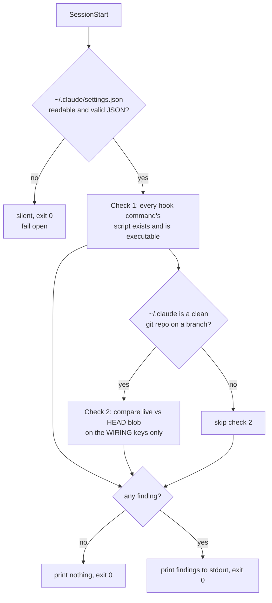

# Hook-wiring health check: say so when a guard is registered but cannot run

Planned 2026-08-22 on `chore/settings-split` @ `dd1a819`. Follows PR #63 and ADR 0032, which
tracked `settings.json` again but left two silent failures open. Triaged via
`triaging-new-instructions`: **hook**, at question 1 — a script decides this entirely from
observable facts, so it needs no `rules/gates.md` stub. It constrains nothing about agent
behaviour; it only reports.

## Problem

Two failures in the guard wiring are invisible today. Both were measured on `claude 2.1.238`,
2026-08-21, not inferred.

**1. A registered hook whose script is missing fails silently and open.** Probe: three
`SessionStart`/`PreToolUse` hooks in one settings file — a control that writes a marker, one
pointing at a non-existent script, and one exiting 2 with a message on stderr.

| hook | what the session showed |
|---|---|
| control | marker written — the runner fired |
| script missing | **nothing.** No stdout, no stderr, no `--debug` output, session exit 0 |
| `exit 2` with stderr | blocked the call, message surfaced verbatim to the model |

So a guard that *denies* is loud, and a guard that *cannot run* is indistinguishable from a guard
that ran and approved. Every hook in `hooks/` is one renamed file away from that state.

**2. The live file can drift from the tracked one unnoticed.** The observability judge on PR #63
found four values in `settings.json` that had drifted from the last tracked version during the
months it was untracked — including `permissions.defaultMode`, a security posture change. Nobody
noticed because nobody diffed against `9cc792f^`. Tracking the file makes drift *visible in
principle*; nothing makes it *announced*.

## Fix

One script, `hooks/verify-hook-wiring.sh`, registered on `SessionStart` alongside the three hooks
already there (`doc-guard.sh`, `memsearch-nudge.sh`, `handoff/slim-session-start.sh`). Its stdout
is surfaced to the session as additional context, which is the existing delivery mechanism —
`memsearch-nudge.sh` already uses it.



### Check 1 — every registered hook can actually run

For each `hooks.<event>[].hooks[].command`: extract the script path it invokes, expand `$HOME`,
and require that it exists and is executable. Report each one that fails, with the event name.

The command strings are shell, not bare paths — the orca entries are a multi-clause
`if [ -f … ] && [ -r … ]; then /bin/sh …; fi`. **Extraction must be conservative:** report only
paths it can identify with confidence and stay silent about the rest. A false alarm here trains
the reader to ignore the check, which is worse than the gap.

### Check 2 — the live file has not drifted from the tracked one

Compare `~/.claude/settings.json` against `git -C ~/.claude show HEAD:settings.json`, semantically
(parsed JSON, key order irrelevant), over the **wiring keys only**:

| Compared | Ignored |
|---|---|
| `hooks`, `permissions`, `statusLine`, `enabledPlugins` | `model`, `effortLevel` |

Ignoring `model`/`effortLevel` is load-bearing, not laziness: ADR 0032 accepted that `/model`
rewrites them, so comparing them would make the check fire after every model switch. A check that
cries wolf is a check that gets ignored — and this one exists precisely because nobody reads a
signal they have learned to skip.

Everything not listed in either column (`theme`, `tui`, notification preferences) is ignored: they
are preferences, and a drift there is not a safety event.

### Non-goals, stated so the card cannot over-promise

- **It cannot detect its own absence.** If `settings.json` vanishes, the `SessionStart` hook
  hosting this check vanishes with it. Mitigation is ADR 0032, not this card: the file is tracked,
  so its disappearance is a `git status` event.
- **It cannot tell a working guard from a broken one that returns 0.** Only that guard's own test
  suite can.
- **It does not block anything.** Always exits 0. It is a smoke alarm, not a lock.

## Contract

- **Exit code:** always `0`. Every internal failure — unreadable file, malformed JSON, no `python3`,
  `~/.claude` not a git repo, detached HEAD, mid-rebase — is a silent no-op. Fail open, never noisy,
  never blocking.
- **Output:** nothing at all when healthy. Findings go to **stdout**, one line each, prefixed
  `verify-hook-wiring:`.
- **Environment:** runs in every session in every repo, so it must reference `$HOME/.claude`
  explicitly and never assume `cwd`.
- **Budget:** ≤150 ms wall clock on a warm cache; it is on the session-start path. Measure it,
  do not assume it.
- **Toolchain, pinned** — measured on this machine 2026-08-22, not recalled:
  `bash` **3.2.57(1)** (macOS system bash — no `mapfile`, no associative arrays, no `${x^^}`),
  `python3` **3.9.6** for JSON parsing, `git` **2.50.1** (Apple Git-155).
  Note 3.9, *not* 3.10+: no `match` statement, no `X | Y` unions at runtime. This is the system
  interpreter the other hooks already run under — `memsearch` gets 3.13 via `uv`, which is a
  different interpreter and is not available here. Add no dependency beyond these three.

## Scenarios

```gherkin
Scenario: healthy wiring stays silent
  Given every registered hook command resolves to an executable file
    And the live settings.json matches HEAD on the wiring keys
  When a session starts
  Then the check prints nothing
    And exits 0

Scenario: a registered hook's script has been renamed away
  Given settings.json registers "$HOME/.claude/hooks/doc-guard.sh" on PreToolUse
    And that file does not exist
  When a session starts
  Then the output names doc-guard.sh, the event PreToolUse, and that it cannot run
    And exits 0

Scenario: a hook script exists but is not executable
  Given a registered command points at an existing file with mode 644
  When a session starts
  Then the output names the file and says it is not executable

Scenario: switching models does not trigger the drift check
  Given the live settings.json differs from HEAD only in "model" and "effortLevel"
  When a session starts
  Then the check prints nothing

Scenario: a guard was removed from the live file
  Given HEAD registers judge-guard.sh but the live settings.json does not
  When a session starts
  Then the output names judge-guard.sh as present in HEAD and absent locally

Scenario: the check cannot do its job and says nothing
  Given ~/.claude/settings.json is not valid JSON
  When a session starts
  Then the check prints nothing
    And exits 0

Scenario: ~/.claude is mid-rebase
  Given a rebase is in progress in ~/.claude
  When a session starts
  Then check 1 still runs
    And check 2 is skipped without comment

Scenario: an unparseable command string is not reported as broken
  Given a hook command whose script path cannot be extracted with confidence
  When a session starts
  Then that command is skipped silently
    And no finding is emitted for it
```

## Tasks

- [ ] 0. Branch `chore/hook-wiring-health-check` + worktree. **Only after `gate confirmed`.**
- [ ] 1. **Red first.** Write `hooks/verify-hook-wiring.test.sh` covering every scenario above,
      against a stub that does nothing. Confirm the suite fails for the stated reasons before any
      implementation exists — and that the "healthy" cases pass against a no-op, so they are known
      not to be the ones proving the feature.
- [ ] 2. Check 1: parse, extract, verify executable. Conservative extraction — a command whose path
      cannot be identified is skipped, never reported.
- [ ] 3. Check 2: semantic comparison on the wiring keys, `model`/`effortLevel` excluded.
- [ ] 4. Prove it can fail: break a real registered hook in a *copy* of `settings.json`, confirm the
      check names it, restore. A green check that has never gone red proves nothing.
- [ ] 5. Measure the runtime against the ≤150 ms budget. Record the number run, not assumed.
- [ ] 6. Register on `SessionStart` in `settings.json` — now a reviewable diff, thanks to PR #63.
- [ ] 7. Full suite green, counts recorded from the run. Note this adds a 20th `*.test.sh`.
- [ ] 8. `hooks/README.md` entry, including the *why an instruction cannot do this job* paragraph
      the other entries carry.
- [ ] 9. Observability judge, then PR.

## Risks

- **False alarms destroy the check.** The orca entries alone are four path references inside one
  shell conditional. If extraction over-reports, the reader learns to ignore the output and the
  check is worse than nothing — it becomes advertised protection that is not protecting, the exact
  pattern `rules/gates.md` names. Conservative extraction and task 4 exist for this.
- **It runs on every session start, everywhere.** A bug here is felt in every repo, not just this
  one. Hence: always exit 0, silent on every internal failure.
- **Check 2 depends on `~/.claude` being a normal git checkout.** Worktrees, detached HEAD, and
  rebases are all normal here — skip rather than guess.
- **This card must not grow into a settings linter.** It answers one question: can the registered
  guards actually run, and does the live wiring still match what was reviewed. Validating hook
  *semantics* is a different feature and needs its own card.

## Blocked on

PR #63 merging first — this card registers a new hook in `settings.json`, which is only a
reviewable change once that PR lands.

## Side effect of this card existing at `phase: planning`

Measured 2026-08-22 against `hooks/phase-guard.sh` in an isolated throwaway repo, with a positive
control, because an all-allow probe cannot tell a permissive guard from a broken one:

| state of `docs/features/` in the scanned checkout | write to `hooks/x.sh` |
|---|---|
| no cards | allow (exit 0) |
| **one `planning` card, branch unclaimed** | **deny (exit 2)** — "phase-guard: write blocked" |
| plus an `implementation` card claiming that branch | allow (exit 0) |

So while this card sits at `planning`, source writes are blocked on any branch that no
`implementation` card claims. Two things bound the blast radius:

- **The guard scans the working checkout's `docs/features/`, not the index or `main`.** A worktree
  is unaffected until this card is actually present on disk there. While it is uncommitted in one
  worktree, no other worktree can see it — verified: the same payload allows in the `rst-adr`
  worktree today.
- `docs/*`, `.claude/*`, `settings.json`, `rules/*` and `skills/*` are exempt, so documentation and
  instruction-surface work is never blocked.

**Corrected 2026-08-22 — this card does not introduce that block; it already exists.**
`origin/main` already carries two un-superseded `planning` cards, `falsify-harness-signatures.md`
and `pane-dispatch-model-flag.md` (the latter is `branch: none`). Confirmed live: an attempted
write to `.bf/backfill.sh` on branch `docs/post-merge-63` was denied, and the guard named all
three planning cards — the two inherited ones and this one. So source writes on an unclaimed
branch are *already* blocked today, and this card makes it a third name in the same message rather
than a new condition.

The operational advice that survives is smaller: **a branch that will touch source needs a card
recording it**, which the gate transition does anyway. The standing hazard is the two inherited
planning cards, not this one — if they are stale, advancing or deleting them is the actual fix,
and it is out of scope here.
