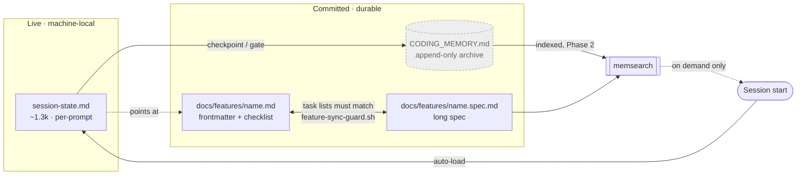

# Split live memory from archived memory

Planned on `main` @ `ecdc223`, session 16 (2026-08-06). Model-switch checkpoint 1: **not yet asked**
— ask before any further planning work resumes.

> **Bootstrapping note.** This file is written in the *current* single-file shape. Task 5 migrates it
> to the pair shape it specifies. Dogfooding the migration on this file first is deliberate: if the
> pair shape is awkward to work in, we find out on the file we own before touching six others.

## Problem

`CODING_MEMORY.md` and the vendored `claude-code-handoff` state both try to answer *"what were we
doing"*, and **neither auto-loads at session start**. The result is one oversized file that is
dangerous to read and one accurate file that nothing reads.

Measured 2026-08-05/06, this repo:

| Fact | Value | Source |
|---|---|---|
| `CODING_MEMORY.md` | 2,491 lines / 231,447 B (**~58k tokens**) | `wc` |
| Its documented cap | **≤200 lines** | `managing-session-memory` SKILL.md:72 |
| Lines 7–2118 | one `## Active Session` log | `grep -n '^#'` |
| `docs/features/phase-guard-hook.md` | 1,779 lines (~33k tokens) for **17** checklist items | `wc`, `grep -c` |
| Auto-loaded memory at session start | **~4,634 tokens** (`CLAUDE.md` + `rules/*` + `MEMORY.md`) | `wc` |
| Handoff files auto-loaded | **0** — `session-start.sh` unregistered by ADR 0006 | `settings.json` |
| `.claude/session-state.md` | current (2026-08-05), 78 lines, correct shape | `ls`, read |
| `.claude/context.md`, `recent-prompts.md`, `task-history.md` | **stale since 2026-07-24** | `ls` |
| memsearch index built | **2026-07-18** (18 days stale; no refresh trigger) | `memory-index/status.json` |
| memsearch sources from `docs/features/` | **0** | `sqlite3 sources` |
| memsearch sources from `CODING_MEMORY.md` | **0** (excluded by config) | `memsearch/config.json` |
| memsearch query latency | **2.56 s** | timed |

### Root cause

`preparing-pull-requests`:12 instructs: after a brainstorm, commit `CODING_MEMORY.md` to `main` so
*"every future branch forked from `main` then inherits the full brainstorm context automatically."*
The file is therefore **designed to accumulate**, with no counterpart trim. It behaved as specified;
the specification was wrong.

### Why trimming is not the fix

The `## Active Session` log is **not duplicated** anywhere. Sampling found unique forensic content:
the root-cause analysis of why 33 tests + 24,016 fuzz cases + a mutation round all missed a live
`git-guard` regression (`:790`), judge-run verdicts with SHAs (`:1500`), and gate answers marked
"GATES ANSWERED (do not re-ask)" (`:2044`).

Worse, **other documents cite it by line number** — `git-guard-empty-index.md` ("Full discovery
record: `CODING_MEMORY.md` lines **790** and **805**"), `stale-phase-guard-rule-text.md` (`:521`,
`:980-989`, `:2053`). Any trim or renumber silently breaks every citation. **Append-only is
therefore a correctness requirement, not a preference.**

## Decisions

Taken by the user 2026-08-05/06, this session. Recorded with the alternative rejected, so a later
session does not re-litigate them.

| # | Decision | Rejected alternative | Why |
|---|---|---|---|
| 1 | `CODING_MEMORY.md` is **retired as a read target** — committed append-only archive, reached only via memsearch | Trim to a ≤200-line index | Trimming breaks line-number citations and destroys unique reasoning |
| 2 | Handoff stays **machine-local and live**; archived into `CODING_MEMORY.md` at checkpoints | Commit `session-state.md`; fold into feature file | Per-prompt rewrites would conflict in every branch |
| 3 | Auto-load `session-state.md` **+** a memsearch nudge seeded from the active branch | Load nothing; load handoff's stock `session-start.sh` | Stock loader injects ~2.1k of stale Jul-24 files |
| 4 | **Two phases** — loader + archive now; memsearch nudge only after the index is trustworthy | Ship together; drop the nudge | Index is 18 days stale and blind to `docs/features/` |
| 5 | Per-prompt `live-handoff.sh` directive stays **exactly as is** | Shrink it; fire only after edits | It is the sole reason `session-state.md` is current while the manual files rotted |
| 6 | Feature files **split into a synced pair**; sync = *task lists must match*, ticking a box is free | Cap + archive; leave as-is | User accepted the one-canonical-file tradeoff, mitigated by hook enforcement |

**Decision 6 knowingly departs from the one-canonical-file gate** (`rules/gates.md`). The gate's
stated hazard — "a reader cannot tell which one is wrong" — is mitigated by `feature-sync-guard.sh`
(task 4) making divergence unstageable rather than merely discouraged. This trade needs an ADR
(task 6).

## Design

Three artifacts, three jobs, no overlap.

| | Handoff (`.claude/session-state.md`) | `CODING_MEMORY.md` | `docs/features/<name>.md` |
|---|---|---|---|
| Answers | *Where was I?* | *Why did we?* | *What am I building?* |
| Storage | machine-local, gitignored | committed | committed |
| Read | **auto at session start** | **never at session start; never whole** | frontmatter + checklist on demand |
| Written | every prompt (hook) | appended at checkpoints | during work |
| Size rule | ~1.3k, self-trimming | **no cap — growth is correct** | checklist file ≤200 lines |



**One-line rule:** *Handoff answers "where was I." `CODING_MEMORY` answers "why did we." Never ask
the second at session start.*

### Routing table

| Moment | Handoff | `CODING_MEMORY.md` | Feature file |
|---|---|---|---|
| Session start | **read (auto)** | never | frontmatter + checklist, on demand |
| Every prompt | write (hook, unchanged) | — | — |
| Task done | write | — | tick box |
| Freshness checkpoint (~35k / major task) | write → **archive into** → | **append** | update |
| Gate transition | write | append | frontmatter |
| After a brainstorm | — | **append entry + pointer** | create if feature-scale |
| PR opened | — | append pointer + `pr-tracking.md` | — |
| Any commit (doc-guard) | — | satisfies the gate | satisfies the gate |
| PreCompact | write (trio, unchanged) | — | — |
| Need past reasoning | — | **memsearch only** | — |
| Branch resume | read | memsearch if needed | read frontmatter + checklist |

### Expected effect — stated honestly

Auto-loaded memory goes from ~4,634 tokens to **~5,934** (adds the 1.3k handoff). **This change does
not reduce mean session-start cost; it raises it slightly.** The benefit is bounding the tail:
restore stops being judgment-only, and the 58k worst case is removed by construction. Any claim of
token *savings* at session start would be unsupported by the measurements above.

## Contracts

### `hooks/handoff/slim-session-start.sh` (new, SessionStart)

Tier 3, informational. Models on `memsearch-nudge.sh`, which is the house pattern for a
session-start hook: **silent on every failure, never delays or breaks a session start.**

```yaml
event: SessionStart
matcher: "*"
emits: contents of $REPO_ROOT/.claude/session-state.md, prefixed "=== Handoff ==="
exits: 0 always
reads: session-state.md only          # never context.md / task-history.md / recent-prompts.md
skips_when:
  - CLAUDE_PANE_AGENT is set          # pane agents must not load interactive state
  - file absent, unreadable, or empty
  - file exceeds MAX_BYTES            # emit a one-line pointer instead of the body
constants:
  MAX_BYTES: 8192                     # ~2k tokens; 78-line current file is 5,345 B
```

### `hooks/feature-sync-guard.sh` (new, PreToolUse Bash)

Tier 1, blocking. Same shape as `doc-guard.sh`; **must** lex via `hooks/lib/shell_segments.py`
(ADR 0015) so a chained `git add … && git commit` is evaluated per segment.

```yaml
event: PreToolUse
matcher: Bash
triggers_on: git commit staging docs/features/<name>.md or docs/features/<name>.spec.md
rule: the set of task identifiers in <name>.md MUST equal the set in <name>.spec.md
blocks: add / remove / rename / re-scope a task in one file without the other matching
allows:
  - ticking a checkbox            "- [ ]" -> "- [x]"
  - appending a completion note under an existing task
  - editing spec prose that adds no task
bypass: FEATURE_SYNC_EXEMPT=<reason>   # logged
fails: closed on parse error of either file
```

Task identity is the checklist item's leading text up to the first `—` or newline, normalized on
whitespace and case. Pinned toolchain: `bash` 3.2 (macOS system), `/usr/bin/jq` 1.7, `python3` 3.13
— matching the existing hooks, which are not free to assume newer.

## Scenarios

```gherkin
Feature: Session start loads the live thread and nothing else

  Scenario: Handoff present and current
    Given .claude/session-state.md exists and is 5,345 bytes
    When a session starts
    Then its contents are emitted under "=== Handoff ==="
    And context.md, task-history.md and recent-prompts.md are not read
    And CODING_MEMORY.md is not read

  Scenario: No handoff yet (new repo)
    Given .claude/session-state.md does not exist
    When a session starts
    Then the hook emits nothing and exits 0
    And session start is not delayed or blocked

  Scenario: Oversized handoff — edge
    Given .claude/session-state.md is 40,000 bytes
    When a session starts
    Then a one-line pointer to the path is emitted instead of the body
    And the session is not charged ~10k tokens for a file that broke its own size rule

  Scenario: Pane agent — edge
    Given CLAUDE_PANE_AGENT is set
    When a session starts
    Then the hook exits 0 silently, loading no interactive state

Feature: The archive is append-only

  Scenario: Checkpoint archives the live thread
    Given a freshness checkpoint fires
    When memory is saved
    Then a dated entry is appended to CODING_MEMORY.md
    And no existing line of CODING_MEMORY.md is modified or removed
    And the citations at :790, :805, :2053 still resolve to the same content

  Scenario: Restore never reads the archive — bad path
    Given a session is restoring
    When the handoff names the active feature
    Then CODING_MEMORY.md is not read at all
    And reading it in full is a defect, not a judgment call

Feature: The feature-file pair cannot silently diverge

  Scenario: Ticking a box needs no spec edit
    Given name.md and name.spec.md list the same 11 tasks
    When task 4 is changed from "- [ ]" to "- [x]" and committed alone
    Then the commit is allowed

  Scenario: Adding a task to one file only — bad path
    Given name.md and name.spec.md list the same 11 tasks
    When a 12th task is added to name.spec.md and committed alone
    Then the commit is blocked
    And the message names the task present in the spec but missing from the checklist

  Scenario: Chained staging — edge, ADR 0015
    Given a 12th task exists only in name.spec.md
    When the agent runs "git add docs/features/x.spec.md && git commit -m msg"
    Then the guard lexes the segments and still blocks the commit

  Scenario: Unparseable checklist — edge
    Given name.md has malformed checklist syntax
    When a commit stages either file
    Then the guard fails closed and blocks, naming the parse error
```

## Phase 2 — memsearch (do not start until Phase 1 has landed)

Blocked on the index being trustworthy. Required before the seeded nudge is wired:

1. Remove `CODING_MEMORY.md` from `exclude_paths` (`memsearch/config.json`). Its exclusion rationale
   — *"ephemeral working index"* (`docs/superpowers/specs/2026-07-17-memory-rag-index-design.md:58`)
   — is falsified by decision 1: it becomes the durable archive.
2. Add `docs/features/**` to indexed sources (currently **0** indexed).
3. Update the golden query asserting the exclusion
   (`memsearch/tests/golden_queries.json`) — it will now fail correctly.
4. Add a refresh trigger; the design deferred this as YAGNI and that deferral caused the 18-day drift.
5. **Re-measure retrieval before wiring anything.** Acceptance: a query naming the active feature
   returns ≥2 hits from that feature's own documents. Today it returns 0 (4 hits, all mid-July
   observability-judge docs, scores ~0.02).
6. Only then extend `slim-session-start.sh` with the seeded query, keeping the 2.56 s latency behind
   a timeout that fails silent.

## Tasks

- [ ] 1 — Model-switch checkpoint 1 (entering planning) — **not yet asked**; ask before resuming
- [ ] 2 — Write `hooks/handoff/slim-session-start.sh` + tests; register at SessionStart
- [ ] 3 — Rewrite `managing-session-memory` §CODING_MEMORY.md and §Restore for the new roles
- [ ] 4 — Write `hooks/feature-sync-guard.sh` + tests; register at PreToolUse Bash
- [ ] 5 — Split this file into the pair shape; then migrate the other 6 feature files
- [ ] 6 — ADR: supersedes ADR 0006 rows 1 and 15; records the decision-6 departure from one-canonical-file
- [ ] 7 — Rewrite `preparing-pull-requests`:12 (append-to-archive, not inherit-context)
- [ ] 8 — Update `rules/gates.md` one-canonical-file stub for the pair shape
- [ ] 9 — Observability judge (implementation stage), then PR
- [ ] 10 — **Phase 2** memsearch work, items 1–6 above — separate branch, after Phase 1 merges

## Open items

- **Task 5 is the expensive one.** Six existing feature files, two of them 1,300–1,779 lines.
  Whether to migrate all six or only the two still in `implementation` is undecided.
- **Compliance judge has not run on this spec.** Required by the spec-compliance gate before the
  user review gate.
- **Unrelated uncommitted work on `main`** (session 16): a coherent RTK removal, bundled with a
  staged deletion of `docs/features/verification-marker-gate.md` (1,166 lines, last touched by spec
  revisions, no implementation merge found). **Not committed — awaiting the user's call.**
