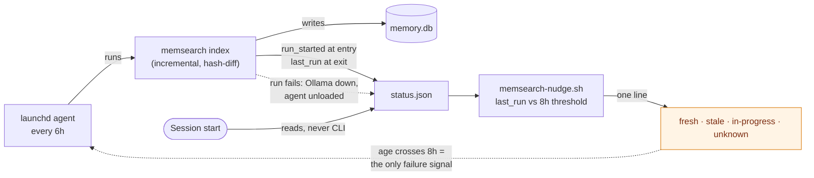

# memsearch freshness — refresh trigger and staleness reporting

Planned on `main` @ `a60a4a7`, session 27 (2026-08-06). This is **Phase 2** of the work whose
Phase 1 shipped as PR #42; it closes task 10 of `docs/features/memory-system-split.md`.

Single-file by design — the pair (`.md` + `.spec.md`) shape is `memory-system-split`'s alone
(ADR 0017, decision 7).

## Spec

### Background — why this exists

The memory index silently froze. At diagnosis (session 27) every one of the 228 rows in `sources`
carried `indexed_at = 2026-07-18`; the last index run was 19 days earlier. Nothing refreshed it,
and — the part that matters — **nothing ever checked**. The `SessionStart` nudge went on announcing
*"2332 chunks of past-session memory indexed"* every session throughout, vouching for an index a
fortnight out of date.

That is the whole defect, and it has two halves. A refresh trigger alone would fix today's
symptom while leaving the next silent failure just as silent. **The reporting half is what makes
the scheduling half honest**, and is why it is built first.

**Premise refresh (session 28).** Those counts are the diagnosis-time state and are no longer live:
a manual `memsearch index` run, started outside any session and orphaned from its shell, was found
already in progress on 2026-08-06 and rebuilt most of the index. `sources` is now 196 rows at
2026-07-18 plus a growing set at 2026-08-06. The defect and its diagnosis are unaffected — the freeze
happened, and nothing reported it — but two consequences follow, both recorded rather than smoothed
over: the stale-index baseline in R9 can never be re-measured, and the blindness ordering R9 relied
on is gone (see R9 and the falsifier).

### Diagnostic findings that revise the parent spec

Measured against the live index before this file was written. Two of the six Phase 2 items in
`memory-system-split.spec.md:540` rest on a wrong premise:

| Parent item | Status | Evidence |
|---|---|---|
| 1 — remove `CODING_MEMORY.md` from `exclude_paths` | **Real, and bigger than one line** | 0 chunks, no `sources` row. The exclusion is *enforced*, not merely configured: `load_config` raises `ConfigError` without it (`memsearch/memsearch/config.py:56-59`), pinned by `test_config.py:42,48` and `test_index.py:93`. Reversing it is R10, not a config edit. |
| 2 — "add `docs/features/**` to indexed sources" | **No-op — nothing to add** | `~/.claude/docs` is *already* a `curated_docs` root. `docs/features/` read 0 only because its earliest file was created 2026-07-25, after the last index run. Confirmed by the session-28 rebuild, which picked the directory up with no config change. |
| 3 — update the golden query | **Real, and not mechanical** | `golden_queries.json:2` asks *why* the file is excluded. Item 1 falsifies the question's **premise**, not just its expected path, so the query is replaced rather than re-pointed (R10.4). |
| 4 — add a refresh trigger | **Root cause, not fourth priority** | Items 2 and 3's symptoms are downstream of the freeze. |
| 5 — re-measure retrieval | **Real, unchanged** | Acceptance bar below. |
| 6 — seeded session-start query | **Out of scope** | Parent spec makes it conditional on item 5 passing. |

Three measurement traps, recorded because each produced a confidently wrong answer on first pass:

- **`memory.db`'s file mtime does not track indexing.** It read `Aug 5` against a Jul 18 index,
  because `query_log` is written on every *query*. **Any refresh trigger keyed on mtime would
  silently never fire.**
- **SQL `_` is a single-character wildcard.** `file_path LIKE '%CODING_MEMORY%'` returns false
  hits by matching `coding-memory/`. Use `LIKE '%CODING\_MEMORY.md' ESCAPE '\'`.
- **`last_indexed` does not mean "when did a run last happen".** It is
  `SELECT max(indexed_at) FROM sources` (`memsearch/memsearch/db.py:156`); `indexed_at` is written
  only inside `replace_source` (`db.py:121,125`); and `_index_one` returns early when a file's hash
  is unchanged (`memsearch/memsearch/index.py:125-127`). **A run that succeeds and finds nothing new
  never advances it.** This is the same species of trap as the first two — a proxy that resembles the
  quantity you want — and the first draft of this spec built its core mechanism on it. See decision 2.

### Design decisions

1. **Refresh every 6h; warn past 8h.** The threshold sits *above* the interval deliberately, so it
   fires only when a run has genuinely been missed rather than during the normal gap between runs.
   A threshold at or below the interval would fire most sessions and train the reader to ignore it
   — strictly worse than silence, because it burns the one channel that reports the failure.
2. **Staleness is measured from `last_run`, a new field, never from `last_indexed`.** The two answer
   different questions: `last_run` is *when the indexer last finished*, `last_indexed` is *how current
   the indexed content is*. Reading the latter for staleness produces a warning that a quiet night
   raises and that re-running cannot clear — decision 1's alert-fatigue failure, arriving on an
   ordinary Tuesday. Two questions, two fields.
3. **The check extends `hooks/memsearch-nudge.sh`; it is not a new hook and does not call the CLI.**
   The hook already opens `status.json` and already parses it for `chunks`; the new fields are in the
   same object. The existing contract — read a plain JSON file rather than invoke `memsearch`, so a
   broken venv or slow interpreter can never delay a session start — is preserved.
4. **`launchd`, not a session hook.** The scheduler stays decoupled from session activity. Its known
   weakness is that it runs blind (a run with Ollama down just fails); decision 1's warning is
   exactly the compensating control, which is why neither half ships alone.
5. **The nudge reports an in-progress run rather than a stale one.** `memsearch` has no lock or
   pidfile, so telling a reader to `run memsearch index` while a run is already going invites a
   second concurrent indexer. This is a safety behaviour, not a nicety, and it is why `run_started`
   exists alongside `last_run`.
6. **A run's error count is reported through `status.json` and read by the nudge — not through the
   exit code.** `_index_one` catches every exception into `report["errors"]` and continues
   (`index.py:135-137`), `run_index` stamps status unconditionally at the end (`index.py:100`), and
   `cli.py:66` returns 0 regardless — so a run with Ollama down that indexed *nothing* completes,
   looks identical to a clean run, and would clear the very warning decision 4 relies on. `launchd`
   is configured without `KeepAlive` and would ignore a non-zero exit anyway, so changing the CLI's
   exit contract buys nothing. **The obligation is therefore on the reader: a non-zero
   `last_run_errors` must never render as a plain fresh line** (R3). A written-but-unread field is
   the same defect this feature exists to fix, one field over.
7. **Scope ends at parent item 5.** Item 6 is excluded: the parent spec conditions it on the
   measurement passing, and building on a result not yet obtained is how the last premise broke.

Decisions 2 and 4 are structural — a new persistent background daemon, and a change to the meaning of
a published status field. Both earn ADR 0018 (task 2).

### Requirements

**R1 — the nudge states how long ago the indexer last finished.** One line, as today. Fresh:
`memsearch: 2332 chunks, last run 3h ago — query with: …`. Stale:
`memsearch: ⚠ stale — 2332 chunks, last run 19d ago; run ~/.claude/memsearch/bin/memsearch index`.

**R2 — the nudge never claims freshness it cannot prove.** A missing, unparseable, or future-dated
`last_run` yields an *unknown-age* line, never a fresh one. Fail toward doubt. Exact wording:
`memsearch: 2332 chunks, age unknown — query with: …`.

**R3 — the nudge reports the state of the last run, not merely its age.** Three states beyond
fresh/stale/unknown, each with its own line and no more than one line total:

- *In progress* — `run_started` is present and either later than `last_run` or `last_run` is absent
  (the first-run case), and the run began less than `RUN_MAX_HOURS` ago:
  `memsearch: index run in progress (started 12m ago) — 2332 chunks; query with: …`
  **No remediation command**, because `memsearch` has no lock and the command would start a second
  concurrent indexer. A `run_started` in the future is treated as absent, never as in-progress —
  otherwise clock skew pins this line forever.
- *Stuck* — an in-progress run that began more than `RUN_MAX_HOURS` ago:
  `memsearch: ⚠ index run stuck (started 9h ago) — 2332 chunks; check for a running 'memsearch index' before starting another`.
  An in-progress claim is not a licence to stay silent forever, but the remediation still may not be
  "run it again" while the old process may be alive.
- *Degraded* — the last completed run reported errors (`last_run_errors > 0`), whatever its age:
  `memsearch: ⚠ last run had 47 errors — 2332 chunks, last run 2h ago; run ~/.claude/memsearch/bin/memsearch index`.
  This is the Ollama-down case, and it is the one decision 4 names as the scheduler's failure mode.

`RUN_MAX_HOURS` defaults to **6**, matching the refresh interval and separate from `STALE_HOURS`:
a run still going when the next is due is by definition the pathological overlap. The two constants
answer different questions — how old a *finished* run may be, and how long a run may *take* — and
collapsing them into one number is the conflation this whole feature exists to correct.

**The reference point is not yet known, and the number an earlier draft gave was wrong.** That
draft cited "1h26m over 601 sources on 2026-08-06" as a measured duration. It was not a duration:
it was a reading taken off a run that had not finished. The same run (PID 30022) was still going at
**2h17m over 683 sources** when this was written, so 1h26m was a stopwatch glance recorded as a
finish time — the same species of trap as the three above, and it is named here rather than quietly
corrected. **The true full-run duration is therefore unmeasured, and may exceed `RUN_MAX_HOURS`**,
which would make the stuck line fire on a healthy first run. Task 9 records the real figure; if it
lands above 6h, `RUN_MAX_HOURS` must be chosen against that measurement rather than against the
refresh interval — a call for the user, not a value to quietly widen.

**R4 — the nudge's existing contract is unchanged.** At most one line; silent on every error path;
never delays or breaks session start; never invokes the `memsearch` CLI or its venv.

**R5 — `status.json` carries the three new fields.** `run_started` (stamped when `run_index` begins),
`last_run` (stamped when it finishes), and `last_run_errors` (the length of the run's error list).
The two timestamps are ISO-8601 UTC with a numeric offset, matching the existing `last_indexed`
format. `last_indexed` is retained unchanged for content recency; the nudge does not print it.

**`memsearch status` is fixed in the same change.** `status.py:27` prints `last_indexed` as its
answer to freshness, which is the identical misreading this feature corrects in the nudge; fixing one
human-facing surface and leaving the other showing the misleading number is not a fix. It gains
`last_run` and `last_run_errors` alongside.

**R6 — a `launchd` agent runs the incremental index every 6h**, surviving reboot, writing stdout
and stderr to its own log so a failed run leaves evidence.

**R7 — the job is installable *and removable* from the repo** via a committed template plus an
install script. The template contains no absolute path; `$HOME` is expanded at install time. The
install fails closed and reports which step failed — it never reports success for a scheduler that is
not loaded.

**Removal is a first-class path**, not a note: a `launchd` agent lives in `~/Library/LaunchAgents`,
outside the repo, so `git revert` does not remove it and no checkpoint covers it. `install-schedule
--uninstall` boots the job out and deletes the rendered plist, and is a no-op-success when nothing is
installed.

**R8 — `memsearch/README.md` documents the new entry point, in the change that creates it.** The
README is the only documentation of `memsearch/bin/`, where `install-schedule` (R7) lands, so it
gains that entry point in the same commit. A README fixed "later" is a README that lies in between.

Its line 22 invariant — "`CODING_MEMORY.md` and `subagents/` transcripts are never indexed" —
is **half falsified by R10** and is corrected in that same commit. The `subagents/` half stands.

**R9 — retrieval is measured against a stated bar.** Five queries are written and committed as their
own commit before any of them is run. Acceptance, at `k=6`: each query returns **≥2 hits** belonging
to the named feature, **each scoring ≥0.30**, with the **top hit** belonging to that feature.

*Membership is mechanical, not a judgment call*: a hit belongs to feature `F` iff its source path is
exactly `docs/features/F.md` or `docs/features/F.spec.md`. Nothing else counts — not an ADR that
mentions `F`, not a transcript discussing it.

*Baseline*: 0 hits from `docs/features/`; the 4 hits that did return scored ~0.02. **This baseline is
frozen and cannot be re-measured** — the session-28 rebuild overwrote the index it was taken from.

*On blindness*: the original plan was to commit the queries before any rebuild, so git history alone
proved they were not tuned to results. That ordering was lost to the orphaned rebuild described in the
Background. What remains is weaker and is stated plainly rather than dressed up: **the queries are
written without first running any query against the rebuilt index, and the guarantee rests on that
discipline plus the single-commit ordering, not on proof from git.** A reader may discount the result
accordingly.

**R10 — `CODING_MEMORY.md` is indexed, and the invariant forbidding it is retired properly.**

*Why the original reason no longer holds.* The exclusion was not arbitrary: the design doc
(`docs/superpowers/specs/2026-07-17-memory-rag-index-design.md:154-163`) excluded the file because
it was a *working index* "whose durable content is **already promoted** into indexed stores —
decisions → `coding-memory/decisions.md` + `docs/decisions/` ADRs, history →
`coding-memory/session-log.md`". **That promotion has stopped.** Measured 2026-08-06:
`session-log.md`'s last entry is dated **2026-07-16**, `decisions.md`'s **2026-07-19**, while
`CODING_MEMORY.md` carries sessions **24 through 30**. Three weeks of decisions and history exist
*only* in the one file the index is configured never to read. The exclusion is no longer merely
outdated — it is the direct cause of a three-week hole in retrieval. `memory-system-split`
independently retired the file as a read target and made it an append-only archive, so "ephemeral
working index" no longer describes it either.

*This reverses a deliberately enforced invariant, so it is not a config edit.* Every one of the
following moves in the **same commit**; a partial reversal leaves the tool refusing to start or the
docs asserting the opposite of the behaviour:

1. **Config** — remove `CODING_MEMORY.md` from `exclude_paths` (`memsearch/config.json`).
2. **The guard** — delete the `ConfigError` check in `memsearch/memsearch/config.py:56-59`. It is
   deleted, not inverted: it exists to enforce a rule that no longer exists, and a guard pinning a
   retired rule is worse than no guard. `load_config` keeps its other validation unchanged.
3. **The three pinning tests** — `test_config.py::test_coding_memory_exclusion_is_mandatory` is
   removed (it asserts the guard fires); `test_config.py::test_is_excluded:48` and
   `test_index.py:93` flip from asserting exclusion to asserting inclusion. **The `subagents/`
   assertions in both stay exactly as they are** — that exclusion is untouched by this change.
4. **The golden query** — `memsearch/tests/golden_queries.json:2` asks *"why is CODING_MEMORY.md
   excluded from the memory rag index"*. Its **premise** is falsified, not just its expected path,
   so it is replaced rather than re-pointed: the new query retrieves session history from
   `CODING_MEMORY.md` itself, which is the behaviour this requirement adds.
5. **The documents that assert the opposite** — `memsearch/README.md:22` (R8), and
   `2026-07-17-memory-rag-index-design.md` at lines 58, 67, 70, 135 plus the "What Is NOT Indexed"
   section at 154-163 whose durable-vs-ephemeral rationale this reverses, and
   `docs/superpowers/plans/2026-07-17-memory-rag-index.md:19`, which records the invariant as
   "enforced by config validation, not convention".
6. **An ADR** under `docs/decisions/`, because this is structural and reverses a documented
   rationale — the options weighed (delete the guard / invert it / weaken it to a warning), the
   evidence above, and the consequence in 7.

*Scope is all three repos, deliberately.* `is_excluded` matches on substring, so removing the entry
indexes `CODING_MEMORY.md` in every `repo_root`, not just `~/.claude`: `vibe-scape` (159 lines) and
`Snatch-Bracket` (119 lines) join `~/.claude`'s 3,232. Their combined 278 lines are negligible
against the corpus, and carving out a per-repo exception would add a special case for no measured
benefit. Named here so the reach is deliberate rather than a side effect.

*The noise risk is real and is measured, not argued.* The original rationale's surviving half — that
indexing session narrative could "pollute semantic search" — is untested. At 285,187 characters
`CODING_MEMORY.md` becomes the single largest source, roughly 2.5× the largest doc currently indexed
(130 chunks). **R9 is the instrument**: it scores feature-file retrieval at `k=6`, so if narrative
chunks crowd feature files out of the top hits, R9 fails and says so. R9 is therefore run *after*
this change lands, and a failure is a real result, not a reason to quietly re-exclude. (The digest
path is *not* a concern: `digest_input_char_cap` applies only to transcripts via
`_transcript_chunks`; docs go through `chunk_doc` and are never truncated by it.)

### Data flow



The dotted return edge is the design's load-bearing part: the scheduler has no self-report, so the
staleness line **is** its monitor.

### Contracts

#### `memsearch/memsearch/index.py` — `_write_status` / `run_index` (edit)

- `run_index` writes `status.json` **twice**: once on entry (stamping `run_started`, preserving the
  prior `last_run` and `last_run_errors`) and once on completion (stamping `last_run` and
  `last_run_errors = len(report["errors"])`).
- `_write_status` gains a parameter distinguishing the two calls. Existing keys — `chunks`,
  `sources`, `last_indexed`, `db_bytes`, `embed_model`, `embed_dim` — are unchanged in name,
  meaning, and format.
- Timestamps: `datetime.now(timezone.utc).isoformat()` → `2026-08-06T20:01:40+00:00`. Matches the
  existing `last_indexed` format, which `python3` 3.9's `fromisoformat` parses (it rejects a `Z`).
- A crashed or killed run leaves `run_started > last_run`. That is the stuck-run case R3 covers;
  the package does not attempt recovery.
- The CLI's exit code is unchanged (decision 6).

#### `memsearch/memsearch/status.py` (edit)

- The `sources: N  last_indexed: …` line (`status.py:27`) gains `last_run` and `last_run_errors`.
- `last_indexed` stays, relabelled so it reads as content recency rather than as the answer to
  "is the index fresh" — that misreading is the defect this feature exists to correct.

#### `hooks/memsearch-nudge.sh` (edit — SessionStart, Tier 3 informational)

- Reads `${MEMSEARCH_STATUS:-$HOME/.claude/memory-index/status.json}`. Unchanged.
- Parses `chunks` (existing) plus `last_run`, `run_started`, and `last_run_errors` (new) from that
  one object, in the existing `python3` call. No second interpreter start.
- `STALE_HOURS` defaults to **8** and `RUN_MAX_HOURS` to **6**, both overridable by env for tests.
- Emits **at most one line**. Exit 0 on every path, including every failure.
- Classification, first match wins. A timestamp is *usable* only if it parses and is not in the
  future; an unusable one is treated exactly as absent, for both fields.

  | # | Condition | Line |
  |---|---|---|
  | 1 | `run_started` usable, and (`last_run` absent or `run_started > last_run`), and `now − run_started < RUN_MAX_HOURS` | in progress |
  | 2 | same as 1 but `now − run_started ≥ RUN_MAX_HOURS` | stuck ⚠ |
  | 3 | `last_run` absent or unusable | unknown age |
  | 4 | `now − last_run ≥ STALE_HOURS` | stale ⚠ |
  | 5 | `last_run_errors > 0` | degraded ⚠ |
  | 6 | otherwise | fresh |

- Row 1 covers the first run after upgrade, when `run_started` exists and `last_run` does not yet.
- Rows 4 and 5 both warn; stale wins when both hold, because its remediation is the same and the
  older signal is the more urgent one.
- Age rendered `Nm` under an hour, `Nh` under a day, else `Nd`, on every line that names an age.
- Unchanged: absent `status.json` → exit 0 silently; `chunks` absent or 0 → exit 0 silently.

#### `memsearch/launchd/local.memsearch-index.plist.template` (new)

| Key | Value |
|---|---|
| `Label` | `local.memsearch-index` |
| `ProgramArguments` | `["__HOME__/.claude/memsearch/bin/memsearch", "index"]` |
| `EnvironmentVariables` → `PATH` | `/opt/homebrew/bin:/usr/bin:/bin:/usr/sbin:/sbin` |
| `EnvironmentVariables` → `PYTHONUNBUFFERED` | `1` |
| `StartInterval` | `21600` |
| `RunAtLoad` | `true` |
| `ProcessType` | `Background` |
| `StandardOutPath` / `StandardErrorPath` | `__HOME__/.claude/memory-index/scheduled-index.log` |

- **`PATH` is load-bearing, not boilerplate.** `launchctl getenv PATH` is empty on this machine, so a
  job inherits only `/usr/bin:/bin:/usr/sbin:/sbin`. `memsearch/bin/memsearch` is a one-line
  `exec uv run …` wrapper and `uv` lives in `/opt/homebrew/bin`. Without this key the job dies at
  exec, every 6h, while the installer reports success.
- **`PYTHONUNBUFFERED`** because the log block-buffers at 8KB otherwise, losing the tail of a run
  killed hard — which is exactly the run whose evidence matters.
- **`__HOME__` placeholder only** — no absolute path committed (`rules/core-conduct.md`,
  supply-chain invariant).
- Log filename is `scheduled-index.log`, deliberately distinct from the existing
  `~/.claude/memory-index/reindex.log`, which is the artifact of the session-28 manual run and is not
  written by this agent.
- Must pass `plutil -lint` once rendered; the rendered file is mode `0644` (`launchd` refuses a
  group- or world-writable plist).

#### `memsearch/bin/install-schedule` (new)

- Renders the template to `~/Library/LaunchAgents/local.memsearch-index.plist`, creating that
  directory (mode `0755`) if absent.
- Then `launchctl bootout gui/$(id -u)/local.memsearch-index` — a "not found" result is success, any
  other failure is fatal — followed by `launchctl bootstrap gui/$(id -u) <plist>`.
- Verifies with `launchctl print gui/$(id -u)/local.memsearch-index` after bootstrap. The install is
  successful only if that verification succeeds; a bootstrap that reports success but leaves nothing
  loaded is a failed install.
- Idempotent: re-running replaces cleanly and is not an error.
- `--uninstall` boots the job out and removes the rendered plist, exiting `0` when nothing was
  installed. It never touches `memory-index/` — removing the schedule must not destroy the index.
- Exit codes, each printing which step failed to stderr: `0` success · `1` render or `plutil -lint`
  failure, nothing bootstrapped · `2` `bootout`/`bootstrap`/verification failure · `3`
  `~/Library/LaunchAgents` missing and uncreatable, or not writable.
- Fails closed throughout: on any non-zero path the script exits non-zero and never prints a success
  message.

### Scenarios

```gherkin
Scenario: Fresh index reports its age
  Given status.json has last_run 3 hours ago and chunks 2332
  When the SessionStart nudge runs
  Then one line is emitted naming the age
  And it carries no stale marker

Scenario: Stale index is flagged with remediation
  Given status.json has last_run 19 days ago
  When the nudge runs
  Then the line carries the stale marker and the index command

Scenario: The threshold itself counts as stale
  Given last_run is exactly 8 hours ago
  When the nudge runs
  Then the line is stale
  But at 7 hours 59 minutes it is fresh

Scenario: A successful run that changes nothing keeps the line fresh
  Given last_indexed is 19 days old because no watched file has changed
  And last_run is 1 hour ago
  When the nudge runs
  Then the line is fresh
  And it does not tell the reader to run the indexer

Scenario: A run in progress is not reported as stale
  Given run_started is 12 minutes ago and is later than last_run
  When the nudge runs
  Then the line reports a run in progress
  And it carries no remediation command

Scenario: A stuck run is flagged without inviting a second indexer
  Given run_started is 9 hours ago and is later than last_run
  When the nudge runs
  Then the line reports the run as stuck
  And it does not tell the reader to run the indexer

Scenario: The first run after upgrade has no last_run yet
  Given run_started is 5 minutes ago and last_run is absent
  When the nudge runs
  Then the line reports a run in progress
  And it is not the unknown-age line

Scenario: A run that failed on every file is never reported as fresh
  Given last_run is 2 hours ago and last_run_errors is 47
  When the nudge runs
  Then the line carries a warning marker naming the error count
  And it is not the fresh line

Scenario: A clean recent run is fresh
  Given last_run is 2 hours ago and last_run_errors is 0
  When the nudge runs
  Then the line is fresh

Scenario: A future run_started is not a run in progress
  Given run_started is 3 hours in the future and last_run is 2 hours ago
  When the nudge runs
  Then the line is fresh
  And it does not report a run in progress

Scenario: A future timestamp never reads as fresh
  Given last_run is 2 hours in the future
  When the nudge runs
  Then the line reports unknown age
  And it is not the fresh line

Scenario: Malformed status.json stays silent
  Given status.json is not valid JSON
  When the nudge runs
  Then nothing is emitted
  And the exit status is 0

Scenario: last_run absent from an otherwise valid file
  Given status.json has chunks 2332 and no last_run key
  When the nudge runs
  Then the line reports unknown age
  And chunks is still reported

Scenario: A failed scheduled run becomes visible
  Given the launchd agent has not completed a run for 9 hours
  When a session starts
  Then the stale line is emitted

Scenario: A completed run stamps its own completion
  Given an index run finishes with 2 errors
  When status.json is read
  Then last_run is the completion time
  And last_run_errors is 2
  And last_indexed is unchanged if no file content changed

Scenario: Installing the agent loads it
  Given no local.memsearch-index job is loaded
  When install-schedule runs
  Then the rendered plist is at ~/Library/LaunchAgents with mode 0644
  And launchctl print reports the job
  And the exit status is 0

Scenario: Installing twice is not an error
  Given the agent is already loaded
  When install-schedule runs again
  Then the job is replaced cleanly
  And the exit status is 0

Scenario: A malformed plist is never bootstrapped
  Given the rendered plist fails plutil -lint
  When install-schedule runs
  Then nothing is bootstrapped
  And the exit status is 1
  And no success message is printed

Scenario: A failed bootstrap is not reported as success
  Given launchctl bootstrap fails
  When install-schedule runs
  Then the failing step is named on stderr
  And the exit status is 2

Scenario: An unwritable LaunchAgents directory fails closed
  Given ~/Library/LaunchAgents cannot be created or written
  When install-schedule runs
  Then the exit status is 3
  And no plist is left behind

Scenario: Uninstalling removes the job and its plist
  Given the agent is loaded
  When install-schedule --uninstall runs
  Then launchctl print no longer reports the job
  And the rendered plist is gone
  And the memory-index directory is untouched

Scenario: Uninstalling when nothing is installed is not an error
  Given no local.memsearch-index job is loaded
  When install-schedule --uninstall runs
  Then the exit status is 0

Scenario: The committed template hides no absolute path
  Given the template in the repo
  When it is searched for the user's home path
  Then no absolute path is present
  And the __HOME__ placeholder is

Scenario: CODING_MEMORY.md is indexed once the exclusion is lifted
  Given CODING_MEMORY.md is absent from exclude_paths
  When the index runs
  Then a sources row exists for CODING_MEMORY.md in every repo root
  And its chunks are retrievable by query

Scenario: The config no longer refuses to start without the exclusion
  Given a config whose exclude_paths omits CODING_MEMORY.md
  When load_config reads it
  Then it returns a Config without raising ConfigError

Scenario: Lifting the exclusion does not un-exclude subagent transcripts
  Given CODING_MEMORY.md has been removed from exclude_paths
  When the index runs
  Then no sources row exists for any path under subagents/

Scenario: The golden query is replaced, not re-pointed
  Given the golden query asking why CODING_MEMORY.md is excluded
  When the exclusion is lifted
  Then that query is removed because its premise is false
  And a query retrieving session history from CODING_MEMORY.md replaces it

Scenario: Every document asserting the exclusion is corrected in the same commit
  Given the commit that removes CODING_MEMORY.md from exclude_paths
  When that commit is inspected
  Then memsearch/README.md no longer claims CODING_MEMORY.md is never indexed
  And the memory-rag-index design doc no longer lists it under What Is NOT Indexed
  And the memory-rag-index plan no longer calls the exclusion config-enforced
  And an ADR recording the reversal is present

Scenario: The README documents the new entry point
  Given bin/install-schedule has been added
  When memsearch/README.md is read
  Then it documents install-schedule alongside the other bin/ entry points

Scenario: memsearch status reports run recency, not just content recency
  Given a completed run with errors
  When memsearch status runs
  Then last_run and last_run_errors are shown
  And last_indexed is no longer presented as the freshness answer

Scenario: Retrieval is scored against the stated bar
  Given the five committed measurement queries
  When each is run at k=6
  Then the pass or fail of each is recorded under Verification
  And a failing result is recorded as a failure
```

### Toolchain — pinned

Verified on this machine 2026-08-06, not remembered.

| Tool | Version | Note |
|---|---|---|
| `bash` | 3.2.57 | BSD. No `timeout` binary on PATH. |
| `python3` | 3.9.6 | System; runs the hook. `datetime.fromisoformat` **does not** parse `Z`; the stored `+00:00` it does parse. |
| `uv` | 0.11.28 (Homebrew) | At `/opt/homebrew/bin/uv`. **The runtime the scheduled job actually executes** — `memsearch/bin/memsearch` is `exec uv run --project …`. |
| `python` (venv) | 3.12.13 | Homebrew; runs `memsearch` itself under `uv`. |
| `sqlite3` | 3.51.0 | Diagnostics only; not on the hook's path. |
| `launchd` / `launchctl` | macOS 25.5.0 | `bootstrap`/`bootout`, not the deprecated `load`/`unload`. |
| embed model | `qwen3-embedding:0.6b` (1024-dim) | Unchanged — changing it forces `index --full`. |
| digest model | `qwen3.6:35b-mlx` | Unchanged. `keep_alive=0`. |

### Falsifier — written before the code

> This has failed if, across the 20 sessions after it lands: (a) a session starts with `last_run`
> older than `STALE_HOURS` and no stale line is emitted; (b) a stale line is emitted while the last
> run finished less than `STALE_HOURS` ago — including the case where that run changed no files;
> (c) the `launchd` agent stops running and nothing surfaces it within `STALE_HOURS`; (d) any of the
> five measurement queries is modified after the commit that introduced them; (e) the nudge emits
> more than one line, or a non-zero exit, on any path; or (f) a run that errored on every source is
> reported as fresh, or an in-progress or stuck line arrives carrying the remediation command.

(a), (b), (e) and (f) are hook tests. (c) and (d) are observations. **(d) is weaker than first written**:
it can still be checked from git history, but it no longer proves the queries were authored before
the index was rebuilt, because the rebuild happened first (Background, R9).

### Non-goals

- Parent item 6, the seeded session-start query.
- Re-scoping *what* of `CODING_MEMORY.md` gets indexed. R10 indexes the whole file. Indexing only
  its session headers, or weighting it below ADRs, are plausible refinements — deliberately not
  attempted, because R9 measures whether the whole-file version actually degrades retrieval and
  there is no point tuning against a guess. If R9 fails, that measurement is the input to the
  refinement.
- Restarting the promotion pipeline the design doc assumed (`session-log.md` and `decisions.md`,
  both ~3 weeks stale — see R10). R10 makes the archive searchable; it does not revive the
  summarisation habit that stopped. Named so the gap stays visible.
- A lock or pidfile for concurrent `memsearch index` runs. R3 stops the nudge from *inviting* one —
  neither the in-progress nor the stuck line carries the remediation command — but nothing prevents a
  reader from starting one anyway. Named here so the gap is deliberate rather than overlooked.
- Retrying or recovering a failed run. R3's degraded line reports that one happened; the scheduler
  simply tries again in 6h.
- Re-measuring retrieval on any cadence after this lands. R9 measures once, at landing — an index
  that is reliably fresh but retrieves noise stays silent afterwards.
- Changing the `memsearch` CLI's exit-code contract (decision 6).
- The `REVISIT: reconsider Qdrant` trigger now firing from ADR 0002 — a live, pre-registered
  decision point, deliberately untouched here.
- Backfilling `outcome: null` on existing judge verdicts.
- Making bypass logging durable across the `*_EXEMPT` hooks.

### What success means

Not "memsearch works" — **"we finally know whether it does."** A reliably fresh index that still
retrieves noise is a legitimate and useful outcome of this branch, and R9 is written so that
result is reportable rather than embarrassing.

## Tasks

Model per task set at checkpoint 2, which is **not yet asked**. Checkpoint 1 (entering planning)
was asked and answered 2026-08-06: **Opus 5**.

- [ ] 1 — Model-switch checkpoint 2 (planning → implementation); record the answer here, create
      the branch, set `phase: implementation`.
- [ ] 2 — Write `docs/decisions/0018-*.md`: adopting a persistent `launchd` agent as the refresh
      mechanism, and splitting run recency (`last_run`) from content recency (`last_indexed`).
      Options weighed, why these won, consequences.
- [ ] 3 — Add `run_started`, `last_run`, `last_run_errors` to `status.json` (R5), written at both
      ends of `run_index`, and surface the two new fields in `memsearch status` (`status.py:27`);
      extend `memsearch/tests/test_index.py` and `test_cli.py`. Existing keys unchanged.
- [ ] 4 — Extend `hooks/memsearch-nudge.sh` for R1–R4; extend `hooks/memsearch-nudge.test.sh` to
      cover the fourteen nudge scenarios plus the registration assertion. **The degraded-line test
      must assert the emitted line, not the parsed field** — a field nobody reads is the defect this
      task exists to close. Hand-run a mutation check.
- [ ] 5 — Add the `launchd` template and `memsearch/bin/install-schedule`, install and `--uninstall`
      (R6, R7), with a `plutil -lint` test, the eight install/uninstall scenarios, and an assertion
      that no absolute path is committed.
- [ ] 6 — Document `bin/install-schedule` in `memsearch/README.md`, **in the same commit that adds
      it** (R8). This is the `bin/` section only; `README.md:22`'s exclusion invariant is task 7's,
      in task 7's commit. Record parent item 2 as a verified no-op — no config change.
- [ ] 7 — **Lift the `CODING_MEMORY.md` exclusion (R10) — one commit, all six parts.** Remove it
      from `exclude_paths` (`memsearch/config.json`); delete the `ConfigError` guard
      (`config.py:56-59`); remove `test_config.py::test_coding_memory_exclusion_is_mandatory` and
      flip `test_is_excluded:48` and `test_index.py:93` to assert inclusion, **leaving both
      `subagents/` assertions untouched**; replace `golden_queries.json:2` (premise falsified, not
      just its path); correct `memsearch/README.md:22`,
      `docs/superpowers/specs/2026-07-17-memory-rag-index-design.md` (lines 58, 67, 70, 135 and the
      "What Is NOT Indexed" section, 154-163) and
      `docs/superpowers/plans/2026-07-17-memory-rag-index.md:19`; and write
      `docs/decisions/0019-*.md` recording the reversal with the measured evidence that the
      promotion pipeline stopped. Run the full `memsearch` test suite — the guard's removal touches
      every `load_config` caller.
- [ ] 8 — Write the five measurement queries and commit them as their own commit, before running
      any of them (R9). **After task 7**, so the queries are written against the corpus they will
      be scored on.
- [ ] 9 — Install the agent and run the first scheduled index. Confirm the job is loaded, that
      `scheduled-index.log` receives output, and that `CODING_MEMORY.md` now has a `sources` row in
      each repo root. **Record the run's real wall-clock duration** and, if it exceeds
      `RUN_MAX_HOURS`, stop and put the constant back to the user (R3).
- [ ] 10 — Score the five queries at `k=6` against R9's bar; record pass/fail per query under
      `## Verification`, including a failing result if that is the truth. **A failure here is a
      real result about R10's noise cost** — report it, do not silently re-exclude the file.
- [ ] 11 — Observability judge (implementation stage), then PR.

## Verification

<Appended during review: pass/fail per area and open issues only.>
