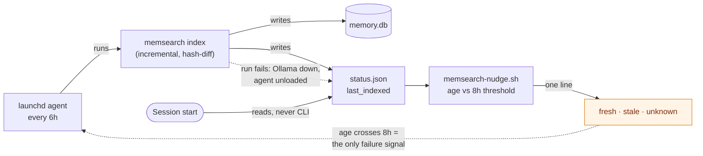

# memsearch freshness — refresh trigger and staleness reporting

Planned on `main` @ `a60a4a7`, session 27 (2026-08-06). This is **Phase 2** of the work whose
Phase 1 shipped as PR #42; it closes task 10 of `docs/features/memory-system-split.md`.

Single-file by design — the pair (`.md` + `.spec.md`) shape is `memory-system-split`'s alone
(ADR 0017, decision 7).

## Spec

### Background — why this exists

The memory index silently froze. Every one of the 228 rows in `sources` carries
`indexed_at = 2026-07-18`; the last index run was 19 days before this was written. Nothing
refreshed it, and — the part that matters — **nothing ever checked**. The `SessionStart` nudge
went on announcing *"2332 chunks of past-session memory indexed"* every session throughout,
vouching for an index a fortnight out of date.

That is the whole defect, and it has two halves. A refresh trigger alone would fix today's
symptom while leaving the next silent failure just as silent. **The reporting half is what makes
the scheduling half honest**, and is why it is built first.

### Diagnostic findings that revise the parent spec

Measured against the live index before this file was written. Two of the six Phase 2 items in
`memory-system-split.spec.md:540` rest on a wrong premise:

| Parent item | Status | Evidence |
|---|---|---|
| 1 — remove `CODING_MEMORY.md` from `exclude_paths` | **Real, unchanged** | 0 chunks, no `sources` row. Exclusion works. |
| 2 — "add `docs/features/**` to indexed sources" | **No-op — nothing to add** | `~/.claude/docs` is *already* a `curated_docs` root. `docs/features/` reads 0 only because its earliest file was created 2026-07-25, after the last index run. 12 of 46 `.md` files under `docs/` predate 2026-07-18; exactly 13 sources under `.claude/docs` are indexed — the indexed set *is* the pre-run set. |
| 3 — update the golden query | **Real, unchanged** | Follows mechanically from item 1. |
| 4 — add a refresh trigger | **Root cause, not fourth priority** | Items 2 and 3's symptoms are downstream of the freeze. |
| 5 — re-measure retrieval | **Real, unchanged** | Acceptance bar below. |
| 6 — seeded session-start query | **Out of scope** | Parent spec makes it conditional on item 5 passing. |

Two measurement traps, recorded because both produced a confidently wrong answer on first pass:

- **`memory.db`'s file mtime does not track indexing.** It read `Aug 5` against a Jul 18 index,
  because `query_log` is written on every *query*. Freshness must be read from `last_indexed`,
  never from a file mtime. **Any refresh trigger keyed on mtime would silently never fire.**
- **SQL `_` is a single-character wildcard.** `file_path LIKE '%CODING_MEMORY%'` returns 154 false
  hits by matching `coding-memory/`. Use `LIKE '%CODING\_MEMORY.md' ESCAPE '\'`.

### Design decisions

1. **Refresh every 6h; warn past 8h.** The threshold sits *above* the interval deliberately, so it
   fires only when a run has genuinely been missed rather than during the normal gap between runs.
   A threshold at or below the interval would fire most sessions and train the reader to ignore it
   — strictly worse than silence, because it burns the one channel that reports the failure.
2. **The check extends `hooks/memsearch-nudge.sh`; it is not a new hook and does not call the CLI.**
   The hook already opens `status.json` and already parses it for `chunks`; `last_indexed` is in the
   same object. The existing contract — read a plain JSON file rather than invoke `memsearch`, so a
   broken venv or slow interpreter can never delay a session start — is preserved.
3. **`launchd`, not a session hook.** The scheduler stays decoupled from session activity. Its known
   weakness is that it runs blind (a run with Ollama down just fails); decision 1's warning is
   exactly the compensating control, which is why neither half ships alone.
4. **Scope ends at parent item 5.** Item 6 is excluded: the parent spec conditions it on the
   measurement passing, and building on a result not yet obtained is how the last premise broke.

### Requirements

**R1 — the nudge states the index's true age.** One line, as today. Fresh:
`memsearch: 2332 chunks, indexed 3h ago — query with: …`. Stale:
`memsearch: ⚠ stale — 2332 chunks, last indexed 19d ago; run ~/.claude/memsearch/bin/memsearch index`.

**R2 — the nudge never claims freshness it cannot prove.** A missing, unparseable, or
future-dated `last_indexed` yields an *unknown-age* line, never a fresh one. Fail toward doubt.
Exact wording: `memsearch: 2332 chunks, age unknown — query with: …`.

**R3 — the nudge's existing contract is unchanged.** At most one line; silent on every error path;
never delays or breaks session start; never invokes the `memsearch` CLI or its venv.

**R4 — a `launchd` agent runs the incremental index every 6h**, surviving reboot, writing stdout
and stderr to a log so a failed run leaves evidence.

**R5 — the job is installable from the repo** via a committed template plus an install script.
The template contains no absolute path; `$HOME` is expanded at install time.

**R6 — `CODING_MEMORY.md` is indexed.** Removed from `exclude_paths`; the golden query asserting
its exclusion is updated to match, since it will now fail correctly.

**R7 — retrieval is measured blind.** Five queries are written and **committed before** the index
is rebuilt. Acceptance, at `k=6`: each query returns **≥2 hits** from the named feature's own
documents, **each scoring ≥0.30**, with the **top hit** from that feature. Baseline to beat: 0 hits
from `docs/features/`; the 4 hits that do return score ~0.02.

### Data flow



The dotted return edge is the design's load-bearing part: the scheduler has no self-report, so the
staleness line **is** its monitor.

### Contracts

#### `hooks/memsearch-nudge.sh` (edit — SessionStart, Tier 3 informational)

- Reads `${MEMSEARCH_STATUS:-$HOME/.claude/memory-index/status.json}`. Unchanged.
- Parses `chunks` (existing) and `last_indexed` (new) from that one object, in the existing
  `python3` call. No second interpreter start.
- `last_indexed` is ISO-8601 with offset (`2026-07-18T06:18:01+00:00`). Age = now − parsed value.
- `STALE_HOURS` defaults to **8**, overridable by env for tests.
- Emits **at most one line**. Exit 0 on every path, including every failure.
- Age classification:
  - `0 ≤ age < 8h` → fresh line, age rendered `Nm` under an hour, `Nh` under a day, else `Nd`.
  - `age ≥ 8h` → stale line with the `⚠` marker and the remediation command.
  - field absent, unparseable, or **negative age** (future timestamp / clock skew) → unknown-age
    line. Never fresh.
- Unchanged: absent `status.json` → exit 0 silently; `chunks` absent or 0 → exit 0 silently.

#### `memsearch/launchd/local.memsearch-index.plist.template` (new)

- `StartInterval` **21600** (6h). `RunAtLoad` true. `StandardOutPath`/`StandardErrorPath` to a log
  under `~/.claude/memory-index/`.
- `__HOME__` placeholder only — no absolute path committed (`rules/core-conduct.md`,
  supply-chain invariant).
- Must pass `plutil -lint` once rendered.

#### `memsearch/bin/install-schedule` (new)

- Renders the template to `~/Library/LaunchAgents/`, then `launchctl bootout` (ignoring "not
  found") followed by `launchctl bootstrap`. Idempotent: re-running replaces cleanly.
- Refuses to run if the rendered plist fails `plutil -lint`. Fail closed.

### Scenarios

```gherkin
Scenario: Fresh index reports its age
  Given status.json has last_indexed 3 hours ago and chunks 2332
  When the SessionStart nudge runs
  Then one line is emitted naming the age
  And it carries no stale marker

Scenario: Stale index is flagged with remediation
  Given status.json has last_indexed 19 days ago
  When the nudge runs
  Then the line carries the stale marker and the index command

Scenario: The threshold itself counts as stale
  Given last_indexed is exactly 8 hours ago
  When the nudge runs
  Then the line is stale
  But at 7 hours 59 minutes it is fresh

Scenario: A future timestamp never reads as fresh
  Given last_indexed is 2 hours in the future
  When the nudge runs
  Then the line reports unknown age
  And it is not the fresh line

Scenario: Malformed status.json stays silent
  Given status.json is not valid JSON
  When the nudge runs
  Then nothing is emitted
  And the exit status is 0

Scenario: last_indexed absent from an otherwise valid file
  Given status.json has chunks 2332 and no last_indexed key
  When the nudge runs
  Then the line reports unknown age
  And chunks is still reported

Scenario: A failed scheduled run becomes visible
  Given the launchd agent has not completed a run for 9 hours
  When a session starts
  Then the stale line is emitted
```

### Toolchain — pinned

Verify before use; these are the versions measured on this machine, not remembered ones.

| Tool | Version | Note |
|---|---|---|
| `bash` | 3.2.57 | BSD. No `timeout` binary on PATH. |
| `python3` | 3.9.6 | System. `datetime.fromisoformat` **does not** parse `Z`; the stored format uses `+00:00`, which it does parse. |
| `sqlite3` | system | Diagnostics only; not on the hook's path. |
| `launchd` / `launchctl` | macOS 25.5.0 | `bootstrap`/`bootout`, not the deprecated `load`/`unload`. |
| embed model | `qwen3-embedding:0.6b` (1024-dim) | Unchanged — changing it forces `index --full`. |
| digest model | `qwen3.6:35b-mlx` | Unchanged. `keep_alive=0`. |

### Falsifier — written before the code

> This has failed if, across the 20 sessions after it lands: (a) a session starts with
> `status.json` older than `STALE_HOURS` and no stale line is emitted; (b) a stale line is emitted
> while the index is younger than `STALE_HOURS`; (c) the `launchd` agent stops running and nothing
> surfaces it within `STALE_HOURS`; (d) any of the five measurement queries is modified after the
> rebuild commit; or (e) the nudge emits more than one line, or a non-zero exit, on any path.

(a), (b) and (e) are hook tests. (c) and (d) are observations — (d) is checkable from git history,
which is the point of committing the queries first.

### Non-goals

- Parent item 6, the seeded session-start query.
- The `REVISIT: reconsider Qdrant` trigger now firing from ADR 0002 — a live, pre-registered
  decision point, deliberately untouched here.
- Backfilling `outcome: null` on existing judge verdicts.
- Making bypass logging durable across the `*_EXEMPT` hooks.

### What success means

Not "memsearch works" — **"we finally know whether it does."** A reliably fresh index that still
retrieves noise is a legitimate and useful outcome of this branch, and R7 is written so that
result is reportable rather than embarrassing.

## Tasks

Model per task set at checkpoint 2, which is **not yet asked**. Checkpoint 1 (entering planning)
was asked and answered 2026-08-06: **Opus 5**.

- [ ] 1 — Model-switch checkpoint 2 (planning → implementation); record the answer here, create
      the branch, set `phase: implementation`.
- [ ] 2 — Extend `hooks/memsearch-nudge.sh` for R1–R3; extend `hooks/memsearch-nudge.test.sh` to
      cover all seven scenarios plus the registration assertion. Hand-run a mutation check.
- [ ] 3 — Add the `launchd` template and `memsearch/bin/install-schedule` (R4, R5), with a
      `plutil -lint` test and an assertion that no absolute path is committed.
- [ ] 4 — Remove `CODING_MEMORY.md` from `exclude_paths` in `memsearch/config.json` (R6). Record
      parent item 2 as a verified no-op — no config change.
- [ ] 5 — Update `memsearch/tests/golden_queries.json` for the changed exclusion (R6).
- [ ] 6 — Write the five measurement queries and **commit them before any rebuild** (R7). This
      commit is the blindness proof; nothing after it may edit them.
- [ ] 7 — Install the agent and run the first index. Confirm `docs/features/` is picked up with no
      config change, falsifying or confirming the item-2 no-op finding.
- [ ] 8 — Score the five queries at `k=6` against R7's bar; record pass/fail per query under
      `## Verification`, including a failing result if that is the truth.
- [ ] 9 — Observability judge (implementation stage), then PR.

## Verification

<Appended during review: pass/fail per area and open issues only.>
