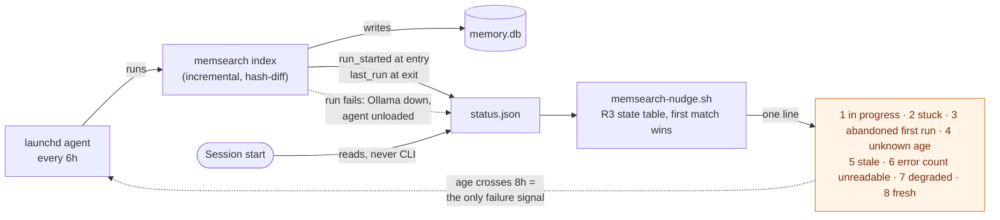

> **Frontmatter note (2026-08-09):** `branch:` read `feature/memsearch-freshness` for three sessions
> after that branch was merged and deleted — a stale value that agrees with itself and disagrees with
> every checkout. Corrected to `none`. Review-phase follow-ups since then have run on their own short
> branches (`docs/post-merge-followups-45`, `docs/r9-counterfactual-control`); this field names the
> *feature's* branch, and the feature no longer has one.

> **Frontmatter note (2026-08-20):** Reopened to `phase: planning` for R9 remedy work — the R9
> acceptance bar (5 of 5 measurement queries, `:315-331`) has never passed; the best measured state is
> 3 of 5 (`:2333`), gated on a `curated_doc` weight tier for judge verdicts that does not exist yet
> (`:2341-2358`). One-canonical-file discipline: this stays the same feature file rather than a new
> one (see task 12). `branch:` now names `worktree-fix+memsearch-r9-retrieval-quality`, pre-provisioned
> by `EnterWorktree` before this session decided to reopen planning — not created at the
> planning→implementation gate the template assumes; it carries through to implementation rather than
> a second branch being cut. The remedy section's own forward-reference to "ADR 0021" (`:2341`) is
> stale: that number was already claimed by the launchd/run-recency decision (task 2, below) before
> this section was written. Next free ADR number as of 2026-08-20 was **0030** (`ls docs/decisions/`)
> — re-derive at time of use, other parallel branches may claim it first.

# memsearch freshness — refresh trigger and staleness reporting

Planned on `main` @ `a60a4a7`, session 27 (2026-08-06). This is **Phase 2** of the work whose
Phase 1 shipped as PR #42; it closes task 10 of `docs/features/memory-system-split.md`.

Single-file by design — the pair (`.md` + `.spec.md`) shape is `memory-system-split`'s alone
(ADR 0017, decision 7).

## Spec

### Background — why this exists

The memory index silently froze. At diagnosis (session 27) every one of the 228 rows in `sources`
carried `indexed_at = 2026-07-18`; the last index run was 19 days earlier. Nothing refreshed it,
and — the part that matters — **nothing ever checked**. The `SessionStart` nudge went on announcing
*"2332 chunks of past-session memory indexed"* every session throughout, vouching for an index a
fortnight out of date.

That is the whole defect, and it has two halves. A refresh trigger alone would fix today's
symptom while leaving the next silent failure just as silent. **The reporting half is what makes
the scheduling half honest**, and is why it is built first.

**Premise refresh (session 28).** Those counts are the diagnosis-time state and are no longer live:
a manual `memsearch index` run, started outside any session and orphaned from its shell, was found
already in progress on 2026-08-06 and rebuilt most of the index. That run has since finished:
re-measured 2026-08-07, `sources` holds **911 rows — 187 still at 2026-07-18 and 724 at
2026-08-06**. The defect and its diagnosis are unaffected — the freeze
happened, and nothing reported it — but two consequences follow, both recorded rather than smoothed
over: the stale-index baseline in R9 can never be re-measured, and the blindness ordering R9 relied
on is gone (see R9 and the falsifier).

### Diagnostic findings that revise the parent spec

Measured against the live index before this file was written. Two of the six Phase 2 items in
`memory-system-split.spec.md:540` rest on a wrong premise:

| Parent item | Status | Evidence |
|---|---|---|
| 1 — remove `CODING_MEMORY.md` from `exclude_paths` | **Real, but insufficient on its own** | 0 chunks and no `sources` row — which has **two** sufficient causes, not one. The exclusion is *enforced* (`load_config` raises `ConfigError` without it, `config.py:57-60`, pinned by `test_config.py:42,48` and `test_index.py:93`) **and** `~/.claude/CODING_MEMORY.md` is not on any walked path (`CLAUDE.md`, `MEMORY.md` also 0 rows). Removing the entry alone changes nothing for it. See R10. |
| 2 — "add `docs/features/**` to indexed sources" | **No-op — nothing to add** | `~/.claude/docs` is *already* a `curated_docs` root. `docs/features/` read 0 only because its earliest file was created 2026-07-25, after the last index run. Confirmed by the session-28 rebuild, which picked the directory up with no config change. |
| 3 — update the golden query | **Real, and not mechanical** | `golden_queries.json` **line 4** (line 2 is a different, still-correct query) asks *why* the file is excluded. Item 1 falsifies the question's **premise**, not just its expected path, so it is replaced rather than re-pointed (R10.5). |
| 4 — add a refresh trigger | **Root cause, not fourth priority** | Items 2 and 3's symptoms are downstream of the freeze. |
| 5 — re-measure retrieval | **Real, unchanged** | Acceptance bar below. |
| 6 — seeded session-start query | **Out of scope** | Parent spec makes it conditional on item 5 passing. |

Three measurement traps, recorded because each produced a confidently wrong answer on first pass:

- **`memory.db`'s file mtime does not track indexing.** It read `Aug 5` against a Jul 18 index,
  because `query_log` is written on every *query*. **Any refresh trigger keyed on mtime would
  silently never fire.**
- **SQL `_` is a single-character wildcard.** `file_path LIKE '%CODING_MEMORY%'` returns false
  hits by matching `coding-memory/`. Use `LIKE '%CODING\_MEMORY.md' ESCAPE '\'`.
- **`last_indexed` does not mean "when did a run last happen".** It is
  `SELECT max(indexed_at) FROM sources` (`memsearch/memsearch/db.py:156`); `indexed_at` is written
  only inside `replace_source` (`db.py:121,125`); and `_index_one` returns early when a file's hash
  is unchanged (`memsearch/memsearch/index.py:125-127`). **A run that succeeds and finds nothing new
  never advances it.** This is the same species of trap as the first two — a proxy that resembles the
  quantity you want — and the first draft of this spec built its core mechanism on it. See decision 2.

### Design decisions

1. **Refresh every 6h; warn past 8h.** The threshold sits *above* the interval deliberately, so it
   fires only when a run has genuinely been missed rather than during the normal gap between runs.
   A threshold at or below the interval would fire most sessions and train the reader to ignore it
   — strictly worse than silence, because it burns the one channel that reports the failure.
2. **Staleness is measured from `last_run`, a new field, never from `last_indexed`.** The two answer
   different questions: `last_run` is *when the indexer last finished*, `last_indexed` is *how current
   the indexed content is*. Reading the latter for staleness produces a warning that a quiet night
   raises and that re-running cannot clear — decision 1's alert-fatigue failure, arriving on an
   ordinary Tuesday. Two questions, two fields.
3. **The check extends `hooks/memsearch-nudge.sh`; it is not a new hook and does not call the CLI.**
   The hook already opens `status.json` and already parses it for `chunks`; the new fields are in the
   same object. The existing contract — read a plain JSON file rather than invoke `memsearch`, so a
   broken venv or slow interpreter can never delay a session start — is preserved.
4. **`launchd`, not a session hook.** The scheduler stays decoupled from session activity. Its known
   weakness is that it runs blind (a run with Ollama down just fails); decision 1's warning is
   exactly the compensating control, which is why neither half ships alone.
5. **The nudge reports an in-progress run rather than a stale one — for the first
   `RUN_ABANDON_HOURS`.** `memsearch` has no lock or pidfile, so telling a reader to
   `run memsearch index` while a run is already going invites a second concurrent indexer. This is a
   safety behaviour, not a nicety, and it is why `run_started` exists alongside `last_run`.
   ⚠️ *Bounded, not absolute — corrected in round 9.* Past `RUN_ABANDON_HOURS` R3's table
   deliberately reclassifies the same run as **state 5, stale**, which *does* carry the index
   command; the guarantee holds up to that threshold and no further. Stated unconditionally here
   through round 8, contradicting both the table and the concurrency Non-goal, which had the bounded
   version right. R3's table is authoritative; see the Non-goal for the trade.
6. **A run's error count is reported through `status.json` and read by the nudge — not through the
   exit code.** `_index_one` catches every exception into `report["errors"]` and continues
   (`index.py:135-137`), `run_index` stamps status unconditionally at the end (`index.py:100`), and
   `cli.py:66` returns 0 regardless — so a run with Ollama down that indexed *nothing* completes,
   looks identical to a clean run, and would clear the very warning decision 4 relies on. `launchd`
   is configured without `KeepAlive` and would ignore a non-zero exit anyway, so changing the CLI's
   exit contract buys nothing. **The obligation is therefore on the reader: a non-zero
   `last_run_errors` must never render as a plain fresh line** (R3). A written-but-unread field is
   the same defect this feature exists to fix, one field over.
7. **Scope ends at parent item 5.** Item 6 is excluded: the parent spec conditions it on the
   measurement passing, and building on a result not yet obtained is how the last premise broke.

Decisions 2 and 4 are structural — a new persistent background daemon, and a change to the meaning of
a published status field. Both earn ADR 0021 (task 2) — written as 0018, renumbered before merge.

### Requirements

**R1 — the nudge states how long ago the indexer last finished.** One line, as today. Fresh:
`memsearch: 2332 chunks, last run 3h ago — query with: …`. Stale:
`memsearch: ⚠ stale — 2332 chunks, last run 19d ago; run ~/.claude/memsearch/bin/memsearch index`.

**R2 — the nudge never claims freshness it cannot prove.** A missing, unparseable, or future-dated
`last_run` **never yields a fresh line**. Fail toward doubt.

⚠️ *Corrected in round 7 — R2 previously pinned one exact line for that whole condition
(`memsearch: 2332 chunks, age unknown — query with: …`) and thereby contradicted the state table
that governs it.* **Which** non-fresh line is emitted is decided by R3's table, not here: a missing
`last_run` with a usable recent `run_started` is **state 1, in progress**, not unknown-age — as the
"first run after upgrade" scenario asserts with *"And it is not the unknown-age line"* — and the
same input at greater age is **state 2** or **state 3**. Unknown-age is **state 4** only, and only
when 1-3 did not match. R2 states the *guarantee* (never fresh without proof); the table states the
*wording*. Restating a specific line here is what put this requirement out of sync, so it does not
restate one.

⚠️ *R2 has one known exception, recorded rather than hidden:* a run that walks **zero files**
completes cleanly and does render as fresh, because `status.json` carries no walked-source count.
See the Non-goals bullet of the same name. The guarantee above holds for every condition R3's table
classifies; it does not hold for a run whose corpus silently vanished.

**R3 — the nudge reports the state of the last run, not merely its age.**

#### The state table — the single source of truth

**This table, together with the eight rendered lines beneath it, is authoritative.** The table
defines the *conditions*; the numbered block below defines the *wording*. Together they are the only
place either is defined.

⚠️ **Every other surface naming a state is found by a sweep, mechanically — and the sweep's output is
never stored in this document.** Rounds 5, 6 and 7 each patched a hand-maintained derived-surface
list and each left instances behind; round 7's list was itself stale, naming a section round 5 had
deleted. A hand-maintained list of duplicates had become one more duplicate to maintain.

⚠️ **Storing the sweep's *output* then failed the same way the hand-written list had.** Round 8's
version of this paragraph claimed the sweep covered "all 1,163 lines" — the line count of the
**previous** round's file. Round 9 added a second stored inventory, for R9. **Both shipped a stale
copy inside the anti-staleness section itself**, which is why neither a line count nor an inventory
appears here now: a description of the document, stored inside the document, is a duplicate like any
other.

So what this section defines is the **method**, and the method is the deliverable:

> Sweep the whole document for every state name, every rendered line, and every ordering claim.
> Key the result by **section, never by line number** — a line number is itself a copy of the
> document's structure, and an earlier draft's line numbers were stale inside a single editing
> session. The result lives in the sweep's output, not in this file.

**Task 1b runs this sweep at implementation time**, against the document as it then exists, and
re-runs it whenever the state table changes.

**What the sweep must count as a derived surface** — the part a careful reading keeps missing:

- *An ordering claim is duplication.* The `memsearch-nudge.sh` contract bullet declares the state
  list *"deliberately not restated here"* and then restates its ordering properties in the next
  sentence. That is the honest shape of this defect — not carelessness, but that *ordering* feels
  like commentary rather than duplication. It is duplication.
- *A section that asserts precedence is restating the table*, not merely pointing at it. Every
  hand-written list missed the Design decisions for exactly this reason.
- *A state named in prose, without its number, is still a surface.*

*Anything added to this spec that names a state is a surface the next sweep must find.* Each
hand-maintained version under-counted the same way: it fixed the instance in front of it and left
the class open.

**Eight states. First match wins. One line per state, never more.** The two silent paths — absent
`status.json`, and `chunks` absent or 0 — sit outside this table and emit nothing at all (R4).

| # | State | Condition | ⚠ | Remediation |
|---|---|---|---|---|
| 1 | in progress | `run_started` usable · (`last_run` absent or `run_started` > `last_run`) · age < `RUN_MAX_HOURS` | — | none |
| 2 | stuck | as 1, but `RUN_MAX_HOURS` ≤ age < `RUN_ABANDON_HOURS` | ⚠ | the log |
| 3 | abandoned first run | `last_run` absent · `run_started` present, in the past, age ≥ `RUN_ABANDON_HOURS` | ⚠ | the log |
| 4 | unknown age | `last_run` absent or unusable (and 3 did not match) | — | none |
| 5 | stale | `now − last_run` ≥ `STALE_HOURS` | ⚠ | the index command |
| 6 | error count unreadable | `last_run_errors` absent, non-integer, or negative | ⚠ | the log |
| 7 | degraded | `last_run_errors` > 0 | ⚠ | the log |
| 8 | fresh | otherwise | — | none |

A timestamp is **usable** only if it parses and is not in the future; an unusable one is treated
exactly as absent, for both fields. "The log" is always
`~/.claude/memory-index/scheduled-index.log`; "the index command" is always
`~/.claude/memsearch/bin/memsearch index`.

The emitted lines, one per state, in the same order:

1. `memsearch: index run in progress (started 12m ago) — 2332 chunks; query with: …`
2. `memsearch: ⚠ index run stuck (started 9h ago) — 2332 chunks; see ~/.claude/memory-index/scheduled-index.log`
3. `memsearch: ⚠ 2332 chunks — first index run never completed (started 2d ago); see ~/.claude/memory-index/scheduled-index.log`
4. `memsearch: 2332 chunks, age unknown — query with: …`
5. `memsearch: ⚠ stale — 2332 chunks, last run 19d ago; run ~/.claude/memsearch/bin/memsearch index`
6. `memsearch: ⚠ 2332 chunks, last run 2h ago (error count unreadable) — see ~/.claude/memory-index/scheduled-index.log`
7. `memsearch: ⚠ last run had 47 errors — 2332 chunks, last run 2h ago; see ~/.claude/memory-index/scheduled-index.log`
8. `memsearch: 2332 chunks, last run 3h ago — query with: …`

#### Why each state exists

- **1, in progress** carries **no remediation command**, because `memsearch` has no lock and the
  command would start a second concurrent indexer. A `run_started` in the future is unusable, never
  in-progress — otherwise clock skew pins this line forever. Row 1 also covers the first run after
  upgrade, when `run_started` exists and `last_run` does not yet.
- **2, stuck** — an in-progress claim is not a licence to stay silent forever, but the remediation
  still may not be "run it again" while the old process may be alive, so it points at the log, which
  holds the evidence.
- **3, abandoned first run** exists because states 1 and 2 *decay* — past `RUN_ABANDON_HOURS` a
  `run_started` stamp stops being *believed*, though it remains **usable** in the table's sense.
  ⚠️ *Wording corrected in round 6:* this sentence previously read that the stamp "becomes
  unusable, exactly as a future one is", which contradicts the definition above it — a timestamp is
  usable iff it **parses and is not in the future**, and an old stamp satisfies both. Two different
  meanings of one defined term is precisely the duplication round 5's state table was built to
  remove, so the term keeps its single definition and only the age threshold moves a run between
  states. State 3 matches exactly as row 3 states it: `last_run` absent, `run_started` present, in
  the past, age ≥ `RUN_ABANDON_HOURS`. Without a state to catch it, the
  first-ever run being killed falls through to **4, unknown age**: no marker, no log pointer, and a
  reader told only "age unknown" about a scheduler that died on its first attempt. That is this
  feature's own defect one field over — a surface that reports something while vouching for nothing.
  Where a *prior* `last_run` exists, decay instead falls through to **5, stale**, whose remediation
  works. Without decay the feature keeps a hole shaped like the bug it exists to fix: a run killed
  mid-flight leaves the in-progress stamp behind, only the *next* run clears it, and if the scheduler
  is dead there is no next run — so the reader gets "⚠ index run stuck" every session, checks for a
  running indexer, finds none, and is **never told the scheduler died**. The falsifier's clause (c)
  would read as *passed* in that state, because something did surface; it merely said the wrong thing.
- **6, error count unreadable** — **unknown is not zero.** R2's "fail toward doubt" rule is scoped to
  *timestamps*, and a plain `get("last_run_errors", 0)` reads a missing field as a clean run —
  vouching for precisely what it cannot see. The age is known and stays reported; only the claim of
  cleanliness is withheld. It carries `⚠` because it is a warning state, like every other row that
  withholds a clean bill of health.
- **7, degraded** is the Ollama-down case decision 4 names as the scheduler's failure mode. **The
  remediation is the log, not the indexer.** Re-running a multi-hour index is not a diagnosis, and R6
  sets `PYTHONUNBUFFERED` precisely so this log survives a hard kill. One consequence is named rather
  than smoothed over: a single permanently-failing source pins the count at 1, so this ⚠ fires every
  session until a human fixes that source. That is decision 1's alert-fatigue risk, accepted here
  because the count is *specific* and the log makes it actionable in one step.

#### The three constants

`STALE_HOURS` **8** · `RUN_MAX_HOURS` **6** · `RUN_ABANDON_HOURS` **24**.

`RUN_MAX_HOURS` matches the refresh interval: a run still going when the next is due is by definition
the pathological overlap. `RUN_ABANDON_HOURS` is four missed refresh cycles. The three answer three
different questions — how old a *finished* run may be (8), how long a run may *take* before it is
suspect (6), and how long an in-progress claim may stand before it is no longer believed at all (24)
— and collapsing any of them into one number is the conflation this whole feature exists to correct.

**Both run constants are re-chosen against task 9's measured cold-run duration, and
`RUN_ABANDON_HOURS` is the stricter obligation of the two.** A cold run that exceeds `RUN_MAX_HOURS`
merely mislabels a healthy run as stuck; a cold run approaching `RUN_ABANDON_HOURS` makes state 5
fire — **with the index command — while the first run is still alive**, which is precisely the second
concurrent indexer states 1 and 2 exist to prevent. `RUN_ABANDON_HOURS` must therefore exceed the
measured cold-run duration by a clear margin, and that margin is a call for the user, not a value to
quietly widen. The trade is named rather than hidden: decay buys the dead-scheduler signal at the cost
of the concurrency guarantee holding only up to `RUN_ABANDON_HOURS` (see Non-goals).

**The reference point is not yet known, and the number an earlier draft gave was wrong.** That
draft cited "1h26m over 601 sources on 2026-08-06" as a measured duration. It was not a duration:
it was a reading taken off a run that had not finished. The same run (PID 30022) was still going at
**2h17m over 683 sources** when this was written, so 1h26m was a stopwatch glance recorded as a
finish time — the same species of trap as the three above, and it is named here rather than quietly
corrected. **The true full-run duration is therefore unmeasured, and may exceed `RUN_MAX_HOURS`**,
which would make the stuck line fire on a healthy first run. Task 9 records the real figure; if it
lands above 6h, `RUN_MAX_HOURS` must be chosen against that measurement rather than against the
refresh interval — a call for the user, not a value to quietly widen.

**R4 — the nudge's existing contract is unchanged.** At most one line; silent on every error path;
never delays or breaks session start; never invokes the `memsearch` CLI or its venv.

**R5 — `status.json` carries the three new fields.** `run_started` (stamped when `run_index` begins),
`last_run` (stamped when it finishes), and `last_run_errors` (the length of the run's error list —
a non-negative integer; any other value, or its absence, is *unknown*, never zero, per R3). The two
timestamps are ISO-8601 UTC at second precision with a numeric offset, matching the existing
`last_indexed` format exactly. `last_indexed` is retained unchanged for content recency; the nudge
does not print it.

**`memsearch status` is fixed in the same change.** `status.py:27` prints `last_indexed` as its
answer to freshness, which is the identical misreading this feature corrects in the nudge; fixing one
human-facing surface and leaving the other showing the misleading number is not a fix. It gains
`last_run` and `last_run_errors` alongside.

**R6 — a `launchd` agent runs the incremental index every 6h**, surviving reboot, writing stdout
and stderr to its own log so a failed run leaves evidence.

**R7 — the job is installable *and removable* from the repo** via a committed template plus an
install script. The template contains no absolute path; `$HOME` is expanded at install time. The
install fails closed and reports which step failed — it never reports success for a scheduler that is
not loaded.

**Removal is a first-class path**, not a note: a `launchd` agent lives in `~/Library/LaunchAgents`,
outside the repo, so `git revert` does not remove it and no checkpoint covers it. `install-schedule
--uninstall` boots the job out and deletes the rendered plist, and is a no-op-success when nothing is
installed.

**R8 — `memsearch/README.md` documents the new entry point, in the change that creates it.** The
README is the only documentation of `memsearch/bin/`, where `install-schedule` (R7) lands, so it
gains that entry point in the same commit. A README fixed "later" is a README that lies in between.

Its line 22 invariant — "`CODING_MEMORY.md` and `subagents/` transcripts are never indexed" —
is **half falsified by R10** and is corrected in that same commit. The `subagents/` half stands.

**R9 — retrieval is measured against a stated bar.** Five queries are written and committed as their
own commit before any of them is run. Acceptance, at `k=6`, is **two rank clauses, both binding**:

1. **≥2 hits** belonging to the named feature.
2. The **top hit** belongs to that feature.

**There is no score clause.** Both clauses are rank-based, both can genuinely fail, and both gate
this branch. Task 8b still records every hit's raw score as a **baseline for future comparison** —
that record is the durable value — but no pass mark is set from it.

⚠️ ***R9 passes iff all five queries satisfy both clauses. Four of five is a failure.*** Round 8
said "both clauses gate this branch" and never said how many queries had to clear them, which made
one-of-five a literal satisfaction of every sentence in the requirement — a recording step wearing a
gate's clothing. **This is not in tension with R10's "a failing R9 is a legitimate outcome":** that
sentence governs what a failure *means* (evidence about the archive's noise cost, to be reported and
judged, not silently reverted), not whether the bar is lenient. R9 is strict; the response to a
failure is deliberation, not automatic rollback.

#### R9's derived surfaces are swept, not listed

R9 is restated in several places — tasks, falsifier clauses, scenarios — and **this section is the
authoritative one.** Round 8's drift landed in those restatements precisely because R9 had no
enumeration while R3 did, which is why **task 1b's sweep covers R9's clauses as well as R3's state
names.** No inventory is stored here: round 9 stored one, and it was stale by round 10 — the same
failure, for the same reason, as the R3 inventory it was modelled on.

⚠️ ***The five features must span the corpus size range: at least one target in the bottom third
and at least one in the top third, by chunk count.***

⚠️ ***The range is the population of every feature under `docs/features/`, per-feature summed — not
the range of the five chosen.*** Measured against the five, the rule cannot fail: the smallest of any
five sits in its own bottom third by construction and the largest in its own top third, so every
possible sample passes and the guard measures nothing. The falsifier calls four large targets plus
one medium a falsification — which is true only under the fixed-population reading, so that is the
reading that holds. A rule that no sample can violate is not a weaker guard than intended; it is
the absence of one.

⚠️ ***"Third" means a rank tertile of that population, not a slice of its value span.*** Rank the
population ascending by per-feature chunk count: the bottom third is the lowest ⌊N/3⌋ entries, the
top third the highest ⌊N/3⌋. **N is counted at task-8 time and is deliberately not pinned here** —
and it is counted per feature exactly as the targets are, so a feature spanning two files
contributes one entry, not two.

*Why this needed saying:* under the value-span reading one outsized feature stretches the span far
enough that a **mid-ranked** target falls inside the "bottom third" — admitting precisely the
four-large-plus-one-medium sample falsifier (i) calls a falsification. Round 11 fixed the population
and left the tertile undefined, so all four surfaces stayed silent in the same way and agreed with
each other while the rule underneath them was still underdetermined. **Surfaces agreeing is not the
same as a rule being defined**, which is why this one was found by reading the rule rather than by
comparing its copies.

⚠️ ***The counting unit is the feature, not the file: a target's chunk count is the sum over every
file belonging to that feature.*** A feature that spans several files counts as a small target when
read off its largest file alone and a mid-range one when summed — enough slack to move a sample out
of the bottom third while still reading as compliant. Per-file is therefore not a lenient reading of
this rule; it is a different and weaker rule.

A large target has many more chances to land two hits in a top-6 than a small one, so **choosing
five fat targets would pass both clauses while measuring nothing** — the same tuning the retired
score floor allowed, moved from the number to the sample. Each target's per-feature chunk count is
recorded beside its result, so a soft sample is visible rather than buried.

**This wording is the rule.** Every restatement of it — tasks, falsifier clauses, scenarios — is a
derived surface that task 1b's sweep must find. ⚠️ *No list of those surfaces appears here, and the
reason is round 10:* it fixed the three restatements an enumerated list named and missed a fourth,
the Gherkin scenario, which was the one that would have become an executable check encoding the
weaker per-file rule. The list was the failure mode, not the fix.

⚠️ ***The counts are computed from the source files at task-8 time, never read from the index, and
no count is pinned in this document.*** Round 8 pinned eleven counts here (`6` to `91`) taken from
`memory.db`. **Ten were right and the eleventh was this spec's own file**, listed at 14 chunks
because the index last read it on `2026-08-06T20:01:42Z` at roughly 250 lines — it is now over a
thousand, so the indexed figure covered about a fifth of the document and understated it several-fold.
Being in the "bottom third" was an artifact of the stale index, which would have let this very file
qualify as the small target while actually being one of the large ones — **satisfying the
anti-gaming rule by doing the thing it forbids.**

**A spec whose thesis is "the index lies about its freshness" calibrated its anti-gaming guard by
asking the index instead of the files.** That is this feature's own defect, committed inside the
requirement meant to prevent gaming, and it is recorded rather than quietly corrected because it is
the sharpest available evidence for why R9 measures the corpus rather than trusting a stored
number. Ranking by any figure written here is forbidden for the same reason: this file grows every
round, so a count pinned today is wrong by task 8 whatever its source.

⚠️ ***A third clause existed through round 7 and is deliberately gone (user decision, 2026-08-07).
Its history is kept because the failure is instructive.*** Through round 5 this requirement read
"each scoring **≥0.30**". **That bar is unreachable by construction.**
`search.py:61-64` fuses exactly two retrievers by reciprocal rank, each contributing at most
`1/(RRF_K + 1)` with `RRF_K = 60` (`search.py:19`), and `:80` multiplies the sum by the chunk's
weight, the largest of which is `curated_doc: 1.5`. The hard ceiling is therefore
`2 × 1/61 × 1.5 =` **0.04918** — verified 2026-08-07 by a live query whose top hits scored
**0.046514** and **0.040114**. A floor of 0.30 is **six times the maximum the scorer can emit**, so
clause 3 as written could only ever fail, for every query, no matter how good retrieval was.

The disproof was already in this document: the *Baseline* two paragraphs below records the hits that
did return as scoring **~0.02**. A bar of 0.30 sat directly above a measurement an order of
magnitude beneath it for five rounds. **This is the same defect the feature exists to fix** — a
check that reports failure while telling you nothing about the thing it claims to check — and it is
recorded here rather than silently corrected, because a number that survived five judge rounds is
evidence about the review, not just about the number.

**Round 6 replaced that bar with a floor set from measurement. Round 7 showed why that also failed,
and round 8 removed the clause rather than repair it a third time.** A floor drawn *after* seeing
where the scores landed cannot fail the run that set it — draw the finish line behind the runners
and everyone places. R9 is measured **once, at landing, never again** (see Non-goals), so there is no
later run for the floor to grade either. The clause would have been guaranteed to pass on the only
day it was ever evaluated: a green light carrying no information, plus a stop-and-ask step whose
only realistic failure mode was being skipped.

**What survives is the part that was always doing the work.** Task 8b still records every hit's raw
score — the raw numbers are a real baseline a future change can be compared against, and they are
strictly more informative than a pass mark derived from them. The *verdict* rests on clauses 1 and 2,
which were fixed before the queries were written and can genuinely fail, and on the `-m golden` net.

*Three attempts at one clause is the argument for deleting it.* Round 5 set a bar six times the
scorer's ceiling; round 6 made it self-fulfilling; round 7 added a falsifier clause to stop it being
skipped, which was a guard on a guard. A measurement that needs that much scaffolding to mean
anything was not measuring anything.

*Membership is mechanical, not a judgment call*: a hit belongs to feature `F` iff its source path is
exactly `docs/features/F.md` or `docs/features/F.spec.md`. Nothing else counts — not an ADR that
mentions `F`, not a transcript discussing it.

***R9's bar cannot be measured by the existing golden harness, and the five queries therefore get
their own runner.*** Verified 2026-08-07: `tests/test_golden_queries.py:37-41` asserts only
`any(expect_path_contains in p for p in paths)` — **presence somewhere in top-k, with no score
floor, no top-hit check, and no ≥2 count.** Both of R9's clauses are invisible to it. Worse,
only the 11 `must` entries can fail at all; the 3 `stretch` and 2 `negative` entries call
`warnings.warn` and pass unconditionally (`:47-52`, `:57-60`). Scoring R9 through that harness would
report a pass whenever one feature file appeared anywhere in six results at any score — a bar so
much weaker than the stated one that it would answer a different question while looking like an
answer to this one. The five queries live in their own file with a runner that reads the scores
`search()` already returns, and the two measurements stay distinct: **`-m golden` is the
noise-regression net over the pre-existing 16; R9's runner is the retrieval bar.** Task 10 runs both.

*Baseline*: 0 hits from `docs/features/`; the 4 hits that did return scored ~0.02. **This baseline is
frozen and cannot be re-measured** — the session-28 rebuild overwrote the index it was taken from.

*On blindness*: the original plan was to commit the queries before any rebuild, so git history alone
proved they were not tuned to results. That ordering was lost to the orphaned rebuild described in the
Background. What remains is weaker and is stated plainly rather than dressed up: **the queries are
written without first running any query against the rebuilt index, and the guarantee rests on that
discipline plus the single-commit ordering, not on proof from git.** A reader may discount the result
accordingly.

**R10 — `CODING_MEMORY.md` is indexed, and the invariant forbidding it is retired properly.**

*Why the original reason no longer holds.* The exclusion was not arbitrary: the design doc
(`docs/superpowers/specs/2026-07-17-memory-rag-index-design.md:154-163`) excluded the file because
it was a *working index* "whose durable content is **already promoted** into indexed stores —
decisions → `coding-memory/decisions.md` + `docs/decisions/` ADRs, history →
`coding-memory/session-log.md`". **That promotion has stopped.** Measured 2026-08-06:
`session-log.md`'s last entry is dated **2026-07-16**, `decisions.md`'s **2026-07-19** — both
re-verified 2026-08-07 and both still frozen — while `CODING_MEMORY.md` carries sessions
**24 through 31**. Three weeks of decisions and history exist
*only* in the one file the index is configured never to read. The exclusion is no longer merely
outdated — it is the direct cause of a three-week hole in retrieval. `memory-system-split`
independently retired the file as a read target and made it an append-only archive, so "ephemeral
working index" no longer describes it either.

**⚠️ Lifting the exclusion is necessary but NOT sufficient, and this is the trap.** An earlier draft
of R10 specified only the exclusion removal. That would have changed nothing for the file it
targets: **`~/.claude/CODING_MEMORY.md` is not on any indexed path to begin with.** `curated_docs`
is `~/.claude/coding-memory`, `~/.claude/docs`, `~/.claude/PORTS.md` — *not* the `~/.claude` root.
Measured 2026-08-06: `~/.claude/CLAUDE.md` and `~/.claude/MEMORY.md` are **0 rows each**;
`PORTS.md` is indexed solely because `curated_docs` names that one file. The diagnostic table's
"0 chunks, no `sources` row" for `CODING_MEMORY.md` therefore had **two** sufficient causes, and the
exclusion was only one of them — the same confounded-proxy error the three measurement traps above
record. The file must **join the walked route**, not merely be un-banned.

*It gets its own weight tier* (user decision, 2026-08-06). `_iter_docs` (`index.py:44-51`) hardcodes
`source_type` per bucket — everything from `curated_docs` becomes `curated_doc` (weight **1.5**,
tied with ADRs and design docs), everything under a `repo_root` becomes `repo_doc` (**1.2**). Adding
the file to `curated_docs` alone would rank the whole archive of session narrative *equal to the
decision records it narrates* — amplifying the exact pollution the original exclusion feared. A new
`archive_doc` tier at **1.0** keeps it fully retrievable while never outranking a real decision
record. 1.0 matches `transcript_digest` because it is the same kind of content — narrative — and is
a distinct key so it can be tuned independently once R9 measures it.

Every one of the following moves in the **same commit**; a partial application leaves the tool
refusing to start, or silently indexing nothing, or the docs asserting the opposite of the
behaviour:

1. **Config** (`memsearch/config.json`) — remove `CODING_MEMORY.md` from `exclude_paths`; **add
   `~/.claude/CODING_MEMORY.md` to `curated_docs`** (this is the part that makes it reachable);
   add `"archive_doc": 1.0` to `weights`.
2. **The guard** — delete `memsearch/memsearch/config.py:57-60` (the `if not any(...)` and its
   `raise ConfigError(...)`). **Line 56 is `excludes = tuple(raw.get("exclude_paths", ()))` and must
   survive** — deleting it breaks every `load_config` caller. Deleted, not inverted: it enforces a
   rule that no longer exists, and a guard pinning a retired rule is worse than no guard.
3. **The new tier** — add `"archive_doc"` to `SOURCE_TYPES` (`db.py:16`), and classify in
   `_iter_docs` so that a file named `CODING_MEMORY.md` yields `archive_doc` **in both branches**
   (curated and repo). Classifying by filename rather than by bucket keeps the three copies
   consistent; the two project copies (`vibe-scape` 159 lines, `Snatch-Bracket` 119) would otherwise
   land at `repo_doc` 1.2 and outrank their own repos' decision records.

   **And the archive must answer `--type episodic`, not fall into `--type doc`.** `chunk_doc`
   derives `recall_type` from a path substring — `recall = "decision" if "decisions" in str(path)
   else "doc"` (`chunk.py:111`) — so every archive chunk would land in the generic `doc` bucket.
   The `SessionStart` nudge advertises `--type decision|episodic|doc` and `cli.py:39` accepts
   exactly those three, so a reader asking the natural question ("what happened in session 27")
   with `--type episodic` would get **nothing**, silently, from the one file that holds the answer
   — indexing the archive while leaving it unreachable by the obvious filter is the same
   written-but-unread defect decision 6 names, one field over. `chunk_doc` already receives
   `source_type`, so the fix is one line at `chunk.py:111`: `archive_doc` yields `episodic`, the
   bucket transcript digests already use (`chunk.py:140-141`), because it is the same kind of content.
   `RECALL_TYPES` (`db.py:17`) already contains `episodic` and the column carries no `CHECK`, so
   **no migration is needed**. R10.5's replacement golden query is written with the `episodic`
   filter, so the suite pins this rather than trusting it.
4. **The tests** — six changes, not three:
   - `test_config.py::test_coding_memory_exclusion_is_mandatory` is **removed** (it asserts the
     guard fires).
   - `test_config.py::test_is_excluded:48` flips to assert inclusion. Its `subagents/` and
     vendored-path assertions stay untouched.
   - `test_index.py:93` is a **single compound assertion** (`"CODING_MEMORY" in p or "subagents" in
     p`). It must be **split in two**: the `subagents/` half stays as-is, the `CODING_MEMORY` half
     flips. It cannot both flip and stay unchanged as written.
   - **The fixture's `CODING_MEMORY.md` becomes a fifth indexable source, and every count
     assertion over that corpus moves with it.** The governing *rule* is: **`processed` rises by one
     on any run that indexes the file; `skipped` rises by one on any run that re-scans it.** The
     table below applies that rule to every assertion in the file — re-measured 2026-08-07, not
     recalled, because earlier drafts got the *labels* wrong even when the line numbers were right.

     | line | assertion | now | after | moves |
     |---|---|---|---|---|
     | `:84` | `processed == 4` | 4 | **5** | ✓ |
     | `:93` | compound `CODING_MEMORY`/`subagents` | — | split | ✓ |
     | `:105` | `processed == 0`, no-change run | 0 | 0 | — |
     | `:106` | `skipped == 4` | 4 | **5** | ✓ |
     | `:117` | `processed == 1`, **changed-file** test | 1 | 1 | — |
     | `:135` | `processed == 4`, `--full` | 4 | **5** | ✓ |
     | `:136` | `skipped == 0`, full reprocess | 0 | 0 | — |
     | `:149` | `processed == 3`, **limit-scoped** | 3 | **4** | ✓ |
     | `:160` | `processed == 2`, digester fails | 2 | **3** | ✓ |
     | `:161` | `len(errors) == 2` | 2 | 2 | — |

     **Five move** (`:84`, `:106`, `:135`, `:149`, `:160`); **four must not** (`:105`, `:117`,
     `:136`, `:161`), named so an implementer does not "fix" them. ⚠️ **`:117` is the changed-file
     test, not the limit-scoped one** — an earlier draft mislabelled it, and the limit-scoped
     assertion is `:149`, which *does* move. Confusing the two either freezes a count that must rise
     or raises one that must not.

   - **Four inline comments go stale and are corrected in the same edit** — they are not decoration;
     each states the corpus composition that the assertion above it encodes, and a comment that
     still says "2 docs" over an assertion reading 5 is the next round's finding:
     `:84` `# 2 docs + 2 transcripts` → `# 3 docs + 2 transcripts`;
     `:135` `# 2 docs + 2 transcripts, all reprocessed` → `# 3 docs + 2 transcripts, all reprocessed`;
     `:148` `# 2 docs + 1 transcript (the newest)` → `# 3 docs + 1 transcript (the newest)`;
     `:160` `# the two docs still landed` → `# the three docs still landed`.

   - **A correct implementation sees seven failing test _functions_, from eight failing assertions.**
     The two counts differ and the distinction matters when an implementer is checking their work:
     `test_config.py` contributes 2 assertions in 2 functions (`:42`, `:48`); `test_index.py`
     contributes 6 assertions (`:84`, `:93`, `:106`, `:135`, `:149`, `:160`) across only 5 functions,
     because `:84` and `:93` sit in the same test. Seven red tests, not eight.
   - The fixture at `test_index.py:58` writes `CODING_MEMORY.md` **into the curated directory**,
     which is a path the walker already visits. That is why the old exclusion test passed while
     production was unreachable — **the fixture pre-created the condition under test.** The
     root-position case must be covered **in its own `cfg` variant, not by extending the shared
     fixture**: a second `CODING_MEMORY.md` added to the shared one raises each of the four
     `processed` counts above by *two* rather than the stated one. The new test builds its own
     config for a root-position file and asserts both halves of the trap — a `sources` row appears
     when `curated_docs` names it, and none when `curated_docs` omits it even with the exclusion
     lifted. Without that second half the suite keeps rubber-stamping.
   - Two new tests: one asserting the `archive_doc` weight is applied, one asserting its chunks
     carry `recall_type == "episodic"` so the `--type episodic` filter reaches them.
5. **The golden query** — `memsearch/tests/golden_queries.json` **line 4** (*not* line 2, which is
   the still-correct sqlite-over-qdrant query) asks *"why is CODING_MEMORY.md excluded from the
   memory rag index"*. Its **premise** is falsified, not just its expected path, so it is replaced
   rather than re-pointed: the new query retrieves session history from `CODING_MEMORY.md` itself,
   **written with the `episodic` filter** so it pins the `recall_type` half of part 3 and not only
   the indexing half.
6. **The documents that assert the opposite** — `memsearch/README.md:22` (R8);
   `2026-07-17-memory-rag-index-design.md` at lines 58, 67, 70, 135 plus the "What Is NOT Indexed"
   section at 154-163 whose durable-vs-ephemeral rationale this reverses; and
   `docs/superpowers/plans/2026-07-17-memory-rag-index.md`. **That plan is swept with
   `grep -n CODING_MEMORY`, not corrected against a line list.** It is 3,079 lines, sits inside the
   indexed `docs/` corpus, and a hand-written list has already been wrong twice. Re-run 2026-08-07,
   the sweep returns **fourteen** hits — an earlier draft said eleven, which was itself a recalled
   number rather than a re-run one. Of the fourteen, **four** assert the retired rule as current and
   must be corrected: line **19** ("enforced by config validation, not convention"), **2828** (the
   invariant restated), **2890** (a worked `--type decision` query example built on the false
   premise), and **2942** (the golden-query definition this change replaces). The other ten — 41,
   152, 205, 211, 282, 284, 318, 1484, 1519, 3067 — are historical code, config and test listings
   that record what was built at the time and are correct as history; they are deliberately left
   alone. Run the sweep at implementation time rather than trusting any of these numbers, since any
   edit shifts them; a missed line becomes a retired rule the index serves as current.
7. **An ADR** under `docs/decisions/` — structural, and it reverses a documented rationale. Record
   the options weighed (delete the guard / invert it / weaken it to a warning; `curated_doc` 1.5 vs
   a new `archive_doc` tier), the dated evidence that promotion stopped, and the consequence in the
   paragraph below. One nuance belongs in it: ADRs and `pr-tracking.md` **are** current and indexed,
   so what the exclusion loses is the *narrative log*, not the decision record.

*The noise risk is real and is measured, not argued.* The original rationale's surviving half — that
indexing session narrative could "pollute semantic search" — is untested. At **317,249 characters /
3,723 lines** (re-measured 2026-08-07; it grows every session, so treat any figure here as a floor)
`CODING_MEMORY.md` becomes the single largest source, **1.72×** the largest doc currently indexed
(`vibe-scape/docs/plans/2026-07-13-live-presence-plan.md`, 184,620 characters).

⚠️ *This is now the **only** place the archive's size is pinned, and the caveat above is what makes
it safe.* Round 10 stated it flat in two further places, and both went stale **inside that same
round** — 3,484 → 3,723 lines, from a single session's append — while the paragraph arguing that
stored numbers rot sat between them. The other two now describe the archive without a figure.

⚠️ *Two units were conflated here through round 5 and the correction is recorded rather than
quietly applied.* Earlier drafts called this **2.3×** and named
`coding-memory/compliance-judge/2026-07-26-03b-deploy-design.md` as the largest indexed doc. That
file is the largest by **chunk count**, not by size; the multiplier beside it was
**character**-based, and it was computed against that file's byte count rather than its character
count. Ranked by the same unit the arithmetic uses, three indexed docs are larger — 184,620,
153,701 and 131,516 characters — which is where the multiplier stated above comes from. Every
figure in this paragraph is now an on-disk character count, compared like with like. ⚠️ *The
multiplier itself is deliberately **not** restated here:* it moves every time the archive grows,
and a second copy of a moving number is the defect this section is about — round 10 re-measured
the archive and left this sentence asserting the superseded **1.62×**.

⚠️ *No chunk count is quoted in this paragraph, here or above.* Round 10 pinned two — one beside
each file named — and **both were read from `memory.db`**, the derived store whose going stale is
the reason this feature exists. Character counts are read from the files on disk and stay; chunk
counts are computed from source at task-8 time or not at all (R9). The corrected number is
*less* alarming than the **2.3×** it replaces — the direction that matters, since the risk this
paragraph exists to size was overstated. R9, not this paragraph, remains the instrument that
decides it.

**R9 is the instrument**: it scores feature-file retrieval at `k=6`, so if narrative
chunks crowd feature files out of the top hits, R9 fails and says so. R9 is therefore run *after*
this change lands, and a failure is a real result, not a reason to quietly re-exclude. (The digest
path is *not* a concern: `digest_input_char_cap` applies only to transcripts via
`_transcript_chunks`; docs go through `chunk_doc` and are never truncated by it.)

*And the exit is not free — stated here rather than discovered later.* **There is no prune path.**
Chunks are deleted only inside `replace_source`, when a file is re-indexed (`db.py:112-120`);
nothing removes the chunks of a source that merely stops being walked. So putting
`CODING_MEMORY.md` back into `exclude_paths` after a failing R9 stops *future* indexing while
leaving every chunk already written still in `memory.db`, still scored, still returned — the
noise it was meant to remove, fully intact — until a `memsearch index --full`, which is the
multi-hour rebuild task 9 measures. R7 makes the scheduler's removal path first-class for exactly
this reason; R10's is no less first-class for being a config edit, and an implementer choosing to
re-exclude must be told the rebuild is part of the price.

### Data flow



The dotted return edge is the design's load-bearing part: the scheduler has no self-report, so the
staleness line **is** its monitor.

### Contracts

#### `memsearch/memsearch/index.py` — `_write_status` / `run_index` (edit)

- `run_index` writes `status.json` **twice**: once on entry (stamping `run_started`, preserving the
  prior `last_run` and `last_run_errors`) and once on completion (stamping `last_run` and
  `last_run_errors = len(report["errors"])`).
- `_write_status` gains a parameter distinguishing the two calls. Existing keys — `chunks`,
  `sources`, `last_indexed`, `db_bytes`, `embed_model`, `embed_dim` — are unchanged in name,
  meaning, and format.
- **The entry write carries those six keys over from the prior file; it does not recompute them.**
  Today `_write_status` derives all six from `dbmod.stats(conn)` (`index.py:57-67`), and under
  `--full` the DB is unlinked at `index.py:73` *before* the connect at `:74` — so an entry-time
  recompute would read a freshly-empty database and stamp `chunks: 0`. The nudge's unchanged
  "`chunks` absent or 0 → exit silently" rule would then delete the session line for the whole
  multi-hour rebuild, which is exactly the window R3's in-progress line exists to cover. Only the
  completion write recomputes, precisely as it does today.
- **The entry write's read of the prior file is fallible by design and never aborts the run.** A
  missing, empty, truncated, or unparseable `status.json` is caught (`OSError`, `JSONDecodeError`)
  and treated as an empty object: the write proceeds, stamping `run_started` alone, with the six
  carried keys and `last_run`/`last_run_errors` simply absent. The condition is reported as one
  line on stderr — so it lands in `scheduled-index.log` (R6) — and never raised. The alternative is
  this feature's own failure mode one field over: an unreadable status file aborting every
  scheduled run while the nudge, silent on malformed input by contract (R4), reports nothing at
  all. The consequence is stated rather than smoothed over: with `chunks` absent the nudge stays
  silent for that run — no in-progress claim is made without a chunk count to attach it to — and
  the completion write, which recomputes all six from the DB, repairs the file at the run's end.
- **Both writes are atomic** — render to a temporary file in `db_path.parent`, then `os.replace`
  onto `status.json`. Today's `write_text` (`index.py:67`) is a single non-atomic call, and this
  spec twice expects the writing process to be hard-killed (R3's stuck run; the `PYTHONUNBUFFERED`
  rationale). A kill mid-write is what *produces* the truncated file the rule above has to absorb;
  absorbing it without closing the hole that creates it would be treating the symptom.
- Timestamps: `datetime.now(timezone.utc).isoformat(timespec="seconds")` →
  `2026-08-06T20:01:40+00:00`. **The `timespec="seconds"` is required, not cosmetic**: a bare
  `isoformat()` emits microseconds (`2026-08-07T02:56:16.979370+00:00`), matching neither the
  example above nor R5's promise of the existing `last_indexed` shape — that field comes from
  `db.py:103`, which already pins `timespec="seconds"` and reads `2026-08-06T23:56:46+00:00` in the
  live file. `python3` 3.9's `fromisoformat` parses this form (it rejects a `Z`).
- A crashed or killed run leaves `run_started > last_run`. That is the stuck-run case R3 covers;
  the package does not attempt recovery.
- The CLI's exit code is unchanged (decision 6).

#### `memsearch/memsearch/status.py` (edit)

- The `sources: N  last_indexed: …` line (`status.py:27`) gains `last_run` and `last_run_errors`.
- `last_indexed` stays, relabelled so it reads as content recency rather than as the answer to
  "is the index fresh" — that misreading is the defect this feature exists to correct.

#### `hooks/memsearch-nudge.sh` (edit — SessionStart, Tier 3 informational)

- Reads `${MEMSEARCH_STATUS:-$HOME/.claude/memory-index/status.json}`. Unchanged.
- Parses `chunks` (existing) plus `last_run`, `run_started`, and `last_run_errors` (new) from that
  one object, in the existing `python3` call. No second interpreter start.
- `STALE_HOURS` defaults to **8**, `RUN_MAX_HOURS` to **6**, and `RUN_ABANDON_HOURS` to **24**, all
  overridable by env for tests.
- Emits **at most one line**. Exit 0 on every path, including every failure.
- **Classification is R3's state table, applied verbatim — states 1–8, first match wins.** It is
  deliberately *not* restated here. Two copies of the state list is exactly what went stale in three
  consecutive review rounds; the hook implements those eight rows and nothing else.
- Ordering consequences worth stating once, because they are properties of that table rather than new
  rules: states 5, 6 and 7 all warn, and **stale wins** when several hold, since the older signal is
  the more urgent one and its remediation subsumes the others. **State 3 is checked before state 4** —
  both require an absent `last_run`, and without that ordering an abandoned first run degrades into a
  bare unknown-age line carrying no marker and no log pointer.
- Age rendered `Nm` under an hour, `Nh` under a day, else `Nd`, on every line that names an age.
- Unchanged: absent `status.json` → exit 0 silently; `chunks` absent or 0 → exit 0 silently.

#### `memsearch/launchd/local.memsearch-index.plist.template` (new)

| Key | Value |
|---|---|
| `Label` | `local.memsearch-index` |
| `ProgramArguments` | `["__HOME__/.claude/memsearch/bin/memsearch", "index"]` |
| `EnvironmentVariables` → `PATH` | `/opt/homebrew/bin:/usr/bin:/bin:/usr/sbin:/sbin` |
| `EnvironmentVariables` → `PYTHONUNBUFFERED` | `1` |
| `StartInterval` | `21600` |
| `RunAtLoad` | `true` |
| `ProcessType` | `Background` |
| `StandardOutPath` / `StandardErrorPath` | `__HOME__/.claude/memory-index/scheduled-index.log` |

- **`PATH` is load-bearing, not boilerplate.** `launchctl getenv PATH` is empty on this machine, so a
  job inherits only `/usr/bin:/bin:/usr/sbin:/sbin`. `memsearch/bin/memsearch` is a one-line
  `exec uv run …` wrapper and `uv` lives in `/opt/homebrew/bin`. Without this key the job dies at
  exec, every 6h, while the installer reports success.
- **`PYTHONUNBUFFERED`** because the log block-buffers at 8KB otherwise, losing the tail of a run
  killed hard — which is exactly the run whose evidence matters.
- **`__HOME__` placeholder only** — no absolute path committed (`rules/core-conduct.md`,
  supply-chain invariant).
- Log filename is `scheduled-index.log`, deliberately distinct from the existing
  `~/.claude/memory-index/reindex.log`, which is the artifact of the session-28 manual run and is not
  written by this agent.
- Must pass `plutil -lint` once rendered; the rendered file is mode `0644` (`launchd` refuses a
  group- or world-writable plist).

#### `memsearch/bin/install-schedule` (new)

- Renders the template to `~/Library/LaunchAgents/local.memsearch-index.plist`, creating that
  directory (mode `0755`) if absent.
- Then `launchctl bootout gui/$(id -u)/local.memsearch-index` — a "not found" result is success, any
  other failure is fatal — followed by `launchctl bootstrap gui/$(id -u) <plist>`.
- Verifies with `launchctl print gui/$(id -u)/local.memsearch-index` after bootstrap. The install is
  successful only if that verification succeeds; a bootstrap that reports success but leaves nothing
  loaded is a failed install.
- Idempotent: re-running replaces cleanly and is not an error.
- `--uninstall` boots the job out and removes the rendered plist, exiting `0` when nothing was
  installed. It never touches `memory-index/` — removing the schedule must not destroy the index.
- Exit codes, each printing which step failed to stderr: `0` success · `1` render or `plutil -lint`
  failure, nothing bootstrapped · `2` `bootout`/`bootstrap`/verification failure · `3`
  `~/Library/LaunchAgents` missing and uncreatable, or not writable.
- Fails closed throughout: on any non-zero path the script exits non-zero and never prints a success
  message.

### Scenarios

```gherkin
Scenario: Fresh index reports its age
  Given status.json has last_run 3 hours ago and chunks 2332
  And last_run_errors is 0
  When the SessionStart nudge runs
  Then the line is state 8, fresh, naming the age
  And it carries no warning marker

Scenario: Stale index is flagged with remediation
  Given status.json has last_run 19 days ago
  When the nudge runs
  Then the line carries the stale marker and the index command

Scenario: The threshold itself counts as stale
  Given last_run is exactly 8 hours ago
  And last_run_errors is 0
  When the nudge runs
  Then the line is stale
  But at 7 hours 59 minutes it is fresh

Scenario: A successful run that changes nothing keeps the line fresh
  Given last_indexed is 19 days old because no watched file has changed
  And last_run is 1 hour ago
  And last_run_errors is 0
  When the nudge runs
  Then the line is fresh
  And it does not tell the reader to run the indexer

Scenario: A run in progress is not reported as stale
  Given run_started is 12 minutes ago and is later than last_run
  When the nudge runs
  Then the line reports a run in progress
  And it carries no remediation command

Scenario: A stuck run is flagged without inviting a second indexer
  Given run_started is 9 hours ago and is later than last_run
  When the nudge runs
  Then the line reports the run as stuck
  And it does not tell the reader to run the indexer
  And it names the scheduled-index log

Scenario: A stuck marker decays rather than hiding a dead scheduler
  Given last_run is 40 hours ago
  And run_started is 30 hours ago, later than last_run and older than RUN_ABANDON_HOURS
  When the nudge runs
  Then the line is stale, not stuck
  And it carries the index command as remediation

Scenario: An unreadable error count is not read as a clean run
  Given last_run is 2 hours ago and last_run_errors is absent
  When the nudge runs
  Then the line reports the age and that the error count is unreadable
  And it is not the fresh line
  And it names the scheduled-index log

Scenario: A non-integer error count is treated as unknown
  Given last_run is 2 hours ago and last_run_errors is the string "many"
  When the nudge runs
  Then the line reports the error count as unreadable
  And it is not the fresh line

Scenario: The first run after upgrade has no last_run yet
  Given run_started is 5 minutes ago and last_run is absent
  When the nudge runs
  Then the line reports a run in progress
  And it is not the unknown-age line

Scenario: A first run that died is not reported as a bare unknown age
  Given run_started is 30 hours ago and last_run is absent
  When the nudge runs
  Then the line is state 3, reporting that the first run never completed
  And it carries a warning marker
  And it names the scheduled-index log
  And it is not the unknown-age line
  And it does not report a run in progress

Scenario: A run that failed on every file is never reported as fresh
  Given last_run is 2 hours ago and last_run_errors is 47
  When the nudge runs
  Then the line carries a warning marker naming the error count
  And it is not the fresh line

Scenario: A clean recent run is fresh
  Given last_run is 2 hours ago and last_run_errors is 0
  When the nudge runs
  Then the line is fresh

Scenario: A future run_started is not a run in progress
  Given run_started is 3 hours in the future and last_run is 2 hours ago
  And last_run_errors is 0
  When the nudge runs
  Then the line is fresh
  And it does not report a run in progress

Scenario: A future timestamp never reads as fresh
  Given last_run is 2 hours in the future
  When the nudge runs
  Then the line reports unknown age
  And it is not the fresh line

Scenario: Malformed status.json stays silent
  Given status.json is not valid JSON
  When the nudge runs
  Then nothing is emitted
  And the exit status is 0

Scenario: last_run absent from an otherwise valid file
  Given status.json has chunks 2332 and no last_run key
  When the nudge runs
  Then the line reports unknown age
  And chunks is still reported

Scenario: A wedged scheduled run surfaces as stuck, not as stale
  Given the launchd agent started a run 9 hours ago and it never completed
  And run_started is later than last_run
  And last_run is older than STALE_HOURS
  When a session starts
  Then the line reports the run as stuck
  And it names the scheduled-index log
  And no stale line is emitted

Scenario: A completed run stamps its own completion
  Given an index run finishes with 2 errors
  When status.json is read
  Then last_run is the completion time
  And last_run_errors is 2
  And last_indexed is unchanged if no file content changed

Scenario: A full rebuild's entry write does not zero the chunk count
  Given index --full has already unlinked the database
  And the prior status.json recorded 2332 chunks
  When the entry write stamps run_started
  Then chunks still reads 2332
  And the nudge reports a run in progress rather than staying silent

Scenario: An unreadable status.json does not abort the run
  Given status.json was left truncated by a killed run
  When the next index run starts
  Then the entry write stamps run_started and omits the carried keys
  And the condition is reported once on stderr
  And the run proceeds to completion
  And the completion write restores every key

Scenario: A status.json write survives a kill mid-write
  Given a run is hard-killed while writing status.json
  When the file is read afterwards
  Then it is either the complete prior object or the complete new one
  And it is never a partial one

Scenario: Installing the agent loads it
  Given no local.memsearch-index job is loaded
  When install-schedule runs
  Then the rendered plist is at ~/Library/LaunchAgents with mode 0644
  And launchctl print reports the job
  And the exit status is 0

Scenario: Installing twice is not an error
  Given the agent is already loaded
  When install-schedule runs again
  Then the job is replaced cleanly
  And the exit status is 0

Scenario: A malformed plist is never bootstrapped
  Given the rendered plist fails plutil -lint
  When install-schedule runs
  Then nothing is bootstrapped
  And the exit status is 1
  And no success message is printed

Scenario: A failed bootstrap is not reported as success
  Given launchctl bootstrap fails
  When install-schedule runs
  Then the failing step is named on stderr
  And the exit status is 2

Scenario: An unwritable LaunchAgents directory fails closed
  Given ~/Library/LaunchAgents cannot be created or written
  When install-schedule runs
  Then the exit status is 3
  And no plist is left behind

Scenario: Uninstalling removes the job and its plist
  Given the agent is loaded
  When install-schedule --uninstall runs
  Then launchctl print no longer reports the job
  And the rendered plist is gone
  And the memory-index directory is untouched

Scenario: Uninstalling when nothing is installed is not an error
  Given no local.memsearch-index job is loaded
  When install-schedule --uninstall runs
  Then the exit status is 0

Scenario: The committed template hides no absolute path
  Given the template in the repo
  When it is searched for the user's home path
  Then no absolute path is present
  And the __HOME__ placeholder is

Scenario: The ~/.claude archive itself is indexed, not just the project copies
  Given CODING_MEMORY.md is absent from exclude_paths
  And ~/.claude/CODING_MEMORY.md is listed in curated_docs
  When the index runs
  Then a sources row exists for the path ~/.claude/CODING_MEMORY.md
  And its chunks are retrievable by query

Scenario: Lifting the exclusion alone does not reach the archive
  Given CODING_MEMORY.md is absent from exclude_paths
  And ~/.claude/CODING_MEMORY.md is NOT listed in curated_docs
  When the index runs
  Then no sources row exists for the path ~/.claude/CODING_MEMORY.md

Scenario: The project copies are indexed too
  Given the exclusion has been lifted
  When the index runs
  Then a sources row exists for CODING_MEMORY.md in each repo root

Scenario: The archive is reachable by the episodic filter
  Given CODING_MEMORY.md is indexed as archive_doc
  When its chunks are stored
  Then their recall_type is episodic
  And a query filtered to --type episodic returns them

Scenario: Session narrative never outranks a decision record
  Given CODING_MEMORY.md is indexed in every location
  When its chunks are stored
  Then their source_type is archive_doc
  And the weight applied is below the repo_doc and curated_doc weights

Scenario: The config no longer refuses to start without the exclusion
  Given a config whose exclude_paths omits CODING_MEMORY.md
  When load_config reads it
  Then it returns a Config without raising ConfigError

Scenario: Lifting the exclusion does not un-exclude subagent transcripts
  Given CODING_MEMORY.md has been removed from exclude_paths
  When the index runs
  Then no sources row exists for any path under subagents/

Scenario: The golden query is replaced, not re-pointed
  Given the golden query asking why CODING_MEMORY.md is excluded
  When the exclusion is lifted
  Then that query is removed because its premise is false
  And a query retrieving session history from CODING_MEMORY.md replaces it

Scenario: Every document asserting the exclusion is corrected in the same commit
  Given the commit that removes CODING_MEMORY.md from exclude_paths
  When that commit is inspected
  Then memsearch/README.md no longer claims CODING_MEMORY.md is never indexed
  And the memory-rag-index design doc no longer lists it under What Is NOT Indexed
  And the memory-rag-index plan no longer calls the exclusion config-enforced
  And an ADR recording the reversal is present

Scenario: The README documents the new entry point
  Given bin/install-schedule has been added
  When memsearch/README.md is read
  Then it documents install-schedule alongside the other bin/ entry points

Scenario: memsearch status reports run recency, not just content recency
  Given a completed run with errors
  When memsearch status runs
  Then last_run and last_run_errors are shown
  And last_indexed is no longer presented as the freshness answer

Scenario: Retrieval is scored against the two rank clauses
  Given the five committed measurement queries
  When each is run at k=6
  Then the pass or fail of each is recorded under Verification
  And a failing result is recorded as a failure
  And each query's target per-feature chunk count is recorded beside its result

Scenario: The measurement queries span the corpus size range
  Given the five committed measurement queries
  And the ranking population is every feature under docs/features/
  When their target features are ranked by per-feature chunk count
  And thirds are rank tertiles of that population, not slices of its value span
  Then at least one target is in the bottom third of that population
  And at least one target is in the top third of that population
  And the population is not the five chosen targets
  And a mid-ranked target does not satisfy either third

Scenario: The raw scores are recorded even though no floor gates them
  Given the five committed measurement queries
  When each is run at k=6
  Then every hit's raw score is recorded under Verification
  And no pass or fail is derived from those scores
```

### Toolchain — pinned

Verified on this machine 2026-08-06, not remembered.

| Tool | Version | Note |
|---|---|---|
| `bash` | 3.2.57 | BSD. No `timeout` binary on PATH. |
| `python3` | 3.9.6 | System; runs the hook. `datetime.fromisoformat` **does not** parse `Z`; the stored `+00:00` it does parse. |
| `uv` | 0.11.28 (Homebrew) | At `/opt/homebrew/bin/uv`. **The runtime the scheduled job actually executes** — `memsearch/bin/memsearch` is `exec uv run --project …`. |
| `python` (venv) | 3.12.13 | Homebrew; runs `memsearch` itself under `uv`. |
| `sqlite3` | 3.51.0 | Diagnostics only; not on the hook's path. |
| `launchd` / `launchctl` | macOS 25.5.0 | `bootstrap`/`bootout`, not the deprecated `load`/`unload`. |
| embed model | `qwen3-embedding:0.6b` (1024-dim) | Unchanged — changing it forces `index --full`. |
| digest model | `qwen3.6:35b-mlx` | Unchanged. `keep_alive=0`. |

### Falsifier — written before the code

> This has failed if, across the 20 sessions after it lands: (a) a session starts with `last_run`
> older than `STALE_HOURS`, **no state 1, 2 or 3 line applies**, and no stale line is emitted; (b) a
> stale line is emitted while the last
> run finished less than `STALE_HOURS` ago — including the case where that run changed no files;
> (c) the `launchd` agent stops running and nothing surfaces it within `STALE_HOURS`, **or surfaces
> it only as a stuck line that never resolves into one naming the real problem**; (d) any of the
> five measurement queries is modified after the commit that introduced them; (e) the nudge emits
> more than one line, or a non-zero exit, on any path; (f) a run that errored on every source is
> reported as fresh, or an in-progress or stuck line arrives carrying the remediation command;
> (g) an in-progress or stuck line is still emitted more than `RUN_ABANDON_HOURS` after
> `run_started`, or a missing `last_run_errors` produces a fresh line; or (h) a first run that
> started more than `RUN_ABANDON_HOURS` ago and never completed produces a line carrying no warning
> marker and no pointer to the log; or **(i) this ships without task 8b's raw scores recorded, or
> without at least one measurement query naming a target in the bottom third of the chunk-count
> range and at least one naming a target in the top third, counted per feature — every file
> belonging to it, summed — where the range is every feature under `docs/features/` and *not* the
> five chosen, and the thirds are **rank tertiles** of that population rather than slices of its
> value span** — the strict wording, identical to R9; "not all from one third" is *not* the rule,
> a per-file count is *not* the unit, the five themselves are *not* the population, a mid-ranked
> target is *not* in either third, and four large targets plus one medium is a falsification; or **(j) task 9's cold-run duration is recorded from a warm incremental run rather
> than an explicit `--full` one, or it reaches `RUN_MAX_HOURS` and the branch proceeds anyway
> without the constant being put back to the user.**

(a), (b), (e), (f), (g) and (h) are hook tests. (c), (d), (i) and (j) are observations. Clauses **(a), (f), (g)
and (h)** are **derived from R3's state table** — (a) from the precedence of states 1-3 over 5, (f)
from states 1, 2 and 7, (g) from the decay out of states 1 and 2 plus state 6, (h) from state 3 — and
are re-derived whenever that table changes.

⚠️ ***Clause (a) was unsatisfiable alongside (g) until round 8.*** It read "`last_run` older than
`STALE_HOURS` and no stale line is emitted", with no exception for the states that outrank stale.
**State 2 makes that a certainty, not a corner case**: stuck means `run_started` is between
`RUN_MAX_HOURS` (6h) and `RUN_ABANDON_HOURS` (24h) old *and* newer than `last_run`, so once
`run_started` passes `STALE_HOURS` (8h), `last_run` is **necessarily** older than 8h too. Clause (a)
demanded a stale line for exactly the case clause (g) blesses as a stuck line. Task 4 turns both into
hook tests, so **no correct implementation could pass both** — the spec's own falsifier would have
condemned any faithful build. Clause (a) is now scoped to "no state 1, 2 or 3 line applies", which is
the table's precedence stated once rather than re-derived by a reader.
**(d) is weaker than first written**:
it can still be checked from git history, but it no longer proves the queries were authored before
the index was rebuilt, because the rebuild happened first (Background, R9).

### Non-goals

- Parent item 6, the seeded session-start query.
- **Detecting a run that walked zero files.** ⚠️ *Named in round 6 as a deliberate, bounded gap —
  user decision, 2026-08-07.* `status.json` records `run_started`, `last_run`, `last_run_errors`
  and a `chunks` total; **it does not record how many sources the run actually walked.** So a run
  whose corpus vanished — a moved directory, a typo'd `curated_docs` entry, an over-broad
  `exclude_paths` — completes with no errors, stamps `last_run` at now, leaves `chunks` at its
  prior non-zero value, and therefore renders as **state 8, fresh**, indefinitely. R4's
  "`chunks` absent or 0" escape hatch does not catch it, because `chunks` is a database total and
  survives a run that indexed nothing.
  **This is the same species as the failure in the Background** — the indexer ran "successfully"
  for 19 days while never walking `CODING_MEMORY.md` — and it is stated plainly rather than left
  for a reader to find. R10 fixes *that instance* by correcting the config; nothing here detects
  the general case. Closing it would mean a new status field, a ninth state, and its scenarios and
  tests; that is deliberately out of this branch's scope, not overlooked.
  *If this recurs, this bullet is the pointer: the fix is to record the walked-source count and add
  the state, not to widen `chunks`.*
- Per-session dating of the archive's chunks. `session_date` for a doc comes from the file's
  mtime, so every session inside `CODING_MEMORY.md` is stamped with one date — the day the file
  was last appended to. R10 makes the archive retrievable and correctly bucketed; it does not teach
  the chunker to recover per-session dates from the headings. Named because date-filtered recall
  over the archive will therefore be wrong, not merely coarse.
  ⚠️ *Corrected in round 6 — the load-bearing claim above (mtime-derived `session_date`) holds; the
  supporting detail did not.* This bullet previously said "~30 sessions" and named
  `## Session N — <date>` as the heading the chunker would have to read. Measured 2026-08-07:
  **20** headings match a session pattern, in **two** forms — 17 date-first (`## 2026-08-06 — …`)
  and 3 session-first (`## Session 29 — …`) — and **zero** carry the `Session N — <date>` shape the
  sentence named. So per-session dating is harder than "read the heading" implied: an implementer
  tempted to close this non-goal would have to parse two formats, one of which carries no date at
  all. That makes the non-goal *more* justified, not less, which is why it stays a non-goal.
- Re-scoping *what* of `CODING_MEMORY.md` gets indexed. R10 indexes the whole file. Indexing only
  its session headers, or weighting it below ADRs, are plausible refinements — deliberately not
  attempted, because R9 measures whether the whole-file version actually degrades retrieval and
  there is no point tuning against a guess. If R9 fails, that measurement is the input to the
  refinement.
- Restarting the promotion pipeline the design doc assumed (`session-log.md` and `decisions.md`,
  both ~3 weeks stale — see R10). R10 makes the archive searchable; it does not revive the
  summarisation habit that stopped. Named so the gap stays visible.
- A lock or pidfile for concurrent `memsearch index` runs. R3 stops the nudge from *inviting* one for
  the first `RUN_ABANDON_HOURS` — neither state 1 nor state 2 carries the remediation command — but
  nothing prevents a reader from starting one anyway. **And the guarantee is bounded, not absolute:
  past `RUN_ABANDON_HOURS` the decay deliberately reclassifies a run as state 5, stale, which *does*
  carry the index command. A genuinely alive run that outlives the constant will therefore be handed
  a "run the indexer" line.** That is a conscious trade — a bounded concurrency risk bought in
  exchange for the dead-scheduler signal, which is the failure this feature exists to surface — and
  it is why R3 requires `RUN_ABANDON_HOURS` to clear task 9's measured cold-run duration by a margin.
  Named here so the gap is deliberate rather than overlooked.
- Rotating or capping `scheduled-index.log`. R6 appends stdout and stderr from four runs a day, for
  the life of the agent, with nothing trimming it — and states 2, 3, 6 and 7 all point a reader at
  that file, so it is load-bearing evidence rather than incidental output. Deliberately unbounded for
  now: truncating per run would destroy the cross-run history that makes a repeated failure legible,
  and a real rotation policy needs a size figure that only task 9's first `--full` run can supply.
  Named so the growth is a known cost, not a later surprise.
- Retrying or recovering a failed run. R3's degraded line reports that one happened; the scheduler
  simply tries again in 6h.
- Re-measuring retrieval on any cadence after this lands. R9 measures once, at landing — an index
  that is reliably fresh but retrieves noise stays silent afterwards.
- Changing the `memsearch` CLI's exit-code contract (decision 6).
- The `REVISIT: reconsider Qdrant` trigger now firing from ADR 0002 — a live, pre-registered
  decision point, deliberately untouched here.
- Backfilling `outcome: null` on existing judge verdicts.
- Making bypass logging durable across the `*_EXEMPT` hooks.

### What success means

Not "memsearch works" — **"we finally know whether it does."** A reliably fresh index that still
retrieves noise is a legitimate and useful outcome of this branch, and R9 is written so that
result is reportable rather than embarrassing.

## Tasks

Model per task set at checkpoint 2, asked and answered 2026-08-07: **Sonnet 5**. Checkpoint 1
(entering planning) was asked and answered 2026-08-06: **Opus 5**.

- [x] 1 — Model-switch checkpoint 2 (planning → implementation); record the answer here, create
      the branch, set `phase: implementation`. Asked fresh at the gate 2026-08-07 (an earlier
      session's answer never satisfies it) — answered **Sonnet 5**, for the whole implementation
      phase including 1b, so the sweep is exercised by the tier that runs the rest of the work.
      Branch `feature/memsearch-freshness`.
- [x] 1b — **Regenerate the derived-surface sweep and reconcile it — first task after the gate,
      before any code.** Sweep the whole spec for every state name, every rendered line and every
      ordering claim (R3's method), and for every restatement of R9's two clauses and its spread
      rule. Key the result by **section, never by line number**, and record it **in this task's
      commit message, not in the spec** — every stored copy of this sweep went stale, twice inside
      the anti-staleness section itself. ⚠️ **The sweep changes no files, so it has no commit of its
      own to carry that message: use `git commit --allow-empty`.** (Round 10 wrote this step without
      noticing the sweep had nothing to attach a message to.) For each surface found, confirm it agrees with its
      authority: R3's state table for states, R9 for the measurement bar.
      ⚠️ **A disagreement is not fixed here.** The phase is `implementation` by this point, so a
      surface that contradicts its authority is a spec defect, not a typo: stop and announce
      **"GATE: Spec change needed — switch back to the high-tier model to revise."** Fixing it in
      place would be an out-of-phase spec edit; leaving it silently is what rounds 5 through 9 each
      did.
- [x] 2 — Write `docs/decisions/0021-*.md`: adopting a persistent `launchd` agent as the refresh
      mechanism, and splitting run recency (`last_run`) from content recency (`last_indexed`).
      Options weighed, why these won, consequences.
      `0021-launchd-agent-and-run-recency-split.md` — **written as 0018 and renumbered on 2026-08-08**,
      because `main` had already landed a different ADR 0018 (the status-line one, PR #43) and a merged
      decision record does not get renamed. Provenance is recorded in the ADR's own header; the
      append-only archive still says 0018 and was deliberately left alone. One record for both
      decisions — the scheduler's
      known weakness (runs blind) is compensated by the warning, which needs decision 2's field.
      ⚠️ **New fact, from `launchd.plist(5)` rather than recall:** a `StartInterval` firing across a
      sleep is **missed**, not deferred to wake (`kqueue(3)` limitation) — the ADR records it as an
      accepted consequence, not a mitigated one. The spec never claimed otherwise; it simply did not
      say. Citations re-verified against source before restating (`db.py:156`, `index.py:125-127`,
      `cli.py:66`, `status.py:27`, and `launchctl getenv PATH` empty).
- [x] 3 — Add `run_started`, `last_run`, `last_run_errors` to `status.json` (R5), written at both
      ends of `run_index`, and surface the two new fields in `memsearch status` (`status.py:27`);
      extend `memsearch/tests/test_index.py` and `test_cli.py`. Existing keys unchanged.
      TDD: 8 tests written first, all 8 watched fail for the right reason, then implemented.
      72 pass. Mutation round of 6 — every one caught (including the temp-file test, which could
      not fail before the atomic write existed).
      - **`status_report` tests live in `test_rename_status.py`, not `test_cli.py`** — that is where
        the existing `status_report` tests are. `test_cli.py` covers argv routing only and needed no
        change; the task named it before that split was checked.
      - **The entry write is placed after the model-mismatch check, not at the literal top of
        `run_index`.** A config error that indexes nothing must not leave a phantom `run_started`
        for the nudge to decay into a stuck run. A genuinely killed run still leaves
        `run_started > last_run`, exactly as the contract says.
      - **`db._now` promoted to `db.now_iso`** so one function owns the published timestamp format;
        reaching into a private for a format the spec requires to match exactly would invite drift.
      - **`memsearch status` reads `status.json`** — the two new fields have no other home, and the
        DB cannot answer "did a run finish". Unreadable or absent renders `last run: unknown`.
      - Edge, harmless here, noted rather than silently absorbed: at second precision a run starting
        in the same second the previous one ended yields `run_started == last_run`, which R3's
        state 1 (strict `>`) does not match, so it reads fresh rather than in-progress. Unreachable
        at a 6h interval with multi-second runs.
- [x] 4 — Extend `hooks/memsearch-nudge.sh` for R1–R4, implementing **R3's state table verbatim**.
      Extend `hooks/memsearch-nudge.test.sh` to cover **every one of its eight states plus both
      silent paths**, and **every nudge scenario in the Scenarios section** — derive both lists by
      reading those two places, never from a count written here, which is precisely the number that
      drifts. **Every test asserts the emitted line, not the parsed field** — a field nobody reads is
      the defect this task exists to close, and it is why the degraded and unreadable states in
      particular must be checked at the output. Include the state-3 case (an abandoned first run must
      not degrade into a bare unknown-age line) and the registration assertion. Hand-run a mutation
      check.
      Both lists derived by reading the Scenarios section and the state table, not from any count.
      27/27 pass; every case asserts the emitted line. Written first, watched fail (22 of 27 red;
      the 5 green were the pre-existing silent paths and the registration check).
      - **Classification is bash; only age arithmetic is Python.** One interpreter start returns
        `chunks`, both stamps as ages in seconds, and the error count — an unusable stamp (unparsable
        or future) and an unusable count (absent, non-integer, negative) both come back `-`, so the
        table's "treated exactly as absent" needs no second rule in the hook.
      - **Found while writing the harness, not the hook:** `check()` set `RC` inside a command
        substitution, so under `set -u` the first case died on an unbound variable. A test harness
        that cannot report is worth less than no harness — fixed before any hook change.
      - Mutation check: 8 mutations, 7 caught (state 3/4 ordering, future-stamp usability, missing
        count read as zero, `-ge`→`-gt` at the stale threshold, comparison direction, day rendering,
        the stale ⚠). The 8th was cosmetic — it reworded "see" to "run" while still naming the log —
        and the behavioural version of it, pointing state 7 at the index command, **is** caught;
        verified separately rather than assumed.
      - Live smoke against the real 7,631-chunk index: freeze, dead scheduler, Ollama-down and
        wedged-run all render their intended state. The live file has no run stamps yet, so the
        real nudge now says `age unknown` — correct, and it stops claiming freshness it cannot prove.
- [x] 5 — Add the `launchd` template and `memsearch/bin/install-schedule`, install and `--uninstall`
      (R6, R7), with a `plutil -lint` test, the eight install/uninstall scenarios, and an assertion
      that no absolute path is committed.
      `memsearch/bin/install-schedule.test.sh`, 19/19. All eight scenarios plus three the contract
      implies. Written first; 16 of 18 red (two passed vacuously with no script to run — both are
      live now that one exists).
      - **No test-only seam in the production script.** Isolation is `HOME` redirected to a temp tree
        plus a stub `launchctl` prepended to `PATH`. An override variable existing only for tests
        would mean the tested path is never the real one.
      - **The loaded-service set is the authority, not an exit code.** Real `launchctl bootout`
        returns 3 for "No such process" and `print` returns 113 when absent (both probed, not
        recalled) — but the script asserts the *outcome* via `is_loaded`, so no magic number is
        pinned and a lying bootstrap is caught. The malformed-plist case uses a genuinely broken
        template, not a mocked `plutil`.
      - Exit `64` added for a usage error; the spec enumerates the install flow's failures (0/1/2/3)
        and is silent on argument parsing, so this extends rather than contradicts it.
      - Mutation check: 6 run, 5 caught. The 6th — swallowing `bootstrap`'s failure — is masked by
        the post-bootstrap verification, which still exits 2 naming the step. Redundant guard, not a
        test hole: the observable contract is identical either way.
      - Real render verified against the live `$HOME`: valid plist, and `uv` is at
        `/opt/homebrew/bin/uv` exactly where the pinned `PATH` expects it. **Nothing installed** —
        `launchctl print` still returns 113. Installing is task 9, deliberately.
      - `install-schedule.test.sh` is a bash suite; `uv run pytest` does not reach it. Task 6's
        README entry names it.
- [x] 6 — Document `bin/install-schedule` in `memsearch/README.md`, **in the same commit that adds
      it** (R8). This is the `bin/` section only; `README.md:22`'s exclusion invariant is task 7's,
      in task 7's commit. Record parent item 2 as a verified no-op — no config change.
      **Parent item 2 confirmed a no-op by measurement, not recall:** `~/.claude/docs` is already a
      `curated_docs` root (`memsearch/config.json`), and the live index holds **11** `sources` rows
      under `docs/features/`. Nothing to add.
      ⚠️ **R8 was briefly broken and then repaired.** Task 5 was committed without the README, which
      R8 forbids ("in the change that creates it"). Rather than leave a commit whose README lies,
      `69f3f5d` was amended to carry both and force-pushed with `--force-with-lease` — allowed on a
      feature branch, and the commit was two minutes old with no PR open. Recorded because the
      *reason* the split happened is that the checklist numbers them as two tasks while R8 requires
      one commit; a future reader splitting them again would repeat it.
- [x] 7 — **Index `CODING_MEMORY.md` (R10) — one commit, all seven parts.** Config: drop it from
      `exclude_paths`, **add `~/.claude/CODING_MEMORY.md` to `curated_docs`** (without this the
      change is a no-op for the file it targets), add `"archive_doc": 1.0` to `weights`. Delete
      `config.py:57-60` — **line 56's `excludes = …` assignment must survive**. Add `archive_doc` to
      `SOURCE_TYPES` (`db.py:16`) and classify by filename in `_iter_docs` so all three copies get
      it. Tests: remove `test_coding_memory_exclusion_is_mandatory`; flip `test_is_excluded:48`;
      **split** the compound assertion at `test_index.py:93`; **update the five count assertions
      at `test_index.py:84,106,135,149,160`** (+1 each — R10.4 gives the rule and names the four
      that must *not* move); cover the `~/.claude`-root position in **its own `cfg` variant,
      leaving the shared fixture at `test_index.py:58` untouched**; add a weight-tier test and a
      `recall_type == "episodic"` test. Replace
      `golden_queries.json` **line 4** (new query uses the `episodic` filter). Correct
      `memsearch/README.md:22`, the design doc (58, 67, 70, 135, 154-163), and sweep the plan with
      `grep -n CODING_MEMORY` rather than trusting a line list — R10.6 names the four hits that
      assert the retired rule and the historical listings to leave alone. Write
      `docs/decisions/0019-*.md`. Run the full suite — removing the guard touches every
      `load_config` caller.
      - **Landed as ADR `0020-index-the-session-archive.md`, not `0019`.** `0019` was already taken
        by `0019-response-register-belongs-in-core-conduct.md` (sessions 35–36), so the task text
        was stale and the number is forced by the directory. ⚠️ Knock-on: the deferred
        planning-pass ADR is now **0021**, not the 0020 the session-39 handoff reserved.
      - **Every `test_index.py` line number in R10.4 was +11 stale** — task 3's commit `483c44e`
        inserted lines above them. Mapped by test *function* and semantic role instead, per R10.4's
        governing rule; the same drift had moved `README.md:22` to `:45` (task 6's insert).
        R10.6's plan sweep, by contrast, re-ran to **fourteen** hits exactly as written.
      - **The predicted failure set was observed before any test was edited:** 7 failed / 65 passed
        — precisely the seven functions R10.4 names, from eight assertions. The two new
        production-pinning tests were then mutation-checked (revert `chunk.py`'s episodic branch and
        `_doc_source_type` → both fail; restore → 74 pass). A new test that has never been seen red
        pins nothing.
      - **R10.6 widened by one line, same defect class:** the design doc's `source_type` enum was a
        three-value list (`transcript_digest | curated_doc | repo_doc`) that is now four.
- [x] 8 — Write the five measurement queries and commit them as their own commit, before running
      any of them (R9). **After task 7**, so the queries are written against the corpus they will
      be scored on.
      - **Committed unrun.** Only the two non-retrieval tests were executed before the commit
        (`test_there_are_five_distinct_targets`, `test_targets_span_the_corpus_size_range`); no
        `search()` call was made against the index. That is the whole of the blindness guarantee
        this task can still offer — the git-history proof was lost to the orphaned rebuild (R9,
        *On blindness*).
      - **The tertile boundary tie was decided before ranking, and it then materialized.** Rule
        declared first: *entries tied in chunk count across a boundary all belong to that third* —
        a tie is indistinguishable by the metric, so ranking either side of it is arbitrary, and a
        tied entry has an **identical** count to a bona fide bottom-third entry, not merely a
        nearby one. Ranks 3 and 4 then came out tied at **13** chunks
        (`git-guard-chained-command`, `shell-segments-redirects`), widening the bottom third to
        four entries. Had the rule been chosen after seeing that, it would have been unfalsifiable.
      - **N = 10, not 11** — `memory-system-split` spans two files and counts once (R9's
        per-feature unit). ⌊10/3⌋ = 3.
      - **`memsearch-freshness` measures 71 chunks — rank 9, top third.** R9 predicted this: the
        round-8 draft pinned it at 14 chunks from the stale index and called it bottom-third. The
        indexed figure understated it ~5×, and ranking on it would have let this file serve as the
        *small* target while being one of the largest — satisfying the anti-gaming rule by doing
        the thing it forbids. Counts are therefore computed by the runner at run time from source,
        and **no count is pinned in any file**, this note included.
      - **The span guard was mutation-checked in both arms**, because a guard never seen red pins
        nothing. A sample whose smallest target is `git-guard-empty-index` (24) is the exact
        discriminator between the rank-tertile rule and the weaker value-span reading — value-span
        puts 24 inside the "bottom third" (6 + (91−6)/3 = 34.3), rank tertiles put it in the
        middle. It fails, so the implemented rule is the strict one. Dropping the top target fails
        the other arm. Original restored byte-identical after both.
      - **`addopts` was extended to `-m 'not golden and not measurement'`.** It previously
        deselected `golden` only, so registering a new marker alone would have left a bare `pytest`
        running these against the real index. Consequence for task 10a: `-m golden` now reports
        **23 deselected** rather than 16 — added tests, not a regression. Default run unchanged at
        **74 passed**.
- [x] 8b — **Record the observed scores as a baseline. No pass mark is derived from them.** Run the
      five committed queries at `k=6` and write, under `## Verification`, every hit's score
      alongside whether it belongs to the named feature — the raw numbers, unrounded, with no
      pass/fail attached. Also record the ceiling the scorer can emit
      (`2 × 1/(RRF_K + 1) × max(weight)` — **0.04918** at `RRF_K = 60` and `curated_doc: 1.5`), so a
      future reader compares against the range rather than against intuition.
      **Compute each target's chunk count from the source files, not from `memory.db`** — the index
      may not have re-read a file since it was last edited, which is the failure this whole feature
      exists to fix — and record it beside that target's result (R9).
      ⚠️ **The counting unit is the feature, not the file: sum every file belonging to that
      feature** (R9's exact rule — per-file is a different and weaker one). ⚠️ **Rank against every
      feature under `docs/features/`, per-feature summed — not against the five chosen** (R9: the
      five as their own population makes the rule unfalsifiable). ⚠️ **Thirds are rank tertiles of
      that population — lowest ⌊N/3⌋ and highest ⌊N/3⌋ by rank — not slices of its value span**
      (R9: the value-span reading lets a mid-ranked target count as the small one). ⚠️ **Confirm at
      least one target is in the bottom third of that population and at least one is in the top
      third** (R9's strict wording; "not all from one third" is not the rule).
      *There is no floor to set and no decision to stop for — R9's score clause was removed in
      round 8. These numbers exist to be compared against later, not to gate this branch.*
      - **Run as the pre-R10 baseline** (user-confirmed 2026-08-07): 8b precedes task 9, so the
        archive is configured but **not yet indexed** — zero `archive_doc` rows. This is the
        *before* half of R10's noise measurement, mirroring how 10a's before-picture is frozen at
        `ceadcf0`. R9's verdict is task 10b's, after the index run.
      - Full table under `## Verification`. Two of five queries met both clauses; **that is an
        observation, not R9's verdict**, and no pass mark is derived from it here.
      - **The count drift the spec predicts happened inside this task.** `memsearch-freshness`
        measured **71** chunks when targets were chosen and **72** an hour later — task 8's own
        completion notes, appended to this file. Any count pinned in a document is wrong by the
        next edit; the runner recomputes from source, which is why it stays right.
- [x] 9 — Install the agent and run the first scheduled index. Confirm the job is loaded, that
      `scheduled-index.log` receives output, and that a `sources` row exists **for the exact path
      `~/.claude/CODING_MEMORY.md`** — not merely "in each repo root", which the two small project
      copies (159 and 119 lines) would satisfy on their own while the archive itself stayed
      unreachable. Confirm
      its chunks carry `source_type = archive_doc`. **Record wall-clock duration for the worst
      case, not the convenient one.** `RUN_MAX_HOURS` has to survive the longest run the scheduler
      can start, which is a cold one — an `index --full`, or the first run after an embed-model
      change — not the warm incremental run that follows a just-completed task 7 and would time a
      few changed files against a threshold sized for a backfill. Time a `--full` run explicitly
      and record that figure; note the incremental figure too as the ordinary case, but choose the
      constant against the cold one. If it exceeds `RUN_MAX_HOURS`, stop and put the constant back
      to the user (R3).
- [x] 10 — **Two distinct measurements, both recorded under `## Verification`.** They are not the
      same instrument and neither substitutes for the other (R9).
      **(a) The noise-regression net.** Run the pre-existing suite with `-m golden` —
      `pyproject.toml:23` sets `addopts = "-m 'not golden'"`, so a bare `pytest` deselects all
      sixteen golden cases, and those are what detect R10 crowding the corpus; running R10's
      measurement with that net switched off is worse than not measuring.
      ⚠️ **The "before" picture is already measured — do not re-measure it, and do not let a later
      commit stand in for it.** `uv run pytest -m golden -q` at `ceadcf0`, pre-R10:
      **16 passed, 63 deselected, 2.53s**. Compare the post-R10 run against exactly that, since a
      baseline taken after task 7 would already contain the change it exists to measure. Note when reading the
      result that **only the 11 `must` cases can fail**; the 3 `stretch` and 2 `negative` cases warn
      and pass regardless, so a green run is not by itself evidence of no regression — read the
      warnings.
      ⚠️ **Golden entry 11 (file line 12) is a predicted casualty, named here before the run so a
      failure is a confirmed prediction rather than a surprise to be explained away.** It is
      `"what were we working on in mid july 2026"`, `kind: must`, filtered
      `{rtype: episodic, since: 2026-07-01}`, expecting a `.jsonl` path. R10 makes
      `CODING_MEMORY.md` **episodic** (part 3), weight **1.0 — tied with `transcript_digest`**,
      dated by mtime to *today* so it passes the `since` filter, and the largest source in the
      corpus — competing directly with transcript digests on a query whose answer it literally
      contains. If it fails, the honest reading is that the archive is a *better* answer to that
      query than a transcript is, and the fix is to re-point the query, not to re-exclude the file;
      record that judgment either way.
      **(b) R9's bar.** Score the five measurement queries at `k=6` with R9's own runner and record
      pass/fail per query, including a failing result if that is the truth: **clause 1** ≥2 hits
      belonging to the named feature, **clause 2** top hit belonging. Both bind; there is no third
      clause. ⚠️ **R9 passes iff all five queries satisfy both clauses — four of five is a failure,
      and this step is where that verdict gets written down.** Record each target's per-feature
      chunk count beside its result.
      **A failure of either clause is a real result about R10's noise cost** — report it, do not
      silently re-exclude the file (and see R10's exit cost: re-excluding does not remove the
      chunks already written). *Any pre-existing reading of "R9 failed" that rests on the retired
      `≥0.30` score floor is void — the scorer cannot reach 0.30 (R9).*
      - **(a) no regression: 16 passed = `ceadcf0`'s 16.** Compared on *passed*; deselected moved
        (63 → 81) only because this branch added test modules and a second marker, so it is not
        comparable across commits. Zero warnings — the 3 stretch and 2 negative cases were clean on
        their merits, not merely non-binding.
      - **Entry 11's predicted failure did not happen, and the measured reason is recorded.** The
        archive did enter the result set (2 of 6 slots) but a `transcript_digest` still holds ranks
        1–2, and the assert needs `.jsonl` only *somewhere* in top-6. Two-slot margin; re-check as
        the archive grows. Falsifier run: unfiltered, the same query returns zero `.jsonl`.
      - **(b) R9 FAILS — 2 of 5 pass, 3 fail** (the "2" is the passing count). Same count as 8b,
        *different two*: `falsifier-base-pin` regressed, `git-guard-empty-index` improved. Reporting
        the count alone would have hidden both moves.
      - ⚠️ **CORRECTION — R10 caused both moves; my first attribution was wrong.** I concluded R10's
        cost was zero (no `archive_doc` in the 30 visible hits) and blamed this file's own
        `## Verification` section (rank 1 on the two worst queries). The observability judge
        overturned it; I re-derived its counterfactual independently and it holds. RRF scores by rank
        in a 200-candidate pool built *before* the weight multiply (`search.py:63`), so an archive
        chunk depresses everything below it while never surfacing at weight 1.0 — **absence from the
        frame is not absence of effect.** Dropping the archive flips both moved queries; dropping
        this file flips none. Full control table under `## Verification`.
      - **Whether `falsifier-base-pin`'s regression is an accepted cost of R10 is now an open
        decision**, not a recorded fact. ADR 0021 must inherit the corrected attribution.
- [x] 10c — **Evaluate every falsifier clause and record the result, one line each.** Clauses (a)
      through (j), by letter, each marked held / falsified / not yet observable, with the evidence
      or the reason it cannot yet be judged. ⚠️ **Added in round 8 because nothing scheduled it:**
      the word *falsifier* appeared nowhere in this task list, so the section that defines how this
      feature could be proven wrong had no step that read it. A falsification test nobody runs is
      indistinguishable from one that passes — the same defect, one level up, as the index that
      reported freshness it never checked.
      - **No clause falsified.** (d), (i), (j) held as observations; (a), (b), (c), (e), (f), (g),
        (h) held *in test* via the 27-case nudge suite. Full table under `## Verification`.
      - ⚠️ **The window has not opened.** The falsifier reads "across the 20 sessions after it
        lands" and this branch has not landed, so every verdict is held-on-available-evidence, not
        observed in production. The post-landing re-check is owed; recorded, not quietly dropped.
      - **(c) is weak by its own record** (spec `:231-232`): with no prior `last_run`, a dead
        scheduler surfaces as state 3, which warns without ever naming the real cause — the clause
        reads as passed because *something* surfaced. Held literally; noted as thin.
      - **R9's 10b failure falsifies nothing.** Clause (i) conditions on 8b's scores being recorded
        and on target span, never on R9 passing. Stated so no later reader invents that link.
- [x] 11 — Observability judge (implementation stage), then PR.
      - Five review-phase rounds, `coding-memory/observability-judge/2026-08-08-feature-memsearch-freshness*.md`;
        the last verdict is at `5ff613d` (medium risk, high confidence). PR #45 opened at that SHA.
      - `08b779d` merged `origin/main` in afterwards, so the verdict SHA trails HEAD by one merge
        commit. `judge-guard.sh` gates `gh pr create`, not an already-open PR, so nothing re-runs.
      - The checkbox was left unticked when the PR was opened; ticked here in the review phase to stop
        the record claiming the judge round never ran.
- [ ] 12 — **R9 remedy planning.** R9 has never reached 5 of 5 (`:325-331`); the best measured state
      is 3 of 5 at judge-verdict weight 1.2, requiring a `curated_doc` split that doesn't exist
      (`:2333`, `:2341-2358`). This phase's output: a new ADR (next free number, re-derived at time of
      use — not 0021, which task 2 above already claimed) deciding the path-keyed classification
      (`coding-memory/observability-judge/` and `coding-memory/compliance-judge/`, not all of
      `coding-memory/`, per `:2354`) and the weight value; and a plan for re-running the R9 measurement
      suite against it. The standing open item the remedy inherits: the regression itself is still
      unexplained (`:2387-2390`), so this is tuning against a symptom, not a diagnosed cause — the plan
      should state how that gets treated (accepted as a known limitation vs. investigated further)
      rather than silently dropping it.
      - **ADR written: `docs/decisions/0030-judge-verdict-tier-and-query-time-weight.md`** (2026-08-20).
        Number re-derived against every remote branch, not just local `main` — `origin/main` tops out
        at 0029, and `origin/feature/verification-marker-gate` carries **two** files numbered 0026,
        which is the silent-collision shape this repo has hit before.
      - Decisions it records: tier keyed on the `observability-judge`/`compliance-judge` parent
        directory name; weight resolved from config at query time instead of frozen into each chunk
        row, with the `weight` column dropped; a source-driven `index --reclassify` pass to re-type
        existing rows without re-embedding; R9's 5-of-5 bar left untouched and recorded as failing;
        the per-document diversity cap recorded as the candidate follow-up rather than built.
      - The regression cause is **accepted as a known limitation**, not investigated — the pinned
        state the investigation needs no longer exists.

## Verification

### Task 8b — R9 baseline, measured pre-R10 (2026-08-07)

**Not a verdict.** The archive is configured but unindexed at this point (zero `archive_doc` rows),
so this is the *before* half of R10's noise measurement. R9 is scored at task 10b, after task 9's
index run. No pass mark is derived from anything below.

Scorer ceiling `2 × 1/(RRF_K + 1) × max(weight)` = `2 × 1/61 × 1.5` = **0.049180**. Scores are
recorded as `search()` returns them; it rounds to 6 dp at `search.py:80`, so 6 dp is the finest
resolution available, not a rounding applied here.

Per-feature chunk counts computed from source by the project's chunker at run time. Population
N = **10**; ⌊N/3⌋ = 3; ranks 3–4 tie at 13, so the bottom third holds four entries.
`*` marks a hit belonging to the named feature (`docs/features/F.md` or `F.spec.md`, nothing else).

| target | chunks | third | clause 1 (≥2 hits) | clause 2 (top belongs) |
|---|---|---|---|---|
| `stale-phase-guard-rule-text` | 6 | bottom | PASS (5) | PASS |
| `falsifier-base-pin` | 9 | bottom | PASS (2) | PASS |
| `git-guard-empty-index` | 24 | middle | FAIL (1) | PASS |
| `verification-marker-gate` | 53 | middle | FAIL (1) | FAIL |
| `phase-guard-hook` | 91 | top | PASS (3) | FAIL |

```
--- stale-phase-guard-rule-text (6 chunks, bottom)
    'the rule text claimed phase-guard was dormant but it was actually registered'
    *1. 0.048784  docs/features/stale-phase-guard-rule-text.md:1-11
    *2. 0.048784  docs/features/stale-phase-guard-rule-text.md:61-76
    *3. 0.047247  docs/features/stale-phase-guard-rule-text.md:12-24
     4. 0.044643  coding-memory/pr-tracking.md:578-600
    *5. 0.039300  docs/features/stale-phase-guard-rule-text.md:50-60
    *6. 0.036878  docs/features/stale-phase-guard-rule-text.md:25-34

--- falsifier-base-pin (9 chunks, bottom)
    'why did the falsifier baseline move when its own fix merged'
    *1. 0.047667  docs/features/falsifier-base-pin.md:7-17
     2. 0.047247  coding-memory/pr-tracking.md:662-685
     3. 0.045320  coding-memory/pr-tracking.md:686-702
     4. 0.042727  coding-memory/pr-tracking.md:654-661
    *5. 0.040570  docs/features/falsifier-base-pin.md:18-32
     6. 0.040541  docs/features/replay-harness-base-pin.md:1198-1216

--- git-guard-empty-index (24 chunks, middle)
    'git-guard read an empty staging area as a denial'
    *1. 0.048400  docs/features/git-guard-empty-index.md:14-25
     2. 0.043910  coding-memory/observability-judge/2026-08-03-fix-git-guard-empty-index.md:17-36
     3. 0.042125  docs/features/replay-harness-base-pin.md:594-606
     4. 0.042059  coding-memory/observability-judge/2026-08-03-fix-git-guard-empty-index.md:445-471
     5. 0.037723  coding-memory/observability-judge/2026-08-03-fix-git-guard-empty-index.md:195-218
     6. 0.037523  docs/features/replay-harness-base-pin.md:607-635

--- verification-marker-gate (53 chunks, middle)
    'how does the verification marker gate know the test suite really ran'
     1. 0.046649  coding-memory/observability-judge/2026-08-02-main.md:1-12
     2. 0.044936  coding-memory/compliance-judge/2026-08-01-verification-marker-gate.md:1-10
    *3. 0.044741  docs/features/verification-marker-gate.md:996-1009
     4. 0.042727  coding-memory/observability-judge/2026-08-02-main-round4.md:1-19
     5. 0.042009  coding-memory/observability-judge/2026-08-04-main.md:1-22
     6. 0.041290  coding-memory/observability-judge/2026-08-02-main-round2.md:1-13

--- phase-guard-hook (91 chunks, top)
    'how does phase-guard scope write permission to the current branch'
     1. 0.046165  coding-memory/observability-judge/2026-07-28-feature-phase-guard-hook.md:24-38
     2. 0.046154  docs/decisions/0011-branch-scoped-write-permission.md:11-39
    *3. 0.045826  docs/features/phase-guard-hook.md:777-809
     4. 0.045549  docs/decisions/0011-branch-scoped-write-permission.md:1-10
    *5. 0.045238  docs/features/phase-guard-hook.md:33-51
    *6. 0.040548  docs/features/phase-guard-hook.md:12-21
```

### Task 5 (ADR 0030) — the weight sweep, and the value it selects (2026-08-21)

**Adopted: `judge_doc` = 1.2.** Which is the value Task 1 seeded, so `config.json` needed no edit and
`test_config.py:57`'s `assert cfg.weights["judge_doc"] == 1.2` stands unchanged — the seed is now a
measured decision rather than a guess.

⚠️ **Measured against a migrated *copy* of the index, not the live one.** The live database at
`~/.claude/memory-index/memory.db` is still at `user_version 0` with its `weight` column, and the
primary checkout at `$HOME/.claude/memsearch` runs pre-ADR-0030 code that SELECTs that column
(`search.py:24`, `:80`). Migrating live would break the user's `memsearch query`, the SessionStart
hook and the `local.memsearch-index` launchd job until this branch merges. The live file was read
once to make the copy and never written: `sha256 dd5917ef334b4f722104b0c5235a0d2b4cdb7c9f519ae7f3bf7646e56d3c616b`,
82739200 bytes, before and after this task.

#### Populations, re-derived

`ls ~/.claude/coding-memory/<judge>/*.md | wc -l`, as of **2026-08-21T01:24Z** — `*.md` only, because
that is what `_iter_docs` walks (`index.py:76`, `:81` — `rglob("*.md")`); `verdicts.jsonl` is not walked:

| | ADR 0030 (2026-08-20 18:17Z) | re-derived (2026-08-21T01:24Z) |
|---|---|---|
| `observability-judge/*.md` | 162 | **163** |
| `compliance-judge/*.md` | 23 | **24** |

Both moved by one, in the week's expected direction. The ADR said not to trust its figures; it was right.

The chunk-count equivalents of the remedy section's 2866 / 2405 / 461, queried after the reclassify pass:

| | remedy section | re-derived |
|---|---|---|
| chunks under `*/coding-memory/*` | 2866 | **4094** |
| `source_type='judge_doc'` | 2405 | **3609** |
| the remainder | 461 | **485** |

The gap is corpus growth plus a definitional widening: `judge_doc` now covers **208 distinct files**,
of which 187 are the two `~/.claude/coding-memory` judge directories (163 + 24 above) and 21 are judge
directories inside the two configured repo roots. Every `judge_doc` chunk lies under some
`/coding-memory/` path (checked: 0 outside). The 485 remainder is `curated_doc` 383 + `repo_doc` 102.

#### Migration and reclassify

The copy was migrated before this task, and its post-migration state was verified here directly:
`PRAGMA user_version` = **1**, no `weight` column in `chunks`, 12040 chunks. The rollback copy the
migration prints is present as `memory.db.pre-v0.bak` (82739200 bytes). ⚠️ The migration's own stdout
was not observed by this task and is therefore not quoted; only its effect on the database was checked.

`memsearch --config <copy> index --reclassify`, run here, **exit 0**:

```
curated_doc -> judge_doc: 184 files, 3348 chunks
repo_doc -> judge_doc: 21 files, 153 chunks
walked=473 unchanged=268 retyped=205 vanished_sources=1 skipped=0
```

The pass was mandatory before measuring. The preceding index run had already produced 108 `judge_doc`
chunks — from the files it happened to re-read — while every judge document unchanged since the
previous index still carried its old `curated_doc`/`repo_doc` type, because `_index_one` skips
unchanged files by content hash. A sweep over that half-converted corpus would have measured the
conversion, not the weight.

#### The same-index-state proof — and the defect in the one ADR 0030 specified

ADR 0030 pins the sweep to one index state with **chunk count + file mtime**, discarding the run if
either moves. That pair is **unsatisfiable by construction**: `search()` ends with `log_query()`
(`search.py:103` → `db.py:271-273`), which INSERTs a latency row, so every query the sweep itself issues
moves the file's mtime. Measured directly, one query against an otherwise idle copy:

```
FALSIFIER: does a single search move mtime with the corpus untouched?
  before: chunks=12040 query_log=270 mtime=1787275566.4814048
  after : chunks=12040 query_log=271 mtime=1787275608.4105616
  chunks moved: False
  query_log delta: 1
  mtime moved: True
```

The first sweep run duly printed `SWEEP DISCARDED` and was void. Re-running it could never have
helped — the clause fails on every possible run, on any database, and reports nothing about the
corpus. So the discard now keys on a **corpus fingerprint**: a SHA-256 over every chunk's
`(id, source_id, source_type, recall_type, file_path, line_start, line_end, content_hash)` and every
`sources` row, plus the vector count. That is strictly more sensitive to the hazard the clause exists
to catch — an indexer adding, dropping, re-chunking or re-typing rows mid-sweep — and blind only to
the sweep's own instrumentation. **mtime is still recorded**, so a moved mtime is explained by the
query count rather than quietly dropped. R9's acceptance bar and the three-clause adoption rule are
untouched. Quoted from the adopted run:

```
index state before: chunks=12040 vectors=12040 fingerprint=a1724f75397c95427288c34bc6ddb26d2d6c5e8b0bfd861bc9ac7624e73890d4 mtime=1787275608.4105616 query_log=271
index state after : chunks=12040 vectors=12040 fingerprint=a1724f75397c95427288c34bc6ddb26d2d6c5e8b0bfd861bc9ac7624e73890d4 mtime=1787275663.0004518 query_log=301
    corpus identical: True
    mtime moved: True, accounted for by query_log +30 (this sweep issued 30 searches, each of which INSERTs one latency row — see index_state)
```

+30 is exactly 6 weights × 5 queries, with nothing else writing. The sweep was re-run afterwards
from the committed script: output identical line-for-line apart from those two `mtime`/`query_log`
lines, same fingerprint, same adoption.

#### The sweep

`memsearch/tests/sweep_judge_weight.py` — deliberately not named `test_*`, so pytest never collects
it. Baseline (1.5) first, then descending; per-target hit count **and top-hit identity for every row**,
because a verdict-level column would print "no regression" through a PASS(4) → PASS(3) erosion.
`T` = the top hit belongs to the target feature. Paths abbreviated: `F/` = `docs/features/`.

| judge_doc | R9 | `stale-phase-guard-rule-text` | `falsifier-base-pin` | `git-guard-empty-index` | `verification-marker-gate` | `phase-guard-hook` |
|---|---|---|---|---|---|---|
| **1.5** (baseline) | 2 of 5 | 4 hits, T `F/stale-phase-guard-rule-text.md` | 2 hits, T `F/falsifier-base-pin.md` | 1 hit, T `F/git-guard-empty-index.md` | 1 hit, top `F/memsearch-freshness.md` | 1 hit, top `F/memsearch-freshness.md` |
| 1.4 | 2 of 5 | 4 hits, T `F/stale-phase-guard-rule-text.md` | 2 hits, T `F/falsifier-base-pin.md` | 1 hit, T `F/git-guard-empty-index.md` | 1 hit, top `F/memsearch-freshness.md` | 2 hits, top `F/memsearch-freshness.md` |
| 1.3 | 2 of 5 | 4 hits, T `F/stale-phase-guard-rule-text.md` | 2 hits, T `F/falsifier-base-pin.md` | 1 hit, T `F/git-guard-empty-index.md` | 1 hit, top `F/memsearch-freshness.md` | 2 hits, top `F/memsearch-freshness.md` |
| **1.2** (adopted) | 3 of 5 | 4 hits, T `F/stale-phase-guard-rule-text.md` | 2 hits, T `F/falsifier-base-pin.md` | 2 hits, T `F/git-guard-empty-index.md` | 2 hits, top `F/memsearch-freshness.md` | 2 hits, top `F/memsearch-freshness.md` |
| 1.1 | 3 of 5 | 4 hits, T `F/stale-phase-guard-rule-text.md` | 2 hits, T `F/falsifier-base-pin.md` | 2 hits, T `F/git-guard-empty-index.md` | 2 hits, top `F/memsearch-freshness.md` | 2 hits, top `F/memsearch-freshness.md` |
| 1.0 | 3 of 5 | 4 hits, T `F/stale-phase-guard-rule-text.md` | 2 hits, T `F/falsifier-base-pin.md` | 2 hits, T `F/git-guard-empty-index.md` | 3 hits, top `F/memsearch-freshness.md` | 2 hits, top `F/memsearch-freshness.md` |

Eligibility, ADR 0030's three clauses, each rejection naming the clause that bit:

```
    1.4: no — pass count 2 not > baseline 2
    1.3: no — pass count 2 not > baseline 2
    1.2: ELIGIBLE — eligible
    1.1: ELIGIBLE — eligible
    1.0: ELIGIBLE — eligible

ADOPT judge_doc = 1.2  (R9 2 of 5 -> 3 of 5)
```

Three rows were eligible; the tie-break takes the one closest to 1.5 — the smallest departure from
prior behaviour that buys the improvement — which is **1.2**. `WEIGHTS` is descending, so the first
eligible row is the closest, and no tie is possible.

Two things the table says that a verdict column would have hidden. No target ever *loses* a hit as the
weight falls, so clause 2 never bit — the only rejections are clause 1, on pass count. And the two
still-failing targets keep improving below the adopted value (`verification-marker-gate` 1 → 2 → 3
hits) without ever taking the top rank back from `memsearch-freshness.md`: below 1.2 the extra
movement buys hits, not passes.

#### R9 after the change — still failing, bar untouched

`pytest -m measurement`, pointed at the copy: **2 failed, 5 passed, 119 deselected**. Of R9's five
query cases, **3 pass and 2 fail — 3 of 5 against a bar of 5 of 5.** R9 remains a red requirement and
its text is unchanged; a pass count redrawn after seeing the pass count is the move this feature
already retired once (`tests/test_measurement_queries.py:16-20`).

Both failures fail clause 2 only — each now has its ≥2 hits, and each is outranked at rank 1 by
`docs/features/memsearch-freshness.md`, this very file:

```
--- verification-marker-gate  (58 chunks, middle third)
     1. 0.04918    curated_doc  docs/features/memsearch-freshness.md:1547-1573
    *2. 0.043077   curated_doc  docs/features/verification-marker-gate.md:1089-1102
     3. 0.037388   curated_doc  docs/marker-gate-defect-checklist.md:1-18
     4. 0.035038   judge_doc    coding-memory/observability-judge/2026-08-02-main.md:1-12
    *5. 0.032667   curated_doc  docs/features/verification-marker-gate.md:166-173
     6. 0.032397   curated_doc  docs/features/git-guard-detached-head.md:828-850
    clause 1 (>=2 hits): PASS (2);  clause 2 (top belongs): FAIL

--- phase-guard-hook  (91 chunks, top third)
     1. 0.04918    curated_doc  docs/features/memsearch-freshness.md:1574-1583
     2. 0.044936   curated_doc  docs/features/global-option-blindness.md:510-547
     3. 0.044447   curated_doc  docs/decisions/0011-branch-scoped-write-permission.md:11-39
    *4. 0.043561   curated_doc  docs/features/phase-guard-hook.md:777-809
     5. 0.043347   curated_doc  docs/decisions/0011-branch-scoped-write-permission.md:1-10
    *6. 0.043077   curated_doc  docs/features/phase-guard-hook.md:33-51
    clause 1 (>=2 hits): PASS (2);  clause 2 (top belongs): FAIL
```

📌 **What blocks R9 now is not a judge verdict.** At the adopted 1.2, exactly one `judge_doc` chunk
appears anywhere in either failing target's top-6, at rank 4; rank 1 for both is a `curated_doc` chunk
of **this file**. That holds at every swept weight — `memsearch-freshness.md` is the top hit for both
failures at 1.5 through 1.0 alike, so no weight in the swept range dislodges it.

⚠️ **Not attributed.** Why those two targets gain hits as the weight falls (`verification-marker-gate`
1 → 2 → 3) is *not* established here: per-rank identity was captured only for the 1.2 row, so which
chunks were displaced at ranks 2–6 in the other rows is unmeasured, and no leave-one-out control was
run. The correlation is recorded; the mechanism is not. Task 8b's table is a different index state
(2026-08-07, pre-archive, N = 10) and cannot serve as the other arm of that comparison. The remedy
section's standing caveat also holds: the original regression is still unexplained, so 1.2 remains
tuning against a symptom.

Score ceiling unmoved at **0.049180** — `max(CFG.weights.values())` is still `curated_doc`'s 1.5, as
it is for any adopted value ≤ 1.5. Population N is now **17** (⌊N/3⌋ = 5), against Task 8b's N = 10;
`verification-marker-gate` has grown 53 → 58 chunks and stays middle-third, and the five targets still
span bottom, middle and top.

Unit suite green alongside: **103 passed, 23 deselected**.


### Task 9 — install and first run (2026-08-07), timings measured (2026-08-08). Complete.

Installed `2026-08-07T19:04:10-0400`, exit 0. `launchctl print` reports `state = running`,
`runs = 1`, `last exit code = (never exited)`. Rendered plist is mode `0644`; the committed
template holds 3 `__HOME__` placeholders and **0** absolute paths.

**R5's two-write protocol worked in production on its first real run**, exactly as the contract
specifies. The entry write stamped `run_started` and **carried the six prior keys over rather than
recomputing them** — `chunks` stayed `7631` instead of reading a freshly-emptied DB and stamping
`0`, which is the failure that would have deleted the session line for the whole rebuild:

```
{"chunks": 7631, "sources": 911, "last_indexed": "2026-08-06T23:56:46+00:00",
 "db_bytes": 48959488, "embed_model": "qwen3-embedding:0.6b", "embed_dim": 1024,
 "run_started": "2026-08-07T23:04:10+00:00"}          <- last_run absent: first run under new code
```

The nudge classified that live state correctly as **state 1** and, per the table, carried no
remediation command:

```
memsearch: index run in progress (started 0m ago) — 7631 chunks; query with: …
```

(The `SessionStart` line earlier in the same session was **state 4**, unknown age — so the
transition 4 → 1 was observed live, not simulated.) `scheduled-index.log` filled during the run,
confirming `PYTHONUNBUFFERED`.

**R10 confirmed end-to-end in the real index** — `sources` rows by exact path, `ESCAPE` used so `_`
is literal:

| path | `source_type` | `recall_type` | chunks | weight |
|---|---|---|---|---|
| `~/.claude/CODING_MEMORY.md` | `archive_doc` | `episodic` | 229 | 1.0 |
| `…/vibe-scape/CODING_MEMORY.md` | `archive_doc` | `episodic` | 13 | 1.0 |
| `…/Snatch-Bracket/CODING_MEMORY.md` | `archive_doc` | `episodic` | 8 | 1.0 |

Zero `archive_doc` rows carry a non-`episodic` `recall_type`. The exact-path check matters: the two
project copies alone would satisfy a loose "a row in each repo root" test while the archive itself
stayed unreachable. Filename classification is working in **both** branches, so the project copies
sit at 1.0 rather than `repo_doc` 1.2, where they would outrank their own repos' decision records.
At 229 chunks the archive is the single largest source, as R10 predicted.

**The timing half — measured 2026-08-08.** Both runs recorded, cold chosen as the constant's basis
per the task. The agent was booted out for the cold run's duration (`memsearch` has no lock, and
`StartInterval` would otherwise have started a second indexer mid-rebuild) and **re-installed
afterwards** — verified `state = running`, `runs = 1`.

| run | wall clock | report | basis |
|---|---|---|---|
| **cold `--full`** (23:36:50 → 04:28:24 UTC) | **17494s = 4h 51m 34s** | `processed=988 skipped=0 chunks_added=8615 errors=0`, exit 0 | **the constant** |
| incremental (23:04:10 → 23:36:45 UTC) | 1955s = 32m 35s | `processed=87 skipped=900 chunks_added=1176 errors=0` | ordinary case |

**`RUN_MAX_HOURS` = 6 holds, but on 19% headroom.** 17494s is **81.0%** of the 21600s threshold —
a margin of 1h 8m 26s. The cold run did **not** exceed the constant, so the task's stop-and-ask
trigger did not fire and 6/24 stand as measured rather than provisional. ⚠️ **This margin is not
durable.** `skipped=0` means a cold run re-digests *every* session transcript, so its cost scales
with **session count**, which this feature's own archive grows on every session. The next embed-model
change re-runs this at a larger corpus. Re-measure before assuming 6 still fits.

⚠️ **Instrumentation caveat — the cold run's `full-run.log` is block-buffered and its intra-run
progress cannot be timed.** `PYTHONUNBUFFERED` is set by the **plist** (hence the scheduled log
filling live, above), not by `bin/memsearch`, so a manual run redirected to a file buffers at 8KB:
lines land in bursts of ~40 with silent gaps between. The total above is unaffected — the timing
script brackets the command with `date +%s` in the shell — but no rate, and no doc-phase /
transcript-phase split, can be derived from that log. Carried as an observation, not fixed here:
`bin/memsearch` setting `PYTHONUNBUFFERED` itself would make a manual run's tail survive a hard
kill, which is the same rationale the plist already documents.

**Open issue carried to task 10b — the size effect runs opposite to R9's stated worry.** R9 assumes
a large target has *more* chances to land two hits, so five fat targets would pass while measuring
nothing. Measured, the two **smallest** targets (6 and 9 chunks) are the only ones meeting both
clauses, and the three larger ones are displaced — not by each other, but by the judge-verdict and
ADR corpus written *about* them: `verification-marker-gate` loses its top two slots to
`coding-memory/observability-judge/` and `compliance-judge/` files, `phase-guard-hook` to ADR 0011
and a judge verdict. A small feature has little written about it and so faces no competitor; a
mature one is outranked by its own paper trail, all of it at the same `curated_doc` 1.5 weight.
This does **not** relax R9's anti-gaming rule — the span requirement still binds — but it means a
failure at 10b needs reading carefully: crowding by ADRs and verdicts is a different finding from
crowding by the archive, and only the second is R10's cost. Scores are also tightly packed near the
ceiling (0.0366–0.0488 across every hit above), so rank is doing nearly all the work.

### Task 10 — the two measurements, post-R10 (2026-08-08)

Two distinct instruments, neither substituting for the other. Both run against the live index after
task 9's cold rebuild (8615 chunks, `archive_doc` present).

#### (a) The noise-regression net — no regression

`uv run pytest -m golden -q` → **16 passed, 81 deselected in 2.65s**.
Baseline at `ceadcf0`, pre-R10: **16 passed, 63 deselected, 2.53s**.

**Compared on *passed*, 16 = 16.** The deselected count moved because this branch *added* test
modules (`test_measurement_queries.py`, `test_rename_status.py`) and `addopts` now deselects two
markers, not one — deselected counts the rest of the suite, so it is not a comparable quantity
across commits. Passed is.

**No warnings were emitted**, and warnings are the only channel the non-binding cases have
(`test_golden_queries.py:50,60`): all 3 `stretch` cases hit and neither `negative` case surfaced its
off-topic path. Only the 11 `must` cases can fail, so the green run is read against that — but here
the other five were clean on their merits rather than merely warned-and-passed.

**Golden entry 11, the named predicted casualty, PASSED — the prediction did not come true.** The
spec asked for the judgment either way, so this is the measured reason rather than a narrated one.
Top-6 for `'what were we working on in mid july 2026'` (`rtype: episodic`, `since: 2026-07-01`):

| rank | score | `source_type` | path |
|---|---|---|---|
| 1 | 0.015152 | `transcript_digest` | `…/b2460eaa….jsonl` |
| 2 | 0.014493 | `transcript_digest` | `…/b2460eaa….jsonl` |
| **3** | 0.013158 | **`archive_doc`** | **`~/.claude/CODING_MEMORY.md`** |
| 4 | 0.012346 | `transcript_digest` | `…/50498f7b….jsonl` |
| 5 | 0.012048 | `transcript_digest` | `…/eb6f8877….jsonl` |
| **6** | 0.011111 | **`archive_doc`** | **`~/.claude/CODING_MEMORY.md`** |

**The crowding R10 predicted is real and visible — the archive took 2 of 6 slots — it just did not
reach the top hit,** and this assert needs only `.jsonl` *somewhere* in top-6
(`test_golden_queries.py:39`). So the entry survives with a two-slot margin: four more transcript
slots would have to go before it fails. That margin is the thing to re-check as the archive grows,
not the pass itself.

⚠️ **The assert is not vacuous** — named falsifier, run: the *same* query with the filters removed
returns six `curated_doc` hits and **zero** `.jsonl` paths, so `any('.jsonl' in p …)` demonstrably
evaluates false. The `rtype`/`since` filter is what surfaces the episodic corpus at all.

#### (b) R9's bar — **FAILS: only 2 of 5 queries pass, 3 fail**

⚠️ *Phrasing note: "2 of 5" is the number that **passed**. An earlier commit subject read "fails 2/5",
which invites reading it as two failures. Three fail.*

`uv run pytest -m measurement -q` → **3 failed, 4 passed, 90 deselected** (4 passed = the 2 clean
queries + the 2 structural guards). R9 passes iff all five satisfy both clauses, so **the verdict is
a failure**, written down here as the task requires. Chunk counts computed from source by the runner
at run time, never read from the DB:

| target | chunks | third | clause 1 (≥2 hits) | clause 2 (top belongs) | vs 8b |
|---|---|---|---|---|---|
| `stale-phase-guard-rule-text` | 6 | bottom | PASS (4) | PASS | held |
| `falsifier-base-pin` | 9 | bottom | **FAIL (1)** | PASS | **regressed** (was PASS/PASS) |
| `git-guard-empty-index` | 24 | middle | **PASS (2)** | PASS | **improved** (was FAIL/PASS) |
| `verification-marker-gate` | 53 | middle | FAIL (1) | FAIL | held |
| `phase-guard-hook` | 91 | top | PASS (2) | FAIL | held |

⚠️ **The count is unchanged from 8b's 2-of-5 and the composition is not.** Recording only "2 of 5,
same as before" would have reported no change where two queries in fact moved in opposite
directions. One target regressed and a different one improved; the net is a coincidence.

#### R10's noise cost on R9's bar: **it caused both moves. ⚠️ Corrected — the first reading here was wrong.**

⚠️ **This section originally concluded R10's cost was zero and blamed this file's own
`## Verification` section. That was wrong, and the error is left visible rather than quietly
rewritten.** The observability judge (verdict `2026-08-08-feature-memsearch-freshness.md`) overturned
it, and its counterfactual was then re-derived independently before being accepted.

**The wrong inference and why it was tempting.** No `archive_doc` row appears in any of the five
queries' 30 visible hits, and `docs/features/memsearch-freshness.md` *does* hold rank 1 at the score
ceiling on the two worst queries. Reading cause off those two facts gives "the archive is innocent,
the measurement record is guilty". Both facts are true; the inference does not follow.

**The mechanism that breaks it.** RRF scores by **rank inside a 200-candidate pool**
(`search.py:63`, `CANDIDATES=200`), and that pool is built from the raw KNN/FTS lists *before* the
weight multiply. So an `archive_doc` chunk at candidate rank 8 pushes every chunk below it down one
rank, depressing their scores — and then, at weight 1.0 against `curated_doc`'s 1.5, never surfaces
in the visible top-6 itself. **Invisible displacement is this scorer's normal mode; absence from the
frame is not absence of effect.** The architecting-stage verdict (2026-08-07) had already flagged
that R9 had no control and that attribution was being pre-committed. It was right.

**The control, re-derived independently.** Re-fuse each query with one population dropped from the
candidate pool and the ranks re-enumerated. The pool is drawn at 1000 and truncated to 200 *after*
removal, so a dropped population lets later chunks in rather than shrinking the pool. Harness guard:
with nothing dropped it must reproduce `search()` exactly — it does, on all five queries.

**The harness is recorded as a derivation, not kept as a file** — it was written in a session
scratchpad, which does not survive a session clear, and a pointer to a path that will not exist is the
exact rot this feature exists to fix. Rebuild it in ~40 lines; the monitor above needs it:

1. Copy `search()`'s two retriever branches (`search.py:44-58`) but with `LIMIT 1000` in place of
   `CANDIDATES`, giving the raw KNN and FTS id lists at pool depth, ranks unfused.
2. For each branch, walk the ids in order, skip any chunk the variant drops, and stop at
   `CANDIDATES=200` — **truncate after the skip, never before**, or "minus X" measures a smaller pool
   instead of X's absence.
3. Fuse the survivors exactly as `search.py:60-66` does, then apply the weight multiply at
   `search.py:80` — `1/(RRF_K + rank + 1)` summed per branch,
   then `× weight`, then sort descending, then take `k=6`.
4. Score R9's two clauses with the measurement suite's own `belongs()`
   (`test_measurement_queries.py:56`), so both instruments share one membership rule and cannot drift.
5. **Guard, non-optional:** the no-op variant must equal `search(CFG, query, k=6)` path-for-path on
   every query. If it does not, the harness models something other than the real scorer and every
   column it prints is void.

Variants used: `as-is` (drop nothing), `minus archive` (`source_type == "archive_doc"`),
`minus this doc` (`file_path` ends with `docs/features/memsearch-freshness.md`).

⚠️ **A committed version was attempted and correctly blocked.** `hooks/phase-guard.sh` denied
`memsearch/tests/counterfactual.py`: the guard authorizes source writes only when a feature file
records this branch at `phase: implementation`, and this file has advanced to `review`, so the branch
no longer holds that authorization while `docs/features/verification-marker-gate.md` still sits at
`phase: planning`.

⚠️ **Corrected (round 4): an earlier draft here called that `planning` file "stale — its feature
shipped". It has not shipped; it has not started.** Checkable, and checked: `phase: planning`,
`branch: none`, **15 of 15 checklist items unchecked**, no `hooks/test-marker-guard.sh`, and no
implementation commit for it on any branch. The two things cited as evidence prove nothing — being one
of R9's measurement targets only means a *document* exists to retrieve (`belongs()` matches
`docs/features/F.md`, nothing more), and the 2026-08-01 compliance verdict says `Spec:` in its own
header: it judged the spec, on `main`.

**That flips the conclusion.** The card is **correctly active**, so phase-guard denying the write was
the guard working, not a false alarm. Leaving "stale" in place was the dangerous part: a later planning
session could read it as licence to clear the one card currently guarding that feature — and
`rules/gates.md` already documents four hooks that exist, pass their tests, and never run, so
"written ≠ active" is a known trap in this repo and this nearly repeated it.

So the single finding worth carrying is **(2)**, stated precisely — round 5 corrected an imprecise
first attempt at it, and the imprecise version was falsifiable by one grep:

> **`phase-guard.sh` does have a `review` arm** (`:448` matches `(implementation|review)`, with `:422-423`
> saying review must count). The `implementation`-only gap is the **branch-claim** arm at `:387`, so a
> branch whose feature file has advanced to `review` no longer *claims* that branch and loses source-write
> authorization — but only while an unsuperseded `planning` card exists elsewhere; absent one, `:418`
> and `:502` both exit 0.

That belongs to the planning pass. Advancing or deleting another feature's file was never this branch's
call, and remains not.

| query | as-is | minus `archive_doc` | minus this file |
|---|---|---|---|
| `stale-phase-guard-rule-text` | PASS | PASS | PASS (hits 4 → 5) |
| `falsifier-base-pin` | FAIL (1) | **PASS (2) — flipped** | FAIL (1) |
| `git-guard-empty-index` | PASS (2) | **FAIL (1) — flipped** | **FAIL (1) — flipped** |
| `verification-marker-gate` | FAIL | FAIL | FAIL (top renames only) |
| `phase-guard-hook` | FAIL | FAIL | FAIL (top renames only) |

**Removing the archive flips two outcomes — precisely the two that moved against 8b.**

⚠️ **Second correction, same section: "removing this file flips none" was also wrong.** It flips
**one** — `git-guard-empty-index` goes PASS (2) → FAIL (1) without this file, which the table above
has said all along while the prose next to it said zero. Caught by the round-2 verdict, which notes it
originated the "flips 0" phrasing in its own round-1 text; the table was in front of me either way.
Re-ran the control to confirm: one flip, not zero.

So the honest reading is narrower than "passenger, not driver":

- **The archive is the driver of both moves against 8b** — that part stands, on three agreeing
  sources: this control, the judge's independent control, and 8b's baseline taken when the archive
  genuinely was not in the index.
- **This file is load-bearing for one of the two queries that currently pass.**
  `git-guard-empty-index` passes only with **both** populations present — dropping either breaks it.
  Without this file R9 scores **1 of 5**, not 2.
  ⚠️ **No longer true at the current index state — see "The counterfactual control ran" below.**
  `git-guard-empty-index` now fails with everything present, and dropping this file changes nothing.
  The statement stands as what was measured then; it must not be read as a present-tense fact.
- On the other three queries it is a visible occupant with no effect on the verdict: dropping it
  renames the top hit (to `2026-08-02-main.md` and ADR `0011`) but the replacement does not belong
  either, so no clause turns.

⇒ **R10 caused both the regression and the improvement.** `falsifier-base-pin` lost its second hit
*because* the archive entered; `git-guard-empty-index` gained its second *because* the archive
entered. The net 2-of-5 was never "no effect" — it was two opposite R10 effects cancelling in the
count. Carried gotcha 2's question ("crowding by ADRs or by the archive?") answers: **by the
archive**, and only a counterfactual could show it, because the archive is invisible in the frame.

**Decision — `falsifier-base-pin`'s regression is an ACCEPTED cost of R10.** *User decision,
2026-08-08, taken with the corrected attribution in hand.*

The deciding frame: **R9's bar has never passed.** It was 2 of 5 pre-R10 (task 8b) and is 2 of 5
post-R10 — R10 swapped *which* two, it did not break a green bar. Two of the three failures
(`verification-marker-gate`, `phase-guard-hook`) fail in **every** variant of the control above,
including with the archive removed, so they are the pre-existing ADR/judge-verdict crowding and not
R10's doing at all. Against that, one target trading its second hit for another target's second hit
is a **weight-tuning** question, not a correctness defect — and the archive being reachable is the
whole point of the feature, since the original defect was that it never got indexed.

⚠️ **The symmetry is weaker than "2 before, 2 after" reads, and the decision stands anyway.** The
*after* 2 includes `git-guard-empty-index`, which the control above shows passes only while this
file's own `## Verification` section is in the corpus — remove it and R9 is **1 of 5**. So one of the
two current passes is propped up by the measurement write-up. This does not reverse the decision (the
bar was never green, and two of the three failures are archive-independent), but it does mean the
accepted cost is **less bounded** than the bare counts suggest, and it is recorded here rather than
left for a reader to discover in the table.

> 🛑 **SUPERSEDED — the "remove it and R9 is 1 of 5" claim above is withdrawn.** The counterfactual
> control (2026-08-09, near the end of this file) removed this file and measured **no verdict change
> on any of the five queries**: this document is inert, and `git-guard-empty-index` is not propped up
> by it. What survives is only the weaker point that the accepted cost is less bounded than the bare
> counts suggest. Left in place, tagged rather than deleted, because the superseded reading is why the
> control was run at all.

**Re-check trigger — the accepted cost gets a monitor, not just a note.** Accepted-with-no-alarm is
how a known cost becomes an unknown one, and R9 is the *only* instrument that sees this drift while
`pyproject.toml:26` deselects it from a default run.

- **Owner:** the deferred planning pass (ADR 0021), which inherits **this** attribution — not the
  retracted one, and not the "flips none" phrasing.
- **Trigger:** re-run `-m measurement` after the **first scheduled index run that includes these
  commits** and record the delta. The decision above was taken against an index whose `last_run`
  predates them, so today's numbers will move.
- **Threshold:** if R9 drops **below 2 of 5**, *or if the same 2 of 5 is reached by a different set of
  queries*, the accepted cost has changed shape and the decision is reopened rather than re-accepted
  by default. The count alone is not a sufficient trip-wire, and this section is the proof: 8b→10b held
  at 2 of 5 while `falsifier-base-pin` regressed and `git-guard-empty-index` improved, two opposite R10
  effects cancelling. A monitor watching only the count would have watched that happen and stayed
  silent. **Record which queries pass, not how many.**
- **Carried from the round-2 verdict:** consider running R9 in CI as *reported-not-blocking* instead
  of deselected, so a red bar is visible without gating every run.

Deliberately **not** doing now: lowering `archive_doc` below 1.0, or re-pointing the query. Both are
retunings, and retuning without a control is exactly the error this section already had to retract
twice. The counterfactual harness now exists to do it properly.

**Still true, and still not the fix:** re-excluding `CODING_MEMORY.md` would not remove chunks
already written, and this file's `## Verification` section really does occupy rank 1 on two queries —
it is simply not what fails them.

### Task 10c — every falsifier clause, evaluated (2026-08-08)

**No clause is falsified.** Ten clauses, by letter, each with its evidence.

⚠️ **First, the framing the clauses themselves impose:** the falsifier is scoped *"across the 20
sessions after it lands"*, and **this branch has not landed** — 19 commits ahead of `main`, contained
in no other branch. So the production observation window **has not opened for any clause**. Six
clauses are hook tests and are discharged *in test* here; four are observations judgeable now. A
"held" below means held on the evidence available, never "survived 20 sessions".

| clause | verdict | evidence |
|---|---|---|
| **(a)** stale line owed but not emitted | **held (in test)** | 4 stale paths pass incl. the exact `STALE_HOURS` boundary and the override; *"2 wedged run: stuck wins over stale"* exercises the state 1/2/3 precedence carve-out the clause depends on |
| **(b)** stale line emitted while the run is recent | **held (in test)** | *"8 at 7h59m it is still fresh"*; *"8 quiet night: stale content, fresh run"* — that second case **is** the clause's "changed no files" wording |
| **(c)** dead agent unsurfaced, or a stuck line that never resolves | **held (in test), clause weak by its own record** | *"5 decay: stale, not stuck, once the claim is too old to believe"* is the resolve path. But spec `:231-232` already records that with **no prior `last_run`**, decay falls to state 3, which warns and names the log yet never says the scheduler died — and that clause (c) *"would read as passed in that state … it merely said the wrong thing."* Held literally; the literal text is the weakness |
| **(d)** measurement queries modified after their introducing commit | **held** | introduced in `8a10f61`; `git log --follow` shows that single commit; `git diff 8a10f61 HEAD` on the file is empty. (Already recorded weaker than written, spec `:1124-1126`: the rebuild preceded authorship) |
| **(e)** more than one line, or a non-zero exit, on any path | **held (in test)** | `memsearch-nudge.test.sh:43` captures `rc=$?` immediately, `:45` asserts `rc -eq 0`, `:46` asserts an exact line count — and all 23 emitting/silent cases funnel through that one helper. Guarded across 8 states + 2 silent paths + 3 overrides, **not** proven exhaustively over arbitrary input (malformed JSON is covered) |
| **(f)** all-errors run read as fresh, or remediation on an in-progress/stuck line | **held (in test)** | *"7 degraded: names the count, points at the log not the indexer"*; *"1 in progress: … no remediation"*; *"2 stuck: … never invites a second indexer"* |
| **(g)** in-progress/stuck past `RUN_ABANDON_HOURS`, or missing `last_run_errors` reading fresh | **held (in test)** | *"5 decay …"*; *"RUN_ABANDON_HOURS override keeps the 30h run merely stuck"*; *"6 errors absent: age reported, cleanliness withheld"* |
| **(h)** abandoned first run with no warning marker and no log pointer | **held (in test)** | *"3 abandoned first run: warns, names the log, not unknown-age"* |
| **(i)** ships without 8b's raw scores, or without the bottom/top-third span | **held** | 8b's raw per-hit scores are recorded above; `test_targets_span_the_corpus_size_range` passes; measured population is the whole of `docs/features/`, N=10, ⌊N/3⌋=3, and the sample is **6 / 9 / 24 / 53 / 91** — `stale-phase-guard-rule-text` in the bottom third, `phase-guard-hook` in the top. Explicitly not the "four large plus one medium" shape the clause names as a falsification |
| **(j)** cold duration taken from a warm run, or `RUN_MAX_HOURS` reached and the branch proceeds anyway | **held** | timed from an explicit `--full`, which unlinks the DB (`index.py:148-149`) so the run is genuinely cold; **17494s = 81.0%** of the 21600s constant, so it did **not** reach it and no stop-and-ask was owed. The incremental figure is recorded separately and labelled the ordinary case, never used as the basis |

**R9's failure at 10b does not falsify this feature, and that is the clauses' doing, not a
concession.** Clause (i) conditions on 8b's scores being *recorded* and on the *span* of the chosen
targets — it never made R9's pass a ship condition. Task 10 asks for the failure to be reported as a
real result, which it is; no clause converts it into a falsification. Recorded explicitly so a later
reader does not supply that link themselves.

⚠️ **Carried to review: the falsifier cannot be discharged on this branch.** Its window is 20
sessions of production behaviour after landing, and the six hook-test clauses are guarded rather than
observed. This is not a gap to close before the PR — it is what the clause wording asks for — but it
does mean "all clauses held" here means *held in test, window not yet open*, and the observational
re-check after landing is owed.

### The R9 monitor fired — **reopened, 2026-08-09**

The monitor's trigger condition was met and its **second** threshold clause tripped. Recorded here
because the whole point of that clause was that the count alone would have stayed silent.

**Trigger satisfied.** A scheduled run finished `2026-08-09T04:45:18+00:00` (0 errors, 8960 chunks,
`content indexed through 2026-08-09T04:45:14+00:00`), later than the newest branch commit
`2296e3c` (`2026-08-08T15:10:20Z`) — so this is the first scheduled run that includes these commits.

`uv run pytest -m measurement -q` → **3 failed, 4 passed, 90 deselected**. Chunk counts recomputed
from source by the runner; all five are unchanged from 10b, as are the tertile bands, so the corpus
of the targets did not move.

| target | chunks | third | clause 1 (≥2 hits) | clause 2 (top belongs) | vs 10b |
|---|---|---|---|---|---|
| `stale-phase-guard-rule-text` | 6 | bottom | PASS (4) | PASS | **held PASS** |
| `falsifier-base-pin` | 9 | bottom | PASS (2) | PASS | **recovered → PASS** |
| `git-guard-empty-index` | 24 | middle | **FAIL (1)** | PASS | **regressed → FAIL** |
| `verification-marker-gate` | 53 | top | FAIL (1) | FAIL | held FAIL |
| `phase-guard-hook` | 91 | top | PASS (2) | FAIL | held FAIL |

**Still 2 of 5 — by a different pair.** Passing set was `{stale-phase-guard-rule-text,
git-guard-empty-index}`; it is now `{stale-phase-guard-rule-text, falsifier-base-pin}`. That is
verbatim the monitor's second threshold — *"the same 2 of 5 reached by a different set of queries"* —
so **the accepted cost is reopened, not re-accepted.** The count-only reading would have reported
"unchanged" for the second consecutive measurement.

⚠️ **The same two queries have now swapped twice, in opposite directions.**
`falsifier-base-pin`: PASS (8b) → FAIL (10b) → PASS (now). `git-guard-empty-index`: FAIL (8b) →
PASS (10b) → FAIL (now). Both swings are clause 1 alone, moving between **1 and 2** belonging hits —
i.e. both queries sit *on* the clause-1 boundary, where one rank of movement flips the verdict. Three
measurements make this look like marginal instability rather than three separate causes; 10b's
per-move attribution to R10 should be read in that light, though this does not retract it — 10b's
conclusion rests on a leave-one-out control that was actually run, and this observation is not one.

**Attribution deliberately withheld.** The tempting reading is available and I am not taking it: the
`## Verification` section of this file (`:1509-1577`) now occupies **rank 1 on two queries and a top-6
slot in four of five**, up from rank 1 on two in 10b, and on `git-guard-empty-index` it sits at rank 2
where a second belonging chunk used to be. That is *consistent* with self-displacement causing the
regression, and it is not evidence of it — the RRF pool depth means an unseen population can displace
while an on-screen one does not, which is exactly the inference that had to be retracted once already
in 10b. **The counterfactual harness (derivation recorded above) has not been run for this
measurement.** Until it is, the observed facts are the table and the swap; the cause is unassigned.

⚠️ **This entry enlarges the section it is measuring.** Recording the monitor's result grows
`## Verification`, the same corpus whose growth is the leading suspect — the record cannot be kept
without perturbing the instrument. Noted rather than resolved; the counterfactual run is what
separates them, and it must be run against a stated index state, not "current".

**Owner unchanged:** the deferred planning pass (ADR 0021). What it inherits is now a *reopened*
decision plus one unrun control, not an accepted cost. ⇒ **The control has since been run — see the
next section. Neither of the two populations this section suspected turns out to move the verdict.**

### The counterfactual control ran — no document is implicated, and the regression is still unexplained (2026-08-09)

> **Read this first — the conclusion, above the archaeology.** This section reached its answer in six
> narrowings, five of which were wrong, and the superseded reasoning is left visible below because it
> is *why* each correction was needed. What is actually true, all of it measured against the pinned
> index state:
>
> 1. **No document is implicated.** `git-guard-empty-index`'s second chunk sits at rank 8. Any three
>    removals from the six ranks above it restore PASS (2); no two do; which documents they come from
>    makes **no** difference (15/15 pairs FAIL, 20/20 triples PASS). This file and the archive — the
>    two suspects the monitor named — are both inert.
> 2. **The regression is still unexplained.** The chunks involved were indexed `2026-08-07T23:38:14`,
>    already present when the query passed. A leave-one-out varies populations at one instant; a
>    regression is a change across two. Reconstructing 10b's index state is the blocking open item.
> 3. **A weight change does help, and it is the one thing here that improves the bar.** Judge weight
>    `1.5 → 1.2` takes R9 from **2 of 5 to 3 of 5** with **nothing regressing**. This is the only
>    actionable result in the section, and it was the last thing found. Two caveats travel with it and
>    are not optional: it is **judge chunks only, and no such knob exists yet** — `curated_doc` is one
>    bucket, so this is a `source_type` split for ADR 0021, not a number change — and it is one index
>    state on five queries, a lead to **re-confirm, not to apply blind**.
> 4. **The instrument is sound but shallow.** Embedding noise never moves a verdict (8/8), while the
>    margin under test is three ranks deep — so R9's clause 1 is far more sensitive to corpus growth
>    than its stability suggests.

**The suspect this file named is innocent.** The section above withheld attribution and flagged one
tempting reading: that `## Verification`'s own growth displaced `git-guard-empty-index`'s second hit.
The control says it did not. Removing this file changes **no verdict on any of the five queries**.
Withholding was right, and taking the tempting reading would have been the fourth wrong attribution
in this section.

**The index was pinned first, and that turned out to be load-bearing.** A page-level `conn.backup()`
snapshot was taken before any measurement: sha256 `9ba25e05…`, 60116992 bytes, **8960 chunks / 1025
sources**, `max(indexed_at) = 2026-08-09T04:45:14+00:00` — identical to the state the monitor fired
against, so the two tables compare directly. Mid-session a scheduled run moved the live index to
**9012 chunks** (`last_indexed 2026-08-09T10:53:37+00:00`). Against "current" the control would have
been measuring a different corpus than the monitor it was explaining.

**Harness guard held.** Rebuilt in the scratchpad from the derivation above (never committed —
phase-guard's denial recorded at `:1771` still stands). The no-op variant equals
`search(CFG, q, k=6)` **path-for-path on all five queries**; without that, every column below is void.

Two variants are new. The recorded derivation names three; `minus judges` and `minus tracking` were
added because the judge corpus was never a variant in 10b's control.

⚠️ **Correct the size, because a first draft of this section got it wrong.** The judge corpus is
**2405 chunks — 27% of the 8960-chunk index**, accumulated across many runs. It is *not* the
2026-08-08T10:30 batch (14 sources / 237 chunks, including `pr-tracking.md`'s 53); that batch is only
the portion post-dating 10b. Conflating the two would have claimed the whole variant post-dates 10b
when only part of it does.

| target | as-is | minus archive | minus this doc | minus judges | minus tracking |
|---|---|---|---|---|---|
| `stale-phase-guard-rule-text` | PASS (4) | PASS (4) | PASS (4) | PASS (4) | PASS (4) |
| `falsifier-base-pin` | PASS (2) | PASS (2) | PASS (2) | **FAIL (1) — flipped** | PASS (2) |
| `git-guard-empty-index` | FAIL (1) | FAIL (1) | FAIL (1) | **PASS (2) — flipped** | FAIL (1) |
| `verification-marker-gate` | FAIL (1) | FAIL (1) | FAIL (1) | FAIL (3), clause 2 | FAIL (1) |
| `phase-guard-hook` | FAIL (2), clause 2 | FAIL (2), clause 2 | FAIL (2), clause 2 | FAIL (3), clause 2 | FAIL (2), clause 2 |

**The three recorded variants are indistinguishable.** `as-is`, `minus archive` and `minus this doc`
produce the same verdict on every query — 2 of 5, passing set `{falsifier-base-pin,
stale-phase-guard-rule-text}`. At *this* index state the archive is not the driver either.

**`minus judges` is the only variant that moves anything**, and the mechanism is visible at depth 10
rather than inferred. `git-guard-empty-index`'s second belonging chunk sits at **rank 8**, with three
chunks of the verdict written *about that very fix* above it:

All ten ranks are printed, none elided — an excerpt that skipped rows would leave a reader unable to
rule out some *other* population doing the displacing:

```
  * 1. 0.048784  curated_doc  ~/docs/features/git-guard-empty-index.md:14-25
    2. 0.046329  curated_doc  ~/docs/features/memsearch-freshness.md:1541-1567   <- this file: present, not causal
    3. 0.042998  curated_doc  ~/coding-memory/observability-judge/2026-08-03-fix-git-guard-empty-index.md:17-36
    4. 0.041619  curated_doc  ~/docs/features/replay-harness-base-pin.md:594-606
    5. 0.041539  curated_doc  ~/coding-memory/observability-judge/2026-08-03-fix-git-guard-empty-index.md:445-471
    6. 0.036192  curated_doc  ~/docs/features/replay-harness-base-pin.md:607-635
    7. 0.036150  curated_doc  ~/coding-memory/observability-judge/2026-08-03-fix-git-guard-empty-index.md:195-218
  * 8. 0.035885  curated_doc  ~/docs/features/git-guard-empty-index.md:1-6       <- displaced out of the top-6
    9. 0.035833  curated_doc  ~/docs/decisions/0014-empty-index-means-ask-the-command.md:1-6
   10. 0.034300  curated_doc  ~/docs/features/replay-harness-base-pin.md:907-927
```

**No `archive_doc` chunk appears anywhere in the top 10** — which is why `minus archive` cannot move
this query, and is independent confirmation of the table above.

⇒ **A judge verdict about feature F outranks F's own spec on a query about F.** Verdicts are
`curated_doc` at weight **1.5** — the same weight as the feature docs — and their subject matter is
by construction the features they judge, so they compete head-on with what they grade. The structural
observation (equal weight, derivative subject matter) is checkable independently of any variant; what
the control establishes is **nothing about causation** — see the enumeration below, which shows
document identity has no measured effect on the deletion result. The observation earns its place only
because the weight sweep at the end of this section acts on identity and *does* improve the bar.

⚠️ **Dropping the judges is not free, and the count would hide it.** `falsifier-base-pin` regresses
PASS (2) → FAIL (1): with the judge chunks gone, `replay-harness-base-pin.md:1198-1216` (0.041104)
rises past its second hit (0.038841). The score stays **2 of 5** in a **third** distinct composition —
the monitor's second threshold clause tripping again, on a hypothetical. Retuning the judge weight
would trade one target's second hit for another's, exactly as R10 did.

**Instrument noise was measured, not assumed — and it is not the explanation.** `/api/embed` takes no
seed (`ollama.py:30-42`) and is **not deterministic**: 8 re-embeddings per query differ by up to
`1.08e-04` per element (min cosine `0.999999803`). Verdicts were nonetheless **identical on 8/8
trials for all five queries**. So the marginal-instability reading floated at `:1944-1950` — that
these queries sit on the clause-1 boundary and wobble — is **falsified as an explanation of the
swaps**: the boundary observation holds, but the instrument does not move on its own. The swaps are
signal.

⚠️ **The artefacts are ephemeral, so "reproducible" means re-derivable, not re-runnable.** The pinned
DB, the pinned query vectors and the raw output live in a **session scratchpad**, which does not
survive a session clear — the same reason the harness is stored as a derivation rather than a path
(`:1750-1752`). Reproduction means: re-pin, confirm `chunks = 8960` and
`max(indexed_at) = 2026-08-09T04:45:14+00:00` against sha256
`9ba25e05de7f558caccdd93b309cad9a316781a6574a66eb0b4f2bd6d93acd7a` (60116992 bytes), rebuild from the
derivation, re-embed, and re-pin the vectors. **A different `last_indexed` voids the comparison**
rather than merely shifting it.

⚠️ **Do not use a file hash as that anchor.** The snapshot was recorded as sha256 `9ba25e05…`; the
same untouched file now hashes `77997c76…`, because merely *connecting* runs `_init_schema` and
`log_query` and SQLite rewrites the file. A hash of a live SQLite database is not stable across a
read, so it fails as a fixture and — worse — a mismatch would read as corruption on a perfectly good
artefact. **The content anchors are the ones that hold:** `chunks = 8960`, `sources = 1025`,
`max(indexed_at) = 2026-08-09T04:45:14+00:00`. Caught by the round-2 judge.

⚠️ **Availability, stated plainly so nobody spends an hour looking:** those anchors are *stable*, not
*obtainable*. The snapshot exists only in this session's scratchpad and **is expected to be destroyed**;
the live index had already moved past it twice by the end of the session (8960 → 9012 → 9016). Nobody
can re-run these tables later — they can only be re-derived by re-pinning a new state, which will not
be this one. Two judge rounds reported the artefact missing after searching `/tmp`, `/var/folders` and
the worktree; it was present the whole time, in a session-scoped path outside all of them. **That
gap — a real artefact that no reviewer can reach — is the honest limitation of this record**, and it
is why the derivation, not the file, is what the doc stores.

#### Two controls on the control

Both were run because a leave-one-out result is only as good as its confounds, and this section's
history is of attributions that read well and were wrong.

**1. Size-matched placebo — ⚠️ SUPERSEDED, and its heading was the claim that died.** It originally
read *"the effect is subject-matter, not dilution"*; the enumeration below shows there is no measured
subject-matter effect at all, and the placebo's real content is that it removed 0-2 of the six ranks
above the target, which is simply below the threshold of three. Retained only as the record of how the
wrong reading was reached. The populations are wildly
unequal: judges **2405** chunks, archive **295**, this file **93**, `pr-tracking.md` **53**. So
"only `minus judges` flips anything" could just mean "only `minus judges` removed a quarter of the
corpus". Control: drop **2405 randomly chosen chunks** that are neither judge verdicts nor part of
any of the five target features, three independent seeds.

| target | as-is | minus judges | placebo s11 | placebo s22 | placebo s33 |
|---|---|---|---|---|---|
| `stale-phase-guard-rule-text` | PASS (4) | PASS (4) | PASS (4) | PASS (4) | PASS (4) |
| `falsifier-base-pin` | PASS (2) | FAIL (1) | PASS (2) | PASS (2) | PASS (2) |
| `git-guard-empty-index` | FAIL (1) | PASS (2) | FAIL (1) | FAIL (1) | FAIL (1) |
| `verification-marker-gate` | FAIL (1) | FAIL (3) | FAIL (1) | FAIL (1) | FAIL (1) |
| `phase-guard-hook` | FAIL (2) | FAIL (3) | FAIL (2) | FAIL (2) | FAIL (2) |

⚠️ **The three columns above are SUPERSEDED — read them only with the correction that follows.**
Under the approximate method every placebo column is identical to `as-is`. That null is partly an
artefact, and the round-2 judge caught it. Re-measured *exactly* — 2405 chunks physically deleted,
`chunk_fts` rebuilt — placebo seed 11 **does** perturb R9: `falsifier-base-pin` goes PASS (2) →
**FAIL (2)**, keeping both hits but losing clause 2. So a size-matched random deletion is **not**
inert, and "the placebo changes nothing" was wrong.

⚠️ **The exact placebo is n=1, and it is a weak control by its own arithmetic.** Only one seed was
re-measured exactly; the other two columns remain approximate and therefore unreliable in the
direction just demonstrated. The round-3 verdict also estimates that a chance flip is roughly a
1-in-3 event per seed, so a single non-recovering seed is a likely outcome rather than a demonstration.
Treat it as *consistent with* dilution not explaining the recovery, not as proof of it.

**What survives is the narrower claim that the finding actually needs.** Under the same exact
measurement the placebo leaves `git-guard-empty-index` at **FAIL (1)** — it does not recover it.
Removing 2405 unrelated chunks fails to reproduce the effect that removing 2405 judge chunks
produces. Dilution is therefore ruled out **for this query's recovery**, which is the claim the
section rests on; it is *not* ruled out as a source of noise elsewhere in R9.

**2. The FTS approximation, measured rather than argued.** Leave-one-out drops ids from the
*candidate lists*, which is exact for the vector branch (per-chunk cosine is independent of what else
is indexed) but approximate for FTS, since BM25 weights by corpus-wide IDF and average document
length. `chunk_fts` is external-content FTS5 (`db.py:80-81`), so the exact version is buildable:
physically delete the 2405 judge chunks from a copy of the pinned DB, `INSERT INTO
chunk_fts(chunk_fts) VALUES('rebuild')` to recompute BM25 statistics over the surviving 6555, and
re-run with the same pinned vectors.

| target | approximate (candidate-drop) | exact (re-indexed) |
|---|---|---|
| `stale-phase-guard-rule-text` | PASS (4) | **PASS (3)** |
| `falsifier-base-pin` | FAIL (1) | FAIL (1) |
| `git-guard-empty-index` | PASS (2) | PASS (2) |
| `verification-marker-gate` | FAIL (3) | FAIL (3) |
| `phase-guard-hook` | FAIL (3) | FAIL (3) |

For `minus judges` all five PASS/FAIL verdicts survive the approximation; one clause-1 *margin* does
not (`stale-phase-guard-rule-text` reads 4 hits approximately, 3 exactly).

⚠️ **Do not generalise that into "verdict-safe" — a first draft of this section did, and the placebo
above is the counter-example.** On the placebo variant the two methods disagree on a *verdict*, not
just a count. The defensible statement is narrow: **the approximation agreed with an exact rebuild on
every variant this section's conclusions rest on** (`minus judges`, `minus` one verdict file, `minus`
three chunks), and **disagreed on one it does not** (placebo seed 11). Any new variant must be
re-measured exactly rather than assumed. Arguing from "the chunks survive in both variants" is what
produced the wrong generalisation twice: survival is not rank invariance, and RRF consumes ranks.

#### The threshold is a removal *count*, not a document — R9's margin here is three ranks deep

The round-2 verdict asked whether this is a population effect or one oversized document. It is the
latter, and that makes the fix far cheaper. Measured both ways, on `git-guard-empty-index`:

| variant | approximate | exact (FTS rebuilt) |
|---|---|---|
| `as-is` | FAIL (1) | FAIL (1) |
| `minus judges` — 2405 chunks | PASS (2) | PASS (2) |
| `minus` one verdict file — **41 chunks** | PASS (2) | PASS (2) |
| `minus` **just the 3 chunks at ranks 3/5/7** | PASS (2) | PASS (2) |

**Challenged and tested: is this identification, or just a one-rank-deep margin?** The round-3 verdict
argued the result proves less than it reads — that the target sits at ranks 1 and 8, so *any* two
removals from ranks 2-7 would lift it into the top 6, and that dropping ranks 4/6/10 (three chunks of
`replay-harness-base-pin.md`, an ordinary feature doc) would recover it equally. **Measured, and it
does not:**

| removal | result |
|---|---|
| ranks 3/5/7 — the verdict file's three chunks | **PASS (2)** |
| ranks 4/6/10 — feature doc, the predicted equivalent | FAIL (1) |
| ranks 4/6 — two chunks above the target | FAIL (1) |
| ranks 2/4 — this file + feature doc | FAIL (1) |
| rank 4 alone | FAIL (1) |
| ranks 9/10 — below the target, control | FAIL (1) |

⚠️ **The table above is real and the conclusion first drawn from it was a non-sequitur.** It was read
as "equal-sized removals of neighbours are not substitutes, therefore the verdict chunks are
*specifically* load-bearing". **Refuting a counterexample does not establish a claim** — and the
comparison was not even size-matched: **rank 10 sits below the target and is inert**, so `{4,6,10}`
is a disguised *two*-chunk removal. Every row above that fails is a 1- or 2-effective removal.

**The discriminating test — vary document identity at fixed removal size — settles it, exhaustively
over the six ranks above the target:**

| removal size | combinations | PASS | judge chunks among them |
|---|---|---|---|
| **2** of ranks 2-7 | all 15 | **0** | 0 → 0/3, 1 → 0/9, 2 → 0/3 |
| **3** of ranks 2-7 | all 20 | **20** | 0 → 1/1, 1 → 9/9, 2 → 9/9, 3 → 1/1 |

⇒ **Document identity has no measured effect whatsoever. The only variable is how many chunks above
the target are removed, and the threshold is three.** Raised by the round-4 verdict and confirmed by
re-running it here rather than adopting it — the same standard applied to its round-3 claim.

⇒ **Every variant result in this section collapses into that arithmetic**, which is the simplest
explanation and fits all of them without residue:

| variant | chunks it removes from ranks 2-7 | result |
|---|---|---|
| `minus archive` | 0 (none appear in the top 10) | FAIL (1) |
| `minus this doc` | 1 (rank 2) | FAIL (1) |
| placebo, size-matched | 0-2, by seed | FAIL (1) |
| `minus judges` — 2405 chunks | **3** (ranks 3/5/7) | PASS (2) |
| `minus` one 41-chunk verdict file | **3** (the same three) | PASS (2) |
| `minus` just those 3 chunks | **3** | PASS (2) |

The 2405-chunk, 41-chunk and 3-chunk variants agree not because a verdict document is special but
because they remove **the same three occupants**. ⇒ **There is no demonstrated subject-matter effect,
and the "judge crowding" reading is withdrawn.** What R9 records on this query is a **margin three
places deep**, not a displacer — and a margin that shallow is a fact about the bar's sensitivity, not
about any document in the corpus.

**What survives, because it needs no counterfactual:** a **639-line** judge verdict about
`git-guard-empty-index` outranks the **375-line** spec it grades, and verdicts sit at `curated_doc`
weight **1.5** — the same weight as the specs they are *about* (`config.json`). That is checkable from
file lengths and config alone. It is **not** shown to have caused anything measured here, and ADR 0021
should treat it as a structural observation worth a decision, not as a finding this control produced.

#### ⚠️ And this control does **not** explain the regression it was run to explain

Checked, not assumed: those three chunks were indexed at **`2026-08-07T23:38:14+00:00`**, in the
original backfill. **They were already in the index at 10b, when this query passed 2 of 2.** A
population that was present while the query passed cannot be what changed when it later failed.

So the two questions come apart, and the section above answers only the second:

- **What changed between 10b and the monitor firing?** *Still unassigned.* A leave-one-out at the
  current state cannot answer it — it varies populations, not time.
- **What is sufficient, at the pinned state, to restore the verdict?** Those three chunks. Answered,
  and confirmed under an exact re-index.

The framing "the control will assign the cause of the regression" — carried since `:1958` — was
**wrong about what the instrument can do**, and no amount of care in running it would have fixed
that. Reconstructing 10b's index state is therefore not an optional tidy-up; it is the only thing
that can answer the first question, and it is now the blocking open item for ADR 0021.

**Retained as the useful result:** a concrete, cheap, verified lead on *restoring* R9's second hit
for one query, and a demonstration that neither this file nor the archive is implicated at this state.

**Not retracted, and not reconciled either:** 10b's finding that the archive drove both of *its*
moves rests on a control that was actually run, and this control was run against a different index —
the archive was re-indexed at `2026-08-08T16:38` (274 chunks) and the judge batch landed at `10:30`
that same day. **Which of those two batches 10b's index already contained has not been reconstructed
here**, so "10b was right then, judges are the cause now" is the reading available, and the stronger
claim that 10b mis-attributed is *not* supported by anything measured. Reconstructing 10b's index
state is the open item.

**Monitor status:** the decision stays **reopened**, and the owner is unchanged (the deferred
planning pass, ADR 0021).

**Stated at the strength the evidence supports, no further** — this section reached its conclusion in
three passes, and each pass had to narrow the previous one:

1. *"The cause is the judge corpus"* → over-claimed the definite article.
2. *"Judge crowding is the only population that moves it, and a placebo rules out dilution"* →
   the placebo's null was an artefact of the approximate method; measured exactly, it does perturb R9.
3. *"Three chunks of one verdict document are the cause"* → they are **sufficient to restore** the
   verdict; they were in the index while the query still passed, so they are not what changed.
4. *"Those three chunks are specifically load-bearing"* → drawn from a **false counterexample** that
   was not even size-matched. Enumerated exhaustively, document identity has no effect at all.
5. **What is actually supported:** on `git-guard-empty-index` at this index state, the feature's
   second chunk sits **three places below the cut**; any three removals from above it restore the
   verdict and no two do; **no document is implicated**, this file and the archive included; and
   **the regression's cause remains unassigned.**

Each narrowing came from a control, never from re-reading the prose. Three failure modes recur, in
increasing order of cost. Answering *"what is the cause"* with the first population that flips the
result, when the discriminating question is **what is the smallest thing that flips it**. Concluding
a claim is strengthened because a *counterexample to it* failed — **it is not**, and the test that
discriminates (vary identity at fixed removal size) was available throughout. And, worst, **not
noticing that the instrument answers a different question than the one being asked**: a leave-one-out
varies populations at one instant, a regression is a change across two, and four rounds of
increasingly careful measurement never turned the first into the second.

⚠️ **Note what the care bought and what it did not.** Each round was more rigorous than the last —
pinned state, exact re-index, size-matched placebo, exhaustive enumeration — and rounds 1-4 were
wrong anyway, because the rigour was spent on the wrong comparison. **Precision is not accuracy**, and
a well-controlled answer to the wrong question is the most persuasive kind of wrong.

#### The remedy the enumeration does *not* rule out — and the only change that improves the bar

⚠️ **A first draft of this closing concluded "no reweighting is supported at all, since document
identity had no measured effect". That is wrong, and it is the same over-reach as the rest of the
section, merely running conservative.** Deletion-invariance to identity does not imply
*weight*-invariance, because **a weight change is defined by identity**. Deleting a population is the
single point `weight = 0`; `minus judges` sampled only that endpoint, where `falsifier-base-pin` loses
its pass. The interior of the curve was never sampled. Raised by the round-5 verdict, and re-run here
before being believed — weight is a post-fusion multiplier (`search.py:80`), so this is the **cheapest
exact control in the section**: no re-index, no FTS rebuild, no re-embedding.

| judge weight | R9 | `git-guard-empty-index` | anything regress? |
|---|---|---|---|
| **1.5** (current) | 2 of 5 | FAIL (1) | — |
| 1.4 | 2 of 5 | FAIL (1) | no |
| 1.3 | 2 of 5 | FAIL (1) | no |
| **1.2** | **3 of 5** | **PASS (2)** | **no** — and both remaining failures gain hits (1→3, 2→3) |
| 1.1 / 1.0 | 3 of 5 | PASS (2) | no |

⇒ **`curated_doc` weight 1.2 for judge verdicts takes R9 from 2 of 5 to 3 of 5 with no regression.**
That is the first change measured anywhere in this feature that *improves* the bar rather than trading
one target's pass for another's, and it stands even though the crowding *narrative* was withdrawn: the
enumeration killed the story, not the remedy.

🛑 **This is not a config edit — the knob does not exist yet, and ADR 0030 must build it first.**
`config.json:17` keys `weights` by *source type*, and `curated_docs` is a single bucket holding judge
verdicts, feature docs, ADRs and `PORTS.md` alike. (`CODING_MEMORY.md` is listed in that bucket too but
never reaches it: `_doc_source_type` re-types it to `archive_doc` at **1.0** by filename —
`index.py:46-58`.) There is no judge-verdicts-only weight. Setting `curated_doc` to 1.2 wholesale
would **not** reproduce the table above and would demote every spec in the corpus: all ten ranks printed earlier in this section are `curated_doc`, so a uniform
multiplier scales them equally, leaves their order untouched, and moves the rank-8 target nowhere. The
sweep necessarily re-weighted **judge chunks only** (the 2405-chunk corpus defined above), which today
requires splitting them into their own `source_type` — not a number change. The precedent is exact and
already in the tree: `_doc_source_type` (`index.py:46-58`) classifies the archive **by filename, not by
which bucket found it**, for precisely this reason — "bucket-based typing would tier them differently
(1.5 vs 1.2), ranking session narrative at or above the decision records it narrates". A judge-verdict
tier is the same shape of change, keyed on a path instead of a filename — but **on
`coding-memory/observability-judge/` and `coding-memory/compliance-judge/`, not on `coding-memory/`.**
That distinction is load-bearing: `coding-memory/` holds **2866** chunks against the sweep's **2405**,
and the extra **461** are brainstorms, branch notes and `pr-tracking.md` (53 chunks) — which this very
section runs as a separate variant and finds inert. Keyed too broadly, the knob would not reproduce the
table it exists to reproduce.

Raised by the round-6 verdict; the bucket membership corrected by round 7, which caught this paragraph
naming `CODING_MEMORY.md` as a `curated_doc` member one sentence before citing the carve-out that
removed it; the path scope corrected by round 8. Three rounds, three different errors, in the one
paragraph that tells the next agent what to build — recorded because that concentration is the finding.

⚠️ **And the "anything regress?" column is verdict-level only** — the same flaw this section diagnoses
at the `minus judges` variant, where a count hid a real regression. A PASS(4) → PASS(3) erosion would
print as "no" here. Per-target hit counts were recorded only for the 1.2 row (both remaining failures
gain hits, 1→3 and 2→3); the other rows' margins were not captured, and re-deriving them needs the
pinned state this section can no longer reconstruct.

What the planning pass (ADR 0030) inherits: that sweep, plus a structural observation needing no
counterfactual — one 639-line verdict outranking the 375-line spec it grades, at equal `curated_doc`
weight. Two warnings still stand: the sweep is measured at one index state on five queries, so it is a
lead to re-confirm rather than a tuning to apply blind; and at the `weight = 0` endpoint the failure
moves rather than removing it (`minus judges` costs `falsifier-base-pin` its pass), so
the improvement is an interior-point result and does not extend to the endpoint.

📌 **Merging this branch perturbs the very corpus it measures, and here is the number.** This
section's own verdict files are `curated_doc` judge chunks: **112 chunks across the seven files**
(rounds 1–7), against the 2405-chunk judge corpus defined above — **+4.7%**, landing shortly before
R9's re-check trigger next fires. Derivation, not a stored constant: run `chunk_doc` (`chunk.py`) over
`coding-memory/observability-judge/2026-08-09-docs-r9-counterfactual-control*.md` and sum the lengths.
It was 99 (+4.1%) at `1c89fbe`, before round 7's own verdict was written — the count grows every time
this section is judged, which is itself the point. Measuring the effect needs a pinned state this
branch can no longer reconstruct, so it is deferred to ADR 0030 rather than estimated.

And the standing caveat over all of it: **the regression itself is still unexplained**, so even the
1.2 sweep is tuning against a symptom whose cause was never found. Blocking open item, promoted from
a footnote: reconstruct 10b's index state. Until then R9's monitor has a reopened decision, one
measured improvement, and no assigned cause.
