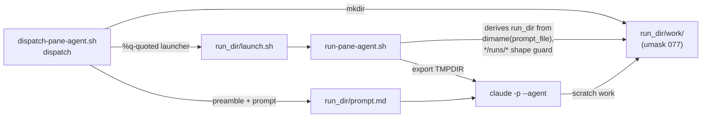

# Parallel pane agents share a scratch directory and overwrite each other

Queued 2026-09-04 out of round 10 of `docs/features/secret-filename-case-blindness.md`
(branch `fix/secret-filename-case-blindness`, HEAD `bb15b29`).

## What happened

Two judges — `compliance-judge` and `observability-judge` — were dispatched in parallel into
separate panes against the same repository. The observability judge reported, unprompted,
that another judge working in the same `/tmp` directory had overwritten its script and deleted
its working copies, and that it produced one wrong measurement before it isolated itself; it
added that parallel judges must not share a scratch path, because a contaminated replay yields
a plausible number rather than an error.

Stated in this card's own voice, not quoted. The judge said it twice in different words — once
in its pane report and once in its persisted verdict — and **neither travels with this branch**:
pane reports live in a session scratchpad under `/tmp`, and verdict markdown is gitignored
(`.gitignore:114`; only `verdicts.jsonl` is tracked). A blockquote here would promise a
verbatimness no reader of this branch could check, which is precisely the defect this card is
about.

It recovered on its own. The round-10 verdicts are not in doubt: the finding it eventually
reported was independently reproduced in the dispatching session. What is in doubt is every
*future* parallel dispatch, because the failure is silent — a clobbered mutation or a
half-deleted clone still runs and still prints a number.

## Why it happens

`panes/dispatch-pane-agent.sh` gives each dispatch a unique **run directory** (`new_run_dir`,
mode 700, holding `prompt.md` and `launch.sh`) and a unique **result file**
(`$agent_type-$(date +%s)-$$-$RANDOM.md`, per obs final-review F1). Both were deliberately
made collision-proof.

Nothing equivalent exists for the agent's own **working** scratch. The dispatcher never tells
the agent where to put a scratch clone or a mutation script, and neither
`agents/compliance-judge.md` nor `agents/observability-judge.md` names a path — verified by
grepping both for `tmp`, `scratch` and `mktemp`: no matches. So each agent invents one. Two
agents handed near-identical prompts invent the *same* obvious path, which is precisely the
case the dispatcher's other two uniqueness guarantees were written to prevent.

## Design

**Decided 2026-09-05** by the user, after the four open questions below were re-measured.
Two layers that cover different lanes and fail differently — the same idiom
`worktree-location-guard` uses, and for the same reason: no single mechanism reaches
every dispatch path.

| Layer | Lane it covers | Guarantee | Fails how |
|---|---|---|---|
| 1 — dispatcher hands over a private dir | paned (judges; workers under `panes`) | **by construction** — the dir is a child of an already-unique run dir | fail-fast at dispatch; TMPDIR export falls back to the inherited value, printed to the pane |
| 2 — one sentence in `rules/core-conduct.md` | every lane, incl. in-process `Explore`/`Plan` and worker fan-out under `inline` | guidance only | silently, exactly as today |

### Why the layers split there

The incident happened in the paned lane, and that lane already has the two ingredients a
mechanical fix needs: a per-dispatch unique directory (`new_run_dir`) and a file the
dispatcher writes into the agent's own prompt (`$run_dir/prompt.md`). Nothing equivalent
exists in-process — `hooks/pane-dispatch-guard.sh` classifies `.tool_input.subagent_type`
and returns an exit code; it never touches the prompt.

Layer 2 rests on subagents actually receiving `rules/core-conduct.md`. That was **measured
on 2026-09-05**, not inferred — an earlier draft argued it from `run-pane-agent.sh`
deliberately omitting `--bare` (its comment reads `# No --bare (spec: it disables
hooks/CLAUDE.md and breaks OAuth auth).`), which is evidence for the paned lane only and
says nothing about a `Task`-dispatched subagent.

Probe: each agent was asked, with an explicit instruction to use **no tools at all**,
whether four named headings from `rules/core-conduct.md` were in its context, and to quote
the Parallel-Agent Invariants paragraph verbatim. All three reported zero tool uses.

| Lane | Agent type | Receives `rules/core-conduct.md` |
|---|---|---|
| in-process (`Task`) | `Explore` | **no** — reported NOT PRESENT for all four headings |
| in-process (`Task`) | `general-purpose` | **yes** — quoted the paragraph verbatim |
| paned | `general-purpose` | **yes** — quoted it verbatim, and named both the global and worktree copies |

So layer 2 reaches the worker fan-out lane in both of its forms, and misses `Explore`.
`Plan` was not probed and is assumed to behave like `Explore` until measured. That residual
is small — both are read-only helpers by convention — but it is real, and it is recorded
below rather than papered over. The probe prompt is worth re-running rather than trusting
this table: agent-type context composition is a harness behaviour that can change under us.

### Rejected: rewriting the in-process prompt via `updatedInput`

Recorded so a later session does not re-derive it. A `PreToolUse` hook **can** rewrite the
tool call it gates. Verified by string-searching the installed CLI binary
(`~/.local/share/claude/versions/2.1.260`, a Mach-O executable, not a directory), which
carries `` `updatedInput` - Modified tool input (PreToolUse only) ``,
`permission_updated_input_invalid`, and
`updatedInput is missing or empty, falling back to original tool input`.

Held to what those strings actually say: the fallback triggers on **missing or empty**
(verbatim), and *some* validation exists (the telemetry key names it). That the validation
target is the tool's own input schema is **inferred from the error name, not measured**.
The official hooks documentation is not the source used here; the binary is.

Rejected anyway, on cost and honesty:

- `pane-dispatch-guard.sh` is today a pure exit-code gate (`exit 0` allow / `exit 2` deny).
  Emitting `updatedInput` means emitting JSON on stdout, changing that contract.
- It allows through at **ten** distinct `exit 0` sites, counted in the file rather than
  estimated: recursion guard (`CLAUDE_PANE_AGENT` set), empty payload, `jq` not executable,
  `jq` extraction failed, empty `subagent_type`, in-process lane hit, terminal detect
  failed, terminal is `none`, adapter-failure cooldown, and the `inline` worker policy.
  Each would need the same injection or coverage is partial *and silent*, which is the
  defect class this card exists to remove. (An earlier draft of this card said *five*;
  re-count from the file, do not trust a figure quoted in prose.)
- The dispatching session would no longer be able to read back the prompt its agent
  received.

### Layer 1 — mechanics



Four changes, no new arguments to either script:

1. **`dispatch-pane-agent.sh` / `dispatch`** — after `new_run_dir` succeeds, `mkdir` a
   `work` child. `umask 077` at the top of the file already makes it mode 700; no `chmod`
   is added, matching how the run dir itself gets its mode. Failure to create it `die`s,
   before any pane opens — the same fail-fast posture as the existing `--cwd` and
   `--result-file` checks.

2. **`dispatch-pane-agent.sh` / `dispatch`** — replace the bare
   `cp "$prompt_file" "$run_dir/prompt.md"` with a write that emits the preamble below and
   then the caller's prompt bytes unchanged. The preamble goes **first**: a prompt whose own
   body contains a `---` line must not be able to displace it.

3. **`run-pane-agent.sh`** — hoist the existing run-dir derivation (today computed late, as
   `marker_dir`, from `dirname "$prompt_file"` with a `*/runs/*` shape guard on the resolved
   absolute path) to the top, use it for both `TMPDIR` and the `agent-exit` marker,
   `mkdir -p "$run_dir/work"`, and `export TMPDIR` at it before the `claude` invocation.

   The `mkdir -p` is the correction to an earlier draft, which exported `TMPDIR` only when
   the directory already existed and justified the fallback by saying a bogus `TMPDIR` is
   worse than a collision. **That justification was wrong**, and measurably so: the
   inherited value on this machine is `/var/folders/x0/…/T/` — one per-user directory,
   identical for every pane. Falling back to it does not fail safe, it reinstates exactly
   the shared-scratch condition this card exists to remove. `mkdir -p` costs nothing and
   removes the fallback entirely for the in-shape case.

   Two cases still leave `TMPDIR` alone: the shape guard rejecting the prompt path (a direct
   invocation from outside `*/runs/*`), and `mkdir -p` itself failing. Both print a line to
   the pane that says scratch is **shared**, in those words — not merely that TMPDIR was
   not set.

4a. **`run-pane-agent.sh`** — after the agent exits, record whether the work dir was
   actually used, beside the existing `agent-exit` marker:
   `find "$run_dir/work" -mindepth 1 -print -quit` into `work-used`. `agent-exit` is already
   a durable per-run channel the design otherwise leaves unread; an empty `work-used` on a
   run that plainly did filesystem work is the one cheap signal that an agent ignored its
   locker. Prose residuals do not detect anything; this does.

4b. **`dispatch-pane-agent.sh` / `cleanup_stale`** — prune `work` children on their own,
   shorter clock: new named constant `WORK_STALE_MINUTES=1440` matched with `find -mmin`,
   pruned only where the run dir holds an `agent-exit` marker, and the parent's mtime
   restored afterwards with `touch -r "$d/prompt.md" "$d"`. `STALE_DAYS=7` is unchanged and
   still governs the run dir. All three details are load-bearing and measured — see
   *Retention* below; do not simplify any of them back out.

#### The preamble contract

Written verbatim into `$run_dir/prompt.md` ahead of the caller's prompt. `<ABS>` is the
absolute path of the work dir.

```
Your private scratch directory for this dispatch is:

    <ABS>

It is yours alone, and TMPDIR normally points at it. Put every scratch artifact there
-- repository clones, mutation scripts, replay output, intermediates. If the pane
printed a line saying scratch is shared, create this directory yourself first.

Do NOT invent a scratch path. Another agent is very likely running against this same
repository right now; given a similar prompt it will invent the same obvious path
(/tmp/judge-work and the like), and you will silently delete each other's files. The
failure mode is not an error -- it is a plausible wrong number.

--- end of dispatch preamble; the task follows ---
```

### Layer 2 — the rule

One sentence appended to the existing **Parallel-Agent Invariants** paragraph of
`rules/core-conduct.md`. That section is the right home under `triaging-new-instructions`
step 2 and already carries this exact class of instruction, with the matching justification
in its own last sentence ("the model can't detect a parallel instance, so this must always
be present"). No new section, no new skill, no new gate stub.

> Scratch work goes in a directory you were handed or created yourself (`mktemp -d`), never
> a fixed path — a parallel agent given a similar prompt invents the same one and deletes
> your files.

### Retention

**Current state, before the history below.** Two clocks, measured, not inferred:

| What | Window | Spelling |
|---|---|---|
| a run dir's `work` child | **24h** | `find -mmin +1440`, gated on an `agent-exit` marker |
| the run dir itself | **just under 8 days** | the pre-existing `find -mtime +"$STALE_DAYS"`, which truncates to whole days |

Worst-case disk, if every dispatch shallow-clones: **~0.48 GiB/day**, **~3.9 GiB** across a
full run-dir window. Every figure in this section is GiB.

The rest of this section is the audit trail of how those numbers were got wrong and
corrected — three times. It is kept because in this repo a wrong durable number costs more
than the error it describes; read it only if you need to know why a value is what it is.

Layer 1 changes what a run directory can hold from a few KB (a prompt and a launcher) to
whatever the agent puts in it. An earlier draft sized that at the **12M** tracked tree and
called it a ceiling. It is not one — the preamble tells agents to clone, and a clone is
bigger than a checkout. Measured 2026-09-05:

| Artifact | Size | Command |
|---|---|---|
| tracked tree | 12M | `git ls-files -z \| xargs -0 du -ch \| tail -1` |
| this worktree on disk | 13M | `du -sh .` |
| `git clone --depth 1` | 16M | `git clone -q --depth 1 --no-hardlinks file://$HOME/.claude <dst>` |
| full `git clone` | 105M (93M of it `.git`) | `git clone --no-hardlinks -q $HOME/.claude <dst>` |

Use **16M** as the planning figure — a shallow clone or `git worktree add` is what an agent
replaying a repo actually needs — and treat 105M as the tail.

State is **not repo-relative** — `PANE_HOME` defaults to `$HOME/.claude/panes`, so run dirs
live in the primary checkout, not in a worktree. Measured there on 2026-09-05:

| Measure | Value | How |
|---|---|---|
| Live run dirs | 240 | `ls -1 "$HOME/.claude/panes/state/runs" \| wc -l` |
| Total state size today | 7.4M | `du -sh "$HOME/.claude/panes/state"` |
| Span of retained dirs | 7.63 days | newest minus oldest run-id epoch prefix |
| Implied rate | ~31 dispatches/day | 240 / 7.63 |

A **worst case where every dispatch shallow-clones** is ~31 x 16 MiB ~= **0.48 GiB** per
retained day (~3.4 GiB over the rejected 7-day work-child clock; ~3.2 GiB/day and ~22 GiB
respectively if every clone were a full one). Most dispatches will clone nothing, so this is
an upper bound with no observed clone rate behind it — but it is the number the window must
survive.

Every figure in this paragraph is **GiB**, the unit `du -ch` reports in the table above, and
each is the stated daily product times its window — no other conversion. Until 2026-09-07 the
first two read "0.50 GB" and "~3.3 GB", where the second did not reproduce from the first
(0.50 x 7 = 3.5, not 3.3) and the identical string "~3.3 GB" then labelled a *different*
quantity one clause later, the full-clone daily rate. Caught by the compliance judge in round
4, after a residual below had already been written pointing at "the ~3.3 GB figure" as though
only one existed.

**The retention window is minutes, not days.** An earlier draft wrote `WORK_STALE_DAYS=1`
and `find -mtime +1`, believing that meant 24 hours. BSD `find` truncates age to whole
days, so `-mtime +1` means *strictly more than 2 days*. Measured:

```
$ find "$T" -mindepth 1 -maxdepth 1 -type d -mtime +1
.../age49h                       # age25h and age36h both survive
```

The real ceiling under that spelling was ~1.0 GB, double what was claimed, and the Gherkin
case below used a 3-day-old directory — green under both the intended and the actual
behaviour, so nothing would have caught it. Two corrections:

- The constant is **`WORK_STALE_MINUTES=1440`**, pruned with `find -mmin +1440`, which does
  not truncate. `STALE_DAYS=7` is untouched and still governs the run dir.
- Prune a `work` child **only when its run dir holds an `agent-exit` marker.** The runner
  writes that marker solely after a successful result write, so a completed run gives its
  disk back on schedule while a failed or in-flight one keeps its evidence **for just under
  8 days** — not indefinitely, as an earlier draft of this line and the residual below both
  said, and not "up to `STALE_DAYS` (7 days)", which is what the first correction said and
  is also wrong. The pre-existing run-dir prune (`find "$RUNS_DIR" ... -mtime
  +"$STALE_DAYS" -exec rm -rf {} +`) deletes the whole run dir, work child and all,
  regardless of any marker — but it is spelled `-mtime`, so it truncates age to whole days
  exactly as the `-mtime +1` paragraph above explains at length. `+7` therefore means
  *strictly more than 7 whole days*, which a run dir does not reach until it is 8 days old.
  Measured 2026-09-07 on one fixture set, each aged and then put through a real `dispatch`:

  | Run dir age | 7d00h | 7d12h | 7d23h | 8d00h | 8d01h |
  |---|---|---|---|---|---|
  | After one dispatch | survives | survives | survives | **pruned** | **pruned** |

  The card's first receipt for this was a single 8-day fixture, which could not tell a 7-day
  window from an 8-day one — the same non-discriminating shape the boundary-pair section
  below was written to catch, repeated by the correction to it. The originating incident was
  diagnosed the day *after* it happened, so either bound is ample; a blind 24h clock would
  have deleted the evidence.

**The boundary pair straddles 24h, not 48h.** Corrected 2026-09-06, after the task 5
implementer hit the contradiction and escalated it rather than working around it. This
card pinned `WORK_STALE_MINUTES=1440` (24h) in four places while its Gherkin pair asked
for a **25-hour** child to *survive*. Both cannot hold: 25h is 1500 minutes, already past
1440. The pair had been written by reading off the *buggy* `-mtime +1` output above
instead of the intended semantics.

Choosing the constant to satisfy the old pair is what makes this load-bearing rather than
cosmetic. Any value in `[1500, 2940)` minutes satisfies 25h-survives/49h-pruned, and 2880
(48h) is the natural one -- which is exactly the ~1.0 GB ceiling this section already names
as the defect. Measured on the same fixture set, 23h/25h/36h/49h:

| Spelling | Prunes |
|---|---|
| `-mmin +1440` (24h, pinned) | 25h, 36h, 49h |
| `-mmin +2880` (48h, to satisfy the old pair) | 49h |
| `-mtime +1` (the bug) | 49h |

The bottom two rows are **identical output**. The old pair therefore could not tell the fix
apart from the bug it exists to catch -- a receipt with no discriminating population. The
new pair can: under `-mtime +1` neither 23h nor 25h is pruned, so the 25h-pruned case
fails. `WORK_STALE_MINUTES=1440` stands; the scenarios moved.

**Pruning refreshes the parent's mtime, restarting the run dir's own 7-day clock.**
Measured — a run dir stamped 3 days old reads as today's date the moment its `work` child
is removed, and no longer matches `-mtime +7`. Restore it in the same breath:
`touch -r "$d/prompt.md" "$d"`. `prompt.md` is written once at dispatch and never modified,
so it is a stable reference and needs no captured timestamp.

### What is verified, and what cannot be

Card question 4 asked whether anything should *verify* isolation rather than merely provide
it. Split by layer:

- **Layer 1 is verifiable and gets tests.** Isolation is a structural property — two
  dispatches get two run dirs, therefore two work dirs — so the assertion is that the
  property holds, not that an agent complied.
- **Layer 2 is not mechanically verifiable.** It is a prompt instruction, and
  `rules/core-conduct.md` says in its own Zero-Trust section that prompt instructions are
  guidance, not a guarantee. Recorded as a residual below rather than dressed up.

## Scenarios

```gherkin
Feature: per-dispatch scratch isolation for paned agents

  Scenario: a dispatch is handed a private work directory
    Given a dispatch of any agent type with a readable --prompt-file
    When dispatch-pane-agent.sh creates the run directory
    Then a "work" child of that run directory exists
    And its mode is 700
    And the absolute path appears in the preamble of run_dir/prompt.md

  Scenario: two concurrent dispatches never share a work directory
    Given two dispatches issued within the same second
    When both run directories are created
    Then the two work directory paths differ

  Scenario: the caller's prompt survives injection byte-for-byte
    Given a prompt file whose body contains a line that is exactly "---"
    When the dispatcher writes run_dir/prompt.md
    Then the preamble occupies the head of the file
    And the caller's bytes appear after it unmodified

  Scenario: the runner points TMPDIR at the work directory
    Given a prompt file at <run_dir>/prompt.md where <run_dir> matches */runs/*
    And <run_dir>/work exists
    When run-pane-agent.sh starts
    Then TMPDIR is exported as <run_dir>/work for the claude child

  Scenario: an out-of-shape prompt path leaves TMPDIR alone and says scratch is shared
    Given run-pane-agent.sh invoked directly with a prompt file outside */runs/*
    When it starts
    Then TMPDIR is not overridden
    And a line containing the word "shared" is printed to the pane

  Scenario: a missing work directory is created rather than skipped
    Given a prompt file at <run_dir>/prompt.md where <run_dir> matches */runs/*
    And <run_dir>/work does not exist
    When run-pane-agent.sh starts
    Then <run_dir>/work exists
    And TMPDIR is exported as <run_dir>/work

  Scenario: usage of the work directory is recorded for later inspection
    Given a completed dispatch whose agent wrote a file under <run_dir>/work
    When run-pane-agent.sh finishes
    Then <run_dir>/work-used is non-empty
    And an agent that wrote nothing there leaves it empty

  # Boundary pair -- the pruner must not truncate age to whole days. The ages
  # straddle the 24h window, NOT 48h: see "The boundary pair straddles 24h"
  # below for why 25h/49h was measurably unable to discriminate.
  Scenario: a work child younger than the window survives
    Given a completed run directory whose work child is 23 hours old
    When cleanup_stale runs
    Then the work child still exists

  Scenario: a work child older than the window is pruned
    Given a completed run directory whose work child is 25 hours old
    When cleanup_stale runs
    Then the work child is gone
    And prompt.md, launch.sh and agent-exit remain

  Scenario: an unfinished run keeps its scratch regardless of age
    Given a run directory 30 days old holding a work child and no agent-exit marker
    When cleanup_stale runs
    Then the work child still exists

  Scenario: pruning does not restart the run directory's own clock
    Given a completed run directory stamped 3 days old holding a stale work child
    When cleanup_stale prunes the work child
    Then the run directory's mtime is still 3 days old

  Scenario: a work directory that cannot be created stops the dispatch
    Given mkdir of the work child fails
    When dispatch runs
    Then it exits non-zero with a message naming the path
    And no pane is opened
```

## Contracts

Pinned to what this checkout actually runs — verify before implementing, do not trust
these figures:

| Thing | Pinned value | Why it constrains the code |
|---|---|---|
| Shell | bash 3.2 (macOS system bash) | no `${a[@]}` on an empty array under `set -u`; `run-pane-agent.sh` already documents this |
| `jq` | `jq-1.7.1-apple` at `/usr/bin/jq` | path hardcoded in both `run-pane-agent.sh` and `pane-dispatch-guard.sh` |
| Claude CLI | `~/.local/share/claude/versions/2.1.260` | the version whose `updatedInput` support was measured above |
| `STALE_DAYS` | `7`, unchanged | governs the run dir |
| `WORK_STALE_MINUTES` | `1440`, new | governs the work child only; `-mmin`, never `-mtime`, which truncates to whole days |
| Prune precondition | `agent-exit` present | a failed or in-flight run keeps its scratch for post-mortem |
| Work dir path | `$run_dir/work` | derived, never passed — no new positional argument to `run-pane-agent.sh`, so the pinned unflagged launcher shape stays byte-identical |
| Mode | 700, via the existing `umask 077` | no new `chmod`, matching how the run dir gets its mode |

## Edge cases

- **Explicit `--result-file`.** The work dir is created regardless; the two are independent.
- **`handoff` (the second `new_run_dir` caller).** Settled, not left open: an earlier draft
  named a `start-agent` subcommand, which **does not exist** — `git grep start-agent` hits
  only this card. The subcommands are `dispatch`, `wait`, `handoff`, `set-policy`,
  `count-workers`. The second caller is `handoff`, which writes no `prompt.md` (the only
  `prompt.md` write in `panes/` is inside `dispatch`) and execs `handoff-wrapper.sh` into an
  interactive shell rather than `claude -p --agent`. Layer 1's `mkdir` therefore stays
  scoped to `dispatch`; `handoff` run dirs get no `work` child.
- **A prompt containing the preamble's own delimiter.** Preamble first; no parsing of the
  caller's bytes.
- **Direct `run-pane-agent.sh` invocation.** Covered by the shape-guard scenario.
- **`cleanup_stale` racing a live dispatch.** Two independent guards: a work dir younger
  than `WORK_STALE_MINUTES` is never a candidate, and a run without an `agent-exit` marker
  is never a candidate at all.
- **Prompt file identical to the destination.** `cp` would already have failed here; the
  new write path must not truncate its own source. Read the source fully before writing.

## Residuals — recorded, not fixed

- **This card pushes `panes/dispatch-pane-agent.test.sh` past the 800-line hard maximum, and
  nothing in it says so until now.** `rules/core-conduct.md` Code Style sets <400 lines
  preferred, 800 max. Measured 2026-09-07: the file was **771** lines at the branch base
  `3ab2d57` and is **957** at HEAD — the 20 new assertions of tasks 2 and 4 carried it 157
  lines past the ceiling. Caught by the compliance judge in round 4; no earlier round, and
  none of the card's own Contracts or checklist items, mentioned it. **Not fixed here, on
  purpose:** splitting a 957-line suite is a mechanical change to the one file that is the
  unbiased baseline for everything else on this branch, and doing it in the same breath as
  the feature it validates is exactly what `rules/core-conduct.md` Testing forbids. Queued as
  `docs/features/pane-dispatch-test-suite-split.md`, `phase: planning`. That card is a parked
  planning card, so `hooks/phase-guard.sh` will deny source writes on any branch that has no
  `implementation` card of its own until it is opened or superseded — a real cost, taken
  deliberately, because a follow-up with no card file is a promise with no ledger entry (the
  implementation-stage observability judge's words). This branch is unaffected: its own
  `implementation` card records it. The honest statement of the trade-off is that this
  branch ships a file
  over a stated hard limit, knowingly, with the split deferred — not that the limit does not
  apply.

- **In-process agents are guidance-only.** `Explore`, `Plan`, and worker fan-out under an
  `inline` policy receive no mechanical scratch path. Accepted cost of the chosen scope.
- **`Explore` receives no rule text at all, so layer 2 does not reach it.** Measured (see
  the probe table above): in-process `general-purpose` gets `rules/core-conduct.md`,
  in-process `Explore` does not. `Plan` is unmeasured and assumed to match `Explore`. Both
  are read-only helpers by convention, which bounds the exposure but does not remove it —
  both can run Bash. Nothing in this card fixes it.
- **An agent that hardcodes a literal path defeats both layers.** `TMPDIR` is honoured by
  `mktemp`, Python's `tempfile` and most tooling; it is not honoured by a literal
  `/tmp/judge-work` in a script the agent writes.
- **The disk ceiling assumes every dispatch clones.** ~31 dispatches/day is measured; the
  fraction that will actually clone anything is not, so ~0.48 GiB/day is an upper bound with
  no observed clone rate behind it. Pruning only completed runs means a run of failures
  holds its scratch for the full run-dir window rather than 24h — deliberate (evidence beats
  disk), and **bounded at just under 8 days**, not unbounded: the pre-existing run-dir prune
  takes the work child with it, and `-mtime +7` does not fire until day 8 (measured table in
  *Retention*). This bullet said "indefinitely" until 2026-09-07, when the
  implementation-stage observability judge reported the opposite; the first correction then
  said "7 days", which the compliance judge caught as the same `-mtime` truncation trap the
  card explains elsewhere. Still the first thing to look at if state grows unexpectedly:
  ~31 dispatches/day x 16 MiB x 8 days ~= **3.9 GiB**, against ~0.48 GiB/day when work
  children are pruned on the 24h clock. (*Retention*'s ~3.4 GiB is the same daily product
  over the **rejected 7-day work-child clock** — a different window, not this one; its
  ~3.2 GiB/day is a different product again, the full-clone daily rate.)

- **`work-used` has no reader, and only one of its two directions is sound.** Nothing in the
  tree reads the marker today. Worse, `TMPDIR` points *at* the work dir, so any `mktemp` by
  the CLI or by the agent's own tooling populates it — a non-empty `work-used` therefore does
  **not** show the agent used its locker deliberately. Only the empty direction is
  informative: nothing at all landed there. Reported by the implementation-stage
  observability judge, 2026-09-07.

- **The "scratch is shared" warning is not durable.** It prints to the pane's scrollback and
  nowhere else — `launch.sh` redirects nothing to a file — and a run that hit it still writes
  `agent-exit: DONE` beside a zero-byte `work-used`, byte-identical to a run that simply used
  no scratch. The out-of-shape case writes neither marker, which is identical to a crash. So
  the warning is visible while a human is watching the pane and undetectable afterwards.
  Bounded, because the dispatcher fail-fasts earlier and a real paned run almost always has
  `work/` already. Measured by the implementation-stage observability judge, 2026-09-07.

## Falsification record (task 6)

Measured 2026-09-07 at HEAD `a846d5b`. Green baseline first, in this checkout:
`panes/dispatch-pane-agent.test.sh` 139 passed / 0 failed, `panes/run-pane-agent.test.sh`
18 passed / 0 failed.

Method: each mutation is applied to a **fresh copy** of `panes/` in a private scratch tree,
never to the working checkout, and its patch anchor must match exactly once or the run is a
harness error rather than a result. Both suites then run against the mutated copy from the
repo root. The copies have their test-marker write stripped (it is not an assertion) so a
scratch run can never register a marker naming a scratch path.

**The harness was falsified before it was trusted**, against two controls. The recipes are
given exactly, because a control quoted only by its result is a number nobody else can
reproduce — round 2 of the compliance judge tried and got two different answers from the
one-line description this paragraph used to carry.

| Control | Exact patch to the copy of `panes/` | Result |
|---|---|---|
| null | `STALE_DAYS=7` → `STALE_DAYS=7 # control: comment only` | 139/0 and 18/0 |
| positive | `RUNS_DIR="$STATE_DIR/runs"` → `RUNS_DIR="$STATE_DIR/runs-BROKEN-CONTROL"` | **97 passed / 42 failed** on `dispatch-pane-agent.test.sh`; 18/0 on `run-pane-agent.test.sh` |

A harness that could not tell those two apart would have reported every mutation below as
"caught" while measuring nothing.

| Mutation | Assertion it broke | Also broke |
|---|---|---|
| drop the `mkdir` | work child exists after dispatch | 5 more, incl. mode 700 |
| `mkdir -m 755` | the work dir's mode is 700 | — |
| write the preamble **last** | preamble occupies the head of prompt.md | caller's bytes preserved verbatim |
| drop the `export TMPDIR` | TMPDIR exported at existing run_dir/work | 2 more |
| widen the `*/runs/*` shape guard to `*` | out-of-shape path leaves TMPDIR alone and warns shared | — |
| `\|\| true` on the `mkdir` failure | mkdir failure makes dispatch exit non-zero | the failure message names the path; opens no pane; never calls the adapter |
| `-mtime +1` for `-mmin +1440` | **25h child is pruned** | — (23h-survives held, as the card predicted) |
| drop the `agent-exit` precondition | no-agent-exit child survives regardless of age | — |
| drop the `touch -r` | prune does not restart the run dir's mtime clock | — |
| `work-used` always empty | work-used is non-empty after the agent wrote | — |
| `work-used` always non-empty | work-used is empty when the agent wrote nothing | — |
| preamble names `/tmp/judge-work` | the work dir's absolute path appears in the preamble | — |
| export TMPDIR even when `mkdir -p` fails | mkdir -p failure leaves TMPDIR alone and warns shared | — |
| prune `${d}` instead of `${d}work` | prune leaves prompt.md, launch.sh, agent-exit in place | the mtime-restore check |
| `die` message omits the path | the mkdir-failure message names the work path | — |
| `sed` the caller's bytes on append | caller's bytes preserved verbatim past its own `---` | — |
| `WORK_STALE_MINUTES=1` | **23h child survives** | — |
| never prune (`-mmin +999999`) | the 3-day-old-child precondition | 25h-is-pruned |
| runner tests for `work` instead of `mkdir -p` | missing work dir is created and TMPDIR exported | work-used non-empty |

19 mutations, 19 distinct target assertions broken, none of them shared. The last three go
beyond the card's named minimum and exist only to give three assertions a discriminating
population they otherwise had none of: **23h-survives** (no named mutation could break it —
`-mtime` truncation cannot, by construction), the **3-day precondition**, and **`mkdir -p`
in the runner** as distinct from the `export` beside it.

**Still not discriminated, and deliberately so.** Five assertions are not broken by any
mutation: `two dispatches get different work dirs` (already labelled non-discriminating in
the suite — it rides on `new_run_dir`), and four locator/precondition lines that exist to
stop a later assertion from passing vacuously rather than to assert anything themselves
(`work-dir dispatch happy path exits 0`, `work-dir dispatch: run dir located`, `dispatch
with a literal '---' line exits 0`, `dash-prompt dispatch: prompt.md located`).

**One thing worth knowing for the next pass:** an assertion's `ok` label and its `bad` label
are often not the same string, so matching a failure by its `ok` text silently misses it.
This paragraph said **three**; the real figure is **six of the twenty** new dispatch-side
assertions — the preamble-head case, the caller-bytes case, the opens-no-pane case, the
two-dispatches case, the prune-leaves-other-files case, and the no-`agent-exit` case. Five of
the six were observed failing during this record's own runs, so a next pass that fixes only
three named ones leaves three behind. Corrected in round 2 after the compliance judge counted
them; re-derived here by pairing every `ok "…" || bad "…"` in the file — **48 of 135** pairs
diverge file-wide, so this is a house pattern, not something this card introduced. (The
denominator was written as 133 in round 2 and corrected in round 3: the file makes 139 `ok`
calls, 4 of which are not in `ok … || bad …` form at all, leaving 135. The first pass used a
regex that also missed two line-continuation spellings — the numerator 48 was right in both
passes, the total was not.) Every
mutation result above was confirmed by reading its failure lines, not by string-matching.
Nothing is changed in the tests here — a test edit belongs in its own step.

**One mutation in this table was itself wrong, and the judge caught it.** The first
"write the preamble last" mutation moved the preamble after the caller's bytes but left the
original trailing append in place, so the caller's bytes were written *twice* — once before
the preamble and once after — which accidentally satisfied the byte-preservation check and
reported 138/1. The corrected mutation drops the duplicate append and reports **137/2**,
breaking both assertions, reproducing the judge's number exactly. The row above is the
corrected run.

## Checklist

Gate **OPENED 2026-09-05** on the literal phrase `gate confirmed`. Frontmatter moved to
`phase: implementation` and the branch recorded in the same commit.

- [x] 1. Branch `fix/pane-agent-scratch-isolation`; record it in this frontmatter.
- [x] 2. Failing tests first, in `panes/dispatch-pane-agent.test.sh`: work dir exists, mode
      700, path present in `prompt.md`, two dispatches differ, caller bytes preserved
      verbatim past a `---` line, `mkdir` failure dies before the adapter is called.
- [x] 3. Failing tests first, in `panes/run-pane-agent.test.sh`: `TMPDIR` exported for an
      in-shape run dir with a `work` child; left alone for an out-of-shape path; left alone
      when `work` is absent, with the result file still written.
- [x] 4. Failing tests first, for `cleanup_stale`, one per Gherkin case: the 23h child
      survives and the 25h child is pruned (this pair is what catches `-mtime` truncation —
      a single 3-day case passes either way, and so did the 25h/49h pair this originally
      specified: see "The boundary pair straddles 24h" above); a 30-day child with no `agent-exit` survives;
      the parent's mtime is unchanged after a prune.
- [x] 5. Implement the four `dispatch-pane-agent.sh` / `run-pane-agent.sh` changes. Confirm
      both suites go green and both markers are written.
- [x] 6. Falsify. One mutation per new assertion, not four for ten — a pass shared by the
      broken and unbroken versions discriminates nothing, and the four-mutation population
      an earlier draft proposed left at least five assertions undiscriminated. Minimum set,
      each with the assertion it must break named in the record: drop the `mkdir`;
      `mkdir -m 755` (mode); write the preamble **last** (caller-byte preservation); drop
      the `export`; widen the `*/runs/*` shape guard to `*`; `|| true` on the `mkdir`
      failure (fatality); `-mtime +1` in place of `-mmin +1440` (must break the 25h-**pruned** case;
      it cannot break the 23h-survives one, which holds under both);
      drop the `agent-exit` precondition; drop the `touch -r`. Note also that "two
      dispatches get different work dirs" passes with none of this change present — it
      rides on `new_run_dir`, so it anchors nothing and must not be counted as coverage.
- [x] 7. Layer 2: append the one sentence to `rules/core-conduct.md` Parallel-Agent
      Invariants. No other rule text changes.
- [x] 8. Update `skills/dispatching-pane-agents/SKILL.md` — its Procedure section tells the
      orchestrator where to stage the prompt and says nothing about the agent's own scratch;
      add the one fact that the dispatcher now provides it.
- [x] 9. ADR under `docs/decisions/` — two-layer split, the `updatedInput` rejection with
      its measurement, and the retention constant. Check the next free number against the
      deciding ref, not stale local `main`.
- [x] 10. Observability judge (implementation stage) + compliance judge, in panes, on Opus.
      Obs judge: `risk=low confidence=high`, no dimension failed; its three findings are
      recorded above (the false "indefinitely" residual, `work-used` having no reader and
      only one sound direction, and the non-durable "scratch is shared" warning). Compliance
      judge ran **four** rounds: round 1 (design stage) clean-after-fixes, rounds 2, 3 and 4
      each `fail`, each closing the previous round's findings and each catching a wrong
      number introduced *by* the previous round's correction. Round 3 tripped the skill's
      oscillation tripwire and was escalated; the user chose one more round, after which the
      PR opens regardless. Round 4's two findings are fixed at `5bf6a8a` and are **not**
      re-judged -- that is the accepted cost of stopping, and it is recorded rather than
      dressed up as a pass. The obs judge is re-run on the final commit only because
      `judge-guard.sh` requires `head_sha == HEAD`.
- [ ] 11. Close out: PR, then frontmatter to `review` only after the merge SHA is confirmed
      contained in `origin/main`.

## Not done on the originating branch

`panes/` is implementation code and `fix/secret-filename-case-blindness` is a documentation
and test branch in `phase: review`. Mixing them would violate the root-cause-only rule in
`rules/core-conduct.md`. The immediate exposure was handled in that session by writing an
explicit unique scratch path into each judge's dispatch prompt by hand; that is a per-dispatch
workaround, not a fix, and it protects only prompts an author remembers to write it into.
