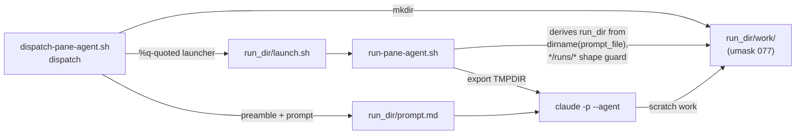

# Parallel pane agents share a scratch directory and overwrite each other

Queued 2026-09-04 out of round 10 of `docs/features/secret-filename-case-blindness.md`
(branch `fix/secret-filename-case-blindness`, HEAD `bb15b29`).

## What happened

Two judges — `compliance-judge` and `observability-judge` — were dispatched in parallel into
separate panes against the same repository. The observability judge reported, unprompted,
that another judge working in the same `/tmp` directory had overwritten its script and deleted
its working copies, and that it produced one wrong measurement before it isolated itself; it
added that parallel judges must not share a scratch path, because a contaminated replay yields
a plausible number rather than an error.

Stated in this card's own voice, not quoted. The judge said it twice in different words — once
in its pane report and once in its persisted verdict — and **neither travels with this branch**:
pane reports live in a session scratchpad under `/tmp`, and verdict markdown is gitignored
(`.gitignore:114`; only `verdicts.jsonl` is tracked). A blockquote here would promise a
verbatimness no reader of this branch could check, which is precisely the defect this card is
about.

It recovered on its own. The round-10 verdicts are not in doubt: the finding it eventually
reported was independently reproduced in the dispatching session. What is in doubt is every
*future* parallel dispatch, because the failure is silent — a clobbered mutation or a
half-deleted clone still runs and still prints a number.

## Why it happens

`panes/dispatch-pane-agent.sh` gives each dispatch a unique **run directory** (`new_run_dir`,
mode 700, holding `prompt.md` and `launch.sh`) and a unique **result file**
(`$agent_type-$(date +%s)-$$-$RANDOM.md`, per obs final-review F1). Both were deliberately
made collision-proof.

Nothing equivalent exists for the agent's own **working** scratch. The dispatcher never tells
the agent where to put a scratch clone or a mutation script, and neither
`agents/compliance-judge.md` nor `agents/observability-judge.md` names a path — verified by
grepping both for `tmp`, `scratch` and `mktemp`: no matches. So each agent invents one. Two
agents handed near-identical prompts invent the *same* obvious path, which is precisely the
case the dispatcher's other two uniqueness guarantees were written to prevent.

## Design

**Decided 2026-09-05** by the user, after the four open questions below were re-measured.
Two layers that cover different lanes and fail differently — the same idiom
`worktree-location-guard` uses, and for the same reason: no single mechanism reaches
every dispatch path.

| Layer | Lane it covers | Guarantee | Fails how |
|---|---|---|---|
| 1 — dispatcher hands over a private dir | paned (judges; workers under `panes`) | **by construction** — the dir is a child of an already-unique run dir | fail-fast at dispatch; TMPDIR export falls back to the inherited value, printed to the pane |
| 2 — one sentence in `rules/core-conduct.md` | every lane, incl. in-process `Explore`/`Plan` and worker fan-out under `inline` | guidance only | silently, exactly as today |

### Why the layers split there

The incident happened in the paned lane, and that lane already has the two ingredients a
mechanical fix needs: a per-dispatch unique directory (`new_run_dir`) and a file the
dispatcher writes into the agent's own prompt (`$run_dir/prompt.md`). Nothing equivalent
exists in-process — `hooks/pane-dispatch-guard.sh` classifies `.tool_input.subagent_type`
and returns an exit code; it never touches the prompt.

Both lanes do read `CLAUDE.md`, and therefore `rules/core-conduct.md`: `run-pane-agent.sh`
deliberately omits `--bare` on the `claude` invocation, and its comment gives disabling
`CLAUDE.md` as the reason. That makes the always-on rule surface the one channel that
reaches every agent type, including the built-in `general-purpose` and `Explore` that have
no file under `agents/`.

### Rejected: rewriting the in-process prompt via `updatedInput`

Recorded so a later session does not re-derive it. A `PreToolUse` hook **can** rewrite the
tool call it gates — `updatedInput` is real, is validated against the tool's input schema,
and falls back to the original input when missing or malformed. Verified against the
installed CLI (`~/.local/share/claude/versions/2.1.260`), which carries the strings
`` `updatedInput` - Modified tool input (PreToolUse only) ``,
`permission_updated_input_invalid`, and
`updatedInput is missing or empty, falling back to original tool input`. The official hooks
documentation is not the source used here; the binary is.

Rejected anyway, on cost and honesty:

- `pane-dispatch-guard.sh` is today a pure exit-code gate (`exit 0` allow / `exit 2` deny).
  Emitting `updatedInput` means emitting JSON on stdout, changing that contract.
- It allows through at **ten** distinct `exit 0` sites, counted in the file rather than
  estimated: recursion guard (`CLAUDE_PANE_AGENT` set), empty payload, `jq` not executable,
  `jq` extraction failed, empty `subagent_type`, in-process lane hit, terminal detect
  failed, terminal is `none`, adapter-failure cooldown, and the `inline` worker policy.
  Each would need the same injection or coverage is partial *and silent*, which is the
  defect class this card exists to remove. (An earlier draft of this card said *five*;
  re-count from the file, do not trust a figure quoted in prose.)
- The dispatching session would no longer be able to read back the prompt its agent
  received.

### Layer 1 — mechanics



Four changes, no new arguments to either script:

1. **`dispatch-pane-agent.sh` / `dispatch`** — after `new_run_dir` succeeds, `mkdir` a
   `work` child. `umask 077` at the top of the file already makes it mode 700; no `chmod`
   is added, matching how the run dir itself gets its mode. Failure to create it `die`s,
   before any pane opens — the same fail-fast posture as the existing `--cwd` and
   `--result-file` checks.

2. **`dispatch-pane-agent.sh` / `dispatch`** — replace the bare
   `cp "$prompt_file" "$run_dir/prompt.md"` with a write that emits the preamble below and
   then the caller's prompt bytes unchanged. The preamble goes **first**: a prompt whose own
   body contains a `---` line must not be able to displace it.

3. **`run-pane-agent.sh`** — hoist the existing run-dir derivation (today computed late, as
   `marker_dir`, from `dirname "$prompt_file"` with a `*/runs/*` shape guard on the resolved
   absolute path) to the top, use it for both `TMPDIR` and the `agent-exit` marker, and
   `export TMPDIR="$run_dir/work"` before the `claude` invocation when that directory
   exists. When the shape guard rejects the path or the directory is absent, `TMPDIR` is
   left alone and one line is printed to the pane saying so. This is the only deliberate
   fail-open in layer 1, and it is the right direction: a bogus `TMPDIR` breaks every tool
   the agent runs, which is a worse outcome than the collision risk it would prevent.

4. **`dispatch-pane-agent.sh` / `cleanup_stale`** — prune `work` children on their own,
   shorter clock. New named constant `WORK_STALE_DAYS=1`, alongside the existing
   `STALE_DAYS=7`, which is unchanged and still governs the run dir. Rationale under
   *Retention* below.

#### The preamble contract

Written verbatim into `$run_dir/prompt.md` ahead of the caller's prompt. `<ABS>` is the
absolute path of the work dir.

```
Your private scratch directory for this dispatch is:

    <ABS>

It already exists, it is yours alone, and TMPDIR points at it. Put every scratch
artifact there -- repository clones, mutation scripts, replay output, intermediates.

Do NOT invent a scratch path. Another agent is very likely running against this same
repository right now; given a similar prompt it will invent the same obvious path
(/tmp/judge-work and the like), and you will silently delete each other's files. The
failure mode is not an error -- it is a plausible wrong number.

--- end of dispatch preamble; the task follows ---
```

### Layer 2 — the rule

One sentence appended to the existing **Parallel-Agent Invariants** paragraph of
`rules/core-conduct.md`. That section is the right home under `triaging-new-instructions`
step 2 and already carries this exact class of instruction, with the matching justification
in its own last sentence ("the model can't detect a parallel instance, so this must always
be present"). No new section, no new skill, no new gate stub.

> Scratch work goes in a directory you were handed or created yourself (`mktemp -d`), never
> a fixed path — a parallel agent given a similar prompt invents the same one and deletes
> your files.

### Retention

Layer 1 changes what a run directory can hold from roughly 8KB (a prompt and a launcher) to
whatever the agent clones into it. This repository's tracked tree measures **12M**
(`git ls-files -z | xargs -0 du -ch | tail -1`), so a clone is that order.

State is **not repo-relative** — `PANE_HOME` defaults to `$HOME/.claude/panes`, so run dirs
live in the primary checkout, not in a worktree. Measured there on 2026-09-05:

| Measure | Value | How |
|---|---|---|
| Live run dirs | 240 | `ls -1 "$HOME/.claude/panes/state/runs" \| wc -l` |
| Total state size today | 7.4M | `du -sh "$HOME/.claude/panes/state"` |
| Span of retained dirs | 7.63 days | newest minus oldest run-id epoch prefix |
| Implied rate | ~31 dispatches/day | 240 / 7.63 |

At that rate, a **worst case where every dispatch clones the repo** is ~0.37 GB/day. Most
dispatches will not clone anything, so this is a ceiling, not a forecast — but it is the
figure the retention window has to survive. `WORK_STALE_DAYS=1` holds the ceiling at one
day (~0.37 GB); leaving work under the existing 7-day clock would raise it to ~2.6 GB. A
dispatch completes in minutes, so a day still leaves ample post-mortem window, and the run
dir's own metadata — prompt, launcher, `agent-exit` — survives the full 7 days regardless.

### What is verified, and what cannot be

Card question 4 asked whether anything should *verify* isolation rather than merely provide
it. Split by layer:

- **Layer 1 is verifiable and gets tests.** Isolation is a structural property — two
  dispatches get two run dirs, therefore two work dirs — so the assertion is that the
  property holds, not that an agent complied.
- **Layer 2 is not mechanically verifiable.** It is a prompt instruction, and
  `rules/core-conduct.md` says in its own Zero-Trust section that prompt instructions are
  guidance, not a guarantee. Recorded as a residual below rather than dressed up.

## Scenarios

```gherkin
Feature: per-dispatch scratch isolation for paned agents

  Scenario: a dispatch is handed a private work directory
    Given a dispatch of any agent type with a readable --prompt-file
    When dispatch-pane-agent.sh creates the run directory
    Then a "work" child of that run directory exists
    And its mode is 700
    And the absolute path appears in the preamble of run_dir/prompt.md

  Scenario: two concurrent dispatches never share a work directory
    Given two dispatches issued within the same second
    When both run directories are created
    Then the two work directory paths differ

  Scenario: the caller's prompt survives injection byte-for-byte
    Given a prompt file whose body contains a line that is exactly "---"
    When the dispatcher writes run_dir/prompt.md
    Then the preamble occupies the head of the file
    And the caller's bytes appear after it unmodified

  Scenario: the runner points TMPDIR at the work directory
    Given a prompt file at <run_dir>/prompt.md where <run_dir> matches */runs/*
    And <run_dir>/work exists
    When run-pane-agent.sh starts
    Then TMPDIR is exported as <run_dir>/work for the claude child

  Scenario: an out-of-shape prompt path leaves TMPDIR alone
    Given run-pane-agent.sh invoked directly with a prompt file outside */runs/*
    When it starts
    Then TMPDIR is not overridden
    And one line naming that decision is printed to the pane

  Scenario: a missing work directory leaves TMPDIR alone
    Given a prompt file at <run_dir>/prompt.md where <run_dir> matches */runs/*
    And <run_dir>/work does not exist
    When run-pane-agent.sh starts
    Then TMPDIR is not overridden
    And the agent still runs and still writes its result file

  Scenario: work directories are pruned on their own clock
    Given a run directory 3 days old holding a work child
    When cleanup_stale runs
    Then the work child is gone
    And prompt.md, launch.sh and agent-exit remain

  Scenario: the run directory itself still lives seven days
    Given a run directory 3 days old
    When cleanup_stale runs
    Then the run directory still exists

  Scenario: a work directory that cannot be created stops the dispatch
    Given mkdir of the work child fails
    When dispatch runs
    Then it exits non-zero with a message naming the path
    And no pane is opened
```

## Contracts

Pinned to what this checkout actually runs — verify before implementing, do not trust
these figures:

| Thing | Pinned value | Why it constrains the code |
|---|---|---|
| Shell | bash 3.2 (macOS system bash) | no `${a[@]}` on an empty array under `set -u`; `run-pane-agent.sh` already documents this |
| `jq` | `/usr/bin/jq` | hardcoded in both `run-pane-agent.sh` and `pane-dispatch-guard.sh` |
| Claude CLI | `~/.local/share/claude/versions/2.1.260` | the version whose `updatedInput` support was measured above |
| `STALE_DAYS` | `7`, unchanged | governs the run dir |
| `WORK_STALE_DAYS` | `1`, new | governs the work child only |
| Work dir path | `$run_dir/work` | derived, never passed — no new positional argument to `run-pane-agent.sh`, so the pinned unflagged launcher shape stays byte-identical |
| Mode | 700, via the existing `umask 077` | no new `chmod`, matching how the run dir gets its mode |

## Edge cases

- **Explicit `--result-file`.** The work dir is created regardless; the two are independent.
- **`start-agent` (the second dispatch path).** `dispatch-pane-agent.sh` calls
  `new_run_dir` in two places. Confirm during implementation whether the second path also
  writes a prompt for an agent, and cover it or state why not.
- **A prompt containing the preamble's own delimiter.** Preamble first; no parsing of the
  caller's bytes.
- **Direct `run-pane-agent.sh` invocation.** Covered by the shape-guard scenario.
- **`cleanup_stale` racing a live dispatch.** A work dir younger than a day is never a
  candidate, and a dispatch does not last a day.
- **Prompt file identical to the destination.** `cp` would already have failed here; the
  new write path must not truncate its own source. Read the source fully before writing.

## Residuals — recorded, not fixed

- **In-process agents are guidance-only.** `Explore`, `Plan`, and worker fan-out under an
  `inline` policy receive no mechanical scratch path. This is the accepted cost of the
  chosen scope, not an oversight.
- **An agent that hardcodes a literal path defeats both layers.** `TMPDIR` is honoured by
  `mktemp`, Python's `tempfile` and most tooling; it is not honoured by a literal
  `/tmp/judge-work` in a script the agent writes.
- **The disk ceiling assumes every dispatch clones.** ~31 dispatches/day is measured; the
  fraction that will actually clone the repo is not, so ~0.37 GB/day is an upper bound with
  no observed value behind it.

## Checklist

Gate is CLOSED — `phase: planning`, no branch. Nothing below starts before the literal
phrase `gate confirmed`.

- [ ] 1. Branch `fix/pane-agent-scratch-isolation`; record it in this frontmatter.
- [ ] 2. Failing tests first, in `panes/dispatch-pane-agent.test.sh`: work dir exists, mode
      700, path present in `prompt.md`, two dispatches differ, caller bytes preserved
      verbatim past a `---` line, `mkdir` failure dies before the adapter is called.
- [ ] 3. Failing tests first, in `panes/run-pane-agent.test.sh`: `TMPDIR` exported for an
      in-shape run dir with a `work` child; left alone for an out-of-shape path; left alone
      when `work` is absent, with the result file still written.
- [ ] 4. Failing test first, for `cleanup_stale`: a 3-day-old `work` child is pruned while
      its run dir and `agent-exit` survive.
- [ ] 5. Implement the four `dispatch-pane-agent.sh` / `run-pane-agent.sh` changes. Confirm
      both suites go green and both markers are written.
- [ ] 6. Falsify: break each new assertion in turn (drop the `mkdir`; drop the preamble;
      drop the `export`; set `WORK_STALE_DAYS=99`) and record which named assertion caught
      each. A pass shared by the broken and unbroken versions discriminates nothing.
- [ ] 7. Layer 2: append the one sentence to `rules/core-conduct.md` Parallel-Agent
      Invariants. No other rule text changes.
- [ ] 8. Update `skills/dispatching-pane-agents/SKILL.md` — its Procedure section tells the
      orchestrator where to stage the prompt and says nothing about the agent's own scratch;
      add the one fact that the dispatcher now provides it.
- [ ] 9. ADR under `docs/decisions/` — two-layer split, the `updatedInput` rejection with
      its measurement, and the retention constant. Check the next free number against the
      deciding ref, not stale local `main`.
- [ ] 10. Observability judge (implementation stage) + compliance judge, in panes, on Opus.
- [ ] 11. Close out: PR, then frontmatter to `review` only after the merge SHA is confirmed
      contained in `origin/main`.

## Not done on the originating branch

`panes/` is implementation code and `fix/secret-filename-case-blindness` is a documentation
and test branch in `phase: review`. Mixing them would violate the root-cause-only rule in
`rules/core-conduct.md`. The immediate exposure was handled in that session by writing an
explicit unique scratch path into each judge's dispatch prompt by hand; that is a per-dispatch
workaround, not a fix, and it protects only prompts an author remembers to write it into.
