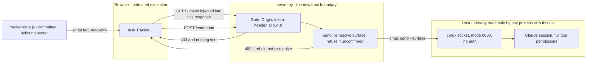

# Feature-state tracking with a browser UI

This repo carries more feature cards, phases and live worktrees than one session holds in its head —
run `ls docs/features/*.md`, `awk '/^phase:/{print $2}' docs/features/*.md | sort -u` and
`git worktree list` for the current spread. Every one of those counts moved during this feature's own
implementation, which is the argument for the feature rather than an aside: the merge order across
them is reconstructed by hand every session, and session 46 wrote that survey as a markdown table
into `.claude/session-state.md` where it went stale the same day. The information needed to build it
is all mechanical: card frontmatter, checklist state, `git worktree list`, ahead/behind counts.
Nothing derives it on demand.

**No count, test total or phase tally is pinned anywhere in this card**, and every code citation
carries the command that re-finds it, so a line that moves is detectable instead of quietly wrong.
Three audit passes and a compliance round found ten factual defects here, every one of them the same
species — a stored result that had gone stale — twice inside the corrections written to fix the
previous round. Claims are written as derivations to re-run. Measurements that must be recorded
(test counts, tool versions) are stamped with their date and their reproducing command.

This adds a skill that derives that survey for a given repo, writes it as a versioned run into a data
file, and drives an **already-built** browser UI that renders it — with a control channel that lets
the UI drive the Claude session that launched it.

## Evidence this is the actual gap

Derivations, not pinned line numbers — re-run them, they move:

- `.claude/session-state.md` is gitignored (`grep -n '^/\.claude/' .gitignore`) and rewritten every session
  by `hooks/live-handoff.sh`, so a survey written there has no history and no lifetime — session 46's
  "Strand survey" table is already gone. A hand-maintained survey cannot live in the one file the
  harness is designed to overwrite.
- `ls docs/features/*.md | wc -l` vs. `grep -l '^phase: planning' docs/features/*.md` — the phase
  spread that `phase-guard.sh` depends on is only ever read one card at a time.
- `git worktree list` against `grep -l '^branch: *none' docs/features/*.md` — the two sets are
  maintained independently and nothing cross-checks them. They may or may not conflict on any given
  day, and that is the point: **nothing would report it if they did.** Criterion 2 therefore tests the
  drift against a fixture rather than relying on this repo to keep exhibiting it.

## The output contract already exists — do not invent one

A Nocturne design-system export supplies the UI and the schema: `Task Tracker.dc.html`,
`Task Tracker Directions.dc.html` (a 4-direction options canvas), `nocturne.css`, `support.js`,
`_ds/`, and `tracker-data.json` — **`task-tracker v0.4.1`, schema `version: 1`**. Its own
`github.md` records that it was modeled on real features in this repo by reading
`hooks/lib/feature_tasks.py` vocabulary.

**The export is already vendored** (task 2) and lives at `task-tracker/`. Nothing in this feature
reads the original export directory again, so no path to it is recorded here — it is
machine-specific and would be a stale absolute path in a committed file within a week. If a
re-vendor is ever needed, set `TRACKER_UI_SOURCE` to the export directory and copy from there.

⚠️ If you do set `TRACKER_UI_SOURCE` on this machine, note that its parent is a directory whose
name contains a **literal backslash**, sitting beside a similarly-named one that uses a space.
Both exist in `$HOME`. Quote the value and keep the backslash intact, or it silently resolves to
the space-named directory, which has no such project.

The analyzer emits objects conforming to that schema. Read it, do not redesign it:

```
version, tool, generatedAt, repoUrls{}
runs[]                                   ← multiple analyses; switching is selecting one
  id, name, dir, analyzedAt
  features[]{name, meta, tasks[]}
  waves[]{n, note, items[]}              ← the merge / execute order
  constraints[]{id, title, pair, body}   ← why a wave is ordered that way
  branches[]{repo, branch, wt, ahead, behind, dirty, note, tone, last}
  graph{nodes[], edges[]}                ← dependency DAG
  kanban[]{title, tone, items[]}
  questions[]{id, q, ctx, resolved}
```

Task identity follows `hooks/lib/feature_tasks.py`: `STRICT_RE = ^\s*-\s\[[ xX]\]\s+(.+)$`, id is the
leading integer before the em dash. Reuse that module — do not write a second checklist parser.

## Design

Four components, in dependency order. The dashed edge is the only one that existed before this
feature; every solid edge from the browser rightward is new, and `server.py` is the whole of the
new trust boundary.



The socket-to-session edge is pre-existing exposure this feature does not widen. What it adds is
the browser-to-server edge — see §Security, whose every bullet defends that edge specifically.

### 1. Analyzer (`task-tracker/analyze.py`)

Pure read. Given a repo root, produce one `run` object:

- **features** — parse `docs/features/*.md` frontmatter (`phase`, `branch`, `model_tier`) and
  checklists via `feature_tasks.py`. `meta` is `"<done>/<total>"`.
- **branches** — `git worktree list --porcelain`, `git for-each-ref`, and
  `git rev-list --left-right --count` for ahead/behind; `git status --porcelain` for `dirty`.
- **waves / constraints / graph** — derived, and this is the only judgment-bearing part: a card is
  wave 1 when its branch exists, is not behind its base, and no other card's card-text names it as a
  prerequisite. Constraints are read from an explicit `## Depends on` section in a card, never
  inferred from prose. **An undetectable dependency must surface as a `questions[]` entry, not as a
  confident ordering** — a wrong merge order is worse than an admitted gap.

**Failure behaviour — the analyzer degrades, it never guesses and never dies mid-repo.** Every case
below yields a `questions[]` entry naming the input and the failure, and the run still emits:

| Condition | Detected by | Behaviour |
|---|---|---|
| Target is not a git repo | `git rev-parse --show-toplevel` exits non-zero | Abort *this run* with a non-zero exit and a message naming the path. Nothing is written; a partial run is worse than no run. |
| `git worktree list` / `for-each-ref` / `rev-list` exits non-zero | non-zero return | `branches[]` omits the affected entry; a `questions[]` entry records the command, its exit code, and its stderr. Other branches still resolve. |
| Branch has no upstream | `rev-list --left-right --count` fails, or `@{u}` unresolvable | `ahead`/`behind` are `null` — **not** `0`, which would falsely read as "in sync". `note` says no upstream. |
| Frontmatter malformed or unparseable | YAML error, or no `phase:` key | File is not a card and is skipped (criterion 1 already requires a `phase:` key). A YAML *error* on a file that does have `phase:` becomes a `questions[]` entry naming the file and the parse error. |
| Checklist line matches `STRICT_RE` but has no leading integer | `identity()` yields no id | Task counts toward `total`, gets no id, and a `questions[]` entry names the card and the line text. |

`null` versus `0` is the load-bearing distinction in that table: this feature exists to report merge
order, and a branch silently reported as "0 behind" when its upstream could not be read is exactly
the wrong answer to the question the feature was built to answer.

### 2. Store + emit (`task-tracker/tracker-data.js`)

The UI loads `tracker-data.js`, not the JSON. Emit `window.TRACKER_DATA = {...}`. Runs are keyed by
`id`; re-analysis **replaces the run with that id and preserves the others**, so switching between
analyses and re-analyzing one are the same operation on different keys. Write atomically (temp file +
`os.replace`) so a crashed run cannot truncate the store.

This file is git-tracked and world-readable, and it **carries no secret** — the store module has no
access to the token by construction, since the token exists only inside the running server process
(§Security). Criterion 10 asserts this rather than trusting it.

### 3. Control server (`task-tracker/server.py`)

Localhost only. This is the component the Security section governs. Its send path is
`cmux send --surface`, resolved — see §"Injection route".

**The server also serves the UI**, and that is a security decision rather than a convenience: the
user opens `http://127.0.0.1:8422/`, not the `.dc.html` file. Two consequences that no other design
gives us — the token is injected into the served HTML at request time and **never written to disk in
any form**, and the UI is *same-origin* with `/command`, so the `Origin` check compares against one
exact string instead of having to accept the `null` that every `file://` page sends. Opening the
vendored file directly still works and is criterion 8's path; it simply has no control channel,
which is the honest outcome on a host with no injection route anyway.

#### Wire contract

Exactly two routes. Anything else is `404`. This contract is what task 10 wires the UI against, so
it is fixed here rather than improvised there.

**`GET /`** → `200`, `Content-Type: text/html`, **`Cache-Control: no-store`**. Serves the vendored
`Task Tracker.dc.html` with one substitution: `<meta name="tracker-token" content="TOKEN">` injected
into `<head>`.

`no-store` is not boilerplate — it is the difference between "the token has no on-disk
representation" being true and being merely *intended*. Without it the browser may persist the
token-bearing response into its own disk cache, which is a file on disk holding the credential, just
not one this repo wrote. Criterion 10 checks for it.

**`GET /` also carries the token, so it is guarded too.** Reject any request whose `Host` header is
not `127.0.0.1:<port>` — a DNS-rebinding attack reaches a localhost server with an attacker-chosen
`Host`, and this route hands out the credential with no `Origin` to check because a top-level
navigation sends none.

Static assets are served from `task-tracker/` under their own paths, read-only, with path traversal
rejected — resolve the request path, resolve symlinks, and require the result stay under
`task-tracker/`, `403` otherwise. The servable set is exactly:

`nocturne.css`, `support.js`, `_ds/**`, `tracker-data.js`, **`tracker-data-fallback.js`**

**No other file is reachable**; the process must not serve the repo root. `tracker-data-fallback.js`
is on that list because `Task Tracker.dc.html` loads it directly
(`grep -n 'tracker-data' 'task-tracker/Task Tracker.dc.html'`) — omitting it makes a server built
exactly to this contract `404` a script its own page requests. Re-derive the list with that grep
rather than trusting this line if the vendored HTML is ever re-exported.

**`POST /command`** — the only state-changing route.

```http
POST /command HTTP/1.1
Host: 127.0.0.1:8422
Origin: http://127.0.0.1:8422
Content-Type: application/json
X-Tracker-Token: <token>

{"id": "clear"}
```

- `X-Tracker-Token` is the required non-simple header; it carries the token *and* forces the
  preflight. One header does both jobs — a separate `Authorization` would be redundant.
- The body has **exactly one key, `id`**, a string. Unknown keys are a `400`, not ignored — silent
  tolerance is how an argument field gets smuggled in later.
- **Commands take no arguments, in v1 or after.** This is the concrete answer to the question the
  round-1 verdict raised: the wire carries an allowlist *id* and nothing else, so no untrusted text
  ever reaches the session. Parameterising a command is a spec change and a new judge round, never
  an implementation decision.

Success is `200` with `{"ok": true, "id": "<id>"}`. Every failure is
`{"ok": false, "error": "<code>"}` with these codes, and **no failure echoes any request content
back** — an error body that reflects input is a free XSS gadget:

| Status | `error` | Cause |
|---|---|---|
| `400` | `malformed` | Body is not a JSON object, `id` missing or not a string, or any key other than `id` present |
| `403` | `forbidden` | Missing/invalid token, **or** `id` not in the allowlist, **or** `Origin`/`Sec-Fetch-Site` mismatch |
| `404` | `not_found` | Any path other than the two routes above |
| `405` | `method_not_allowed` | Any method other than `GET` on `/`, or `POST`/`OPTIONS` on `/command` |
| `409` | `unresolved_surface` | Target surface ref did not re-resolve at send time — this is criterion 9's "refuses and reports" |
| `413` | `too_large` | Body over 1 KiB. Read at most that much; never buffer an unbounded body |
| `415` | `unsupported_media_type` | `Content-Type` is not `application/json` |
| `500` | `reanalyze_failed` | `id` was `reanalyze` and the analyzer aborted or the store write failed. The previous `tracker-data.js` is left intact (§Design 2's atomic write guarantees this) and the UI must surface the failure rather than silently continue displaying stale data |
| `502` | `send_failed` | `cmux send` exited non-zero, or exceeded its 5-second timeout |

**The single `403` is deliberate.** Bad token, unknown id, and bad origin are indistinguishable to
the caller, so the endpoint cannot be used to enumerate the allowlist or confirm a guessed token.

`OPTIONS /command` returns `204` and **no `Access-Control-Allow-*` header of any kind**. The server
never emits CORS headers, so a genuine cross-origin preflight fails in the browser by construction —
there is no allow-list of origins to get wrong, because there is no allow-list at all.

**Failure behaviour.** `cmux send` runs with a 5-second timeout and its exit code is checked; a
timeout is killed and reported as `502`, never awaited indefinitely and never assumed to have
succeeded. A non-zero exit is `502` with the exit code logged server-side (not returned). Surface
re-resolution failure is `409` **before** any send is attempted — the refusal happens on the near
side of the socket, so nothing reaches the focused tab. `reanalyze` failure is `500`; the store is
left at its previous valid state, never truncated and never half-written.

#### Audit log

This component can type into a session holding full tool permissions, and the worst failure it can
have — keystrokes reaching the wrong surface — is invisible after the fact unless it was recorded as
it happened. **One line per request** to stderr, which the launching session already captures:

```
<ISO-8601 UTC> <outcome> id=<id|-> surface=<resolved-ref|-> status=<code> reason=<error-code|->
```

- `outcome` is `accepted`, `refused`, or `failed`. **Refusals are logged as loudly as successes** —
  a run of `forbidden` entries is the only evidence a hostile page ever probed the endpoint.
- `surface` is the ref the send actually resolved to at send time, not the one requested. This is the
  field that answers "where did that keystroke go", and it is the reason the log exists.
- **Never log request headers, request bodies, or the token — in whole or in part**, and never log at
  a level that captures them incidentally. §Out of scope bans persisting the token to a file, an
  environment variable, or argv; a log file is none of those three, which is exactly why this
  prohibition is written here as well. A single `log.debug(request.headers)` would satisfy every
  other word of this card and put the credential on disk.
- Log lines are structured for a human reading a terminal, not for a collector; no log shipping, no
  rotation, no daemon. Bounded lifetime means bounded logs.

### 4. Skill (`skills/tracking-feature-state/SKILL.md`)

The activity-triggered entry point: when to run an analysis, how to read the waves, how to launch and
stop the UI. Per `triaging-new-instructions` step 4 this is one skill because it is one activity;
the UI and server are its subject, not additional skills. It **points at**
`managing-session-memory` for phase rules rather than restating them.

## Injection route: `cmux send --surface` — resolved, do not re-spike

The control model (UI → server → keys into the live session) **has** a working precedent here. This
card's first draft claimed the opposite; that claim came from pooling function names across all four
adapter files with `sort -u` and reading the union as a property of each — an artifact of the grep,
not of the code.

`panes/adapters/cmux.sh` `send_launcher()` sends to an **existing** surface
(`grep -n 'send .*--surface' panes/adapters/cmux.sh`):

```sh
"$CMUX_BIN" send ${WS_ARGS[@]+"${WS_ARGS[@]}"} --surface "$1" -- "bash $launcher_q\n"
```

and the pane-reuse branch is commented "v1-proven here (user-approved deviation 2026-07-21; the
spec's intent is unchanged)". Tasks 8–10 build on that verb. **Task 1's spike has already run — the
route is decided and re-running it is wasted work.**

Two constraints ride along, both load-bearing for task 8:

- **A stale ref may not error.** `cmux.sh` documents the resolution chain
  `--tab` → `--surface` → `$CMUX_TAB_ID`/`$CMUX_SURFACE_ID` → **the focused tab**, with an
  unresolvable ref falling through it *without erroring* — probe P6, proven live against
  `surface:9999` at exit 0. ⚠️ That comment documents **`rename-tab`, not `send`.** `send` takes the
  same `--surface` flag and very likely shares the chain, but no probe has shown that it does.
  Task 8 must therefore (a) verify empirically whether `send` inherits the fall-through, and
  (b) re-resolve and confirm the target surface at send time and **refuse** an unconfirmed ref
  regardless of the answer. Keystrokes landing in the focused tab is the worst failure this feature
  can have.
- **The rejected routes stay rejected.** `TMUX` is unset here (`TERM_PROGRAM=ghostty`), so
  `tmux send-keys` is not available; and `panes/handoff-wrapper.sh`
  (`grep -n 'pre-typed keystroke' panes/handoff-wrapper.sh`) records that the handoff spec
  deliberately rejected "pre-typed keystroke tricks", so osascript keystroke injection would reverse a
  prior decision rather than extend one. `cmux send` is the one sanctioned route.

Still genuinely unproven, and worth 15 seconds on a scratch surface before task 8 starts: every proven
use of `cmux send` targets a **shell prompt**. None targets a live Claude TUI.

**Clipboard is a supported runtime mode, not a fallback.** `panes/terminal-detect.sh` prints `none`
under SSH or headless (`grep -n 'echo none' panes/terminal-detect.sh`), where no injection route
exists by construction. In that mode the UI offers all three allowlisted commands as copyable text.
That is the same feature minus one verb, and criterion 8 tests it as a first-class path rather than a
degradation.

This mode is also why opening the vendored `Task Tracker.dc.html` directly over `file://` must keep
working even though the served `http://127.0.0.1:8422/` is the primary path. With no server there is
no token and no `/command`, so the UI reads `tracker-data.js` via its `<script>` tag and renders every
run read-only — the survey, which is the part of this feature that carries the actual stated value.
The control channel is the part that needs a server, and it is precisely the part that has no route
on such a host anyway.

## Security

The server can drive a Claude session holding full tool permissions. It is the highest-value target
this repo has ever exposed, so it is default-deny:

- **Bind `127.0.0.1` explicitly.** Never `0.0.0.0`, never a hostname that could resolve outward.
- **Allowlisted commands only — and the allowlist is exactly these three.** No ellipsis: this table
  *is* the authorization set, and adding a fourth row is a spec change plus a new judge round, not
  an implementation call.

  | id | Effect | Reaches the session? |
  |---|---|---|
  | `clear` | Sends the literal keystrokes `/clear` + newline | Yes |
  | `handoff` | Sends the literal keystrokes `/handoff` + newline | Yes |
  | `reanalyze` | Re-runs the analyzer and re-emits the store, server-side | **No** — no keystroke is sent at all |

  The wire carries the *id*; the command text never crosses the network and is never assembled from
  request data. An endpoint accepting an arbitrary string is a remote shell and is out of scope
  permanently, not just for v1.
- **Per-launch bearer token that never touches disk.** Generated with `secrets.token_urlsafe(32)`
  at startup, held in process memory only, and injected into the `GET /` response as a `<meta>` tag.
  Required on every POST, compared with `hmac.compare_digest`. It is **not** written into
  `tracker-data.js`, not written to any sidecar file, and not passed as a command-line argument
  (which would expose it to `ps`). The store is a committed, world-readable file; the credential
  guarding a full-permission session must not live in one, and the cleanest way to guarantee that is
  for the credential to have no on-disk representation to leak. Dying process, dead token.
- **Require a custom request header.** CORS does not stop a hostile page from *sending* a simple
  cross-origin POST — it only hides the response. A required non-simple header forces a preflight
  that the server refuses. Also reject on `Origin`/`Sec-Fetch-Site` mismatch.
- **Bound lifetime.** The server exits with the session and after **30 minutes** with no request
  (`TASK_TRACKER_IDLE_SECS` overrides, minimum 60s, and it may not be disabled — there is no value
  meaning "never"). No daemon, no launchd. A number is given rather than "an idle timeout" because an
  unspecified timeout is implemented as no timeout, and the token's lifetime is the process's
  lifetime.
- **No remote assets on the token-bearing page.** The vendored `Task Tracker.dc.html` currently pulls
  two `@phosphor-icons` stylesheets from `unpkg.com`
  (`grep -n 'https://' 'task-tracker/Task Tracker.dc.html'`). Vendor them into `task-tracker/_ds/` and
  rewrite the two `<link>` hrefs to local paths. This is not an arbitrary-code-execution fix — they
  are stylesheets, not scripts, and no remote JavaScript is loaded — but a page that hands out a
  session credential should fetch nothing from a third party, and vendoring is also what makes
  criterion 8's offline `file://` path and the headless mode actually work, which they do not today.
- **Confirm the target surface at send time**, per §"Injection route" — refuse an unconfirmed ref
  rather than risk keystrokes reaching the focused tab.
- Port comes from `allocating-local-ports` and is recorded in `PORTS.md` before first bind.

**What this feature does and does not add to the threat model.** The cmux socket has no
authentication beyond its `0600` permission, so surface injection is *already* available to any
process running as this user — this feature does not create that exposure. What it does create is the
**HTTP hop**: a network-reachable endpoint in front of a capability that was previously reachable only
by a local process holding the user's uid. Every bullet above defends that hop specifically. None of
them is redundant with the socket's file permission, and none may be weakened on the argument that
"injection was possible anyway."

## Acceptance criteria

1. **Given** a **named working tree** — the criterion must name which one, because the main checkout
   and each worktree hold different card sets — **when** the analyzer runs against it, **then**
   `features[]` has exactly one entry per `docs/features/*.md` file *in that tree* whose frontmatter
   carries a `phase:` key (a split `<name>.spec.md` half carries none and is not a card), and each
   `meta` is `"<done>/<total>"` where `total` is `len(task_ids(...))` from `hooks/lib/feature_tasks.py`
   and `done` is the count of `[xX]` markers on the same `STRICT_RE`-matched lines.
   ⚠️ `feature_tasks.py` has no done/total of its own to compare against: `identity()` deliberately
   consumes only `match.group(1)`, the text *after* the bracket, so task identity survives a tick.
   The done count is therefore read off the raw matched lines, by this feature, using that module's
   regex — one parser still holds.
2. **Given** a card whose frontmatter says `branch: none` while a worktree holds a branch named for
   it, **then** that drift appears in `questions[]` — not silently resolved in either direction.
3. **Given** two analyses of different directories, **then** both persist in `runs[]` and switching
   between them changes no data on disk.
4. **Given** a re-analysis of an existing run id, **then** that run's `analyzedAt` advances and every
   other run is byte-identical.
5. **Given** an interrupted write, **then** the previous `tracker-data.js` is still valid JS —
   assert by killing mid-write and reloading.
6. **Given** a running server, **when** a POST arrives with no token, a wrong token, or a command id
   outside the three-row allowlist, **then** the server responds `403` with body
   `{"ok": false, "error": "forbidden"}` — byte-identical across all three causes, so the response
   cannot distinguish them — and **no command reaches the session**.
7. **Given** a cross-origin page the user did not open, **when** it POSTs to `/command`, **then** the
   request is rejected on the preflight (no `Access-Control-Allow-*` header is ever emitted) or on
   the `Origin` check, and **no command reaches the session**.
8. **Given** a host where `panes/terminal-detect.sh` prints `none` (SSH, headless) and no server is
   running, **when** the vendored `Task Tracker.dc.html` is opened over `file://`, **then** the UI
   renders every run from `tracker-data.js` and offers all three allowlisted commands as copyable
   text rather than injection — no request is attempted and no error is surfaced to the user.
9. **Given** a target surface ref that no longer resolves, **when** an allowlisted command is POSTed
   with a valid token, **then** the server responds `409` with
   `{"ok": false, "error": "unresolved_surface"}`, refuses **before invoking `cmux` at all**, and
   **no keystroke reaches any surface** — specifically not the focused one. This criterion holds
   whether or not `send` turns out to inherit the non-erroring fall-through documented for
   `rename-tab`, because the refusal happens on the near side of the socket.
10. **Given** a server that has served `GET /` **and has completed an accepted `reanalyze`** — the
    only command that makes the token-holding process rewrite a file, and therefore the most
    plausible route to a leak — **when** the emitted token is searched for as **raw bytes** (not
    decoded text, so an encoded copy still matches) across every file under `task-tracker/` including
    `tracker-data.js`, across the server process's command line, and across the environment of every
    child process it spawns, **then** it appears in none of them; **and when** the served HTML is
    fetched, **then** the token appears exactly once, in the `<meta>` tag, and the response carries
    `Cache-Control: no-store`.
    Assert every clause. Absence on disk is the security property, presence in the response is what
    makes the UI work, `no-store` is what stops the browser writing the credential to its own cache,
    and the `reanalyze` precondition is what stops the test passing without ever exercising the path
    that would leak. A test that checks only one clause passes while the feature is broken.
11. **Given** a request path that resolves outside `task-tracker/` — `../../rules/core-conduct.md`,
    an absolute path, or a symlink pointing out of the tree — **when** it is requested, **then** the
    server responds `403` and the file's contents do not appear in the response body.

## Tasks

- [x] 1 — **Spike — done, do not re-run.** Route is `cmux send --surface`; see §"Injection route" for
      the evidence, the two constraints it carries, and the one probe still outstanding (`send` into a
      live Claude TUI, owed before task 8).
- [x] 2 — Vendor the UI: copy the Nocturne export to `task-tracker/`, preserving `_ds/`. Verify the
      copied `Task Tracker.dc.html` opens and renders from the bundled `tracker-data.js`.
- [x] 3 — `task-tracker/analyze.py`: features + branches only, importing `hooks/lib/feature_tasks.py`.
      Emit schema-valid JSON. No waves yet.
      - `analyze.py` is over the 400-line target though under the 800 hard max (`wc -l` it). The clean
        split is a `task-tracker/git_facts.py` holding the worktree/ahead-behind/dirty readers. **Not
        scheduled** — a structural split is a human-owned call, not a drive-by; raise it if the file
        grows again.
- [x] 4 — `task-tracker/test_analyze.py`: criteria 1 and 2 against a fixture repo, not this one.
      (Named `test_*.py`, not `*.test.py` — pytest collects only the former.)
- [x] 5 — Waves, constraints and graph derivation, including the `## Depends on` reader and the
      "undetectable dependency becomes a question" rule.
- [x] 6 — `task-tracker/store.py` + `task-tracker/test_store.py`: atomic emit of `tracker-data.js`,
      run upsert by id. Criteria 3-5.
- [x] 7 — `PORTS.md` entry for the control server, per `allocating-local-ports`, before any bind.
      - Port is **8422**, `TASK_TRACKER_PORT` overrides. Picked clear of the 8000-8100 block other
        projects own; `lsof -nP -iTCP:8422 -sTCP:LISTEN` was empty at allocation. Task 8 reads the
        number from `PORTS.md`, it is not re-decided there.
- [ ] 8 — `task-tracker/server.py` to the wire contract in §Design 3: `127.0.0.1` bind on the port
      from `PORTS.md`, in-memory token injected into `GET /`, static serving confined to
      `task-tracker/` (including `tracker-data-fallback.js`), the three-row allowlist,
      `X-Tracker-Token` requirement, Origin check on `/command`, **`Host` check and
      `Cache-Control: no-store` on `GET /`**, the 30-minute idle timeout, the **audit log**, and
      send-time surface re-resolution. Route is settled (task 1); run the outstanding Claude-TUI probe
      first. Python 3.9 — see §Toolchain before writing any annotation.
      - This file carries bind + token + static serving + allowlist + header check + surface
        re-resolution + subprocess, and will land near the 400-line target. If it crosses, the split
        is `task-tracker/serve_static.py`; raise it rather than taking it as a drive-by.
- [ ] 9 — `task-tracker/test_server.py`: criteria 6, 7, 9, 10 and 11, including every negative case
      and each status code in the contract table. A test that only proves the happy path does not
      close this task. Criterion 10 in particular must assert **both** halves — token absent from
      every file under `task-tracker/`, and present in the served HTML.
- [ ] 10 — Wire the UI's command buttons to `POST /command` per the contract, reading the token from
      the injected `<meta name="tracker-token">`. Where `terminal-detect.sh` prints `none`, render the
      same three commands as copyable text instead (criterion 8).
- [ ] 11 — `skills/tracking-feature-state/SKILL.md`, following
      `skills/_standards/authoring-skills-and-agents.md`. Points at `managing-session-memory`; does
      not restate phase rules.
- [ ] 12 — Add the skill to the Skills Catalog in `CLAUDE.md`.
- [ ] 13 — Run every suite, record before/after counts in `## Verification`. Capture before-counts
      first so a pre-existing failure is not read as a regression. Record `node --version` beside the
      counts and report the three node-guarded tests per §Verification's wording.
- [ ] 14 — **Do this before task 10.** Vendor the two `@phosphor-icons` stylesheets into
      `task-tracker/_ds/` and rewrite the `<link>` hrefs in `Task Tracker.dc.html` to local paths
      (`grep -n 'https://' 'task-tracker/Task Tracker.dc.html'` for the current set — re-derive it,
      the count is not pinned here). Numbered last because it was found last; it is an ordering
      dependency of task 10, not a follow-up to task 13. Closes the last remote fetch on the
      token-bearing page and is what makes criterion 8's offline path actually pass.

## Out of scope

- An endpoint that accepts arbitrary command text. Permanently, not just v1.
- Command arguments of any kind. The wire carries an allowlist id and nothing else.
- Serving any path that resolves outside `task-tracker/`. The server is not a repo file browser.
- Persisting the token in any form — no file, no environment variable, no command-line argument,
  **and no log line**, at any level. The audit log in §Design 3 records outcomes and resolved surface
  refs; it never records headers, bodies, or the credential.
- Log shipping, rotation, or any collector. One line per request to stderr, and nothing else.
- Any daemon, launchd job, or server outliving the session.
- Writing to the analyzed repo. The analyzer is read-only; it never edits a card to fix drift it
  found — it reports it in `questions[]`.
- Multi-machine or remote access. Localhost only.
- Redesigning the UI or its schema. If a field is missing, that is a `questions[]` entry and a
  conversation, not an ad-hoc schema extension.

## Toolchain — pinned

Exact versions, so the recorded test counts are reproducible and `addopts`/collection behaviour
cannot shift underneath this feature. Measured on this host 2026-08-09; each row carries the command
that re-reads it, so drift is detectable rather than assumed away.

| Tool | Pinned version | Re-read with |
|---|---|---|
| Python | `3.9.6` | `python3 -V` |
| `uv` | `0.11.28` | `uv --version` |
| `pytest` | `9.1.1` | `uv run --with pytest==9.1.1 --no-project pytest --version` |
| `cmux` | `0.64.20 (100) [14e3400b9]` | `cmux --version` |
| `node` | `v26.5.0` | `node --version` |

`node` is pinned because it is **verification-load-bearing, not optional**: three `test_store.py`
tests are `skipif(NODE is None)`, and one of them is criterion 5's only independent JavaScript-engine
oracle — precisely the U+2028 class of bug `store.dumps`'s own docstring names. A host without it
reports green having never run that check.

**Python 3.9 is the binding constraint**, and it is easy to forget while writing `server.py`: no
`match` statements, no PEP 604 `X | Y` unions in annotations, no `dict[str, int]` builtin generics at
runtime without `from __future__ import annotations`. Use `typing.Optional`/`typing.Dict`.

The canonical invocation pins pytest explicitly:

```
uv run --with pytest==9.1.1 --no-project pytest task-tracker/ -q
```

`cmux` is a host binary, not a dependency this repo can pin in a manifest; the version above is what
the contract in §"Injection route" was verified against, and a mismatch is the first thing to check
if `send` behaves differently.

## Verification

**Task 1 — injection route.** Resolved: `cmux send --surface`, evidence in §"Injection route". One
probe remains outstanding and is owed before task 8 opens: `cmux send` into a live **Claude TUI**, as
every proven use to date targets a shell prompt.

**Tasks 2–6 suites.** Run the pinned invocation above. It reported **53 passed** on 2026-08-09; that
number is a measurement with a date, not a contract — re-run it rather than trusting it. There is no
system `pytest` here, so `uv run` is the only invocation that works.

⚠️ **Three of those tests are conditionally skipped on a host without `node`.**
`task-tracker/test_store.py` guards three tests with `@pytest.mark.skipif(NODE is None, ...)`
(`grep -n skipif task-tracker/test_store.py`), one of them criterion 5's JS-loadability check. This
is why `node` is pinned in §Toolchain.

Precisely what is lost, since overstating it is its own defect: each node-guarded test has an
**unguarded Python sibling** asserting byte-identity and a real envelope parse
(`grep -n 'def test_' task-tracker/test_store.py`), so on a node-less host criterion 5 is *partially*
verified, not unverified. What goes missing is the independent JavaScript-engine oracle — exactly the
U+2028/U+2029 class of bug that `store.dumps`'s own docstring names as the reason it escapes them.
Task 13 must record `node --version` beside the counts, and report a skip of these three as
**"criterion 5 verified without a JS-engine oracle"** rather than either a clean pass or a failure.

⚠️ **Task 13 must record before-counts per suite, captured before touching anything**, so a
pre-existing failure is not read as a regression introduced by this feature.

*Correction (this revision):* an earlier version of this section warned that `addopts` in
`pyproject.toml` deselects the `golden` and `measurement` marks under a bare `pytest -q`. That
warning was aimed at nothing. The repo's only `pyproject.toml` is `memsearch/pyproject.toml`, whose
`[tool.pytest.ini_options]` governs `memsearch/` alone; `task-tracker/` carries **no pytest
configuration of any kind** and defines no `golden` or `measurement` marks
(`find . -name pyproject.toml`, then `grep -rn 'golden\|measurement' task-tracker/`). The warning
erred safe, but it described a different package — the tenth instance of this card's recurring defect
species, and the reason the derivations discipline above exists.

## Revision history

**2026-08-09 (session 52) — compliance round 2 failed with 5; escalated to the user, then fixed.**
Round 2 resolved 3 of round 1's 7, narrowed 4, and found 1 new. Four ids recurring across two
consecutive rounds tripped the escalation tripwire, so it went to the user, who directed a further
revision and a round 3. The four were narrowed re-instances rather than survivals — round 1 said *no
contract exists*, round 2 said *the contract you wrote omits one file* — and that distinction is
recorded here because the tripwire counts ids, not severity.

Fixed: the servable-asset list omitted `tracker-data-fallback.js`, which the vendored page loads, so
a server built exactly to contract would 404 its own script; `Cache-Control: no-store` added to the
token-bearing response (without it "no on-disk representation" was false via the browser cache, and
criterion 10 did not look there); a `500 reanalyze_failed` code for the one command doing server-side
work; `node` pinned, since three tests skip without it; a `Host` check on `GET /`, the route that
hands out the credential and has no `Origin` to check; and a number on the idle timeout, because an
unspecified timeout gets implemented as none.

From the observability judge, which found the larger gap the compliance judge did not: **§Design 3
gains an audit log.** In 544 lines about something that can type into a full-permission session there
was one sentence about logging, and §Out of scope banned persisting the token to a file, an env var,
or argv — a log file being none of those three, `log.debug(request.headers)` would have satisfied
every word of this card and written the credential to disk. Criterion 10 was also tightened: it now
requires an accepted `reanalyze` first (the only path where the token-holding process writes a file),
scans raw bytes and child-process environments, and asserts `no-store`.

Two claims were corrected rather than accepted. The compliance judge's headline finding described
"three executable scripts from unpkg.com (React, ReactDOM, @babel/standalone) with no SRI" running
same-origin with the token; the vendored HTML actually loads **two `@phosphor-icons` stylesheets and
no remote JavaScript at all** (`grep -n 'https://' 'task-tracker/Task Tracker.dc.html'`). Vendoring
them is still required — a page handing out a session credential should fetch nothing third-party,
and it is what makes criterion 8's offline path work — but as a correctness and offline fix, not the
code-execution one that was cited. Separately the observability judge withdrew its own round-1 claim
that the committed `tracker-data.js` held genuine output: its `dir` values point at a non-existent
`~/dev/`, so it is the vendored demo payload. The security conclusion held; the supporting fact did
not.

**2026-08-09 (session 52) — compliance round 1 failed; all seven violations addressed.** The judge
passed the parts of this card that had been audited three times and failed the one component that had
never been written down: the control server. Changes, by violation id:

- `core-conduct/secrets-not-client-side` — the token was to be baked into `tracker-data.js`, which is
  git-tracked, not ignored, already holds real output, and lives in a public repo. **The server now
  serves the UI** and injects the token into that response, so the credential has no on-disk
  representation at all; the fix removes the exposure rather than mitigating it. Criterion 10 asserts
  both halves. *User decision, this session:* server-served UI over gitignoring a token sidecar.
- `writing-specs/api-contracts` — §Design 3 now carries the full wire contract: two routes, the
  header, request and response schemas, all eight status codes, and the explicit answer that
  **commands never carry arguments**.
- `writing-specs/pinned-versions` — new §Toolchain pins Python, `uv`, `pytest` and `cmux`, and the
  canonical invocation now pins `pytest==9.1.1`.
- `core-conduct/explicit-error-handling` — the analyzer gets a failure table (including `null` vs `0`
  for a missing upstream), and the server gets timeouts, exit-code checks, and a stated refusal path.
- `core-conduct/no-absolute-paths` — the hardcoded export path is gone; it was only ever provenance,
  since task 2 already vendored the files.
- `writing-specs/no-placeholders` — the allowlist ellipsis is replaced by a three-row table that *is*
  the authorization set.
- `writing-specs/diagrams` — §Design opens with a rendered Mermaid flowchart of the trust boundary.

Scope was put to the user rather than decided here, per the judge's non-blocking note: the control
channel **stays in this card** rather than splitting into its own.

Two further defects were found during this revision, neither cited by the judge. The task-13 `addopts`
warning described `memsearch/pyproject.toml`, which never governed `task-tracker/` — the tenth
instance of this card's one recurring defect species. And three `test_store.py` tests are skipped
without `node`, one of them criterion 5's own proof, so a green run on a node-less host leaves a
criterion unverified; §Verification now says so. This card's opening claim to pin no line numbers was
itself false — four were pinned. Rather than delete useful citations, each now carries the `grep` that
re-finds it, and the claim is corrected to what the discipline actually is.

**2026-08-09 (session 49) — nine defects repaired, corrections sections removed.** Two audit passes
(sessions 47 and 48) found nine factual errors in this card, every one the same species: a stored
result that went stale, twice inside the corrections written to fix the previous round. All nine are
fixed in the body above and the corrections sections are deleted — a spec plus a list of ways the spec
is wrong is two documents disagreeing, and a reader cannot tell which to believe. Git holds the
detail; `a854e99` is the last commit carrying the unrepaired text.

The structural fix, applied throughout: **claims are written as derivations to re-run, not as stored
counts or line ranges.** The one number retained above is stamped with the date it was measured and
the command that reproduces it.

One defect was found *in the audit itself* during this revision and is recorded here rather than
silently dropped: the audit asserted that tasks 4, 6 and 9 named uncollectable `*.test.py` files.
Tasks 4 and 9 did; **task 6 never did** — it names `store.py`, an implementation file. The correction
inherited "6" from the adjacent list without re-reading the task. Separately, the audit attributed
cmux's non-erroring ref fall-through to `send`; the source comment documents it for **`rename-tab`**.
That distinction is now carried explicitly into §"Injection route" and criterion 9, because assuming
`send` shares the chain is the same unfalsified-inference error a third time.
