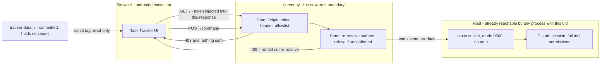

# Feature-state tracking with a browser UI

This repo carries more feature cards, phases and live worktrees than one session holds in its head —
run `ls docs/features/*.md`, `awk '/^phase:/{print $2}' docs/features/*.md | sort -u` and
`git worktree list` for the current spread. Every one of those counts moved during this feature's own
implementation, which is the argument for the feature rather than an aside: the merge order across
them is reconstructed by hand every session, and session 46 wrote that survey as a markdown table
into `.claude/session-state.md` where it went stale the same day. The information needed to build it
is all mechanical: card frontmatter, checklist state, `git worktree list`, ahead/behind counts.
Nothing derives it on demand.

**No count, test total or phase tally is pinned anywhere in this card**, and every code citation
carries the command that re-finds it, so a line that moves is detectable instead of quietly wrong.
Three audit passes and four compliance rounds found defects here, and they are overwhelmingly one
species — a stored result that had gone stale — including twice inside the corrections written to fix
the previous round. Claims are written as derivations to re-run. Measurements that must be recorded
(test counts, tool versions) are stamped with their date and their reproducing command.

⚠️ **A derivation is only as good as its scope, and that is where rounds 3 and 4 were lost.** Twice
this card prescribed a `grep` narrowed to one file to answer a question about the whole page, and
twice the narrow answer read as authoritative because it was reproducible. **Before trusting any
derivation below, ask what it cannot see** — the wrong scope fails silently and looks exactly like a
clean result.

This adds a skill that derives that survey for a given repo, writes it as a versioned run into a data
file, and drives an **already-built** browser UI that renders it — with a control channel that lets
the UI drive the Claude session that launched it.

## Evidence this is the actual gap

Derivations, not pinned line numbers — re-run them, they move:

- `.claude/session-state.md` is gitignored (`grep -n '^/\.claude/' .gitignore`) and rewritten every session
  by `hooks/live-handoff.sh`, so a survey written there has no history and no lifetime — session 46's
  "Strand survey" table is already gone. A hand-maintained survey cannot live in the one file the
  harness is designed to overwrite.
- `ls docs/features/*.md | wc -l` vs. `grep -l '^phase: planning' docs/features/*.md` — the phase
  spread that `phase-guard.sh` depends on is only ever read one card at a time.
- `git worktree list` against `grep -l '^branch: *none' docs/features/*.md` — the two sets are
  maintained independently and nothing cross-checks them. They may or may not conflict on any given
  day, and that is the point: **nothing would report it if they did.** Criterion 2 therefore tests the
  drift against a fixture rather than relying on this repo to keep exhibiting it.

## The output contract already exists — do not invent one

A Nocturne design-system export supplies the UI and the schema: `Task Tracker.dc.html`,
`Task Tracker Directions.dc.html` (a 4-direction options canvas), `nocturne.css`, `support.js`,
`_ds/`, and `tracker-data.json` — **`task-tracker v0.4.1`, schema `version: 1`**. Its own
`github.md` records that it was modeled on real features in this repo by reading
`hooks/lib/feature_tasks.py` vocabulary.

**The export is already vendored** (task 2) and lives at `task-tracker/`. Nothing in this feature
reads the original export directory again, so no path to it is recorded here — it is
machine-specific and would be a stale absolute path in a committed file within a week. If a
re-vendor is ever needed, set `TRACKER_UI_SOURCE` to the export directory and copy from there.

⚠️ If you do set `TRACKER_UI_SOURCE` on this machine, note that its parent is a directory whose
name contains a **literal backslash**, sitting beside a similarly-named one that uses a space.
Both exist in `$HOME`. Quote the value and keep the backslash intact, or it silently resolves to
the space-named directory, which has no such project.

The analyzer emits objects conforming to that schema. Read it, do not redesign it:

```
version, tool, generatedAt, repoUrls{}
runs[]                                   ← multiple analyses; switching is selecting one
  id, name, dir, analyzedAt
  features[]{name, meta, tasks[]}
  waves[]{n, note, items[]}              ← the merge / execute order
  constraints[]{id, title, pair, body}   ← why a wave is ordered that way
  branches[]{repo, branch, wt, ahead, behind, dirty, note, tone, last}
  graph{nodes[], edges[]}                ← dependency DAG
  kanban[]{title, tone, items[]}
  questions[]{id, q, ctx, resolved}
```

Task identity follows `hooks/lib/feature_tasks.py`: `STRICT_RE = ^\s*-\s\[[ xX]\]\s+(.+)$`, id is the
leading integer before the em dash. Reuse that module — do not write a second checklist parser.

## Design

Four components, in dependency order. The dashed edge is the only one that existed before this
feature; every solid edge from the browser rightward is new, and `server.py` is the whole of the
new trust boundary.



The socket-to-session edge is pre-existing exposure this feature does not widen. What it adds is
the browser-to-server edge — see §Security, whose every bullet defends that edge specifically.

**Decisions on record.** Two of this design's load-bearing choices are structural and live as ADRs
rather than in this card, which describes *what* is built and defers *why this and not the
alternative* to them. Read them before proposing a different shape:

- **ADR 0022** — the control channel serves its own page. Why the server hands out the UI rather than
  the user opening the `.dc.html` file: it is what gives the token a lifetime with no on-disk
  representation and makes the `Origin` check compare one exact string instead of accepting `null`.
- **ADR 0023** — the `tracker-data` schema is owned externally. Why the analyzer conforms to the
  Nocturne export's schema instead of defining its own, and why a missing field is a `questions[]`
  entry and a conversation rather than an ad-hoc extension.
- **ADR 0024** — the control server must be accountable. Extends 0022 with the three things a
  full-permission process owes an operator: the audit log, `frame-ancestors 'none'`, and a lifetime
  with an actual mechanism. Records why the `403` stays collapsed on the wire while `reason` is
  precise in the log, and why `'unsafe-eval'` cannot be removed in v1.

### 1. Analyzer (`task-tracker/analyze.py`)

Pure read. Given a repo root, produce one `run` object:

- **features** — parse `docs/features/*.md` frontmatter (`phase`, `branch`, `model_tier`) and
  checklists via `feature_tasks.py`. `meta` is `"<done>/<total>"`.
- **branches** — `git worktree list --porcelain`, `git for-each-ref`, and
  `git rev-list --left-right --count` for ahead/behind; `git status --porcelain` for `dirty`.
- **waves / constraints / graph** — derived, and this is the only judgment-bearing part: a card is
  wave 1 when its branch exists, is not behind its base, and no other card's card-text names it as a
  prerequisite. Constraints are read from an explicit `## Depends on` section in a card, never
  inferred from prose. **An undetectable dependency must surface as a `questions[]` entry, not as a
  confident ordering** — a wrong merge order is worse than an admitted gap.

**Failure behaviour — the analyzer degrades, it never guesses and never dies mid-repo.** Every case
below yields a `questions[]` entry naming the input and the failure, and the run still emits:

| Condition | Detected by | Behaviour |
|---|---|---|
| Target is not a git repo | `git rev-parse --show-toplevel` exits non-zero | Abort *this run* with a non-zero exit and a message naming the path. Nothing is written; a partial run is worse than no run. |
| `git worktree list` / `for-each-ref` / `rev-list` exits non-zero | non-zero return | `branches[]` omits the affected entry; a `questions[]` entry records the command, its exit code, and its stderr. Other branches still resolve. |
| Branch has no upstream | `rev-list --left-right --count` fails, or `@{u}` unresolvable | `ahead`/`behind` are `null` — **not** `0`, which would falsely read as "in sync". `note` says no upstream. |
| Frontmatter malformed or unparseable | YAML error, or no `phase:` key | File is not a card and is skipped (criterion 1 already requires a `phase:` key). A YAML *error* on a file that does have `phase:` becomes a `questions[]` entry naming the file and the parse error. |
| Checklist line matches `STRICT_RE` but has no leading integer | `identity()` yields no id | Task counts toward `total`, gets no id, and a `questions[]` entry names the card and the line text. |

`null` versus `0` is the load-bearing distinction in that table: this feature exists to report merge
order, and a branch silently reported as "0 behind" when its upstream could not be read is exactly
the wrong answer to the question the feature was built to answer.

### 2. Store + emit (`task-tracker/tracker-data.js`)

The UI loads `tracker-data.js`, not the JSON. Emit `window.TRACKER_DATA = {...}`. Runs are keyed by
`id`; re-analysis **replaces the run with that id and preserves the others**, so switching between
analyses and re-analyzing one are the same operation on different keys. Write atomically (temp file +
`os.replace`) so a crashed run cannot truncate the store.

This file is git-tracked and world-readable, and it **carries no secret** — the store module has no
access to the token by construction, since the token exists only inside the running server process
(§Security). Criterion 10 asserts this rather than trusting it.

### 3. Control server (`task-tracker/server.py`)

Localhost only. This is the component the Security section governs. Its send path is
`cmux send --surface`, resolved — see §"Injection route".

**The server also serves the UI**, and that is a security decision rather than a convenience: the
user opens `http://127.0.0.1:8422/`, not the `.dc.html` file. Two consequences that no other design
gives us — the token is injected into the served HTML at request time and **never written to disk in
any form**, and the UI is *same-origin* with `/command`, so the `Origin` check compares against one
exact string instead of having to accept the `null` that every `file://` page sends. Opening the
vendored file directly still works and is criterion 8's path; it simply has no control channel,
which is the honest outcome on a host with no injection route anyway.

#### Wire contract

**Two dynamic routes — `GET /` and `POST /command` — plus a closed, enumerated set of static asset
paths. Every other path is `404`.** An earlier revision of this section said "exactly two routes,
anything else is `404`"; a server built literally to that sentence `404`s its own stylesheet, because
the page it serves goes on to request several more files. The static set is not a third route so much
as a read-only mount with a fixed manifest: it is enumerated below, it is closed, and nothing outside
it is reachable. This contract is what task 10 wires the UI against, so it is fixed here rather than
improvised there.

**`GET /`** → `200`, `Content-Type: text/html`, **`Cache-Control: no-store`**, **`Content-Security-Policy`**
(below). Serves the vendored `Task Tracker.dc.html` with one substitution:
`<meta name="tracker-token" content="TOKEN">` injected into `<head>`.

**Content-Security-Policy on `GET /`:**

```
default-src 'self'; connect-src 'self'; img-src 'self' data:; style-src 'self' 'unsafe-inline'; script-src 'self' 'unsafe-eval'; frame-ancestors 'none'
```

Two clauses earn their place independently. `default-src`/`connect-src 'self'` is defence in depth
behind task 14's vendoring: once nothing third-party is fetched, the CSP is what *keeps* it that way,
so a re-export that reintroduces a CDN `<link>` fails visibly in the console instead of silently
restoring the remote fetch. `frame-ancestors 'none'` is the load-bearing one — it is the only thing
here that stops a hostile page framing `http://127.0.0.1:8422/` and clickjacking the user onto the
`clear` button, an attack the token does nothing to prevent because the click carries the real token.

⚠️ **The honest caveat: `script-src` needs `'unsafe-eval'`, so this is not a strict CSP.** The
design-system runtime compiles components at runtime through two `new Function` sites
(`grep -n 'new Function' task-tracker/support.js`), and `@babel/standalone` exists in this page for
exactly that purpose. A nonce-based `script-src` with no `'unsafe-eval'` would break the UI. What this
policy buys is origin confinement and frame refusal, not script-injection immunity; claiming
"strict nonce-based CSP" here would be false. Removing `'unsafe-eval'` is a UI-architecture change
(precompiling the components at vendor time), out of scope for v1 and recorded as such.

`no-store` is not boilerplate — it is the difference between "the token has no on-disk
representation" being true and being merely *intended*. Without it the browser may persist the
token-bearing response into its own disk cache, which is a file on disk holding the credential, just
not one this repo wrote. Criterion 10 checks for it.

**`GET /` also carries the token, so it is guarded too.** Reject any request whose `Host` header is
not `127.0.0.1:<port>` — a DNS-rebinding attack reaches a localhost server with an attacker-chosen
`Host`, and this route hands out the credential with no `Origin` to check because a top-level
navigation sends none.

Static assets are served from `task-tracker/` under their own paths, read-only, with path traversal
rejected — resolve the request path, resolve symlinks, and require the result stay under
`task-tracker/`, `403` otherwise.

**The servable set is an explicit manifest, and criterion 13 is what proves it correct. A `grep` is
not the contract.**

⚠️ **This is the fifth attempt at this rule and the first that is not a search, which is the whole
point of the change.** Four consecutive judge rounds cited it, and each fix widened the same search by
one step while a new blind spot appeared just past the new edge: one file → the repo (round 2), HTML →
HTML plus JS (round 3), and still not CSS, whose `url(...)` syntax the pattern does not match at all
(round 4). That last gap is not hypothetical — task 14 vendors the `@phosphor-icons` font files, and a
stylesheet referencing its own fonts is exactly the shape the search cannot see.

The root cause is not carelessness about scope. **"What does this page request?" is a runtime
property, and a text search can only ever approximate it** — so each round moved where the
approximation failed rather than removing the failure. A wrongly-scoped search returns cleanly and is
indistinguishable from a search that found nothing. So the contract is now a fixed list, checked by
loading the page:

| Path | Requested by | `Content-Type` |
|---|---|---|
| `vendor-resources.js` | `Task Tracker.dc.html`, **first — ahead of `support.js`** | `text/javascript` |
| `support.js` | `Task Tracker.dc.html` | `text/javascript` |
| `_ds/nocturne-<uuid>/styles.css` | `Task Tracker.dc.html` | `text/css` |
| `_ds/nocturne-<uuid>/_ds_bundle.js` | `Task Tracker.dc.html` | `text/javascript` |
| `tracker-data.js` | `Task Tracker.dc.html` | `text/javascript` |
| `tracker-data-fallback.js` | `Task Tracker.dc.html` | `text/javascript` |
| `tracker-data.sample.js` | `tracker-data-fallback.js`, via `document.write` on the first-run path | `text/javascript` |
| *(task 14's vendored assets)* | added by that task, and criterion 13 is what catches them if they are not | from the map below |

**Every static response carries an explicit `Content-Type` and `X-Content-Type-Options: nosniff`.**
Criterion 13 asserts that the UI *renders*, and a stylesheet served as `text/plain` is discarded by
the browser while still answering `200` — set equality would pass over an unstyled page. The value
comes from a **fixed extension map in the source** (`.js` → `text/javascript`, `.css` → `text/css`,
`.html` → `text/html`, `.woff2` → `font/woff2`), never from `mimetypes.guess_type`, whose answer
depends on the host's `/etc/mime.types` and would make the served type a property of the machine. A
manifest row whose extension is absent from that map is a programming error and **aborts at startup**,
not a `500` at request time — task 14 adds font files, and the failure should surface when the
manifest is wrong rather than when a user first loads the page.

**`vendor-resources.js` is a file this feature writes, and it has to be a file.** Task 14 points the
three CDN scripts at local copies by defining `window.__resources` before `support.js` reads it
(§Security), and `support.js` is the page's *first* script — line 6, re-read with
`grep -n '<script' 'task-tracker/Task Tracker.dc.html'` — so the map must load ahead of it. It cannot
be an inline `<script>`: the CSP two paragraphs above carries no nonce and no `'unsafe-inline'` in
`script-src`, so an inline block is refused by the very policy this section defines. A separate served
file satisfies both constraints and nothing else does, which is why it is on the manifest and in both
of criterion 13's expected sets rather than being left for task 14 to discover.

**`_ds/` is enumerated by its two requested files, not globbed as `_ds/**`.** The glob also covers
`_ds_manifest.json`, `_adherence.oxlintrc.json` and `readme.md`, which the page never requests —
a set claiming to be closed while serving three files nothing asks for is not closed.

A search is still useful for *drafting* this table, and demoting it to that role is deliberate — it
informs the list, it does not define it. If you use one, use the widest form, and treat a clean result
as a prompt to check the runtime rather than as proof:

```sh
grep -rnE '(src|href)=|url\(' task-tracker/ --include='*.html' --include='*.js' --include='*.css' | grep -v prUrl
```

⚠️ **`tracker-data.sample.js` is why the list needs a runtime check rather than a careful author.**
Round 2 added `tracker-data-fallback.js` because the page loads it; but that shim's whole job is to
`document.write` a *further* script when no analysis has run yet
(`task-tracker/tracker-data-fallback.js:19`), and that one was not added. A server built to the
previous list `404`s the sample on exactly the first-run path the shim exists to cover. One hop was
followed, the next was not — and no reading of the list would have revealed it, because the list
looked complete. Loading the page reveals it immediately.

**`nocturne.css` is deliberately not in the closure.** The served page loads
`_ds/nocturne-<uuid>/styles.css`, not `nocturne.css` — only `Task Tracker Directions.dc.html` loads
the latter, and that file is not served. It was on the previous list by assumption. Add it only if
criterion 13 shows the page actually requesting it.

**No other file is reachable**; the process must not serve the repo root.

**`POST /command`** — the only state-changing route.

```http
POST /command HTTP/1.1
Host: 127.0.0.1:8422
Origin: http://127.0.0.1:8422
Content-Type: application/json
X-Tracker-Token: <token>

{"id": "clear"}
```

- `X-Tracker-Token` is the required non-simple header; it carries the token *and* forces the
  preflight. One header does both jobs — a separate `Authorization` would be redundant.
- The body has **exactly one key, `id`**, a string. Unknown keys are a `400`, not ignored — silent
  tolerance is how an argument field gets smuggled in later.
- **Commands take no arguments, in v1 or after.** This is the concrete answer to the question the
  round-1 verdict raised: the wire carries an allowlist *id* and nothing else, so no untrusted text
  ever reaches the session. Parameterising a command is a spec change and a new judge round, never
  an implementation decision.

Success is `200` with `{"ok": true, "id": "<id>"}`. Every failure is
`{"ok": false, "error": "<code>"}` with these codes, and **no failure echoes any request content
back** — an error body that reflects input is a free XSS gadget:

| Status | `error` | Cause |
|---|---|---|
| `400` | `malformed` | Body is not a JSON object, `id` missing or not a string, or any key other than `id` present |
| `403` | `forbidden` | Missing/invalid token, **or** `id` not in the allowlist, **or** `Origin`/`Sec-Fetch-Site` mismatch |
| `404` | `not_found` | Any path that is neither `/`, nor `/command`, nor a row of the static manifest above — including paths inside `task-tracker/` that are not on it, `tracker-data.js` before the first analysis, and **`/favicon.ico`**, which every browser requests unprompted and which is deliberately not served. Both of those paths are **expected** `404`s and appear as such in criterion 13's run-(a) table; they are the only two |
| `405` | `method_not_allowed` | Any method other than `GET` on `/` or on a static-closure path, or `POST`/`OPTIONS` on `/command` |
| `409` | `unresolved_surface` | Target surface ref did not re-resolve at send time — this is criterion 9's "refuses and reports" |
| `413` | `too_large` | Body over 1 KiB. Read at most that much; never buffer an unbounded body |
| `415` | `unsupported_media_type` | `Content-Type` is not `application/json` |
| `500` | `asset_unreadable` | A path **is** on the manifest but cannot be read — absent, permission-denied, or any other `OSError`. Log the path and the `errno`; return no filesystem detail in the body. **Exception, and it is the normal case, not an error:** `tracker-data.js` absent is `404`, because `store.py` generates it and it does not exist before the first analysis — that is precisely the first-run path `tracker-data-fallback.js` exists to cover, and a `500` there would break the empty state instead of rendering it |
| `500` | `reanalyze_failed` | `id` was `reanalyze` and the analyzer aborted or the store write failed. The previous `tracker-data.js` is left intact (§Design 2's atomic write guarantees this) and the UI must surface the failure rather than silently continue displaying stale data |
| `502` | `send_failed` | `cmux send` exited non-zero, or exceeded its 5-second timeout |

**The single `403` is deliberate.** Bad token, unknown id, and bad origin are indistinguishable to
the caller, so the endpoint cannot be used to enumerate the allowlist or confirm a guessed token.

`OPTIONS /command` returns `204` and **no `Access-Control-Allow-*` header of any kind**. The server
never emits CORS headers, so a genuine cross-origin preflight fails in the browser by construction —
there is no allow-list of origins to get wrong, because there is no allow-list at all.

**Failure behaviour.** `cmux send` runs with a 5-second timeout and its exit code is checked; a
timeout is killed and reported as `502`, never awaited indefinitely and never assumed to have
succeeded. A non-zero exit is `502` with the exit code logged server-side (not returned). Surface
re-resolution failure is `409` **before** any send is attempted — the refusal happens on the near
side of the socket, so nothing reaches the focused tab. `reanalyze` failure is `500`; the store is
left at its previous valid state, never truncated and never half-written.

#### Audit log

This component can type into a session holding full tool permissions, and the worst failure it can
have — keystrokes reaching the wrong surface — is invisible after the fact unless it was recorded as
it happened. **One line per request** to stderr, which the launching session already captures:

```
<ISO-8601 UTC> <outcome> id=<id|-> surface=<resolved-ref|-> sent=<yes|no|unknown> status=<code> reason=<internal-cause>
```

- `outcome` is `accepted`, `refused`, or `failed`. **Refusals are logged as loudly as successes** —
  a run of refusals is the only evidence a hostile page ever probed the endpoint.
- **`reason` carries the *internal* cause, not the collapsed wire code.** The single `403 forbidden`
  on the wire is deliberate and stays exactly as it is — the caller must not be able to tell bad token
  from unknown id from bad origin. The operator has the opposite need: "someone got a 403" is not an
  incident report, and an operator who cannot distinguish *a hostile page probing the allowlist* from
  *my own UI holding a stale token after a restart* will investigate the wrong one. The log is
  server-side, on a stream the attacker cannot read, so the two needs do not conflict. Values:
  `bad_token`, `unknown_id`, `origin_mismatch`, `host_mismatch`, `malformed`, `too_large`,
  `unsupported_media_type`, `unresolved_surface`, `send_failed`, `reanalyze_failed`, or `-` on success.
- **`surface` and `sent` together record where the keystrokes went, not what the server intended.**
  `surface` is the ref the send resolved to at send time, never the one requested. `sent` is what makes
  the dangerous case reconstructable: re-resolution can succeed and the surface can still die between
  confirmation and `cmux send` returning, and *that* is the window in which keystrokes reach the
  focused tab — the worst failure this feature has. `yes` means `cmux send` exited 0; `no` means the
  refusal happened before invocation (every `409`, every `403`); **`unknown` means `cmux send` was
  invoked and did not exit 0 — a timeout kill or a non-zero exit, where the server genuinely cannot
  say whether anything was typed.** A log that recorded only the resolved ref would show this case as
  a clean send to a valid surface. Reconstruction is the reason the log exists; `unknown` is the value
  that keeps it honest.
- **Never log request headers, request bodies, or the token — in whole or in part**, and never log at
  a level that captures them incidentally. §Out of scope bans persisting the token to a file, an
  environment variable, or argv; a log file is none of those three, which is exactly why this
  prohibition is written here as well. A single `log.debug(request.headers)` would satisfy every
  other word of this card and put the credential on disk.
- Log lines are structured for a human reading a terminal, not for a collector; no log shipping, no
  rotation, no daemon. Bounded lifetime means bounded logs.

### 4. Skill (`skills/tracking-feature-state/SKILL.md`)

The activity-triggered entry point: when to run an analysis, how to read the waves, how to launch and
stop the UI. Per `triaging-new-instructions` step 4 this is one skill because it is one activity;
the UI and server are its subject, not additional skills. It **points at**
`managing-session-memory` for phase rules rather than restating them.

## Injection route: `cmux send --surface` — resolved, do not re-spike

The control model (UI → server → keys into the live session) **has** a working precedent here. This
card's first draft claimed the opposite; that claim came from pooling function names across all four
adapter files with `sort -u` and reading the union as a property of each — an artifact of the grep,
not of the code.

`panes/adapters/cmux.sh` `send_launcher()` sends to an **existing** surface
(`grep -n 'send .*--surface' panes/adapters/cmux.sh`):

```sh
"$CMUX_BIN" send ${WS_ARGS[@]+"${WS_ARGS[@]}"} --surface "$1" -- "bash $launcher_q\n"
```

and the pane-reuse branch is commented "v1-proven here (user-approved deviation 2026-07-21; the
spec's intent is unchanged)". Tasks 8–10 build on that verb. **Task 1's spike has already run — the
route is decided and re-running it is wasted work.**

Two constraints ride along, both load-bearing for task 8:

- **A stale ref errors — `send` does *not* inherit `rename-tab`'s fall-through.** Probed live
  2026-08-09 against `cmux 0.64.20 (100) [14e3400b9]` (`cmux --version`); re-run with
  `cmux send --surface surface:9999 -- "<marker>"` and read the exit code. `send` returns
  `Error: not_found: Surface not found for the given surface_id` at **exit 1**, and the payload is
  delivered nowhere — confirmed by reading every live surface for the marker afterwards, not by
  trusting the exit code. `cmux.sh`'s resolution-chain comment (`--tab` → `--surface` →
  `$CMUX_TAB_ID`/`$CMUX_SURFACE_ID` → the focused tab, falling through *without* erroring at exit 0)
  documents **`rename-tab`, and it does not generalise to `send`.** The two verbs share a flag, not a
  resolver. The fear this bullet previously carried — an unresolvable ref silently reaching the
  focused tab — is **not a `send` failure mode**, and no design here needs to defend against it.

  ⚠️ **The real hazard is the opposite one, and it is worse: a ref that *does* resolve, to the wrong
  session.** During this probe a send targeted at a surface believed to be the operator's own session
  was delivered to a **different live Claude session** in the same workspace, at exit 0, with `OK` on
  stdout. The ref resolved; the destination was wrong. Nothing in the return value distinguished the
  two, because a successful `send` reports *delivery*, never *destination*.

  So the send-time check may not be an existence check. **Re-resolution proving the ref resolves is
  worthless here — it is exactly what succeeded in the failure above.** Confirmation must be
  **identity-based**: read the target surface and verify it is the intended session before sending,
  and refuse otherwise. Criterion 9 remains correct as written (refuse on the near side of the
  socket) but is now defence in depth rather than the primary control.

- **`send` rejects a non-terminal surface, so the target's *type* is part of the contract.** cmux
  surfaces come in kinds (`cmux tree --id-format both`); a Claude session may run either in a
  `[terminal]` surface (the `claude` CLI in a shell — the shape this feature targets) or in a native
  `agent-session` surface. Against the latter both `send` and `read-screen` fail with
  `Error: invalid_params: Surface is not a terminal` at exit 1 — probed 2026-08-09,
  reproduce with `cmux new-surface --type agent-session --provider claude` then `cmux send` at it.
  A clean refusal, not a mis-delivery, so it is a usability boundary rather than a safety one; but
  the control channel simply does not exist for an agent-session target, and §Design 4's skill must
  say so rather than letting the operator discover it as an unexplained failure.

- **`surface:N` refs are monotonically allocated and never reused**, so a stale ref cannot silently
  come to mean a *different* surface. Observed 2026-08-09: creating and closing scratch surfaces
  consumed `surface:203` and `surface:205`, and neither number was reissued; every live ref maps 1:1
  to a stable UUID in `cmux tree --id-format both`. This is what makes the identity-based
  confirmation above implementable — the ref is a durable name, and the failure it must catch is a
  *wrong* name, not a recycled one.

- **`$CMUX_SURFACE_ID` is inherited, and §Security launches the server as a non-detached child.**
  A `cmux send` with no `--surface` therefore defaults to **the launching session's own surface**.
  Task 8 must pass `--surface` explicitly on every invocation; an omitted flag does not fail, it
  types into the session that started the server.
- **The rejected routes stay rejected.** `TMUX` is unset here (`TERM_PROGRAM=ghostty`), so
  `tmux send-keys` is not available; and `panes/handoff-wrapper.sh`
  (`grep -n 'pre-typed keystroke' panes/handoff-wrapper.sh`) records that the handoff spec
  deliberately rejected "pre-typed keystroke tricks", so osascript keystroke injection would reverse a
  prior decision rather than extend one. `cmux send` is the one sanctioned route.

**`cmux send` into a live Claude TUI is now proven, and it was the last open question here.** Probed
2026-08-09: an inert marker sent with no trailing newline to a running Claude TUI in a `[terminal]`
surface appeared in that session's composer, at exit 0, and was not submitted. Reproduce with
`cmux send --surface <ref> -- "<marker>"` followed by `cmux read-screen --surface <ref> --lines 12`.

⚠️ **Read that back with a window large enough to contain the composer.** The first verification of
this probe used `--lines 4`, concluded the composer had been cleared, and was wrong — the text sat on
line 6. `send-key ctrl+u` returned exit 0 without clearing anything, so *the operation succeeding was
mistaken for the claim being true*. Both the send and the cleanup need a read-back sized to the thing
being checked; `--lines 12` covers the composer on this host.

**Clipboard is a supported runtime mode, not a fallback.** `panes/terminal-detect.sh` prints `none`
under SSH or headless (`grep -n 'echo none' panes/terminal-detect.sh`), where no injection route
exists by construction. In that mode the UI offers all three allowlisted commands as copyable text.
That is the same feature minus one verb, and criterion 8 tests it as a first-class path rather than a
degradation.

This mode is also why opening the vendored `Task Tracker.dc.html` directly over `file://` must keep
working even though the served `http://127.0.0.1:8422/` is the primary path. With no server there is
no token and no `/command`, so the UI reads `tracker-data.js` via its `<script>` tag and renders every
run read-only — the survey, which is the part of this feature that carries the actual stated value.
The control channel is the part that needs a server, and it is precisely the part that has no route
on such a host anyway.

## Security

The server can drive a Claude session holding full tool permissions. It is the highest-value target
this repo has ever exposed, so it is default-deny:

- **Bind `127.0.0.1` explicitly.** Never `0.0.0.0`, never a hostname that could resolve outward.

  **A bind that fails is a startup abort, never a fallback.** On `EADDRINUSE` the server exits
  non-zero *before serving anything*, with a message naming the port and the likely cause — a server
  from another session still holding it. It must **not** probe for a free port. A second server on a
  different port leaves the operator's browser still talking to the **first** one, which holds a
  different in-memory token, so every button comes back `403` — and that `403` is deliberately
  collapsed (§Design 3), so the UI cannot say "wrong token" and the operator reads a stale-token
  problem as a broken feature. Parallel sessions on a fixed port make this the normal case rather
  than an edge one, which is why the behaviour is pinned here instead of left to implementation.
  Any other bind error aborts identically, naming the `errno`.
- **Allowlisted commands only — and the allowlist is exactly these three.** No ellipsis: this table
  *is* the authorization set, and adding a fourth row is a spec change plus a new judge round, not
  an implementation call.

  | id | Effect | Reaches the session? |
  |---|---|---|
  | `clear` | Sends the literal keystrokes `/clear` + newline | Yes |
  | `handoff` | Sends the literal keystrokes `/handoff` + newline | Yes |
  | `reanalyze` | Re-runs the analyzer and re-emits the store, server-side | **No** — no keystroke is sent at all |

  The wire carries the *id*; the command text never crosses the network and is never assembled from
  request data. An endpoint accepting an arbitrary string is a remote shell and is out of scope
  permanently, not just for v1.
- **Per-launch bearer token that never touches disk.** Generated with `secrets.token_urlsafe(32)`
  at startup, held in process memory only, and injected into the `GET /` response as a `<meta>` tag.
  Required on every POST, compared with `hmac.compare_digest`. It is **not** written into
  `tracker-data.js`, not written to any sidecar file, and not passed as a command-line argument
  (which would expose it to `ps`). The store is a committed, world-readable file; the credential
  guarding a full-permission session must not live in one, and the cleanest way to guarantee that is
  for the credential to have no on-disk representation to leak. Dying process, dead token.
- **Require a custom request header.** CORS does not stop a hostile page from *sending* a simple
  cross-origin POST — it only hides the response. A required non-simple header forces a preflight
  that the server refuses. Also reject on `Origin`/`Sec-Fetch-Site` mismatch.
- **Bound lifetime — both halves need a mechanism, and only one had one.** The idle half is a
  **30-minute** no-request timeout (`TASK_TRACKER_IDLE_SECS` overrides, minimum 60s, and it may not be
  disabled — there is no value meaning "never"). A number is given rather than "an idle timeout"
  because an unspecified timeout is implemented as no timeout.

  "Exits with the session" was the other half and, as previously written, was a wish rather than a
  design: nothing in this card made it happen, and a server whose parent session has ended is a
  full-permission control channel with no one watching it. The mechanism is **launch it as a child of
  the session and give it a parent-death check**: the server records `os.getppid()` at startup and, on
  **its own poll — explicitly not the idle timer** (the ⚠️ below fixes it at 5 seconds; **ADR 0024 is
  authoritative** and records "on the idle timer" as a first-draft error it corrected), exits when the
  current `os.getppid()` no longer matches
  (on POSIX the process is reparented to `init`/`launchd`, so the value changes). This is deliberately
  the weaker, portable check rather than `prctl(PR_SET_PDEATHSIG)`, which does not exist on macOS —
  the binding platform here.

  ⚠️ **The poll interval is `5` seconds** (`TASK_TRACKER_POLL_SECS` overrides, minimum 1s, may not be
  disabled). A number is given for the same reason the idle timeout carries one, and the omission was
  caught one round after that argument was written two paragraphs above: "worst case it outlives the
  session by one timer tick" is a bound only if the tick has a length. Unstated, the only interval
  anywhere in this card was the 30-minute idle timer, which would have made the worst case half an
  hour of an orphaned full-permission control channel. No daemon, no launchd job.

- **How the server is launched — stated because two controls above depend on it silently, and break
  in opposite directions.** The skill (§Design 4) starts it as a **direct child of the Claude session's
  own process, with `stderr` inherited, not redirected, and not detached** — no `nohup`, no `setsid`,
  no `&` into a disowned shell, no launchd. Both halves matter and neither is self-announcing: detach
  it and `getppid()` never changes, so the parent-death check silently never fires and the server
  outlives the session it was supposed to die with; redirect `stderr` and the audit log goes to a file
  or to nothing, which either violates §Out of scope's no-log-file rule or discards the only record of
  where keystrokes went. A wrong launch leaves both controls *present in the code and inert*, which is
  the failure mode neither a code reader nor the test suite would notice. Criterion 14 pins it.
- **Content-Security-Policy on the token-bearing response**, including `frame-ancestors 'none'` so the
  page cannot be framed and the user cannot be clickjacked into a `clear` they did not intend. Policy,
  rationale, and the `'unsafe-eval'` caveat are in §Design 3's wire contract.
- **No remote assets on the token-bearing page — and there are six of them, not two.** ⚠️ **Two
  earlier revisions of this bullet were wrong in the same way, and the correction matters more than
  the count.** Both derived the answer from `grep -n 'https://' 'task-tracker/Task Tracker.dc.html'`
  and concluded "two stylesheets, no remote JavaScript at all". That grep cannot see the scripts:
  **React, ReactDOM and `@babel/standalone` are injected at runtime by `support.js`**
  (`grep -n 'unpkg.com' task-tracker/support.js` — `REACT_URL`, `REACT_DOM_URL`, `BABEL_URL`), never
  written into any HTML. A grep scoped to one file answered a question about the whole page. Derive
  the real set repo-wide, and re-derive it rather than trusting this list:

  ```sh
  grep -rn 'https\?://' task-tracker/ --include='*.js' --include='*.css' --include='*.html' | grep -v prUrl
  ```

  As of 2026-08-09 that returns six distinct remote assets across nine reference sites:

  | # | Asset | Referenced from | SRI today |
  |---|---|---|---|
  | 1 | `react@18.3.1` (UMD, production) | `support.js` (`REACT_URL`) | `sha384-…` ✓ |
  | 2 | `react-dom@18.3.1` (UMD, production) | `support.js` (`REACT_DOM_URL`) | `sha384-…` ✓ |
  | 3 | `@babel/standalone@7.29.0` | `support.js` (`BABEL_URL`) | `sha384-…` ✓ |
  | 4 | `@phosphor-icons/web@2.1.1` regular `style.css` | **both** `.dc.html` files | none |
  | 5 | `@phosphor-icons/web@2.1.1` fill `style.css` | **both** `.dc.html` files | none |
  | 6 | Google Fonts `Inter` (`@import`) | `nocturne.css` **and** `_ds/nocturne-<uuid>/styles.css` | n/a |

  So the page *does* load remote JavaScript, and it does so into the same origin as the token. The
  three scripts do carry `sha384` SRI — a separate earlier claim that they had none was also wrong —
  which bounds the risk to availability and privacy rather than code execution, but SRI is not a
  substitute for vendoring: it does not stop the fetch, so `unpkg.com` still learns that this host
  opened the page, and an offline or headless host still gets a UI that cannot boot.

  **Vendoring mechanism — the export already has one; do not patch `support.js`.** `cdnScriptFor`
  reads `window.__resources[url]` and, when it finds a non-empty string, uses it as the `src`
  (`grep -n '__resources' task-tracker/support.js`). Define that map in **`vendor-resources.js`**,
  loaded ahead of `support.js` — which is the page's first script — and the three resolve locally with
  no edit to vendored code. It must be a served file rather than an inline block, because the CSP has
  no nonce and no `'unsafe-inline'` in `script-src`; it is on the §Design 3 manifest for that reason.
  Assets 4–6 are plain `<link>` hrefs and an `@import`, rewritten in place. Note that fixing only
  `nocturne.css` for asset 6 would miss the served page entirely, since `Task Tracker.dc.html` loads
  `_ds/nocturne-<uuid>/styles.css`.

  ⚠️ **Assets 4–6 are stylesheets, so each is a reference to further remote files, not a leaf.** The
  table counts what the page *references*; closing the page to the network means following the second
  hop too — the phosphor icon font files, and Inter's **28** `fonts.gstatic.com` woff2 URLs (7
  subsets × 4 weights, measured 2026-08-09; task 14 carries the reproducing command and the
  `latin`-only scope decision). A count of referenced assets is not a count of fetches, and it is the
  fetches criterion 13 enumerates.

  The CSP in §Design 3 is what keeps this closed after task 14 lands: once nothing third-party is
  fetched, a re-export that reintroduces a CDN reference fails loudly instead of quietly restoring it.
- **Confirm the target surface at send time**, per §"Injection route" — refuse an unconfirmed ref
  rather than risk keystrokes reaching the focused tab.
- Port comes from `allocating-local-ports` and is recorded in `PORTS.md` before first bind.

**What this feature does and does not add to the threat model.** The cmux socket has no
authentication beyond its `0600` permission, so surface injection is *already* available to any
process running as this user — this feature does not create that exposure. What it does create is the
**HTTP hop**: a network-reachable endpoint in front of a capability that was previously reachable only
by a local process holding the user's uid. Every bullet above defends that hop specifically. None of
them is redundant with the socket's file permission, and none may be weakened on the argument that
"injection was possible anyway."

## Acceptance criteria

1. **Given** a **named working tree** — the criterion must name which one, because the main checkout
   and each worktree hold different card sets — **when** the analyzer runs against it, **then**
   `features[]` has exactly one entry per `docs/features/*.md` file *in that tree* whose frontmatter
   carries a `phase:` key (a split `<name>.spec.md` half carries none and is not a card), and each
   `meta` is `"<done>/<total>"` where `total` is `len(task_ids(...))` from `hooks/lib/feature_tasks.py`
   and `done` is the count of `[xX]` markers on the same `STRICT_RE`-matched lines.
   ⚠️ `feature_tasks.py` has no done/total of its own to compare against: `identity()` deliberately
   consumes only `match.group(1)`, the text *after* the bracket, so task identity survives a tick.
   The done count is therefore read off the raw matched lines, by this feature, using that module's
   regex — one parser still holds.
2. **Given** a card whose frontmatter says `branch: none` while a worktree holds a branch named for
   it, **then** that drift appears in `questions[]` — not silently resolved in either direction.
3. **Given** two analyses of different directories, **then** both persist in `runs[]` and switching
   between them changes no data on disk.
4. **Given** a re-analysis of an existing run id, **then** that run's `analyzedAt` advances and every
   other run is byte-identical.
5. **Given** an interrupted write, **then** the previous `tracker-data.js` is still valid JS —
   assert by killing mid-write and reloading.
6. **Given** a running server, **when** a POST arrives with no token, a wrong token, or a command id
   outside the three-row allowlist, **then** the server responds `403` with body
   `{"ok": false, "error": "forbidden"}` — byte-identical across all three causes, so the response
   cannot distinguish them — and **no command reaches the session**.
7. **Given** a cross-origin page the user did not open, **when** it POSTs to `/command`, **then** the
   request is rejected on the preflight (no `Access-Control-Allow-*` header is ever emitted) or on
   the `Origin` check, and **no command reaches the session**.
8. **Given** a host where `panes/terminal-detect.sh` prints `none` (SSH, headless) and no server is
   running, **when** the vendored `Task Tracker.dc.html` is opened over `file://`, **then** the UI
   renders every run from `tracker-data.js` and offers all three allowlisted commands as copyable
   text rather than injection — no request is attempted and no error is surfaced to the user.
9. **Given** a target surface ref that no longer resolves, **when** an allowlisted command is POSTed
   with a valid token, **then** the server responds `409` with
   `{"ok": false, "error": "unresolved_surface"}`, refuses **before invoking `cmux` at all**, and
   **no keystroke reaches any surface** — specifically not the focused one. This criterion holds
   whether or not `send` turns out to inherit the non-erroring fall-through documented for
   `rename-tab`, because the refusal happens on the near side of the socket.
10. **Given** a server that has served `GET /`, **has completed an accepted `reanalyze`** — the only
    command that makes the token-holding process rewrite a file, and therefore the most plausible
    route to a leak — **and has refused at least one request carrying the real token in a header**
    (a valid token with an unknown `id`, which is the request most likely to be logged verbatim),
    **when** the emitted token is searched for as **raw bytes** (not decoded text, so an encoded copy
    still matches) across every file under `task-tracker/` including `tracker-data.js`, across the
    server process's command line, across the environment of every child process it spawns, **and
    across the server's captured stderr for the whole test**, **then** it appears in none of them;
    **and when** the served HTML is fetched, **then** the token appears exactly once, in the `<meta>`
    tag, and the response carries `Cache-Control: no-store` and the `Content-Security-Policy` of
    §Design 3 including `frame-ancestors 'none'`.

    Assert every clause. **The stderr clause is the one added last and the one most likely to be
    dropped as redundant — it is not.** The audit log is a leak surface this card introduced after
    criterion 10 was first written, and the criterion did not follow: §Out of scope bans persisting the
    token to a file, an env var, or argv, and a log stream is none of those three, so a single
    `log.debug(request.headers)` satisfies every other clause here while writing the credential to the
    session's own scrollback. The refusal precondition exists for the same reason — a test that only
    ever sends *valid* requests never produces the error path where dumping the request for diagnosis
    is most tempting. Absence on disk and in the log is the security property, presence in the response
    is what makes the UI work, `no-store` stops the browser caching the credential, `frame-ancestors`
    stops the clickjack, and the `reanalyze` precondition stops the test passing without ever
    exercising the write path. A test that checks only one clause passes while the feature is broken.
11. **Given** a request path that resolves outside `task-tracker/` — `../../rules/core-conduct.md`,
    an absolute path, or a symlink pointing out of the tree — **when** it is requested, **then** the
    server responds `403` and the file's contents do not appear in the response body;
    **and given** a path that resolves *inside* `task-tracker/` but is not on the manifest —
    `/store.py`, `/analyze.py`, `/tracker-data.json`, `/test_server.py`,
    `/_ds/nocturne-<uuid>/readme.md` — **then** the server responds `404` and the file's contents do
    not appear in the response body.
    The in-directory half is the one worth stating explicitly: traversal is the attack everyone
    remembers to block, but the manifest has been wrong in three separate rounds, so "it is not on the
    list, therefore it is unreachable" is precisely the assumption this criterion refuses to make.
    `404` rather than `403` here, matching the wire contract — an unlisted path is indistinguishable
    from a nonexistent one, which is also what stops the server confirming which source files exist.

**Criteria 12–14 state what *success* looks like.** Everything from 6 to 11 describes a refusal, and
a judge round found the consequence: a server that answers `403` to every POST, `404` to every asset,
and never invokes `cmux send` at all satisfies every one of them. It would be flawless and useless,
and nothing above would notice.

12. **Given** a running server and the token from its own `GET /`, **when** an allowlisted `id` is
    POSTed with a valid `Origin` and a surface ref that re-resolves, **then** the response is `200`
    with `{"ok": true, "id": "<id>"}`, **`cmux send` is invoked exactly once** with the re-resolved
    surface, and the audit log carries one `accepted` line for that request with `sent=yes` and the
    resolved ref. Assert the invocation, not just the status code — a `200` proves the server decided
    to send, not that anything was sent. `reanalyze` is the one exception and is asserted separately:
    it must produce `sent=no` and invoke `cmux` **zero** times.
13. **Given** a running server and **two runs, one per store state** — the check that replaces four
    rounds of trying to derive the manifest by searching — **when** the page is loaded from
    `http://127.0.0.1:<port>/` and every request it issues at runtime is enumerated, **then** the
    observed set **equals** that run's expected set below, path for path and status for status,
    **each response carries the `Content-Type` the §Design 3 manifest assigns it**, and
    **no request goes to a host other than `127.0.0.1`**.

    ⚠️ **The pass condition is set equality, not the absence of `404`s — and that correction is what
    this round is.** Four rounds patched this criterion's *precondition* and left its pass condition an
    unexamined negative universal ("every request returns `200` except `/favicon.ico`"), which the
    round-5 revision falsified in the same commit that wrote it: run (a) moves `tracker-data.js` aside,
    `Task Tracker.dc.html:15` requests it unconditionally, and §Design 3 correctly answers `404` —
    so a correct server failed run (a) on its first request. This card withdrew one unsatisfiable
    instruction in the same commit that created another, which is the argument for enumerating rather
    than negating. Set equality also closes the other direction the negative form never covered: an
    **unexpected `200` fails too**, so a server that quietly widens its manifest is caught.

    **(a) First-run state — move `tracker-data.js` aside; do not edit it.**

    | Request | Expected |
    |---|---|
    | `/` | `200` |
    | `/vendor-resources.js` | `200` — task 14's `window.__resources` map, requested ahead of `support.js` |
    | `/support.js` | `200` |
    | `/_ds/nocturne-<uuid>/styles.css` | `200` |
    | `/_ds/nocturne-<uuid>/_ds_bundle.js` | `200` |
    | `/tracker-data.js` | **`404`** — absent is the normal first-run path, the stated exception to `asset_unreadable` in §Design 3 |
    | `/tracker-data-fallback.js` | `200` |
    | `/tracker-data.sample.js` | `200` — requested **only** here, via `document.write` at `tracker-data-fallback.js:19` |
    | `/favicon.ico` | `404` — every browser requests it unprompted, it is on no manifest, and the contract's default correctly refuses it |
    | each of task 14's vendored assets | `200` |

    …and `window.TRACKER_DATA_SOURCE === 'sample'`, with the UI rendering the sample.

    **(b) Populated state — `tracker-data.js` present.** The same set with two changes:
    `/tracker-data.js` → `200`, and **`/tracker-data.sample.js` absent from the observed set
    entirely** (the shim returns early at `tracker-data-fallback.js:16`). The UI renders from the
    generated file.

    ⚠️ **Run (a) is the one a single run silently skips**, and it is why two runs exist. `tracker-data.js`
    is present in this tree today, so a criterion pinned only to state (b) never requests
    `tracker-data.sample.js` at all and a server that `404`s it passes — that file is the exact row
    four rounds of greps missed. A runtime check with the wrong precondition reproduces the greps'
    blind spot in a shape that looks stronger.

    **The vendored row is completed by task 14 before this criterion runs**, with the exact paths it
    wrote, appended to the §Design 3 manifest. Set equality is only as good as that completion: an
    incomplete list here fails the run rather than passing it silently, which is the intended
    direction of the error.

    **Mechanism — an agent-run verification, not a `pytest` test, and the card says so rather than
    implying otherwise.** Drive the page with the Claude browser extension and enumerate requests with
    `read_network_requests`; a real browser is required because the blind spots being closed are
    exactly CSS `url(...)` and runtime script injection, which no source-level tool sees. **A source
    search is not an acceptable substitute** — that substitution is what failed rounds 1 through 4.
    Consequences, stated because they are the cost of avoiding a browser-driver dependency: this
    criterion does **not** run under `uv run pytest`, task 9 does not cover it, and it needs an
    operator with the extension connected. Record both runs in §Verification with the request list and
    the browser version, the same way `node --version` is recorded — the evidence is the enumeration,
    not the conclusion.
14. **Given** a server launched as §Security specifies — a non-detached child of the session process
    with `stderr` inherited — **when** its parent exits, **then** the server exits within
    `TASK_TRACKER_POLL_SECS` + one second and its port is free; **and when** it instead sits idle with
    no request, **then** it exits within `TASK_TRACKER_IDLE_SECS` (drive both with short overrides so
    the test does not take 30 minutes); **and when** a line is written to the audit log, **then** it
    appears on the stderr the parent captures.
    All three clauses, because a lifetime control that is present in the code and inert is the failure
    this criterion exists for: detached, `getppid()` never changes and the shutdown silently never
    fires; with `stderr` redirected, the audit log exists and reaches nobody. Both leave a green suite.

## Tasks

- [x] 1 — **Spike — fully done, do not re-run.** Route is `cmux send --surface`. All four probes ran
      2026-08-09 and **nothing is outstanding**; §Verification tabulates the results and
      §"Injection route" carries each finding beside its reproducing command. Two of them change the
      design rather than confirming it: `send` errors on an unresolvable ref (so the fall-through
      fear does not apply to this verb), and a resolvable-but-wrong ref delivers at exit 0 (so the
      send-time check must confirm **identity**, not existence).
- [x] 2 — Vendor the UI: copy the Nocturne export to `task-tracker/`, preserving `_ds/`. Verify the
      copied `Task Tracker.dc.html` opens and renders from the bundled `tracker-data.js`.
- [x] 3 — `task-tracker/analyze.py`: features + branches only, importing `hooks/lib/feature_tasks.py`.
      Emit schema-valid JSON. No waves yet.
      - `analyze.py` is over the 400-line target though under the 800 hard max (`wc -l` it). The clean
        split is a `task-tracker/git_facts.py` holding the worktree/ahead-behind/dirty readers. **Not
        scheduled** — a structural split is a human-owned call, not a drive-by; raise it if the file
        grows again.
- [x] 4 — `task-tracker/test_analyze.py`: criteria 1 and 2 against a fixture repo, not this one.
      (Named `test_*.py`, not `*.test.py` — pytest collects only the former.)
- [x] 5 — Waves, constraints and graph derivation, including the `## Depends on` reader and the
      "undetectable dependency becomes a question" rule.
- [x] 6 — `task-tracker/store.py` + `task-tracker/test_store.py`: atomic emit of `tracker-data.js`,
      run upsert by id. Criteria 3-5.
- [x] 7 — `PORTS.md` entry for the control server, per `allocating-local-ports`, before any bind.
      - Port is **8422**, `TASK_TRACKER_PORT` overrides. Picked clear of the 8000-8100 block other
        projects own; `lsof -nP -iTCP:8422 -sTCP:LISTEN` was empty at allocation. Task 8 reads the
        number from `PORTS.md`, it is not re-decided there.
- [ ] 8 — **Task 14 runs immediately after this one, before 9 and 10** — it keeps its number for
      reference stability, not its position; read that entry before starting 9.
      `task-tracker/server.py` to the wire contract in §Design 3: `127.0.0.1` bind on the port
      from `PORTS.md`, in-memory token injected into `GET /`, static serving confined to **the
      manifest table in §Design 3** (an explicit list — `_ds/` enumerated, not globbed; do not
      re-derive it by grep, and let criterion 13 tell you if it is wrong), the three-row allowlist,
      `X-Tracker-Token` requirement, Origin check on `/command`, **`Host` check,
      `Cache-Control: no-store` and the `Content-Security-Policy` on `GET /`**, the 30-minute idle
      timeout **and the 5-second parent-death poll that makes "exits with the session" real**, the
      **audit log** (`reason=` carries the internal cause; the wire keeps the collapsed `403`), and
      send-time surface **identity confirmation** — read the target surface and verify it is the
      intended session, **not** merely that the ref resolves; task 1's fourth probe delivered to the
      wrong live Claude session with a ref that resolved fine. Always pass `--surface` explicitly:
      the server inherits `$CMUX_SURFACE_ID` from the session that launched it, so an omitted flag
      types into that session rather than failing. Route is settled and every probe is closed
      (task 1) — do not re-run them. Python 3.9 — see §Toolchain before writing any annotation.
      - **Bind failure aborts the launch** (§Security): `EADDRINUSE` exits non-zero naming the port,
        no probing for a free one, nothing served. The state that prevents — two live servers with
        the browser pointed at the first while holding the second's token — is invisible from the UI,
        which sees only the collapsed `403`.
      - **Static responses carry an explicit `Content-Type` from the fixed extension map, plus
        `X-Content-Type-Options: nosniff`** (§Design 3). Not `mimetypes.guess_type`: a served type
        that varies with the host's `/etc/mime.types` is a rendering failure that reproduces on one
        machine and not the next.
      - This file carries bind + token + static serving + allowlist + header check + surface
        re-resolution + subprocess, and will land near the 400-line target. If it crosses, the split
        is `task-tracker/serve_static.py`; raise it rather than taking it as a drive-by.
- [ ] 9 — `task-tracker/test_server.py`: criteria 6, 7, 9, 10, 11, **12 and 14**, including every
      negative case and each status code in the contract table. A test that only proves the happy path
      does not close this task — **and neither does one that only proves refusals**, which is the
      failure criteria 12–14 were added to catch.
      **Criterion 13 is deliberately not in that list** — it is an agent-run browser verification, not
      a pytest test, and belongs to task 14. Do not write a source-search stand-in for it here; that
      stand-in is the thing four rounds of judging removed.
      - **The contract table carries two `500` rows** — `reanalyze_failed` and `asset_unreadable` —
        so "each status code" is satisfied by neither on its own. Assert `asset_unreadable`
        separately: make a manifest member unreadable, require `500`, an audit line naming the path
        and `errno`, and **no filesystem detail in the body**. It arrived in round 5 with nothing
        exercising it — the same shape as the audit log and the parent-death check before it, a
        control shipped by the round that was fixing the previous one and left unasserted.
      - Criterion 10 must assert **every** clause it lists — the token absent from files, argv, child
        environments **and the captured stderr**, and present exactly once in the served HTML
        alongside `no-store` and the CSP. Capture the server's stderr for the whole test and include
        the deliberate refusal; a criterion-10 test that never reads the log stream leaves the audit
        log unasserted, which is how it got there unasserted in the first place.
      - Criterion 12 must assert `cmux send` was **invoked**, not merely that a `200` came back. Fake
        the binary rather than typing into a real session.
        ⚠️ **The fake proves the server's decision, never that keystrokes arrive** — and writing it
        without saying so moves the live path from *visibly* untested to *apparently* tested, which is
        worse than where it started. Task 1's probe closed the *transport* half of that gap
        (`send` does reach a live Claude TUI composer — §Verification), so this task no longer waits
        on it. What the fake still cannot prove is the half task 1 also exposed: that the keystrokes
        reached the **intended** session. A fake binary records the ref it was handed; it cannot tell
        a right ref from a resolvable wrong one. Assert the identity confirmation itself — that the
        server read the target surface and refused a surface whose identity did not match — rather
        than treating a `200` plus an invocation as proof of correct delivery.
      - Criterion 14 needs short `TASK_TRACKER_POLL_SECS`/`TASK_TRACKER_IDLE_SECS` overrides and a
        real parent exit; a mocked `getppid()` proves the branch compiles, not that the server dies.
      - **Bind failure has no criterion of its own, so it is asserted here.** Start a server, start a
        second on the same port; require the second to exit non-zero, to have served nothing, and to
        name the port, **and the first to still answer `GET /` with its original token**. It is a
        launch property rather than a wire property, which is why it is a task bullet — but left
        unasserted it would be this card's recurring shape exactly: a control described in prose and
        never once run.
- [ ] 10 — Wire the UI's command buttons to `POST /command` per the contract, reading the token from
      the injected `<meta name="tracker-token">`. Where `terminal-detect.sh` prints `none`, render the
      same three commands as copyable text instead (criterion 8).
- [ ] 11 — `skills/tracking-feature-state/SKILL.md`, following
      `skills/_standards/authoring-skills-and-agents.md`. Points at `managing-session-memory`; does
      not restate phase rules.
      - **This skill owns the launch, so it owns two security controls whether or not it knows it.**
        It must start `server.py` as a non-detached child with `stderr` inherited, per §Security —
        no `nohup`, no `setsid`, no `&` into a disowned shell. Detaching disables the parent-death
        shutdown silently; redirecting `stderr` sends the audit log nowhere. Both leave the code
        looking correct. Write the reason beside the command, not just the command.
- [ ] 12 — Add the skill to the Skills Catalog in `CLAUDE.md`.
- [ ] 13 — Run every suite, record before/after counts in `## Verification`. Capture before-counts
      first so a pre-existing failure is not read as a regression. Record `node --version` beside the
      counts and report the three node-guarded tests per §Verification's wording.
- [ ] 14 — **Do this immediately after task 8 and before tasks 9 and 10** — it keeps its number
      because renumbering a checklist mid-feature breaks every reference to it, but it is second in
      execution order, not last. **This task owns criterion 13.** The earlier instruction to run that
      criterion "before task 14" was unsatisfiable and is withdrawn: before the vendoring the page
      still fetches six third-party assets, so "no non-`127.0.0.1` host" fails by construction, and a
      criterion whose first directed run must fail is a criterion that gets weakened until it passes.
      Running task 14 directly after task 8 closes the window instead — the manifest is never relied
      on while unproven.

      Vendor **all six** remote assets and close the page to the network. **Criterion 13 is the
      proof, not the grep** — the grep below drafts the list, and a clean grep has twice been a wrong
      answer that looked right:
      ```sh
      grep -rn 'https\?://' task-tracker/ --include='*.js' --include='*.css' --include='*.html' | grep -v prUrl
      ```
      - React, ReactDOM, `@babel/standalone` — vendor the files and point at them by defining
        `window.__resources` in **`task-tracker/vendor-resources.js`**, pulled in by a `<script>` tag
        inserted **ahead of line 6's `support.js`** in `Task Tracker.dc.html`. A served file, not an
        inline block: the CSP carries no nonce and no `'unsafe-inline'` in `script-src`, so an inline
        map is refused (§Design 3, where the file is on the manifest and in both criterion-13 sets).
        **Do not edit `support.js`**; it is vendored third-party code with a supported hook
        (§Security).
      - The two `@phosphor-icons` stylesheets — rewrite the `<link>` hrefs in **both** `.dc.html`
        files; the icon font files they reference must come along, or the CSS resolves to nothing.
      - The Google Fonts `@import` — rewrite in **both** `nocturne.css` and
        `_ds/nocturne-<uuid>/styles.css`. The second is the one the served page actually loads;
        fixing only the first leaves the served page still fetching from `fonts.googleapis.com`.

        ⚠️ **The `@import` is only the first hop, and the second one is where the font files are.**
        The stylesheet Google returns is a list of `fonts.gstatic.com` woff2 URLs — **28** of them,
        7 unicode-range subsets × 4 weights, measured 2026-08-09. Re-read the count with:
        ```sh
        curl -sA 'Mozilla/5.0 (Macintosh; Intel Mac OS X 10_15_7) AppleWebKit/537.36 (KHTML, like Gecko) Chrome/126.0 Safari/537.36' \
          'https://fonts.googleapis.com/css2?family=Inter:wght@400;500;600;700&display=swap' | grep -c 'woff2'
        ```
        The browser UA is load-bearing — Google serves a different, older stylesheet to `curl`'s
        default agent. Rewriting the `@import` without bringing those files along leaves the page
        fetching a **second** remote host that no reading of the `@import` line would reveal: exactly
        the second-hop shape as the phosphor icon fonts one bullet above.

        **Vendor the `latin` subset only — 4 files, one per weight — and drop the other six subsets.**
        Recorded as a decision rather than done quietly: the UI's own strings are ASCII, and a
        non-Latin glyph falls back to the system stack, which is an acceptable and *visible* v1
        outcome. Vendoring all 28 is the alternative the moment that stops being true.
      - Close the task by **running criterion 13 in both store states** with the Claude browser
        extension, and record both request lists plus the browser version in §Verification. A grep
        returning nothing is necessary, not sufficient — the vendored font files are referenced from
        CSS, which is the exact shape four rounds of greps could not see.

      Closes the remote fetches on the token-bearing page and is what makes criterion 8's offline path
      actually pass. The CSP added in task 8 is what keeps it closed.

## Out of scope

- An endpoint that accepts arbitrary command text. Permanently, not just v1.
- Command arguments of any kind. The wire carries an allowlist id and nothing else.
- Serving any path that resolves outside `task-tracker/`, **or any path inside it that is not on the
  §Design 3 manifest** — `store.py`, `analyze.py`, `tracker-data.json` and the tests are not servable.
  The server is not a repo file browser, and "inside the directory" was never the boundary.
- Persisting the token in any form — no file, no environment variable, no command-line argument,
  **and no log line**, at any level. The audit log in §Design 3 records outcomes and resolved surface
  refs; it never records headers, bodies, or the credential.
- Log shipping, rotation, or any collector. One line per request to stderr, and nothing else.
- Any daemon, launchd job, or server outliving the session.
- Writing to the analyzed repo. The analyzer is read-only; it never edits a card to fix drift it
  found — it reports it in `questions[]`.
- Multi-machine or remote access. Localhost only.
- Redesigning the UI or its schema. If a field is missing, that is a `questions[]` entry and a
  conversation, not an ad-hoc schema extension.

## Toolchain — pinned

Exact versions, so the recorded test counts are reproducible and `addopts`/collection behaviour
cannot shift underneath this feature. Measured on this host 2026-08-09; each row carries the command
that re-reads it, so drift is detectable rather than assumed away.

| Tool | Pinned version | Re-read with |
|---|---|---|
| Python | `3.9.6` | `python3 -V` |
| `uv` | `0.11.28` | `uv --version` |
| `pytest` | `9.1.1` | `uv run --with pytest==9.1.1 --no-project pytest --version` |
| `cmux` | `0.64.20 (100) [14e3400b9]` | `cmux --version` |
| `node` | `v26.5.0` | `node --version` |
| Chrome (criterion 13 only) | record at run time | the browser's own version string, captured into §Verification alongside the request lists |

**No browser-driver library is pinned, because none is added** — and that is a deliberate trade with a
stated cost rather than an omission. Criterion 13 needs a real browser (CSS `url(...)` and runtime
script injection are invisible to anything source-level), but adding a driver such as Playwright would
put a browser download and a new dependency into a repo that has almost none. Instead criterion 13 is
run by an agent through the **Claude browser extension**, and the version that matters is whatever
Chrome the operator has, recorded with the evidence rather than pinned in advance. The cost, stated
plainly: criterion 13 does not run under `uv run pytest`, does not run unattended, and needs an
operator with the extension connected. Every *other* criterion is a pinned, unattended test.

`node` is pinned because it is **verification-load-bearing, not optional**: three `test_store.py`
tests are `skipif(NODE is None)`, and one of them is criterion 5's only independent JavaScript-engine
oracle — precisely the U+2028 class of bug `store.dumps`'s own docstring names. A host without it
reports green having never run that check.

**Python 3.9 is the binding constraint**, and it is easy to forget while writing `server.py`: no
`match` statements, no PEP 604 `X | Y` unions in annotations, no `dict[str, int]` builtin generics at
runtime without `from __future__ import annotations`. Use `typing.Optional`/`typing.Dict`.

The canonical invocation pins pytest explicitly:

```
uv run --with pytest==9.1.1 --no-project pytest task-tracker/ -q
```

`cmux` is a host binary, not a dependency this repo can pin in a manifest; the version above is what
the contract in §"Injection route" was verified against, and a mismatch is the first thing to check
if `send` behaves differently.

## Verification

**Task 1 — injection route. Closed 2026-08-09; nothing is outstanding.** Route is
`cmux send --surface`. All four probes ran live against `cmux 0.64.20 (100) [14e3400b9]`; each
reproducing command is in §"Injection route" beside the finding it produced.

| Probe | Result | Bearing on the design |
|---|---|---|
| `send` into a live Claude TUI (terminal surface), no newline | Delivered to the composer, exit 0, not submitted | The control channel works. This was the premise five rounds of spec work sat on top of |
| `send` at an unresolvable ref (`surface:9999`) | `not_found`, **exit 1**, delivered nowhere | `send` does **not** inherit `rename-tab`'s silent fall-through — the card's central fear does not apply to this verb |
| `send` at an `agent-session` surface | `invalid_params: Surface is not a terminal`, exit 1 | Clean refusal; the channel exists only for a Claude TUI in a `[terminal]` surface |
| `send` at a ref that resolved to the **wrong live Claude session** | Delivered, exit 0, `OK` on stdout | The actual hazard. A successful send reports delivery, never destination — so the send-time check must confirm *identity*, not existence |

The fourth row was not a designed probe; it happened, to a parallel session, because the operator's
own surface was inferred from `cmux tree`'s `[focused]`/`[selected]` markers while `cmux identify`
returned `surface_ref: null`. Nothing was submitted (no newline) and the composer was restored. It is
recorded here rather than tidied away because it is the only direct evidence this repo has of the
failure the whole §Security section exists to prevent, and it says something no reasoning had: the
mis-delivery is indistinguishable from success at the call site.

**Tasks 2–6 suites.** Run the pinned invocation above. It reported **53 passed** on 2026-08-09; that
number is a measurement with a date, not a contract — re-run it rather than trusting it. There is no
system `pytest` here, so `uv run` is the only invocation that works.

⚠️ **Three of those tests are conditionally skipped on a host without `node`.**
`task-tracker/test_store.py` guards three tests with `@pytest.mark.skipif(NODE is None, ...)`
(`grep -n skipif task-tracker/test_store.py`), one of them criterion 5's JS-loadability check. This
is why `node` is pinned in §Toolchain.

Precisely what is lost, since overstating it is its own defect: each node-guarded test has an
**unguarded Python sibling** asserting byte-identity and a real envelope parse
(`grep -n 'def test_' task-tracker/test_store.py`), so on a node-less host criterion 5 is *partially*
verified, not unverified. What goes missing is the independent JavaScript-engine oracle — exactly the
U+2028/U+2029 class of bug that `store.dumps`'s own docstring names as the reason it escapes them.
Task 13 must record `node --version` beside the counts, and report a skip of these three as
**"criterion 5 verified without a JS-engine oracle"** rather than either a clean pass or a failure.

⚠️ **Task 13 must record before-counts per suite, captured before touching anything**, so a
pre-existing failure is not read as a regression introduced by this feature.

*Correction (this revision):* an earlier version of this section warned that `addopts` in
`pyproject.toml` deselects the `golden` and `measurement` marks under a bare `pytest -q`. That
warning was aimed at nothing. The repo's only `pyproject.toml` is `memsearch/pyproject.toml`, whose
`[tool.pytest.ini_options]` governs `memsearch/` alone; `task-tracker/` carries **no pytest
configuration of any kind** and defines no `golden` or `measurement` marks
(`find . -name pyproject.toml`, then `grep -rn 'golden\|measurement' task-tracker/`). The warning
erred safe, but it described a different package — the tenth instance of this card's recurring defect
species, and the reason the derivations discipline above exists.

## Revision history

**Held in git, not here.** Four compliance rounds and three audit passes are recorded in
`coding-memory/compliance-judge/2026-08-09-tracking-feature-state.md` (per-round verdicts with
violation ids and citations), in `coding-memory/compliance-judge/verdicts.jsonl`, and in this
branch's commit messages. An ~86-line narrative of those rounds previously lived at the bottom of
this file; it was deleted rather than split into a `.spec.md` companion.

That is a deliberate call and the reasoning generalises: this card's one recurring defect is a stored
fact going stale, ten instances of it, twice inside the corrections written to fix the previous round.
A synced second file is the ideal habitat for exactly that defect — two documents describing the same
work, and no reader able to tell which one is wrong. The narrative was also the least load-bearing
content here: every fix it described is in the body above, and every claim it made about *why* was a
third copy of something git and the verdict files already hold.

What survives from it, because it is not recoverable from a diff, is written where it applies rather
than in a log: the two `grep`-scope corrections (§Security's remote-asset table, §Design 3's servable
closure) and the `rename-tab`-vs-`send` distinction (§"Injection route", criterion 9). Those are
warnings about how a wrong answer was produced, so they belong beside the thing that would produce it
again.
